# A torsion-free group algebra with zero divisors, explained for beginners

> - **Paper:** [*A Torsion-Free Group Algebra with Zero Divisors*](https://github.com/openai/math/blob/main/preprints/A-Torsion-Free-Group-Algebra-with-Zero-Divisors-September-23-2026/paper.pdf), OpenAI, 23 September 2026 (26 pages)
> - **openai/math family:** 196, *A counterexample to Kaplansky's zero-divisor conjecture* · **Field:** algebra (group rings), using geometric group theory, probability and topology
> - **Companions:** none in the family. Closely related: family 197's [*A Torsion-Free Group Algebra That Is Not Directly Finite*](https://github.com/openai/math/blob/main/preprints/A-Torsion-Free-Group-Algebra-That-Is-Not-Directly-Finite-October-4-2026/direct-finiteness.pdf) (4 Oct 2026), which builds on this construction · background: Gardam's [*A counterexample to the unit conjecture for group rings*](https://arxiv.org/abs/2102.11818) (Annals of Mathematics, 2021)
> - **Formal proof:** the main theorem, including torsion-freeness and the finite two-dimensional classifying space, is listed as formalized in Lean 4 ([scope](https://github.com/openai/math/blob/main/lean/docs/196.md))
> - **Who this is for:** anyone who knows what a group and a ring are. No group-ring theory, probability or topology is assumed. Level 3 of section 5 is optional and is for readers who know some algebraic topology.

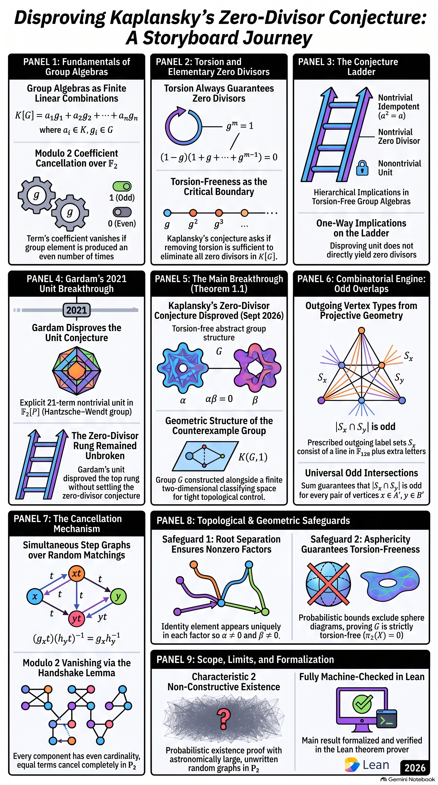

*AI-generated overview. It gets the mechanism right, but it has typos ("P₂" for 𝔽₂), a "top rung" in panel 4 that contradicts its own ladder, and an overstated Lean status in panel 9; see the [errata](assets/README.md#errata). The hand-made ladder in [section 1.4](#14-kaplanskys-three-conjectures) is the precise version.*

## Contents

- [TL;DR](#tldr)
- [How to read this](#how-to-read-this)
- [1. The problem](#1-the-problem)
- [2. A short history](#2-a-short-history)
- [3. What the paper proves](#3-what-the-paper-proves)
- [4. Why it matters](#4-why-it-matters)
- [5. The main idea of the proof](#5-the-main-idea-of-the-proof)
- [6. The people whose ideas this builds on](#6-the-people-whose-ideas-this-builds-on)
- [7. What it does not prove, and caveats](#7-what-it-does-not-prove-and-caveats)
- [8. Glossary](#8-glossary)
- [9. Slides, audio and other assets](#9-slides-audio-and-other-assets)
- [How this explainer was made](#how-this-explainer-was-made)

---

## TL;DR

- **The question.** Given a group $G$ and a field $K$, the **group algebra** $K[G]$ consists of finite formal sums of group elements with coefficients in $K$, multiplied using the group law. A **zero divisor** is a nonzero element $\alpha$ with $\alpha\beta = 0$ for some nonzero $\beta$. If $G$ has an element $g$ of finite order $m > 1$, zero divisors come for free: $(1-g)(1+g+\dots+g^{m-1}) = 1 - g^m = 0$. **Kaplansky's zero-divisor conjecture**, which goes back to Graham Higman's 1940 thesis and was posed by Irving Kaplansky in 1956, says that this is the only source: if $G$ is **torsion-free** (no elements of finite order except $`1`$), then $K[G]$ has no zero divisors.
- **What was known.** The conjecture was proved for large classes of groups: groups with *unique products* (including all left-orderable groups), elementary amenable groups, and, over $\mathbb{C}$, groups satisfying the Atiyah conjecture. In 2021 Giles Gardam disproved the companion **unit conjecture** with an explicit 21-term unit in $\mathbb{F}_2[P]$ for a small crystallographic group $P$. But $\mathbb{F}_2[P]$ has no zero divisors, so the zero-divisor conjecture survived.
- **What this paper proves.** There is a **finitely presented, torsion-free** group $G$ and **nonzero** elements $\alpha,\beta \in \mathbb{F}_2[G]$ with $\alpha\beta = 0$. The group even has a finite two-dimensional classifying space. (That is, a finite complex built from points, edges and triangles, with fundamental group $G$ and contractible universal cover; see section 3.) So the conjecture is false over the field with two elements.
- **How.** The group is built from two huge random labelled graphs by "coning off" their loops. A parity design (lines of a projective plane over $`\mathbb{F}_{128}`$) makes every term of $\alpha\beta$ appear an even number of times, so everything cancels mod 2. Most of the paper proves the two safeguards: the factors are not secretly $0$, and the group is really torsion-free. Probability, a planar separator theorem and topology do that work.
- **Why zero divisors are a stronger failure than units.** In any single algebra $K[G]$ with $G$ torsion-free, a zero divisor always produces a nontrivial unit, but not the other way round: Gardam's group has nontrivial units and no zero divisors. So this result also gives (by a standard argument, not stated in the paper) a new unit-conjecture counterexample.
- **What it doesn't do.** It covers only characteristic 2. The conjecture over $\mathbb{C}$, $\mathbb{Q}$ or $\mathbb{F}_p$ for odd $p$ is untouched, and so is the idempotent conjecture. The proof shows the group exists but never writes it down; the graphs are astronomically large. It is an AI-produced preprint, although its main theorem is listed as formalized in Lean.

## How to read this

| You have… | Read |
|---|---|
| 2 minutes | The TL;DR and the infographic above |
| 15 minutes | Sections 1, 3, 4 and 7 |
| An hour, and you like algebra | Everything, including [section 5](#5-the-main-idea-of-the-proof) and its [worked example](#the-mechanism-in-miniature-a-worked-example) |

---

## 1. The problem

### 1.1 Group algebras: polynomials whose "variables" are group elements

Take a group $G$ and a field $K$. An element of the **group algebra** $K[G]$ is a finite formal sum

```math
\alpha = \sum_{g \in G} a_g\ g, \qquad a_g \in K,\ \text{only finitely many } a_g \ne 0 .
```

The set of $g$ with $a_g \ne 0$ is the **support** of $\alpha$. You add coefficientwise, and you multiply by expanding and then using the group law on the group elements:

```math
\Big(\sum_g a_g\ g\Big)\Big(\sum_h b_h\ h\Big) = \sum_{k \in G}\Big(\sum_{gh = k} a_g b_h\Big)\ k .
```

Two examples help.

- **$`G = \mathbb{Z}`$.** Write the group multiplicatively, as powers $t^n$ of one generator. Then $K[\mathbb{Z}]$ is the ring of Laurent polynomials $K[t,t^{-1}]$. Its only units are the monomials $\lambda t^n$, and it has no zero divisors: the product of the top-degree terms of two nonzero polynomials can never cancel.
- **$`G`$ cyclic of order 3**, $\lbrace 1, g, g^2\rbrace$ with $g^3 = 1$. Here $K[G]$ is like polynomials in $g$ in which $g^3$ is replaced by $1$.

![Slide: the group algebra K[G] and how its elements multiply](assets/notebooklm/slides/slide-03.png)

The paper works over $\mathbb{F}_2 = \lbrace 0,1\rbrace$, where $1 + 1 = 0$. Then an element of $\mathbb{F}_2[G]$ is just a finite set of group elements, its support. A product $\alpha\beta$ is computed by listing all products $gh$ with $g$ in the support of $\alpha$ and $h$ in the support of $\beta$, and keeping exactly those group elements that occur an **odd** number of times. So $\alpha\beta = 0$ means every group element occurs an even number of times in that list. The whole paper is built around this one observation.

### 1.2 Zero divisors, units and idempotents

Three kinds of special elements matter. Each has a "trivial" version that every group algebra has.

| Kind | Definition | Trivial examples |
|---|---|---|
| **Zero divisor** | $\alpha \ne 0$ with $\alpha\beta = 0$ (or $`\beta\alpha = 0`$) for some $\beta \ne 0$ | none: a nonzero zero divisor is always "nontrivial" |
| **Unit** | $u$ with an inverse: $uv = vu = 1$ | $\lambda g$ with $\lambda \in K$ nonzero and $g \in G$, the *trivial units* |
| **Idempotent** | $e$ with $e^2 = e$ | $0$ and $1$ |

A ring with no zero divisors is called a **domain**.

### 1.3 Torsion forces zero divisors and can break the rest (a worked example)

Suppose $g \in G$ has finite order $m > 1$, so $g^m = 1$. Multiply out:

```math
(1-g)(1+g+g^2+\dots+g^{m-1}) = (1+g+\dots+g^{m-1}) - (g+g^2+\dots+g^{m}) = 1 - g^m = 0 .
```

For $m = 3$ this reads $(1-g)(1+g+g^2) = 1+g+g^2-g-g^2-g^3 = 1-g^3 = 0$. Both factors are nonzero, so $K[G]$ has zero divisors. Over $\mathbb{F}_2$ it is even quicker: if $g^2 = 1$, then $(1+g)^2 = 1 + 2g + g^2 = 0$.

Torsion can also break the other two properties. In $\mathbb{F}_2[\mathbb{Z}/3]$ the element $e = 1+g+g^2$ satisfies $e^2 = 3e = e$, a nontrivial idempotent. In $\mathbb{Q}[\mathbb{Z}/5]$ the element $u = -1+g+g^4$ has inverse $-1+g^2+g^3$, a nontrivial unit. This does not happen in every case: $\mathbb{F}_2[\mathbb{Z}/2]$ has zero divisors but only trivial units and idempotents. (We checked all of these with a short script.) So **"torsion-free" is the natural hypothesis**, and the paper's introduction puts it the same way: "The conjecture asks whether removing this obstruction suffices."

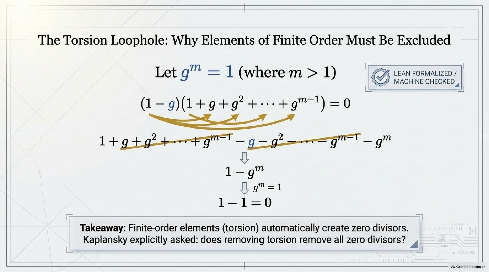

*The Lean badge on this slide is decoration: the torsion identity is not part of the formalization.*

### 1.4 Kaplansky's three conjectures

Let $K$ be a field and $G$ a torsion-free group.

1. **Unit conjecture:** every unit of $K[G]$ is trivial, $\lambda g$. Higman formulated it in his unpublished 1940 thesis, and Kaplansky later posed it alongside the zero-divisor conjecture in 1970.
2. **Zero-divisor conjecture:** $K[G]$ has no zero divisors. Higman's thesis also contains it. Kaplansky listed it as Problem 6 of a 1956 conference talk, published in 1957.
3. **Idempotent conjecture:** the only idempotents of $K[G]$ are $0$ and $1$.

These are not independent. As Gardam's paper records (citing Passman's textbook), **the unit conjecture implies the zero-divisor conjecture, which implies the idempotent conjecture, and these implications hold for each individual group algebra $K[G]$.** Read backwards, as statements about failures:

- **A nontrivial idempotent gives a zero divisor.** If $e^2 = e$ with $e \ne 0,1$, then $e(1-e) = e - e^2 = 0$, with both factors nonzero.
- **A zero divisor gives a nontrivial unit.** Here is our gloss of the standard argument. Suppose $\alpha\beta = 0$ with $\alpha,\beta \ne 0$. For a torsion-free group, $K[G]$ is a *prime ring*: if $\beta\gamma\alpha = 0$ for every $\gamma \in K[G]$, then $\beta = 0$ or $\alpha = 0$ (a theorem of Connell: this holds whenever $G$ has no nontrivial finite normal subgroup). Since $K[G]$ is spanned by the group elements, some group element $g$ makes $c = \beta g \alpha$ nonzero. Then $c^2 = \beta g(\alpha\beta)g\alpha = 0$, so $(1+c)(1-c) = 1 - c^2 = 1$ and $1 + c$ is a unit. It is not of the form $\lambda h$. Over $\mathbb{F}_2$, for instance, $1 + c = h$ would give $c^2 = (h+1)^2 = h^2 + 1$, which is nonzero unless $h^2 = 1$, and then $h = 1$ (no torsion) and $c = 0$.

So, in one fixed algebra, **idempotent failure ⇒ zero-divisor failure ⇒ unit failure.** That is the precise sense in which a zero divisor is a *stronger* failure than a nontrivial unit.

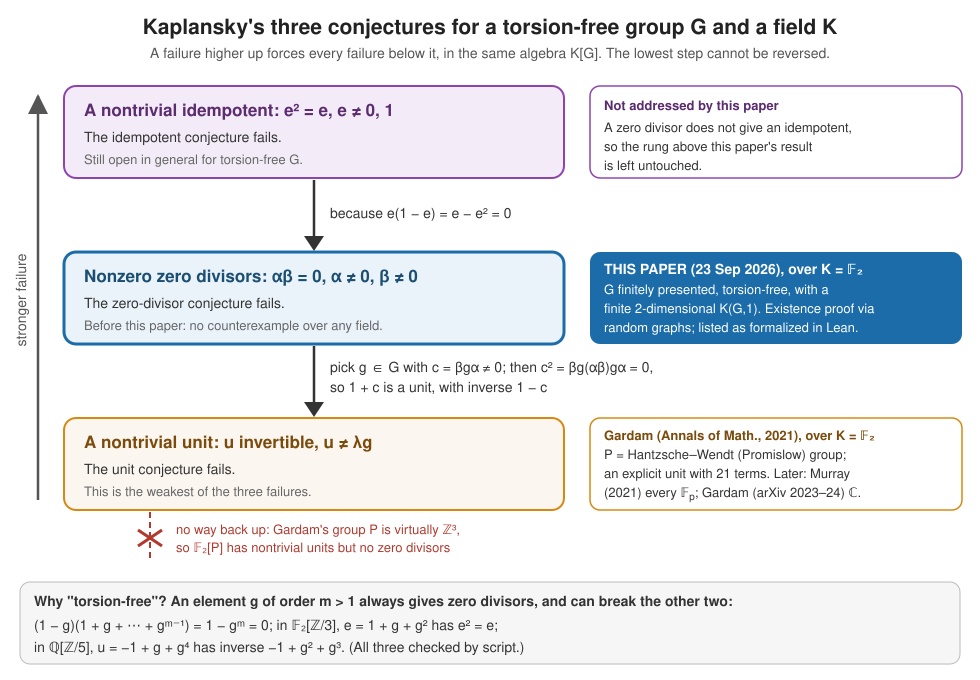

*Hand-made figure. Each failure forces the failures below it in the same algebra; the lowest step cannot be reversed.*

### 1.5 What was known: unique products, orderings, and Linnell's analytic methods

The positive results come from two very different directions.

**Combinatorics: unique products.** A group has the **unique-product property** if, for any two finite nonempty subsets $P,Q \subseteq G$, some element of $PQ = \lbrace pq\rbrace$ can be written as $pq$ in *exactly one* way. Apply this to the supports of $\alpha$ and $\beta$. The uniquely written element $pq$ gets coefficient $a_p b_q \ne 0$ in $\alpha\beta$, so $\alpha\beta \ne 0$. (This is the "top-degree terms" argument for $\mathbb{Z}$ in general form.) Unique products also give the unit conjecture, because they imply a "two unique products" property (Strojnowski, 1980). **Left-orderable groups**, those with a total order invariant under left multiplication, have unique products. Free groups, braid groups and right-angled Artin groups are examples. Gardam notes that before 2021, all proofs of the unit conjecture went through unique products.

**Other methods.**

- **Higman (1940)** proved both the unit and the zero-divisor statements for groups in which every nontrivial (finitely generated) subgroup maps onto $\mathbb{Z}$.
- **Kropholler, Linnell and Moody (1988)** proved the zero-divisor conjecture for all torsion-free **elementary amenable** groups, a class that contains all torsion-free virtually solvable groups, and even with division-ring coefficients. It follows for groups that are residually torsion-free elementary amenable.
- **Linnell (1993)** linked the conjecture over $\mathbb{C}$ to analysis. Gardam cites Linnell's paper (and Lück's book) for the fact that if $G$ satisfies the strong **Atiyah conjecture** about $L^2$-Betti numbers, then $\mathbb{C}[G]$ has no zero divisors. Linnell also proved many cases of the Atiyah conjecture.
- **Fisher and Sánchez-Peralta (2026)** proved the zero-divisor conclusion for torsion-free 3-manifold groups.
- For idempotents over $\mathbb{C}$, the Baum–Connes and Farrell–Jones conjectures imply the idempotent conjecture, and these are known for huge classes of groups, including hyperbolic groups.

The paper sums this up as "substantial positive results explain why torsion-freeness is a natural dividing line".

### 1.6 The unit conjecture falls: Promislow's group and Gardam 2021

Not every torsion-free group has unique products. Rips and Segev (1987) built the first counterexample, using small cancellation theory. Shortly afterwards, Promislow (1988) found an elementary one in the group

```math
P = \langle\ a, b \ \mid\ b^{-1}a^2b = a^{-2},\ \ a^{-1}b^2a = b^{-2}\ \rangle ,
```

known as the **Hantzsche–Wendt group**, the **Promislow group** or the Fibonacci group $F(2,6)$. It is the fundamental group of a flat 3-manifold. It contains $\mathbb{Z}^3$ (generated by $x = a^2$, $y = b^2$, $`z = (ab)^2`$) with quotient $\mathbb{Z}/2 \times \mathbb{Z}/2$, and it is torsion-free. Promislow found a 14-element set $A$ for which no element of $AA$ has a unique representation.

In 2021 **Giles Gardam** found a nontrivial unit in $\mathbb{F}_2[P]$ with a computer search based on Boolean satisfiability. Its support has 21 elements, and so does its inverse's. Murray extended this to $\mathbb{F}_p$ for every prime $p$ (2021), and Gardam later to $\mathbb{C}$ (preprint, 2023, revised 2024). We re-checked Gardam's unit by brute-force multiplication in a faithful matrix model of $P$ (see [the details in section 5](#gardams-unit-re-checked-by-script)).

There is a catch, and it is why this paper matters. $P$ is virtually abelian, so its group algebras **have no zero divisors** (it is elementary amenable). Gardam's unit therefore says nothing about zero divisors, and the arrow "zero divisor ⇒ unit" cannot be reversed. As Gardam wrote, if the zero-divisor conjecture is false, his paper "at least removes one psychological impediment to finding a counterexample". The paper under discussion makes the same point in one line: "a nontrivial unit is not a zero divisor."

---

## 2. A short history

| When | Who | What happened |
|---|---|---|
| 1940 | **Graham Higman** | D.Phil. thesis *Units in group rings*: formulates the unit and zero-divisor questions. The thesis and the paper *The units of group-rings* prove the unit and domain statements for groups whose nontrivial (finitely generated) subgroups all map onto $\mathbb{Z}$ |
| 1956 (publ. 1957) | **Irving Kaplansky** | *Problems in the theory of rings*: the zero-divisor problem is Problem 6 |
| 1965 | Kourovka Notebook | Lists the zero-divisor problem for integral group rings as a "well-known problem" |
| 1970 | **Irving Kaplansky** | *"Problems in the theory of rings" revisited*: poses the unit conjecture next to the zero-divisor conjecture |
| 1980 | **Andrzej Strojnowski** | Unique products imply "two unique products", hence the unit conjecture |
| 1987 | **Eliyahu Rips, Yoav Segev** | First torsion-free group without unique products |
| 1988 | **S. David Promislow** | A simple example: the Hantzsche–Wendt group $P$ has a 14-element set with no unique product |
| 1988 | **Peter Kropholler, Peter Linnell, John Moody** | Zero-divisor conjecture for torsion-free elementary amenable groups |
| 1993 | **Peter Linnell** | *Division rings and group von Neumann algebras*: the standard reference (as cited by Gardam) for deducing the zero-divisor conjecture over $\mathbb{C}$ from the strong Atiyah conjecture |
| 2015 | **Markus Steenbock** | A graphical small-cancellation treatment of the Rips–Segev groups |
| 2021 | **Giles Gardam** | The unit conjecture is false: an explicit 21-term unit in $\mathbb{F}_2[P]$ (Annals of Mathematics 194) |
| 2021 | **Alan Murray** | Nontrivial units in $\mathbb{F}_p[P]$ for every prime $p$ |
| 2023–24 | **Giles Gardam** | Nontrivial units of complex group rings (preprint) |
| 2024–26 | **Igor Mineyev; Manisha Garg and Mineyev; Henry Shin** | Geometric criteria that would yield zero divisors or units over $\mathbb{F}_2$, computational studies of them, and an obstruction to one route |
| 2026 | **Sam Fisher, Pablo Sánchez-Peralta** | Zero-divisor conclusion for torsion-free 3-manifold groups |
| 23 Sep 2026 | **OpenAI** (internal model) | This paper: a finitely presented torsion-free $G$ with zero divisors in $\mathbb{F}_2[G]$ |
| 4 Oct 2026 | **OpenAI** (family 197) | A torsion-free group algebra over $\mathbb{F}_2$ that is not directly finite, built on this paper's parity mechanism |

Sources: the paper's introduction and bibliography, Gardam's 2021 paper (for the 1965, 1970, 1980, 1988 Promislow and 2021 Murray rows), and the Wikipedia article on Kaplansky's conjectures. The 4 October row is from the family-197 preprint itself.

NotebookLM's sketch-note version of the story is below. It is a good overview, but "Final Resolution" overstates things (only characteristic 2 is settled), and its Fisher–Sánchez-Peralta panel drops "torsion-free" (see the [errata](assets/README.md#errata)).

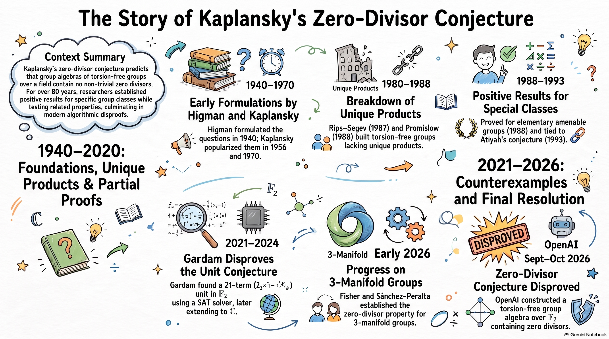

---

## 3. What the paper proves

> **Theorem 1.1.** There exist a finitely presented torsion-free group $G$ and nonzero elements $\alpha,\beta \in \mathbb{F}_2[G]$ such that $\alpha\beta = 0$. Moreover, $G$ admits a finite two-dimensional classifying space.

In plain words:

- **Finitely presented:** $G$ is given by finitely many generators (8,258 of them, one per edge of a "rose") and finitely many relations.
- **Torsion-free:** no element except $1$ has finite order. So none of the easy zero divisors of section 1.3 exist.
- **Zero divisors:** two nonzero finite sums $\alpha,\beta$ of group elements multiply to $0$ when coefficients are taken mod 2. The proof writes them as $\alpha = \sum_{x} g_x$ and $\beta = \sum_{y} h_y^{-1}$, sums of group elements read off two graphs (section 5).
- **Finite two-dimensional classifying space:** $G$ is the fundamental group of a finite complex $X$ built from points, edges and triangles, whose universal cover is contractible. This is what makes $G$ torsion-free, and it also shows that $G$ is topologically very tame.

The Lean 4 statement in the [Comparator challenge file](https://github.com/openai/math/blob/main/lean/ComparatorChallenges/TorsionFreeZeroDivisors.lean) reads:

```lean
def MainTheorem : Prop :=
  ∃ (G : Type) (inst : Group G),
    letI : Group G := inst
    Group.IsFinitelyPresented G ∧ TorsionFree G ∧
    HasFiniteTwoDimensionalClassifyingSpace G ∧
    ∃ α β : MonoidAlgebra (ZMod 2) G, α ≠ 0 ∧ β ≠ 0 ∧ α * β = 0

theorem main : MainTheorem
```

There, `TorsionFree G` means $g^n = 1$ with $n > 0$ forces $g = 1$. `HasFiniteTwoDimensionalClassifyingSpace G` asks for a connected, finite, Hausdorff CW complex with no cells above dimension 2 and at least one 2-cell, whose fundamental group is isomorphic to $G$ and which is covered by a contractible space.

The paper adds two remarks after the proof. $G$ does not have the unique-product property (it cannot, by section 1.5). And "the construction is probabilistic: it proves that suitable finite matchings exist, without specifying matchings from which a concrete presentation and zero-divisor factors can be read off."

Two consequences follow at once, although the paper does not state them. They are our deductions. First, every field $K$ of characteristic 2 contains $\mathbb{F}_2$, so $K[G]$ also has zero divisors. Second, by the argument in section 1.4, $\mathbb{F}_2[G]$ contains a nonzero $c$ with $c^2 = 0$, and $1 + c$ is a nontrivial unit. So $G$ is also a counterexample to the unit conjecture, in a group that is very different from Gardam's.

---

## 4. Why it matters

| | Before | After (if the preprint holds up) |
|---|---|---|
| **Zero-divisor conjecture** | Open since Higman (1940) and Kaplansky (1956), with no counterexample over any field | **False over $`\mathbb{F}_2`$**, hence over every field of characteristic 2 |
| **Unit conjecture** | False (Gardam 2021), but only in $P$ and related examples, where zero divisors provably don't exist | The new $G$ also has nontrivial units (standard argument, not in the paper) |
| **Unique products** | Known to fail in torsion-free groups (1987, 1988), but no failure had produced a zero divisor | The paper explains the gap: over $\mathbb{F}_2$ every product must be *represented an even number of times*, "not merely greater than one", and its construction achieves exactly that |
| **Tameness of the group** | Many geometric classes satisfy the conjecture | $G$ is finitely presented with a finite 2-dimensional $K(G,1)$, so these strong finiteness properties don't protect a group |
| **Method** | Small cancellation (Rips–Segev) and computer search (Gardam) | Random labelled graphs with a parity design, a planar separator theorem and direct topology. Family 197 reuses it |

**Relation to the unit conjecture.** The two counterexamples differ in kind:

- **Gardam's** is explicit, in a small virtually abelian group, and a computer checks it instantly. But it sits at the bottom of the ladder in the figure at the top: nontrivial units without zero divisors.
- **This paper's** is a pure existence proof in a huge, non-explicit group. But it sits one rung higher. By section 1.4, its zero divisors produce nontrivial units in the same algebra, while Gardam's units cannot produce zero divisors.

**Relation to family 197.** Family 197's torsion-free preprint, dated 4 October 2026, says that its method "develops the graph and cone construction" of this paper, which "supplies the parity mechanism for a zero product and the arrangement-exclusion strategy". It changes the parity design (adding seven labels organized by complements of lines in the Fano plane) so that one product comes out as $1$ and another as $0$. It claims $a,b,c \in \mathbb{F}_2[G']$ with $ab = 1$, $ac = 0$ and $c \ne 0$, so $ba \ne 1$: $\mathbb{F}_2[G']$ is not directly finite. Our own observation, not stated in either paper: if that claim holds, then $ba$ is a nontrivial idempotent ($`(ba)^2 = b(ab)a = ba`$, and $ba \ne 0$ because $a(ba)b = 1$), which would bear on the idempotent conjecture over $\mathbb{F}_2$; we have not checked this against the literature. Note that the [family-197 Lean scope](https://github.com/openai/math/blob/main/lean/docs/197.md) does not list that torsion-free preprint among its papers, and its formalized direct-finiteness statements do not claim torsion-freeness (the detailed one gives a group with an element of odd prime order).

---

## 5. The main idea of the proof

The 26-page paper has six sections: the introduction; Section 2 (Steps 1–3 below); Sections 3 and 4 (Step 9); Section 5 (the complex of Step 4, and Steps 6–8); and Section 6 (Steps 5 and 10). Here it is at three zoom levels.

### Level 1: the one-paragraph version

Over $\mathbb{F}_2$, a product $\alpha\beta$ is zero exactly when every group element appears an even number of times among the products of terms. Think of each term $g_x h_y^{-1}$ as flipping a light switch labelled by a group element; the product is zero if every switch is flipped an even number of times. The paper builds two huge random graphs whose vertices give the terms of $\alpha$ and $\beta$, and pairs up terms by "walking along the same edge label in both graphs at once". Such a walk never changes the group element. A clever design gives every pair of vertices an **odd** number of such common steps. By the handshake lemma, each cluster of linked terms then has an **even** size, so all switches end up off and $\alpha\beta = 0$. That part is short. Almost all of the rest of the paper makes sure the trick is not cheating: the factors could secretly be $0$ if the group collapsed, and the group could secretly have torsion, which would make the result worthless. Ruling out both comes down to showing that certain improbable patterns of coinciding paths never occur in the random graphs.

### Level 2: the step-by-step picture

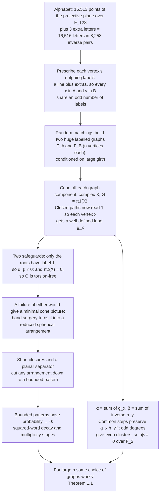
```mermaid
flowchart TD
    A["Alphabet: 16,513 points of the projective plane over F_128<br/>plus 3 extra letters = 16,516 letters in 8,258 inverse pairs"] --> B["Prescribe each vertex's outgoing labels:<br/>a line plus extras, so every x in A and y in B<br/>share an odd number of labels"]
    B --> C["Random matchings build two huge labelled graphs<br/>Γ_A and Γ_B (n vertices each),<br/>conditioned on large girth"]
    C --> D["Cone off each graph component: complex X, G = π1(X).<br/>Closed paths now read 1, so each vertex x<br/>gets a well-defined label g_x"]
    D --> E["α = sum of g_x, β = sum of inverse h_y.<br/>Common steps preserve g_x h_y⁻¹; odd degrees<br/>give even clusters, so αβ = 0 over F_2"]
    D --> F["Two safeguards: only the roots have label 1,<br/>so α, β ≠ 0; and π2(X) = 0,<br/>so G is torsion-free"]
    F --> G["A failure of either would give a minimal cone picture;<br/>band surgery turns it into a<br/>reduced spherical arrangement"]
    G --> H["Short closures and a planar separator<br/>cut any arrangement down to a bounded pattern"]
    H --> I["Bounded patterns have probability → 0:<br/>squared-word decay and multiplicity stages"]
    I --> J["For large n some choice of graphs works:<br/>Theorem 1.1"]
    E --> J
```

**Step 1: an alphabet and a rose.** Take $q = 128$ and the projective plane over the field $\mathbb{F}_{128}$. It has $v = q^2+q+1 = 16{,}513$ points and as many lines, each line has $q + 1 = 129$ points, and any two distinct lines meet in exactly one point. The letters are the 16,513 points plus three extra letters $e_1, e_2, e_3$, so 16,516 letters in all. They are paired off into 8,258 "inverse pairs" $t, \bar t$. The **rose** $F$ is a graph with one vertex and one loop for each pair; its fundamental group is the free group on 8,258 generators.

**Step 2: odd overlaps by design.** There are two vertex sets $A$ and $B$ with $n$ vertices each. Each vertex $x$ gets a set $S_x$ of outgoing labels: a line of the plane, plus extras. On the $A$ side the extras are either none or exactly two of $e_1,e_2,e_3$. On the $B$ side they are either none or all three. Two lines share $1$ or $129$ points (odd either way) and the extra parts share $0$ or $2$ letters (even), so

```math
|S_x \cap S_y| \ \text{is odd for every } x \in A,\ y \in B .
```

The paper stresses that this is built in before any randomness, so the random choices "can now be used entirely to control the geometry without risking this condition".

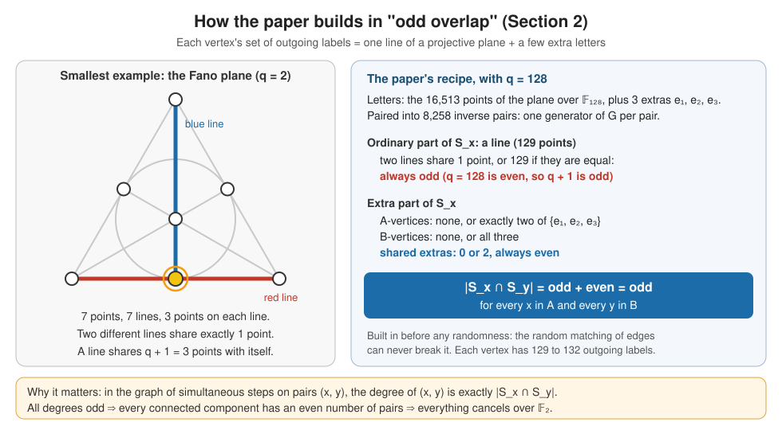

**Step 3: random graphs.** For each inverse pair $t,\bar t$ and each side, the vertices carrying $t$ are matched at random with the vertices carrying $\bar t$. Each matched pair becomes an edge, read $t$ in one direction and $\bar t$ in the other. Every vertex uses each outgoing letter exactly once, so the graphs $\Gamma_A$, $\Gamma_B$ **immerse** into the rose: walking along the graph without turning back spells out a reduced word. The random choice is conditioned on the **girth** (shortest cycle) being at least $L = \lfloor c \log n\rfloor$, with $c = 1/100$ allowed. A switching argument shows this conditioning is possible and keeps the probability of any prescribed edge at most about $1/(np)$, where $np$ is the number of vertices carrying a given letter (Lemma 2.2). With probability tending to $1$, every component also has diameter $O(\log n)$ (Lemma 2.3).

**Step 4: cones and the group.** For each connected component of $\Gamma = \Gamma_A \sqcup \Gamma_B$, glue a **cone** (a point joined to every vertex and edge) onto the rose along the labelling map. The result is a finite two-dimensional complex $X$, and $G = \pi_1(X)$. A cone kills every closed path in its graph, so the word read along any closed path becomes $1$ in $G$. Therefore the label $g_x$ of a path from a chosen root $x_A$ to a vertex $x$ does not depend on the path. Define $h_y$ the same way from a root $x_B$, and set

```math
\alpha = \sum_{x \in A'} g_x, \qquad \beta = \sum_{y \in B'} h_y^{-1} \qquad \text{in } \mathbb{F}_2[G],
```

where $A'$ and $B'$ are the vertex sets of the roots' components.

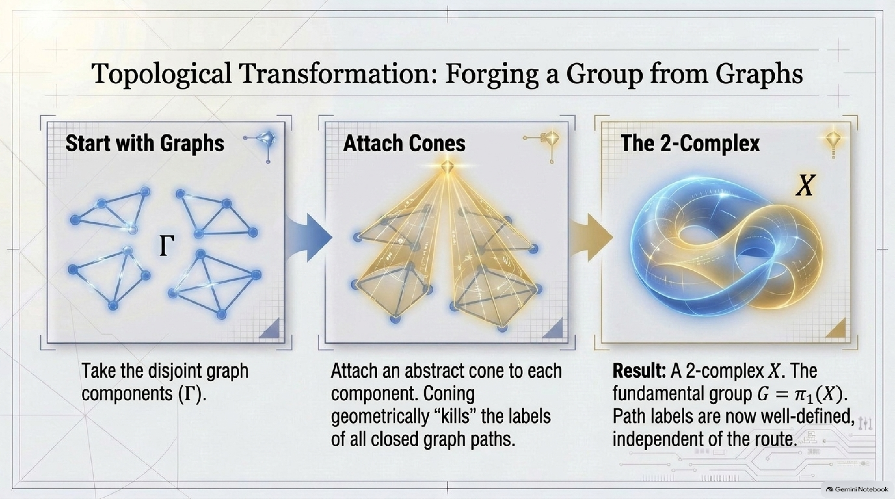

*The slide draws the graph components as triangles. The paper's graphs have girth at least L, so they have no short cycles.*

**Step 5: the zero product (Section 6 of the paper).** Expanding, $\alpha\beta$ is the sum of $g_x h_y^{-1}$ over all pairs $(x,y)$. Make a graph on the pairs. Join $(x,y)$ to $(x',y')$ when a common label $t$ leads from $x$ to $x'$ in $\Gamma_A$ and from $y$ to $y'$ in $\Gamma_B$. Such a step does not change the term:

```math
g_{x'}h_{y'}^{-1} = (g_x t)(h_y t)^{-1} = g_x t\ t^{-1} h_y^{-1} = g_x h_y^{-1} .
```

The degree of $(x,y)$ is $|S_x \cap S_y|$, which is odd. In any finite graph the degrees add up to twice the number of edges (the **handshake lemma**), so a component in which every degree is odd has an even number of vertices. All pairs in a component carry the same group element, an even number of times, so they cancel over $\mathbb{F}_2$. Hence $\alpha\beta = 0$.

**Step 6: safeguard 1, the factors are not zero.** If the group collapsed, many $g_x$ could be equal and cancel each other. The paper proves that a path from a root to *any different* vertex has a nontrivial label (Proposition 5.1). Then the root is the only term of $\alpha$ equal to the identity, so the identity has coefficient $1$ and $\alpha \ne 0$; the same goes for $\beta$. The paper notes that it never needs to know whether two non-root labels are equal.

**Step 7: safeguard 2, the group is torsion-free.** The paper proves $\pi_2(X) = 0$ (Proposition 5.1). The universal cover of $X$ is then a simply connected 2-complex with no second homology, hence contractible (Hurewicz and Whitehead), so $X$ is a finite two-dimensional $K(G,1)$. A group with a finite-dimensional classifying space has no torsion: a cyclic group of prime order $\ell$ has nonzero cohomology $H^k(\mathbb{Z}/\ell;\ \mathbb{F}_\ell) \cong \mathbb{F}_\ell$ in every degree $k$, which a resolution of length 2 cannot produce (Corollary 5.3).

**Step 8: both safeguards reduce to one combinatorial statement.** If either safeguard failed, there would be a map of a sphere (for $`\pi_2`$) or of a disk (for a trivial root-to-vertex label) into $X$. Such a map can be drawn as a **cone picture**: disks that map into cones, whose boundaries read closed paths in $\Gamma$, and arcs in between that pair each letter occurrence with an inverse letter occurrence. Take a picture of least total boundary length. If an arc ever joins two occurrences of the *same* graph edge, a "band surgery" merges or splits disks and shortens the picture by two, contradicting minimality (four cases, tabulated in Section 5.3). So a minimal failure is a **reduced spherical arrangement**: every paired occurrence uses a different underlying edge from its partner (Definition 4.1).

**Step 9: such arrangements do not exist.** This is the probabilistic heart of the paper.

- **Bounded patterns are unlikely (Proposition 3.1).** Take a system of at most $K$ paths of total length between $L$ and $CL$, almost completely paired up by at most $I$ interval comparisons, with at most an $\varepsilon$-fraction of unpaired positions. The probability that the random graphs contain one tends to $0$. The key input is a "squared-word" estimate (Lemma 2.1). Roughly, it says that the turn frequencies make it exponentially rare, in the length of the word, for two different readings along the graphs to spell the same long word.
- **Every arrangement contains a bounded pattern (the proof of Proposition 4.5).** An arrangement may have any number of disks and any total length. Long boundary paths are cut into pieces and closed up cheaply (Lemma 4.2). The pairing between pieces is a planar graph, so the Lipton–Tarjan separator theorem removes a small fraction of pieces and leaves clusters of at most $K$ pieces (Lemma 4.4). At least $5/16$ of the total length survives in clusters that satisfy the bounded-pattern conditions.

The order of choices is the crux: $\varepsilon$ is fixed *before* $K$, $C$ and $I$, so one fixed bounded class catches every large arrangement, and no union bound over all sizes is needed.

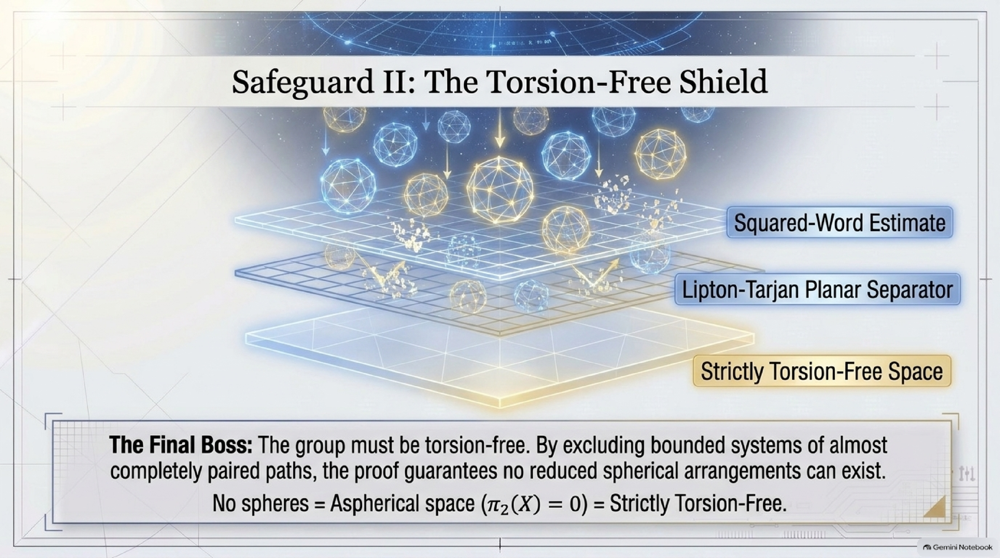

*Strictly, asphericity of X makes X a finite K(G,1), and that is what makes the group G torsion-free.*

**Step 10: conclusion.** With probability tending to $1$ there is no reduced spherical arrangement, so for every large enough admissible $n$ some choice of matchings has both safeguards. Theorem 1.1 follows.

### The mechanism in miniature (a worked example)

Steps 4–5 can be run by hand on tiny graphs that satisfy the odd-overlap rule. Let $\Gamma_A$ be a single edge $u \to w$ labelled $t$, so $S_u = \lbrace t\rbrace$ and $S_w = \lbrace t^{-1}\rbrace$. Let $\Gamma_B$ be a directed $m$-cycle with every edge labelled $t$, so every $S_y = \lbrace t,t^{-1}\rbrace$. Every pair shares exactly one label. Coning off the cycle forces $t^m = 1$, so $G = \mathbb{Z}/m$, which has torsion once $m \ge 2$.

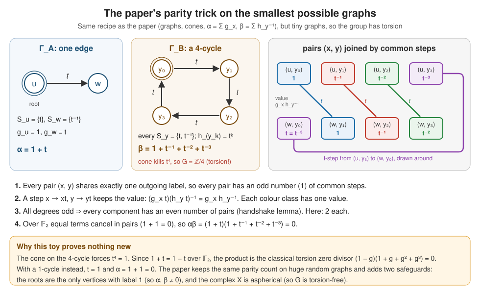

Then $\alpha = 1 + t$ and $\beta = 1 + t^{-1} + \dots + t^{-(m-1)}$. Our script builds the pair graph and computes $\alpha\beta$ in $\mathbb{F}_2[\mathbb{Z}/m]$ directly:

| $m$ | Degrees in the pair graph | Component sizes | $\alpha$ | $\alpha\beta$ |
|---|---|---|---|---|
| 1 | all 1 | 2 | $0$ (collapsed: $`t = 1`$) | $0$ |
| 2 | all 1 | 2, 2 | $1 + t$ | $0$ |
| 3 | all 1 | 2, 2, 2 | $1 + t$ | $0$ |
| 4 | all 1 | 2, 2, 2, 2 | $1 + t$ | $0$ |
| 5 | all 1 | 2, 2, 2, 2, 2 | $1 + t$ | $0$ |

Over $\mathbb{F}_2$, $1 + t = 1 - t$, so this is exactly the torsion zero divisor $(1-g)(1+g+\dots+g^{m-1}) = 0$ of section 1.3. The parity count works perfectly, and **both safeguards fail**. For $m = 1$ the factor $\alpha$ collapses to $0$, and for $m \ge 2$ the cone creates torsion. That is why almost all of the paper is about the safeguards.

We also ran the paper's typed random model, shrunk to the Fano plane ($`q = 2`$, $n = 98$ vertices per side, 9,604 pairs) and without the girth conditioning, on three random seeds. Every pair had odd degree, and all components (about 1,070–1,090 of them, with sizes from 2 up to about 6,600) had even size, as the handshake lemma predicts. This checks only the counting half of the argument. With graphs this small, nothing like the safeguards can be expected to hold.

### Level 3: the engine, for readers who know some topology

**The squared-word estimate (Lemma 2.1).** For a turn from letter $t$ to letter $u$, let $w(t,u)$ be the frequency of $u$ among $B$-vertices that contain $\bar t$, and give a word the weight $P(W) = \prod_i w(t_i,t_{i+1})$. Then $\sum_{W \in T^h} P(W)^2 = \mathbf 1^{\mathsf T} M^{h-1} \mathbf 1$ with $M_{t,u} = w(t,u)^2$. The paper uses the test vector $f$ (equal to $5$ on the three letters whose inverse is extra, $1$ elsewhere) and shows $Mf \le \frac{149}{150} f$. That gives $\sum_W P(W)^2 \le e^{-h/300}$ for $h \ge 3002$, so $\delta = 1/600$ works. We re-checked the two exact fractions in the proof: $500731261911/504183783481 \approx 0.993152$ for ordinary letters and $820350863/1363395845 \approx 0.601697$ for extra ones, both below $149/150 \approx 0.993333$. The paper does not say why it picks $q = 128$. Evaluating its ordinary-letter bound $q/(q+1) + 3p^2 + 12/(q+1)^2$ at other even $q$ (the parity design needs $q + 1$ odd; our computation) gives $2.55$, $1.45$ and $1.08$ for $q = 2, 4, 8$, so for small planes the bound used in the proof exceeds $1$. It first drops below $1$ at $q = 16$.

**Counting patterns (Proposition 3.1).** The actual image of a path system is a graph with boundedly many marked chains, because of the girth bound. Sorting edges by how many times the paths traverse them gives multiplicity stages $\Delta_j$, whose vertex and edge counts satisfy $\sum_j (V_j - E_j - k_j) \le 0$. This controls the total power of $n$. Simultaneous Diophantine approximation picks a block length $s$, growing at least like a fixed power of $L$, for which all comparisons nearly align blocks. Word weights are then binned, and the squared-word estimate bounds the number of words in each bin. Multiplying the stage-by-stage expectation bounds gives at most $e^{-\delta H/4}$, so at least one stage has small expectation. Markov's inequality applied to that stage, plus a union bound over $e^{o(L)}$ enlarged patterns, finishes the proof. No independence between stages is used. The constant is $\varepsilon = \min\lbrace 1/4,\ \delta/(16(1+a_0))\rbrace$.

**Planar extraction (Section 4).** An Euler-characteristic count over the complementary regions of the disks and arcs, $\sum_Q (l_Q - 2\chi(Q)) = 2N - 4$, shows that the pairing of $N'$ pieces is described by at most $6N'$ interval pairs (Lemma 4.3). Applied recursively, the Lipton–Tarjan theorem deletes at most $C_{\mathrm{sep}}\ m/\sqrt{K}$ vertices of a planar graph with $m$ vertices and leaves components of size at most $K$, where $C_{\mathrm{sep}} = 2\sqrt2/(1-\sqrt{2/3}) \approx 15.41$ (Lemma 4.4). The parameters are chosen in the order "types, $c$, $\delta$; $\varepsilon$, $d$; $D$; $U$; $\eta$; $K$; $C$, $I$; $n$".

**Topology (Section 5).** To get cone pictures, each cone is temporarily replaced by a homotopy-equivalent space with one disk per basis loop of the graph component; then come piecewise-linear approximation and transversality (Lemma 5.2). In the sphere case, the band surgery that splits a sphere in two keeps one part essential. This uses the Hurewicz isomorphism $\pi_2(\widetilde X) \cong H_2(\widetilde X;\mathbb{Z})$, under which the original class is the sum of the two new ones. The paper does this surgery directly and explicitly does not invoke a small-cancellation or $\mathrm{CAT}(0)$ criterion. For torsion-freeness, the augmented cellular chains of $\widetilde X$ form a free $\mathbb{Z}G$-resolution of $\mathbb{Z}$ of length two. Restricted to a subgroup of prime order $\ell$, this contradicts the periodic resolution, whose cohomology with $\mathbb{F}_\ell$ coefficients is nonzero in every degree.

<details>
<summary><b>Gardam's unit, re-checked by script</b></summary>

<a id="gardams-unit-re-checked-by-script"></a>

Gardam's Theorem A: in $P$ as in section 1.6, with $x = a^2$, $y = b^2$, $z = (ab)^2$, set

```math
\begin{aligned}
p &= (1+x)(1+y)(1+z^{-1}), & q &= x^{-1}y^{-1} + x + y^{-1}z + z,\\
r &= 1 + x + y^{-1}z + xyz, & s &= 1 + (x + x^{-1} + y + y^{-1})z^{-1}.
\end{aligned}
```

Then $p + qa + rb + sab$ is a nontrivial unit of $\mathbb{F}_2[P]$. We realized $P$ faithfully as affine maps of $\mathbb{R}^3$: $a$ and $b$ are half-turn screw motions with orthogonal axes, and $x, y, z$ become the translations by $(1,0,0)$, $(0,1,0)$ and $(0,0,-1)$. We built the inverse from Gardam's Lemma 1 ($`p' = x^{-1}p^a`$, $q' = x^{-1}q$, $r' = y^{-1}r$, $s' = z^{-1}s^a$, with signs irrelevant mod 2) and multiplied out by brute force. Both supports have 21 elements, and both products equal $1$. This is the kind of explicit check that the zero-divisor paper does not allow, because its group is never written down.

</details>

---

## 6. The people whose ideas this builds on

| Person | Idea | Where it shows up |
|---|---|---|
| **Graham Higman** | The unit and zero-divisor questions (1940); proofs for groups mapping onto $\mathbb{Z}$ | The problem itself |
| **Irving Kaplansky** | Popularized the conjectures (1956, 1970) | The problem itself |
| **Eliyahu Rips, Yoav Segev; Markus Steenbock** | Torsion-free groups without unique products (1987; graphical treatment 2015) | Background: unique products must fail, and do fail for $G$ |
| **S. David Promislow** | The simple non-unique-product example in the Hantzsche–Wendt group (1988) | Background: the group of Gardam's counterexample |
| **Peter Kropholler, Peter Linnell, John Moody; Peter Linnell** | Elementary amenable groups (1988); analytic methods via the Atiyah conjecture (1993) | Background: the positive results $G$ must escape |
| **Giles Gardam** | The unit-conjecture counterexample (2021), and over $\mathbb{C}$ (2023–24) | Background and comparison |
| **Mikhail Gromov** | Random graphical presentations ("random walk in random groups") | Antecedent for building groups from random graphs |
| **Yann Ollivier, Dominik Gruber, Vadim Bereznyuk** | Graphical small cancellation, asphericity criteria, spherical diagrams | Antecedents for the topology; their criteria are not invoked |
| **Richard Lipton, Robert Tarjan** | The planar separator theorem (1979) | Lemma 4.4: cutting arrangements into bounded clusters |
| **Witold Hurewicz, J. H. C. Whitehead** (via Hatcher's textbook) | $\pi_2 \cong H_2$ for simply connected spaces; homology detects contractibility | Lemma 5.2, the sphere surgery, Corollary 5.3 |
| **Kenneth Brown** | Cohomology of groups (textbook) | The periodic resolution of a cyclic group, Corollary 5.3 |
| **Igor Mineyev, Manisha Garg, Henry Shin** | Geometric criteria for zero divisors over $\mathbb{F}_2$, and an obstruction to one route | Related approaches; the paper supplies its own proofs instead |

---

## 7. What it does not prove, and caveats

> [!IMPORTANT]
> **Only characteristic 2.** The theorem is about $\mathbb{F}_2$, and so, trivially, about every field containing it. The cancellation is mod-2 parity, which uses $1 + 1 = 0$. Nothing in the paper addresses the zero-divisor conjecture over $\mathbb{C}$ or $\mathbb{Q}$, where it is tied to the Atiyah conjecture, or over $\mathbb{F}_p$ for odd $p$. As far as this paper goes, those cases remain open.

> [!WARNING]
> **Not explicit, and astronomically large.** The proof shows that suitable random matchings *exist*. It gives no concrete presentation and no concrete $\alpha,\beta$. The admissible sizes $n$ are multiples of $2v^2 = 545{,}358{,}338$, and $n$ must be "sufficiently large". By our own arithmetic, the girth bound $L = \lfloor c\log n\rfloor$ with the suggested $c = 1/100$ only reaches the value $3$ (which the proof uses) once $n \ge e^{300} \approx 2\times 10^{130}$. That is only a first lower bound. The block lengths in Section 3 of the paper never exceed $L$, and by our computation the squared-word sum of Lemma 2.1 only drops below $1$ for words of about 1,345 letters or more, so the argument as written needs $L$ of at least about 1,345, that is $\log n$ of at least about 134,000 when $c = 1/100$. Compare Gardam's 21-term unit, which a computer verifies in a fraction of a second.

> [!NOTE]
> **Other conjectures.** A zero divisor does not produce an idempotent, so this paper says nothing about the idempotent conjecture. The many positive results remain true. They imply that $G$ lies outside every class of groups for which the conjecture is known over $\mathbb{F}_2$: it has no unique products (the paper says so), so it is not left-orderable, and by our deduction it is not locally indicable and not (residually torsion-free) elementary amenable.

> [!NOTE]
> **Provenance.** The paper was produced by an unreleased internal OpenAI model as part of the [openai/math](https://github.com/openai/math) release. According to that repository's README, most results came from the same fixed procedure, averaging about three hours of ChatGPT Pro thinking compute per result. The two listed exceptions are a zero-free region for the Riemann zeta function and the Hodge Conjecture for CM abelian varieties; family 196 is not among them. There is no released reasoning summary for family 196.

> [!NOTE]
> **Verification status.** The [Lean scope document for family 196](https://github.com/openai/math/blob/main/lean/docs/196.md) says the formalized result constructs a finitely presented torsion-free group $G$ and nonzero $\alpha,\beta \in \mathbb{F}_2[G]$ with $\alpha\beta = 0$, and that the same group admits a finite two-dimensional $K(G,1)$. [`lean/formalization.yaml`](https://github.com/openai/math/blob/main/lean/formalization.yaml) lists the paper as a source and `OAI.TorsionFreeZeroDivisors.main` (file `OAI/Algebra/GroupRing/Main.lean`) among its main results, checkable with the Comparator tool with permitted axioms `propext`, `Quot.sound` and `Classical.choice`. The challenge statement covers the whole theorem, including the "Moreover" clause. The [solution directory](https://github.com/openai/math/tree/main/lean/OAI/Algebra/GroupRing) holds 124 Lean files (about 2 MB), importing only Mathlib outside that directory, and contains no `sorry`. Some docstrings there are out of date: in `ConcreteGroup.lean` the definition `SeparatorObligation` is described as "NOT proved" and as an "unclosed dependency", but `PlanarMap.lean` proves it as the theorem `separator_obligation`, and `TypedComponent.lean` uses that theorem in the chain of results leading to `main` (checked on 7 October 2026). The catalogue-wide `review` field of `formalization.yaml` reads `unchecked`. This explainer did not re-run the Lean build. As of October 2026 the paper is a preprint; the usual next step is independent review by experts.

> [!TIP]
> **Simplifications.** To stay readable, this explainer leaves out the uniform error terms in the switching lemma, the precise bookkeeping of interval pairs and break points, the PL approximation in the topology, and all the "sufficiently large" thresholds. Every precise statement is in the paper.

---

## 8. Glossary

| Term | Meaning |
|---|---|
| **Group algebra** $K[G]$ | Finite formal sums $\sum a_g g$ with $a_g \in K$, multiplied using the group law |
| **Support** | The finite set of group elements with nonzero coefficient |
| **$`\mathbb{F}_2`$** | The field $\lbrace 0,1\rbrace$ with $1 + 1 = 0$ |
| **Zero divisor** | A nonzero $\alpha$ with $\alpha\beta = 0$ for some nonzero $\beta$ |
| **Unit; trivial unit** | An invertible element; a unit of the form $\lambda g$ |
| **Idempotent** | An element $e$ with $e^2 = e$; the trivial ones are $0$ and $1$ |
| **Torsion; torsion-free** | An element $g \ne 1$ with $g^m = 1$ for some $m > 0$; a group with no such elements |
| **Kaplansky's conjectures** | For torsion-free $G$ and any field $K$: $K[G]$ has only trivial units, no zero divisors, and only trivial idempotents |
| **Unique-product property** | Any two finite nonempty subsets have a product $pq$ that arises in exactly one way |
| **Left-orderable group** | A group with a total order preserved by left multiplication; such groups have unique products |
| **Elementary amenable** | The groups built from finite and abelian groups by taking subgroups, quotients, extensions and directed unions; the zero-divisor conjecture holds for the torsion-free ones |
| **Hantzsche–Wendt (Promislow) group** $P$ | A torsion-free crystallographic group containing $\mathbb{Z}^3$ with index 4; the group of Gardam's unit |
| **Finitely presented** | Given by finitely many generators and finitely many relations |
| **Classifying space** $K(G,1)$; **aspherical** | A connected space with fundamental group $G$ and contractible universal cover; a space whose universal cover is contractible |
| **Rose** | A graph with one vertex and one loop per generator; its fundamental group is free |
| **Signed alphabet** | Letters paired with inverse letters $t \leftrightarrow \bar t$ |
| **Immersion** (of a labelled graph) | Each label leaves each vertex at most once, so paths that never turn back spell reduced words |
| **Girth** | The length of the shortest cycle in a graph |
| **Cone** (on a graph) | A new point joined to every vertex and edge; gluing it in kills every closed path |
| **Projective plane over** $\mathbb{F}_q$ | $q^2+q+1$ points and as many lines; two distinct lines meet in one point; each line has $q + 1$ points |
| **Handshake lemma** | In a finite graph the degrees add up to twice the number of edges, so the number of odd-degree vertices is even |
| **Cone picture; reduced spherical arrangement** | A drawing of a sphere or disk map into $X$ as disks plus pairing arcs; a minimal one in which no arc pairs two uses of the same graph edge |
| **Planar separator theorem** | Lipton–Tarjan: a planar graph on $s$ vertices can be split into pieces of size at most $2s/3$ by deleting $O(\sqrt{s})$ vertices |
| **Direct finiteness** | $ab = 1$ implies $ba = 1$ (the subject of family 197) |
| **Lean 4, Comparator** | A proof assistant that checks every step of a proof, and a tool that checks that a formal proof matches a published statement and uses only allowed axioms |

---

## 9. Slides, audio and other assets

Everything below except the three hand-made figures was generated with **Google NotebookLM** (now "Gemini Notebook") from the paper, Gardam's 2021 paper, the Lean scope document and the Wikipedia article on Kaplansky's conjectures. The report used only the paper, the Lean scope document and Gardam's paper; the mind map used only the paper and the Lean scope document. The outputs are kept exactly as NotebookLM produced them; the slide deck was not revised. They are AI-generated, so see the [errata](assets/README.md#errata) before relying on any detail.

| Asset | What it is |
|---|---|
| [Slide deck (PDF)](assets/notebooklm/slides.pdf) ([PPTX](assets/notebooklm/slides.pptx)) | 15 beginner slides. Slides 2, 10, 12, 14 and 15 have errors, the worst being slide 15's invented Lean code |
| [Infographic: overview](assets/notebooklm/infographic-overview.png) | The nine-panel summary shown at the top |
| [Infographic: history timeline](assets/notebooklm/infographic-history-timeline.png) | From Higman (1940) to 2026, in sketch-note style |
| [Audio overview (about 85 s)](assets/notebooklm/audio-overview-brief.m4a) | A short podcast-style summary (not reviewed) |
| [Beginner report](assets/notebooklm/beginner-explainer-report.md) | NotebookLM's long-form written explainer. Its walk-through of the construction is accurate; a few formulas and its history table have errors |
| [Mind map](assets/notebooklm/mindmaps.md) | How the proof fits together |
| [Three conjectures](assets/figures/three-conjectures.svg) ([PNG](assets/figures/three-conjectures.png)) | Hand-made: the ladder idempotent ⇒ zero divisor ⇒ unit, with Gardam 2021 and this paper placed on it |
| [Odd intersections](assets/figures/odd-intersections.svg) ([PNG](assets/figures/odd-intersections.png)) | Hand-made: the paper's parity design, lines of a projective plane plus extra letters |
| [Parity in miniature](assets/figures/parity-in-miniature.svg) ([PNG](assets/figures/parity-in-miniature.png)) | Hand-made: Steps 4–5 run on a one-edge graph and a 4-cycle, showing why the safeguards are needed |

<details>
<summary><b>All 15 slides</b> (click to expand; see the errata first)</summary>

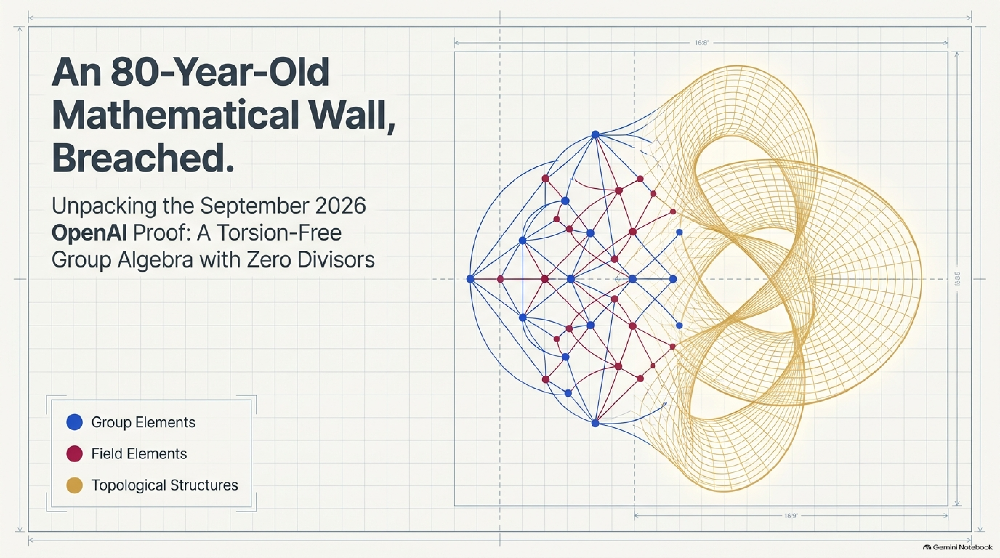

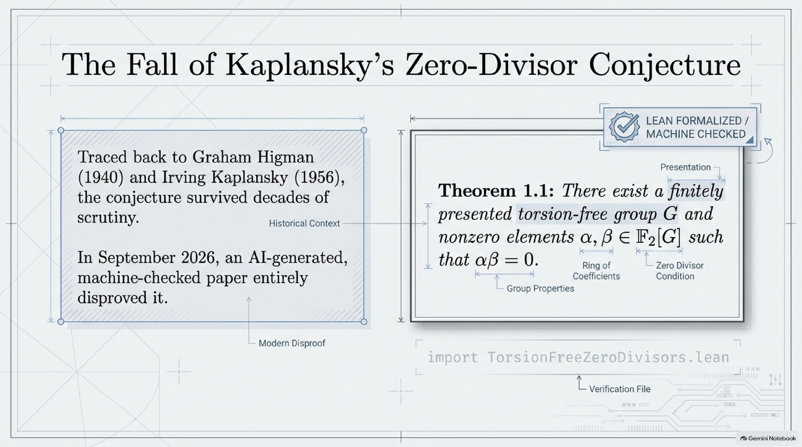

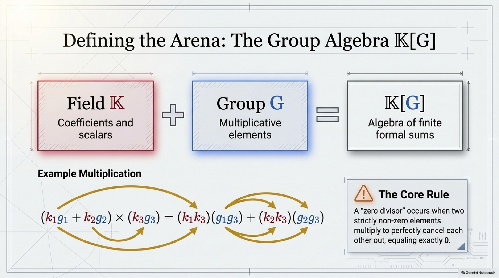


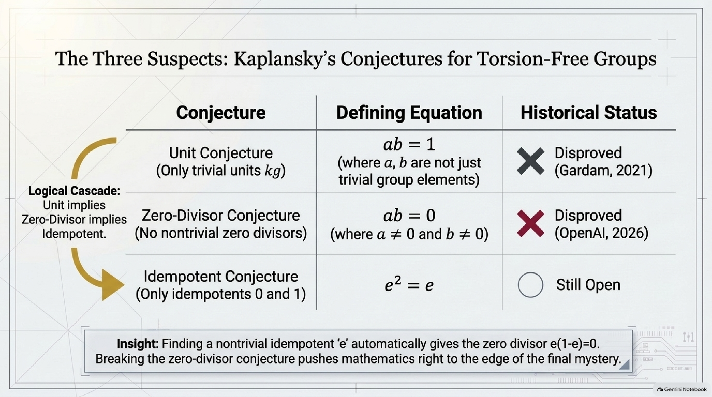

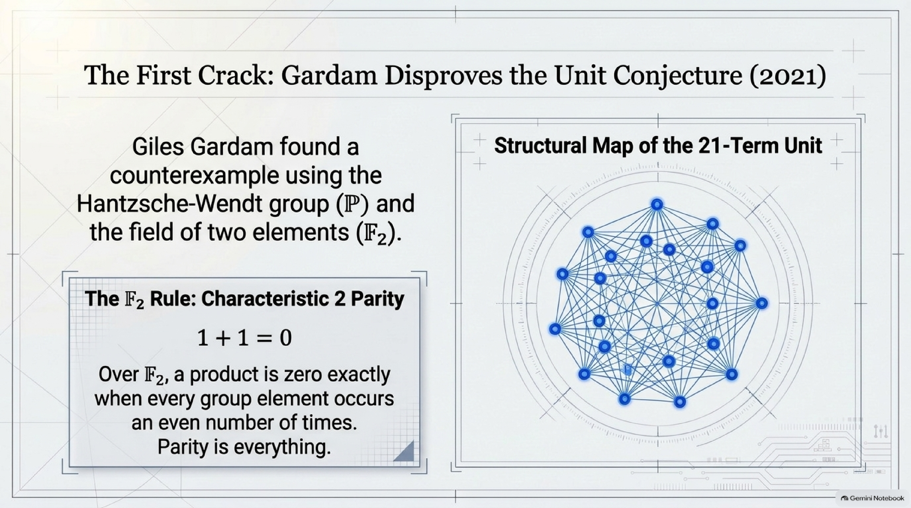

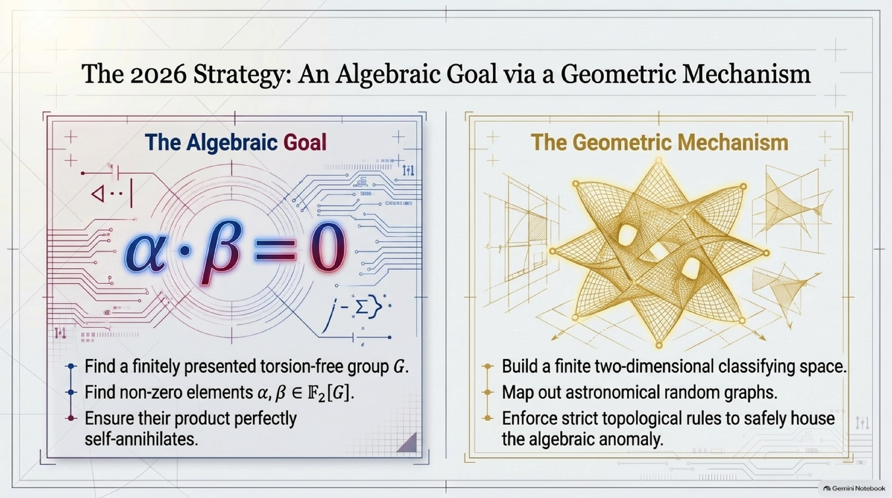

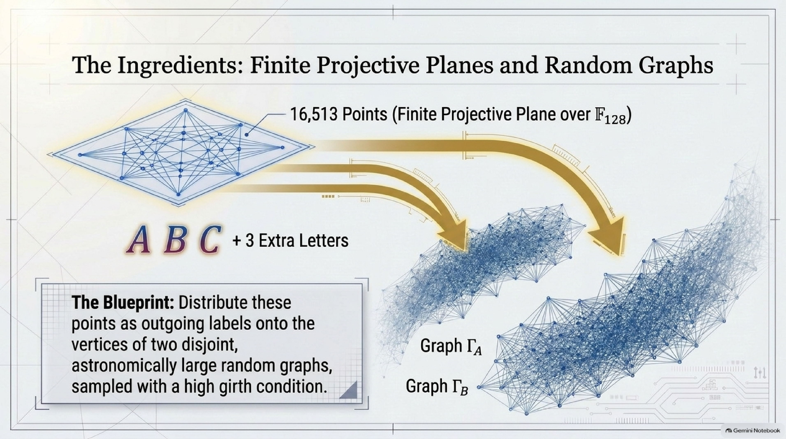

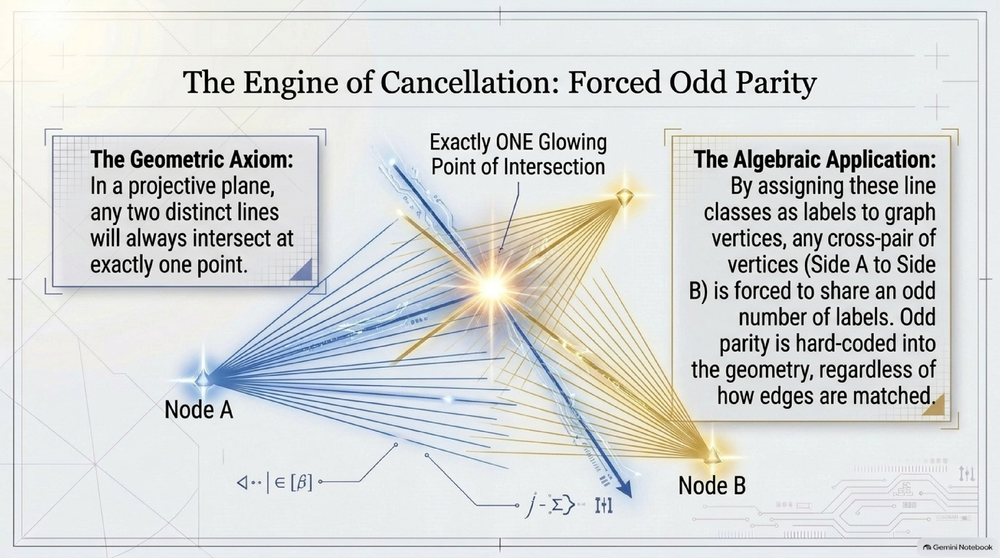

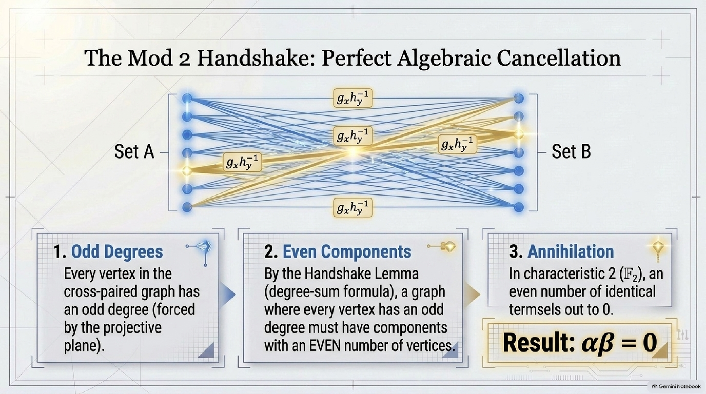


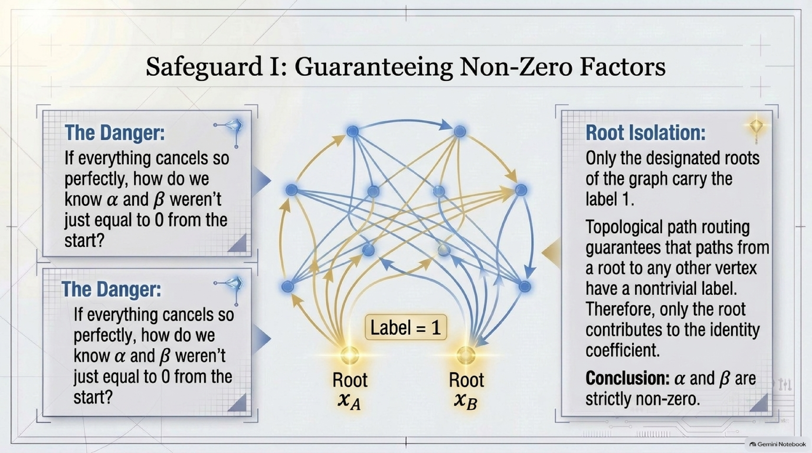


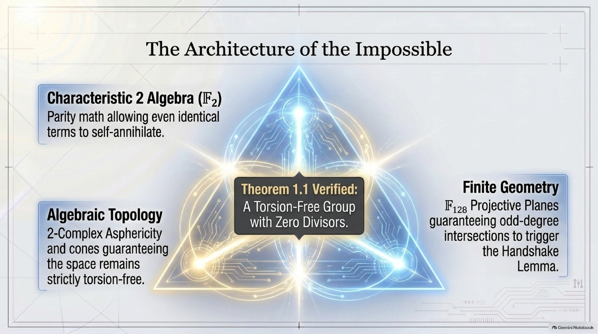

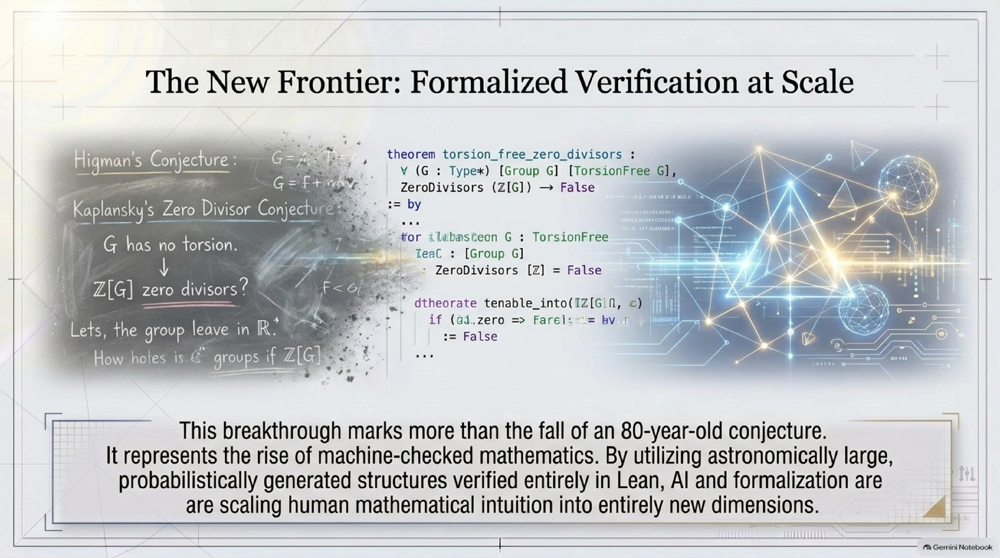

</details>

See [`assets/README.md`](assets/README.md) for the full inventory and the file-by-file [errata](assets/README.md#errata).

---

## How this explainer was made

1. The paper's TeX source and PDF, its README, the Lean scope documents `lean/docs/196.md` and `197.md`, the Comparator challenge file, `lean/formalization.yaml` and the family entries in `CONTENTS.md` were downloaded from [openai/math](https://github.com/openai/math). So were the family-197 torsion-free preprint, Gardam's 2021 paper (arXiv:2102.11818v4) and the Wikipedia articles on Kaplansky's conjectures, the Atiyah conjecture and linearly ordered groups, for background.
2. The paper, Gardam's paper, the Lean scope document and the Wikipedia article on [Kaplansky's conjectures](https://en.wikipedia.org/wiki/Kaplansky%27s_conjectures) were loaded into a NotebookLM notebook through the [`notebooklm-mcp-cli`](https://github.com/jacob-bd/gemini-notebook-mcp-cli) MCP/CLI. That notebook generated the slides, infographics, report, mind map and audio in [`assets/notebooklm/`](assets/notebooklm/), using prompts written as plain statements of the paper's results. The report and mind map were restricted to the paper sources. Every slide, both infographics and the report were then read against the paper, and the errors are listed in the [errata](assets/README.md#errata). The deck was not revised, because too little NotebookLM quota remained for a revision.
3. The text on this page was written by hand (with AI assistance) directly from the paper's TeX source, Gardam's paper and the openai/math documentation. Small scripts re-checked the torsion examples of section 1.3, the toy mechanism, the projective-plane parity design (exhaustively for $q = 2, 4, 8$, by sampling for $`q = 128`$), the numbers and fractions in Section 2 of the paper, a Fano-plane simulation of the random model, and Gardam's unit. The three figures were drawn by hand as SVG. Statements marked "our deduction" or "our gloss" are not in the paper.

See [`PIPELINE.md`](../../PIPELINE.md) for the exact, repeatable steps.

*Citation for the underlying paper:*

```bibtex
@misc{OAI:A-Torsion-Free-Group-Algebra-with-Zero-Divisors-September-23-2026,
  author = {{OpenAI}},
  title = {{A Torsion-Free Group Algebra with Zero Divisors}},
  howpublished = {OpenAI Math Release preprint
                  \href{https://github.com/openai/math/blob/main/preprints/A-Torsion-Free-Group-Algebra-with-Zero-Divisors-September-23-2026/paper.pdf}{OAI:A-Torsion-Free-Group-Algebra-with-Zero-Divisors-September-23-2026}},
  year = {2026}
}
```
