# Borsuk's conjecture fails in dimension nine, explained for beginners

> - **Paper:** [*A nine-dimensional counterexample to Borsuk's covering assertion*](https://github.com/openai/math/blob/main/preprints/A-nine-dimensional-counterexample-to-Borsuks-covering-assertion-September-23-2026/paper.pdf), OpenAI, 23 September 2026 (18 pages)
> - **openai/math family:** 156, *Borsuk's conjecture fails in dimension nine* · **Field:** discrete geometry (catalogued under combinatorics), using tools from algebraic topology
> - **Companions:** none. The family consists of this one paper
> - **Formal proof:** the main theorem is listed as formalized in Lean 4 ([scope](https://github.com/openai/math/blob/main/lean/docs/156.md))
> - **Who this is for:** anyone who knows basic geometry and vectors: distance, the dot product, perpendicular directions. Some 4×4 matrices appear, and every computation with them is spelled out.

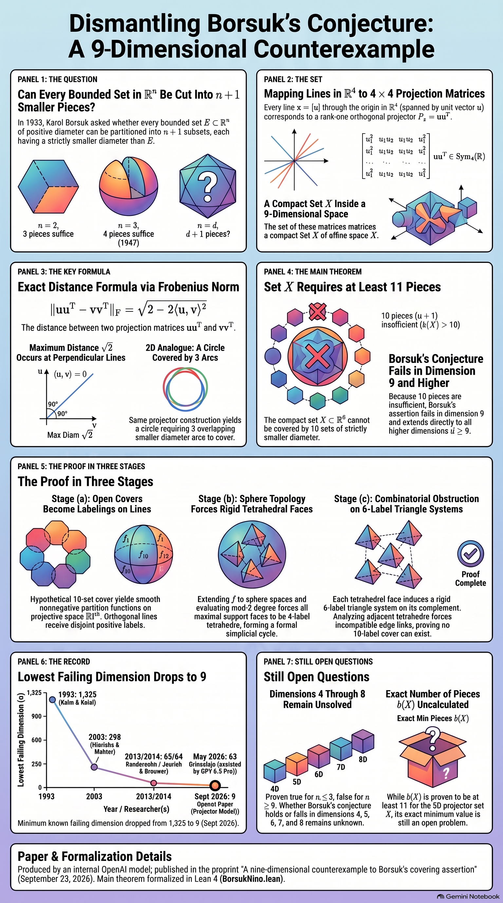

*NotebookLM's one-page overview. The big picture is right, but the matrix $`uu^{\top}`$ in panel 2 is drawn wrongly and several labels are garbled (for example $`\mathbb{R}^6`$ where it should say $`\mathbb{R}^9`$, and misspelled names in the record chart); see the [errata](assets/README.md#errata).*

## Contents

- [TL;DR](#tldr)
- [How to read this](#how-to-read-this)
- [1. The problem](#1-the-problem)
- [2. A short history](#2-a-short-history)
- [3. What the paper proves](#3-what-the-paper-proves)
- [4. Why it matters](#4-why-it-matters)
- [5. The main idea of the proof](#5-the-main-idea-of-the-proof)
- [6. The people whose ideas this builds on](#6-the-people-whose-ideas-this-builds-on)
- [7. What it does not prove, and caveats](#7-what-it-does-not-prove-and-caveats)
- [8. Glossary](#8-glossary)
- [9. Slides, audio and other assets](#9-slides-audio-and-other-assets)
- [How this explainer was made](#how-this-explainer-was-made)

---

## TL;DR

- **The question.** In 1933 Karol Borsuk asked whether every bounded set in $n$-dimensional space can be cut into $n+1$ pieces, each with strictly smaller **diameter** (largest distance between two of its points) than the whole set. The answer is yes in the plane and in ordinary 3-dimensional space.
- **What was known.** In 1993 Jeff Kahn and Gil Kalai showed the answer is **no** in very high dimensions. A 30-year race then lowered the smallest dimension with a known counterexample from their 1325 through 946, 561, 323 and 298, then 65 and 64 (2013–14), and 63 in May 2026. Every one of these counterexamples was a cleverly chosen *finite* set of points.
- **What this paper proves.** In $\mathbb{R}^9$ there is a compact set that **cannot be cut into 10 pieces of smaller diameter**, so Borsuk's conjecture fails in dimension 9, and (by a short extra step) in every dimension from 9 up. The set is easy to write down. Take every line through the origin in $\mathbb{R}^4$ and record it as the 4×4 matrix $u u^{\top}$, where $u$ is a unit vector along the line. These matrices form a curved 3-dimensional object sitting inside a 9-dimensional space, and its diameter $\sqrt2$ is reached exactly by pairs of **perpendicular** lines.
- **How.** A cut into 10 small pieces would give 10 "labels" on the lines of $\mathbb{R}^4$, with perpendicular lines never sharing a label. Topology (odd maps between spheres, the circle of ideas around the Borsuk–Ulam theorem) shows that 10 labels is the bare minimum. At the bare minimum the labelling is forced into a rigid pattern of tetrahedra and six-label triangle systems, and a finite combinatorial argument shows that this pattern cannot exist.
- **What it doesn't do.** It does not find the smallest dimension where the conjecture fails. That dimension is now somewhere from 4 to 9, and dimensions 4 through 8 are still open. It also doesn't say exactly how many pieces this set needs, only that 10 are not enough. It is a preprint written by an AI model; the main theorem is listed as formalized in Lean.

## How to read this

| You have… | Read |
|---|---|
| 2 minutes | The TL;DR and the infographic above |
| 15 minutes | Sections 1–4 and 7 |
| An hour, and you like geometry | Everything, including the worked examples in [section 3.2](#32-meet-the-set-x-a-worked-example) and [section 5](#5-the-main-idea-of-the-proof) |

---

## 1. The problem

### 1.1 Diameter

The **diameter** of a set is the largest distance between two of its points. A few examples:

| Set | Diameter |
|---|---|
| A disk of radius $r$ | $2r$ (two opposite points of the rim) |
| A square of side 1 | $\sqrt2 \approx 1.414$ (two opposite corners) |
| An equilateral triangle of side 1 | $1$ (any two corners) |
| A regular tetrahedron of side 1 | $1$ (any two corners) |

For sets without a "largest" distance, such as an open disk that leaves out its rim, the diameter is the **supremum**: the smallest number that no distance in the set exceeds. That is why the question below says *strictly smaller*: a piece only counts as smaller if its diameter, in this supremum sense, is less than the diameter of the whole set.

### 1.2 Borsuk's question

Cut a disk of radius $r$ like a three-spoke logo, into three 120° slices. The farthest two points of a slice are the ends of its arc, at distance $2r \sin 60° = \sqrt3\ r \approx 1.732\ r$, which is less than $2r$. So **three pieces suffice** for a disk. **Two never do:** one of the two pieces would contain two opposite points of the rim, or points arbitrarily close to two opposite points, so its diameter would still be $2r$ (a one-dimensional case of the Borsuk–Ulam theorem, applied to the closures of the pieces).

Some sets need just as many pieces. The three corners of an equilateral triangle are pairwise at distance equal to the diameter, so no smaller piece can hold two of them, and at least 3 pieces are needed. In $\mathbb{R}^n$ the regular simplex has $n+1$ corners that are pairwise at maximal distance, so **at least $n+1$ pieces are sometimes necessary**. In his 1933 paper, Borsuk proved that the $n$-dimensional ball also needs $n+1$ pieces, and that $n+1$ suffice for it. Then he asked ([translation from Wikipedia](https://en.wikipedia.org/wiki/Borsuk%27s_conjecture)):

> *Can every bounded subset $`E`$ of the space $`\mathbb{R}^n`$ be partitioned into $`n+1`$ sets, each of which has a smaller diameter than $`E`$?*

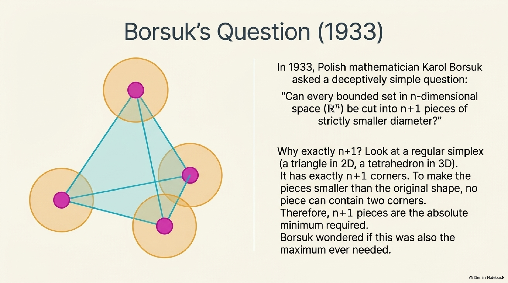

Borsuk posed this as an open question. The expected "yes" came to be called **Borsuk's conjecture**. The paper writes $b(Y)$ for the least number of smaller-diameter pieces that cover a set $Y$, and notes that **covers and partitions give the same number**: if pieces overlap, you can delete the overlaps without making any piece bigger.

### 1.3 Low dimensions: yes

- **Dimension 1:** cut an interval at its midpoint.
- **Dimension 2:** Borsuk himself (1933) proved that 3 pieces always suffice in the plane.
- **Dimension 3:** Julian Perkal (1947) and, independently, H. G. Eggleston (1955) proved that 4 pieces always suffice. Simpler proofs were found later by Branko Grünbaum and Aladár Heppes.
- **Special shapes in every dimension:** yes for smooth convex bodies (Hugo Hadwiger, 1945–46) and for centrally symmetric convex bodies (A. S. Riesling, 1971).

With so much evidence, many people believed the conjecture.

### 1.4 High dimensions: no, and the "perpendicular is farthest" trick

Kahn and Kalai's 1993 counterexample (the original paper calls it a construction from "sets of pairs") can be described with a trick that is also the heart of the new paper. Take a vector $x$ whose $m$ entries are all $\pm 1$, with as many $+1$'s as $-1$'s, and record it as the $m\times m$ matrix $x x^{\top}$. Two such matrices satisfy

```math
\lVert x x^{\top} - y y^{\top}\rVert^2 \;=\; 2m^2 - 2\langle x, y\rangle^2 ,
```

where the norm is the ordinary length of the matrix written out as a list of $m^2$ numbers. (We checked this numerically for $m = 52$: two perpendicular balanced vectors give $5408 = 2\cdot 52^2$.) So the farthest pairs are exactly the **perpendicular** pairs, and a piece of smaller diameter is just a collection of such vectors **with no two perpendicular**. A deep theorem of Peter Frankl and Richard Wilson (1981) says such collections are tiny compared with the whole set. Many pieces are therefore needed, at least $1.2^{\sqrt d}$ of them in dimension $d$, for $d$ large. That eventually beats $d+1$.

The new paper uses the same formula, but with *all* unit vectors of $\mathbb{R}^4$ instead of balanced $\pm1$ vectors of length $m$ (section 3). The paper credits Gil Kalai's 2015 survey for describing exactly this "$x \mapsto x\otimes x$" view of the Kahn–Kalai construction, and Conway, Hardin and Sloane (1996) for the same matrix model of lines.

<details>
<summary><b>Checking Kahn and Kalai's "dimension 1325"</b> (a worked calculation)</summary>

Kahn and Kalai's closing remarks say their construction disproves the conjecture "for $d = 1{,}325$ and for every $d > 2{,}014$". For $d = 1325$ the construction uses $m = 52 = 4\cdot 13$ (Frankl–Wilson needs $m/4$ to be a prime power). The vectors are balanced $\pm1$ vectors of length 52, recorded through the $\binom{52}{2} = 1326$ entries above the diagonal of $x x^{\top}$. They all have the same number of $-1$ entries, so they lie in a hyperplane of dimension $1326 - 1 = 1325$.

- Number of points: $\frac12\binom{52}{26} = 247{,}959{,}266{,}474{,}052$.
- Frankl–Wilson bound per piece, as printed in the 1993 paper: $2\binom{51}{12} = 317{,}506{,}779{,}800$.
- Pieces needed, with the 1993 formula: about **781**. That is *less* than $1326$, so as printed, the formula does not give a counterexample in dimension 1325. Bernulf Weißbach pointed this out in 2000.
- Thomas Jenrich (2018, crediting an observation of William Kretschmer) showed that one halving in the derivation is unnecessary. Without it, the bound doubles to about **1562** pieces, which exceeds $1326$. So the 1325 claim is true after all, and the same set works in every dimension up to 1560.

The arithmetic is ours, done with a small script; the facts about Weißbach and Jenrich come from Wikipedia and from the abstract of Jenrich's arXiv paper 1809.09612.
</details>

---

## 2. A short history

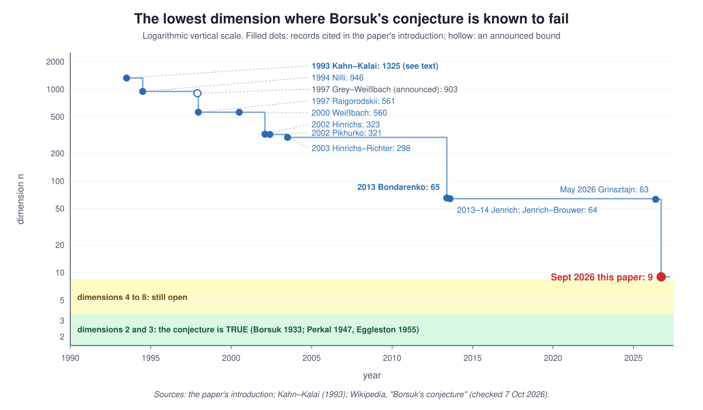

The dimension records in the middle of the table are those listed in the paper's introduction. Background rows (1933–1981) come from Wikipedia's article on Borsuk's conjecture and the paper's bibliography, and the 2018 correction from Wikipedia and Jenrich's own abstract.

| When | Who | What happened |
|---|---|---|
| 1932–33 | **Karol Borsuk** | The ball in $\mathbb{R}^n$ needs $n+1$ pieces, and the plane case of the conjecture holds. Borsuk asks the general question (published 1933) |
| 1945–46 | **Hugo Hadwiger** | Yes for smooth convex bodies in every dimension |
| 1947, 1955 | **Julian Perkal; H. G. Eggleston** | Yes in dimension 3, proved independently |
| 1971 | **A. S. Riesling** | Yes for centrally symmetric convex bodies |
| 1981 | **Peter Frankl, Richard Wilson** | A forbidden-intersection theorem: set families that avoid one intersection size are small. This becomes the engine of the first counterexample |
| 1993 | **Jeff Kahn, Gil Kalai** | **The conjecture is false** in high dimensions: at least $1.2^{\sqrt d}$ pieces are sometimes needed. They state dimensions 1325 and every $d > 2014$ |
| 1994 | **A. Nilli** | Dimension 946 ("A. Nilli" is a pen name of Noga Alon, according to Wikipedia's article on Alon; the paper does not say this) |
| 1997 | **Jörn Grey, Bernulf Weißbach** | 903, announced at a conference |
| 1997 | **Andrei Raigorodskii** | 561 |
| 2000 | **Bernulf Weißbach** | 560. He also noted that Kahn and Kalai's 1325 computation does not work as printed |
| 2002 | **Aicke Hinrichs** | 323, using vectors of the Leech lattice (a spherical code) |
| 2002 | **Oleg Pikhurko** | 321 (and 322), crediting an independent discovery by Hinrichs and Christian Richter |
| 2003 | **Aicke Hinrichs, Christian Richter** | 298 |
| 2013 (published 2014) | **Andriy Bondarenko** | 65, with a two-distance set of 416 points built from a strongly regular graph; it cannot be split into 83 parts of smaller diameter (abstract of arXiv 1305.2584) |
| 2013–14 | **Thomas Jenrich; Jenrich and Andries Brouwer** | 64, from a subset of Bondarenko's set |
| 2018 | **Thomas Jenrich** | Repairs the derivation behind Kahn and Kalai's 1325 claim (see the calculation above) |
| May 2026 | **Max Grinsztajn** | 63, a finite counterexample in a public proof note. His repository says the construction and proof were obtained with assistance from GPT-5.5 Pro. According to Wikipedia it is a 321-point configuration that needs at least 65 parts |
| 23 Sep 2026 | **OpenAI** (internal model) | **9**, with the set of all rank-one projectors on $\mathbb{R}^4$ (this paper) |

NotebookLM's sketch-note version of the same story is below. It is broadly accurate, but its heading calls dimension 9 a "resolution" although dimensions 4 to 8 are still open, and its box headed "Reductions Below 100 Dimensions" opens with Hinrichs and Richter's 298 (see the [errata](assets/README.md#errata)).

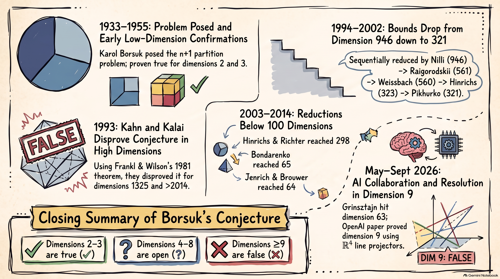

---

## 3. What the paper proves

> **Theorem 1.1.** The compact set
>
> ```math
> X=\lbrace u u^{\top}:\ u\in\mathbb{R}^4,\ \lVert u\rVert=1\rbrace \subset \lbrace A\in \mathrm{Sym}_4(\mathbb{R}) : \mathrm{tr}\ A = 1\rbrace,
> ```
>
> with the Frobenius metric, has diameter $\sqrt2$ and cannot be covered by ten subsets of diameter strictly less than $\sqrt2$.

In plain words: the symmetric 4×4 matrices whose **trace** (sum of the diagonal entries) equals 1 form a flat 9-dimensional space, so $X$ is a set in $\mathbb{R}^9$. (The Frobenius metric is the ordinary distance between matrices; see section 3.1.) Borsuk's conjecture would let you cut it into $9+1 = 10$ pieces of smaller diameter. The theorem says that is impossible, so $b(X) \ge 11$ and **Borsuk's conjecture is false in dimension 9**.

> **Corollary 7.1.** For every integer $d\ge 9$ there is a compact subset of $\mathbb{R}^d$ of diameter $\sqrt2$ that cannot be covered by $d+1$ subsets of strictly smaller diameter.

The corollary uses a familiar trick (the paper cites Hinrichs–Richter and Bondarenko for it). Add $s$ new points, each at distance exactly $\sqrt2$ from everything else, in $s$ new directions. Each new point needs a piece of its own, so a cover by $d+1 = 10+s$ pieces would leave at most 10 pieces for the old set, and Theorem 1.1 says 10 are not enough. The paper places the new points by prescribing their **Gram matrix** (the table of their pairwise dot products) to be $I_s + \tfrac14\mathbf{1}\mathbf{1}^{\top}$. We checked the numbers: each new vector has squared length $5/4$, two new vectors are at squared distance $5/4+5/4-2\cdot\tfrac14 = 2$, and an old point (at squared distance $3/4$ from the centre $`I/4`$) is at squared distance $3/4+5/4 = 2$ from every new one.

The Lean 4 statement, from the [openai/math Comparator challenge](https://github.com/openai/math/blob/main/lean/ComparatorChallenges/BorsukNine.lean), reads as follows. This is abridged: the `OAI.BorsukNine` namespace and the definition of `traceOneSymmetric` are left out. In the challenge file the theorem ends with the placeholder `:= by sorry`, because that file only fixes the statement; the proof lives in the separate solution module described in [section 7](#7-what-it-does-not-prove-and-caveats).

```lean
abbrev Vector4 := EuclideanSpace ℝ (Fin 4)
abbrev Matrix4 := EuclideanSpace ℝ (Fin 4 × Fin 4)

def projector (u : Vector4) : Matrix4 :=
  WithLp.toLp 2 (fun ij => u ij.1 * u ij.2)

def projectorSet : Set Matrix4 :=
  projector '' {u : Vector4 | ‖u‖ = 1}

def HasTenSmallCover : Prop :=
  ∃ C : Fin 10 → Set Matrix4,
    (∀ i, C i ⊆ projectorSet) ∧
    projectorSet ⊆ ⋃ i, C i ∧
    ∀ i, Metric.diam (C i) < Real.sqrt 2

theorem main_theorem :
    IsCompact projectorSet ∧
    projectorSet ⊆ traceOneSymmetric ∧
    Metric.diam projectorSet = Real.sqrt 2 ∧
    ¬ HasTenSmallCover
```

Here a 4×4 matrix is treated as a point of 16-dimensional Euclidean space, whose distance is exactly the Frobenius distance, and `traceOneSymmetric` is the set of symmetric matrices with trace 1. The covering sets are required to be subsets of $X$, which loses nothing: cutting a set down never increases its diameter.

### 3.1 Lines, projectors and the Frobenius distance

A **line through the origin** of $\mathbb{R}^4$ is all multiples of one nonzero vector. Pick a unit vector $u$ on the line. Then $-u$ is the other choice, and the 4×4 matrix

$$P = u u^{\top}, \qquad P_{ij} = u_i u_j ,$$

doesn't care which of the two you picked. $P$ is the **orthogonal projector** onto the line: $P v$ is the shadow of $v$ on the line. It is symmetric, and its trace (the sum of its diagonal entries) is $u_1^2 + u_2^2 + u_3^2 + u_4^2 = 1$.

The **Frobenius distance** between two matrices is the ordinary distance after writing each matrix out as a list of 16 numbers. For two projectors the paper computes (Lemma 2.1, equation 2.1)

```math
\lVert u u^{\top} - v v^{\top}\rVert_F^2 \;=\; 2 - 2\langle u, v\rangle^2 .
```

Here $\langle u,v\rangle$ is the dot product, which is (up to sign) the cosine of the angle between the lines. So:

- the distance is largest, $\sqrt2$, exactly when $\langle u,v\rangle = 0$, that is, when **the lines are perpendicular**;
- if the lines meet at angle $\theta$, the distance is $\sqrt2\ \sin\theta$.

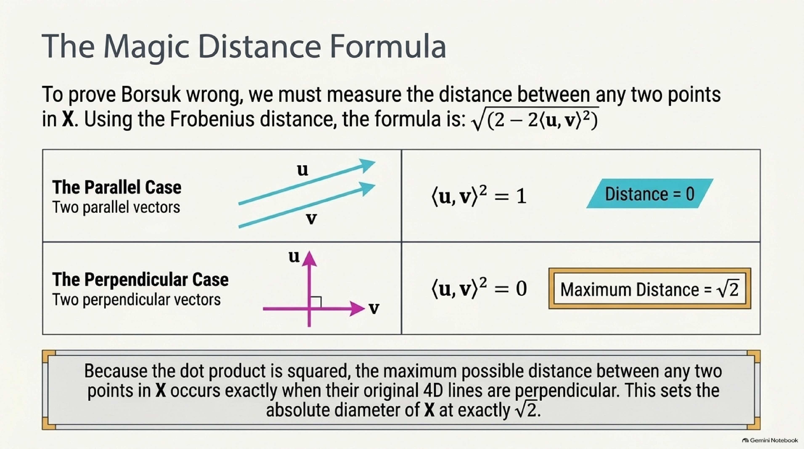

The symmetric 4×4 matrices form a 10-dimensional space (4 diagonal entries plus 6 above the diagonal). The condition "trace $= 1$" cuts out a flat 9-dimensional slice, and $X$ lives in that slice. The paper's Remark 2.2 gives explicit coordinates that turn the slice into ordinary $\mathbb{R}^9$ without changing any distance:

```math
A \longmapsto \Big(\tfrac{a_{11}-a_{22}}{\sqrt2},\ \tfrac{a_{11}+a_{22}-2a_{33}}{\sqrt6},\ \tfrac{a_{11}+a_{22}+a_{33}-3a_{44}}{\sqrt{12}},\ \sqrt2 a_{12},\ \sqrt2 a_{13},\ \sqrt2 a_{14},\ \sqrt2 a_{23},\ \sqrt2 a_{24},\ \sqrt2 a_{34}\Big).
```

The factor $\sqrt2$ is there because each off-diagonal entry appears twice in the matrix.

### 3.2 Meet the set X (a worked example)

Here are a few points of $X$ and their distances, computed by script, both as 4×4 matrices and through the 9 coordinates above (the two answers agree to machine precision):

| Line through | Second line through | $\langle u,v\rangle^2$ | Distance $\sqrt{2-2\langle u,v\rangle^2}$ |
|---|---|---|---|
| $e_1 = (1,0,0,0)$ | $e_2 = (0,1,0,0)$ | $0$ | $\sqrt2 \approx 1.4142$ (perpendicular, the diameter) |
| $e_1$ | $(1,1,0,0)/\sqrt2$ (45° away) | $1/2$ | $1$ |
| $e_1$ | $(1,1,1,1)/2$ (60° away) | $1/4$ | $\sqrt{1.5} \approx 1.2247$ |
| $e_1$ | $(\cos 30°, \sin 30°, 0, 0)$ | $3/4$ | $\sqrt{0.5} \approx 0.7071$ |
| $(1,1,1,1)/2$ | $(1,1,-1,-1)/2$ | $0$ | $\sqrt2$ (perpendicular again) |

Two of these points as matrices and in 9 coordinates:

```math
P_{e_1}=\begin{pmatrix}1&0&0&0\\0&0&0&0\\0&0&0&0\\0&0&0&0\end{pmatrix}\mapsto\Big(\tfrac{1}{\sqrt2},\tfrac{1}{\sqrt6},\tfrac{1}{\sqrt{12}},0,0,0,0,0,0\Big),
\qquad
P_{(1,1,1,1)/2}=\tfrac14\begin{pmatrix}1&1&1&1\\1&1&1&1\\1&1&1&1\\1&1&1&1\end{pmatrix}\mapsto\Big(0,0,0,\tfrac{1}{2\sqrt2},\dots,\tfrac{1}{2\sqrt2}\Big).
```

Some things to notice:

- The four coordinate lines $e_1,\dots,e_4$ are pairwise perpendicular, so their projectors are four points pairwise at distance $\sqrt2$, the corners of a regular tetrahedron. That alone shows at least 4 pieces are needed. There is no fifth line perpendicular to all four, so this simplex argument stops at 4. The paper's argument gets to 11.
- Every point of $X$ is at distance exactly $\sqrt3/2 \approx 0.866$ from the matrix $I/4$, the "centre" (the paper uses this in Corollary 7.1). So $X$ is a curved 3-dimensional object lying on a sphere in $\mathbb{R}^9$. As a shape it is a copy of the space of all lines through the origin of $\mathbb{R}^4$, which topologists call real projective 3-space, $\mathbb{RP}^3$.
- Unlike every earlier record-setting counterexample, $X$ is not a finite list of points. It is a continuous, compact set.

**A warm-up you can draw.** Do the same in the plane: lines through the origin of $\mathbb{R}^2$. In the 2 coordinates $`\big((a_{11}-a_{22})/\sqrt2,\ \sqrt2\ a_{12}\big)`$, the line at angle $\theta$ becomes the point $`(\cos 2\theta, \sin 2\theta)/\sqrt2`$, so all of them together form a **circle of radius $`1/\sqrt2`$**, and perpendicular lines become opposite points (figure below). Three pieces suffice here. Give a line to piece 1, 2 or 3 according to whether its angle lies in $[0°,60°)$, $[60°,120°)$ or $[120°,180°)$. Two lines in the same piece are less than 60° apart, so their distance is below $\sqrt{2 - 2\cos^2 60°} = \sqrt{1.5} \approx 1.22 < \sqrt2$. In $\mathbb{R}^2$ the number of pieces needed is $3 = 2+1$, exactly Borsuk's count. In $\mathbb{R}^4$ the paper shows Borsuk's count is not enough.

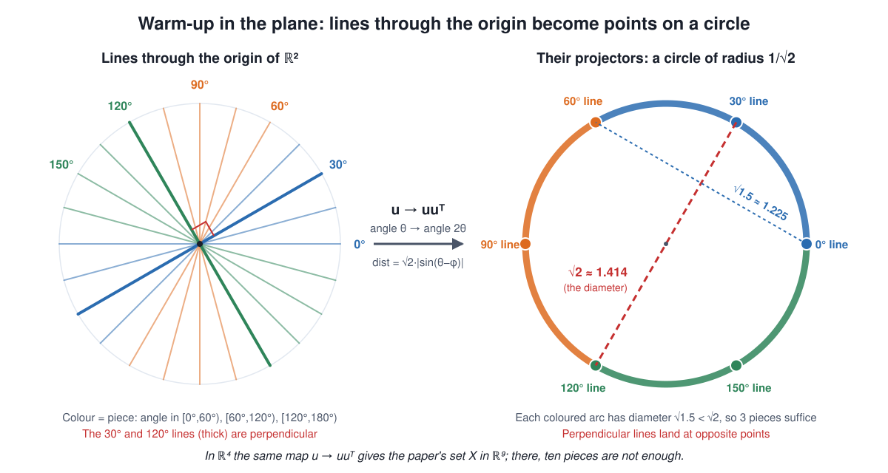

---

## 4. Why it matters

| | Before | After (if the preprint holds up) |
|---|---|---|
| **Lowest dimension with a known counterexample** | 64 (Jenrich–Brouwer, 2014); 63 in Grinsztajn's May 2026 note | **9**, and every dimension $\ge 9$ |
| **Dimensions where the answer is unknown** | 4 to 62 | **4 to 8** |
| **Kind of counterexample** | Finite point sets built from combinatorial structures: Frankl–Wilson set families, Leech-lattice spherical codes, strongly regular graphs | A continuous compact set: the projectors onto *all* lines in $\mathbb{R}^4$. The paper says it "improves this dimension bound using the full compact image of projective space rather than a finite configuration" |
| **Main tools** | Counting arguments that bound how many points of a finite set can share a piece (for example forbidden intersections) | Topology (odd maps between spheres, mod-two degree, Stiefel–Whitney classes), followed by a finite combinatorial argument |
| **How badly Borsuk's count fails** | Bondarenko's 65-dimensional set cannot be split into 83 parts, far more than the 66 the conjecture allows | Ten pieces fail for $X$, where the conjecture allows ten. The paper does not decide whether eleven suffice |

The drop from 63 to 9 is large: the previous record was 7 times higher. The method is also a departure. Earlier counterexamples were finite sets whose pieces could be bounded by counting. This one is a smooth object, and the obstruction comes from topology, the same subject Borsuk used in 1933 to show that the ball needs $n+1$ pieces.

---

## 5. The main idea of the proof

The proof runs through Sections 2–7 of the paper, about 15 pages. Here it is at three zoom levels.

### Level 1: the one-paragraph version

Suppose someone hands you 10 pieces of smaller diameter. Think of them as 10 **colours of paint** on the lines of $\mathbb{R}^4$. Near the borders between pieces the paint is smeared, so a line can carry a blend of several colours. The rule is that **perpendicular lines never share a colour**, because two perpendicular lines are at distance $\sqrt2$ and cannot lie in one small piece. The paper proves that 10 colours cannot obey this rule. Topology first shows that 10 is the bare minimum number of colours for lines in $\mathbb{R}^4$. Being exactly at the minimum leaves no slack, and it forces the overlap pattern of the colours into a very rigid shape: every line uses at most 4 colours, and the 6 colours missing from each 4-colour patch form a specific ten-triangle pattern. A finite puzzle argument then shows that no pattern on 10 colours can satisfy all these constraints at once.

> **Analogy:** a crowded seating plan. If there are exactly as many chairs as the rules require, nobody can be moved without breaking a rule, so the seating is forced, and you can check by hand that the forced seating breaks a different rule. With slack (more chairs) the argument would fail.

### Level 2: the step-by-step picture

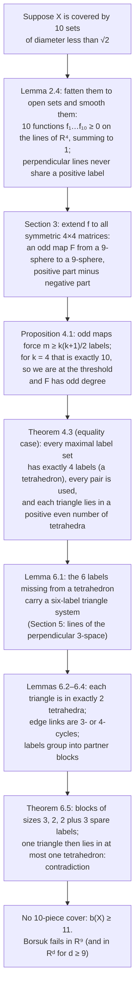
```mermaid
flowchart TD
    A["Suppose X is covered by 10 sets<br/>of diameter less than √2"] --> B["Lemma 2.4: fatten them to open sets and smooth them:<br/>10 functions f₁…f₁₀ ≥ 0 on the lines of R⁴, summing to 1;<br/>perpendicular lines never share a positive label"]
    B --> C["Section 3: extend f to all symmetric 4×4 matrices:<br/>an odd map F from a 9-sphere to a 9-sphere,<br/>positive part minus negative part"]
    C --> D["Proposition 4.1: odd maps force m ≥ k(k+1)/2 labels;<br/>for k = 4 that is exactly 10, so we are at the threshold<br/>and F has odd degree"]
    D --> E["Theorem 4.3 (equality case): every maximal label set<br/>has exactly 4 labels (a tetrahedron), every pair is used,<br/>and each triangle lies in a positive even number of tetrahedra"]
    E --> F["Lemma 6.1: the 6 labels missing from a tetrahedron<br/>carry a six-label triangle system<br/>(Section 5: lines of the perpendicular 3-space)"]
    F --> G["Lemmas 6.2–6.4: each triangle is in exactly 2 tetrahedra;<br/>edge links are 3- or 4-cycles;<br/>labels group into partner blocks"]
    G --> H["Theorem 6.5: blocks of sizes 3, 2, 2 plus 3 spare labels;<br/>one triangle then lies in at most one tetrahedron:<br/>contradiction"]
    H --> I["No 10-piece cover: b(X) ≥ 11.<br/>Borsuk fails in R⁹ (and in Rᵈ for d ≥ 9)"]
```

**Step 1: From pieces to labels (Lemma 2.4).** Take a piece $A_i$ with diameter $d_i < \sqrt2$ and fatten it by $\varepsilon_i = (\sqrt2 - d_i)/4$. The fattened set is open and still has diameter at most $(d_i+\sqrt2)/2 < \sqrt2$. A standard tool, a **smooth partition of unity**, then gives ten smooth functions $f_1,\dots,f_{10} \ge 0$ on the lines of $\mathbb{R}^4$, with $f_1 + \dots + f_{10} = 1$ everywhere, such that $f_i$ is positive only on the $i$-th fattened piece. Write $S(x)$ for the set of labels $i$ with $f_i(x) > 0$, the colours present on line $x$. Because perpendicular lines are at distance $\sqrt2$, they can never lie in the same fattened piece, so

$$x \perp y \quad\Longrightarrow\quad S(x) \cap S(y) = \varnothing .$$

The paper calls such an $f$ **admissible**. The strict inequality $d_i < \sqrt2$ is what leaves room to fatten. The paper remarks that merely forbidding orthogonal pairs inside arbitrary colour classes would not give this reduction.

**Step 2: The support complex.** Record which colours ever appear together: a set of labels is a **face** if all of them are positive on some line. This defines a finite simplicial complex $K$ on the labels $1,\dots,10$. Faces with 3 labels are called **triangles**, faces with 4 labels **tetrahedra**. These are names for label sets, not geometric triangles.

**Step 3: Ten is the bare minimum (Section 3 and Proposition 4.1).** The clever move is to extend $f$ from lines to all symmetric matrices. For a **positive semidefinite** matrix $Q$ (a symmetric matrix with no negative eigenvalues, such as a projector), the extension $E(Q)$ averages the label vector $f$ over the lines in the range of $Q$, weighted by how much $Q$ stretches them. A general symmetric matrix $A$ splits as $A = A_+ - A_-$ into a positive part and a negative part, whose ranges are **perpendicular**. Set $F(A) = E(A_+) - E(A_-)$. Admissibility says perpendicular lines use different labels, so the two parts never cancel, and

```math
\textstyle\sum_i \lvert F(A)_i\rvert = \mathrm{tr}\ \lvert A\rvert \quad(\text{the sum of the absolute eigenvalues}),\qquad F(-A) = -F(A).
```

After normalizing, $F$ is an **odd map** from a sphere of dimension $N_k - 1$ (the unit trace-norm matrices, where $N_k = k(k+1)/2$ is the dimension of the symmetric $k\times k$ matrices) to a sphere of dimension $m-1$ (label vectors with $`\sum\lvert y_i\rvert = 1`$). A classical fact from topology, in the family of the Borsuk–Ulam theorem, says an odd map from a sphere to a sphere cannot go *down* in dimension. So $m \ge N_k$. For $k=2,3,4$ this gives $3, 6, 10$ labels. Combined with Step 1 (that is, Lemma 2.4 together with Proposition 4.1), it already shows that the projector set always needs at least as many pieces as Borsuk allows (an immediate consequence in our words; the paper does not state it separately): $X_k$ lives in dimension $N_k - 1$, and Borsuk allows $N_k$ pieces. For $\mathbb{R}^4$, that is 10. **The whole difficulty is the equality case $m = 10$.** There, $F$ is an odd map between spheres of the same dimension, so it has odd degree and hits every point.

**Step 4: At the threshold, the pattern is rigid (Theorem 4.3).** The paper squeezes the following out of the odd degree:

- every pair of labels appears together on some line (every pair is an edge of $`K`$);
- every **maximal** set of labels has exactly 4 elements, so the top faces are tetrahedra;
- the tetrahedra form a cycle "mod 2": every triangle lies in a positive, even number of tetrahedra.

The second point is the main topological step. A maximal label set with fewer than 4 labels would give a positive-dimensional family of lines carrying exactly those labels. Over that family the paper builds a second map and counts its preimages in two ways. The odd degree of $F$ makes the count odd, while a trivialization over one affine chart makes it even. That is a contradiction (details in Level 3).

**Step 5: The six missing labels (Section 5, Lemma 6.1).** Take a tetrahedron $S$ and a line $x$ whose labels are exactly $S$. Every line perpendicular to $x$ must avoid all four labels of $S$, so the lines in the 3-dimensional space $x^{\perp}$ use only the other six labels, and by Step 3 (with $k=3$, $`N_3 = 6`$) they must use all six. The six-label version of Steps 3–4 then forces those six labels to carry a **six-label triangle system**: ten triangles such that, of each complementary pair of triples, exactly one is a triangle, and every pair of labels lies in exactly two triangles.

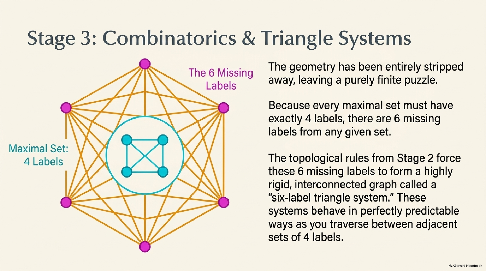

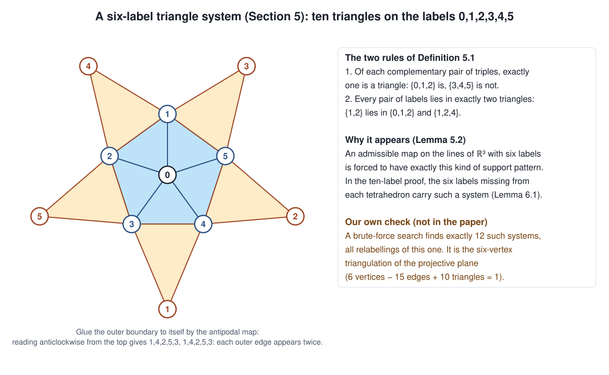

Lemma 5.3 lists the rigid properties this forces: every vertex link is a 5-cycle, every 4 labels contain a triangle but never all four triples, no swap of two labels preserves the system, and any five labels determine it. We confirmed all four properties by brute force over every system. Our own enumeration (not in the paper) also found exactly **12** six-label triangle systems, all relabellings of one. That one is the six-vertex triangulation of the projective plane shown above, with $6 - 15 + 10 = 1$.

**Step 6: The finite puzzle on ten labels (Section 6).** Now everything is combinatorics, with the six-label systems as the main tool.

- *Each triangle lies in exactly two tetrahedra* (Lemma 6.2). If three tetrahedra shared a triangle, carrying the six-label systems around those three tetrahedra would give a swap of two labels that preserves one of the systems, which Lemma 5.3 forbids.
- *Edge links are short cycles* (Lemma 6.3). For a pair of labels, the labels that complete it to triangles, joined when they complete it to tetrahedra, form cycles of length 3 or 4 only. A path through five of them would force two labels to have identical restricted links in one six-label system, which Lemma 5.3 forbids.
- *Partner blocks* (Lemma 6.4). Fix a tetrahedron $S$. Each label $v \in S$ has a unique "partner" $p(v)$ outside $S$ such that swapping $v$ for $p(v)$ gives another tetrahedron. Grouping labels with their partners gives disjoint blocks, and every tetrahedron contains at least two labels of some block.
- *The contradiction* (Theorem 6.5). Counting forces exactly three blocks, of sizes 3, 2 and 2, plus a set $R$ of 3 spare labels. Take two spare labels $r, s$. The triangle system on the six labels outside $S$ puts $\lbrace r,s\rbrace$ in two triangles, and one of them has the form $\lbrace r,s,z\rbrace$ with $z$ in a block of size 2. Its only possible fourth label is the other element of that block. So the triangle $\lbrace r,s,z\rbrace$ lies in at most one tetrahedron, contradicting "exactly two".

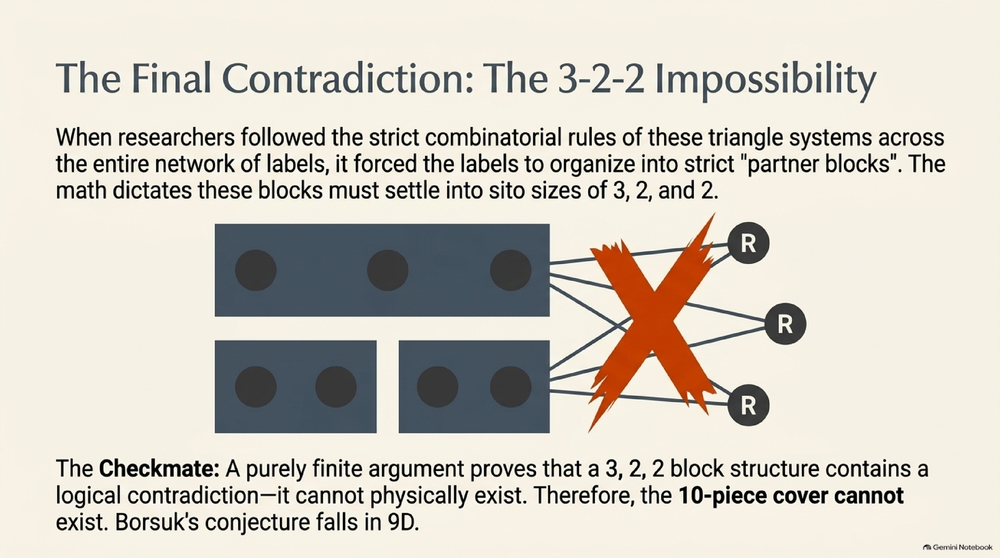

(The slide has a typo, "sito sizes", and credits "researchers"; the argument it summarizes is the paper's Theorem 6.5.)

**Step 7: Conclusion.** No admissible map with 10 labels exists, so no 10-piece cover exists (Section 7). Adding points in extra directions gives every dimension $d \ge 9$ (Corollary 7.1).

<details>
<summary><b>Why "obvious" ten-piece cuts fail</b> (a worked example)</summary>

The theorem says *every* attempt fails, but it is instructive to watch one fail. There are exactly 10 entries on or above the diagonal of a symmetric 4×4 matrix, and $10 = N_4$ is exactly Borsuk's allowance. A natural attempt uses one "centre" line per entry: the four coordinate lines $e_i$ and the six lines through $(e_i+e_j)/\sqrt2$. Put every line in the piece of the nearest centre, nearest in the Frobenius distance between projectors.

This fails. Take

$$u = (2, 3, 3, -4), \qquad v = (-8, 6, 6, 5), \qquad \langle u, v\rangle = -16 + 18 + 18 - 20 = 0 .$$

The two lines are perpendicular, so their projectors are at distance exactly $\sqrt2$. Yet both are strictly nearest to the same centre, $(e_2+e_3)/\sqrt2$. Distances from the two projectors to the centres, computed exactly:

| Centre | Distance from $P_u$ | Distance from $P_v$ |
|---|---|---|
| $(e_2+e_3)/\sqrt2$ | **1.0260** ($`\sqrt{20/19}`$) | **1.0515** ($`\sqrt{178/161}`$) |
| $e_4$ | 1.0761 | 1.2998 |
| $e_1$ | 1.3377 | 1.0977 |
| $(e_2+e_4)/\sqrt2$, $(e_3+e_4)/\sqrt2$ | 1.4049 | 1.1173 |
| $e_2$, $e_3$ | 1.2354 | 1.2461 |
| $(e_1+e_2)/\sqrt2$, $(e_1+e_3)/\sqrt2$ | 1.1585 | 1.4054 |
| $(e_1+e_4)/\sqrt2$ | 1.3765 | 1.3943 |

So the piece around $(e_2+e_3)/\sqrt2$ has diameter $\sqrt2$, and this ten-piece cut is not a valid Borsuk partition. Moving the centres around doesn't help: Theorem 1.1 guarantees that every ten-piece cut has a piece of diameter $\sqrt2$. (A random search found perpendicular pairs inside 6 of these 10 nearest-centre pieces, namely all six around the centres $`(e_i+e_j)/\sqrt2`$; permuting coordinates permutes these six pieces, so one bad piece among them makes all six bad. One bad piece is enough.)

Simpler cuts fail even faster. "Sort lines by their largest coordinate" makes only 4 pieces, and the lines through $(1+\varepsilon, 1, 1, 1)$ and $(1+\varepsilon, 1, -1, -1)$ both land in the first piece while being almost perpendicular ($`\langle u,v\rangle \approx \varepsilon/2`$ after normalizing).
</details>

### Level 3: the topology, for readers who know some algebraic topology

Work with $`\mathbb{F}_2`$ coefficients, and let $`\Sigma(V) = \lbrace A \in \mathrm{Sym}(V) : \mathrm{tr}\lvert A\rvert = 1\rbrace \cong S^{N_k-1}`$ and $`\Sigma_m = \lbrace y : \lVert y\rVert_1 = 1\rbrace \cong S^{m-1}`$. The extension $`F:\Sigma(V)\to\Sigma_m`$ is continuous and odd, and it is smooth near nonsingular matrices. Its positive labels are exactly the labels used on lines in $`\mathrm{ran}\ A_+`$, and likewise for the negative labels (Lemma 3.2). Two consequences: if every coordinate of $`F(A)`$ is nonzero then $`A`$ is nonsingular, and if all are negative then $`A`$ is negative definite. An odd map $`S^n\to S^d`$ needs $`n \le d`$, and an odd self-map of $`S^n`$ has odd degree (the paper cites Hatcher, Proposition 2B.6 and Corollary 2B.7). This gives Proposition 4.1.

For Theorem 4.3, fix a facet $`I`$ with $`s = \lvert I\rvert`$ labels, its complement $`J`$ with $`a = m - s`$ labels, and $`h = N_{k-1}`$. A witness line $`x_0`$ with $`S(x_0) = I`$ forces the lines of $`x_0^{\perp}`$ to use only $`J`$, so $`a \ge h`$ and $`s \le k`$. By Sard's theorem, a regular value $`r`$ of $`f_I`$ on the open simplex of $`I`$ has a compact level set $`L`$ of dimension $`k - s = a - h`$, inside the affine chart $`\mathbb{P}(V)\setminus\mathbb{P}(x_0^{\perp})`$. Restricting the extension to $`x^{\perp}`$ for $`x\in L`$ gives an odd map $`G`$ on a sphere bundle $`M \cong L\times S^{h-1}`$, which is trivial because the chart is affine. Choosing a full-support value $`y = (\lambda r, (1-\lambda) g)`$, the preimages $`F^{-1}(y)`$ are exactly the matrices $`\lambda P_x + (1-\lambda) B`$ with $`(x,B) \in G^{-1}(g)`$, and the derivative is block triangular. The local counting lemma (Lemma 4.2) then shows that $`\lvert G^{-1}(g)\rvert`$ is odd. On the other hand the quotient $`\bar G: L\times\mathbb{RP}^{h-1}\to\mathbb{RP}^{a-1}`$ pulls the generator $`w`$ back to $`\mathrm{pr}_2^{\ast}u`$, so if $`a > h`$ then $`\bar G^{\ast}(w^{a-1}) = \mathrm{pr}_2^{\ast}(u^{a-1}) = 0`$, the mod-two degree is zero, and the preimage count is even, a contradiction. Hence $`a = h`$ and $`s = k`$. With $`\dim L = 0`$, each facet's coefficient in $`f_{\ast}[\mathbb{P}(V)] \in H_{k-1}(\lvert K\rvert)`$ is $`\lvert L\rvert \equiv 1`$, so the sum of all facets is a cycle.

The paper notes the background: Walkup (1970) proved that a triangulation of $\mathbb{RP}^3$ needs at least 11 vertices, and Arnoux and Marin bounded vertex numbers for projective spaces. If the support complex were a triangulation of $\mathbb{RP}^3$, 10 labels would be ruled out at once. But its faces are supports of a map, not simplices of a triangulation, so those results do not apply directly. As the paper puts it, "the central difficulty is to derive enough of its face structure from the map itself." Sections 4–6 do exactly that.

---

## 6. The people whose ideas this builds on

| Person | Idea | Where it shows up |
|---|---|---|
| **Karol Borsuk** | The partition question (1933); the ball needs $n+1$ pieces | The whole problem |
| **Julian Perkal, H. G. Eggleston, Hugo Hadwiger, A. S. Riesling** | Positive answers in dimension 3 and for special convex bodies | Background: why the conjecture was believed |
| **Peter Frankl, Richard Wilson** | Forbidden-intersection theorem (1981) | The engine of the first counterexample |
| **Jeff Kahn, Gil Kalai** | The first counterexample (1993); Kalai's survey (2015) describes the $x\mapsto x\otimes x$ view | The paper's starting point; the same distance formula |
| **A. Nilli, Andrei Raigorodskii, Jörn Grey, Bernulf Weißbach** | 946, 561, 903 (announced), 560 | The paper's history |
| **Aicke Hinrichs, Christian Richter, Oleg Pikhurko** | Spherical-code counterexamples: 323, 321, 298 | The paper's history; Hinrichs–Richter's "add far-away points" lemma is used in Corollary 7.1 |
| **Andriy Bondarenko; Thomas Jenrich, Andries Brouwer** | Two-distance counterexamples from strongly regular graphs: 65 and 64 | The previous published record; Bondarenko's argument is also cited for Corollary 7.1 |
| **Max Grinsztajn** | A 63-dimensional finite counterexample (May 2026) | The record this paper improves |
| **John Conway, Ronald Hardin, Neil Sloane** | Lines as projection matrices, for packing lines and planes (1996) | The projector model and its Euclidean metric (Section 2) |
| **David Walkup; Pierre Arnoux, Alexis Marin** | Minimum vertex counts for triangulations of projective spaces | Background that cannot be applied directly (Section 1) |
| **Allen Hatcher; John M. Lee** | Textbook facts: odd maps and degree, Stiefel–Whitney classes; partitions of unity, Sard's theorem | Sections 2 and 4 |

---

## 7. What it does not prove, and caveats

> [!IMPORTANT]
> **The smallest failing dimension is still unknown.** The conjecture holds in dimensions 1, 2 and 3 and now fails in every dimension from 9 up. Dimensions 4 through 8 are open. The paper says the theorem "does not determine the smallest dimension in which it fails or the exact value of $b(X)$": it shows that 10 pieces are not enough for $X$, but not how many are.

> [!NOTE]
> **Nothing is claimed about the smaller projector sets.** For lines in $\mathbb{R}^2$ the projector set is a circle and 3 pieces suffice (section 3.2). For lines in $\mathbb{R}^3$ (a set in $`\mathbb{R}^5`$), the paper's tools show that at least 6 pieces are needed and describe what a 6-label pattern would look like, but the paper does not say whether 6 pieces are possible.

> [!NOTE]
> **Provenance.** The paper was produced by an unreleased internal OpenAI model as part of the [openai/math](https://github.com/openai/math) release. According to that repository's README, most results came from the same fixed procedure, averaging about three hours of ChatGPT Pro thinking compute per result, and the collection "includes results at different stages of verification". The README names two exceptions to the fixed procedure (a zero-free region for the Riemann zeta function, and the Hodge Conjecture for CM abelian varieties); this family is not among them. No reasoning summary has been released for family 156.

> [!NOTE]
> **Verification status.** The [Lean scope document for family 156](https://github.com/openai/math/blob/main/lean/docs/156.md) says the formalized counterexample is the compact set of rank-one orthogonal projectors on $\mathbb{R}^4$ with the Frobenius metric, and that it "lies in the nine-dimensional affine space of trace-one symmetric matrices, has diameter $\sqrt2$, and cannot be covered by ten arbitrary sets of smaller diameter." [`lean/formalization.yaml`](https://github.com/openai/math/blob/main/lean/formalization.yaml) lists this paper among its sources and, among its main results, the declaration `OAI.BorsukNine.main_theorem` with the Comparator configuration `ComparatorChallenges/BorsukNine.json` and the file `OAI/Geometry/Borsuk/Counterexample.lean`. The two name different files, which is consistent: the YAML records the file where the theorem is declared (`Counterexample.lean`), while the Comparator configuration names the solution module `OAI.Geometry.Borsuk.Main`, which imports `Counterexample.lean`. The configuration checks the single theorem name `OAI.BorsukNine.main_theorem` against the challenge module `ComparatorChallenges.BorsukNine`, with permitted axioms `propext`, `Quot.sound` and `Classical.choice`. Three details are worth knowing. The Comparator statement works in the 16-dimensional space of 4×4 matrices and asserts that $X$ lies in the trace-one symmetric matrices. The explicit $\mathbb{R}^9$ version, `euclidean_nine_counterexample`, is proved in `Main.lean` but is not one of the Comparator's checked theorem names. Corollary 7.1 (all $`d \ge 9`$) is not part of the Comparator statement. And the catalogue-wide `review` field of `formalization.yaml` reads `unchecked`. This explainer did not re-run the Lean build. As of October 2026 the result is a preprint, and the usual next step is independent review by experts.

> [!NOTE]
> **History from outside the paper.** The 63-dimensional example (Grinsztajn, May 2026) is a public proof note with a verification script, cited by the paper; it is not a refereed publication. The details on Kahn and Kalai's 1325 claim come from Wikipedia and Jenrich's 2018 arXiv abstract, not from this paper.

> [!TIP]
> **Simplifications.** To stay readable, this explainer describes the matrix extension in words, skips the smoothness bookkeeping at singular matrices, and compresses the combinatorics of Section 6. Every precise statement is in the paper, which is short and self-contained apart from standard topology.

---

## 8. Glossary

| Term | Meaning |
|---|---|
| **Diameter** | The largest distance between two points of a set; for sets without a largest distance, the supremum of all distances |
| **Borsuk's conjecture** | "Every bounded set in $\mathbb{R}^n$ can be cut into $n+1$ pieces of smaller diameter." True for $n \le 3$; false for $n \ge 9$ by this paper |
| **Borsuk number** $b(Y)$ | The fewest pieces of smaller diameter that cover $Y$. The paper proves $b(X) > 10$ |
| **Bounded, compact** | Fits inside some ball / bounded and containing all its limit points |
| **Regular simplex** | $n+1$ points in $\mathbb{R}^n$, all pairwise at the same distance (triangle, tetrahedron, …) |
| **Line through the origin** | All multiples of one nonzero vector. The space of all such lines in $\mathbb{R}^4$ is the projective space $\mathbb{RP}^3$ |
| **Orthogonal projector** $u u^{\top}$ | The 4×4 matrix with entries $u_i u_j$ for a unit vector $u$; it projects every vector onto the line of $u$ |
| **Trace** | The sum of the diagonal entries of a square matrix; every projector onto a line has trace 1 |
| **Frobenius distance** | The ordinary distance between two matrices written out as lists of entries. Between projectors: $\sqrt{2-2\langle u,v\rangle^2}$ |
| **Admissible map** | Ten smooth nonnegative functions on the lines of $\mathbb{R}^4$, summing to 1, with perpendicular lines never sharing a positive label |
| **Partition of unity** | A family of nonnegative smooth functions summing to 1, each positive only inside one given open set |
| **Support complex, face, facet** | The label sets that are all positive on some line; a facet is a maximal one |
| **Triangle, tetrahedron** | A face with 3 or 4 labels (names for label sets, not geometric shapes) |
| **Odd map** | A map with $F(-A) = -F(A)$ |
| **Borsuk–Ulam theorem** | A classical topology theorem: every continuous map from the $n$-sphere to $\mathbb{R}^n$ sends some pair of opposite points to the same value. Odd maps between spheres cannot lower the dimension |
| **Mod-two degree** | How many times (counted mod 2) a map between spheres of equal dimension covers a typical point |
| **Six-label triangle system** | Ten triples of six labels: one from each complementary pair of triples, with every pair of labels in exactly two of them |
| **Link** | The pattern of faces around a vertex or an edge |
| **Lean 4, Comparator** | A proof assistant that mechanically checks every step of a proof, and a tool that checks a formal proof matches a published statement and uses only allowed axioms |

---

## 9. Slides, audio and other assets

Everything below except the three hand-made figures was generated with **Google NotebookLM** (now "Gemini Notebook") from the paper, the Lean scope document and the Wikipedia article on Borsuk's conjecture. The report and the mind map used only the paper and the Lean scope document. The outputs are kept exactly as NotebookLM produced them, apart from one revision of the slide deck that regenerated slides 1, 2, 7, 8 and 15. They are AI-generated, so see the [errata](assets/README.md#errata) before relying on any detail.

| Asset | What it is |
|---|---|
| [Slide deck (PDF)](assets/notebooklm/slides.pdf) · [PPTX](assets/notebooklm/slides.pptx) | 15 beginner slides, revised once. The revision fixed slides 1, 7 and 8 and improved slide 2; it replaced the fictional Lean code on slide 15 with the real statement but garbled that slide's other two panels. Slide 6's chart and smaller issues on slides 10 to 14 remain (see the errata) |
| [Infographic: overview](assets/notebooklm/infographic-overview.png) | The one-page summary shown at the top; several garbled labels |
| [Infographic: history timeline](assets/notebooklm/infographic-history-timeline.png) | From Borsuk's question to dimension 9, in sketch-note style |
| [Audio overview (≈1.6 min)](assets/notebooklm/audio-overview-brief.m4a) | A short podcast-style summary (not reviewed) |
| [Beginner report](assets/notebooklm/beginner-explainer-report.md) | NotebookLM's long-form written explainer. Its proof walk-through matches the paper; its history and worked example contain errors |
| [Mind map](assets/notebooklm/mindmaps.md) | How the proof fits together |
| [Projector-circle figure](assets/figures/projector-circle.svg) | Hand-made, used in section 3.2 |
| [Record-dimension timeline](assets/figures/borsuk-record-timeline.svg) | Hand-made, used in section 2 |
| [Six-label triangle system](assets/figures/six-label-system.svg) | Hand-made, used in section 5 |

<details>
<summary><b>All 15 slides</b> (click to expand)</summary>

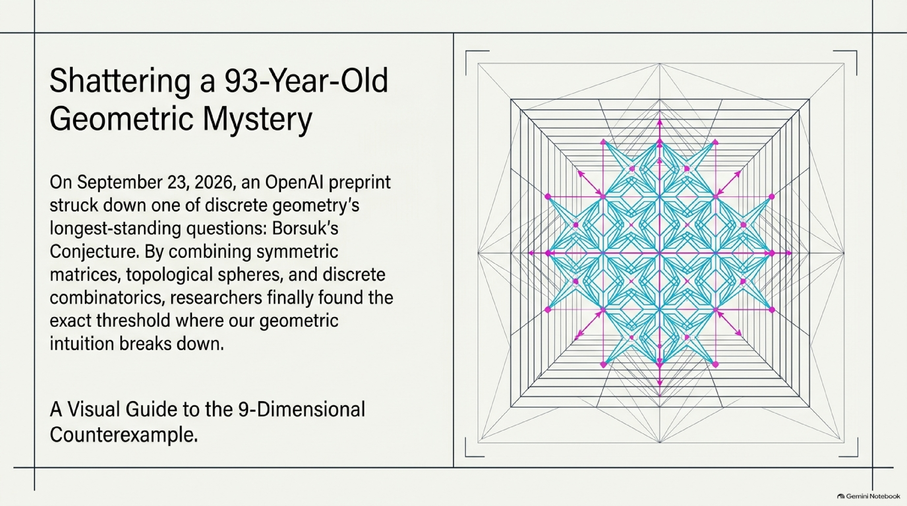

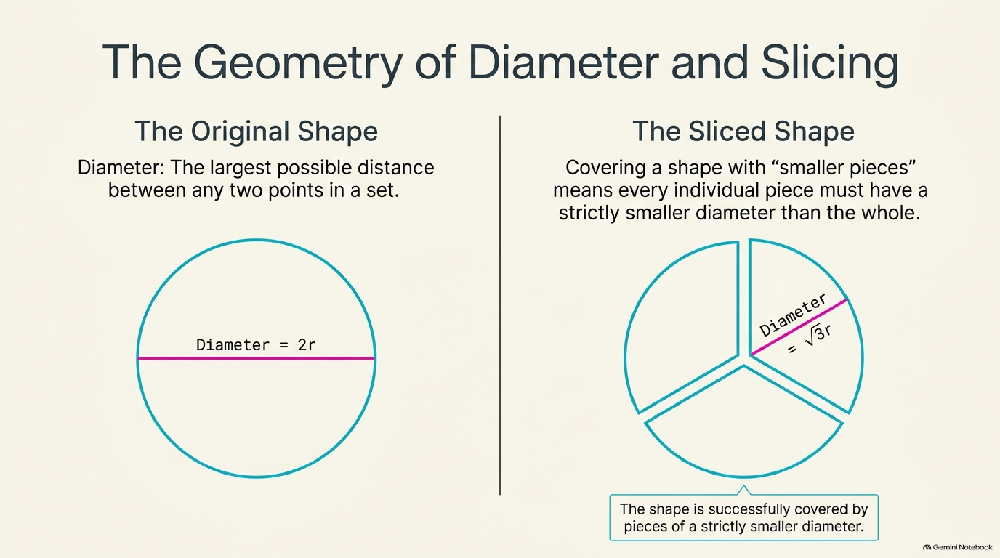


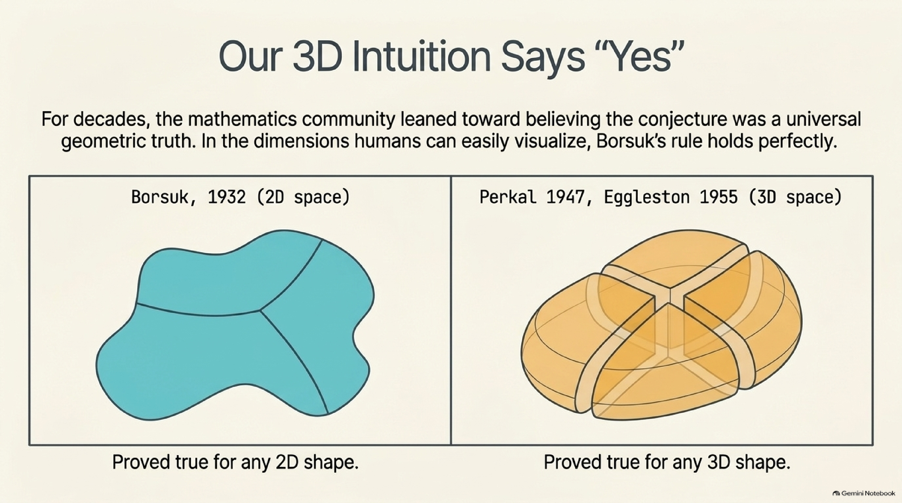

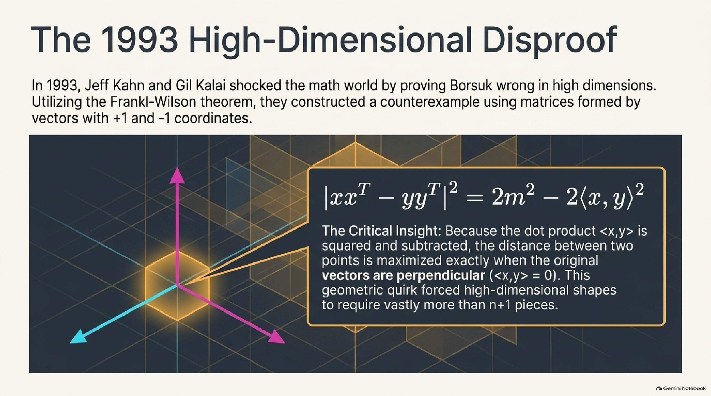

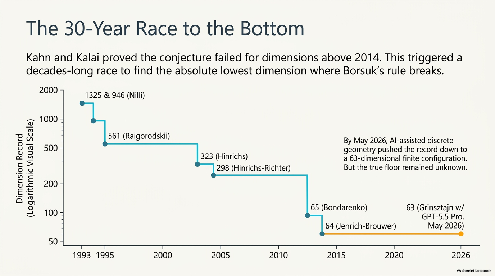

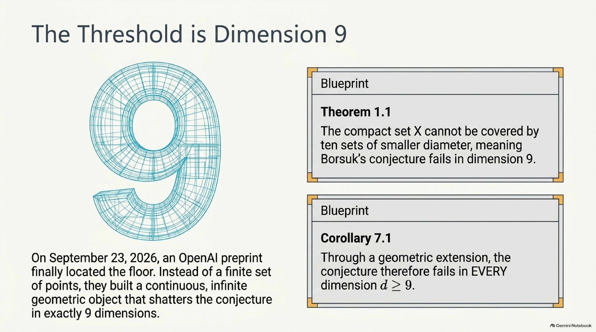

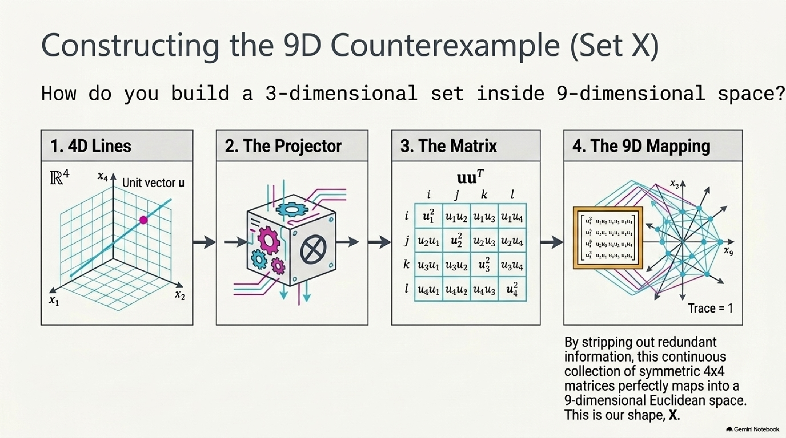


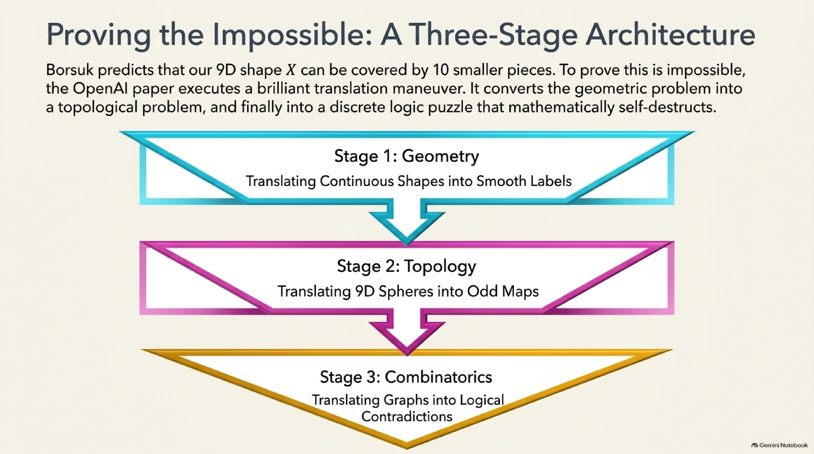

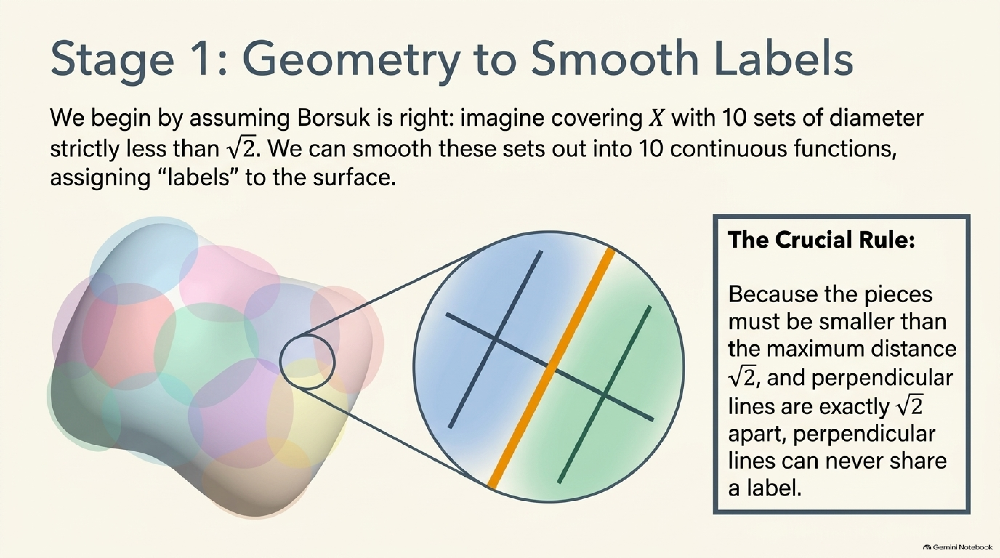

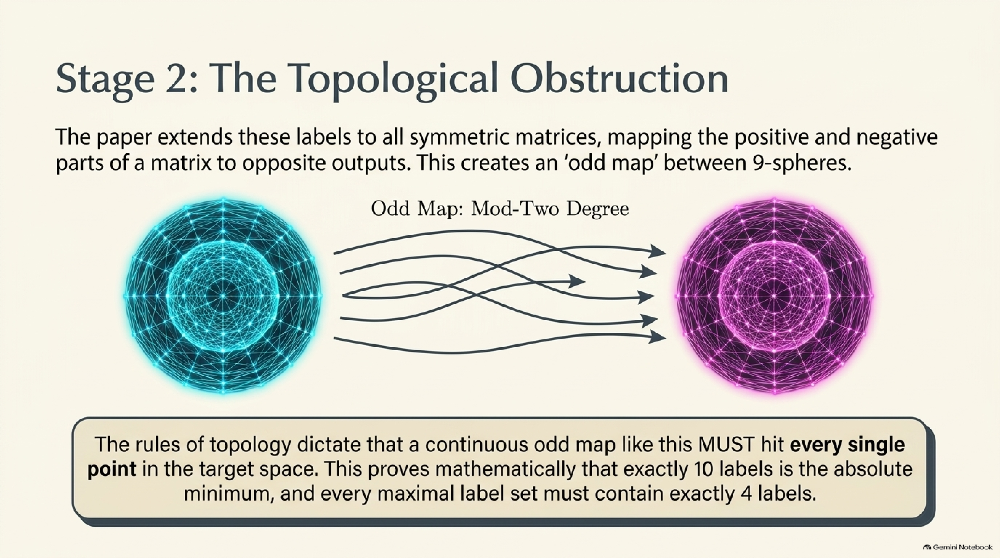


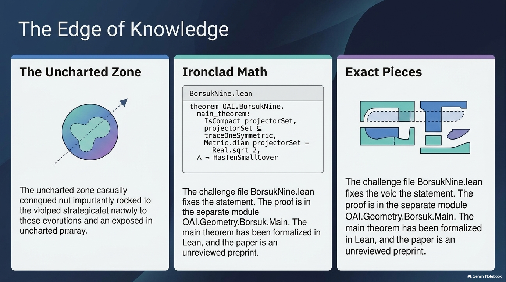

</details>

See [`assets/README.md`](assets/README.md) for the full inventory and the file-by-file [errata](assets/README.md#errata).

---

## How this explainer was made

1. The paper, its TeX source, the preprint README, the family entry in `CONTENTS.md`, the Lean scope document `lean/docs/156.md`, the Comparator challenge `BorsukNine.lean` and `BorsukNine.json`, the top-level Lean files of `OAI/Geometry/Borsuk/` and `lean/formalization.yaml` were downloaded from [openai/math](https://github.com/openai/math). There is no reasoning summary for this family.
2. The paper, the Lean scope document and the Wikipedia article on [Borsuk's conjecture](https://en.wikipedia.org/wiki/Borsuk%27s_conjecture) were loaded into a NotebookLM notebook on a second NotebookLM account, through the [`notebooklm-mcp-cli`](https://github.com/jacob-bd/gemini-notebook-mcp-cli) MCP/CLI. That notebook generated the slides, infographics, report, mind map and audio in [`assets/notebooklm/`](assets/notebooklm/), using prompts written as plain statements of the paper's results; the report and the mind map were restricted to the paper and the Lean scope document. The first slide deck failed to generate and was started again once. Every slide, both infographics and the report were then read against the paper, and the problems are listed in the [errata](assets/README.md#errata). Slides 1, 2, 7, 8 and 15 were then regenerated once with `nlm slides revise`, and a slide-by-slide diff with `scripts/diff_slides.py` confirmed that no other slide changed. The revision was shipped as a net improvement; the problems it left or introduced are in the errata.
3. The text on this page was written by hand (with AI assistance) directly from the paper's TeX source. The history was checked against the paper's introduction and bibliography, the Wikipedia article (7 October 2026), the arXiv abstracts of Kahn–Kalai, Pikhurko, Bondarenko and Jenrich, and the README of Grinsztajn's repository. Small scripts checked the projector distances and the nine coordinates, the plane warm-up, the Corollary 7.1 Gram matrix, the Kahn–Kalai numbers for $m = 52$, the nearest-centre example (in exact rational arithmetic), and the enumeration of six-label triangle systems with the four properties of Lemma 5.3. The three figures were drawn by hand as SVG from computed coordinates. NotebookLM's outputs were used only as visual and structural aids, not as the source of truth.

See [`PIPELINE.md`](../../PIPELINE.md) for the exact, repeatable steps.

*Citation for the underlying paper:*

```bibtex
@misc{OAI:A-nine-dimensional-counterexample-to-Borsuks-covering-assertion-September-23-2026,
  author = {{OpenAI}},
  title = {{A nine-dimensional counterexample to Borsuk's covering assertion}},
  howpublished = {OpenAI Math Release preprint
                  \href{https://github.com/openai/math/blob/main/preprints/A-nine-dimensional-counterexample-to-Borsuks-covering-assertion-September-23-2026/paper.pdf}{OAI:A-nine-dimensional-counterexample-to-Borsuks-covering-assertion-September-23-2026}},
  year = {2026}
}
```
