# An isomorphism of the free group factors, explained for beginners

> - **Paper:** [*An isomorphism of the free group factors*](https://github.com/openai/math/blob/main/preprints/An-isomorphism-of-the-free-group-factors-September-23-2026/An-isomorphism-of-the-free-group-factors-September-23-2026.pdf), OpenAI, 23 September 2026 (23 pages)
> - **openai/math family:** 287, *Isomorphism of the free group factors* · **Field:** operator algebras (von Neumann algebras, free probability)
> - **Companions:** none. This is the only paper in the family. openai/math also released an [abridged summary of the model's reasoning](https://github.com/openai/math/blob/main/reasoning_traces/free-group-factor-isomorphism.pdf) for this result (11 pages)
> - **Formal proof:** the Lean [scope document](https://github.com/openai/math/blob/main/lean/docs/287.md) says the formalization proves the isomorphism of all interpolated free group factors, selected as one Lean 4 Comparator statement. The paper is not listed in `lean/formalization.yaml`. See [section 7](#7-what-it-does-not-prove-and-caveats) for exactly what is and isn't covered
> - **Who this is for:** readers who know linear algebra (matrices, eigenvalues, unitary matrices) and a little functional analysis (Hilbert spaces, bounded operators). No operator-algebra background is assumed. Level 3 of section 5 is for readers who already know some free probability.

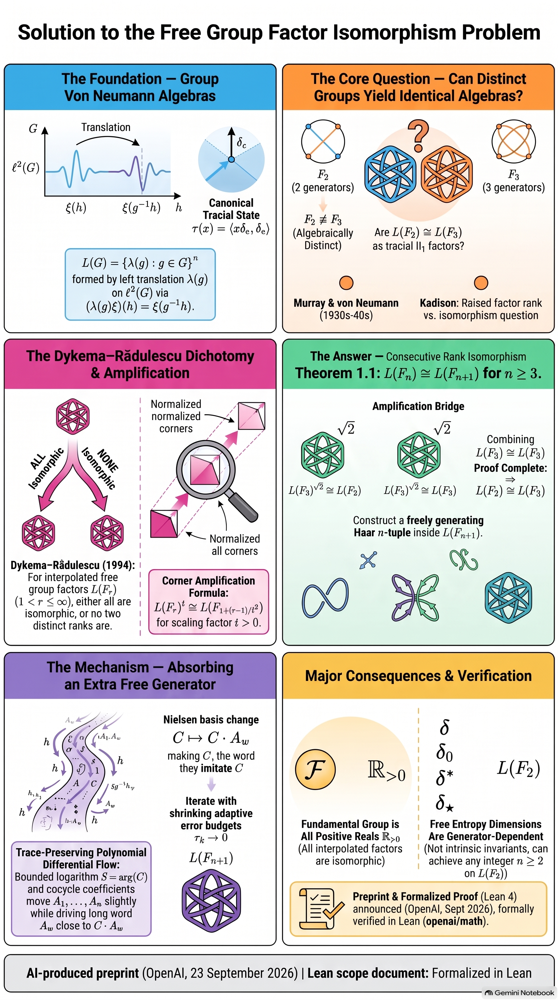

*AI-generated overview. The big picture is right, but the "Amplification Bridge" panel has wrong formulas (it should read $`L(\mathbb{F}_5)^{\sqrt2} \cong L(\mathbb{F}_3)`$), the definition of $`L(G)`$ is garbled, and "formally verified" overstates what could be checked here. See the [errata](assets/README.md#errata). The hand-made figure below shows the amplification step correctly.*

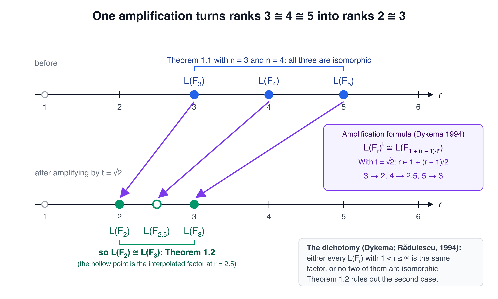

## Contents

- [TL;DR](#tldr)
- [How to read this](#how-to-read-this)
- [1. The problem](#1-the-problem)
- [2. A short history](#2-a-short-history)
- [3. What the paper proves](#3-what-the-paper-proves)
- [4. Why it matters](#4-why-it-matters)
- [5. The main idea of the proof](#5-the-main-idea-of-the-proof)
- [6. The people whose ideas this builds on](#6-the-people-whose-ideas-this-builds-on)
- [7. What it does not prove, and caveats](#7-what-it-does-not-prove-and-caveats)
- [8. Glossary](#8-glossary)
- [9. Slides, audio and other assets](#9-slides-audio-and-other-assets)
- [How this explainer was made](#how-this-explainer-was-made)

---

## TL;DR

- **The question.** Every group $`G`$ gives an algebra of operators $`L(G)`$: take the "shift by $`g`$" operators on the Hilbert space $`\ell^2(G)`$ and close up their span in a suitable topology. For the free group $`\mathbb{F}_n`$ on $`n`$ letters this gives the **free group factors** $`L(\mathbb{F}_n)`$. The groups $`\mathbb{F}_2`$ and $`\mathbb{F}_3`$ are certainly different. The famous **free group factor isomorphism problem** asks whether their operator algebras $`L(\mathbb{F}_2)`$ and $`L(\mathbb{F}_3)`$ are also different.
- **What was known.** The free group factors go back to Murray and von Neumann's work of 1936–1943. Voiculescu's free probability (from the 1980s) and the work of Rădulescu and Dykema (1992–1994) turned the problem into a clean dichotomy: either **all** the free group factors $`L(\mathbb{F}_r)`$, $`1 < r \le \infty`$ (including "interpolated" ones with non-integer $`r`$), are the same algebra, or **no two** of them are. Nobody could decide which.
- **What this paper proves.** They are **all the same**. The paper constructs a trace-preserving isomorphism $`L(\mathbb{F}_n) \cong L(\mathbb{F}_{n+1})`$ for every $`n \ge 3`$ (Theorem 1.1), deduces $`L(\mathbb{F}_2) \cong L(\mathbb{F}_3)`$ (Theorem 1.2), and then, via the dichotomy, that every $`L(\mathbb{F}_r)`$, including $`L(\mathbb{F}_\infty)`$, is the same factor, with **fundamental group** $`\mathbb{R}_{>0}`$ (Corollary 6.1).
- **How.** It shows that one extra free generator can be **absorbed**. A trace-preserving flow, followed by a change of free basis, nudges $`n`$ free generators by tiny amounts so that one very long word in them imitates the $`(n{+}1)`$-st generator. Repeating this infinitely often, with shrinking errors, produces $`n`$ unitaries that have exactly the statistics of free generators and generate the whole algebra of $`n+1`$.
- **What it doesn't do.** It does not make the groups $`\mathbb{F}_2`$ and $`\mathbb{F}_3`$ isomorphic, and it does not touch the reduced group $`C^{\ast}`$-algebras, which by a classical K-theory result remember the rank. It is an AI-produced preprint that has not yet been through peer review. openai/math's Lean scope document says the isomorphism of all interpolated free group factors is formalized; this explainer did not build or re-check that proof.

## How to read this

| You have… | Read |
|---|---|
| 2 minutes | The TL;DR and the two pictures above |
| 15 minutes | Sections 1, 3, 4 and 7 |
| An hour, and you like analysis | Everything, including [section 5](#5-the-main-idea-of-the-proof) and the worked calculations inside it |

---

## 1. The problem

### 1.1 Operators on a Hilbert space

A **Hilbert space** $`H`$ is a vector space with an inner product $`\langle \xi, \eta\rangle`$ that is complete, like $`\mathbb{C}^n`$ but possibly infinite-dimensional. The example that matters here is

```math
\ell^2(G) = \Big\lbrace \xi : G \to \mathbb{C} \ \Big|\ \sum_{g \in G} |\xi(g)|^2 < \infty \Big\rbrace ,
```

the square-summable functions on a countable set $`G`$. Its standard orthonormal basis is the family of point masses $`\delta_g`$.

A **bounded operator** is a continuous linear map $`T: H \to H`$; the set of all of them is written $`B(H)`$. Everything you know about matrices has an analogue: the **adjoint** $`T^{\ast}`$ (the conjugate transpose), **unitaries** ($`U^{\ast}U = UU^{\ast} = 1`$, the "rotations"), **self-adjoint** operators ($`T = T^{\ast}`$, the "real numbers"), and **projections** ($`P = P^{\ast} = P^2`$, orthogonal projections onto closed subspaces). The **operator norm** $`\lVert T\rVert`$ is the largest factor by which $`T`$ can stretch a vector.

### 1.2 Von Neumann algebras and factors

A **von Neumann algebra** is a collection $`M \subseteq B(H)`$ of operators that contains $`1`$, is closed under sums, products and adjoints, and is closed under limits in the weak operator topology (the topology of convergence of all matrix entries $`\langle T\xi, \eta\rangle`$). Von Neumann's **bicommutant theorem** gives a purely algebraic description: if $`S`$ is a set of operators closed under adjoints, then the von Neumann algebra it generates is $`S''`$, the operators that commute with everything that commutes with $`S`$.

The simplest examples are $`M_n(\mathbb{C})`$ (all matrices) and $`L^\infty[0,1]`$ acting on $`L^2[0,1]`$ by multiplication. A von Neumann algebra is a **factor** if its center (the elements commuting with everything) is just the scalars $`\mathbb{C}1`$. Factors are the "simple building blocks": every von Neumann algebra on a separable Hilbert space decomposes into factors.

Murray and von Neumann (1936) sorted factors into **types I, II and III**. Type I factors are just the algebras $`B(H)`$. The interesting new world is type II.

### 1.3 Group von Neumann algebras L(G)

Let $`G`$ be a countable group. For each $`g \in G`$, **left translation** $`(\lambda(g)\xi)(h) = \xi(g^{-1}h)`$ is a unitary operator on $`\ell^2(G)`$. It permutes the basis vectors: $`\lambda(g)\delta_h = \delta_{gh}`$. The **group von Neumann algebra** is

```math
L(G) = \lbrace \lambda(g) : g \in G \rbrace'' ,
```

the weak operator closure of the finite linear combinations $`\sum_g c_g \lambda(g)`$. This is exactly how the paper (Section 1) and the Lean statement define it.

Two examples to calibrate:

- **A finite group.** Then $`\ell^2(G) = \mathbb{C}^{\lvert G\rvert}`$, and $`L(G)`$ is the group algebra $`\mathbb{C}[G]`$ realized by permutation matrices. It is a direct sum of matrix algebras, one per irreducible representation.
- **The integers.** For $`G = \mathbb{Z}`$, the Fourier transform turns $`\ell^2(\mathbb{Z})`$ into $`L^2`$ of the circle, and $`\lambda(1)`$ into multiplication by $`e^{i\theta}`$. So $`L(\mathbb{Z})`$ is the commutative algebra $`L^\infty(\text{circle})`$. (A standard fact, not from the paper.)

For non-commutative groups $`L(G)`$ is genuinely non-commutative. If every element $`g \ne e`$ has infinitely many conjugates (an "ICC group"), then $`L(G)`$ is a factor. Section 2 of the paper checks this for the free groups.

### 1.4 II₁ factors and the trace

Every $`L(G)`$ carries a **trace**

```math
\tau(x) = \langle x\,\delta_e, \delta_e\rangle , \qquad\text{so}\qquad \tau(\lambda(g)) = \begin{cases} 1 & g = e,\\ 0 & g \neq e. \end{cases}
```

It behaves like the normalized matrix trace $`\frac1n\mathrm{Tr}`$: $`\tau(1) = 1`$, $`\tau(xy) = \tau(yx)`$, and $`\tau(x^{\ast}x) > 0`$ unless $`x = 0`$. A **II₁ factor** is an infinite-dimensional factor with such a trace. Murray and von Neumann (1937) proved that a II₁ factor has exactly one normalized trace, and that the traces of its projections fill the whole interval $`[0,1]`$. A projection is a "subspace", so a II₁ factor has subspaces of every **continuous dimension** between 0 and 1, unlike $`M_n(\mathbb{C})`$, where dimensions are $`0, \frac1n, \frac2n, \dots, 1`$.

Because the trace is unique, any isomorphism between II₁ factors must preserve it. The trace is how you compute "statistics": for a unitary $`u`$, the numbers $`\tau(u^k)`$ are the moments of its spectral distribution. A **Haar unitary** is one with $`\tau(u^k) = 0`$ for all $`k \ne 0`$; its spectrum is spread uniformly over the circle. Each generator $`\lambda(x_j)`$ of $`L(\mathbb{F}_n)`$ is a Haar unitary.

### 1.5 The free group factors and the question

The **free group** $`\mathbb{F}_n`$ on letters $`x_1, \dots, x_n`$ consists of all reduced words in the letters and their inverses, such as $`x_1 x_2^{2} x_1^{-1}`$, with no relations other than $`x_i x_i^{-1} = e`$. For $`n \ge 2`$ it is an ICC group, so $`L(\mathbb{F}_n)`$ is a II₁ factor: a **free group factor**. $`\mathbb{F}_\infty`$ is the free group on countably many letters.

The groups $`\mathbb{F}_2`$ and $`\mathbb{F}_3`$ are not isomorphic. Making the letters commute gives $`\mathbb{Z}^2`$ and $`\mathbb{Z}^3`$, which differ. But the von Neumann algebra forgets a lot about a group. For example, all ICC amenable groups (such as the finitary permutations of $`\mathbb{N}`$) give one and the same factor, the **hyperfinite II₁ factor**. So the question is natural:

> **The free group factor problem.** Are $`L(\mathbb{F}_m)`$ and $`L(\mathbb{F}_n)`$ isomorphic for distinct $`m, n \ge 2`$? In particular, is $`L(\mathbb{F}_2) \cong L(\mathbb{F}_3)`$?

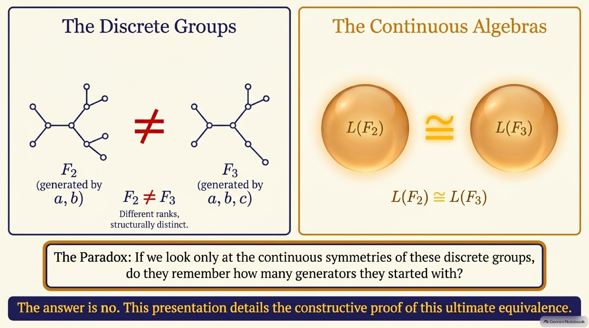

*The trees on this slide are decorative; the actual Cayley graphs of $`\mathbb{F}_2`$ and $`\mathbb{F}_3`$ are 4-regular and 6-regular trees.*

The paper recounts that Murray and von Neumann's work distinguished the free group factors from the hyperfinite factor but not from each other, and that Dykema's account credits Kadison with raising the rank question. Wikipedia's article on free probability says Voiculescu created that theory "in order to attack the free group factors isomorphism problem".

### 1.6 Amplification and the fundamental group

You can **cut a corner** out of a II₁ factor $`M`$: for a projection $`p`$ with $`\tau(p) = t`$, the algebra $`pMp`$ with the rescaled trace $`t^{-1}\tau`$ is again a II₁ factor. You can also go **up**: $`M_2(M)`$, the $`2\times 2`$ matrices with entries in $`M`$, is a II₁ factor of "size 2". Combining both gives the **amplification** $`M^t`$ for every real $`t > 0`$ (the paper's Section 6 uses the projection $`p`$ in $`M \bar\otimes B(\ell^2)`$). It is well-defined up to isomorphism. The **fundamental group** of $`M`$ is

```math
\mathcal{F}(M) = \lbrace t > 0 : M^t \cong M \rbrace .
```

It is a subgroup of the positive reals. For the hyperfinite II₁ factor it is all of $`\mathbb{R}_{>0}`$. Connes showed that some group factors have countable fundamental group, and Popa found II₁ factors with trivial fundamental group $`\lbrace 1\rbrace`$.

### 1.7 Free probability in one page

Voiculescu's idea was to treat $`(M, \tau)`$ as a **non-commutative probability space**: elements are "random variables" and $`\tau`$ is "expectation". He introduced a new notion of independence. Subalgebras $`B_1, B_2, \dots`$ are **free** if

```math
\tau(b_1 b_2 \cdots b_r) = 0 \quad\text{whenever } \tau(b_j) = 0 \text{ and consecutive } b_j \text{ come from different } B_i .
```

This is the definition in the paper's Section 2. The model example: in $`L(\mathbb{F}_n)`$ the algebras generated by the different generators are free. For free Haar unitaries $`u, v`$, the commutator has $`\tau(u v u^{\ast} v^{\ast}) = 0`$, because the word $`x y x^{-1} y^{-1}`$ is not the identity. For *commuting* independent unitaries the same expression would be $`\tau(1) = 1`$. Freeness is the most non-commutative kind of independence.

Free probability has its own central limit theorem, whose limit is Wigner's **semicircle law**, and its own Poisson law. In 1991 Voiculescu showed that large independent random matrices are *asymptotically free*, which links the subject to random matrix theory. Moments in free probability are counted by **non-crossing pairings**, which is where the **Catalan numbers** $`1, 1, 2, 5, 14, 42, \dots`$ come from. They reappear in the paper's Section 4.

### 1.8 Interpolated free group factors and the dichotomy

Free probability gave precise formulas for corners of free group factors. Dykema and Rădulescu (1994) independently built **interpolated free group factors** $`L(\mathbb{F}_r)`$ for every real $`r > 1`$, agreeing with the usual ones at integers, and proved the **amplification formula** (the paper cites Dykema's Theorem 2.4)

```math
L(\mathbb{F}_r)^t \;\cong\; L(\mathbb{F}_{1 + (r-1)/t^2}) \qquad (r > 1,\ t > 0).
```

For example, cutting a corner of trace $`1/2`$ out of $`L(\mathbb{F}_2)`$ gives $`L(\mathbb{F}_{1 + 1/(1/4)}) = L(\mathbb{F}_5)`$. Taking $`t = 1/\sqrt{r-1}`$ shows that every $`L(\mathbb{F}_r)`$ is an amplification of $`L(\mathbb{F}_2)`$, which is how the Lean statement defines the non-integer ones.

The formula moves the parameter $`r`$ around continuously. Dykema and Rădulescu also proved the **dichotomy** (Dykema 1994 for finite parameters; Rădulescu 1994, Corollary 4.7, including $`r = \infty`$):

> Either all $`L(\mathbb{F}_r)`$, $`1 < r \le \infty`$, are isomorphic, or $`L(\mathbb{F}_r) \not\cong L(\mathbb{F}_s)`$ whenever $`r \ne s`$.

The formula also shows what each alternative would mean for the fundamental group. If $`t \ne 1`$, then $`1 + (r-1)/t^2 \ne r`$. So in the "all different" world $`\mathcal{F}(L(\mathbb{F}_r)) = \lbrace 1\rbrace`$, while in the "all the same" world it is all of $`\mathbb{R}_{>0}`$. For $`L(\mathbb{F}_\infty)`$ the answer $`\mathbb{R}_{>0}`$ was already known (Rădulescu 1992). **A single isomorphism between two different parameters decides the whole question.**

---

## 2. A short history

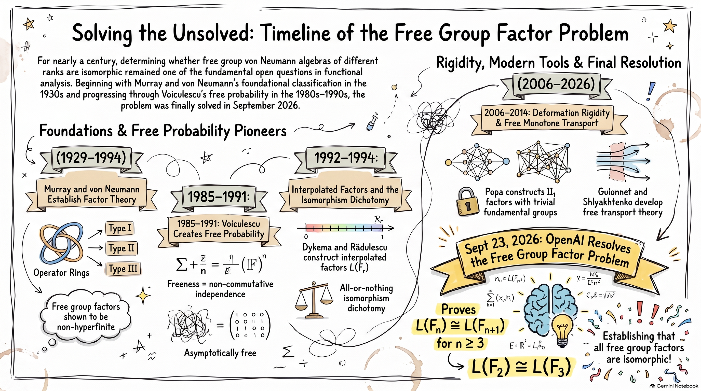

*AI-generated timeline. Its dates broadly agree with the table below, but "nearly a century" and "finally solved" overstate things (the free group factors date from 1943, and the solution is an unrefereed preprint), and its formulas are decorative. See the [errata](assets/README.md#errata).*

Items marked † come from our own background knowledge, not from the paper or its references. In review they were checked against the publication records in zbMATH (Connes, *J. Operator Theory* 4, 1980; Pimsner–Voiculescu, *J. Operator Theory* 8, 1982; Voiculescu, *Comm. Math. Phys.* 155, 1993, *Invent. Math.* 118, 1994 and *GAFA* 6, 1996; Ge, *Annals of Mathematics* 147, 1998). Property Γ and the fundamental group were checked against Stefaan Vaes's Bourbaki survey (2006) and his 2009 paper on property Γ, which credit both to Murray and von Neumann's 1943 paper.

| When | Who | What happened |
|---|---|---|
| 1929–1930 | **John von Neumann** | Introduces "rings of operators", now called von Neumann algebras, and proves the double commutant (bicommutant) theorem |
| 1936 | **Francis Murray, John von Neumann** | *On rings of operators*: factors, the division into types I, II and III, and the first factors not of type I |
| 1937 | **Murray, von Neumann** | A II₁ factor has a unique trace, and traces of projections fill $`[0,1]`$ |
| 1943 | **Murray, von Neumann** | *On rings of operators IV*: all hyperfinite II₁ factors are isomorphic, and the free group factors are not hyperfinite. The proof uses "property Γ"†, introduced here: the hyperfinite factor has it and the free group factors do not. The fundamental group is also introduced here† |
| 1969 | **Dusa McDuff** | Uncountably many non-isomorphic separable II₁ factors |
| 1980† | **Alain Connes** | Factors of ICC groups with property (T), such as $`\mathrm{SL}(3,\mathbb{Z})`$, have countable fundamental group |
| 1982† | **Mihai Pimsner, Dan-Virgil Voiculescu** | K-theory distinguishes the reduced group $`C^{\ast}`$-algebras of $`\mathbb{F}_n`$ for different $`n`$, so the problem is genuinely about the von Neumann closure |
| c. 1983–1986 | **Dan-Virgil Voiculescu** | Freeness and free probability, created to attack this problem. First paper: *Symmetries of some reduced free product C\*-algebras* (1985) |
| 1990 | **Voiculescu** | Circular and semicircular systems. His compression results show that the fundamental group of $`L(\mathbb{F}_\infty)`$ contains every positive rational |
| 1991 | **Voiculescu** | Independent random matrices are asymptotically free |
| 1992 | **Florin Rădulescu** | The fundamental group of $`L(\mathbb{F}_\infty)`$ is all of $`\mathbb{R}_{>0}`$ |
| 1994 | **Ken Dykema; Florin Rădulescu** (independently) | Interpolated free group factors $`L(\mathbb{F}_r)`$, the amplification formula, and the "all isomorphic or all different" dichotomy |
| 1993–1998† | **Voiculescu; Liming Ge** | Free entropy (Voiculescu, from 1993) and free entropy dimension (1994). Using them, free group factors cannot come from the group-measure space construction, since they have no Cartan subalgebra (Voiculescu, 1996), and cannot be split as tensor products of two II₁ factors (Ge, 1998) |
| Early 2000s | **Sorin Popa** | Deformation/rigidity theory (plenary lecture at ICM 2006); II₁ factors with trivial fundamental group (*Annals of Mathematics*, 2006). A huge range of group factors could now be told apart, but not the free group factors from each other |
| 2002 | **Voiculescu** | His survey *Free entropy* records the question whether free entropy dimension depends only on the von Neumann algebra a tuple generates (the paper's citation for it). If so, it would separate the ranks. *Cyclomorphy*, a theory of trace-preserving polynomial flows |
| 2014 | **Alice Guionnet, Dimitri Shlyakhtenko** | Free monotone transport: isomorphisms by analytic changes of variables, for perturbations of semicircular systems |
| 2024 | **Rémi Boutonnet, Daniel Drimbe, Adrian Ioana, Sorin Popa** | A non-separable analogue goes the other way: free powers $`A^{\ast n}`$ of a non-separable abelian algebra are pairwise non-isomorphic (cited in the reasoning summary) |
| 10 Sep 2026 | **Dimitri Shlyakhtenko** | A preprint identifying certain Fuchsian group factors with interpolated free group factors (as cited by the paper; not checked here) |
| 23 Sep 2026 | **OpenAI** (internal model) | **This paper:** $`L(\mathbb{F}_n) \cong L(\mathbb{F}_{n+1})`$ for $`n \ge 3`$, hence all free group factors are isomorphic |

---

## 3. What the paper proves

> **Theorem 1.1** (isomorphism of consecutive ranks). For every integer $`n \ge 3`$ there is a unital trace-preserving normal $`\ast`$-isomorphism $`L(\mathbb{F}_n) \cong L(\mathbb{F}_{n+1})`$.
>
> **Theorem 1.2.** There exists a unital normal trace-preserving $`\ast`$-isomorphism $`\Phi : L(\mathbb{F}_2) \to L(\mathbb{F}_3)`$.
>
> **Corollary 6.1.** For all $`1 < r, s \le \infty`$ there is a unital normal trace-preserving $`\ast`$-isomorphism $`L(\mathbb{F}_r) \cong L(\mathbb{F}_s)`$. Moreover $`\mathcal{F}(L(\mathbb{F}_r)) = \mathbb{R}_{>0}`$ for $`1 < r \le \infty`$.
>
> **Corollary 7.1** (dependence on von Neumann generators). In $`M = L(\mathbb{F}_2)`$, for every $`n \ge 2`$ there are a self-adjoint $`n`$-tuple $`X^{(n)}`$ and a self-adjoint $`2n`$-tuple $`Y^{(n)}`$, each generating $`M`$ as a von Neumann algebra, with $`\delta(X^{(n)}) = \delta_0(X^{(n)}) = n`$ and $`\delta^{\ast}(Y^{(n)}) = \delta^{\star}(Y^{(n)}) = n`$. So none of these four free entropy dimensions is an invariant of the von Neumann algebra.

In plain words:

- **"Unital, normal, trace-preserving $`\ast`$-isomorphism"** is the strongest natural notion of "the same algebra": a bijection that respects sums, products, adjoints, the unit, the trace, and limits in the weak topology.
- The heart of the paper is Theorem 1.1. It is proved by **absorbing one free generator**. Inside $`L(\mathbb{F}_{n+1})`$ it finds $`n`$ unitaries that have exactly the statistics of $`n`$ free Haar generators and still generate everything.
- Theorem 1.2 follows from Theorem 1.1 in four lines (the hand-made figure at the top). Use Theorem 1.1 twice to get $`L(\mathbb{F}_3) \cong L(\mathbb{F}_4) \cong L(\mathbb{F}_5)`$, then amplify both ends by $`t = \sqrt2`$. Dykema's formula gives $`L(\mathbb{F}_3)^{\sqrt2} \cong L(\mathbb{F}_{1+2/2}) = L(\mathbb{F}_2)`$ and $`L(\mathbb{F}_5)^{\sqrt2} \cong L(\mathbb{F}_{1+4/2}) = L(\mathbb{F}_3)`$.
- Corollary 6.1 is the dichotomy of section 1.8 applied to Theorem 1.2: **every free group factor, including $`L(\mathbb{F}_\infty)`$ and every interpolated one, is the same II₁ factor.**
- The words in Section 4 use the three letters $`x_1, x_2, x_3`$, and Theorem 1.1 is stated for $`n \ge 3`$. In the paper, rank 2 is reached by amplification, not by a direct absorption step. (The Lean development does take a direct rank-two step; see [section 7](#7-what-it-does-not-prove-and-caveats).)
- Corollary 7.1 is about **free entropy dimension**, a number Voiculescu attached to a finite tuple of self-adjoint operators using only its joint moments. $`\delta, \delta_0`$ ("microstates" versions) and $`\delta^{\ast}, \delta^{\star}`$ ("non-microstates" versions) are four variants of it.

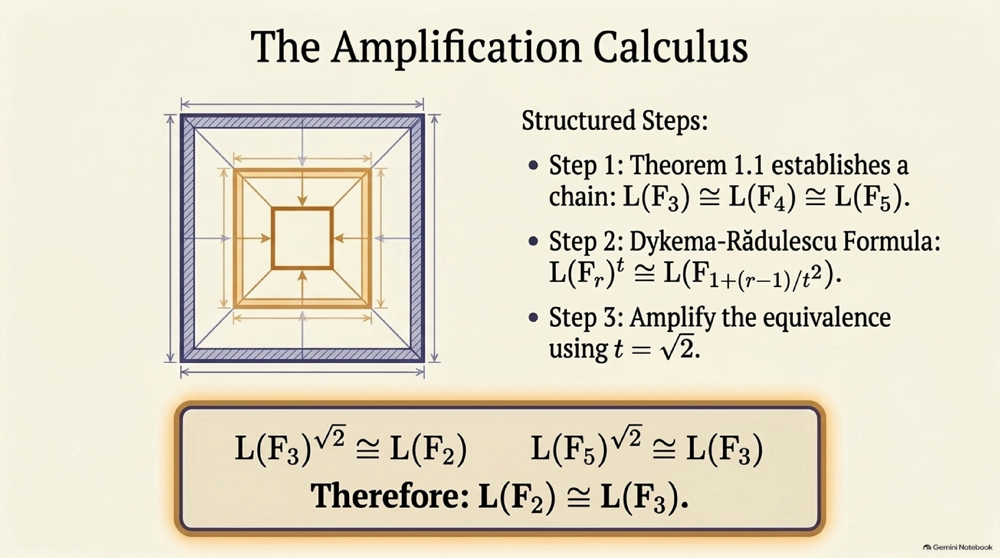

*(The slide's shrinking square is decorative: amplifying by $`t = \sqrt2 > 1`$ enlarges the algebra. Its formulas are correct.)*

The Lean 4 statement selected for Comparator, from [`InterpolatedFactors.lean`](https://github.com/openai/math/blob/main/lean/ComparatorChallenges/InterpolatedFactors.lean), reads:

```lean
theorem allInterpolatedIsomorphic (r s : ℝ≥0∞) (hr : 1<r) (hs : 1<s) :
    Nonempty (NormalTracialEquiv (interpolatedTrace r) (interpolatedTrace s)
      (interpolatedTopology r) (interpolatedTopology s))
```

Here `ℝ≥0∞` allows $`r = \infty`$. At integers the model is the group von Neumann algebra of `FreeGroup (Fin n)`, at $`\infty`$ it is that of `FreeGroup ℕ`, and at other real $`r`$ it is a normalized corner of the stabilization of $`L(\mathbb{F}_2)`$ by a projection of trace $`1/\sqrt{r-1}`$. `NormalTracialEquiv` is a $`\ast`$-algebra isomorphism that preserves the trace and is continuous in both directions for the ultraweak topology.

---

## 4. Why it matters

| | Before | After (if the paper is right) |
|---|---|---|
| **Is $`L(\mathbb{F}_2) \cong L(\mathbb{F}_3)`$?** | Open; one of the central problems on II₁ factors | Yes (Theorem 1.2) |
| **The interpolated family $`L(\mathbb{F}_r)`$, $`1 < r \le \infty`$** | Either all isomorphic or pairwise non-isomorphic, with no way to decide | All isomorphic, including $`L(\mathbb{F}_\infty)`$ (Corollary 6.1) |
| **Fundamental group of $`L(\mathbb{F}_2)`$** | Either $`\mathbb{R}_{>0}`$ or $`\lbrace 1\rbrace`$ (section 1.8) | $`\mathbb{R}_{>0}`$: every corner $`pL(\mathbb{F}_2)p`$, $`p \ne 0`$, is isomorphic to $`L(\mathbb{F}_2)`$ itself. For example $`M_2(L(\mathbb{F}_2)) \cong L(\mathbb{F}_2)`$ |
| **Free entropy dimension** | Voiculescu asked (the paper cites his 2002 survey) whether $`\delta`$ of a generating tuple depends only on the algebra. Invariance would have separated the ranks | It does not. On generating tuples of the single factor $`L(\mathbb{F}_2)`$, each of $`\delta, \delta_0, \delta^{\ast}, \delta^{\star}`$ takes every integer value $`\ge 2`$ (Corollary 7.1) |
| **Method** | Known isomorphisms of this kind came from free-probability models (compressions, free products) or from analytic transport near semicircular systems | Infinitely many small automorphisms, each moving the generators slightly, whose limit changes the *number* of generators |

The deeper significance is that much of the effort aimed the other way. The paper's introduction describes free entropy as one proposed route to an invariant that would *distinguish* the ranks. The reasoning summary shows that the model itself spent most of its search on $`L^2`$-homology, rigidity and dimension-type obstructions. The paper shows that no such invariant exists: $`L(\mathbb{F}_2)`$ is a single, extremely self-similar object.

---

## 5. The main idea of the proof

The paper has seven sections. Section 2 sets up freeness, Section 3 builds a flow, Section 4 finds its coefficients, Section 5 runs a limiting argument, Section 6 does the amplification, and Section 7 deduces the free entropy corollary. Here it is at three zoom levels.

### Level 1: the one-paragraph version

**Reformulation.** Lemma 2.2 says that to get an isomorphism $`L(\mathbb{F}_n) \cong M`$, it is enough to find $`n`$ unitaries in $`M`$ that (a) have the statistics of free Haar generators, meaning $`\tau(\text{word}) = 0`$ for every non-trivial reduced word, and (b) generate $`M`$. Inside $`M = L(\mathbb{F}_{n+1})`$, the first $`n`$ standard generators $`A_1, \dots, A_n`$ satisfy (a) but miss the last generator $`C`$. So the paper **wiggles** $`A_1, \dots, A_n`$ by automorphisms of $`M`$, which keep (a) automatically. Each wiggle is tiny in operator norm, but it is designed so that one very long word in the wiggled generators lands close to $`C`$. After infinitely many ever-smaller wiggles, the generators converge, and every element of $`M`$, including $`C`$, can be approximated by words in the limits. So (b) holds as well.

> **Analogy:** think of $`A_1, \dots, A_n`$ as dials, and of a long word as a long gear train driven by them. Turning each dial by a hair can turn the far end of a long enough train a full revolution. The paper finds hair-width turns of the dials whose combined effect at the end of one particular train is "multiply by $`C`$", and it never changes the gears' statistics.

### Level 2: the step-by-step picture


```mermaid
flowchart TD
    A["Start: free Haar generators A₁,…,Aₙ, C of L(Fₙ₊₁), n ≥ 3"] --> B["Take S = arg(C), a bounded Borel logarithm, and its<br/>conjugates S_g = A_g S A_g*, which form a free family (Lemma 2.3)"]
    B --> C["Flow (Prop. 3.1): dA_j/dt = i·(Σ_g h_j(g) A_g(t) S A_g(t)*)·A_j<br/>gives trace-preserving automorphisms β_t fixing C"]
    C --> D["Free-sum bound: ‖Σ k(g) S_g‖ ≤ 3π‖k‖ (Lemma 2.5)<br/>so A_j moves ≤ 3π‖h_j‖ and A_w ends within 3π‖D_w − δ_e‖ of C·A_w"]
    D --> E["Small cocycle (Lemma 4.1): a word w_m with m free prefixes has<br/>D_w = T_m h with T_m = 1 + Σ λ(p_j); Catalan moments, no atom at 0,<br/>so a small h gives T_m h ≈ δ_e"]
    E --> F["One step (Prop. 5.1): flow, then undo the free-basis change γ: C ↦ C·A_w<br/>(α = γ⁻¹∘β₁). Now A_j′ ≈ A_j and the word A′_w ≈ the old C"]
    F --> G["Iterate: tolerance ε_k, then the word w_k, then the budget r_k<br/>for all later moves; A^(k) → A^(∞) in norm, still free Haar"]
    G --> H["Generation: a dense sequence y_j is approximated by words in A^(∞);<br/>the conditional expectation onto W*(A^(∞)) is the identity"]
    H --> I["Theorem 1.1: L(Fₙ) ≅ L(Fₙ₊₁) for every n ≥ 3"]
    I --> J["L(F₃) ≅ L(F₄) ≅ L(F₅); amplify by √2 with Dykema's formula<br/>⇒ Theorem 1.2: L(F₂) ≅ L(F₃)"]
    J --> K["Dichotomy ⇒ all L(Fᵣ), 1 < r ≤ ∞, are isomorphic;<br/>fundamental group ℝ₊; free entropy dimensions are not invariants"]
```

**Step 1: A logarithm of the extra generator.** $`C`$ is a Haar unitary, so its spectrum is the whole circle. The paper takes $`S = \arg(C)`$ with values in $`(-\pi, \pi]`$, defined by the bounded Borel functional calculus (apply the function $`\arg`$ to $`C`$ through its spectral decomposition, as one would apply a function to the eigenvalues of a unitary matrix). It satisfies $`S = S^{\ast}`$, $`\lVert S\rVert \le \pi`$, $`\tau(S) = 0`$ and $`e^{iS} = C`$. Its conjugates $`S_g = A_g S A_g^{\ast}`$, one for each word $`g`$ in the first $`n`$ letters, form a **free family** (Lemma 2.3). Note that $`\arg`$ jumps at $`-1`$, so $`S`$ lies in the von Neumann algebra of $`C`$ but not in the $`C^{\ast}`$-algebra of $`C`$ (our remark; the paper only says that $`S`$ lies in $`W^{\ast}(C)`$). This matters in section 7.

**Step 2: A flow that changes the generators but not their statistics.** Pick finitely supported real vectors $`h_1, \dots, h_n`$ on $`\mathbb{F}_n`$ and solve

```math
\frac{d}{dt}A_j(t) = i\, s_t(h_j)\, A_j(t), \qquad s_t(k) = \sum_{g} k(g)\, A_g(t)\, S\, A_g(t)^{\ast}, \qquad A_j(0) = A_j .
```

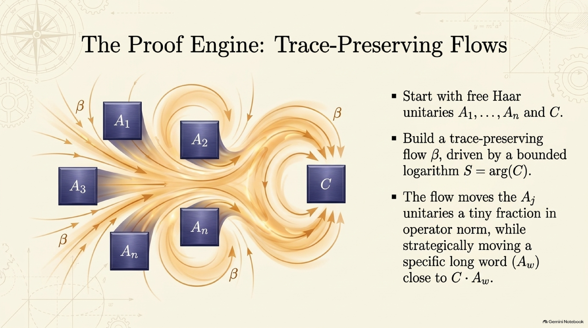

*(The slide labels two boxes $`A_n`$, and its arrows sweep toward $`C`$; in fact the flow fixes $`C`$.)*

Each $`s_t(h_j)`$ is self-adjoint, so the $`A_j(t)`$ stay unitary. The hard part is that **all moments are preserved**: $`\tau`$ of any polynomial in $`A_1(t), \dots, A_n(t), S`$ is independent of $`t`$. The paper proves an identity at $`t = 0`$ for a formal derivative (Lemma 3.2). The key fact is that conjugating one free variable $`S_g`$ by a unitary built from the *other* variables does not change any joint moment. Then it uses real-analyticity in $`t`$ to spread the identity to all times (Lemma 3.4). Moment preservation then turns the time-$`t`$ maps into trace-preserving automorphisms $`\beta_t`$ of the whole factor that fix $`S`$, and hence fix $`C`$ (Proposition 3.1).

**Step 3: Small coefficients move generators a little, but long words a lot.** A norm bound for free sums, $`\lVert \sum_g k(g) S_g\rVert \le 3\pi \lVert k\rVert_{\ell^2}`$ (Lemma 2.5), gives at time 1

```math
\lVert \beta_1(A_j) - A_j \rVert \le 3\pi \lVert h_j\rVert_{\ell^2}, \qquad \lVert \beta_1(A_w) - C A_w \rVert \le 3\pi \lVert D_w - \delta_e\rVert_{\ell^2} .
```

Here $`D_w`$ is the **cocycle** (Fox derivative) of the word $`w`$: $`D_{x_j} = h_j`$ and $`D_{gb} = D_g + \lambda(g)D_b`$. Each letter of $`w`$ contributes its coefficient, shifted by the prefix in front of it. So the goal is coefficients with $`\lVert h_j\rVert`$ **small** and a word with $`D_w`$ **close to $`\delta_e`$**.

**Step 4: The small cocycle (Section 4).** Take $`h_2 = \cdots = h_n = 0`$ and only $`h_1 = h`$. With $`a = x_1`$ and $`b_j = x_2^{j} x_3 x_2^{-j}`$, set $`p_j = (ab_1)(ab_2)\cdots(ab_j)`$ and $`w_m = p_m a`$. Only the letters $`a`$ contribute to the cocycle, so

```math
D_{w_m} = T_m h, \qquad T_m = 1 + \lambda(p_1) + \cdots + \lambda(p_m) .
```

The prefixes $`p_1, \dots, p_m`$ freely generate a free subgroup (Lemma 4.2), so $`T_m`$ is "1 plus $`m`$ free Haar unitaries". Counting which products of these unitaries reduce to the identity is a non-crossing pairing count. It gives Catalan numbers: the spectral distribution of $`T_m T_m^{\ast}/m`$ converges to the law with density $`\frac{1}{2\pi}\sqrt{(4-x)/x}`$ on $`(0,4)`$ (Lemma 4.3), which has **no atom at 0**. So $`T_m`$ is invertible on all but a tiny part of its spectrum. Inverting it there (a spectral cutoff) gives $`h`$ with $`\lVert h\rVert^2 \le 1/(dm)`$ and $`\lVert T_m h - \delta_e\rVert`$ small. A long word with many free prefixes acts as a lever: the coefficient needed shrinks roughly like $`1/\sqrt{m}`$.

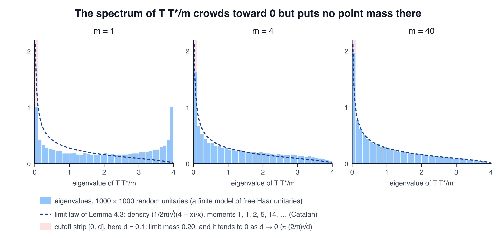

*The figure uses $`1000\times1000`$ random unitary matrices as a finite stand-in for free Haar unitaries. That is Voiculescu's asymptotic freeness, an illustration only; the paper works with exact operators on $`\ell^2(\mathbb{F}_n)`$. The density blows up at 0, but the mass near 0 goes to zero, and that is all the cutoff needs.*

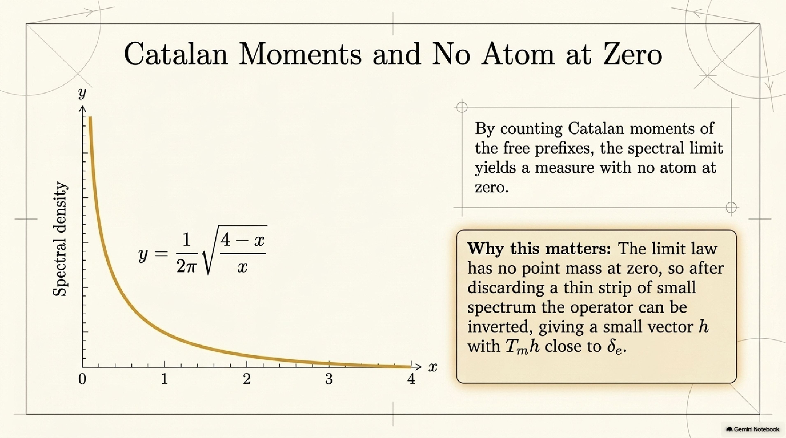

**Step 5: Swap the target (Proposition 5.1).** Step 3 makes the moved word close to $`C A_w`$, not to $`C`$. The fix is a change of free basis: the automorphism $`\gamma`$ that fixes every $`A_j`$ and sends $`C \mapsto C A_w`$ (its inverse sends $`C \mapsto C A_w^{\ast}`$). Then $`\alpha = \gamma^{-1}\circ\beta_1`$ satisfies

```math
\max_j \lVert \alpha(A_j) - A_j\rVert < \varepsilon, \qquad \lVert \alpha(A_w) - C \rVert < \varepsilon ,
```

and $`\alpha`$ maps the free generating tuple $`(A, C)`$ to a new free generating tuple $`(A', C A_w^{\ast})`$. A word in the slightly moved generators now imitates the *old* $`C`$.

**Step 6: Iterate, and let the error budget wait for the word (Section 5).** Fix a dense sequence $`y_1, y_2, \dots`$ in $`L^2(M)`$. At stage $`k`$, approximate $`y_1, \dots, y_k`$ by polynomials in the current generators *and* the current extra generator. Choose a tolerance $`\varepsilon_k`$, and apply Proposition 5.1. Now substitute the witness word for the extra generator, which gives approximations by polynomials in the $`n`$ generators alone. Only then choose the budget $`r_k`$ for all future moves, small enough for these (possibly very long) polynomials to survive. The paper's Figure 1 shows this order of choices. The budgets shrink geometrically, so $`A_j^{(k)} \to A_j^{(\infty)}`$ in operator norm. Limits of free Haar tuples are free Haar, so (a) survives. Every $`y_j`$ is an $`L^2`$-limit of polynomials in $`A^{(\infty)}`$, and a conditional expectation argument shows that $`W^{\ast}(A^{(\infty)}) = M`$. (The conditional expectation onto a subalgebra $`N`$ is the trace-preserving projection of $`M`$ onto $`N`$. Here it fixes a dense set, so it is the identity and $`N = M`$.) That is (b). Remark 5.2 notes that the extra generators $`C^{(k)}`$ need not converge at all.

**Step 7: From consecutive ranks to everything.** This is the amplification in the hand-made figure at the top, followed by the dichotomy.

<details>
<summary><b>Worked calculations</b>: the words, the cocycle, the Catalan moments and the lever (all computed by script)</summary>

**The words.** For $`m = 2`$ the paper's word is

```math
w_2 = p_2\, a = x_1\, x_2\, x_3\, x_2^{-1}\; x_1\, x_2^{2}\, x_3\, x_2^{-2}\; x_1 ,
```

with prefixes $`p_1 = x_1 x_2 x_3 x_2^{-1}`$ and $`p_2 = p_1\, x_1 x_2^2 x_3 x_2^{-2}`$. In general $`|p_m| = m^2 + 3m`$ and $`|w_m| = m^2 + 3m + 1`$. A script applied the cocycle rule letter by letter with $`h_1 = \delta_e`$ and found $`D_{w_m} = \delta_e + \delta_{p_1} + \cdots + \delta_{p_m}`$ for $`m = 1, 2, 3`$, exactly the formula $`D_{w_m} = T_m h`$. It also checked that no reduced word of length at most 6 in $`p_1, p_2`$ (1,456 words), and none of length at most 5 in $`p_1, p_2, p_3`$ (4,686 words), collapses to the identity. That is consistent with Lemma 4.2.

**The Catalan moments.** $`\tau((T_m T_m^{\ast})^r)`$ counts the index sequences whose word reduces to the identity. Counting exactly (by meeting in the middle) gives these normalized moments $`\tau((T_mT_m^{\ast}/m)^r)`$:

| $`m`$ | $`r = 1`$ | $`r = 2`$ | $`r = 3`$ | $`r = 4`$ |
|---|---|---|---|---|
| 1 | 2 | 6 | 20 | 70 |
| 5 | 1.2 | 2.64 | 7.008 | 20.458 |
| 20 | 1.05 | 2.1525 | 5.463 | 15.451 |
| 100 | 1.01 | 2.030 | 5.091 | 14.282 |
| $`\to\infty`$ (Lemma 4.3) | **1** | **2** | **5** | **14** |

For $`m = 1, 2, 3`$ the counts with the real words $`p_j`$ in $`\mathbb{F}_3`$ agree with the counts for abstract free letters, as Lemma 4.2 predicts. Two exact patterns showed up: $`\tau(T_mT_m^{\ast}) = m + 1`$, as stated in the paper, and $`\tau((T_mT_m^{\ast})^2) = (m+1)(2m+1)`$. The second holds for every $`m`$ (our deduction): the contributing index patterns give $`1 + 5m + 2m(m-1)`$. Numerically integrating the limit density gives moments $`1, 1, 2, 5, 14, 42`$, the Catalan numbers.

**The lever.** In the proof of Lemma 4.1 the cutoff inverse $`h = T_m^{\ast} R_m \delta_e`$ satisfies two exact identities. The miss is $`\lVert T_m h - \delta_e\rVert^2 = \mu_m([0,d])`$, the spectral mass below the cutoff, and the cost is $`\lVert h\rVert^2 = \tau(R_m) \le 1/(dm)`$. Replacing $`\mu_m`$ by its limit law (which is accurate only for large $`m`$) gives:

| cutoff $`d`$ | prefixes $`m`$ | size of the coefficient $`\lVert h\rVert`$ | miss $`\lVert D_w - \delta_e\rVert`$ | word length $`\lvert w_m\rvert`$ |
|---|---|---|---|---|
| 0.01 | $`10^2`$ | 0.242 | 0.252 | $`1.0\times10^{4}`$ |
| 0.01 | $`10^4`$ | 0.024 | 0.252 | $`1.0\times10^{8}`$ |
| 0.0001 | $`10^4`$ | 0.079 | 0.080 | $`1.0\times10^{8}`$ |
| 0.0001 | $`10^6`$ | 0.008 | 0.080 | $`1.0\times10^{12}`$ |

The cutoff controls the miss, and the number of prefixes then shrinks the coefficient like $`1/\sqrt m`$. With the paper's own (unoptimized) choices, a target $`\eta = 0.1`$ needs $`\nu([0,d]) < \eta^2/16`$, so $`d \approx 9.6\times10^{-7}`$. The second condition $`1/(dm) < \eta^2/16`$ alone then forces $`m > 1.7\times10^{9}`$, a word at least about $`2.8\times10^{18}`$ letters long. The construction is explicit in principle and astronomically large in practice.

**The amplification.** $`1 + (3-1)/(\sqrt2)^2 = 2`$, $`1 + (4-1)/2 = 2.5`$ and $`1 + (5-1)/2 = 3`$ (the hand-made figure at the top).
</details>

### Level 3: the analytic engine, for readers who know free probability

**Trace preservation without assuming freeness at positive times.** Let $`\mathcal P`$ be the universal $`\ast`$-algebra on unitaries $`a_1, \dots, a_n`$ and a self-adjoint $`z`$, and define the derivation $`\delta z = 0`$, $`\delta a_j = i\sigma(h_j)a_j`$ with $`\sigma(k) = \sum_g k(g) a_g z a_g^{\ast}`$. The cocycle identity gives $`\delta a_g = i\sigma(D_g)a_g`$ and $`\delta z_g = i[\sigma(D_g), z_g]`$. Lemma 3.2 proves $`\tau(\mathrm{ev}_0(\delta^r p)) = 0`$ for all $`p`$ and $`r\ge 1`$. Monomials with a non-trivial group label have trace zero. Identity-label monomials are polynomials in the $`S_g`$, and for each $`g`$ the evaluated direction $`i[Y_g, S_g]`$, with $`Y_g`$ in the algebra of the other $`S_b`$, is the derivative of conjugation by $`e^{iuY_g}`$. Freeness makes that conjugation law-preserving. Lemma 3.4 bounds $`\lVert \tfrac{1}{r!}\tfrac{d^r}{dt^r}\mathrm{ev}_t(p)\rVert`$ geometrically, using only unitarity and $`\lVert S\rVert \le \pi`$. This makes $`t \mapsto \tau(\mathrm{ev}_t(p))`$ real-analytic with all derivatives zero at $`0`$, hence constant. Faithfulness of $`\tau`$ and $`\lVert b\rVert = \lim_k \tau((b^{\ast}b)^k)^{1/2k}`$ then make $`\mathrm{ev}_0(p) \mapsto \mathrm{ev}_t(p)`$ a well-defined isometric $`\ast`$-automorphism of $`C^{\ast}(A, S)`$, extended to $`M`$ through the unitary it induces on $`L^2(M)`$. The paper notes the relation to Voiculescu's cyclomorphy theorem, which exponentiates trace-preserving polynomial vector fields on algebraically free self-adjoint generators. Here the descent through the unitary relations is proved directly from moments.

**The free-sum estimate.** For centered self-adjoint $`z_j`$ in free subalgebras, $`\lVert\sum_j z_j\rVert \le 2(\sum_j \lVert z_j\rVert_2^2)^{1/2} + \max_j\lVert z_j\rVert`$. Split left multiplication on the free-product Fock space into creation, annihilation and diagonal parts, as in Ricard and Xu's Khintchine inequalities. With $`\lVert S_g\rVert, \lVert S_g\rVert_2 \le \pi`$ this gives the support-independent constant $`3\pi`$.

**Spectral input.** Expanding $`\tau(Q_m^r)`$, $`Q_m = T_mT_m^{\ast}`$, over $`\lbrace 0,\dots,m\rbrace^{2r}`$, the non-zero terms with $`r`$ distinct non-zero indices correspond exactly to the non-crossing pairings with opposite exponents. That gives $`\tau(Q_m^r) = \mathrm{Cat}_r (m)_r + O_r(m^{r-1})`$. The limit law, with density $`\frac1{2\pi}\sqrt{(4-x)/x}`$, is the free Poisson (Marchenko–Pastur) law of rate one. The reasoning summary uses that name; the paper does not. Its moments $`\mathrm{Cat}_r`$ determine it, since its support lies in $`[0,4]`$. The cutoff inverse uses $`Q_mR_m = E_m = 1_{(dm,\infty)}(Q_m)`$ and the real symmetry of the left regular representation to get a real $`h`$, then truncates to finite support, as the polynomial flow requires.

**The limit.** Norm convergence of $`A^{(k)}`$ keeps the free Haar word distribution ($`\tau(A_v^{(\infty)}) = \lim_k \tau(A_v^{(k)}) = 0`$). The $`L^2`$-Lipschitz bound $`\lVert F(U) - F(V)\rVert_2 \le L(F)\, d_2(U,V)`$, with $`L(F) = \sum_\nu \lvert c_\nu\rvert\,\lvert v_\nu\rvert`$, is what forces the budgets $`r_k`$ to be chosen after the word $`w_k`$ is known. Generation goes through the trace-preserving conditional expectation $`E_N`$ onto $`N = W^{\ast}(A^{(\infty)})`$, not through norm density. Remark 5.2 notes that the operator norms of the approximating polynomials may grow with $`k`$. The reasoning summary adds that recovering earlier coordinates could require discontinuous logarithms, so norm convergence of the generators alone does not give generation in norm.

**The entropy corollary.** All four free entropy dimensions depend only on the joint tracial distribution. Transport along $`\theta_n : L(\mathbb{F}_n) \to L(\mathbb{F}_2)`$ preserves it. A free semicircular $`n`$-tuple has $`\delta = \delta_0 = n`$. For the $`2n`$ real and imaginary parts of the canonical unitaries, Mineyev–Shlyakhtenko give $`\delta^{\ast} = \delta^{\star} = \beta_1^{(2)}(\mathbb{F}_n) - \beta_0^{(2)}(\mathbb{F}_n) + 1 = n`$. The paper stresses that this concerns von Neumann generators, and is compatible with the invariance of $`\delta^{\ast}`$ under change of *algebraic* generators.

### How the model found it (from the reasoning summary)

openai/math released an [abridged summary of the model's chain of thought](https://github.com/openai/math/blob/main/reasoning_traces/free-group-factor-isomorphism.pdf) for this family, written in the third person ("the assistant") and interspersed with short verbatim excerpts. It has seven sections and 54 references. It is a record of the search, not a proof. Read in order, it shows:

- **Sections 1–4: hunting for an obstruction.** Most of the search tried to prove the factors are *different*. The model tried width and dimension invariants of matrix microstates, $`L^2`$-homology and Fox-derivative closability, rigidity theorems (Ioana–Peterson–Popa for free-product components, Popa–Vaes's unique-Cartan and vanishing theorems), and transferring the non-separable theorem of Boutonnet–Drimbe–Ioana–Popa. It also tried boundary and index arguments (Julg–Valette), and cost and $`\ell^2`$-Betti analogies (Gaboriau). A recurring wall was that an abstract isomorphism can change generators in uncontrolled, non-smooth ways, so invariants defined through generators were hard to make intrinsic.
- **Section 5: the constructive turn.** After more failed obstructions, the model turned to free Haar "vertex variables" on the Cayley tree of the free group, with classical ergodic theory (Ornstein–Weiss, Bowen) as comparison. A classical analogy (edge differences determine vertex labels when the label distribution is not uniform) suggested giving the vertex variables a non-zero mean. That recovered generation but lost exact freeness.
- **Sections 6–7: the absorption flow.** The model first proposed a flow driven by a semicircular variable, and then the Fox-derivative lever with prefix sums $`P = 1 + \sum \lambda(p_r)`$, the Catalan moments, a Marchenko–Pastur limit and a spectral cutoff. In section 7 it replaced the semicircular variable by the bounded logarithm $`S = \mathrm{Arg}(C)`$ and proposed the $`3\pi`$ free-sum bound. It also corrected itself: the moved word approaches $`C A_w`$, not $`C`$, and an inverse Nielsen automorphism fixes the target. The diagonal iteration with error budgets appears in section 6 of the summary, and the separate $`L^2`$ generation argument in section 7.

---

## 6. The people whose ideas this builds on

| Person | Idea | Where it shows up in the paper |
|---|---|---|
| **Francis Murray, John von Neumann** | Von Neumann algebras, factors, II₁ factors and their trace; the free group factors (1936–1943) | The objects themselves; Lemma 2.2 identifies $`L(\mathbb{F}_d)`$ by a generating Haar tuple |
| **Richard Kadison** | Raised the rank-isomorphism question (as credited in Dykema's 1994 introduction) | The problem |
| **Dan-Virgil Voiculescu** | Free probability, reduced free products, circular and semicircular systems; compression results; free entropy; cyclomorphy | Freeness throughout; the Catalan count is the circular-system moment calculation; the flow is a hands-on cousin of cyclomorphy; Corollary 7.1 answers his question |
| **Florin Rădulescu** | Fundamental group of $`L(\mathbb{F}_\infty)`$ is $`\mathbb{R}_{>0}`$ (1992); interpolated factors and the dichotomy including $`\infty`$ (1994) | Corollary 6.1 |
| **Ken Dykema** | Interpolated free group factors and the amplification formula $`L(\mathbb{F}_s)^t \cong L(\mathbb{F}_{1+(s-1)t^{-2}})`$ (1994) | Theorem 1.2 (in the paper's words, "the only interpolation theorem used in the proof"); the dichotomy |
| **Ralph Fox** | Free differential calculus (1953) | The cocycle rule $`D_{gb} = D_g + \lambda(g)D_b`$ is its coefficient form |
| **Éric Ricard, Quanhua Xu** | Khintchine inequalities for reduced free products (2006) | The creation–annihilation–diagonal splitting behind the $`3\pi`$ bound (Lemma 2.5) |
| **Alice Guionnet, Dimitri Shlyakhtenko** | Free monotone transport (2014) | Compared in the introduction: transport changes variables analytically, while this paper iterates small automorphisms that change the number of generators |
| **Igor Mineyev, Dimitri Shlyakhtenko; Alain Connes, Shlyakhtenko** | Non-microstates free entropy dimension of group algebras; $`L^2`$-homology and $`L^2`$-Betti numbers | The $`\delta^{\ast}, \delta^{\star}`$ values in Corollary 7.1 |
| **Isaac Goldbring, Jennifer Pi** | A precise modern restatement of the free group factor alternative (2025) | The paper's reference for the dichotomy |
| **Dimitri Shlyakhtenko** | A 2026 preprint on II₁ factors of Fuchsian groups, with its own free-complement and limiting-generation construction | Discussed as related work; "No result from that preprint is used" |
| **Markus Haase** | The functional-calculus approach to the spectral theorem | Defines $`S = \arg(C)`$ by bounded Borel functional calculus |

---

## 7. What it does not prove, and caveats

> [!IMPORTANT]
> **The groups are still different, and so are their $`C^{\ast}`$-algebras.** $`\mathbb{F}_2 \not\cong \mathbb{F}_3`$ as groups. Also (our background, not the paper) the reduced group $`C^{\ast}`$-algebras, the *norm* closures of the same operators, are known to remember the rank through K-theory (Pimsner–Voiculescu). This does not contradict the paper: nothing forces an isomorphism of the von Neumann algebras to carry one reduced $`C^{\ast}`$-algebra onto the other. A heuristic reason (also ours) is that its automorphisms use $`S = \arg(C)`$, a discontinuous function of $`C`$ that lies in the von Neumann algebra but not in the $`C^{\ast}`$-algebra of $`C`$. The paper proves generation in the $`L^2`$ and von Neumann sense (Section 5 and Remark 5.2), not in operator norm. The isomorphism lives only in the weak-closure world.

> [!WARNING]
> **A construction by infinitely many choices, not a formula.** The isomorphism $`L(\mathbb{F}_n) \to L(\mathbb{F}_{n+1})`$ is the limit of infinitely many automorphisms, each built from a spectral cutoff, a finite truncation and an adaptively chosen word. No closed formula is given for where it sends the generators. With the paper's own (unoptimized) choices, a single step with cocycle accuracy $`\eta = 0.1`$ already uses a word at least about $`3\times10^{18}`$ letters long (worked calculations in section 5). The paper says nothing about which *other* groups give the same factor, apart from citing Shlyakhtenko's 2026 preprint on Fuchsian groups.

> [!NOTE]
> **What the result rests on.** The constructive part (Theorem 1.1) is proved in the paper from standard facts about finite von Neumann algebras (Borel functional calculus, Kaplansky density, conditional expectations); the paper says it gives "the estimates and moment arguments needed here in full". Theorem 1.2 also uses Dykema's amplification formula (cited, not reproved). The statements about the whole interpolated family and $`L(\mathbb{F}_\infty)`$ use the classical dichotomy (Rădulescu 1994, Corollary 4.7; Dykema 1994, Corollary 4.2). Corollary 7.1 uses published free entropy computations (Voiculescu; Brannan–Elzinga–Harris–Yamashita; Mineyev–Shlyakhtenko).

> [!NOTE]
> **Provenance.** The paper was produced by an unreleased internal OpenAI model as part of the [openai/math](https://github.com/openai/math) release. According to that repository's README, most results came from the same fixed procedure, averaging about three hours of ChatGPT Pro thinking compute per result. The README lists two exceptions to that procedure (a zero-free region for the Riemann zeta function, and the Hodge Conjecture for CM abelian varieties); this family is not among them. The README also says that the collection "includes results at different stages of verification", and that "some of the unformalized results could have issues". This family is one of ten for which an abridged reasoning summary was released.

> [!NOTE]
> **Verification status.** The [Lean scope document for family 287](https://github.com/openai/math/blob/main/lean/docs/287.md) says the formalization proves that interpolated free group factors with any parameters $`r, s > 1`$, including the infinite parameter, are normally trace-preservingly isomorphic. It adds that "the paper's fundamental-group conclusion is a further consequence rather than a separate selected statement here". The Comparator configuration [`InterpolatedFactors.json`](https://github.com/openai/math/blob/main/lean/ComparatorChallenges/InterpolatedFactors.json) checks `OAI.FreeGroupFactorMain.Interpolation.allInterpolatedIsomorphic` against the solution module `OAI.Analysis.InterpolatedFactors.Interpolation`, with permitted axioms `propext`, `Quot.sound` and `Classical.choice`. Three details are worth knowing:
>
> - [`lean/formalization.yaml`](https://github.com/openai/math/blob/main/lean/formalization.yaml), the catalogue of formalized results, does **not** list this paper or this theorem (checked 7 October 2026). Its catalogue-wide `review` field reads `unchecked`.
> - The free-entropy Corollary 7.1 has no selected Lean statement. The solution module does contain a fundamental-group theorem, `allInterpolatedFundamentalGroups`, but it is not among the Comparator theorem names, so its statement is not compared against a published challenge.
> - Reading the Lean source (re-fetched 7 October 2026, not built), the development's route differs from the paper's in places. It proves `rankStep`, the paper's Theorem 1.1 for $`n \ge 3`$. It also proves `rankTwo`, $`L(\mathbb{F}_2) \cong L(\mathbb{F}_3)`$, directly by an absorption step at rank two that uses a separate rank-two small-cocycle construction (`smallCocycleTwo`), where the paper amplifies instead. A third theorem, `rankThreeInfinite`, gives $`L(\mathbb{F}_3) \cong L(\mathbb{F}_\infty)`$ by absorbing countably many extra generators into three. The non-integer models, defined as corners of the stabilization of $`L(\mathbb{F}_2)`$, are identified with $`L(\mathbb{F}_2)`$ through a corner-scaling theorem for $`L(\mathbb{F}_\infty)`$ proved inside the development, rather than through Dykema's formula. The limiting-generation step is a Baire-category argument (`baire_local_approximation`) rather than the paper's explicit error budgets. The Lean scope document does not say which written argument the development follows.
>
> This explainer did not build the Lean development or run Comparator. A plain text search of the 77 solution files found no `sorry`, but that is no substitute for a build. As of October 2026 the paper is an unrefereed preprint, and the usual next step is independent review by experts in operator algebras.

> [!TIP]
> **Simplifications.** To stay readable, this explainer suppresses the formal polynomial algebra and its evaluation maps, the exact order of the finite truncations, the bookkeeping of real versus complex coefficients, and the distinction between the four free entropy dimensions. Every precise statement is in the 23-page paper.

---

## 8. Glossary

| Term | Meaning |
|---|---|
| **Hilbert space**, $`\ell^2(G)`$ | A complete inner-product space; $`\ell^2(G)`$ is the square-summable functions on a countable set $`G`$, with basis $`\delta_g`$ |
| **Bounded operator**, adjoint, unitary | A continuous linear map $`T`$ on a Hilbert space; $`T^{\ast}`$ is its adjoint; $`U`$ is unitary if $`U^{\ast}U = UU^{\ast} = 1`$ |
| **Von Neumann algebra** | A $`\ast`$-algebra of operators containing 1 and closed in the weak operator topology; equivalently a bicommutant $`S''`$ |
| **Factor** | A von Neumann algebra whose center is only the scalars |
| **Group von Neumann algebra** $`L(G)`$ | The von Neumann algebra generated by the left translations $`\lambda(g)`$ on $`\ell^2(G)`$ |
| **Trace** $`\tau`$ | $`\tau(x) = \langle x\delta_e, \delta_e\rangle`$ on $`L(G)`$: linear, $`\tau(1) = 1`$, $`\tau(xy) = \tau(yx)`$, positive and faithful |
| **II₁ factor** | An infinite-dimensional factor with a (necessarily unique) normalized trace; traces of projections fill $`[0,1]`$ |
| **Free group** $`\mathbb{F}_n`$, free group factor | The group of reduced words in $`n`$ letters; $`L(\mathbb{F}_n)`$ for $`n \ge 2`$ is a II₁ factor |
| **Hyperfinite II₁ factor** | The unique II₁ factor that is a limit of matrix algebras; free group factors are not hyperfinite |
| **Normal $`\ast`$-isomorphism** | A bijection preserving $`+`$, $`\times`$, adjoints, and continuous for the ultraweak (weak-type) topology |
| **Amplification** $`M^t`$, corner | $`M^t = p(M \bar\otimes B(\ell^2))p`$ with trace $`t`$, rescaled; for $`t \le 1`$ simply a corner $`pMp`$ |
| **Fundamental group** $`\mathcal{F}(M)`$ | The set of $`t > 0`$ with $`M^t \cong M`$. The paper proves it is $`\mathbb{R}_{>0}`$ for every free group factor |
| **Freeness** | Non-commutative independence: alternating products of centered elements from different subalgebras have trace 0 |
| **Haar unitary**, free Haar tuple | A unitary with $`\tau(u^k) = 0`$ for $`k \ne 0`$; a tuple whose non-trivial reduced words all have trace 0 |
| **Interpolated free group factors** $`L(\mathbb{F}_r)`$ | Factors for every real $`r > 1`$ (Dykema, Rădulescu), with $`L(\mathbb{F}_r)^t \cong L(\mathbb{F}_{1+(r-1)/t^2})`$ |
| **The dichotomy** | All $`L(\mathbb{F}_r)`$, $`1 < r \le \infty`$, are isomorphic, or no two are. The paper establishes the first alternative |
| **Borel functional calculus**, $`\arg(C)`$ | Applying a bounded (possibly discontinuous) function to a normal operator; $`S = \arg(C)`$ satisfies $`e^{iS} = C`$ |
| **Cocycle / Fox derivative** $`D_w`$ | $`D_{x_j} = h_j`$, $`D_{gb} = D_g + \lambda(g)D_b`$: each letter's coefficient shifted by its prefix |
| **Nielsen move** | A change of free basis, here $`C \mapsto C A_w`$ with the $`A_j`$ fixed |
| **Catalan numbers** | $`1, 1, 2, 5, 14, 42, \dots`$; they count non-crossing pairings and are the moments of the limit law in Lemma 4.3 |
| **Conditional expectation** $`E_N`$ | The trace-preserving projection of $`M`$ onto a von Neumann subalgebra $`N`$; on $`L^2`$ it is the orthogonal projection |
| **Free entropy dimension** $`\delta, \delta_0, \delta^{\ast}, \delta^{\star}`$ | Voiculescu's (and later) "dimension" of a tuple of operators, defined from its joint distribution |
| **Lean 4, Comparator** | A proof assistant that mechanically checks proofs, and a tool that checks a formal proof matches a published statement using only allowed axioms |

---

## 9. Slides, audio and other assets

Everything below except the two hand-made figures was generated with **Google NotebookLM** (now "Gemini Notebook") from the paper, the Lean scope document, the reasoning summary and the Wikipedia article on von Neumann algebras. The report and the mind map used only the paper and the Lean scope document. The outputs are kept exactly as NotebookLM produced them, apart from one revision of the slide deck. They are AI-generated, so see the [errata](assets/README.md#errata) before relying on any detail.

| Asset | What it is |
|---|---|
| [Slide deck (PDF)](assets/notebooklm/slides.pdf) · [PPTX](assets/notebooklm/slides.pptx) | 15 beginner slides. Slides 10, 11 and 15 were regenerated once to fix errors; a few smaller issues remain |
| [Infographic: overview](assets/notebooklm/infographic-overview.png) | The one-page summary shown at the top (it has some wrong formulas; see the errata) |
| [Infographic: history timeline](assets/notebooklm/infographic-history-timeline.png) | From von Neumann to September 2026, in sketch-note style |
| [Audio overview (≈1 min 42 s)](assets/notebooklm/audio-overview-brief.m4a) | A short podcast-style summary (not reviewed) |
| [Beginner report](assets/notebooklm/beginner-explainer-report.md) | NotebookLM's long-form technical explainer. Its proof walk-through matches the paper closely; a few phrasings overstate things |
| [Mind map](assets/notebooklm/mindmaps.md) | How the proof fits together |
| [Amplification figure](assets/figures/amplification-ladder.svg) | Hand-made diagram: $`3 \cong 4 \cong 5`$ becomes $`2 \cong 3`$ after amplifying by $`\sqrt2`$ (top of this page) |
| [Prefix-spectrum figure](assets/figures/prefix-spectrum.svg) | Computed chart: eigenvalues of $`T_mT_m^{\ast}/m`$ in a random-matrix model against the limit law of Lemma 4.3 (section 5) |

<details>
<summary><b>All 15 slides</b> (click to expand)</summary>

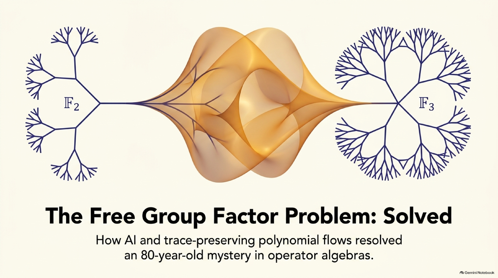


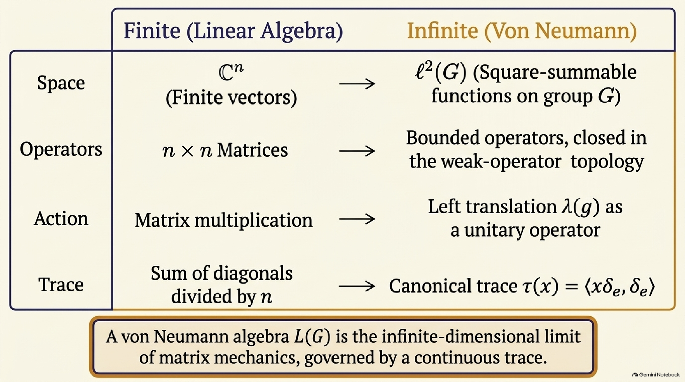

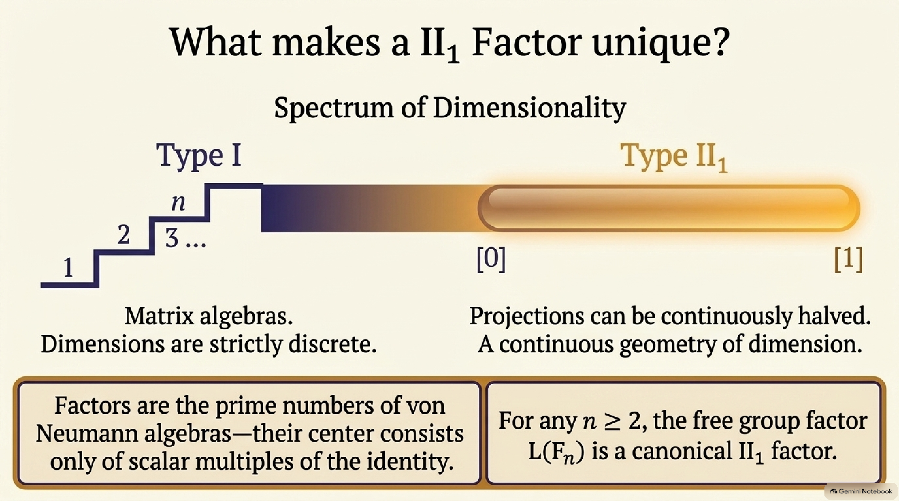

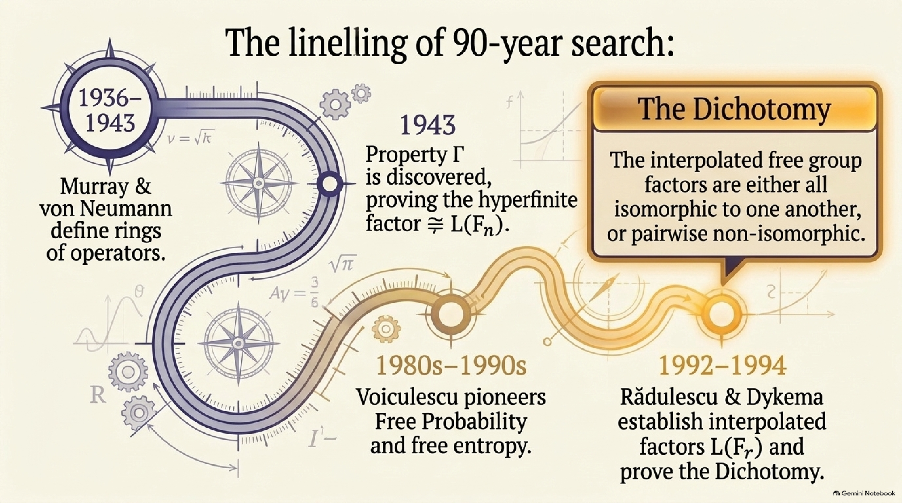

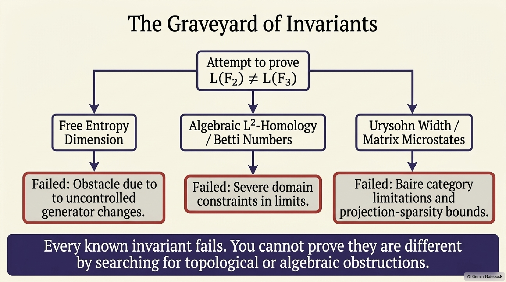

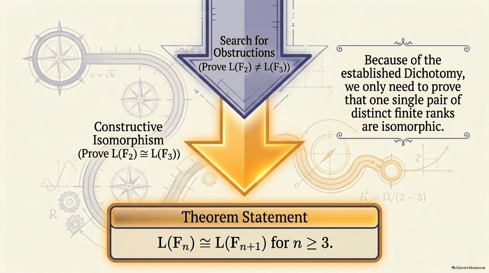


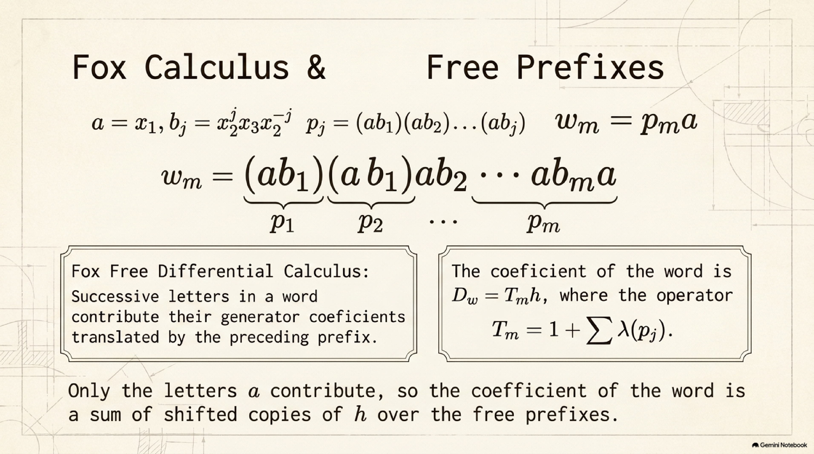


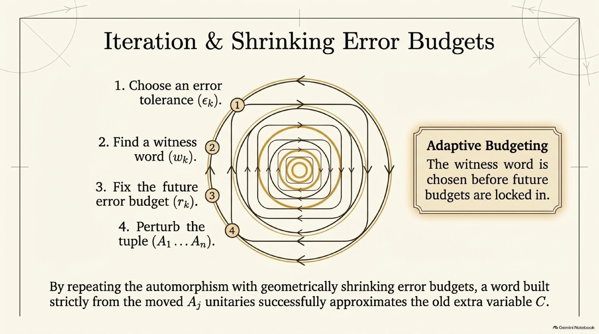

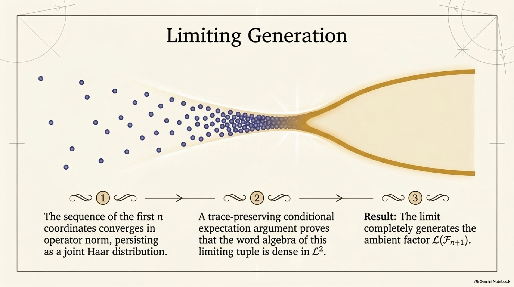

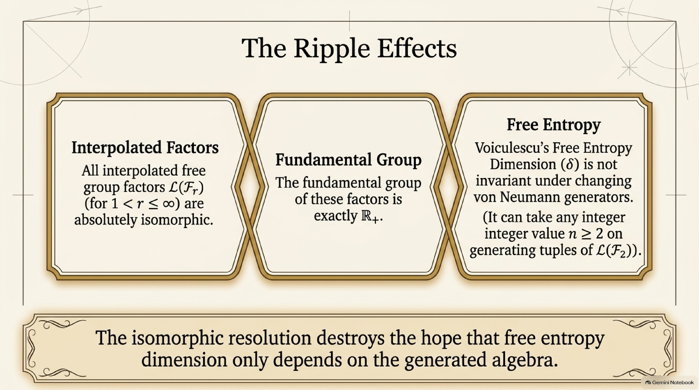

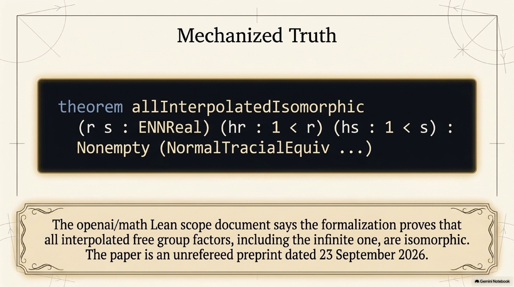

</details>

See [`assets/README.md`](assets/README.md) for the full inventory and the file-by-file [errata](assets/README.md#errata).

---

## How this explainer was made

1. The paper's PDF and TeX source, the preprint README, the family entry in `CONTENTS.md`, the reasoning summary, the Lean scope document `lean/docs/287.md`, the Comparator challenge and configuration, the Lean solution files and `lean/formalization.yaml` were downloaded from [openai/math](https://github.com/openai/math).
2. The paper, the Lean scope document, the reasoning summary and the Wikipedia article on [von Neumann algebras](https://en.wikipedia.org/wiki/Von_Neumann_algebra) were loaded into a NotebookLM notebook on a second NotebookLM account, through the [`notebooklm-mcp-cli`](https://github.com/jacob-bd/gemini-notebook-mcp-cli) MCP/CLI. That notebook generated the slides, infographics, report, mind map and audio in [`assets/notebooklm/`](assets/notebooklm/), using prompts written as plain statements of the paper's results (with the corrections from an independent fact-check of this page). The report and mind map were restricted to the paper and the Lean scope document. Every slide, both infographics and the report were then read against the paper. Three clearly wrong slides were regenerated once with `nlm slides revise`, and a slide-by-slide diff confirmed that nothing else changed.
3. The text on this page was written by hand (with AI assistance) directly from the paper's TeX source and the openai/math documentation. History dates were checked against the paper's bibliography and Wikipedia's articles on von Neumann algebras, free probability, Sorin Popa and Dan-Virgil Voiculescu; items marked † come from background knowledge and were checked separately against zbMATH records and published surveys. The cocycle values, the freeness of the prefixes, the exact moment counts, the limit-law integrals, the lever table and the amplification arithmetic were computed with small scripts. The two figures were drawn as hand-written SVG; the spectrum figure plots a random-matrix computation. NotebookLM's outputs contain mistakes, listed in the [errata](assets/README.md#errata), so they were used as visual and structural aids rather than as the source of truth.

See [`PIPELINE.md`](../../PIPELINE.md) for the exact, repeatable steps.

*Citation for the underlying paper:*

```bibtex
@misc{OAI:An-isomorphism-of-the-free-group-factors-September-23-2026,
  author = {{OpenAI}},
  title = {{An isomorphism of the free group factors}},
  howpublished = {OpenAI Math Release preprint
                  \href{https://github.com/openai/math/blob/main/preprints/An-isomorphism-of-the-free-group-factors-September-23-2026/An-isomorphism-of-the-free-group-factors-September-23-2026.pdf}{OAI:An-isomorphism-of-the-free-group-factors-September-23-2026}},
  year = {2026}
}
```
