# Catalan's constant is irrational, explained for beginners

> - **Paper:** [*Catalan's constant is irrational*](https://github.com/openai/math/blob/main/preprints/Catalans-constant-is-irrational-September-24-2026/paper.pdf), OpenAI, 24 September 2026 (44 pages)
> - **openai/math family:** 005, *Irrationality of Catalan's constant* · **Field:** number theory (irrationality of special values)
> - **Companions:** none. Family 005 contains only this manuscript, and openai/math has no reasoning summary for it
> - **Formal proof:** openai/math has a Lean 4 development for the theorem, a Comparator statement and a [scope document](https://github.com/openai/math/blob/main/lean/docs/005.md), but `lean/formalization.yaml` does not list it (see [section 7](#7-what-it-does-not-prove-and-caveats))
> - **Who this is for:** anyone who knows calculus and infinite series. No number theory is needed beyond primes and fractions. Level 3 of section 5 is for readers who have met $p$-adic numbers.

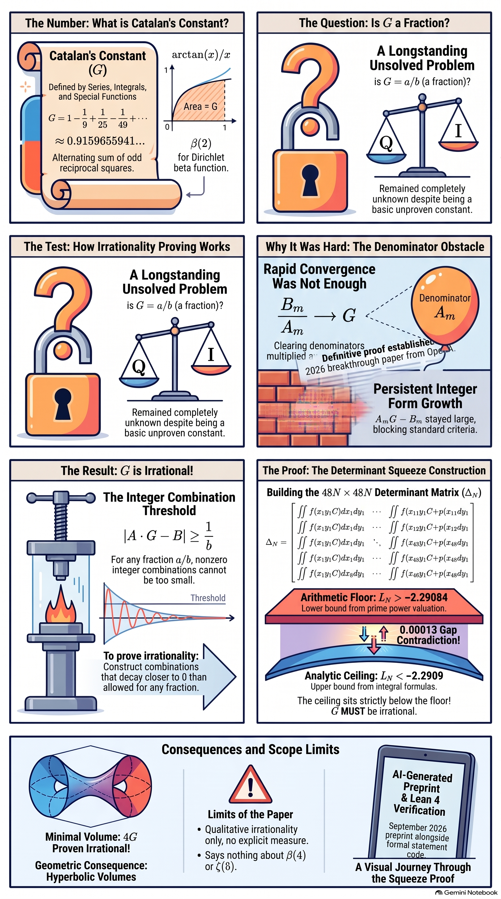

*AI-generated overview. It gets the big picture right, but panel 1 draws the curve y = arctan(x)/x rising instead of falling, panel 3 repeats panel 2, panel 5 is mislabeled, and the last panel says ζ(8) where it means ζ(5). See the [errata](assets/README.md#errata).*

## Contents

- [TL;DR](#tldr)
- [How to read this](#how-to-read-this)
- [1. The problem](#1-the-problem)
- [2. A short history](#2-a-short-history)
- [3. What the paper proves](#3-what-the-paper-proves)
- [4. Why it matters](#4-why-it-matters)
- [5. The main idea of the proof](#5-the-main-idea-of-the-proof)
- [6. The people whose ideas this builds on](#6-the-people-whose-ideas-this-builds-on)
- [7. What it does not prove, and caveats](#7-what-it-does-not-prove-and-caveats)
- [8. Glossary](#8-glossary)
- [9. Slides, audio and other assets](#9-slides-audio-and-other-assets)
- [How this explainer was made](#how-this-explainer-was-made)

---

## TL;DR

- **The question.** Catalan's constant is $G = 1 - \frac{1}{9} + \frac{1}{25} - \frac{1}{49} + \cdots = 0.9159655941\ldots$, the alternating sum of the reciprocals of the odd squares. It turns up in integrals, in the geometry of link complements and in counting domino tilings. Is it a fraction? Everyone expected the answer "no", but nobody could prove it. It was a standard example of a basic constant whose irrationality was unknown.
- **What was known.** There were results about *families*. Rivoal and Zudilin (2003) proved that infinitely many of the numbers $\beta(2), \beta(4), \beta(6), \ldots$ are irrational (here $\beta$ is the Dirichlet beta function and $`G = \beta(2)`$), and that at least one of $\beta(2), \ldots, \beta(14)$ is. Later work cut the list down to $\beta(2), \ldots, \beta(10)$. None of this could say *which* value is irrational. Fast rational approximations to $G$ were known too, but once their denominators are cleared they are not accurate enough for the classical irrationality test.
- **What this paper proves.** Theorem 1.1: **$G$ is irrational.** The paper also deduces that some hyperbolic volumes are irrational. One of them is $4G$, the smallest possible volume of an orientable hyperbolic 3-manifold with exactly two cusps.
- **How.** Suppose $G$ were a fraction. The paper builds a sequence of huge determinants $\Delta_N$ (of size $`48N \times 48N`$) whose entries are double integrals. Each integral is a combination of $1$, $G$ and $\zeta(2) = \pi^2/6$, and a careful choice of rows cancels the $\zeta(2)$ part exactly. So $\Delta_N$ would be a fraction. Counting how often each prime can divide its denominator gives a **lower bound** on $|\Delta_N|$, and a separate **reduction modulo primes** shows that $\Delta_N \ne 0$ when $N$ is a large prime. An integral formula gives an **upper bound** that is smaller still. The two bounds miss each other by only about $0.00013$ on the paper's normalized scale, but they do miss.
- **What it doesn't do.** It gives no irrationality *measure* (how well $G$ can be approximated by fractions), says nothing about transcendence, and does not settle $\beta(4)$ or $\zeta(5)$. It is an AI-generated preprint. openai/math contains a Lean 4 statement and proof of the main theorem, which this explainer did not re-run; the repository's formalization catalogue does not list it.

## How to read this

| You have… | Read |
|---|---|
| 2 minutes | The TL;DR and the infographic above |
| 15 minutes | Sections 1, 3, 4 and 7 |
| An hour, and you like analysis | Everything, including [section 5](#5-the-main-idea-of-the-proof) and the worked example inside it |

---

## 1. The problem

### 1.1 Rational and irrational numbers

A **rational number** is a fraction $a/b$ of whole numbers with $b \ne 0$. In decimal, rational numbers are exactly the ones whose digits eventually repeat: $1/7 = 0.142857\ 142857\ldots$. A real number that is not a fraction is **irrational**. The oldest example is $\sqrt{2}$: if $\sqrt 2 = a/b$ in lowest terms, then $a^2 = 2b^2$ forces both $a$ and $b$ to be even, which is a contradiction.

Most of the constants in a calculus course, such as $e$, $\pi$ and $\log 2$, are known to be irrational. But proving it for a specific number is often very hard, and **no amount of computing can settle it**. For this explainer we computed $G$ to 2,200 digits and its continued fraction

```math
G = [0;\ 1, 10, 1, 8, 1, 88, 4, 1, 1, 7, 22, 1, 2, 3, 26, 1, 11, \ldots]
```

for 1,500 terms, without it stopping (the largest of those terms is 6,328). That shows that if $G$ were a fraction $a/b$, the denominator $b$ would need more than 770 digits. That is a strong hint, but it is not a proof.

### 1.2 Catalan's constant and the Dirichlet beta function

The paper's definition is

```math
G = \beta(2) = \sum_{j=0}^{\infty} \frac{(-1)^j}{(2j+1)^2} = 1 - \frac{1}{9} + \frac{1}{25} - \frac{1}{49} + \cdots,
\qquad
\beta(s) = \sum_{j=0}^{\infty} \frac{(-1)^j}{(2j+1)^s}.
```

Computed with three independent methods (mpmath's built-in constant, Ramanujan's series $\frac{\pi}{8}\log(2+\sqrt3) + \frac38\sum_{n\ge0} \frac{1}{(2n+1)^2\binom{2n}{n}}$, and the defining series with convergence acceleration), all of which agree to 60 digits:

```math
G = 0.91596\ 55941\ 77219\ 01505\ 46035\ 14932\ 38411\ 07741\ 49374\ 28167\ldots
```

The defining series is an alternating series, so it converges, but slowly. After $N$ terms the error is about $1/(8N^2)$:

| Terms $N$ | Partial sum $S_N$ | Error $S_N - G$ |
|---|---|---|
| 1 | 1 | $+0.084$ |
| 2 | $8/9 = 0.8889$ | $-0.027$ |
| 3 | $209/225 = 0.9289$ | $+0.013$ |
| 10 | 0.914725 | $-0.0012$ |
| 100 | 0.91595310 | $-1.25\times10^{-5}$ |
| 10,000 | 0.915965592927 | $-1.25\times10^{-9}$ |

Every partial sum is a fraction, and the fractions get closer and closer to $G$. That says nothing about whether $G$ itself is a fraction. Every real number is a limit of fractions.

$G$ is one value of the **Dirichlet beta function** $\beta(s)$. The odd values are known in closed form (we checked these numerically):

```math
\beta(1) = \frac{\pi}{4}\ \ (\text{Leibniz's series } 1 - \tfrac13 + \tfrac15 - \cdots),\qquad
\beta(3) = \frac{\pi^3}{32},\qquad
\beta(5) = \frac{5\pi^5}{1536}.
```

The paper puts it this way: for odd $s$, $\beta(s)$ is a rational multiple of $\pi^s$, and "the even values present a different arithmetic problem". Nobody has a closed form for $\beta(2) = G$ or $\beta(4) = 0.98894\ldots$. This is a mirror image of the Riemann zeta function $\zeta(s) = \sum n^{-s}$. There the *even* values are the easy ones ($`\zeta(2) = \pi^2/6`$, $\zeta(4) = \pi^4/90$, found by Euler), and the *odd* values $\zeta(3), \zeta(5), \ldots$ are the mysterious ones.

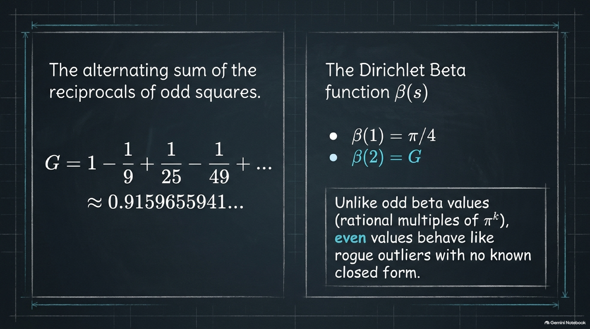

Number theorists also write $G = L(2, \chi_{-4})$. Here $\chi_{-4}(n)$ is $1$, $0$, $-1$, $0$ according as $n \equiv 1, 2, 3, 0 \pmod 4$, and $L(s,\chi) = \sum_n \chi(n) n^{-s}$ is a Dirichlet $L$-function.

### 1.3 Where G shows up

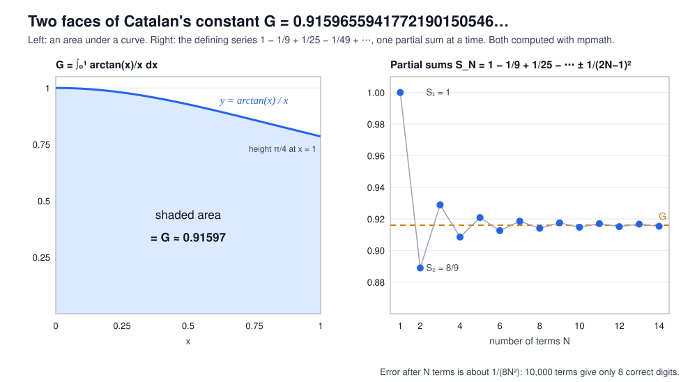

**Integrals.** $G$ is the value of a remarkable number of integrals. Each of these was checked numerically to 25 digits:

| Integral | Value |
|---|---|
| $\int_0^1 \frac{\arctan x}{x}\ dx$ (the shaded area in the figure above) | $G$ |
| $-\int_0^1 \frac{\ln x}{1+x^2}\ dx$ | $G$ |
| $\int_0^1\int_0^1 \frac{dx\ dy}{1+x^2y^2}$ | $G$ |
| $\frac12\int_0^{\pi/2} \frac{t}{\sin t}\ dt$ | $G$ |
| $-\int_0^{\pi/4} \ln(\tan v)\ dv$ | $G$ |
| $\frac12\int_0^{\infty} \frac{t}{\cosh t}\ dt$ | $G$ |

The first one is easy to see: expand $\arctan x / x = 1 - x^2/3 + x^4/5 - \cdots$ and integrate term by term. The paper uses the $\ln\tan$ integral and a double integral of its own, which reappears in [section 5](#5-the-main-idea-of-the-proof).

**Geometry.** The paper's conclusion recalls two facts about hyperbolic 3-dimensional space:

- By a theorem of Agol (2010), $4G = 3.66386\ldots$ is the smallest possible volume of an orientable complete finite-volume hyperbolic 3-manifold with exactly two cusps. The minimum is attained by the complements of the Whitehead link and of the $(-2,3,8)$ pretzel link.
- The "Bianchi orbifold" $`\mathrm{PSL}_2(\mathbb{Z}[i])\backslash\mathbb{H}^3`$, built from the Gaussian integers $`a + bi`$, has volume $`G/3 = 0.30532\ldots`$. This comes from a volume formula in Voight's *Quaternion Algebras* together with the factorization of the Dedekind zeta function of $`\mathbb{Q}(i)`$, $`\zeta_{\mathbb{Q}(i)}(2) = \zeta(2)\ L(2,\chi_{-4}) = \frac{\pi^2}{6} G`$.

**Counting.** (Background from Wikipedia, checked by our own computation.) A chessboard can be tiled by $2\times1$ dominoes in exactly $12{,}988{,}816$ ways. We confirmed this both with Kasteleyn's product formula and with a brute-force count. For large $k \times k$ boards the number of tilings grows like $e^{(G/\pi)k^2}$. This is the Temperley–Fisher result of 1961, with $G/\pi \approx 0.2916$. (Our computed values of $\log(\text{tilings})/k^2$ are $0.256, 0.273, 0.282, 0.287, 0.289$ for $k = 8, 16, 32, 64, 128$; they creep up toward $0.2916$.)

### 1.4 How do you prove that a number is irrational?

Almost every irrationality proof rests on one simple observation.

> **The basic test.** Suppose $x = a/b$. For any whole numbers $A$ and $B$,
> $$A x - B = \frac{Aa - Bb}{b}$$
> is a whole number divided by $b$. So it is either exactly $0$ or at least $1/b$ in size. Therefore, if you can find whole numbers $A_m, B_m$ with
> $$A_m x - B_m \ne 0 \quad\text{for all } m \qquad\text{and}\qquad A_m x - B_m \to 0,$$
> then $x$ cannot be a fraction.

Such combinations are called **integer linear forms** in $x$. The art is to find forms that are *small*, *provably nonzero*, and have *integer* coefficients, all at once.

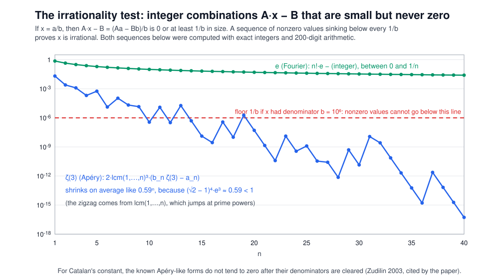

**$e$ (Euler 1737; Fourier, first printed by Janot de Stainville in 1815; general knowledge).** Euler proved $e$ irrational by finding its infinite continued fraction $[2; 1, 2, 1, 1, 4, 1, 1, 6, \ldots]$. Fourier's short proof is the test above in its purest form. Multiply $e = \sum_k 1/k!$ by $n!$:

```math
n!\,e = \underbrace{\sum_{k=0}^{n}\frac{n!}{k!}}_{\text{a whole number}} + \underbrace{\frac{1}{n+1} + \frac{1}{(n+1)(n+2)} + \cdots}_{\text{strictly between } 0 \text{ and } 1/n}.
```

So $A = n!$ and $B = \sum_{k\le n} n!/k!$ give $0 < A e - B < 1/n$. We computed these values: $0.718, 0.437, 0.310, 0.239, \ldots, 0.099$ for $n = 1, \ldots, 10$, each just below $1/n$.

**$\pi$ (Lambert, read to the Berlin Academy in 1767 and printed in 1768; general knowledge).** Lambert found a continued fraction for $\tan x$ and used it to show that $\tan x$ is irrational whenever $x$ is a nonzero fraction. Since $\tan(\pi/4) = 1$ is rational, $\pi/4$ cannot be a fraction. Legendre (1794) extended the method to show that $\pi^2$ is irrational, so $\zeta(2) = \pi^2/6$ is irrational too.

**$\zeta(3)$ (Apéry, announced 1978 and published 1979; the 1978 date is general knowledge).** Apéry's famous proof uses two sequences defined by the recurrence

```math
n^3 u_n = (34n^3 - 51n^2 + 27n - 5)\ u_{n-1} - (n-1)^3\ u_{n-2},
```

with $b_0 = 1, b_1 = 5$ and $a_0 = 0, a_1 = 6$. The $b_n$ are whole numbers ($`5, 73, 1445, \ldots`$). The $a_n$ are fractions, but $2\ \mathrm{lcm}(1,\ldots,n)^3\ a_n$ is always a whole number. And $b_n\zeta(3) - a_n$ shrinks like $(\sqrt2-1)^{4n} \approx 0.0294^n$. Clearing denominators multiplies the form by $2\ \mathrm{lcm}(1,\ldots,n)^3$, which grows like $e^{3n} \approx 20.09^n$ by the prime number theorem. Since $0.0294 \times 20.09 \approx 0.59 < 1$, the cleared forms still go to zero. We ran the recurrence with exact integers: the cleared form is about $3.6\times10^{-7}$ at $n=10$ and $5.4\times10^{-17}$ at $n = 40$ (the blue curve in the figure). Beukers (1979) soon gave a shorter proof *(general knowledge)* with integrals such as $\int_0^1\int_0^1 \frac{-\log(xy)}{1-xy}\ P_n(x)P_n(y)\ dx\ dy$ built from Legendre polynomials.

**The catch: denominators.** Notice what made Apéry's proof work. It was not enough that $a_n/b_n \to \zeta(3)$ quickly. The convergence had to beat the growth of the denominators that you must clear to get *integer* coefficients. The paper stresses exactly this: "Convergence of $B_m/A_m$ to $G$ alone does not suffice: multiplication by $A_m$ may remove the decay." For Catalan's constant, Zudilin (2003) built Apéry-like recurrences, a continued fraction and double integrals. According to the paper, his own discussion makes the obstruction explicit: the integer linear forms do not tend to zero, despite the rapid convergence of the fractions. Explicit approximations with $|G - p_m/q_m| \le q_m^{-0.6293\ldots}$ (Marcovecchio and Viola) and $q_m^{-0.62}$ (Eskandari, 2026) are not enough either. An exponent below 1 only gives $|q_m G - p_m| \le q_m^{0.38}$, which does not go to zero.

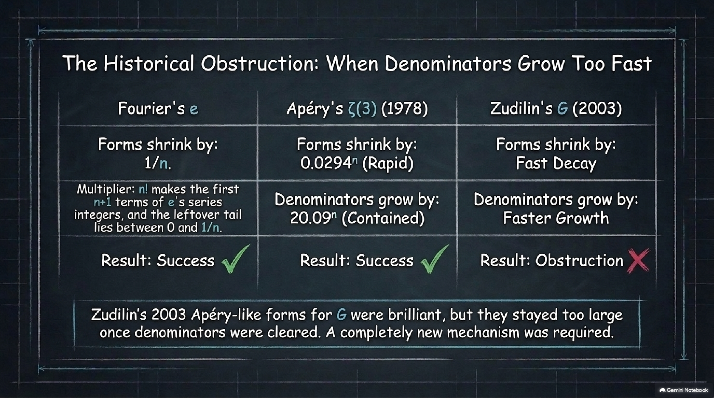

(The Zudilin column paraphrases the paper, which gives no rates for those forms.)

### 1.5 Families versus individuals

Another line of attack proves that *some* member of a list is irrational. Rivoal and Zudilin (2003) did this for the even beta values, much as Ball–Rivoal (2001) and Zudilin (2001) did for the odd zeta values (general knowledge: infinitely many of $\zeta(3), \zeta(5), \zeta(7), \ldots$ are irrational, and at least one of $\zeta(5), \zeta(7), \zeta(9), \zeta(11)$ is). These results build one linear form in *many* constants at once. As the paper says, "such family results guarantee irrational members without identifying the particular value $\beta(2)$."

### 1.6 A second weapon: determinants and the product formula

This paper uses a determinant instead of a single linear form. Zudilin (2017) gave a precedent, a "determinantal criterion". The idea needs one more fact about fractions. Every nonzero fraction $r$ factors into primes with whole-number exponents $v_p(r)$, which can be negative:

```math
r = \pm \prod_{p\ \text{prime}} p^{v_p(r)}, \qquad\text{so}\qquad \log|r| = \sum_{p} v_p(r)\log p .
```

For example $3/40 = 2^{-3}\cdot 3^{1}\cdot 5^{-1}$, so $\log(3/40) = -3\log 2 + \log 3 - \log 5$. A fraction can only be tiny if its denominator contains many primes to high powers. So if you can **limit how much each prime can contribute to the denominator**, you get a **lower bound** for $|r|$. If a completely different argument gives an **upper bound** below that, the only way out is $r = 0$. So you also have to prove that $r \ne 0$.

---

## 2. A short history

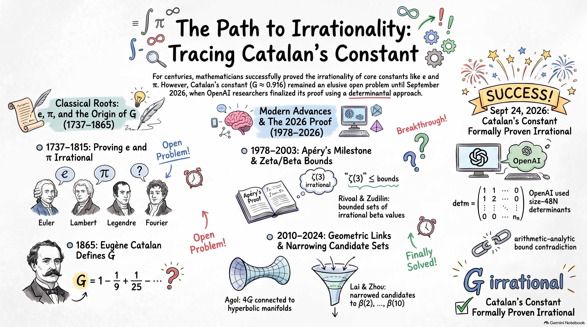

*NotebookLM's sketch-note timeline. It credits "OpenAI researchers" with a proof that was produced by an AI model, says the proof is "formally proven", and skips several of the events below. See the [errata](assets/README.md#errata).*

Items marked *(general knowledge)* come from the author's background knowledge and standard references, not from the paper. Everything from 2003 on is as described in the paper's introduction and conclusion.

| When | Who | What happened |
|---|---|---|
| 1737 (published 1744) | **Leonhard Euler** | The continued fraction of $e$, which shows that $e$ is irrational *(general knowledge)* |
| 1767 (printed 1768) | **Johann Heinrich Lambert** | $\pi$ is irrational, via a continued fraction for $\tan x$ *(general knowledge)* |
| 1794 | **Adrien-Marie Legendre** | $\pi^2$ is irrational, so $\zeta(2) = \pi^2/6$ is too *(general knowledge)* |
| 1815 | **Joseph Fourier** | The short series proof that $e$ is irrational, first printed by Janot de Stainville *(general knowledge)* |
| 1837 | **Peter Gustav Lejeune Dirichlet** | $L$-functions of characters, which include $\beta(s) = L(s,\chi_{-4})$ *(general knowledge)* |
| 1865 | **Eugène Catalan** | A memoir with quickly converging series for $G$; the constant is named after him (Wikipedia) |
| 1961 | **H. N. V. Temperley, Michael Fisher** (and Pieter Kasteleyn) | Domino tilings of large boards grow like $e^{(G/\pi)\cdot\text{area}}$ (Wikipedia) |
| 1978 (published 1979) | **Roger Apéry** | $`\zeta(3)`$ is irrational (and a new proof for $`\zeta(2)`$), via recurrences whose integer linear forms tend to zero (the 1978 announcement date is general knowledge) |
| 1979 | **Frits Beukers** | Short integral proofs of Apéry's theorems |
| 2000–2001 | **Tanguy Rivoal, Keith Ball; Wadim Zudilin** | Infinitely many odd zeta values are irrational; at least one of $\zeta(5), \ldots, \zeta(11)$ is *(general knowledge)* |
| 2003 | **Tanguy Rivoal, Wadim Zudilin** | Infinitely many even beta values are irrational; at least one of $\beta(2), \beta(4), \ldots, \beta(14)$ is |
| 2003 | **Wadim Zudilin** | Apéry-like recurrences, a continued fraction and double integrals for $G$; their integer linear forms do not tend to zero |
| 2005 | **Frank Calegari** | A 2-adic analogue $G_2$ of Catalan's constant is irrational. The real case has an extra $\pi^2$ term, so it does not follow |
| 2006, 2008 | **Tanguy Rivoal; Christian Krattenthaler and Rivoal** | Proofs of the conjectured denominator bounds for the hypergeometric approximations to $G$, which are still too costly for the basic test |
| 2010 | **Ian Agol** | $4G$ is the minimal volume of an orientable hyperbolic 3-manifold with two cusps |
| 2016 | **Yuri Nesterenko** | Effective approximations to $G$ from half-integer hypergeometric series and double Euler integrals |
| 2017 | **Wadim Zudilin** | A determinantal approach to irrationality; he explains why denominator growth still blocks it for $G$ |
| 2019 | **Zudilin; Krattenthaler and Zudilin** | One of $\beta(2), \ldots, \beta(12)$ is irrational; two hypergeometric constructions of the same approximants are identified |
| 2020 | **Stéphane Fischler** | Stronger quantitative irrationality and linear-independence results for families of Dirichlet $L$-values |
| 2022 | **Li Lai, Li Zhou; Raffaele Marcovecchio, Carlo Viola** | One of $\beta(2), \ldots, \beta(10)$ is irrational; explicit approximations with exponent $0.6293\ldots$ |
| 2024 | **Frank Calegari, Vesselin Dimitrov, Yunqing Tang** | $1$, $\pi^2$ and $L(2,\chi_{-3})$ are linearly independent over $\mathbb Q$. That is the conductor-3 cousin of $G = L(2,\chi_{-4})$ |
| Sept 2026 | **Zhi-Wei Sun; Payman Eskandari** | Sun's preprint announces a proof that $G$ is irrational (the paper uses nothing from it); Eskandari constructs approximations with exponent $0.62$ |
| 24 Sept 2026 | **OpenAI** (internal model) | This paper: $G$ is irrational |

---

## 3. What the paper proves

> **Theorem 1.1.** Catalan's constant $G = \sum_{j\ge0} (-1)^j/(2j+1)^2$ is irrational.

In plain words: there are no whole numbers $a$ and $b$ with $1 - \frac19 + \frac1{25} - \frac1{49} + \cdots = a/b$.

The Lean 4 statement, from the [openai/math Comparator challenge file](https://github.com/openai/math/blob/main/lean/ComparatorChallenges/Catalan.lean), reads:

```lean
theorem catalan_irrational :
    Irrational (∑' j : ℕ, (-1 : ℝ) ^ j / ((2 * j + 1 : ℕ) : ℝ) ^ 2)
```

The proof combines three estimates for the same determinants $\Delta_N$, all stated for the normalized logarithm

```math
\mathcal{L}_N = \frac{\log|\Delta_N|}{(48N)^2} - \frac12\log 2 .
```

| Statement in the paper | What it says | Needs "$G$ rational"? |
|---|---|---|
| Proposition 2.1 | Every entry of $`\Delta_N`$ lies in $`\mathbb{Q} + \mathbb{Q}G`$, so $`\Delta_N`$ is rational if $`G`$ is | Yes, for the conclusion |
| Proposition 3.4 (finite places) | Along any sequence of nonzero determinants, $\liminf \mathcal{L}_N \ge -\frac{8609}{4608} - \left(\frac12 + \frac{505}{4608}\right)\log 2 > -2.29084$ | Yes |
| Proposition 4.1 (nonvanishing) | For every large enough prime $p$, $v_p(\Delta_p) = -96p$, so in particular $\Delta_p \ne 0$ | Yes |
| Proposition 7.1 (real place) | $\limsup \mathcal{L}_N \le -2.290939875 < -2.2909$ | No, this is always true |

Since $-2.29084 > -2.2909$, the second and fourth lines contradict each other along the primes, where the third line guarantees that the determinants are nonzero. So $G$ is not rational.

**Consequences stated in the paper (Section 8).** Normalize curvature to $-1$.

- The minimal volume $4G$ of an orientable complete finite-volume hyperbolic 3-manifold with exactly two cusps (Agol's theorem) is irrational, and so are the volumes of the Whitehead-link and $(-2,3,8)$-pretzel-link complements that attain it.
- Every orientable arithmetic hyperbolic 3-orbifold defined over $`\mathbb{Q}(i)`$ has irrational volume. ("Defined over $`\mathbb{Q}(i)`$" means that its group is, up to conjugacy, commensurable with the norm-one group of a maximal order in a quaternion algebra over $`\mathbb{Q}(i)`$.) The volume formula in Voight's *Quaternion Algebras* gives $`\frac{G}{3}\prod_{\mathfrak p \mid \mathfrak D}(N\mathfrak p - 1)`$ for those norm-one groups, and passing to a common finite-index subgroup multiplies this by a positive rational number. So each such volume is a positive rational multiple of $`G`$. For example, $`\mathrm{PSL}_2(\mathbb{Z}[i])\backslash\mathbb{H}^3`$ has volume $`G/3`$.

---

## 4. Why it matters

| | Before | After (if the proof holds up) |
|---|---|---|
| **Catalan's constant** | Unknown whether rational. Wikipedia quotes Bailey, Borwein, Mattingly and Wightwick calling it "arguably the most basic constant whose irrationality and transcendence (though strongly suspected) remain unproven" | Irrational |
| **Even beta values** | At least one of $\beta(2), \beta(4), \ldots, \beta(10)$ is irrational, but not known which | $\beta(2)$ is. The remaining even values are still open individually |
| **Hyperbolic volumes** | $`4G`$ (two-cusped minimum) and $`G/3`$ (Bianchi orbifold) of unknown arithmetic nature | Irrational, together with the volume of every orientable arithmetic hyperbolic 3-orbifold over $`\mathbb{Q}(i)`$ |
| **The $\zeta(2)$ obstacle** | The 2-adic analogue was proved irrational (Calegari 2005), but the real identity has an extra $\pi^2$ term with no 2-adic counterpart | The paper's rows cancel the $\zeta(2)$ term *exactly* in every entry, which it calls essential to the construction |
| **Method** | Single linear forms (Apéry, Beukers), or family results that cannot single out one value | A signed, mixed determinant of size $48N$, with a prime-by-prime denominator count, an arithmetic nonvanishing proof, and a certified analytic bound |

The paper places itself in a specific tradition. "Rapidly converging rational approximations need not be sufficiently accurate after their denominators are cleared." It gets around this by never asking for a single small linear form. The determinant packages many approximations together. Its size is compared on the scale $n^2$, the square of the matrix size, and on that scale the arithmetic loss from denominators can be bounded prime by prime.

---

## 5. The main idea of the proof

The paper is 44 pages, with eight sections. Here it is at three zoom levels.

### Level 1: the one-paragraph version

Assume $`G = a/b`$. Build a big square table of numbers, each one an integral that works out to (fraction) + (fraction)·$`G`$ + (fraction)·$`\zeta(2)`$. The rows are chosen so cleverly that every $`\zeta(2)`$ cancels. Under the assumption, each entry is then a fraction, and so is the determinant $`\Delta_N`$. Now measure $`|\Delta_N|`$ in two independent ways. **Arithmetic** says it is a nonzero fraction whose denominator contains only limited powers of each prime, so it cannot be *too* small. **Analysis** rewrites it as a giant integral and shows it is *even smaller* than that. The two measurements can't both be right. So the assumption was false.

> **Analogy:** you are told a parcel contains a gold coin. The customs office certifies that *if* there is a coin, the parcel weighs at least 1.000 kg. A precise scale reads 0.999 kg. You never open the box, but you know there is no coin. Here the coin is "$G$ is a fraction", the certificate is the prime-by-prime count, and the scale is the integral estimate. There is one loophole: the certificate is only valid if the parcel is not empty. In the proof the loophole is $\Delta_N = 0$, and closing it takes a separate argument.

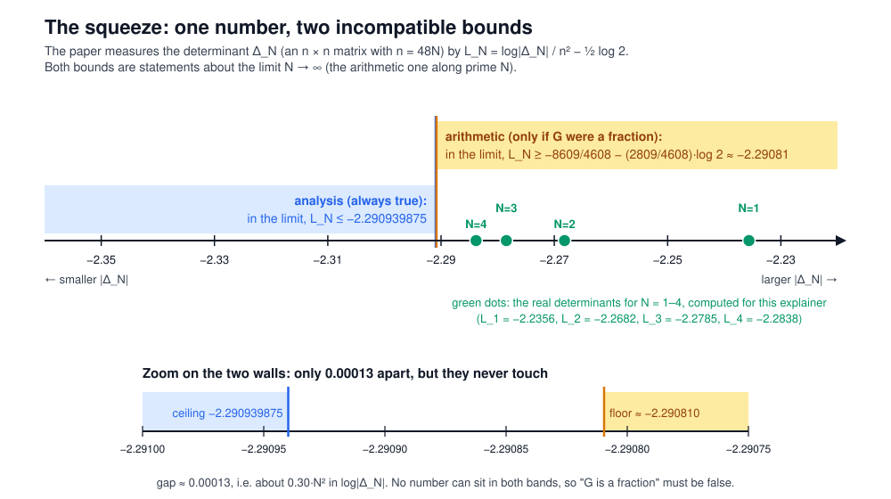

### Level 2: the step-by-step picture

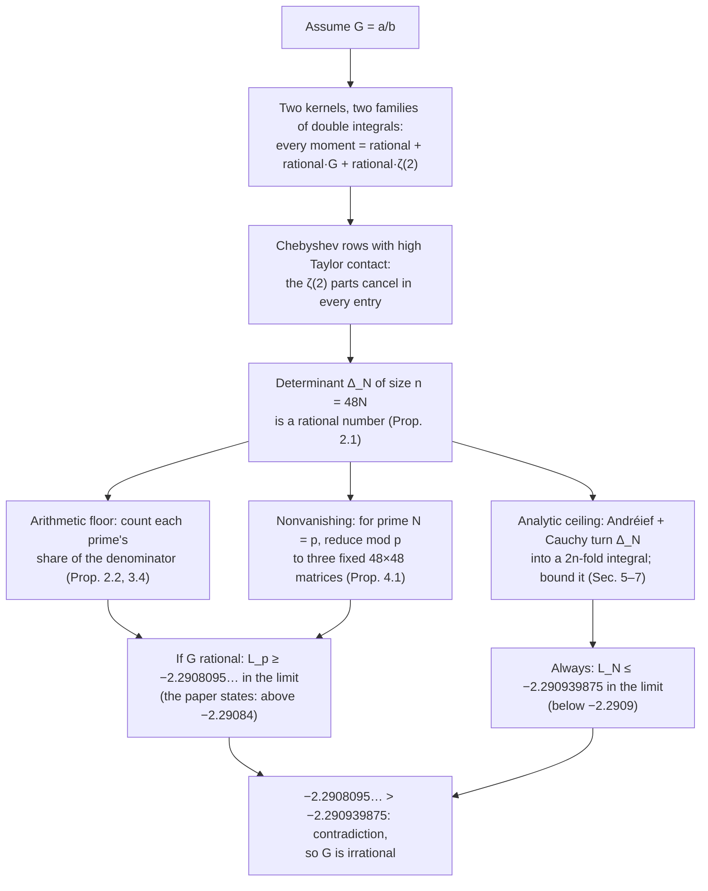
```mermaid
flowchart TD
    A["Assume G = a/b"] --> B["Two kernels, two families of double integrals:<br/>every moment = rational + rational·G + rational·ζ(2)"]
    B --> C["Chebyshev rows with high Taylor contact:<br/>the ζ(2) parts cancel in every entry"]
    C --> D["Determinant Δ_N of size n = 48N<br/>is a rational number (Prop. 2.1)"]
    D --> E["Arithmetic floor: count each prime's<br/>share of the denominator (Prop. 2.2, 3.4)"]
    D --> F["Nonvanishing: for prime N = p, reduce mod p<br/>to three fixed 48×48 matrices (Prop. 4.1)"]
    D --> G["Analytic ceiling: Andréief + Cauchy turn Δ_N<br/>into a 2n-fold integral; bound it (Sec. 5–7)"]
    E --> H["If G rational: L_p ≥ −2.2908095… in the limit<br/>(the paper states: above −2.29084)"]
    F --> H
    G --> I["Always: L_N ≤ −2.290939875 in the limit<br/>(below −2.2909)"]
    H --> J["−2.2908095… > −2.290939875: contradiction,<br/>so G is irrational"]
    I --> J
```

**Step 1: Two kernels and their moments.** The paper works with two families of double integrals ("moments"). For whole numbers $i, j \ge 0$, with $f(t) = \sqrt{1-t^2}$:

```math
M(i,j) = \int_{-1}^{1}\int_0^1 \frac{|t|}{f(t)}\ \frac{t^i s^j}{1-ts}\ ds\ dt,
\qquad
Z(i,j) = \int_0^1\int_0^1 \frac{t^i s^j}{1-ts}\ ds\ dt .
```

The two simplest ones are the "starting values" $M(0,0) = 4G$ and $M(0,1) = \pi^2/4 = \frac32\zeta(2)$. Everything else follows from them by exact recurrences with rational coefficients. The paper proves

```math
M(i,j) = M^0(i,j) + 4G\ c_{(i-j)/2} + \tfrac32\zeta(2)\ c_{(j-i-1)/2},
\qquad
Z(i,j) = Z^0(i,j) + [i=j]\ \zeta(2),
```

where $M^0$ and $Z^0$ are explicit rational numbers, $c_l = 4^{-l}\binom{2l}{l}$ (and $c_l = 0$ unless $l$ is a whole number), and $[i=j]$ is $1$ if $i = j$ and $0$ otherwise. So every moment is a rational combination of $1$, $G$ and $\zeta(2)$. We checked this against numerical integration for all $0 \le i,j \le 3$. For example, $M(1,1) = -2 + 4G$, $M(0,3) = \frac12 + \frac34\zeta(2)$ and $Z(2,2) = -\frac54 + \zeta(2)$.

**Step 2: Kill $\zeta(2)$ with "Taylor contact".** If $G$ is rational, $\zeta(2) = \pi^2/6$ is still irrational, so every $\zeta(2)$ must disappear. The paper builds polynomial rows from the **Chebyshev polynomials** $T_d$ and $U_d$ (the ones with $`T_d(\cos\theta) = \cos d\theta`$):

```math
P_r(t) = (1-t)^{h}\ t^{C-1}\ T_d(1/t), \qquad D_r(t) = \pm(1-t)^{h}\ t^{C-1}\ U_{d-1}(1/t), \qquad d = |r-g| ,
```

and combines them into entries $F_j(r) = M(P_r, j) - \frac32 Z(D_r, j)$. (Here $M(P, j)$ means: expand $P$ in powers of $t$ and apply $M(\cdot, j)$ term by term.) The coefficient of $\zeta(2)$ in $F_j(r)$ turns out to be $\frac32$ times the coefficient of $t^j$ in $tP_r/f - D_r$. By design, the two expressions $tP_r/f$ and $D_r$ agree to high order ("high Taylor contact"): $tP_r/f - D_r = O(t^{L})$. So that coefficient is **exactly zero** for every column $j < L$. Under the hypothesis $G \in \mathbb{Q}$, every entry is then rational (Proposition 2.1).

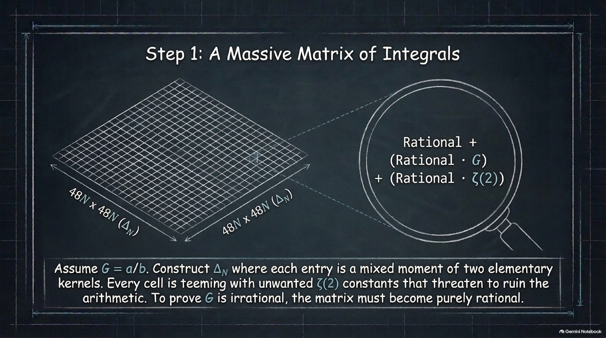

**Step 3: The determinant.** For each $N \ge 1$ the paper fixes the proportions

```math
n = 48N,\quad a = 11N,\quad b = 7N,\quad q = g = 4N,\quad h = 2N,\quad L = 59N,\quad C = 63N,\quad H = 65N,
```

(The letters $a$ and $b$ here are the paper's names for two size parameters, unrelated to a fraction $a/b$.) It defines the $n\times n$ determinant

```math
\Delta_N = \det_{0 \le r,k < n}\Big( M\big(P_r,\ s^{b+k}(1-s)^q\big) - \tfrac32\ Z\big(D_r,\ s^{b+k}(1-s)^q\big) \Big).
```

The factor $(1-s)^q$ acts as an integer "filter" on the columns: each filtered column is a fixed integer combination of $q + 1$ raw columns $F_j$. Some relations among the parameters are structural: $L = n + b + q$ puts every raw column the filter uses in the contact range $j < L$, and $C = L + g$ gives the contact order $O(t^L)$. The paper does not motivate the specific ratios. Our own reading, not a claim of the paper, is that they were tuned so that the final two constants come out in the right order.

**Step 4: The arithmetic floor (Sections 2–3).** Assume $G$ is rational. Then $\log|\Delta_N| = \sum_p v_p(\Delta_N) \log p$, and the paper bounds the negative part prime by prime:

- **At $p = 2$** (Proposition 2.2): $v_2(\Delta_N) \ge -\frac{505}{4608}n^2 - O(n\log n)$, where $\frac{505}{4608} = \frac{\delta}{2} + \frac{\delta^2}{8}$ with $\delta = \frac{5}{24}$.
- **At large odd primes** $2\sqrt{H} < p \le H$, each raw column has at most $p^2$ in its denominator. The paper reduces the moments digit by digit in base $p$ and identifies column pairs whose sum has only $p^1$ in its denominator. Then it eliminates further columns with $\mathbb{Z}_p$-integral column operations (invertible changes of the pool of raw columns whose coefficients, and those of the inverse change, have no factor $p$ in their denominators, so a denominator bound proved after the change carries back to $\Delta_N$). The result is $v_p(\Delta_N) \ge -N\ d(p/N)$ for an explicit piecewise-linear "loss function" $d$ on $[0, 65]$. It equals $96$ (the naive worst case $`2n/N`$) for $x \le 25$ and falls to $0$ at $x = 65$.
- **Small primes** $p \le 2\sqrt H$ cost only $o(n^2)$. Primes above $H$ never occur in a denominator.

The **prime number theorem** turns the sum over primes into an integral: $\frac{1}{N}\sum_p d(p/N)\log p \to \int_0^{65} d(x)\ dx = \frac{8609}{2}$. Since $n^2 = 2304N^2$, all of this together gives

```math
\liminf \mathcal{L}_N \ \ge\ -\frac{8609}{4608} - \Big(\frac12 + \frac{505}{4608}\Big)\log 2 = -2.290809\ldots > -2.29084 .
```

**Step 5: Nonvanishing (Section 4).** A lower bound for a fraction is useless if the fraction is $0$. The paper proves $\Delta_p \ne 0$ when $N = p$ is a large prime, and it does this *arithmetically*, not by positivity. Modulo $p$, the "Frobenius" identity $(x+y)^p \equiv x^p + y^p$ lets each size-$48p$ row be rewritten in terms of the size-$48$ rows built with $N = 1$. After a change of basis, the reduced matrix (scaled by $`p^2`$) becomes a block matrix whose determinant factors as

```math
(\det \mathbf{a})^{48}\cdot \det\mathcal{B}_0 \cdot \det(\mathcal{B}_0+\mathcal{B}_1)^{(p-1)/2}\cdot \det(\mathcal{B}_0-\mathcal{B}_1)^{(p-1)/2}.
```

Here $\mathcal{B}_0, \mathcal{B}_1$ are two **fixed** $48\times48$ rational matrices, the same for every $p$, and $\det\mathbf{a} = 2^{-p(p-1)/2}$. So everything comes down to three fixed determinants being nonzero. The paper certifies this by Gaussian elimination modulo $101$ and lists all $3 \times 48$ pivots. The conclusion is $v_p(\Delta_p) = -96p$ exactly, so $\Delta_p \ne 0$.

**Step 6: The analytic ceiling (Sections 5–7).** This part needs no assumption on $G$. Two classical determinant identities do the opening moves. **Andréief's identity**, applied twice, turns $\Delta_N$ into one integral over $2n$ variables of a product of three determinants. **Cauchy's double alternant** then evaluates the middle one exactly, as a product of two Vandermonde determinants divided by $\prod_{i,j}(1 - t_i s_j)$. A change of variable $t = 2x/(1+x^2)$ splits each row into a "near" and a "far" branch ($`x`$ and $`1/x`$). The integrand is bounded in two complementary cases:

- When the points satisfy a balance condition, $\sum_i (1-x_i^2)/(1+x_i^2) \le 40N - 1$, by an **interpolation estimate**. A bounded holomorphic function $h_\ast$ on the unit disk (with $`\sup|h_\ast| \le 10e^{12}n`$) and a finite-dimensional Hardy-space operator make the awkward Vandermonde factor cancel *algebraically*, with no inverse-Vandermonde estimates.
- Otherwise, by **Hadamard's inequality**: a determinant is at most the product of its column lengths.

What remains is an "energy" of $2n$ interacting charges with logarithmic interactions, as in **logarithmic potential theory**. The paper expands the logarithmic kernels in Chebyshev series and completes squares. A trick, $-a^2 \le b^2 - 2ab$ with explicitly chosen trial numbers $b$, replaces the many-variable problem by two one-variable maximizations. The trial coefficients are listed in tables as exact multiples of $10^{-8}$. An **exact certificate** then bounds the two maxima. It uses Descartes' rule of signs to find *every* stationary point, rational root brackets, and series for $\log$ and $\arctan$ with explicit error terms. The result is $\limsup\mathcal{L}_N \le -2.290939875$. Separately, the bound is $-2.290939875$ in the interpolation case and $-2.296789875$ in the Hadamard case, and the larger of the two is the one that counts.

**Step 7: The contradiction.** Along the primes, $\mathcal{L}_p$ would have to end up at or above $-2.2908095\ldots$, which is more than $-2.29084$ (Step 4, using Step 5), and at or below $-2.290939875$, which is less than $-2.2909$ (Step 6). The gap between the two exact constants is only about $0.00013$. But it is multiplied by $n^2 = 2304N^2$, so in $\log|\Delta_N|$ it amounts to about $0.30N^2$, which grows without bound.

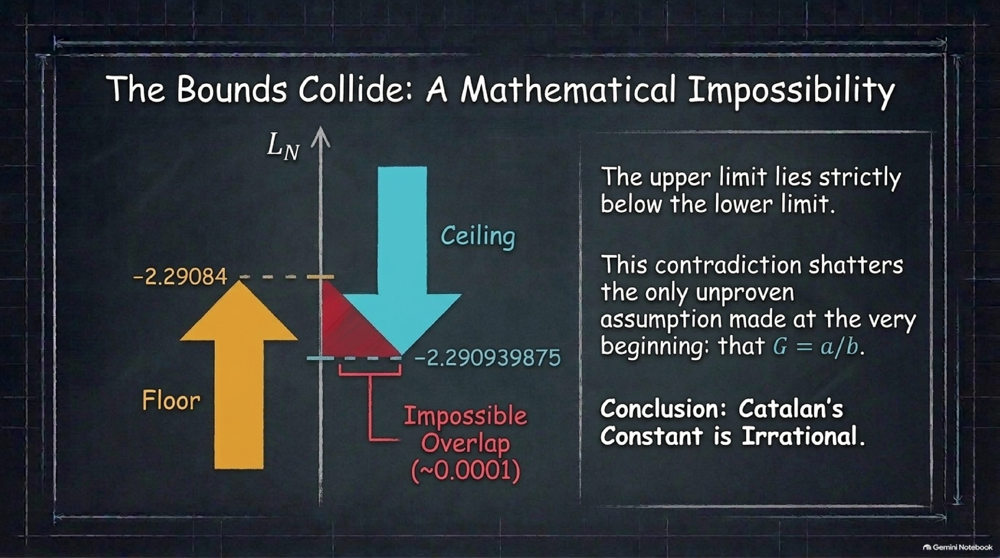

(The slide uses the paper's rounded floor $-2.29084$; the exact gap between the two constants is $0.00013$.)

<details>
<summary><b>A worked example: the paper's construction, computed for N = 1, 2, 3, 4</b> (click to expand)</summary>

Everything below was computed for this explainer in Python from the paper's formulas, with exact rational arithmetic (and high-precision arithmetic with the true value of $G$ for the determinants in item 3). The computations are listed in [How this explainer was made](#how-this-explainer-was-made). These are checks of the construction at small sizes. The paper's bounds are statements about $N \to \infty$, so the numbers here are not constrained by them.

**1. The moments.** The paper's rational recurrences, compared with direct numerical double integration. The agreement is to about 15 digits, the accuracy of the quadrature.

| $(i,j)$ | $M(i,j)$ | $Z(i,j)$ |
|---|---|---|
| $(0,0)$ | $4G = 3.6638623767\ldots$ | $\zeta(2)$ |
| $(0,1)$ | $\frac32\zeta(2) = \pi^2/4$ | $1$ |
| $(1,1)$ | $-2 + 4G$ | $-1 + \zeta(2)$ |
| $(2,0)$ | $1 + 2G$ | $3/4$ |
| $(3,1)$ | $-\frac13 + 2G$ | $5/12$ |
| $(0,3)$ | $\frac12 + \frac34\zeta(2)$ | $11/18$ |

**2. The $\zeta(2)$ cancellation.** For $N = 1$ ($`n = 48`$, $`L = 59`$), we built all 48 Chebyshev rows. Their supports lie in degrees $19$ to $64$, as the paper states. We then computed the exact $\zeta(2)$ coefficient of every raw entry $F_j(r)$ with $7 \le j < 59$. All $48 \times 52$ of them are exactly $0$. At the first column outside the contact range, $j = L = 59$, row $0$ has $\zeta(2)$ coefficient $24$. So the cancellation really does depend on $j < L$. The same holds for $N = 2, 3, 4$.

**3. The determinant itself.** With true $G$ (computed to between 2,700 and 59,000 digits, depending on $N$), the real determinants are astronomically small but nonzero. We checked each result by repeating it at a second, higher precision:

| $N$ | Size $n$ | $\Delta_N$ | $\mathcal{L}_N$ |
|---|---|---|---|
| 1 | 48 | $-10^{-1890.22}$ | $-2.2356$ |
| 2 | 96 | $+10^{-7691.20}$ | $-2.2682$ |
| 3 | 144 | $+10^{-17397.73}$ | $-2.2785$ |
| 4 | 192 | $+10^{-31014.93}$ | $-2.2838$ |

The values drift down toward the paper's limiting ceiling of $-2.290939875$ (the green dots in the squeeze figure). Nothing forces small $N$ to obey either bound, but the trend is consistent with the ceiling. A value like $10^{-31015}$ means enormous cancellation among the $192!$ terms of the determinant, and bounding it is the job of the analytic half of the proof.

**4. The mod-101 certificate.** We rebuilt the paper's fixed $49 \times 48$ matrix $\mathcal{B}$ from its recipe (Section 4.4), including the auxiliary row 48 whose lowest degree is $18$. We then redid the Gaussian elimination of $\mathcal{B}_0 + \sigma\mathcal{B}_1$ modulo $101$ for $\sigma = 0, 1, -1$. All $3 \times 48$ pivots, and the two row swaps $(30,31)$ and $(45,46)$ for $\sigma = 1$, match the paper's Table 1 exactly. Over $\mathbb Q$, the three determinants are nonzero fractions with numerators of about 2,000 digits.

**5. The final arithmetic.** $\frac{\delta}{2} + \frac{\delta^2}{8} = \frac{505}{4608}$ for $\delta = \frac5{24}$. The loss function's eight linear pieces integrate to exactly $\frac{8609}{2}$. Then

```math
-\frac{8609}{4608} - \frac{2809}{4608}\log 2 = -2.2908095\ldots,\qquad -2.2908095\ldots - (-2.290939875) = 0.0001303\ldots
```

</details>

### Level 3: the machinery, for readers who know some p-adic analysis

**Rationality and the two kernels.** Write $w = t/(1+f)$, so that $t = 2w/(1+w^2)$ and $f = (1-w^2)/(1+w^2)$. The involution $w \mapsto 1/w$ fixes $t$ and negates $f$. The rows come from $R_r = (1-t)^h t^{C-1} w^{r-g}$ by symmetrizing and antisymmetrizing: $P_r = (R_r + R_r^{\ast})/2$ and $D_r = t(R_r^{\ast} - R_r)/(2f)$. Then $tP_r/f - D_r = tR_r/f = O(t^{C+r-g})$, because $w = t/2 + O(t^3)$. Since $1/f = \sum_l c_l t^{2l}$, the $\zeta(2)$ kernel $c_{(j-i-1)/2}$ contracted against $P_r$ is exactly the Taylor coefficient of $tP_r/f$, which is matched by $D_r$ through the $Z$ kernel.

**The prime 2.** In $`\mathbb{Q}_2`$ the moment series $`\sum_k m_{i+k}/(j+k+1)`$ converges, because $`v_2(m_u) \ge u + 1 - \log_2(u+1)`$. Its two homogeneous discrepancies with the rational part are fixed 2-adic constants $`e_1, e_2`$. Each raw column splits as $`S_j + E_j + B_j`$: a convergent 2-adic series part and two exceptional parts carrying $`e_1`$ and $`e_2`$. By Cauchy–Binet, it suffices to bound terms with $`m`$ columns of type $`E`$ and $`l`$ of type $`B`$. Repeated coefficient vectors kill a term, and that forces the quadratic gains $`m(m-1)/2`$ and $`l(l-1)/2`$. Minimizing the resulting quadratic gives $`-(\delta/2+\delta^2/8)n^2`$.

**Odd primes.** For $2\sqrt{H} < p \le H$, Lemma 3.1 reduces $p^2 M^0(i,j)$ and $p^2 Z^0(i,j)$ modulo $p$ to the same arrays at the base-$p$ "digits" $(i', j')$. It uses $E(t) = (1-t^2)^{(p-1)/2}$, whose coefficients are $c_{d/2} \bmod p$ (Lucas-type congruences, with one controlled carry). This identifies pairs of raw columns $F_\ell$, $F_{p+\ell}$ whose sum loses only one power of $p$. For $p > H/2$, Lemma 3.2 computes the "central" columns after multiplication by $p$. Lemma 3.3 then shears them against retained columns with $\mathbb{Z}_p$-integral operations, which is always legal by Cauchy–Binet. The counts $R$ (columns with $`p^2`$) and $S$ (columns with $`p`$) give $v_p \ge -\min(2n, n+R, 2R+S)$, and the paper tabulates this as $d(x)$.

**Nonvanishing.** With $N = p$, split each row index as $r = pr_0 + i$. Frobenius gives $t^p = 2w^p/(1+w^{2p})$ in characteristic $p$. Two palindromic bases $U_\ell = (2w)^\ell(1+w^2)^{p-1-\ell}$ and $Q_i = w^i\sum_j w^{2j}$ of a $p$-dimensional space yield the identity $E(t)w^i = \sum_\ell t^\ell(a_{\ell i} + b_{\ell i}w^p)$. Here the matrix $\mathbf{a}$ is triangular with diagonal $2^{-i}$, and $\mathbf{b} = \mathbf{a}\Pi$ for the permutation-like $\Pi e_i = e_{p-i}$. So the reduced matrix is $\mathbf{a}^T\otimes\mathcal{B}_0 + \mathbf{b}^T\otimes\mathcal{B}_1$. The eigenvalues $0, 1, -1$ of $\Pi$, with multiplicities $1, \frac{p-1}{2}, \frac{p-1}{2}$, produce the factorization in Step 5.

**Real place.** Andréief gives $\Delta_N = (n!)^{-2}\int\int \det[A_r(t_i)]\ \det[(1-t_is_j)^{-1}]\ \det[\psi_k(s_j)]$. Cauchy's double alternant turns the middle factor into $V(t)V(s)/\prod(1-t_is_j)$. The row determinant is a mixed evaluation $\det[\xi_{\mathrm f}(x_i)x_i^{g-r} + \xi_{\mathrm n}(x_i)x_i^{r-g}]$. Its weights are $(\frac12, \frac12)$ on $x<0$ and $(-\frac14, \frac54)$ on $x > 0$, because the $Z$ kernel only lives on $t > 0$. When $\sum(1-x_i^2)/(1+x_i^2) \le D_\ast = 40N - 1$, a Blaschke product $B$ and a Cauchy integral glued across the imaginary diameter give an interpolant $h_\ast$ with $\Vert h_\ast\Vert_\infty \le K_0 n$. In the model space $\lbrace v/Q : \deg v < n\rbrace$ of $H^2$, the operator $I + \Pi_Q M_{h_\ast}R$ then has determinant equal in absolute value to the mixed evaluation determinant divided by $V(x)$, and its norm is at most $1 + K_0 n$ (Proposition 5.2). Otherwise Hadamard applies (Proposition 5.3). The logarithm of what is left is an empirical energy. Haagerup's Chebyshev expansion $\log|u - u'| = -\log 2 - 2\sum_k T_k(u)T_k(u')/k$, damped so that the diagonals are finite, writes it as minus two sums of squares. Dual trial sequences $p, v$ then reduce it to $\sup_x X_\kappa(x) + \sup_s Y_\kappa(s)$ plus explicit norms (Proposition 6.1). Section 7 certifies these suprema with rational arithmetic only.

---

## 6. The people whose ideas this builds on

| Person | Idea | Where it shows up |
|---|---|---|
| **Eugène Catalan** | Studied the constant and fast series for it (1865) | The constant itself |
| **Leonhard Euler, Joseph Fourier, Johann Lambert, Adrien-Marie Legendre** | The first irrationality proofs ($`e`$, $\pi$, $`\pi^2`$) | Background: the "small nonzero integer form" test |
| **Peter Gustav Lejeune Dirichlet** | $L$-functions of characters | $G = \beta(2) = L(2,\chi_{-4})$ |
| **Roger Apéry, Frits Beukers** | Irrationality of $\zeta(2)$ and $\zeta(3)$ via recurrences and integrals in which the decay survives denominator clearing | The model the paper contrasts itself with |
| **Tanguy Rivoal, Wadim Zudilin** | Irrational members among $\beta(2), \ldots, \beta(14)$; Apéry-like approximations to $G$ and their obstruction; denominator bounds | The state of the art before this paper |
| **Wadim Zudilin** | The determinantal criterion (2017) | The precedent for comparing denominators and integrals on the scale $n^2$ |
| **Christian Krattenthaler** | Hypergeometric identities; *Advanced determinant calculus* | Context for approximations; the source cited for Cauchy's double alternant |
| **Li Lai, Li Zhou; Stéphane Fischler** | Narrower lists and quantitative family results | Earlier results |
| **Yuri Nesterenko; Carlo Viola, Raffaele Marcovecchio; Payman Eskandari** | Explicit approximations to $G$ | Earlier results (not irrationality measures) |
| **Frank Calegari** (alone, 2005; with **Vesselin Dimitrov** and **Yunqing Tang**, 2024–25) | Irrationality of the 2-adic analogue of $G$; linear independence of $1, \pi^2, L(2,\chi_{-3})$ | Comparisons. Calegari–Dimitrov–Tang explain the extra $\pi^2$ term in the real case, and the paper cancels the corresponding $\zeta(2)$ term |
| **Pafnuty Chebyshev** | Chebyshev polynomials $T_d, U_d$ | The integral rows with Taylor contact; the expansion of the log kernel |
| **Ferdinand Georg Frobenius** | The $p$-th power map | The reduction of size-$48p$ matrices to size-$48$ blocks |
| **Augustin-Louis Cauchy, Konstantin Andreev (published as C. Andréief)** | The double alternant; the determinant-integration identity (1886) | Turning $\Delta_N$ into a $2n$-fold integral |
| **Jacques Hadamard** | Hadamard's determinant inequality | The second real-place case |
| **G. H. Hardy, Donald Sarason** | The Hardy space $H^2$; kernel/compression view of interpolation | The interpolation estimate |
| **Uffe Haagerup** (via Garoufalidis–Popescu), **Edward Saff** | Chebyshev expansion of $\log\lvert u-u'\rvert$; logarithmic potential theory | The energy bound |
| **René Descartes** | The rule of signs (1637) | Counting all stationary points in the certificate |
| **Donald Newman, Don Zagier** | Short analytic proof of the prime number theorem | The only prime-distribution input |
| **Ian Agol, John Voight** | Minimal two-cusped volume $4G$; volume formula for arithmetic orbifolds | The geometric corollaries |

---

## 7. What it does not prove, and caveats

> [!IMPORTANT]
> **Irrationality only.** The theorem says $G$ is not a fraction. In the paper's words, "the argument proves qualitative irrationality; a bound for an irrationality measure would require additional control of rational approximations." It does not show that $G$ is transcendental, or that $1$, $\zeta(2)$ and $G$ are linearly independent over $\mathbb Q$. It says nothing about the other even beta values $\beta(4), \beta(6), \ldots$ or the odd zeta values such as $\zeta(5)$.

> [!NOTE]
> **Provenance.** The paper was produced by an unreleased internal OpenAI model as part of the [openai/math](https://github.com/openai/math) release. According to that repository's README, most results came from one fixed procedure, using on average about three hours of ChatGPT Pro thinking compute per result. The README names two exceptions (a zero-free region for the Riemann zeta function, and the Hodge conjecture for CM abelian varieties); this family is not among them. The README also says the collection "includes results at different stages of verification", and that "some of the unformalized results could have issues."

> [!NOTE]
> **Lean status.** The [scope document `lean/docs/005.md`](https://github.com/openai/math/blob/main/lean/docs/005.md) says the formalization "proves that Catalan's constant $G=\sum_{j=0}^{\infty}(-1)^j/(2j+1)^2$ is irrational. This is the mathematical assertion in the paper's title." Its Comparator statement is [`ComparatorChallenges/Catalan.lean`](https://github.com/openai/math/blob/main/lean/ComparatorChallenges/Catalan.lean), with the theorem `OAI.InternalCatalan.catalan_irrational` quoted in [section 3](#3-what-the-paper-proves). The matching `Catalan.json` names the solution module `OAI.NumberTheory.Catalan.Main` and permits only the axioms `propext`, `Quot.sound` and `Classical.choice`. The Lean development lives in `lean/OAI/NumberTheory/Catalan/`. However, [`lean/formalization.yaml`](https://github.com/openai/math/blob/main/lean/formalization.yaml), the repository's catalogue of formalized results, lists **neither** this paper among its sources **nor** this declaration among its main results (checked on 7 October 2026). Its catalogue-wide `review` field reads `unchecked`. This explainer did not re-run the Lean build or the Comparator check.

> [!WARNING]
> **Preprint status.** As of October 2026 this is an unreviewed preprint. The paper says its finite certificates "are specified by rational data and arithmetic instructions in the text; supplementary programs reproduce them". The preprint directory on openai/math contains only the PDF, its TeX source and a README, with no programs (checked on 7 October 2026). This explainer independently reproduced the mod-101 nonvanishing certificate (all pivots match) and the $\zeta(2)$ cancellation. It did **not** re-check the real-place certificate of Section 7. The paper also notes a separate preprint by Zhi-Wei Sun (September 2026) that announces the same statement. Nothing from it is used, and this explainer has not examined it.

> [!TIP]
> **Simplifications.** To stay readable, this explainer suppresses the integer column filter's bookkeeping, the exact case analysis of the loss function $d(x)$, the damping parameters in the energy estimate, and the error terms $O(n\log n)$ and $o(n^2)$. Every precise statement is in the paper.

---

## 8. Glossary

| Term | Meaning |
|---|---|
| **Rational / irrational number** | A fraction $a/b$ of whole numbers / a real number that is not one |
| **Catalan's constant** $G$ | $1 - \frac19 + \frac1{25} - \cdots = 0.9159655941\ldots$ |
| **Dirichlet beta function** $\beta(s)$ | $\sum_{j\ge0} (-1)^j (2j+1)^{-s}$. Odd values are rational multiples of $\pi^s$; $G = \beta(2)$ |
| **Riemann zeta function** $\zeta(s)$ | $\sum_{n\ge1} n^{-s}$. $\zeta(2) = \pi^2/6$ appears in the paper's moments |
| **Dirichlet $L$-function** $L(s,\chi)$ | $\sum \chi(n) n^{-s}$ for a periodic multiplicative $\chi$; $G = L(2,\chi_{-4})$ |
| **Integer linear form** | $A x - B$ with whole numbers $A, B$. If $x = a/b$, it is $0$ or at least $1/b$ in size |
| **Clearing denominators** | Multiplying a combination with fractional coefficients by a common denominator to make them integers. This can destroy smallness |
| **Irrationality measure** | How well $x$ can be approximated by fractions $p/q$ in terms of $q$. Not addressed by this paper |
| **$p$-adic valuation** $v_p(r)$ | The exponent of the prime $p$ in the factorization of a nonzero fraction $r$; negative for primes in the denominator |
| **Product formula** | $\log\lvert r\rvert = \sum_p v_p(r)\log p$ for a nonzero rational $r$ |
| **Moment** | Here, a double integral $M(i,j)$ or $Z(i,j)$ of $t^i s^j$ against a fixed kernel |
| **Chebyshev polynomials** $T_d, U_d$ | Polynomials with $T_d(\cos\theta) = \cos d\theta$ and $U_{d-1}(\cos\theta) = \sin d\theta/\sin\theta$ |
| **Taylor contact** | Two expressions having the same first several Taylor coefficients |
| **Determinant** | The signed volume factor of a square matrix; zero exactly when its rows are linearly dependent |
| **Frobenius map** | $x \mapsto x^p$, which respects addition modulo $p$: $(x+y)^p \equiv x^p + y^p$ |
| **Vandermonde product** | $\prod_{i<j}(y_j - y_i)$, the determinant of the matrix of powers $y_i^k$ |
| **Hardy space $H^2$** | Analytic functions on the unit disk whose Taylor coefficients are square-summable |
| **Logarithmic energy** | $\sum_{i\ne j}\log\lvert x_i - x_j\rvert$ and similar sums, as for charges repelling in the plane |
| **Prime number theorem** | $\sum_{p \le y}\log p \sim y$; the only fact about primes the proof needs |
| **Hyperbolic 3-manifold, cusp** | A space with constant curvature $-1$; a cusp is an end shaped like a shrinking tube |
| **Lean 4, Comparator** | A proof assistant that mechanically checks proofs, and a tool that checks a formal proof matches a published statement using only allowed axioms |

---

## 9. Slides, audio and other assets

Everything below except the three hand-made figures was generated with **Google NotebookLM** (now "Gemini Notebook") from the paper, the Lean scope document and the Wikipedia article on Catalan's constant. The report and the mind map used only the paper and the Lean scope document. The outputs are kept exactly as NotebookLM produced them, apart from one revision of the slide deck. They are AI-generated, so see the [errata](assets/README.md#errata) before relying on any detail.

| Asset | What it is |
|---|---|
| [Slide deck (PDF)](assets/notebooklm/slides.pdf) · [PPTX](assets/notebooklm/slides.pptx) | 15 beginner slides. Four wrong slides (5, 6, 9 and 11) were regenerated once; a few smaller issues remain |
| [Infographic: overview](assets/notebooklm/infographic-overview.png) | The one-page summary shown at the top. Several panels have errors |
| [Infographic: history timeline](assets/notebooklm/infographic-history-timeline.png) | From Euler to 2026, in sketch-note style |
| [Audio overview (≈1.9 min)](assets/notebooklm/audio-overview-brief.m4a) | A short podcast-style summary (not reviewed) |
| [Beginner report](assets/notebooklm/beginner-explainer-report.md) | NotebookLM's long-form technical explainer. Its step-by-step proof summary is close to the paper; its background sections contain several errors |
| [Mind map](assets/notebooklm/mindmaps.md) | How the proof fits together |
| [Area and series figure](assets/figures/catalan-area-and-series.svg) | Hand-made: $G$ as the area under $\arctan(x)/x$, and the partial sums of its series |
| [Small linear forms figure](assets/figures/small-linear-forms.svg) | Hand-made: the irrationality test at work for $e$ and $\zeta(3)$ |
| [Determinant squeeze figure](assets/figures/determinant-squeeze.svg) | Hand-made: the paper's two bounds, the gap between them, and the true values for $N = 1, 2, 3, 4$ |

<details>
<summary><b>All 15 slides</b> (click to expand)</summary>

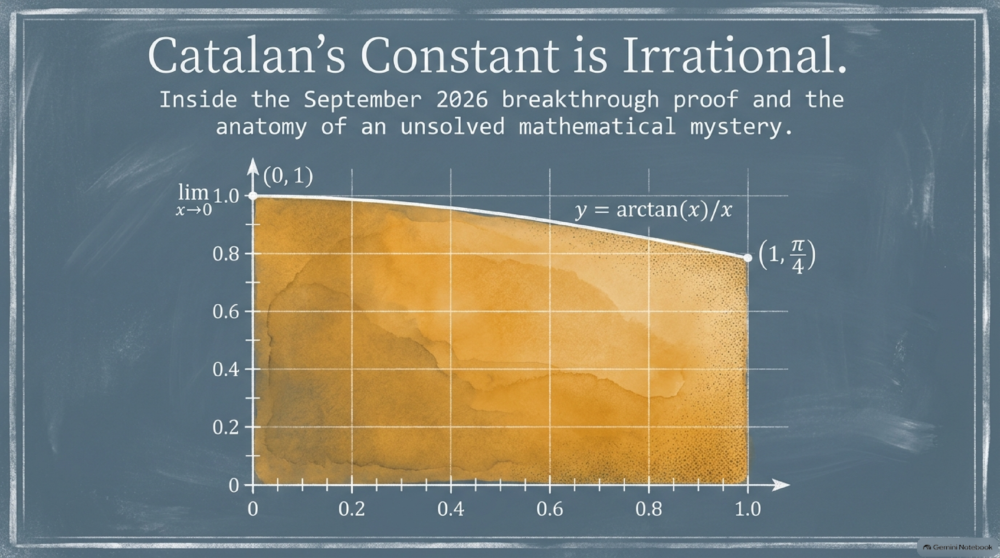


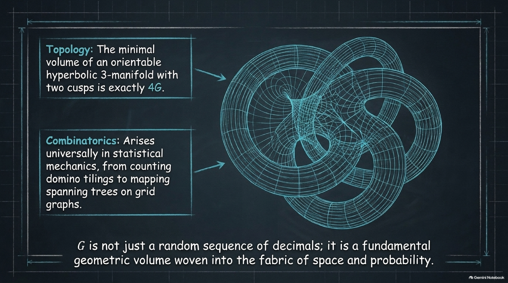

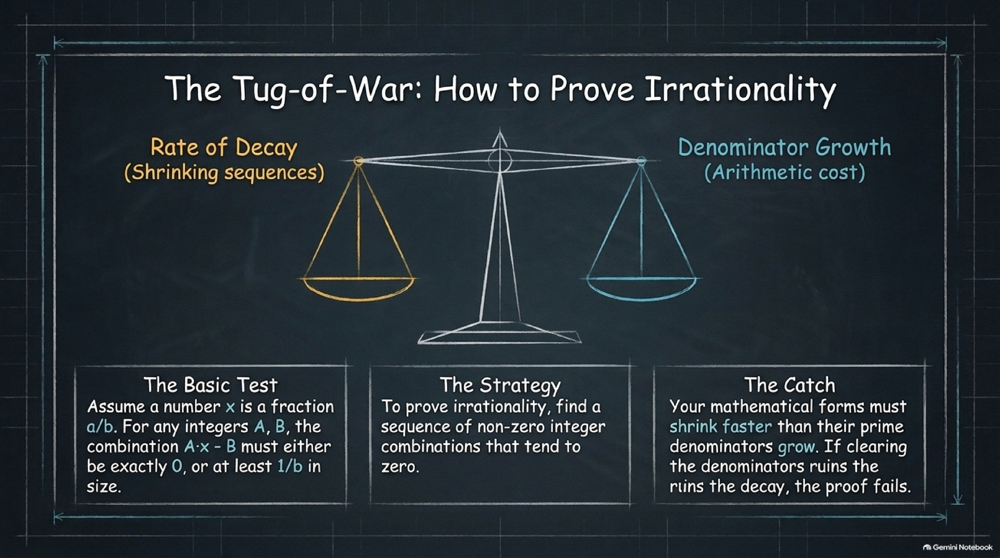


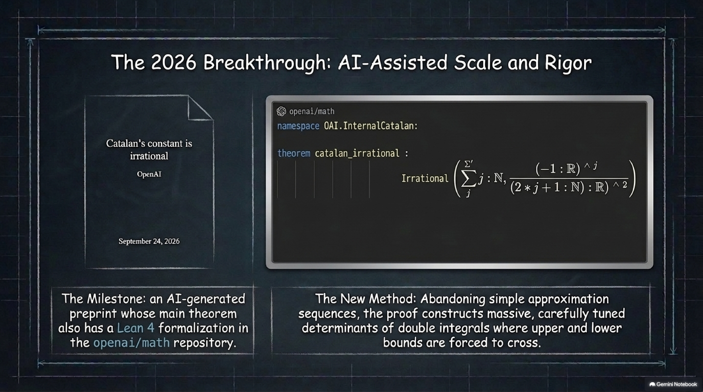


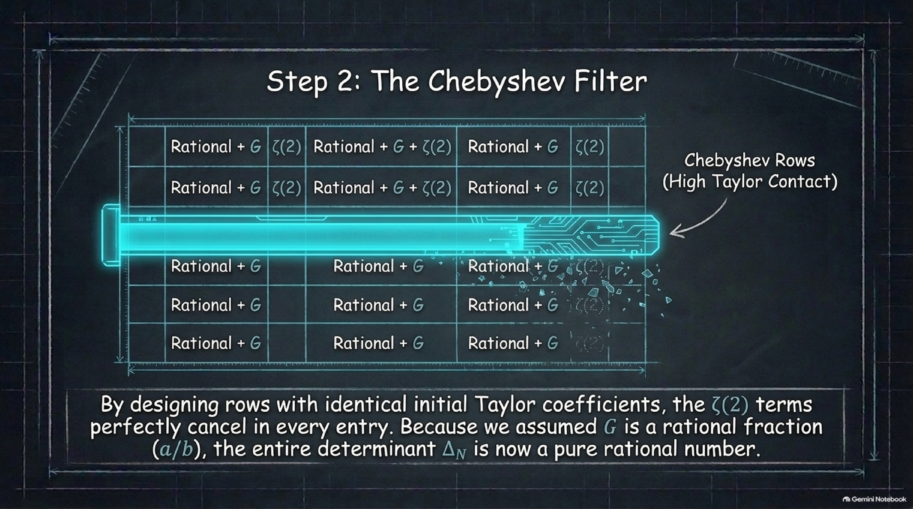

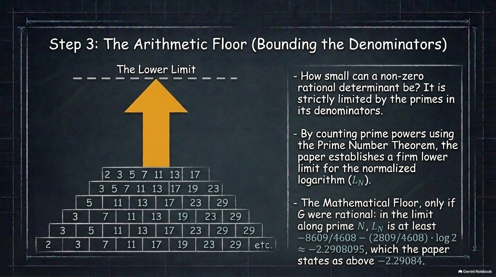

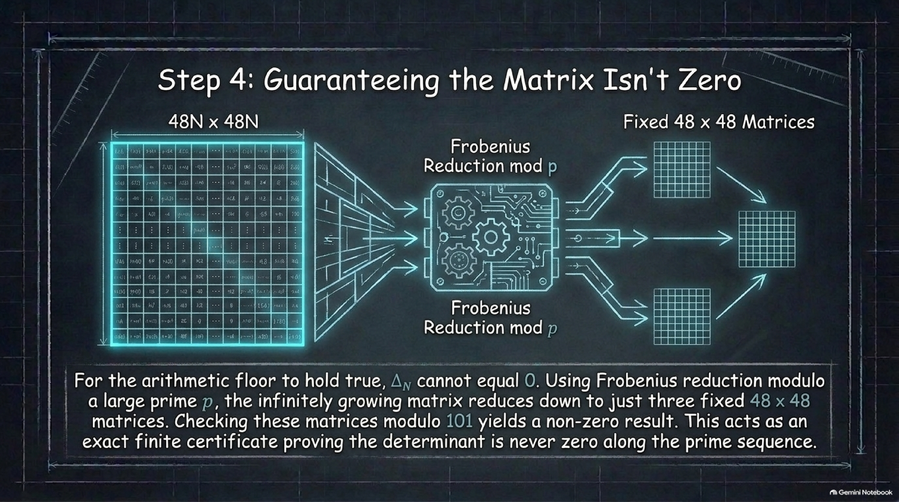

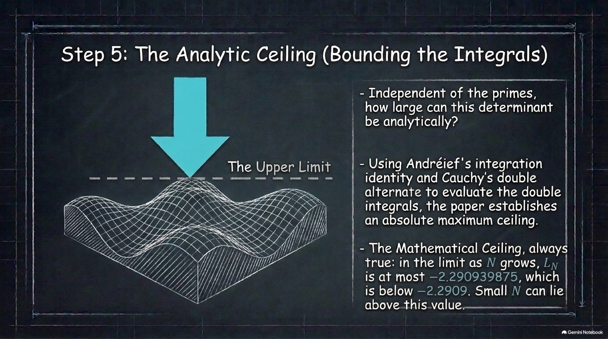


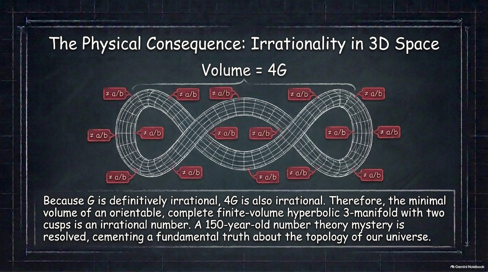

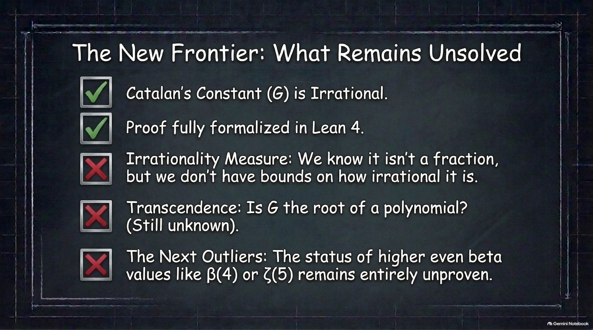

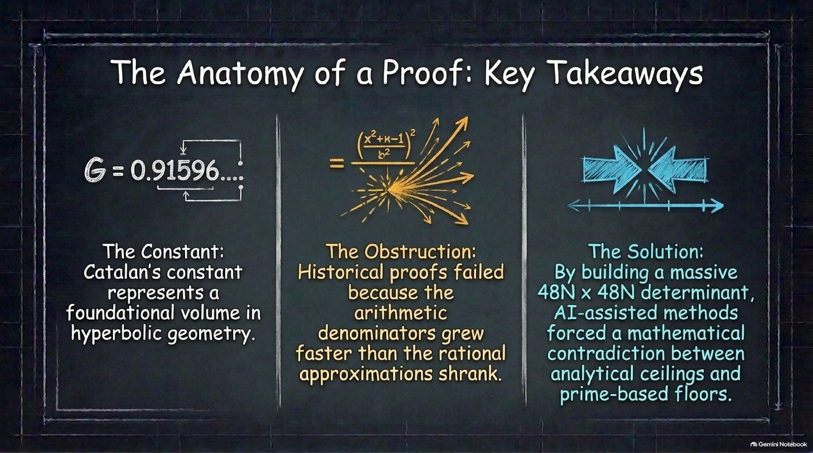

</details>

See [`assets/README.md`](assets/README.md) for the full inventory and the file-by-file [errata](assets/README.md#errata).

---

## How this explainer was made

1. The paper's PDF and TeX source, its README (with the citation), the family entry in `CONTENTS.md`, the Lean scope document `lean/docs/005.md`, the Comparator files `Catalan.lean` and `Catalan.json`, the Lean entry point `OAI/NumberTheory/Catalan/Main.lean` and `lean/formalization.yaml` were downloaded from [openai/math](https://github.com/openai/math) on 7 October 2026.
2. The paper, the Lean scope document and the [Wikipedia article on Catalan's constant](https://en.wikipedia.org/wiki/Catalan%27s_constant) were loaded into a NotebookLM notebook on a second NotebookLM account, through the [`notebooklm-mcp-cli`](https://github.com/jacob-bd/gemini-notebook-mcp-cli) MCP/CLI. That notebook generated the slides, infographics, report, mind map and audio in [`assets/notebooklm/`](assets/notebooklm/), using prompts written as plain statements of the paper's results and its exact constants. Every slide, both infographics and the report were then read against the paper. The four clearly wrong slides were regenerated once with `nlm slides revise`, and a slide-by-slide diff confirmed that nothing else changed. NotebookLM output was used only for visuals and structure, not as a source for this text.
3. The text was written by hand (with AI assistance) directly from the paper's TeX source. The history table uses the paper's introduction and reference list, Wikipedia for Catalan's 1865 memoir and the domino-tiling result, and general knowledge for the classical items, which are marked as such.
4. An independent fact-check of this page (re-fetching openai/math and recomputing the numbers, including the determinants with ball arithmetic) led to 17 corrections, all kept here.
5. Every number on this page was computed with small Python scripts (`mpmath` and exact fractions): the digits and continued fraction of $G$, the partial sums, integrals and beta values, the domino counts, Fourier's and Apéry's linear forms, the moment decomposition, the $\zeta(2)$ cancellation, the determinants $\Delta_1, \ldots, \Delta_4$, the mod-101 pivot table and the final constants. The three figures were drawn as SVG from the same computations.

See [`PIPELINE.md`](../../PIPELINE.md) for the exact, repeatable steps.

*Citation for the underlying paper:*

```bibtex
@misc{OAI:Catalans-constant-is-irrational-September-24-2026,
  author = {{OpenAI}},
  title = {{Catalan's constant is irrational}},
  howpublished = {OpenAI Math Release preprint
                  \href{https://github.com/openai/math/blob/main/preprints/Catalans-constant-is-irrational-September-24-2026/paper.pdf}{OAI:Catalans-constant-is-irrational-September-24-2026}},
  year = {2026}
}
```
