# The exact Birch–Swinnerton-Dyer formula from low Selmer corank, explained for beginners

> - **Paper:** [*Exact Birch–Swinnerton-Dyer Formula from Low Selmer Corank*](https://github.com/openai/math/blob/main/preprints/Exact-Birch-Swinnerton-Dyer-Formula-from-Low-Selmer-Corank-October-3-2026/exact-bsd-low-selmer-corank.pdf), OpenAI, 3 October 2026 (94 pages)
> - **openai/math family:** 002, *The full BSD formula from low Selmer corank* · **Field:** number theory (arithmetic of elliptic curves)
> - **Companions:** [The Selmer converse for elliptic curves at every prime](https://github.com/openai/math/blob/main/preprints/The-Selmer-converse-for-elliptic-curves-at-every-prime-September-24-2026/main.pdf) (24 Sep 2026) · [The two-primary Birch–Swinnerton-Dyer formula in Selmer corank at most one](https://github.com/openai/math/blob/main/preprints/The-two-primary-Birch-Swinnerton-Dyer-formula-in-Selmer-corank-at-most-one-September-24-2026/paper.pdf) (24 Sep 2026) · related, from family 006: [Goldfeld's analytic density conjecture and the 2-converse for elliptic curves](https://github.com/openai/math/blob/main/preprints/Goldfelds-analytic-density-conjecture-and-the-2-converse-for-elliptic-curves-September-23-2026/paper.pdf) (23 Sep 2026)
> - **Formal proof:** none. openai/math has no Lean formalization for family 002 (no `lean/docs/002.md`, and no entry in `lean/formalization.yaml`)
> - **Who this is for:** anyone comfortable with high-school algebra and fractions. No prior knowledge of elliptic curves is needed. Level 3 of section 5 is an optional part for readers who know some algebraic number theory.

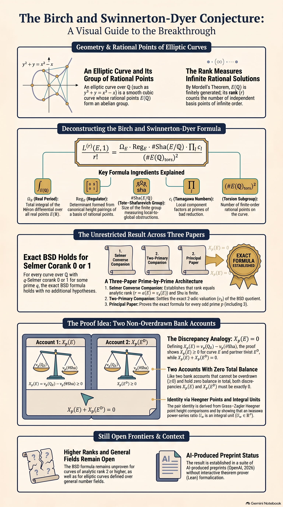

*AI-generated overview. It gets the big picture right but has several typos in names and formulas; see the [errata](assets/README.md#errata).*

## Contents

- [TL;DR](#tldr)
- [How to read this](#how-to-read-this)
- [1. The problem](#1-the-problem)
- [2. A short history](#2-a-short-history)
- [3. What the paper proves](#3-what-the-paper-proves)
- [4. Why it matters](#4-why-it-matters)
- [5. The main idea of the proof](#5-the-main-idea-of-the-proof)
- [6. The people whose ideas this builds on](#6-the-people-whose-ideas-this-builds-on)
- [7. What it does not prove, and caveats](#7-what-it-does-not-prove-and-caveats)
- [8. Glossary](#8-glossary)
- [9. Slides, audio and other assets](#9-slides-audio-and-other-assets)
- [How this explainer was made](#how-this-explainer-was-made)

---

## TL;DR

- **The question.** An *elliptic curve* is an equation such as $y^2 + y = x^3 - x$. The **Birch and Swinnerton-Dyer (BSD) conjecture**, one of the seven Millennium Prize Problems, says that the number of independent rational solutions (the *rank*) can be read off from a function $L(E,s)$ that is built by counting solutions modulo primes. Its refined form goes much further. It gives an **exact formula** for the first nonzero Taylor coefficient of $L(E,s)$ at $s = 1$, in terms of the curve's arithmetic: a period, the heights of rational points, local correction factors, torsion points, and the mysterious **Tate–Shafarevich group** Ш ("Sha").
- **What was known.** By Gross–Zagier (1986), Kolyvagin (1988–1990) and the modularity theorem (completed in 2001): if $L(E,s)$ vanishes to order 0 or 1 at $s = 1$, then the rank equals that order and Ш is finite. But the exact value of the coefficient, which has to be right prime by prime, was proved only under extra hypotheses (on the prime, the reduction type, complex multiplication, and so on).
- **What this paper proves.** For **every** elliptic curve over $\mathbb{Q}$ whose (full) $q$-power Selmer group has corank 0 or 1 for some prime $q$, the **full BSD formula holds exactly**, with no further hypotheses. Together with the Gross–Zagier–Kolyvagin theorem and the companion converse theorem, these turn out to be exactly the curves whose $L$-function vanishes to order 0 or 1 at $s = 1$.
- **Why that's a big deal.** If the preprints are correct, then for this whole natural class of curves the complete conjecture is a theorem, with every prime factor of the formula correct, including 2 and 3. Combined with family 006, it gives full BSD for a density-one set of quadratic twists of every elliptic curve over $\mathbb{Q}$. It also determines the exact size of Ш for all these curves.
- **What it doesn't do.** It does **not** prove the BSD conjecture in general. Curves whose $L$-function vanishes to order 2 or more are untouched (even the rank statement is open for them), and so are curves over number fields other than $\mathbb{Q}$. The result is an AI-produced preprint with no Lean formalization. It depends on two companion preprints from the same release and on the family-006 twist-density theorem.

## How to read this

| You have… | Read |
|---|---|
| 2 minutes | The TL;DR and the [formula figure](#14-the-full-formula) |
| 15 minutes | Sections 1, 3, 4 and 7 |
| An hour, and you like algebra | Everything, including [section 5](#5-the-main-idea-of-the-proof) and the [worked example](#a-worked-example-the-formula-on-two-real-curves) |

---

## 1. The problem

### 1.1 Elliptic curves and their rational points

An **elliptic curve** over the rational numbers $\mathbb{Q}$ is a cubic equation in two variables such as

```math
y^2 = x^3 + ax + b \qquad (a, b \in \mathbb{Q},\ 4a^3 + 27b^2 \neq 0),
```

or a slightly more general form such as $y^2 + y = x^3 - x$. The condition $4a^3 + 27b^2 \neq 0$ rules out a repeated root, so the curve is smooth. A **rational point** is a solution in which $x$ and $y$ are both fractions. One extra point, the "point at infinity" $O$, is always included.

The basic questions are old and simple to state. Does the curve have any rational points besides $O$? Finitely many, or infinitely many? Can we list them?

The key structure is the **chord rule**. Draw the line through two rational points. It meets the curve in exactly one more point, and that point is rational too. Reflecting it gives the "sum" of the two points. With this addition the rational points form a group, written $E(\mathbb{Q})$.

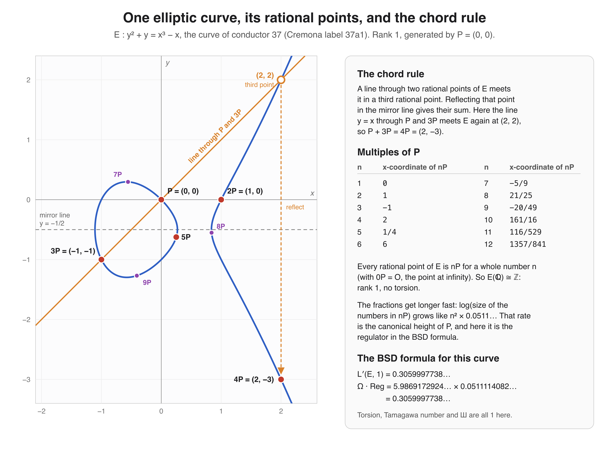

In 1922 Mordell proved that you never need infinitely many starting points. Finitely many generate all the others:

```math
E(\mathbb{Q}) \;\cong\; \mathbb{Z}^r \oplus T, \qquad T \text{ finite}.
```

The finite part $T$ consists of the **torsion** points (points $P$ with $nP = O$ for some $n \geq 1$). There are never more than 16 of them. The number $r$ is the **rank**: the number of independent points of infinite order. The curve in the figure has rank 1, since every rational point on it is a multiple of $P = (0,0)$. Rank is the hard part. No known method for computing it is guaranteed to work on every curve.

### 1.2 Counting solutions modulo primes: the L-function

Rational points are hard to find. Solutions **modulo a prime** $p$ are easy: there are only $p^2$ pairs $(x, y)$ to try. Let $N_p$ be the number of solutions mod $p$, plus one for $O$, and put $a_p = p + 1 - N_p$. For all but finitely many primes ("good" primes) the curve stays smooth mod $p$. The **L-function** packages all these counts into one function of a complex variable $s$:

```math
L(E,s) = \prod_{p\ \text{good}} \frac{1}{1 - a_p\,p^{-s} + p^{1-2s}} \;\times\; \prod_{p\ \text{bad}} (\text{simpler factors}).
```

As written, the product only makes sense when the real part of $s$ is bigger than $3/2$. The **modularity theorem** (Wiles, and Taylor–Wiles, 1995, for semistable curves; Breuil–Conrad–Diamond–Taylor, 2001, for all curves over $\mathbb{Q}$) shows that $L(E,s)$ extends to every complex number $s$. It has a mirror symmetry exchanging $s$ and $2 - s$, so the interesting point is the centre $s = 1$.

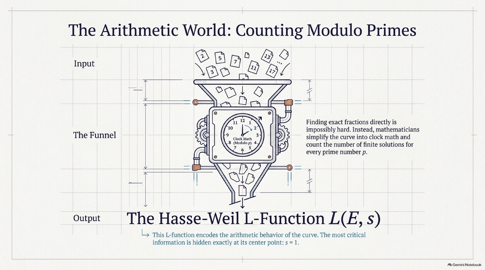

Why should $s = 1$ know about rational points? Plug $s = 1$ into a good factor and you get exactly $p / N_p$. A curve with many rational points tends to have many points mod $p$, which makes these factors small and pushes $L(E,1)$ towards zero. Here are the first few counts for the curve in the figure:

| $p$ | 2 | 3 | 5 | 7 | 11 | 13 |
|---|---|---|---|---|---|---|
| $N_p$ (solutions mod $p$, plus $O$) | 5 | 7 | 8 | 9 | 17 | 16 |
| running product of $p/N_p$ | 0.400 | 0.171 | 0.107 | 0.083 | 0.054 | 0.044 |

(The infinite product does not literally converge at $s = 1$. This is the heuristic that guided Birch and Swinnerton-Dyer, not a proof.)

### 1.3 The rank part of the conjecture

In the early 1960s Birch and Swinnerton-Dyer computed such products on the EDSAC-2 computer in Cambridge and conjectured:

> **BSD, rank part.** The order of vanishing of $L(E,s)$ at $s = 1$ equals the rank $r$.

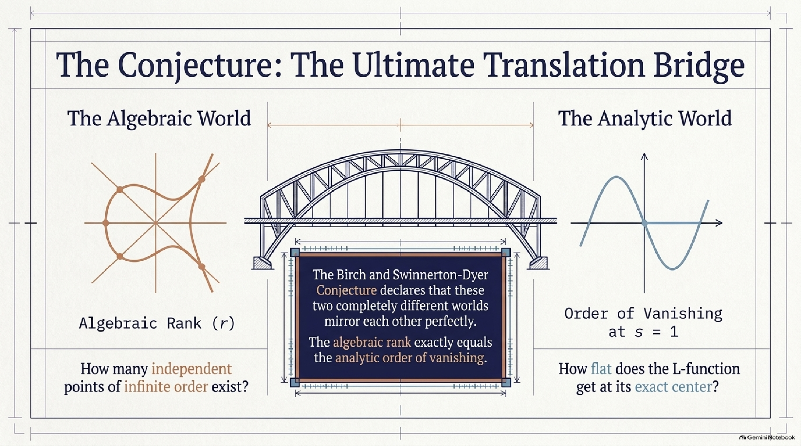

The order of vanishing is called the **analytic rank** and is written $a(E)$ in the paper. So rank 0 means $L(E,1) \neq 0$, and rank 1 means $L(E,1) = 0$ but $L'(E,1) \neq 0$.

### 1.4 The full formula

The conjecture was then refined to predict the **leading Taylor coefficient** at $s = 1$ exactly. With $r$ the rank:

```math
\frac{L^{(r)}(E,1)}{r!} \;=\; \frac{\Omega_E \cdot \mathrm{Reg}_E \cdot \#\mathrm{Sha}(E/\mathbb{Q}) \cdot \prod_{\ell} c_\ell(E)}{\left(\#E(\mathbb{Q})_{\mathrm{tors}}\right)^2}. \qquad (\star)
```

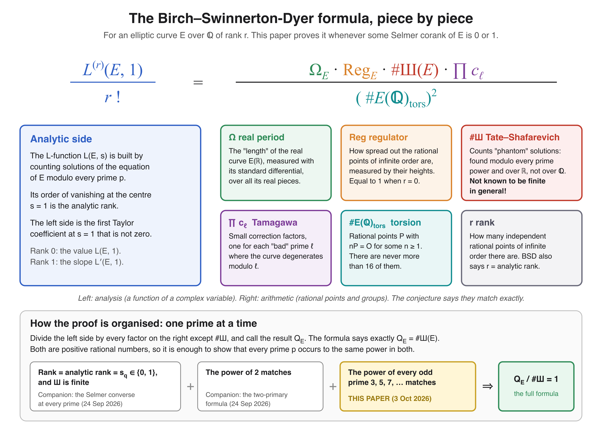

The paper fixes every normalization precisely (its Section 1.1):

- $\Omega_E$ is the **real period**: the integral of $\lvert\omega_E\rvert$ over the real points $E(\mathbb{R})$, where $\omega_E$ is the standard (Néron) differential of a minimal model. It includes both real components when $E(\mathbb{R})$ has two.
- $`\mathrm{Reg}_E`$ is the **regulator**: the determinant of the height pairing on a basis of the points of infinite order. The height of a point is $H(P) = \lim_{n\to\infty} 4^{-n} h_x(2^n P)$, where $h_x(P) = \log \max(\lvert a\rvert, b)$ if $x(P) = a/b$ in lowest terms. In rank 0, $`\mathrm{Reg}_E = 1`$.
- $c_\ell(E)$ is the **Tamagawa number** at the prime $\ell$. It equals 1 at every good prime, so the product is really over the finitely many bad primes.
- $L(E,s)$ is the uncompleted $L$-function with all its finite Euler factors.

John Tate summed up how bold this was in 1974 (as quoted on Wikipedia): the conjecture "relates the behavior of a function $L$ at a point where it is not at present known to be defined to the order of a group Ш which is not known to be finite!" Modularity has since settled the first worry. The second, finiteness of Ш, is still open in general.

### 1.5 Ш and Selmer groups

**The Tate–Shafarevich group Ш** measures the failure of a "local-to-global" principle. Its nonzero elements correspond to curves of genus one that have solutions over the real numbers and modulo every prime power, yet **no rational solution at all**. A famous example of this phenomenon is Selmer's cubic $3x^3 + 4y^3 + 5z^3 = 0$ (1951). Ш is conjectured to be finite, but this is not known in general. That is why the formula $(\star)$ is so hard: one of its ingredients is not even known to be a finite number.

**Selmer groups** are the computable approximation. For each prime $p$ there is a $p$-power Selmer group, which can be studied by finite "descent" calculations. It sits in an exact sequence

```math
0 \longrightarrow E(\mathbb{Q}) \otimes \mathbb{Q}_p/\mathbb{Z}_p \longrightarrow \mathrm{Sel}_{p^\infty}(E/\mathbb{Q}) \longrightarrow \mathrm{Sha}(E/\mathbb{Q})[p^\infty] \longrightarrow 0 .
```

In words, the Selmer group contains the rational points (seen through "$p$-adic glasses") together with the $p$-part of Ш. Its size is measured by a single whole number, the **Selmer corank** $s_p(E)$. Always $s_p(E) \geq r$, and $s_p(E) = r$ exactly when the $p$-part of Ш is finite. So a small Selmer corank is an **upper bound on the rank that you can certify**. The paper's hypothesis is that $s_q(E)$ is 0 or 1 for at least one prime $q$.

### 1.6 What was known before

- **The forward direction.** Gross–Zagier (1986) and Kolyvagin (1988–1990), applied to all curves through modularity, proved: if the analytic rank is 0 or 1, then the rank equals it and the whole of Ш is finite.
- **The converse direction** (small Selmer group ⇒ small analytic rank) had been proved under various hypotheses by Skinner–Urban, Skinner, Wei Zhang and many others. The companion paper removes all restrictions in coranks 0 and 1.
- **The exact formula.** Rank equality and finiteness of Ш do not determine the leading coefficient. As the paper puts it, "knowing the order of vanishing and the finiteness of the Tate–Shafarevich group does not determine that coefficient." The exact power of each prime $p$ in $(\star)$ had been proved only with extra conditions: Rubin's work for curves with complex multiplication (CM), Skinner–Urban in rank 0 and Jetchev–Skinner–Wan in rank 1 under residual and local hypotheses, and Burungale–Flach (2024) for CM curves of analytic rank 0.

---

## 2. A short history

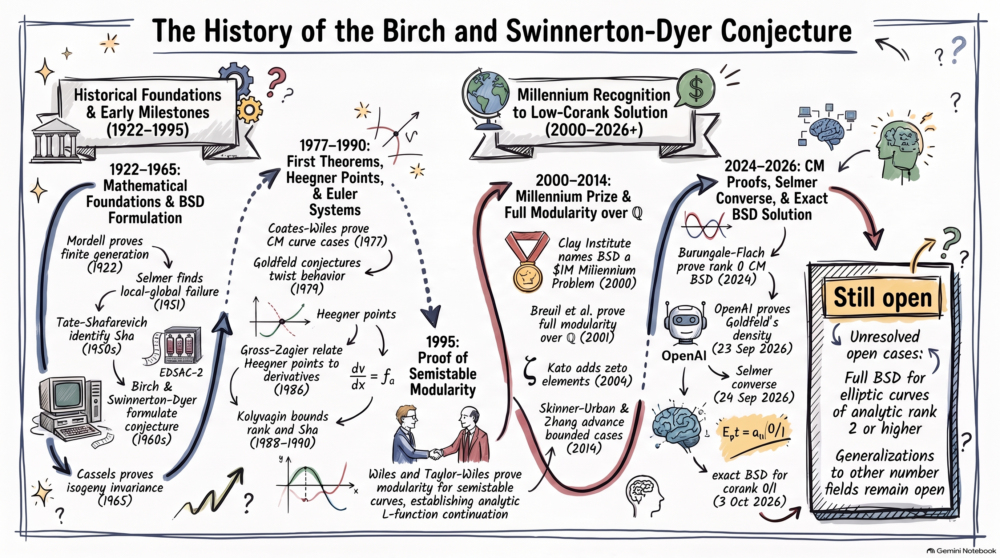

*AI-generated timeline. Its dates agree with the table below, but it has typos, and its "OpenAI proves" and "Exact BSD Solution" overstate the status of unrefereed preprints that cover only Selmer corank 0 or 1. See the [errata](assets/README.md#errata).*

| When | Who | What happened |
|---|---|---|
| 1922 | **Louis Mordell** | The rational points of an elliptic curve are finitely generated. This defines the rank |
| 1951 | **Ernst Selmer** | The cubic $3x^3 + 4y^3 + 5z^3 = 0$ has solutions everywhere locally but none in $\mathbb{Q}$. Selmer groups are named after him |
| Late 1950s | **John Tate, Igor Shafarevich** | The group now called Ш, which measures this local-to-global failure |
| Early 1960s (papers 1963, 1965) | **Bryan Birch, Peter Swinnerton-Dyer** | Computations on EDSAC-2 in Cambridge lead to the conjecture ("Notes on elliptic curves I, II") |
| 1965 | **J. W. S. Cassels** | The BSD quotient is unchanged under isogeny |
| 1966 | **John Tate** | Places the rank prediction and the leading-term formula in the arithmetic of abelian varieties (Séminaire Bourbaki) |
| 1977 | **John Coates, Andrew Wiles** | An early theorem in the BSD direction: certain CM curves with $L(E,1) \neq 0$ have only finitely many rational points |
| 1979 | **Dorian Goldfeld** | Conjecture on the average rank of quadratic twists |
| 1986 | **Benedict Gross, Don Zagier** | Height of a Heegner point equals a derivative of an $L$-function |
| 1988–1990 | **Victor Kolyvagin** | Euler systems: analytic rank 0 or 1 implies rank 0 or 1 and finite Ш (for modular curves) |
| 1991 | **Karl Rubin** | Main conjectures of Iwasawa theory for imaginary quadratic fields, with exact leading-term consequences for CM curves |
| 1995 | **Andrew Wiles; Richard Taylor and Wiles** | Modularity of semistable elliptic curves (and Fermat's Last Theorem) |
| 2000 | **Clay Mathematics Institute** | BSD becomes one of the seven Millennium Prize Problems |
| 2001 | **Christophe Breuil, Brian Conrad, Fred Diamond, Richard Taylor** | Modularity of every elliptic curve over $\mathbb{Q}$ |
| 2004 | **Kazuya Kato** | Zeta elements and an explicit reciprocity law link $L$-values to Galois cohomology |
| 2010s | **Manjul Bhargava, Arul Shankar** and others | The average rank of elliptic curves is bounded; a positive proportion of curves satisfy the rank part of BSD |
| 2014 | **Christopher Skinner, Eric Urban; Wei Zhang** | Iwasawa main conjecture for GL(2); converse and exact $p$-part results under hypotheses |
| 2017 | **Dimitar Jetchev, Christopher Skinner, Xin Wan** | Exact $p$-parts of the formula in analytic rank 1 under hypotheses |
| 2024 | **Ashay Burungale, Matthias Flach** | The full BSD formula for CM elliptic curves of analytic rank 0 |
| 2025 | **Alexander Smith** | For every curve over $\mathbb{Q}$, half of its quadratic twists have $2^\infty$-Selmer corank 0 and half have corank 1 (arXiv preprint "The Birch and Swinnerton-Dyer conjecture implies Goldfeld's conjecture") |
| 23 Sep 2026 | **OpenAI** (internal model), family 006 | Goldfeld's density conjecture: twists of analytic rank 0 and 1 each have density 1/2. Also the 2-converse |
| 24 Sep 2026 | **OpenAI** (internal model), family 002 | The Selmer converse at every prime, and the exact 2-part of the formula in Selmer corank at most 1 |
| 3 Oct 2026 | **OpenAI** (internal model), family 002 | **This paper:** the exact power of every odd prime, which completes the full formula in Selmer corank 0 or 1 |

---

## 3. What the paper proves

> **Main theorem** (Theorem 1.1). Let $E$ be an elliptic curve over $\mathbb{Q}$ and let $q$ be any prime. If the full $q$-power Selmer group of $E$ has corank $s_q(E) = 0$ or $1$, then
>
> - the rank, the analytic rank and the Selmer corank agree: $r(E) = a(E) = s_q(E)$,
> - the Tate–Shafarevich group Ш is finite, and
> - the full BSD formula $(\star)$ holds **exactly**, with the normalizations of section 1.4.
>
> There are no additional hypotheses on reduction, rational torsion, isogenies, complex multiplication, or residual Galois representations.

In plain words: pick any prime $q$ and check that the $q$-power Selmer group of your curve has corank 0 or 1. Since $s_q(E) = r + (\text{corank of the } q\text{-part of Ш})$, this leaves room for at most one "infinite direction" in total: either one independent rational point or one infinite piece of Ш, not both. The theorem then rules out the infinite piece of Ш, and says that the analytic and the arithmetic sides of the BSD formula are exactly equal. They are not equal "up to a bounded factor" or "up to powers of small primes", but exactly.

**Which paper proves which part.** The theorem is assembled from three papers in the same release, and the paper is explicit about the division of labour:

| Part of the theorem | Where it is proved |
|---|---|
| $r(E) = a(E) = s_q(E)$ and Ш is finite | The [Selmer converse companion](https://github.com/openai/math/blob/main/preprints/The-Selmer-converse-for-elliptic-curves-at-every-prime-September-24-2026/main.pdf), Theorem 1.1 (quoted as Theorem 2.1 here) |
| The quotient of the two sides is a positive rational number, and its power of 2 is right | The [two-primary companion](https://github.com/openai/math/blob/main/preprints/The-two-primary-Birch-Swinnerton-Dyer-formula-in-Selmer-corank-at-most-one-September-24-2026/paper.pdf), Theorem 1.1 (quoted as Theorem 2.2 here) |
| The power of **every odd prime** $p$ is right, including $p = 3$ and including CM curves | **This paper**, Proposition 10.4. In the paper's words: "the new assertion proved here is the exact valuation of the leading-term formula at every odd prime, independently of the prime $q$ in the hypothesis" |

**An equivalent way to say it.** The Gross–Zagier–Kolyvagin theorem (quoted as Theorem 2.3) shows that analytic rank 0 or 1 forces $s_q(E) = r(E) \le 1$ at every prime $q$. The converse companion shows the reverse. So "some Selmer corank is 0 or 1" is the same condition as "the analytic rank is 0 or 1", and the theorem says: **every elliptic curve over $\mathbb{Q}$ whose $L$-function vanishes to order at most 1 at $s = 1$ satisfies the full BSD formula.** (This rewording just combines the theorems quoted in the paper's Section 2. The paper's Proposition 10.4 is itself stated for every curve of analytic rank 0 or 1.) The paper also stresses that the Selmer hypothesis "is not replaced here by a hypothesis on Mordell–Weil rank alone": knowing $r \leq 1$ is not enough if Ш might be infinite.

---

## 4. Why it matters

| Consequence | Before | After |
|---|---|---|
| **The full BSD formula** for curves of analytic rank 0 or 1 | Proved only with extra hypotheses on the prime, the reduction type, the residual representation or CM | Proved for **every** such curve over $\mathbb{Q}$, at every prime |
| **The size of Ш** | Known to be finite (Gross–Zagier–Kolyvagin), but its exact order was known only in special cases | Determined exactly. Read backwards, $(\star)$ computes #Ш from the $L$-value, the period, the regulator, the Tamagawa numbers and the torsion |
| **Quadratic twists** $E^{(d)}$ of a fixed curve, the curves $dy^2 = x^3 + ax + b$ | Family 006 shows that analytic ranks 0 and 1 each occur for half of them | Full BSD for a **density-one set of quadratic twists of every elliptic curve over $\mathbb{Q}$** (the family 002 summary in openai/math). Twists are counted by signed squarefree $d$ ordered by $\lvert d\rvert$ |
| **Sums of two rational cubes** | Sylvester's question (19th century): which primes are sums of two rational cubes? Dasgupta–Voight (2018) proved some cases; Yin and Burungale–Tian (2026 preprints) treated the prime classes below | The converse companion gives a uniform proof that every prime $\ell \equiv 4, 7, 8 \pmod 9$ is a sum of two rational cubes. This paper then also gives the exact BSD formula for those curves (see the note below) |

**Sums of two cubes, concretely.** For a prime $\ell \equiv 4, 7$ or $8 \pmod 9$, the companion's Corollary 10.1 shows that the curve $X^3 + Y^3 = \ell Z^3$ has rank exactly 1 and finite Ш. A point of infinite order gives rational numbers $x, y$ with $x^3 + y^3 = \ell$. For example:

```math
7 = 2^3 + (-1)^3, \qquad 13 = \left(\tfrac{7}{3}\right)^3 + \left(\tfrac{2}{3}\right)^3, \qquad 17 = \left(\tfrac{18}{7}\right)^3 + \left(-\tfrac{1}{7}\right)^3 .
```

The theorem guarantees such a representation for **every** prime in these classes, however large. The companion is careful to say that these cases have also been treated by direct Heegner-point methods, including recent work of Yin and of Burungale–Tian. Its point is that the cube sums follow uniformly from a converse theorem at the prime 3, where these curves have bad (additive) reduction. Its proof bounds the 3-power Selmer corank $s_3$ of the cube-sum curve by one, using Satgé's classical 3-isogeny descents.

> [!NOTE]
> Two consequences in this section are this explainer's own one-line deductions from theorems as the papers state them, not statements made in the papers. (1) The companion's proof shows $s_3 \le 1$ for the cube-sum curves, so the main theorem here applies to them with $q = 3$. (2) By Corollary 1.3 of the family-006 paper, a finite 2-descent showing $`\dim \mathrm{Sel}_2(E) - \dim E(\mathbb{Q})[2] \in \lbrace 0, 1\rbrace`$ certifies $s_2(E) \le 1$, which is the hypothesis with $q = 2$. So for such a curve, one finite computation together with this theorem gives the full BSD formula. (The formula then holds exactly, but you still have to compute its ingredients to learn the value of #Ш.)

**The method.** The paper names three reusable tools: a "marked residual obstruction calculation", an "integral character-division test", and "uniform position-cut and product-character estimates" for theta series. Its general lesson is that proving a quotient is **integral** (no denominators) and proving it is a **unit** (no factors at all) are different problems. Exact formulas need the second.

---

## 5. The main idea of the proof

The paper is 94 pages of algebraic number theory, and it relies on two companions of 82 and 164 pages. Here is the argument at three zoom levels.

### Level 1: the one-paragraph version

Divide the left side of $(\star)$ by every factor on the right except #Ш, and call the result $Q_E$. The formula says $Q_E$ = #Ш. The companions already show that both are positive rational numbers and that the power of 2 matches. So fix an odd prime $p$ and look at the **discrepancy**

```math
X_p(E) \;=\; (\text{power of } p \text{ in } Q_E) \;-\; (\text{power of } p \text{ in } \#\mathrm{Sha}).
```

The paper proves two facts. First, $X_p(E) \geq 0$ for every curve without CM of analytic rank 0 or 1. Second, for a cleverly chosen partner curve $E^D$, a "twist" of $E$ of the opposite analytic rank, $X_p(E) + X_p(E^D) = 0$. Two numbers that can never be negative, and that add up to zero, must both be zero. So $X_p(E) = 0$ for every odd $p$, and the formula holds exactly. (Curves with complex multiplication need one extra input from earlier work, explained in Step 9 below.)

> **Analogy:** two bank accounts that can never be overdrawn, and whose combined balance is exactly zero. Both must be empty.

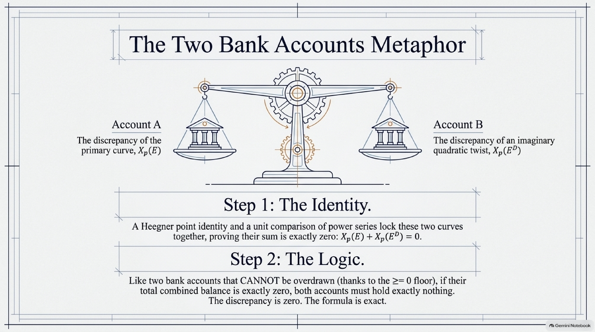

*AI-generated slide. "≥= 0" is a typo for ≥ 0, and that floor is proved only for curves without complex multiplication.*

Most of the work goes into the second fact. It is a statement about a Heegner point and Ш over an imaginary quadratic field. To prove it the paper must show that a certain ratio of power series is a **unit**: not just free of denominators, but with nothing left over at all.

### Level 2: the step-by-step picture

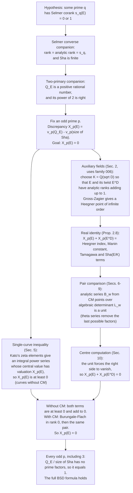
```mermaid
flowchart TD
    A["Hypothesis: some prime q has Selmer corank s_q(E) = 0 or 1"] --> B["Selmer converse companion:<br/>rank = analytic rank = s_q, and Sha is finite"]
    B --> C["Two-primary companion:<br/>Q_E is a positive rational number,<br/>and its power of 2 is right"]
    C --> D["Fix an odd prime p.<br/>Discrepancy X_p(E) = v_p(Q_E) - v_p(size of Sha).<br/>Goal: X_p(E) = 0"]
    D --> E["Single-curve inequality (Sec. 5):<br/>Kato's zeta elements give an integral power series<br/>whose central value has valuation X_p(E),<br/>so X_p(E) is at least 0 (curves without CM)"]
    D --> F["Auxiliary fields (Sec. 2, uses family 006):<br/>choose K = Q(sqrt D) so that E and its twist E^D<br/>have analytic ranks adding up to 1.<br/>Gross-Zagier gives a Heegner point of infinite order"]
    F --> G["Real identity (Prop. 2.8):<br/>X_p(E) + X_p(E^D) = Heegner index, Manin constant,<br/>Tamagawa and Sha(E/K) terms"]
    G --> H["Pair comparison (Secs. 6-9):<br/>analytic series B_w from CM points over<br/>algebraic determinant L_w is a unit<br/>(theta series remove the last possible factors)"]
    H --> I["Centre computation (Sec. 10):<br/>the unit forces the right side to vanish,<br/>so X_p(E) + X_p(E^D) = 0"]
    E --> J["Without CM: both terms are at least 0 and add to 0.<br/>With CM: Burungale-Flach in rank 0, then the same pair.<br/>So X_p(E) = 0"]
    I --> J
    J --> K["Every odd p, including 3:<br/>Q_E / size of Sha has no prime factors, so it equals 1.<br/>The full BSD formula holds"]
```

**Step 1: Reduce to one odd prime.** The converse companion turns the Selmer hypothesis into "rank = analytic rank $\le 1$ and Ш is finite". Then $s_2(E) \le 1$ as well, and the two-primary companion shows that $Q_E$ is a positive rational number with the right power of 2. A positive rational number equals 1 exactly when **no** prime appears in its factorization. So it remains to show $X_p(E) = 0$ for each odd prime $p$, one prime at a time.

**Step 2: The single-curve inequality** (Section 5). Kato built special classes in Galois cohomology from modular units ("zeta elements") and related them to $L$-values. The paper places a version of these classes inside a large power-series ring $`R = \mathbb{Z}_p[[t, u_1, \ldots, u_k]]`$. The variable $t$ follows a tower of cyclotomic fields, and the $u_i$ follow "tame" characters at extra, carefully chosen primes. It proves that a normalized coordinate $U$ of these classes is **integral**, meaning it lies in $R$ itself. Then it computes the central value exactly: $v_p(U(0)) = X_p(E)$ (Proposition 5.11). In rank 0 this uses the dual exponential map. In rank 1 it uses an exact comparison between the $p$-adic logarithm of the class and the square of the logarithm of a rational point (Proposition 5.7). An integral element has valuation at least 0, so $X_p(E) \geq 0$. This needs only integrality, not the much harder unit property.

**Step 3: Pick a partner.** Using the density theorem from family 006, the paper chooses an imaginary quadratic field $K = \mathbb{Q}(\sqrt{D})$ in which every prime dividing $2Np$ splits ($N$ is the conductor of $E$), such that the twist $E^D$ has analytic rank $1 - a(E)$ (Lemma 2.6). Then the $L$-function of $E$ over $K$ has a simple zero at $s = 1$, and the Gross–Zagier formula produces a **Heegner point** $P_K \in E(K)$ of infinite order.

**Step 4: An exact identity for the pair** (Proposition 2.8). Gross–Zagier, together with Cassels's isogeny invariance and Milne's restriction of scalars, gives an identity of real numbers. Taking $p$-adic valuations, it says that $X_p(E) + X_p(E^D)$ equals a combination of: the $p$-part of the index of the Heegner point in $E(K)$, the Manin constant $c_E$ of the modular parametrization, the Tamagawa numbers, and the $p$-part of Ш over $K$. So the pair sum is zero exactly when the Heegner point is "as divisible as BSD predicts".

**Step 5: The pair comparison** (Section 6). Over $K$ the prime $p$ splits into two places $w$ and $\bar w$. On the algebraic side there is a determinant $L_w$: a power series that measures a Selmer group with a "strict" condition at $w$ and no condition at $\bar w$. On the analytic side there is a power series $B_w$ built from measures on CM points of the modular curve. Its central value is the square of the logarithm of the Heegner point, up to the Manin constant and explicit Euler factors (Proposition 6.2, equation (12)). The paper proves that $U_w = B_w / L_w$ lies in $R$ and is not divisible by $p$. That still leaves possible "horizontal" factors.

**Step 6: Theta series remove the remaining factors** (Sections 7 and 8). Suppose some irreducible power series divided $U_w$. Along that divisor a CM period would vanish. Using theta series on unitary groups (of signature $(3,1)$ at both real places of an auxiliary real quadratic field), the paper turns this vanishing into a congruence with cusp forms, then into a Galois representation, and finally into a nonzero Selmer class with a one-sided strict local condition (the "theta implication", Proposition 8.1). The paper calls this a "jump" in a Selmer group. It happens for $E$ or for a fixed companion twist.

**Step 7: Codimension two.** The paper shows that $U_w$ and $U_{\bar w}$ generate the same ideal, so a factor of one is a factor of both, and along it jumps would occur simultaneously. By adding finitely many more tame variables, the paper arranges that simultaneous jumps can only happen in codimension at least two (Proposition 9.5). A divisor has codimension one, so no divisor is left: $U_w$ is a **unit** (Theorem 9.6). Setting the extra variables back to zero keeps it a unit.

**Step 8: Read off the centre** (Section 10). At $s = 1$ the unit says the analytic and algebraic sides have the same $p$-adic valuation. Computing the algebraic side in the full lattice (where the Heegner index, torsion, Ш over $K$ and every Tamagawa number appear) gives exactly the cancellation needed in Step 4: $X_p(E) + X_p(E^D) = 0$ (Corollary 10.2).

**Step 9: Finish.** If $E$ has no CM, Steps 2 and 8 give $X_p(E) \geq 0$, $X_p(E^D) \geq 0$ and $X_p(E) + X_p(E^D) = 0$, so $X_p(E) = 0$. If $E$ has CM and analytic rank 0, the formula follows from Burungale–Flach's theorem, transferred to $E$ by isogeny and restriction-of-scalars arguments (Lemma 10.3). If $E$ has CM and analytic rank 1, its partner $E^D$ is a CM curve of analytic rank 0, and the pair identity finishes the job. Since $p$ was any odd prime, $Q_E$ divided by #Ш has no prime factors at all, so it equals 1.

### A worked example: the formula on two real curves

<details>
<summary><b>Checking (★) numerically for two small curves</b> (click to expand)</summary>

Both curves below are well studied and have no CM. Their analytic rank is 0 or 1, so by section 3 the theorem applies to them. The numbers were computed with PARI/GP for this explainer, and they agree with the LMFDB entries [11.a2](https://www.lmfdb.org/EllipticCurve/Q/11/a/2) (Cremona's 11a1) and [37.a1](https://www.lmfdb.org/EllipticCurve/Q/37/a/1).

| | Curve 11a1: $y^2 + y = x^3 - x^2 - 10x - 20$ | Curve 37a1: $y^2 + y = x^3 - x$ |
|---|---|---|
| Rank $r$ (= analytic rank) | 0 | 1, generated by $P = (0,0)$ |
| Left side of $(\star)$ | $L(E,1) = 0.2538418608\ldots$ | $L'(E,1) = 0.3059997738\ldots$ |
| Real period $\Omega_E$ | $1.2692093042\ldots$ (one real component) | $5.9869172924\ldots$ (two real components) |
| Regulator $`\mathrm{Reg}_E`$ | 1 (rank 0) | $H(P) = 0.0511114082\ldots$ |
| Tamagawa numbers | $c_{11} = 5$ | $c_{37} = 1$ |
| Torsion | 5 points, so the denominator is $5^2 = 25$ | only $O$, so the denominator is $1^2 = 1$ |
| $Q_E$ | $\dfrac{0.2538418608 \times 25}{1.2692093042 \times 5} = 1.0000000\ldots$ | $\dfrac{0.3059997738}{5.9869172924 \times 0.0511114082} = 1.0000000\ldots$ |

The theorem says $Q_E$ = #Ш **exactly**. Since #Ш is a whole number and $Q_E = 1.0000000\ldots$, Ш is trivial for both curves: it has exactly one element.

You can watch the regulator appear in the figure of section 1.1. The quantity $h_x(nP)/n^2$ for $P = (0,0)$ on 37a1 equals $0.043, 0.055, 0.050, 0.045, 0.050, 0.048, 0.051, 0.052, 0.050$ for $n = 4, \ldots, 12$, and it settles down to $H(P) = 0.05111\ldots$. The paper's limit formula $\lim 4^{-n} h_x(2^nP)$, evaluated with exact fractions, already gives $0.05111140815$ at $n = 9$, within $10^{-10}$ of $H(P) = 0.05111140824\ldots$.

**How the valuations work.** For a prime $p$, $v_p(x)$ is the exponent of $p$ in the fraction $x$. For example $v_3(18/5) = 2$ and $v_5(18/5) = -1$. A positive rational number with $v_p = 0$ for every prime $p$ has an empty factorization, so it equals 1. That is the last line of the proof. For the ratio $Q_E$/#Ш, the two-primary companion gives $v_2 = 0$ and this paper gives $v_p = 0$ for every odd $p$. So $Q_E$ = #Ш.

To reproduce the numbers in PARI/GP:

```gp
E = ellinit([0,0,1,-1,0]);    \\ 37a1
ellanalyticrank(E)            \\ [1, 0.30599977383...]
ellbsd(E)                     \\ Omega * prod(c_p) / #tors^2 = 5.98691729...
ellheight(E, [0,0])           \\ 0.05111140823...
```
</details>

### Level 3: the integral machinery, for readers who know some Iwasawa theory

**The discrepancy and the pair identity.** With the paper's normalizations, define

```math
Q_E=\frac{L^{(r)}(E,1)\,\#E(\mathbb Q)_{\rm tors}^{2}}{r!\,\Omega_E\,\mathrm{Reg}_E\prod_\ell c_\ell(E)},\qquad X_p(E)=v_p(Q_E)-v_p\bigl(\#\mathrm{Sha}(E/\mathbb Q)\bigr).
```

For the auxiliary field $K = \mathbb{Q}(\sqrt{D})$, let $P_K$ be the conductor-one Heegner point traced over the Hilbert class field and pushed to $E$ by the modular parametrization, with $\phi^{\ast}\omega_E = c_E\ f\ dq/q$. Write $n_P$ for the $p$-adic valuation of the index of $P_K$ in $E(K)$ modulo torsion, $\tau_g$ for that of the torsion of $E(K)$, and $s_K$ for that of Ш over $K$. Proposition 2.8 gives

```math
X_p(E)+X_p(E^D)=2(n_P+\tau_g)-2v_p(c_E)-2\sum_\ell v_p(c_\ell(E))-s_K .
```

The whole odd-primary problem is therefore to prove the "Heegner index formula" $2(n_P+\tau_g)=s_K+2v_p(c_E)+2\sum_\ell v_p(c_\ell(E))$. That is equation (23) of Proposition 10.1. Substituting it makes the right side vanish, which is Corollary 10.2.

**The rings and the two tests.** All comparisons take place over $R=\mathbb Z_p[[t,u_1,\ldots,u_m]]$, using finite free models of Galois cochain complexes that keep the Tate module $T_pE$, the local conditions, and the maps, pairings and homotopies needed for derived specialization. Here $t$ is a genuine cyclotomic (Section 5) or anticyclotomic (Section 6) variable. The $u_i$ are limits of tame characters at varying auxiliary primes, used to control residual cohomology. The paper separates divisibility into two kinds:

- **Vertical (the prime $p$ itself).** Residual concentration (Proposition 4.2) chooses tame directions so that the determinants $L_w$ do not vanish modulo $(p,t)$. Independently, linear independence on the ordinary modular curve, proved with the Chai–Hida rigidity and monodromy method, shows $p\nmid B_w$.
- **Horizontal (height-one primes other than $p$).** At sufficiently ramified finite characters of $t$, local-condition comparisons give divisibility once $p$ is inverted, and integral Weierstrass division then gives $L_w\mid B_w$ in $R$. So $U_w = B_w/L_w \in R$, and $p\nmid U_w$.

**From integral to unit.** Integrality does not exclude other irreducible factors of $`U_w`$. For those, the paper works at a characteristic-zero point where the undepleted CM series $`b_w^0`$ vanishes. Theta lifts between unitary groups (target signature $`(3,1)`$ at both real places of $`F=\mathbb Q(\sqrt{DD'})`$), with Fourier–Jacobi expansions, Siegel–Weil and toric-period identities, produce integral ordinary theta sections whose constant terms tend to zero. A positive nonconstant coefficient of bounded valuation prevents the whole series from vanishing. Lifting these to cusp forms with increasing $`p`$-level, and extracting Galois extensions, gives the theta implication: over that divisor, a one-sided strict Selmer group of $`V_pE\otimes\chi`$ or $`V_pE^{D'}\otimes\chi`$ is nonzero. High-character association and the character-division test show that $`U_w`$ and $`U_{\bar w}`$ generate the same ideal, so a divisor of $`U_w`$ would carry simultaneous jumps. Finally, extra tame variables push all simultaneous jumps into codimension at least 2. A divisor has codimension 1, so there is none, and $`U_w\in R^{\times}`$ (Theorem 9.6).

**The centre.** Specializing to $t=0$ and the artificial variables to zero, the analytic side has value (equation (12))

```math
B_w^{s=1}(0)=\pm\,c_E^{-2}\,\log_{\omega_E}(P_K)^2\,P_p(1)^2\prod_{q\in S^\circ}P_q(1)^2 .
```

The strict/full determinant at the centre is computed in the full Tate lattice: torsion lengths $\tau_g, s_K, \tau_g$ in degrees one, two and three, the point index $n_P$ on both sides of the pairing, and the local Kummer torsion. Comparing the two valuations and using local Haar-measure identities ($\tau_q = v_p(c_q P_q(1))$ for $q \neq p$, and $\tau_p - l = v_p(c_p P_p(1))$) gives equation (23). The paper emphasizes that the torsion term "cannot be discarded by replacing the point module by its free quotient". These lattice details are where every factor of $(\star)$, including the torsion and the Tamagawa numbers, enters exactly.

---

## 6. The people whose ideas this builds on

| Person | Idea | Where it shows up in the proof |
|---|---|---|
| **Bryan Birch, Peter Swinnerton-Dyer** | The conjecture | The statement being proved |
| **Louis Mordell; André Weil** | Finite generation of rational points (the Mordell–Weil group) | Defines the rank and the regulator |
| **John Tate, Igor Shafarevich** | The Tate–Shafarevich group; Tate's formulation of the leading-term formula | The group whose order the formula pins down |
| **Ernst Selmer** | Selmer groups | The hypothesis $s_q(E) \in \lbrace 0, 1\rbrace$ |
| **J. W. S. Cassels** | Isogeny invariance of the BSD quotient | Proposition 2.4, the pair identity, the CM case |
| **J. S. Milne** | Restriction of scalars for BSD; arithmetic duality | Propositions 2.4 and 2.8; Lemma 10.3 |
| **Andrew Wiles, Richard Taylor; Breuil–Conrad–Diamond–Taylor** | Modularity | Analytic continuation of $L(E,s)$; the modular parametrization $X_0(N)\to E$ |
| **Benedict Gross, Don Zagier** | Heights of Heegner points and $L'(E,1)$ | Theorem 2.7 and the pair identity (Step 4) |
| **Victor Kolyvagin** | Euler systems | Rank and finiteness in analytic rank 0 and 1 (Theorem 2.3) |
| **Kazuya Kato** | Zeta elements, explicit reciprocity | The single-curve inequality (Step 2) |
| **Spencer Bloch, Kato; Jan Nekovář** | Tamagawa-number formalism; Selmer complexes | The cohomological and determinant framework (Section 3) |
| **Yuri Manin, Vladimir Drinfeld** | Modular symbols; the Manin–Drinfeld theorem | Sections 5 and 6; the Manin constant $c_E$ kept in every exact formula |
| **Jean-Pierre Serre, Fedor Bogomolov** | Images of Galois representations on torsion points | Choosing the moving auxiliary primes |
| **Ching-Li Chai, Haruzo Hida** | Rigidity and $p$-adic monodromy on ordinary loci; $\mu$-invariants | Vertical primitivity $p\nmid B_w$ (Section 6) |
| **Jean-Loup Waldspurger; Shunsuke Yamana; Wee Teck Gan, Yannan Qiu, Shuichiro Takeda** | Toric-period identities; the Siegel–Weil/Rallis identity | The binary comparison of theta-series constant terms (Section 7) |
| **Ashay Burungale, Matthias Flach** | Full BSD for CM curves of analytic rank 0 | The CM case (Lemma 10.3) |
| **Karl Rubin; Skinner–Urban; Jetchev–Skinner–Wan** | Earlier exact $p$-part results under hypotheses | Context. The paper does not use them as unrestricted inputs |
| **Dorian Goldfeld; Alexander Smith** | The twist conjecture; Selmer-corank distributions | Through family 006's density theorem, which supplies the auxiliary fields (Lemma 2.6) |

---

## 7. What it does not prove, and caveats

> [!IMPORTANT]
> **This is not a proof of the full Birch and Swinnerton-Dyer conjecture.** It covers elliptic curves over $\mathbb{Q}$ whose Selmer corank is 0 or 1 at some prime, which are exactly the curves of analytic rank 0 or 1. For curves whose $L$-function vanishes to order 2 or more, nothing new is proved: even "rank = analytic rank" remains open there. The conjecture for elliptic curves over other number fields, and for higher-dimensional abelian varieties, is also untouched. The Millennium Prize problem, as the Clay Institute states it, asks for the rank part (rank = order of vanishing) for every elliptic curve over $\mathbb{Q}$. So it stays open, and the curves of analytic rank 2 or more are exactly the missing part.

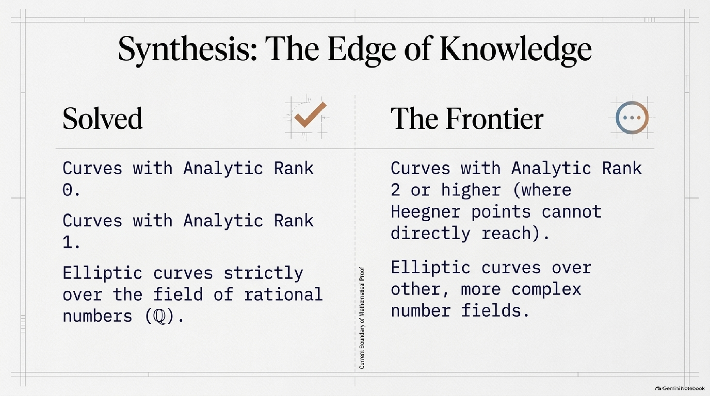

*AI-generated slide. "Solved" here means that the unrefereed preprints claim the full formula for analytic rank 0 and 1 over $`\mathbb{Q}`$. The note about Heegner points is NotebookLM's own remark and was not checked.*

> [!IMPORTANT]
> **"Density one" is not "all".** The twist statement (with family 006) is about the quadratic twists of one fixed curve, counted in a specific order (signed squarefree $d$ ordered by $\lvert d\rvert$). The exceptions are the twists of analytic rank 2 or more. They have density zero, but a set of density zero can still be infinite. It is also not a statement about all elliptic curves ordered by size.

> [!NOTE]
> **Provenance.** The paper and both companions were produced by an unreleased internal OpenAI model, as part of the [openai/math](https://github.com/openai/math) release. That repository's README says the vast majority of its results came from one fixed procedure and names two exceptions (work on a zero-free region for the zeta function, and the Hodge conjecture for CM abelian varieties). Family 002 is not one of them.

> [!WARNING]
> **Verification status.** openai/math has **no Lean formalization** for this family: there is no `lean/docs/002.md`, and `lean/formalization.yaml` has no entry for any of the three papers (checked 7 October 2026). The openai/math README warns that "some of the unformalized results could have issues." The theorem also rests on a chain of recent preprints: the two family-002 companions, the family-006 density theorem (which the converse companion also uses), and Smith's 2025 Selmer-distribution paper (cited as an arXiv preprint). All of them must be correct. As of October 2026 the result is a preprint; the usual next step is independent review by experts. The PDF also has one unresolved citation, "[24, 23, ?]", on page 4. This explainer did not check the proofs.

> [!TIP]
> **Simplifications.** To stay readable, this explainer suppresses the choice of the second discriminant $D'$ and the companion twist, smoothing factors, the depletion of Euler factors, the bookkeeping of moving primes, and the difference between cyclotomic and anticyclotomic variables. Every precise statement is in the paper.

---

## 8. Glossary

| Term | Meaning |
|---|---|
| **Elliptic curve** | A smooth cubic curve such as $y^2 = x^3 + ax + b$, together with a point at infinity $O$ |
| **Rational point** | A solution with $x$ and $y$ both rational numbers |
| **Mordell–Weil group** $E(\mathbb{Q})$ | The group of rational points under the chord rule; it is $\mathbb{Z}^r$ plus a finite torsion part |
| **Rank** $r(E)$ | The number of independent rational points of infinite order |
| **Torsion point** | A point $P$ with $nP = O$ for some $n \geq 1$ |
| **Good / bad prime** | A prime where the curve stays smooth / becomes singular modulo $p$; bad primes divide the **conductor** $N$ |
| **L-function** $L(E,s)$ | A function built from the point counts $N_p$ modulo all primes $p$; its centre is $s = 1$ |
| **Analytic rank** $a(E)$ | The order of vanishing of $L(E,s)$ at $s = 1$ |
| **Modularity** | Every elliptic curve over $\mathbb{Q}$ comes from a modular form; this gives $L(E,s)$ for all $s$ |
| **Real period** $\Omega_E$ | The integral of the standard differential over the real points of $E$ |
| **Canonical height** $H(P)$ | A measure of how complicated the coordinates of $P$ are; it grows like $n^2$ along multiples $nP$ |
| **Regulator** $`\mathrm{Reg}_E`$ | The determinant of heights on a basis of points of infinite order (1 in rank 0) |
| **Tamagawa number** $c_\ell$ | A small local correction factor at a bad prime $\ell$ |
| **Tate–Shafarevich group** Ш ("Sha") | The group measuring curves that have solutions everywhere locally but not globally; conjecturally finite |
| **Selmer group / Selmer corank** $s_p(E)$ | A computable group containing the points and the $p$-part of Ш; its corank is at least the rank, with equality when the $p$-part of Ш is finite |
| **$p$-adic valuation** $v_p$ | The exponent of the prime $p$ in a fraction, for example $v_3(18/5) = 2$ |
| **Quadratic twist** $E^{(d)}$ or $E^D$ | The curve $dy^2 = x^3 + ax + b$; its counts $a_p$ agree with those of $E$ up to sign |
| **Imaginary quadratic field** $\mathbb{Q}(\sqrt{D})$, $D < 0$ | The numbers $a + b\sqrt{D}$ with $a, b$ rational |
| **Heegner point** | A special point on $E$ over an imaginary quadratic field, coming from CM points on a modular curve |
| **Complex multiplication (CM)** | Curves with extra symmetries, such as $y^2 = x^3 - x$; they are handled by separate methods |
| **Iwasawa theory** | The study of how Selmer groups vary in towers of number fields, using power-series rings such as $`\mathbb{Z}_p[[t]]`$ |
| **Unit** (of a power-series ring) | An element with an inverse in the ring; for $`\mathbb{Z}_p[[t]]`$, one whose constant term is not divisible by $p$ |
| **Theta series** | A modular form built from a quadratic or Hermitian form; here used to produce congruences |
| **Lean 4** | A proof assistant: software that mechanically checks every logical step of a proof |

---

## 9. Slides, audio and other assets

Everything below except the two hand-made figures was generated with **Google NotebookLM** (now "Gemini Notebook") from the paper, the two companions and the Wikipedia article on the Birch and Swinnerton-Dyer conjecture. The report and the mind map use the three papers only. The outputs are kept exactly as NotebookLM produced them. They are AI-generated and contain real mistakes, so see the [errata](assets/README.md#errata) before relying on any detail. In particular, slides 2, 3 and 10 have factual errors.

| Asset | What it is |
|---|---|
| [Slide deck (PDF)](assets/notebooklm/slides.pdf) · [PPTX](assets/notebooklm/slides.pptx) | 15-slide beginner deck, revised once |
| [Infographic: overview](assets/notebooklm/infographic-overview.png) | The one-page summary shown at the top |
| [Infographic: history timeline](assets/notebooklm/infographic-history-timeline.png) | From Mordell (1922) to October 2026 |
| [Audio overview (≈1.8 min)](assets/notebooklm/audio-overview-brief.m4a) | A short podcast-style summary (not reviewed) |
| [Beginner report](assets/notebooklm/beginner-explainer-report.md) | NotebookLM's long-form written explainer |
| [Mind map](assets/notebooklm/mindmaps.md) | How the proof fits together |
| [Formula figure](assets/figures/bsd-formula-anatomy.png) ([SVG](assets/figures/bsd-formula-anatomy.svg)) | Hand-made: every ingredient of $(\star)$, and how the three papers split the proof prime by prime |
| [Curve figure](assets/figures/curve-37a1-rational-points.png) ([SVG](assets/figures/curve-37a1-rational-points.svg)) | Hand-made: the curve 37a1, the chord rule, multiples of $P = (0,0)$, and its BSD numbers |

<details>
<summary><b>All 15 slides</b> (click to expand)</summary>

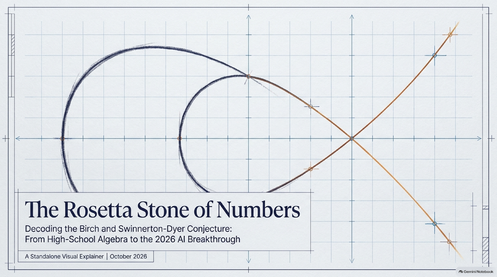

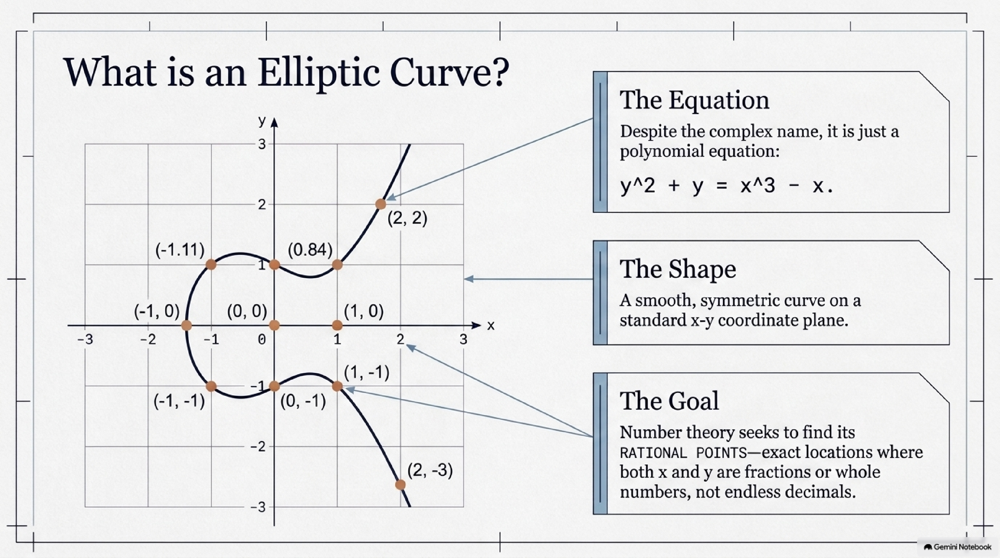

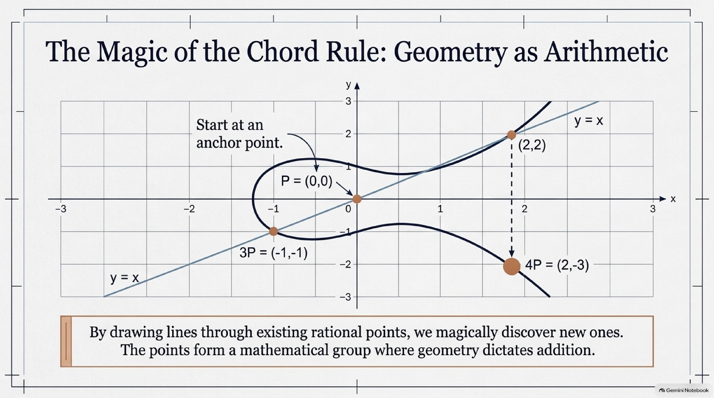

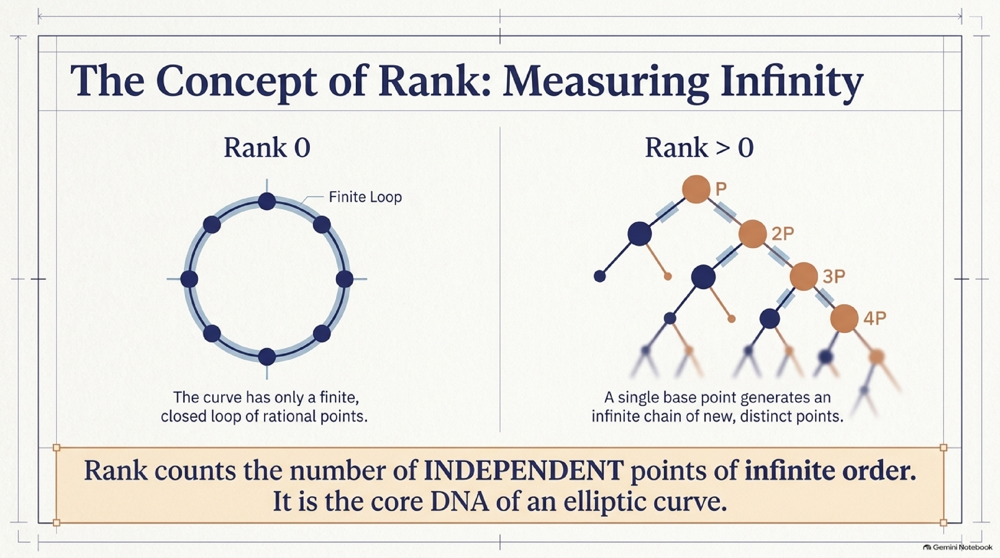


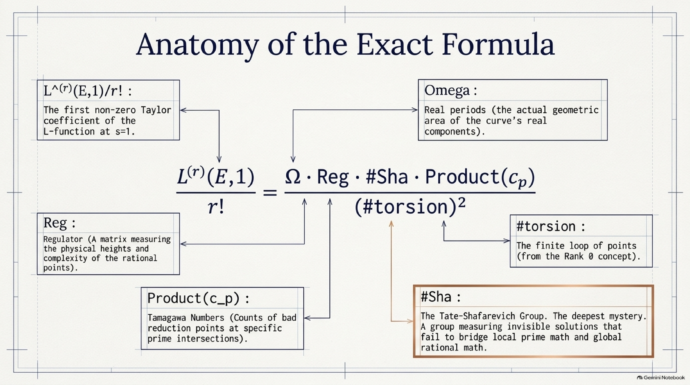

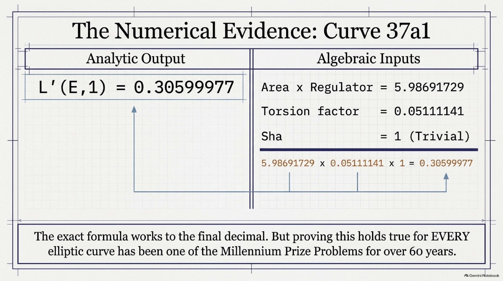

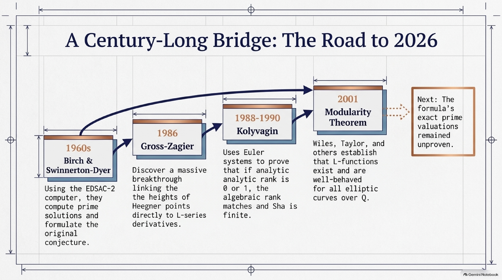

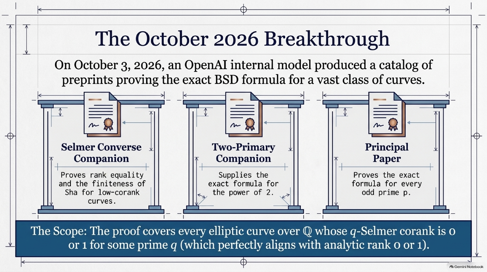

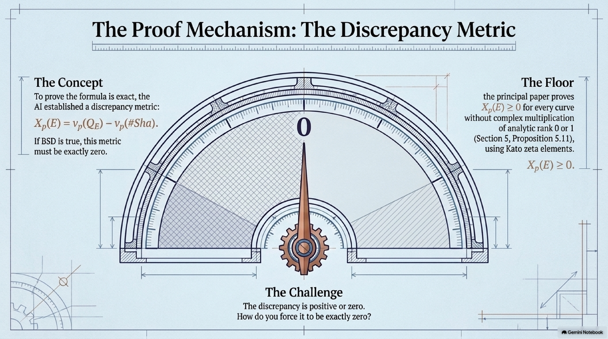


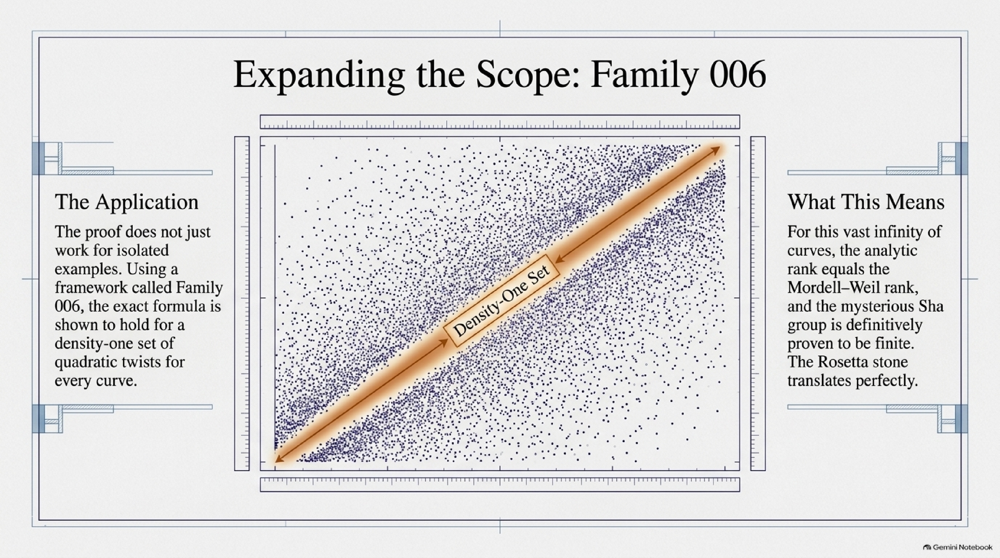


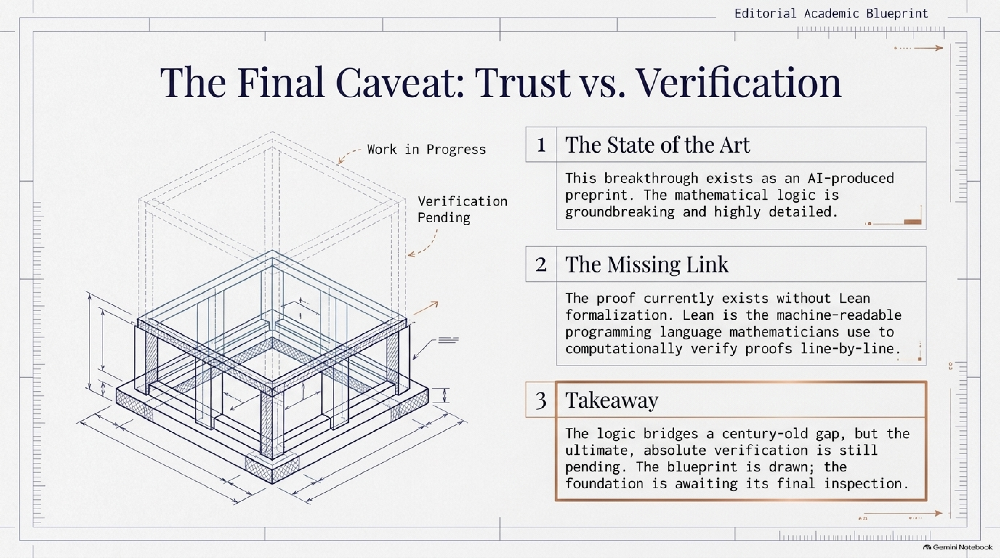

</details>

---

## How this explainer was made

1. The paper, its two companions, and the family-006 introduction were downloaded from [openai/math](https://github.com/openai/math/tree/main/preprints), including their TeX sources.
2. The papers and the Wikipedia article on the conjecture were loaded into a NotebookLM notebook through the [`notebooklm-mcp-cli`](https://github.com/jacob-bd/gemini-notebook-mcp-cli) MCP/CLI. The notebook that generated the slides, infographics, report, mind map and audio in [`assets/notebooklm/`](assets/notebooklm/) was on a second NotebookLM account, because the first account's generation quota was reserved for other papers. Every slide, both infographics, the report and the mind map were then read against the papers. Errors that remain are listed in the [errata](assets/README.md#errata). One slide revision regenerated slides 2, 3, 7, 8 and 11. It fixed slides 7, 8 and 11 but not the curve drawings on slides 2 and 3, and the revised deck is the one shipped here.
3. The text on this page was written by hand (with AI assistance) directly from the paper's TeX source: the introduction, Sections 2 and 10, and the statements in Sections 4–9. The companions' introductions were also used. NotebookLM's outputs were used only as visual and structural aids, not as the source of truth. The worked example was computed with PARI/GP, and the two figures were drawn as SVG by hand.

See [`PIPELINE.md`](../../PIPELINE.md) for the exact, repeatable steps.

*Citation for the underlying paper:*

```bibtex
@misc{OAI:Exact-Birch-Swinnerton-Dyer-Formula-from-Low-Selmer-Corank-October-3-2026,
  author = {{OpenAI}},
  title = {{Exact Birch--Swinnerton-Dyer Formula from Low Selmer Corank}},
  howpublished = {OpenAI Math Release preprint
                  \href{https://github.com/openai/math/blob/main/preprints/Exact-Birch-Swinnerton-Dyer-Formula-from-Low-Selmer-Corank-October-3-2026/exact-bsd-low-selmer-corank.pdf}{OAI:Exact-Birch-Swinnerton-Dyer-Formula-from-Low-Selmer-Corank-October-3-2026}},
  year = {2026}
}
```
