# L = RL = BPL: exact derandomization of logarithmic space, explained for beginners

> - **Paper:** [*Exact Derandomization of Logarithmic Space: L = RL = BPL*](https://github.com/openai/math/blob/main/preprints/Exact-Derandomization-of-Logarithmic-Space-L-equals-RL-equals-BPL-September-23-2026/paper.pdf), OpenAI, 23 September 2026 (108 pages)
> - **openai/math family:** 103, *Exact derandomization of logarithmic space: L = RL = BPL* · **Field:** theoretical computer science (computational complexity, derandomization)
> - **Companions:** none. The family consists of this one paper.
> - **Formal proof:** none. openai/math lists no Lean formalization for this family (see [section 7](#7-what-it-does-not-prove-and-caveats))
> - **Who this is for:** programmers who know big-O notation and have met random walks or Monte Carlo algorithms. No complexity theory beyond "P" and "polynomial time" is assumed.

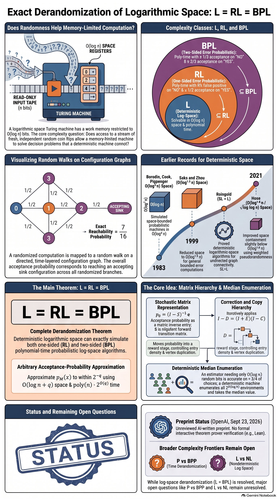

*AI-generated overview. Its known slips include a wrong exponent for Hoza's bound (1.8 instead of 3/2), a random-walk picture that is not the worked example, and several typos. See the [errata](assets/README.md#errata).*

## Contents

- [TL;DR](#tldr)
- [How to read this](#how-to-read-this)
- [1. The problem](#1-the-problem)
- [2. A short history](#2-a-short-history)
- [3. What the paper proves](#3-what-the-paper-proves)
- [4. Why it matters](#4-why-it-matters)
- [5. The main idea of the proof](#5-the-main-idea-of-the-proof)
- [6. The people whose ideas this builds on](#6-the-people-whose-ideas-this-builds-on)
- [7. What it does not prove, and caveats](#7-what-it-does-not-prove-and-caveats)
- [8. Glossary](#8-glossary)
- [9. Slides, audio and other assets](#9-slides-audio-and-other-assets)
- [How this explainer was made](#how-this-explainer-was-made)

---

## TL;DR

- **The question.** A *logarithmic-space* machine reads an input of length $n$ but has only $O(\log n)$ bits of scratch memory: room for a few counters and pointers into the input, nothing more. Suppose we also hand it fair coins and let it run for polynomial time. The classes **RL** (one-sided error) and **BPL** (two-sided error) are the problems it can then solve. **Does randomness help such a memory-starved machine?** Equivalently: is **L = BPL**, where **L** is the deterministic version?
- **What was known.** Every deterministic replacement for the coins needed more memory: $O(\log^2 n)$ (Borodin, Cook and Pippenger, 1983; Nisan's generator, 1992), $O(\log^{3/2} n)$ (Saks and Zhou, 1999), and slightly less than that (Hoza, 2021). Special cases were fully derandomized, most famously undirected connectivity (Reingold, 2005), which gave SL = L (SL, "symmetric log space", is the class built around that problem).
- **What this paper claims.** $\mathsf L = \mathsf{RL} = \mathsf{BPL}$. Every polynomial-time randomized log-space algorithm with bounded error can be replaced by a deterministic log-space algorithm. The paper also approximates the acceptance probability of any such machine to within $2^{-q}$ in space $O(\log n + q)$ and time $n^{O(1)}2^{O(q)}$, handles promise problems (where only inputs with a clear probability gap must be answered correctly), and finds accepting runs when the acceptance probability is at least inverse-polynomial. Finally, it gives an effective compiler: given a randomized machine together with supplied time and space bounds, it outputs a deterministic machine with explicit resource bounds.
- **How.** It writes the acceptance probability as one entry of $(I-S)^{-1}e$ on the machine's configuration graph. Using exact algebraic identities, it rewrites that quantity over $O(\log n)$ stages that move probability from the graph's edges into a "reward" vector, until the reward at the start is within an inverse polynomial of the answer. It then estimates the final reward with a randomized estimator that itself uses only $O(\log n)$ random bits and $O(\log n)$ memory. With so few random bits, a deterministic machine can try every one of the polynomially many choices and take the median.
- **What it doesn't do.** It is an unreviewed, 108-page preprint written by an AI model, with **no Lean formalization**. It says nothing about P versus BPP or L versus NL, and it does not construct a pseudorandom generator. Its stated resource bounds are explicit but astronomically large.

## How to read this

| You have… | Read |
|---|---|
| 2 minutes | The TL;DR and the [history chart](#2-a-short-history) |
| 15 minutes | Sections 1–4 and 7 |
| An hour, and you like algorithms | Everything, including the [worked example](#14-a-worked-example-a-random-walk-simulated-four-ways) and [section 5](#5-the-main-idea-of-the-proof) |

---

## 1. The problem

### 1.1 What "logarithmic space" means for a programmer

Picture a program that receives a huge read-only input, say a graph with $n$ edges stored on disk, and is allowed only a tiny amount of writable memory: $O(\log n)$ bits. An index into the input costs $\log_2 n$ bits, so the program can keep a **constant number of indices and counters**, and that is all. It cannot copy the input, keep a visited set, or store a stack whose depth grows with $n$.

That is still enough for a surprising amount. Checking whether a string is a palindrome needs two indices. Adding two binary numbers needs a position and a carry bit. Counting how often a symbol occurs needs one counter.

The paper's machine model is the standard one: finite control, a read-only input with endmarkers, finitely many work tapes, and (for randomized machines) a supply of fresh, independent fair bits. Space counts **every** writable cell that is touched, including every counter, numerical register and suspended recursive call. The class **L** is the set of problems decidable by deterministic machines in $O(\log n)$ work space.

A useful fact, stated in the paper's introduction: a halting deterministic log-space machine has only polynomially many configurations, so it runs in polynomial time. A **configuration** is everything that determines the next step: the control state, the head positions and the work-tape contents. With $O(\log n)$ bits of work tape there are $2^{O(\log n)} = n^{O(1)}$ of them.

### 1.2 Adding coins: RL and BPL

Now give the machine coins. Each coin is read once, when it is flipped. To "remember" a coin, the machine must store it in its tiny work memory. The machine must also halt within polynomial time on **every** sequence of coins. The paper defines:

| Class | Machine | On a "no" input | On a "yes" input |
|---|---|---|---|
| **L** | deterministic, $O(\log n)$ space | rejects | accepts |
| **RL** | randomized, $O(\log n)$ space, polynomial time | accepts with probability **0** | accepts with probability $\ge 1/2$ |
| **BPL** | randomized, $O(\log n)$ space, polynomial time | accepts with probability $\le 1/3$ | accepts with probability $\ge 2/3$ |

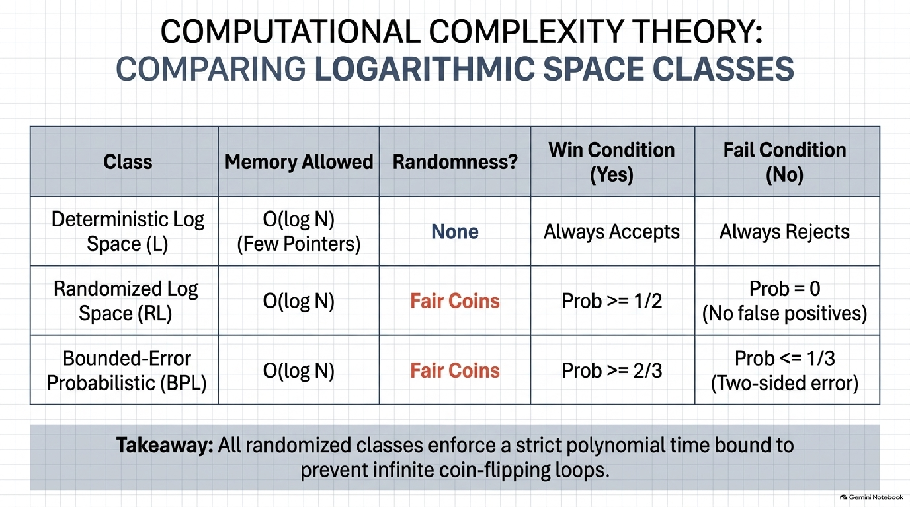

*AI-generated slide. The table matches the paper. The takeaway's reason for the time bound ("infinite coin-flipping loops") is NotebookLM's; the reason that matters is given two paragraphs below.*

The containments $\mathsf L \subseteq \mathsf{RL} \subseteq \mathsf{BPL}$ are easy. A deterministic machine can ignore its coins. An RL machine run twice, accepting if either run accepts, has acceptance probability 0 or at least $3/4$, which meets the BPL thresholds. The constants $1/2$, $1/3$ and $2/3$ are arbitrary: repeating the algorithm and taking a vote shrinks the error, still in log space and polynomial time.

The polynomial time bound matters. Wikipedia's RL article notes that if randomized log-space machines may run for unbounded time, they become as powerful as **NL**, nondeterministic log space. (That statement is about one-sided error. Two-sided error without a time bound is at least as powerful.) The paper stresses the same point: "the distinction between a space bound and simultaneous time and space bounds is essential throughout this history."

**The classic example.** Is vertex $t$ reachable from vertex $s$ in an undirected graph? In 1979 Aleliunas, Karp, Lipton, Lovász and Rackoff showed that a random walk solves this. Start at $s$, repeatedly move to a random neighbour, and accept if you hit $t$ within a polynomial number of steps. The walk only needs to remember its current vertex and a step counter: $O(\log n)$ bits. If $t$ is unreachable, the walk never accepts. If it is reachable, the walk finds it with good probability. So undirected connectivity is in RL. The same paper explicitly asked whether randomized log space can be simulated deterministically in log space. That is the question this paper claims to answer.

### 1.3 Why the obvious deterministic simulations use too much memory

Fix the input. The machine reads some polynomial number $R$ of coins. Three natural ways to compute its acceptance probability deterministically:

| Approach | Time | Memory | The catch |
|---|---|---|---|
| Try all $2^R$ coin sequences and count the accepting ones | $2^{R}$, exponential | $R$ bits for the current sequence, polynomial | Far too slow, and $R$ bits is far more than $\log n$ |
| Track the probability of every configuration, one time step at a time | polynomial | one number per configuration: polynomially many numbers | Far more than $\log n$ bits |
| Recursive "squaring": combine two halves of the computation recursively | more than polynomial | $O(\log^2 n)$ | Each of about $\log n$ levels of recursion keeps its own $O(\log n)$-bit state |

The third row is the idea behind Savitch's 1970 theorem: nondeterministic log space fits in $O(\log^2 n)$ deterministic space. For randomized machines, the paper cites a quadratic-space deterministic simulation by Borodin, Cook and Pippenger (1983). **The whole problem is to get from $\log^2 n$ down to $\log n$.**

### 1.4 A worked example: a random walk, simulated four ways

Here is a small randomized log-space computation. A walk on the path $0 - 1 - 2 - 3$ starts at $0$. At each of $T = 6$ steps it flips one fair coin. From an inner vertex it moves left on tails and right on heads. From $0$ it must move to $1$. Vertex $3$ is absorbing. The machine accepts if the walk is at $3$ after six steps, in other words if it ever reached $3$.

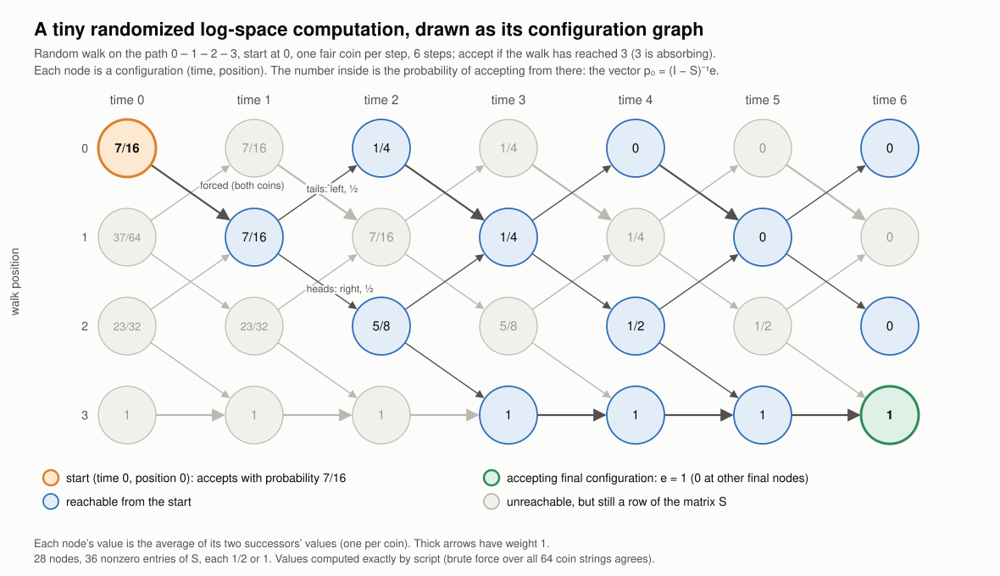

Each node of this layered graph is a configuration *(time, position)*. Each thin arrow is one coin outcome (probability 1/2). Each thick arrow is a move taken on both outcomes (probability 1). This is exactly a **read-once branching program**: a layered computation that reads its input bits (here, the coins) once each, in a fixed order. Its **length** is the number of steps (6) and its **width** is the largest number of states in a layer (4). For a log-space machine on a fixed input of length $n$, the configuration graph is a read-once branching program of polynomial width and polynomial length. Derandomizing BPL amounts to estimating the acceptance probability of such programs deterministically, in log space.

A short script (exact fractions) computes the acceptance probability four ways:

1. **Brute force.** Of the $2^6 = 64$ coin sequences, **28** end at vertex 3, so the probability is $28/64 = 7/16 = 0.4375$.
2. **Forward, layer by layer.** The distribution of the walk's position at each time:

   | time | at 0 | at 1 | at 2 | at 3 |
   |---|---|---|---|---|
   | 0 | 1 | 0 | 0 | 0 |
   | 1 | 0 | 1 | 0 | 0 |
   | 2 | 1/2 | 0 | 1/2 | 0 |
   | 3 | 0 | 3/4 | 0 | 1/4 |
   | 4 | 3/8 | 0 | 3/8 | 1/4 |
   | 5 | 0 | 9/16 | 0 | 7/16 |
   | 6 | 9/32 | 0 | 9/32 | **7/16** |

   This is fast, but it stores a whole row of probabilities, one number per configuration in a layer. For a real log-space machine a layer has polynomially many configurations.
3. **Backward, as a matrix inverse.** This is the form the paper uses (its Lemma 2.1). Let $S$ be the $28\times 28$ transition matrix of the configuration graph. Each of its 36 nonzero entries is $1/2$ or $1$ (a forced move). Let $e$ be the vector that is 1 at the accepting final configuration and 0 elsewhere. Because every step moves forward in time, $S^7 = 0$, and

   $$p_0 = (I - S)^{-1} e = e + Se + S^2e + \cdots + S^6 e .$$

   The entry $`p_0(x)`$ is the probability of accepting when the computation starts from configuration $x$. These are the numbers inside the nodes of the figure, and at the start $p_0 = 7/16$.
4. **Repeated squaring.** Square the $4\times 4$ one-step matrix $M$ twice and multiply: $M^6 = M^4 M^2$. The entry in row 0, column 3 is again $7/16$.

All four agree, as they must. The point of the example is the memory each method needs, not the answer: the paper must reach $7/16$ (to within a small error) while using only $O(\log n)$ bits of memory in total.

### 1.5 Pseudorandom generators: cheating with fewer coins

The classical plan of attack is a **pseudorandom generator** (PRG). It is a function $G$ that stretches a short random *seed* into a long string of bits that "looks random" to every small-space machine. In Hoza's (2021) formulation: $G : \lbrace 0,1\rbrace^r \to \lbrace 0,1\rbrace^R$ is an $\varepsilon$-PRG for a class of programs if, for each program $f$, the acceptance probability on $G(\text{random seed})$ is within $\varepsilon$ of its acceptance probability on truly random bits.

Why this would settle the question: if the seed has only $r = O(\log n)$ bits, a deterministic machine can run the program on $G(\text{seed})$ for **all** $2^r = n^{O(1)}$ seeds, one at a time, and count. The memory needed is the current seed plus whatever computing $G$ takes. Hoza notes that, by the probabilistic method (a counting argument), PRGs with seed length $O(\log(n/\varepsilon))$ for width-$n$, length-$n$ read-once branching programs *exist*. An explicit, log-space computable one would give $\mathsf L = \mathsf{BPL}$. Nobody had built one.

**Nisan's generator (1992).** Nisan built a PRG with seed length $O(S \log R)$ for space-$S$ computations that read $R$ random bits. For log space and polynomially many coins that is $O(\log^2 n)$. Enumerating all seeds then takes quasipolynomial time, $2^{O(\log^2 n)}$, as the paper notes. Nisan's later paper "RL ⊆ SC" (1994) reached polynomial time (SC is the class of problems solvable in polynomial time and polylogarithmic space at once) with $O(\log^2 n)$ space, and the paper points out that this result covers two-sided error too.

<details>
<summary><b>How Nisan's generator works</b> (textbook description, not from the paper)</summary>

Split the output into blocks of $b = O(S)$ bits. Choose $`k = \log_2(R/b)`$ hash functions $h_1,\dots,h_k$ from a pairwise-independent family on $b$-bit strings. Each takes $O(b)$ bits to describe. Define recursively

```math
G_0(x) = x, \qquad G_i(x) = G_{i-1}(x)\ \circ\ G_{i-1}\big(h_i(x)\big),
```

where $\circ$ is concatenation and $G_{i-1}$ uses $h_1,\dots,h_{i-1}$. Each level doubles the output length, so $G_k$ outputs $2^k$ blocks. The seed is $x$ plus the $k$ hash functions: $O(b\ k) = O(S\log R)$ bits. The intuition: a space-$S$ machine that has just read the first half of its random string remembers at most $S$ bits about it. So it cannot tell whether the second half was freshly random or computed from a hash of the first block. Hoza (2021) describes the same split of the seed into "the description of the hash functions" and "the input to the hash functions", which is what Saks and Zhou exploit.
</details>

**Hitting sets and weighted generators.** For one-sided error (RL) it is enough to have a **hitting set**: a list of strings containing an accepting input for every program that accepts at least half of all inputs. The paper cites Cheng and Hoza (2022): one log-space-enumerable hitting-set family for all width-$n$, length-$n$ read-once branching programs would already give $\mathsf L = \mathsf{BPL}$. Since 2018, *weighted* PRGs, where each seed carries a real-valued weight, possibly negative (Braverman, Cohen and Garg), have beaten Nisan's seed length when the error must be very small.

### 1.6 Why L = BPL was widely believed

Before this paper, most researchers expected $\mathsf L = \mathsf{BPL}$, for several reasons:

- **Good generators exist; we just couldn't build one.** As noted above, PRGs with optimal $O(\log n)$ seeds for polynomial-width branching programs exist by a counting argument (Hoza, 2021). An explicit one would give L = BPL.
- **Hardness implies randomness.** Klivans and van Melkebeek (STOC 1999; SIAM J. Comput. 2002) established hardness-versus-randomness trade-offs for space-bounded computation. In the form proved by Pyne, Raz and Zhan (2023), if some problem solvable in linear space needs Boolean circuits of size $2^{\varepsilon n}$ at every input length $n$, then every function computable by a randomized log-space algorithm has a deterministic log-space algorithm. Exponential circuit lower bounds of this kind are unproven but widely expected to hold (general knowledge, not a claim of the paper). Pyne, Raz and Zhan call $\mathsf{BPL} = \mathsf L$ "the widely believed assumption".
- **The special cases kept falling.** Undirected connectivity, the original motivating example, went from randomized log space (1979) to $O(\log^{3/2} n)$ (1992), $O(\log^{4/3} n)$ (2000) and finally deterministic log space (Reingold, 2005). Reingold, Trevisan and Vadhan (2006) extended log-space path search to Eulerian directed graphs.
- **Expert consensus.** Wikipedia's RL article calls a proof of $\mathsf{RL} = \mathsf L$ "the holy grail of the efforts in the field of unconditional derandomization of complexity classes."

What remained missing was an *unconditional* proof for *general* directed configuration graphs. As the paper puts it, Reingold–Trevisan–Vadhan's constructions need extra labelling conditions that "general directed configuration graphs need not have".

---

## 2. A short history

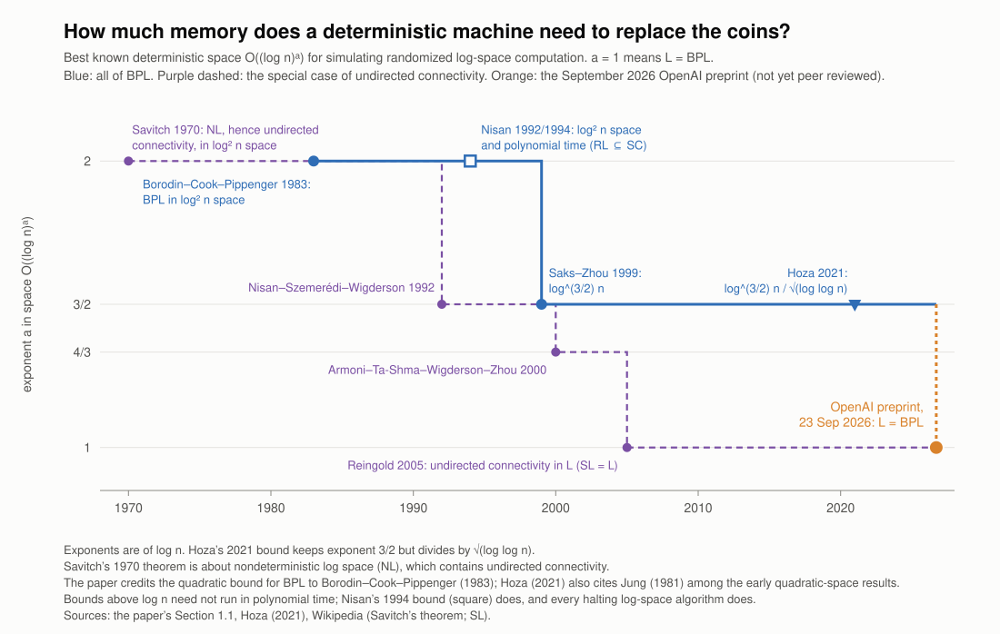

The chart plots the space bounds in the table below. Entries come from the paper's Section 1.1 unless marked otherwise.

| When | Who | What happened |
|---|---|---|
| 1970 | **Walter Savitch** | Nondeterministic log space fits in $O(\log^2 n)$ deterministic space (Savitch's theorem; from Wikipedia and Hoza 2021) |
| 1977 | **John Gill** | The complexity theory of probabilistic Turing machines, with both time and tape (space) measures |
| 1979 | **Romas Aleliunas, Richard Karp, Richard Lipton, László Lovász, Charles Rackoff** | Random walks put undirected connectivity in randomized log space. They explicitly ask whether randomized log space can be simulated deterministically in log space |
| 1983 | **Allan Borodin, Stephen Cook, Nicholas Pippenger** | A deterministic simulation of space-bounded probabilistic machines in quadratic space, $O(\log^2 n)$, even without a polynomial time bound. (Hoza 2021 groups this with Savitch 1970 and a 1981 paper of H. Jung as the early work giving quadratic space) |
| 1987 | **Miklós Ajtai, János Komlós, Endre Szemerédi** | Early log-space constructions that hit small-space tests using short random strings |
| 1992 | **László Babai, Noam Nisan, Márió Szegedy** | Pseudorandom generators for log space from multiparty communication bounds |
| 1992 | **Noam Nisan** | His generator: seed length $O(S\log R)$, so $O(\log^2 n)$ for log space |
| 1992 | **Noam Nisan, Endre Szemerédi, Avi Wigderson** | Undirected connectivity in deterministic space $O(\log^{3/2} n)$ |
| 1992 / 1994 | **Noam Nisan** | "RL ⊆ SC": polynomial time *and* $O(\log^2 n)$ space at once, including two-sided error (STOC 1992 version per Wikipedia; journal 1994) |
| 1996 | **Noam Nisan, David Zuckerman** | "Randomness is linear in space": a space-$S$ computation using $\mathrm{poly}(S)$ random bits needs only $O(S)$ of them |
| 1999 | **Michael Saks, Shiyu Zhou** | $\mathsf{BPL} \subseteq \mathsf{DSPACE}(\log^{3/2} n)$, unbeaten for over two decades |
| 1999 / 2002 | **Adam Klivans, Dieter van Melkebeek** | Hardness-versus-randomness trade-offs for space-bounded computation (from their paper's abstract, via Crossref; not cited by this paper) |
| 2000 | **Roy Armoni, Amnon Ta-Shma, Avi Wigderson, Shiyu Zhou** | Undirected connectivity in $O(\log^{4/3} n)$ space |
| 2005 / 2008 | **Omer Reingold** | Undirected connectivity in deterministic log space (STOC 2005, JACM 2008), so **SL = L** |
| 2006 | **Omer Reingold, Luca Trevisan, Salil Vadhan** | Pseudorandom walks on regular digraphs; log-space path search for Eulerian directed graphs |
| 2006 | **Jin-Yi Cai, Venkatesan Chakaravarthy, Dieter van Melkebeek** | A time–space trade-off: time $n^{O(\log^{1/2-\alpha} n)}$ with space $O(\log^{3/2+\alpha} n)$ |
| 2018 / 2020 | **Mark Braverman, Gil Cohen, Sumegha Garg** | Weighted pseudorandom generators ("pseudorandom pseudo-distributions") with near-optimal error (cited in the paper's Section 5, not 1.1; STOC 2018 / SIAM J. Comput. 2020, description from Hoza 2021) |
| 2021 | **William Hoza** | $`\mathsf{BPL} \subseteq \mathsf{DSPACE}\big(\log^{3/2} n / \sqrt{\log\log n}\big)`$, the first improvement on Saks–Zhou |
| 2020 / 2022 | **Kuan Cheng, William Hoza** | Hitting sets would give two-sided derandomization of small space (CCC 2020, per Hoza 2021; the paper cites the 2022 journal version) |
| 2023 | **Edward Pyne, Ran Raz, Wei Zhan** | Certified hardness versus randomness for log space, and a universal deterministic estimator |
| 23 Sep 2026 | **OpenAI** (internal model) | This preprint: $\mathsf L = \mathsf{RL} = \mathsf{BPL}$ |

NotebookLM's sketch-note version of the story is below. It is a good overview, but it gives Hoza's 2021 exponent as 1.3 instead of 3/2, lists Reingold–Trevisan–Vadhan twice, and says Cheng and Hoza showed "L = BPL" when they showed that suitable hitting sets would imply it (see the [errata](assets/README.md#errata)).

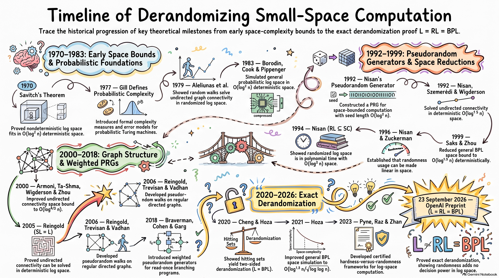

The paper also cites 2026 work on weighted generators (Chen, Cohen, Doron, Khaskelberg, Ta-Shma), regular branching programs (Cheng and Wu) and a survey of hardness versus randomness for low space (Pyne and Tell). This explainer did not check those three references.

---

## 3. What the paper proves

> **Theorem 1.1 (Exact logarithmic-space derandomization).** $\mathsf L = \mathsf{RL} = \mathsf{BPL}$.

In plain words: any problem that a polynomial-time, log-space algorithm can solve with coins and bounded error, either one-sided or two-sided, can also be solved with **no coins at all**, still in $O(\log n)$ memory (and therefore polynomial time).

The proof actually gives something stronger, a deterministic way to **approximate the acceptance probability itself**, with no gap or promise needed:

> **Theorem 1.2 (Acceptance-probability approximation).** Fix a randomized machine $\mathcal M$ with polynomial worst-case running time and $O(\log(n+2))$ work space, and let $`p_{\mathcal M}(x)`$ be its acceptance probability on input $x$. There is a uniform deterministic algorithm that, on input $(x, 1^q)$ with $q \ge 1$, outputs an integer $0\le a\le 2^{q+2}$ with $`\lvert a\ 2^{-(q+2)} - p_{\mathcal M}(x)\rvert \le 2^{-q}`$. It uses $O(\log(n+2)+q)$ work space and $(n+2)^{O(1)}\ 2^{O(q)}$ time. The constants depend only on $\mathcal M$.

Here "uniform" means one algorithm for all input lengths. The accuracy is requested in unary ($1^q$). Taking $q = O(\log n)$, that is, inverse-polynomial accuracy, keeps the space at $O(\log n)$ and the time polynomial. For larger $q$ the time grows exponentially in $q$. (The paper proves the fixed-accuracy version, Theorem 12.1, first and derives Theorem 1.2 from it by padding.) The remaining results:

| Result | Statement in plain words |
|---|---|
| **Theorem 12.1** (fixed inverse-polynomial accuracy) | For each fixed $d \ge 1$, a log-space, polynomial-time *transducer* (a machine that writes its answer on a write-only output tape) outputs an approximation of $`p_{\mathcal M}(x)`$ (a fraction with a power-of-two denominator) to within $(n+2)^{-d}$. With $d = 3$ the error is at most $1/8$, so comparing with $1/2$ decides any BPL language |
| **Corollary 12.3** | $\mathsf{PromiseBPL} = \mathsf{PromiseL}$. A *promise problem* only asks for correct answers on inputs in two disjoint sets (here: acceptance probability $\ge 2/3$ or $\le 1/3$). The same separation works for them, and the deterministic machine halts even on inputs outside the promise |
| **Corollary 12.4** (certified accepting computations) | If $`p_{\mathcal M}(x) \ge (n+2)^{-c}`$, a deterministic log-space machine *outputs an accepting run* of $\mathcal M$ (or a witness the run emits). It walks the computation greedily, always moving to the successor with the highest estimated chance of acceptance. On other inputs it outputs an accepting run or a failure symbol |
| **Theorem 13.1** (effective simulation with explicit bounds) | A terminating compiler takes a randomized machine description and supplied bounds ($(n+2)^a$ steps, $b\lceil\log(n+2)\rceil$ work bits) and emits a deterministic machine together with explicit numbers $K, H, c$. If the source really meets its bounds and has bounded error, the output decides the same language in $K\log(n+2)$ work bits and $H(n+2)^c$ bit operations |

The supplied resource bounds in Theorem 13.1 are hypotheses on the source machine. The compiler does not have to check them.

---

## 4. Why it matters

| | Before (best published bound) | After (if the preprint holds up) |
|---|---|---|
| **Deterministic space for BPL** | $O(\log^{3/2} n/\sqrt{\log\log n})$ (Hoza 2021) | $O(\log n)$ |
| **Polynomial time and small space at once** | $O(\log^2 n)$ space (Nisan 1994; Cai–Chakaravarthy–van Melkebeek's trade-off ends there) | $O(\log n)$ space |
| **RL versus L** | Open. Only special cases were derandomized, for example undirected connectivity (Reingold 2005) and path search in Eulerian directed graphs (Reingold–Trevisan–Vadhan 2006) | Settled in general: $\mathsf{RL} = \mathsf L$ |
| **Estimating acceptance probabilities** (random-walk probabilities in polynomial-size layered graphs) | High-precision small-space algorithms for random-walk probabilities, with stronger bounds for Eulerian graphs (Ahmadinejad et al. 2020); better space for long products of stochastic matrices (Cohen–Doron–Sberlo–Ta-Shma 2023) | Any inverse-polynomial accuracy in log space, for every polynomial-time log-space machine (Theorem 1.2) |
| **Promise problems and search** | — | $\mathsf{PromiseBPL} = \mathsf{PromiseL}$; accepting runs can be found deterministically (Corollaries 12.3 and 12.4) |
| **Effectiveness** | Pyne–Raz–Zhan's universal estimator uses $O(S(n))$ space exactly when $\mathsf{prBPL}\subseteq \mathsf{SPACE}[O(S(n))]$ ($\mathsf{prBPL}$ is the promise-problem version of BPL) | An effective compiler with explicit, source-specific numerical bounds (Theorem 13.1) |

Two remarks on this table. Both are our own reading, not statements made in the paper. First, the paper's result is what is usually called *white-box*; the paper itself does not use that word. It works directly with the transition structure of the configuration graph: predecessors, successors and inverse ports (the rule for stepping back along an edge). It does not produce a generator that fools every branching program from the outside (see [section 7](#7-what-it-does-not-prove-and-caveats)). Second, if the paper is correct, combining Corollary 12.3 with the hypothesis of Pyne, Raz and Zhan's universal estimator (as the paper quotes it, with $S(n) = \log n$) would make that estimator run in $O(\log n)$ space. Pyne, Raz and Zhan's own abstract states the same conditional: under $\mathsf{BPL} = \mathsf L$, their universal simulator uses at most $C_R\log n$ space for each randomized algorithm $R$.

The deeper significance: the paper opens with the question "Can fresh random bits increase what such a machine can decide?" In the paper's account, Aleliunas, Karp, Lipton, Lovász and Rackoff raised this question explicitly in 1979. If this proof is right, the answer is **no**. For polynomial-time log-space computation, coins save at most a constant factor of memory. The result is unconditional: it uses no unproven hardness assumption.

---

## 5. The main idea of the proof

The paper has 13 sections over 108 pages. Sections 2 and 4 build an exact target, Sections 3 and 5–9 build a randomized estimator for it and bound its error, Sections 10 and 11 show the estimator runs in log space, Section 12 finishes the proof, and Section 13 builds the compiler. Here it is at three zoom levels.

### Level 1: the one-paragraph version

Think of probability as **water** flowing from the start configuration through the time-layered configuration graph towards the accepting node. The answer is how much water arrives. Simulating the flow directly needs a bucket at every node: too much memory. The paper instead pays the flow into **savings accounts** in stages. At each stage, an exact algebraic identity moves most of the water still on the edges into a reward stored at the nodes, so the remaining edge weights shrink by a fixed factor $2^H$. Large weights that cannot be paid out this way are split across copies of their target node, and a counting argument shows that the number of active nodes at most doubles per stage. After $O(\log n)$ stages almost all the water sits in the start node's account. To *read* that balance without storing the whole ledger, the paper designs a randomized auditor that uses only $O(\log n)$ coin flips and $O(\log n)$ memory and is accurate on more than three quarters of its coin outcomes. With only $O(\log n)$ coins, a deterministic machine can simply run the auditor on **every** outcome and take the median.

> **Analogy for programmers:** a Monte Carlo estimator is easy to derandomize if it only needs $c\log_2 n$ random bits. Loop over all $n^c$ seeds. The whole difficulty is to build an estimator that needs so few random bits, works in log space, and halts even on the "bad" seeds.

### Level 2: the step-by-step picture

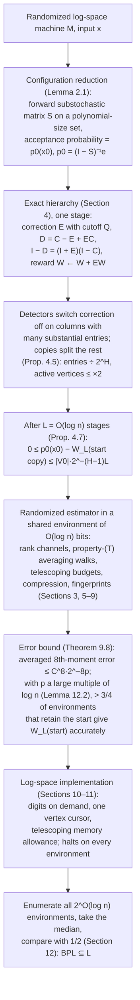
```mermaid
flowchart TD
    A["Randomized log-space machine M, input x"] --> B["Configuration reduction (Lemma 2.1):<br/>forward substochastic matrix S on a polynomial-size set,<br/>acceptance probability = p0(x0), p0 = (I − S)⁻¹e"]
    B --> C["Exact hierarchy (Section 4), one stage:<br/>correction E with cutoff Q, D = C − E + EC,<br/>I − D = (I + E)(I − C), reward W ← W + EW"]
    C --> D["Detectors switch correction off on columns with<br/>many substantial entries; copies split the rest<br/>(Prop. 4.5): entries ÷ 2^H, active vertices ≤ ×2"]
    D --> E["After L = O(log n) stages (Prop. 4.7):<br/>0 ≤ p0(x0) − W_L(start copy) ≤ |V0|·2^−(H−1)L"]
    E --> F["Randomized estimator in a shared environment of O(log n) bits:<br/>rank channels, property-(T) averaging walks,<br/>telescoping budgets, compression, fingerprints (Sections 3, 5–9)"]
    F --> G["Error bound (Theorem 9.8): averaged 8th-moment error ≤ C^8·2^−8p;<br/>with p a large multiple of log n (Lemma 12.2), > 3/4 of environments<br/>that retain the start give W_L(start) accurately"]
    G --> H["Log-space implementation (Sections 10–11):<br/>digits on demand, one vertex cursor,<br/>telescoping memory allowance; halts on every environment"]
    H --> I["Enumerate all 2^O(log n) environments, take the median,<br/>compare with 1/2 (Section 12): BPL ⊆ L"]
```

**Step 1: Turn the machine into a matrix (Lemma 2.1).** A vertex of the graph records a time $0,\dots,T(n)$, the control state, all head positions, and a box of $O(\log n)$ work cells. A transition advances time by one, so the matrix $S$ is **strictly forward**: every nonzero entry goes to a later time. It is also **substochastic**, with nonnegative entries and row sums at most 1. Each vertex has a constant number of outgoing and incoming "ports", and both directions can be computed in log space. Predecessors are found by guessing the old state, overwritten symbols, head moves and coin, then checking. Halted computations keep their data and keep ticking until time $T(n)$, and $e$ marks the accepting configurations at the final time. Then $`p_0 = (I-S)^{-1}e = \sum_{j\le T(n)} S^j e`$ is the vector of acceptance probabilities from every configuration, exactly as in the [worked example](#14-a-worked-example-a-random-walk-simulated-four-ways).

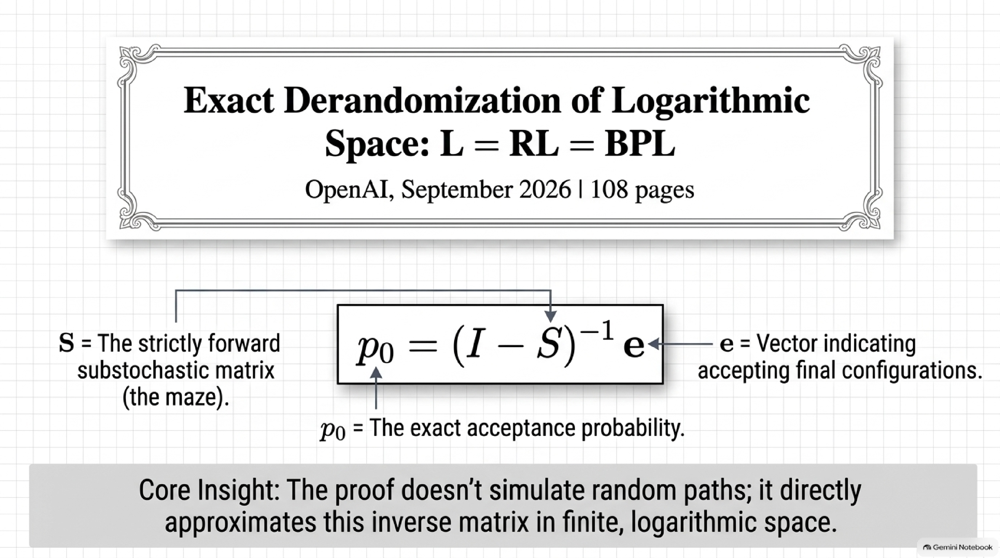

*AI-generated slide. Strictly, $p_0$ is the vector of acceptance probabilities from every configuration; the machine's acceptance probability is its entry at the start configuration $x_0$.*

**Step 2: Move probability from edges to rewards (Section 4).** Given a transition matrix $C$ and a nonnegative "correction" $E$, define $D = C - E + EC$. A one-line calculation gives

```math
I - D \;=\; (I + E)(I - C).
```

So if $W = (I-C)p$, then $(I+E)W = (I-D)p$. The same unknown vector $p$ is described by the new transitions $D$ and the new reward $W + EW$. The paper chooses $E$ by iterating $`E_i(x,y) = f\ Q\big((C + E_{i-1}C)(x,y)/f\big)\ g(y)`$. Here $f$ is the current entry scale, $g$ is a column multiplier, and $Q$ is a Lipschitz cutoff function with $`(t-\theta_2)_+ \le Q(t) \le (t-\theta_1)_+`$ for tiny thresholds $0 < \theta_1 < \theta_2 < 2^{-H}/32$. The cutoff deliberately leaves at least $\theta_1 f$ on every corrected entry. Because rows of the new matrix still sum to at most 1, each row of the fixed-point correction can have at most $`1/(\theta_1 f)`$ nonzero entries. This sparsity drives a **factorial truncation bound** (Lemma 4.1): after a *constant* number $k_\ast$ of iterations the correction is within a small error of the exact fixed point, whatever the size of the graph.

**Step 3: Detectors and copies (Lemma 4.3, Proposition 4.5).** Correcting a column with many substantial entries would be too expensive later. A "pilot" run computes a detector for each column: an exact expectation over random samples of rows, which flags columns with more than about $R_\ast/f$ substantial entries. On flagged columns the multiplier $g$ turns the correction off. The large entries that remain are split evenly among $D_0$ copies of their destination vertex. The result of one stage: all entries drop from $f$ to at most $f/2^H$, while the number of vertices touching a positive entry at most **doubles**. A weighted projection $P^r$ relates the copied graph to the old one exactly: $C^{+}P^r = P^r D$.

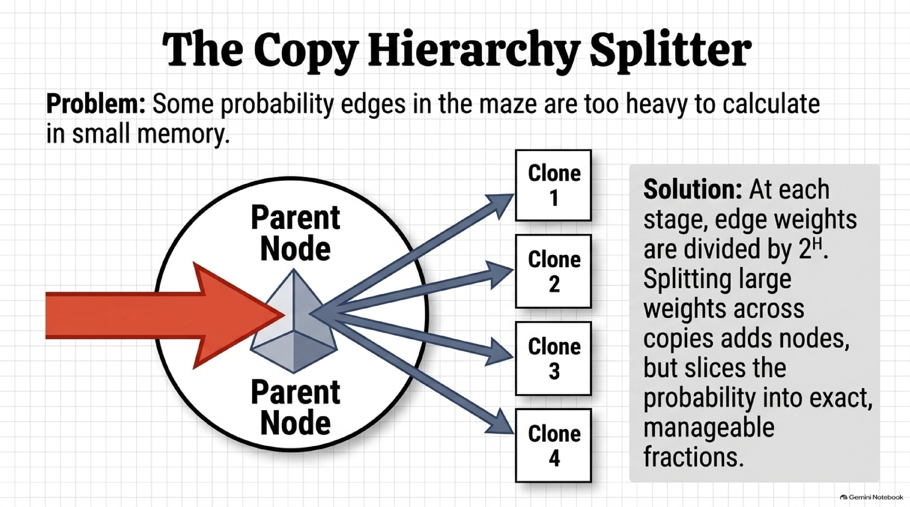

*AI-generated slide. The paper uses a fixed number $D_0$ of copies, not four, and splits only the large entries in columns where the detector has switched correction off. "Parent Node" is printed twice.*

**Step 4: Iterate (Proposition 4.7).** Repeat with $`f_l = 2^{-Hl}`$. The reward obeys $`W_{l+1}(x_i) = r_i(x)\big(W_l(x) + (E_lW_l)(x)\big)`$, and at the all-primary copy of the start

```math
0 \;\le\; p_0(x_0) - W_l(\bar x_l) \;\le\; |V_0|\ 2^{-(H-1)l}.
```

The reason: entries are at most $`2^{-Hl}`$ and at most $`2^l\lvert V_0\rvert`$ columns are active, so the transition mass still "in flight" is tiny. With $L = O(\log n)$ stages the error is below any fixed inverse polynomial. Every stage has at most $N = 2^{O(\log n)}$ vertices, so addresses still fit in $O(\log n)$ bits. Note that none of this uses a one-sided-error promise: it approximates **any** acceptance probability.

<details>
<summary><b>The hierarchy on the worked example</b> (a calculation done by script)</summary>

We ran the exact hierarchy of Section 4 on the 28-configuration random walk from [section 1.4](#14-a-worked-example-a-random-walk-simulated-four-ways). We used the paper's explicit cutoff $`Q(t) = (t-\theta_1)_+\ \beta\big((t-\theta_1)/(\theta_2-\theta_1)\big)`$, where $\beta$ is the normalized integral of $u^7(1-u)^7$, with constants $H = 4$ ($q = 16$), $\theta_1 = 1/2048$ and $\theta_2 = 1/1024$. These satisfy the paper's requirement $\theta_2 < q^{-1}/32$. The graph is so small that no column is ever flagged, so $g = 1$ and the copy step routes nothing to extra copies. Six iterations reach the exact fixed point, because the graph has depth 6, so any iteration count $k_\ast \ge 6$ (including the paper's much larger one) gives the same correction. Everything was computed in exact rational arithmetic.

| Stage $l$ | Entry scale $f_l$ | Reward at the start $W_l$ | Error $p_0 - W_l$ | Paper's bound $\lvert V_0\rvert 2^{-3l}$ |
|---|---|---|---|---|
| 0 | 1 | 0 | 0.4375 | 28 |
| 1 | 1/16 | 0.434540 | 0.00296 (= 97/32768) | 3.5 |
| 2 | 1/256 | 0.437315 | 0.000185 | 0.44 |
| 3 | 1/4096 | 0.437488 | 0.0000116 | 0.055 |

The reward climbs to $p_0 = 7/16 = 0.4375$ from below, and the script confirmed at every stage that the error equals exactly the "in flight" term $`(C_l\ p_0)(x_0)`$. (Since no copies are used here, this is the paper's $`(C_l P^c_l p_0)(\bar x_l)`$ from Proposition 4.7.) In this tiny example the error shrinks by exactly $q = 16$ per stage. The script also checked $I - D = (I+E)(I-C)$, $D \ge 0$ and the paper's entry bound $`D \le (\theta_2 + q^{-1}/32) f`$ at every stage.

What the toy hides: it stores whole matrices, which is the very thing log space forbids. Sections 5–11 of the paper exist to *estimate* these same numbers while storing almost nothing.
</details>

**Step 5: Estimate the target with a few random bits (Sections 3, 5–9).** The exact matrices $C_l, E_l, D_l$ and the reward $W_L$ are never stored. Instead, the algorithm estimates them inside one shared **random environment** $\sigma$, a list of $O(\log n)$-bit matrices over a prime field plus some extra random bits. The environment is used to *sample* vertices: a vertex is "retained" at rate about $f$, and sums over many vertices are estimated from the retained ones. The key guarantee (Theorem 9.8) is an averaged eighth-moment bound on the estimator's error:

```math
\frac1N\ \mathbb E_\sigma \sum_{v\in V_L}\frac{X_f(v)}{f}\ \big\lvert \bar W_L(v) - W_L(v)\big\rvert^8 \;\le\; C^8\ 2^{-8p},
```

where $`X_f(v)`$ indicates that $v$ is retained and $p$ is the statistical accuracy. Picking out the single start vertex costs a factor $N = 2^{O(\log n)}$ (Lemma 12.2), and choosing $p$ as a large enough multiple of $\log n$ pays for it. The result: conditioned on the start being retained, the estimate has the required accuracy on more than three quarters of all environments.

**Step 6: Make it fit in log space (Sections 10–11).** The estimator is deeply recursive. A product term follows a correction edge to an intermediate vertex and queries another estimate there. Keeping a full $O(\log n)$-bit vertex address at each of $O(\log n)$ recursion levels would cost $O(\log^2 n)$, the same wall as before. The paper avoids this with several devices:

- one shared **vertex cursor** that moves along edges and back through inverse ports;
- numbers computed **one digit at a time**, on demand;
- short **fingerprints** in place of full endpoint addresses;
- a shared **catalytic** bit vector, whose arbitrary contents are always restored after use;
- a **memory allowance** for each recursive call. The local data of a call with allowance $w$, querying a child with allowance $w'$ at digit places $t \to j$, take at most $A(w - w') + D(t - j)$ bits, for fixed constants $A$ and $D$. Along the chain of active calls these differences telescope to $O(\log n)$ in total.

Every query halts on **every** environment, even the ones where the estimate is wrong (Theorem 11.1).

**Step 7: Enumerate and take the median (Section 12).** The environment has only $O(\log n)$ bits, so there are $2^{O(\log n)}$, that is polynomially many, of them. The final algorithm loops over all of them in their original multiplicities, keeping those that satisfy the "frame" condition (a linear-independence requirement on the random matrices, see Level 3) and retain the start vertex, and finds the **median** estimate by binary search, recounting with a fresh pass each time. It never stores the list of estimates. More than three quarters of the values are accurate, so the median is too: fewer than a quarter can lie below the accurate range and fewer than a quarter above it. With error at most $1/8$ (accuracy exponent $d = 3$), an acceptance probability $\le 1/3$ gives an answer $\le 11/24$ and one $\ge 2/3$ gives $\ge 13/24$, so comparing with $1/2$ decides the language. Each query is a halting log-space computation with $2^{O(\log n)}$ configurations, so the total running time is polynomial.

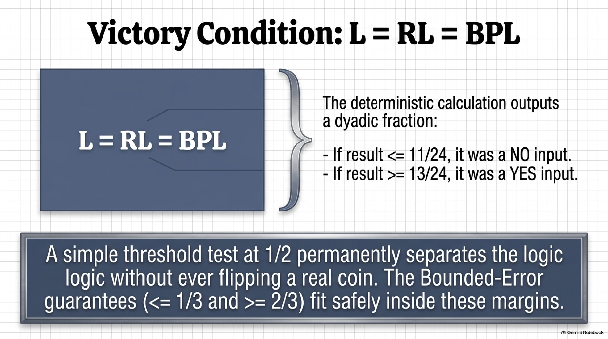

*AI-generated slide. The paper's direction is: a no input gives an answer of at most 11/24 and a yes input at least 13/24, and the algorithm compares the answer with 1/2. "Logic logic" is a typo.*

### Level 3: the estimator's components, for readers who know some pseudorandomness

- **Rank channels (Section 3).** A channel is a uniformly random matrix $A \in \mathbb F_P^{H\times h_0}$ whose last $h_0 - 1$ columns are linearly independent (the paper calls such columns a *frame*). An identifier $y$ is retained at rate $b_k = 2^{-Hk}$ if every coordinate of $`A\ (1, y, \dots, y^{h_0-1})^{\mathsf T}`$ lies below $\lceil P2^{-k}\rceil$. Lemma 3.1 gives retention probability $\asymp$ the rate, a conditional pair bound $`\Pr[X_a(y) = 1 \mid X_u(x) = 1] \le C_{\rm pair}\ a`$, a Chebyshev count bound, and invariance under affine relabelling. The last property makes appended "copy digits" harmless. The prime $P$ has $O(\log n)$ bits and is found by trial division.
- **Stochastic atoms (Section 5).** Matrix entries, corrections and detector scores are represented by sample-dependent tables with bounded row support. Their *true* conditional means equal the exact hierarchy's entries. The estimates substitute earlier estimates into these formulas, so the analysis has to control bias without assuming that estimated factors are independent. The paper relates this to weighted pseudorandomness (Braverman–Cohen–Garg; Cohen–Doron–Renard–Sberlo–Ta-Shma).
- **Conditional averaging (Section 6).** To approximate conditional expectations on "slices" where specified vertices are retained, the algorithm runs short walks on the environment. Their mixing comes from **property (T)**: Shalom's quantitative results for $`\mathrm{SL}_H(\mathbb Z)`$ ($H\ge3$) and for the pair $`(\mathrm{SL}_2(\mathbb Z)\ltimes\mathbb Z^2, \mathbb Z^2)`$ give a lazy walk with a spectral gap bounded below uniformly on every finite transitive action (Lemma 6.1).
- **Telescoping budgets (Section 7).** Each estimation task has a statistical budget $M$. The algorithm averages *differences* between child estimates at consecutive budgets $m$ and $m-1$. Their means telescope, and their small size means short averaging walks already suppress the noise. The slack $M - m$ sets both the walk length and the description length of a sample path.
- **Compression (Section 8).** Each row array is replaced by a short list of exceptions to a common default, with an "error reserve" that charges overflows to rare heavy events.
- **Adaptive fingerprints (Section 9).** At small slacks, endpoints are compared by keys in $\lbrace 1,\dots,B\rbrace$, where $B = \Theta(\log n)$ is the paper's size parameter, built from $O(\log B)$ fair bits by polynomial evaluation (Schwartz) and affine hashing (Carter–Wegman), with collision probability $O(1/B)$ (Lemma 9.1). The candidate endpoints can depend on earlier comparisons, so a fixed-pair collision bound is not enough. The proof couples the algorithm with a calculation that uses exact equality inside one budget block, which closes a coupled induction (Proposition 9.7, Theorem 9.8). Key equality is tested with a shared catalytic vector, in the spirit of Buhrman–Cleve–Koucký–Loff–Speelman's catalytic computation.
- **Arithmetic and control (Sections 10–11).** Values are streams of signed digits in $\lbrace -6,\dots,6\rbrace$ (a redundant representation going back to Avizienis, 1963), so one digit can be requested at a time (Theorem 10.9). Incoming edges are enumerated by walking the contour of a finite program tree, after Cook–McKenzie and Lange–McKenzie–Tapp, so no second vertex address has to be saved.
- **The extras (Sections 12–13).** Theorem 1.2 follows by running the fixed-accuracy algorithm on a virtual padded input of length $m = 2^{q + O(\log n)}$, which turns the requested accuracy into input length. The compiler of Theorem 13.1 builds one resource-capped universal randomized interpreter. It applies the fixed-accuracy separator to that interpreter once and for all, then specializes the resulting deterministic library to each source program.

---

## 6. The people whose ideas this builds on

| Person | Idea | Where it shows up |
|---|---|---|
| **John Gill** | Probabilistic Turing machines and their complexity (1977) | The model behind RL and BPL |
| **Romas Aleliunas, Richard Karp, Richard Lipton, László Lovász, Charles Rackoff** | Random walks for undirected connectivity; the RL versus L question (1979) | The motivating problem |
| **Walter Savitch; Allan Borodin, Stephen Cook, Nicholas Pippenger** | Recursive squaring; quadratic-space simulation of probabilistic machines | The $O(\log^2 n)$ baseline |
| **Noam Nisan** | The space-bounded PRG (1992); RL ⊆ SC (1994); with Zuckerman, "randomness is linear in space" (1996) | Background; the bounds this paper replaces |
| **Miklós Ajtai, János Komlós, Endre Szemerédi; László Babai, Márió Szegedy** | Early log-space generators and hitting constructions | Background |
| **Michael Saks, Shiyu Zhou** | $\mathsf{BPL}\subseteq\mathsf{DSPACE}(\log^{3/2} n)$ (1999) | The long-standing record |
| **Omer Reingold, Luca Trevisan, Salil Vadhan** | SL = L (Reingold, 2005); pseudorandom walks on regular digraphs (2006) | The special cases this paper generalizes |
| **William Hoza, Kuan Cheng** | Better pseudodistributions and $o(\log^{3/2} n)$ space (Hoza, 2021); hitting sets give two-sided derandomization (Cheng–Hoza, 2022) | The previous record, and a related route to L = BPL |
| **Mark Braverman, Gil Cohen, Sumegha Garg, Dean Doron, Oren Renard, Ori Sberlo, Amnon Ta-Shma** | Weighted PRGs and error reduction; small-space products of stochastic matrices | Context for the stochastic tables and the matrix-inverse view |
| **AmirMahdi Ahmadinejad, Jonathan Kelner, Jack Murtagh, John Peebles, Aaron Sidford, Salil Vadhan** | High-precision small-space estimation of random-walk probabilities (2020) | Context for estimating $(I-S)^{-1}e$ |
| **Edward Pyne, Ran Raz, Wei Zhan** | Certified hardness versus randomness; a universal deterministic estimator (2023) | Context for the effective compiler |
| **Yehuda Shalom** | Quantitative Kazhdan property (T) for $`\mathrm{SL}_n(\mathbb Z)`$ and relative (T) (1999) | The uniform mixing of the averaging walks (Section 6) |
| **Jacob Schwartz; J. Lawrence Carter, Mark Wegman** | Polynomial identity testing; universal hashing | The short fingerprint keys (Section 9) |
| **Harry Buhrman, Richard Cleve, Michal Koucký, Bruno Loff, Florian Speelman** | Catalytic space (2014) | The restoring key-equality test (Section 9) |
| **Stephen Cook, Pierre McKenzie; Klaus-Jörn Lange, Alain Tapp** | Tree contours in log space; reversible space equals deterministic space | Enumerating incoming edges without extra addresses (Section 11) |
| **Algirdas Avizienis** | Redundant signed-digit arithmetic (1963) | Digit-on-demand numerics (Section 10) |

---

## 7. What it does not prove, and caveats

> [!IMPORTANT]
> **Scope: randomness in log space, nothing more.** The theorem is about **polynomial-time**, bounded-error, randomized log space with fresh coins that are read once. It does **not** show $\mathsf L = \mathsf{NL}$: without the time bound, one-sided-error randomized log space already equals NL, and that question is untouched. It says nothing about $\mathsf P$ versus $\mathsf{BPP}$ (time-bounded randomness) or $\mathsf P$ versus $\mathsf{NP}$. It also does not cover machines with two-way access to their random bits, which could go back and re-read old coins. The paper's model gives fresh, independent bits. (Section 13.1 shows how a one-way random tape whose head may pause on the current bit is converted to this model.)

> [!IMPORTANT]
> **It is not a pseudorandom generator.** The deterministic algorithm reads the machine's configuration graph, including its predecessors and inverse ports, and estimates $(I-S)^{-1}e$ directly. The paper does not claim an explicit PRG or hitting set with $O(\log n)$ seed length for read-once branching programs. Such a generator would also work "black-box", that is, without looking inside the program, and as far as we know it is not known to follow from $\mathsf L = \mathsf{BPL}$. Problems that need such generators (for example, fooling programs given only as black boxes) are not addressed. The "white-box versus black-box" framing is ours; the paper does not discuss it.

> [!WARNING]
> **Not a practical algorithm.** The stated bounds are explicit but enormous. For example, the compiler's running-time constant $H$ includes a factor $2^{(u+100)^2}$, where $u \ge 1$ bounds the size of the generated machine's description (Section 13.5), so $H \ge 2^{10201}$. The paper picks such bounds for simplicity (it calls a related one "deliberately loose"), not for tightness. The construction uses a stage count $L = O(\log n)$, eighth-moment error bounds, a prime of $O(\log n)$ bits found by trial division, and repeated full enumerations of the environment. It is a theoretical simulation, not something one would run.

> [!NOTE]
> **Provenance.** The paper was produced by an unreleased internal OpenAI model as part of the [openai/math](https://github.com/openai/math) release. That repository's README says the vast majority of its results came from one fixed procedure (about three hours of ChatGPT Pro thinking compute per result on average). It names two exceptions, work on a zero-free region for the zeta function and the Hodge conjecture for CM abelian varieties, and family 103 is not one of them. No reasoning summary was released for this family.

> [!WARNING]
> **Verification status.** openai/math has **no Lean formalization** for this family. There is no `lean/docs/103.md` (GitHub returned "Not Found" on 7 October 2026), `lean/formalization.yaml` does not list this paper among its sources, and the family's entry in `CONTENTS.md` has no Lean link. The openai/math README warns that "some of the unformalized results could have issues." The proof is 108 pages long, combines many delicate probabilistic and space-accounting arguments, and relies on outside results (notably Shalom's quantitative property (T)). As of October 2026 it is an unreviewed preprint. A claim of this size needs independent checking by experts, and this explainer did not check the proof.

> [!TIP]
> **Simplifications.** To stay readable, this explainer suppresses the pilot's row gates and rank thresholds, the exact routing fractions of the copy step, the conditioning on frames and retention events, the task and dependency order of the estimator, and most of the space-accounting conventions (endmarkers, input-head confinement, counted blank cells). Every precise statement is in the paper.

---

## 8. Glossary

| Term | Meaning |
|---|---|
| **Logarithmic space (log space)** | $O(\log n)$ bits of writable memory on an input of length $n$: a constant number of counters and pointers |
| **L** | Problems decidable by deterministic log-space machines (these always run in polynomial time) |
| **RL** | Randomized log space, polynomial time, one-sided error: never accepts a "no" input, accepts a "yes" input with probability at least $1/2$ |
| **BPL** | Randomized log space, polynomial time, two-sided error: accepts "no" inputs with probability at most $1/3$ and "yes" inputs with probability at least $2/3$ |
| **NL** | Nondeterministic log space. One-sided-error randomized log space *without* a time bound has the same power |
| **SL, SL = L** | Symmetric log space, whose complete problem is undirected connectivity. Reingold (2005) put it in L |
| **SC** | Problems solvable in polynomial time and polylogarithmic space simultaneously ("RL ⊆ SC" is Nisan's 1994 theorem) |
| **Derandomization** | Replacing a randomized algorithm by a deterministic one with similar resources |
| **Configuration** | The complete instantaneous state of a machine: control state, head positions, work-tape contents |
| **Configuration graph** | Vertices are configurations, edges are single steps (one per coin outcome). Layered by time, it is a read-once branching program |
| **Read-once branching program (ROBP)** | A layered graph that reads its input bits once each in a fixed order. *Length* = number of steps; *width* = largest layer |
| **Substochastic, strictly forward** | Nonnegative entries with row sums at most 1; every nonzero entry goes to a later time, so $`(I-S)^{-1} = \sum_j S^j`$ is a finite sum |
| **Pseudorandom generator (PRG)** | A function stretching a short seed into bits that fool a class of tests up to error $\varepsilon$. A log-space computable PRG with seed $O(\log n)$ for polynomial-width ROBPs would give L = BPL |
| **Seed length** | The number of truly random bits a PRG needs. Nisan's is $O(\log^2 n)$ for log space |
| **Hitting set** | A list of inputs that contains an accepting input for every program accepting at least half of all inputs |
| **Weighted PRG** | A PRG whose seeds carry real (possibly negative) weights |
| **Correction, residual** | In the paper's hierarchy, $E$ and $D = C - E + EC$, related by $I - D = (I+E)(I-C)$ |
| **Reward** | The vector $W_l$ that accumulates the transferred probability, $`W_{l+1} = r\ (W_l + E_lW_l)`$ |
| **Detector, copies** | A pilot expectation that flags columns with many substantial entries, and the splitting of large entries across $D_0$ copies of a vertex |
| **Environment** | The shared $O(\log n)$-bit random string (field matrices and salt bits) that drives the estimator; enumerated exhaustively at the end |
| **Property (T)** | A rigidity property of groups such as $`\mathrm{SL}_n(\mathbb Z)`$, $n \ge 3$. Here it gives walks that mix uniformly fast on every finite action |
| **Fingerprint** | A short hash key standing in for a long vertex address, with small collision probability |
| **Catalytic memory** | Memory with arbitrary initial contents that may be used temporarily but must be restored exactly |
| **Promise problem** | A pair of disjoint input sets (yes, no); a decider may answer anything outside them, but here it must still halt |
| **Lean 4** | A proof assistant that mechanically checks every step of a proof. There is no Lean formalization for this family |

---

## 9. Slides, audio and other assets

Everything below except the two hand-made figures was generated with **Google NotebookLM** (now "Gemini Notebook") from the paper and the [Wikipedia article on BPL](https://en.wikipedia.org/wiki/BPL_(complexity)). The report and the mind map used only the paper. The outputs are kept exactly as NotebookLM produced them. They are AI-generated, so see the [errata](assets/README.md#errata) before relying on any detail. In particular, slides 6, 7, 9, 11 and 15 contain clear errors. A revision of those five slides has been proposed but not yet run.

| Asset | What it is |
|---|---|
| [Slide deck (PDF)](assets/notebooklm/slides.pdf) · [PPTX](assets/notebooklm/slides.pptx) | 15 beginner slides, not revised. Slides 6, 7, 9, 11 and 15 have clear errors |
| [Infographic: overview](assets/notebooklm/infographic-overview.png) | The one-page summary shown at the top |
| [Infographic: history timeline](assets/notebooklm/infographic-history-timeline.png) | From Savitch 1970 to the September 2026 preprint, in sketch-note style |
| [Audio overview (≈1.7 min)](assets/notebooklm/audio-overview-brief.m4a) | A short podcast-style summary (not reviewed) |
| [Beginner report](assets/notebooklm/beginner-explainer-report.md) | NotebookLM's long-form written explainer. Its theorem statements and hierarchy steps match the paper; several history dates and one key formula are wrong |
| [Mind map](assets/notebooklm/mindmaps.md) | How the proof fits together |
| [Configuration-graph figure](assets/figures/configuration-graph.svg) | Hand-made: the worked example of section 1.4, a width-4, length-6 read-once branching program with $p_0$ at every node |
| [Space-history figure](assets/figures/space-history.svg) | Hand-made: the best deterministic space bounds for BPL and for undirected connectivity, 1970–2026 |

<details>
<summary><b>All 15 slides</b> (click to expand)</summary>

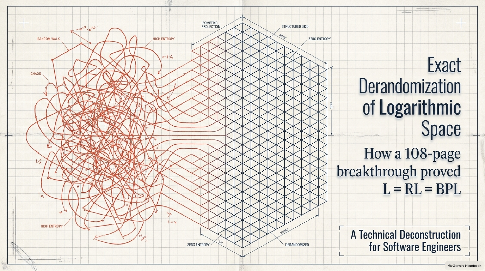

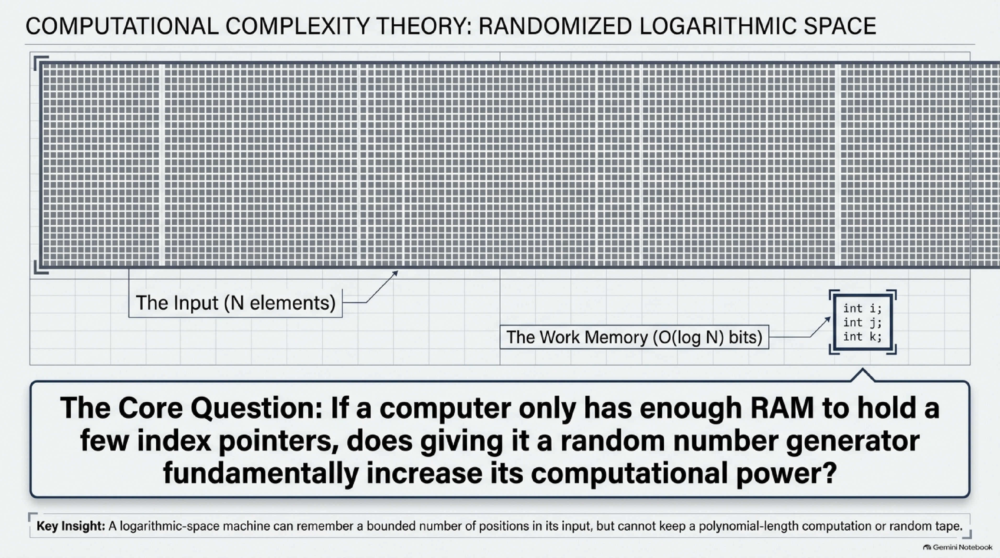


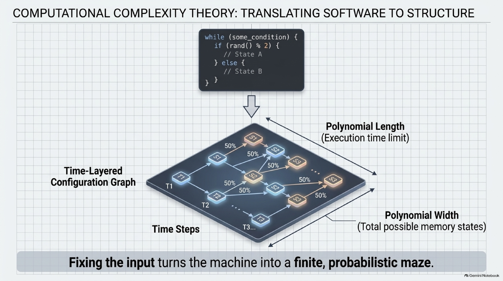

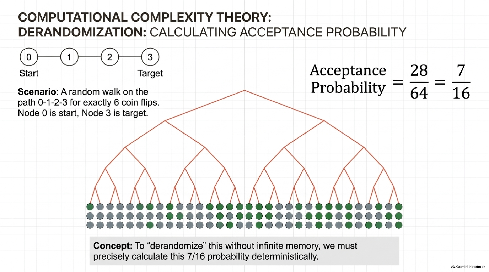

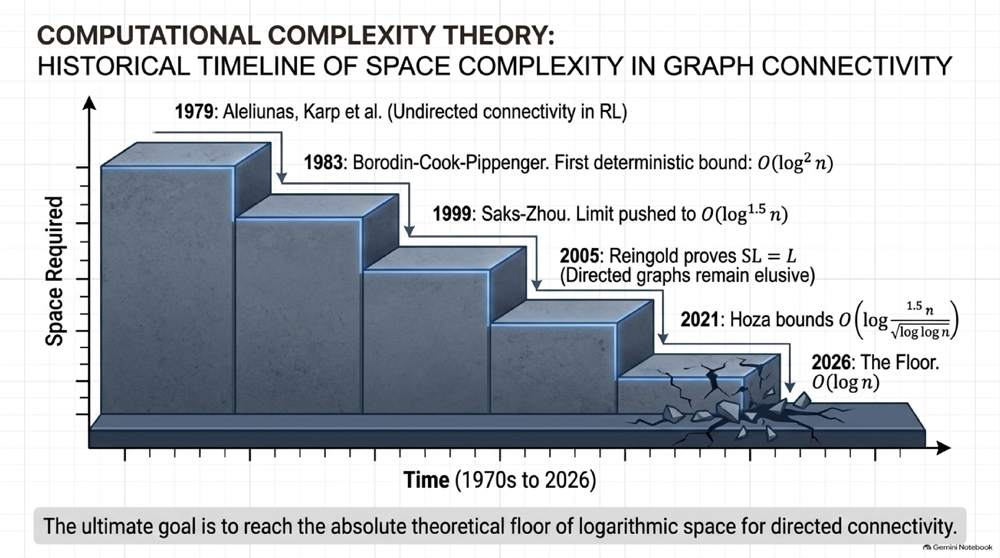

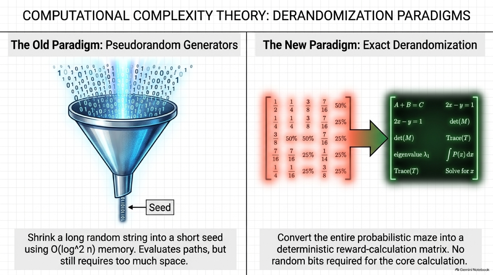


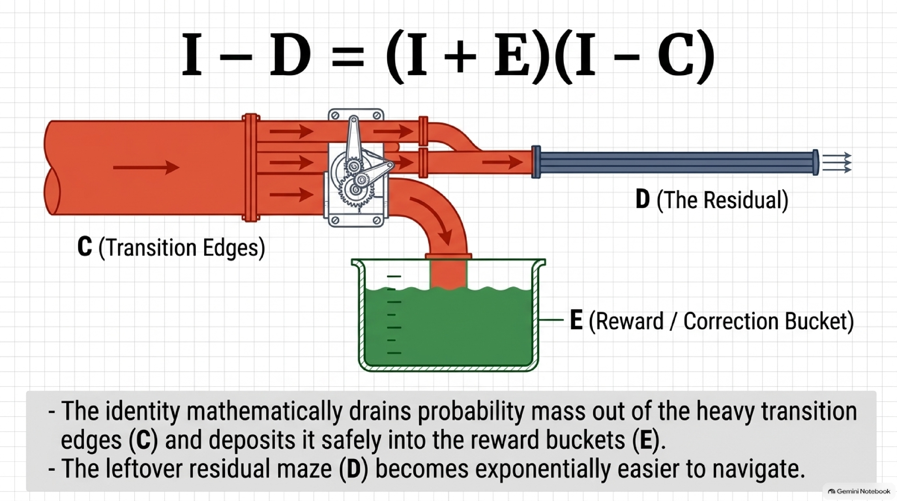


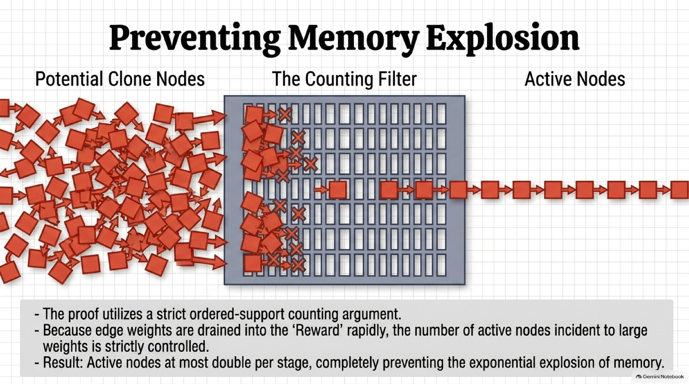

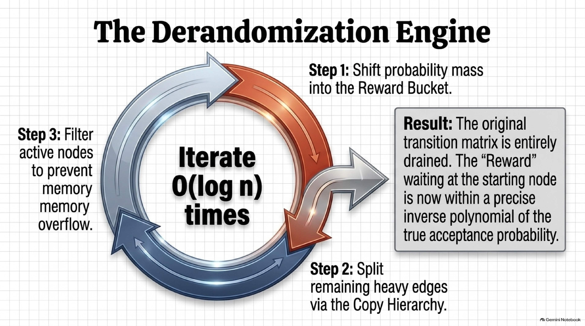

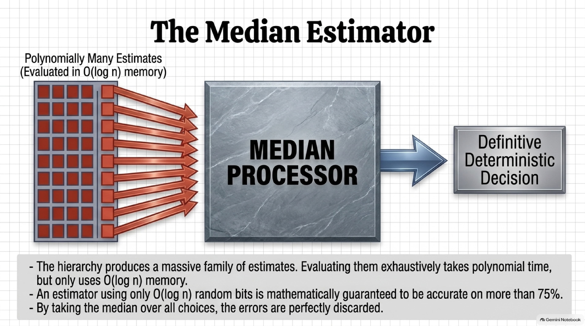


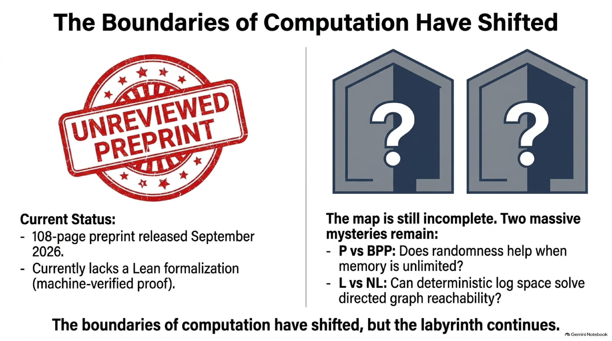

</details>

See [`assets/README.md`](assets/README.md) for the full inventory and the file-by-file [errata](assets/README.md#errata).

---

## How this explainer was made

1. The paper's PDF and its TeX source (`build/sections/*.tex`) were downloaded from [openai/math](https://github.com/openai/math/tree/main/preprints), together with the family entry in `CONTENTS.md`, `overview.tex`, the README and `lean/formalization.yaml`. There is no `lean/docs/103.md` and no reasoning summary for this family.
2. The paper and the Wikipedia article on [BPL](https://en.wikipedia.org/wiki/BPL_(complexity)) were loaded into a NotebookLM notebook through the [`notebooklm-mcp-cli`](https://github.com/jacob-bd/gemini-notebook-mcp-cli) CLI. That notebook generated the slides, infographics, report, mind map and audio in [`assets/notebooklm/`](assets/notebooklm/), using prompts written as plain statements of the paper's results. The report and the mind map were restricted to the paper. Every slide, both infographics, the report and the mind map were then read against the paper, and the problems are listed in the [errata](assets/README.md#errata). The deck was not revised, because the shared NotebookLM quota was too low at review time.
3. The text on this page was written by hand (with AI assistance) from the paper's TeX source: the introduction, Sections 2–4, the section openings of 5–11, and Sections 12–13. Historical claims not in the paper were checked against Wikipedia (BPL, RL, SL, L, Savitch's theorem), the introduction of Hoza's 2021 paper (ECCC TR21-048), the Pyne–Raz–Zhan abstract (arXiv:2303.16413) and the Klivans–van Melkebeek abstract (Crossref). The description of Nisan's generator is the standard textbook one and is marked as such. A separate fact-check pass against the TeX source then tightened the wording in about two dozen places. NotebookLM's outputs were used as visual and structural aids rather than as the source of truth.
4. The worked example (all four computations of $7/16$) and the toy run of the hierarchy were computed by small scripts in exact rational arithmetic. The two figures were drawn as SVG by scripts that use those computed numbers.

See [`PIPELINE.md`](../../PIPELINE.md) for the exact, repeatable steps.

*Citation for the underlying paper:*

```bibtex
@misc{OAI:Exact-Derandomization-of-Logarithmic-Space-L-equals-RL-equals-BPL-September-23-2026,
  author = {{OpenAI}},
  title = {{Exact Derandomization of Logarithmic Space:
            $\mathsf{L}=\mathsf{RL}=\mathsf{BPL}$}},
  howpublished = {OpenAI Math Release preprint
                  \href{https://github.com/openai/math/blob/main/preprints/Exact-Derandomization-of-Logarithmic-Space-L-equals-RL-equals-BPL-September-23-2026/paper.pdf}{OAI:Exact-Derandomization-of-Logarithmic-Space-L-equals-RL-equals-BPL-September-23-2026}},
  year = {2026}
}
```
