# Goldfeld's conjecture for quadratic twists, explained for beginners

> - **Paper:** [*Goldfeld's analytic density conjecture and the 2-converse for elliptic curves*](https://github.com/openai/math/blob/main/preprints/Goldfelds-analytic-density-conjecture-and-the-2-converse-for-elliptic-curves-September-23-2026/paper.pdf), OpenAI, 23 September 2026 (130 pages)
> - **openai/math family:** 006, *Goldfeld's conjecture: densities and mean analytic rank* · **Field:** number theory (elliptic curves and arithmetic statistics)
> - **Companion:** [*The mean analytic rank of quadratic twists of elliptic curves*](https://github.com/openai/math/blob/main/preprints/The-mean-analytic-rank-of-quadratic-twists-of-elliptic-curves-September-23-2026/paper.pdf), OpenAI, 23 September 2026 (41 pages)
> - **Related explainer in this repository:** [family 002, the exact Birch–Swinnerton-Dyer formula from low Selmer corank](../Exact-Birch-Swinnerton-Dyer-Formula-from-Low-Selmer-Corank-October-3-2026/README.md), which uses this paper as an input
> - **Formal proof:** none. openai/math has no Lean formalization for family 006 (no `lean/docs/006.md`, and no entry in `lean/formalization.yaml`)
> - **Who this is for:** readers who have met elliptic curves, their rank and their $L$-function, for example through sections 1.1–1.5 of the [BSD explainer](../Exact-Birch-Swinnerton-Dyer-Formula-from-Low-Selmer-Corank-October-3-2026/README.md#1-the-problem). Level 3 of section 5 is an optional part for readers who know some algebraic number theory.

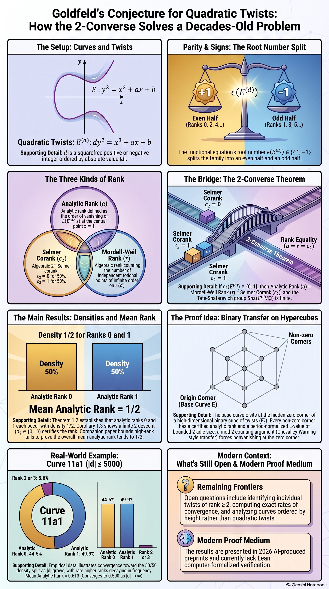

*AI-generated overview. The big picture is right, but several formulas and labels in the "Parity" and "Three Kinds of Rank" panels are garbled, "Mean Analytic Rank = 1/2" is a limit, and the 11a1 numbers are this explainer's own computation. See the [errata](assets/README.md#errata).*

## Contents

- [TL;DR](#tldr)
- [How to read this](#how-to-read-this)
- [1. The problem](#1-the-problem)
- [2. A short history](#2-a-short-history)
- [3. What the papers prove](#3-what-the-papers-prove)
- [4. Why it matters](#4-why-it-matters)
- [5. The main idea of the proof](#5-the-main-idea-of-the-proof)
- [6. The people whose ideas this builds on](#6-the-people-whose-ideas-this-builds-on)
- [7. What it does not prove, and caveats](#7-what-it-does-not-prove-and-caveats)
- [8. Glossary](#8-glossary)
- [9. Slides, audio and other assets](#9-slides-audio-and-other-assets)
- [How this explainer was made](#how-this-explainer-was-made)

---

## TL;DR

- **The question.** Fix one elliptic curve $E$, such as $y^2 = x^3 + ax + b$. For each squarefree integer $d$, positive or negative, its **quadratic twist** is $E^{(d)}: dy^2 = x^3 + ax + b$. A sign called the **root number** decides whether the analytic rank of a twist (the order of vanishing of its $L$-function at $`s = 1`$) is even or odd, and the two signs each occur half the time. In 1979 Dorian Goldfeld conjectured that the analytic rank is **1/2 on average**. That is the smallest average the signs allow: it says that almost every twist has analytic rank 0 or 1, and each value occurs half the time.
- **What was known.** Without extra hypotheses, positive proportions of rank 0 and rank 1 were known only for special families of curves. Assuming the Generalized Riemann Hypothesis, the average was known to be at most $3.25$ (Goldfeld, 1979) and then at most $3/2$ (Heath-Brown, 2004). On the algebraic side, Alexander Smith proved in 2025 that, for every curve over $\mathbb{Q}$, half of the twists have $2^\infty$-Selmer corank 0 and half have corank 1. That gave Goldfeld's density conjecture only *assuming* the Birch–Swinnerton-Dyer conjecture.
- **What the papers prove.** The principal paper proves a **2-converse**: if the $2^\infty$-Selmer corank of a curve is 0 or 1, then its analytic rank and its Mordell–Weil rank equal that corank, and its Tate–Shafarevich group is finite. Combined with Smith's theorem, this proves **Goldfeld's density conjecture for every elliptic curve over $`\mathbb{Q}`$**: analytic ranks 0 and 1 each have density $1/2$. The companion proves that rare twists of large rank do not spoil the average, so the **mean analytic rank tends to $`1/2`$**. Twists are counted by signed squarefree $d$ ordered by $\lvert d\rvert$.
- **Why that's a big deal.** No assumption such as BSD or the Riemann hypothesis is needed. For 100% of the twists of every curve, the analytic rank equals the actual rank and Ш is finite. A single finite 2-descent can now certify an analytic rank of 0 or 1. Family 002 builds on these results.
- **What it doesn't do.** It says nothing about individual twists of rank 2 or more, gives no rate of convergence, and does not prove BSD. It also says nothing about elliptic curves ordered by size rather than by twist. The density theorem, and through it the mean theorem, uses Smith's 2025 arXiv preprint as a black box, and neither paper has a Lean formalization.

## How to read this

| You have… | Read |
|---|---|
| 2 minutes | The TL;DR and the infographic above |
| 15 minutes | Sections 1, 3, 4 and 7 |
| An hour, and you like number theory | Everything, including [section 5](#5-the-main-idea-of-the-proof) and the [worked example](#a-worked-example-the-twists-of-11a1) |

---

## 1. The problem

### 1.1 What you need from the BSD explainer

This page builds on the [BSD explainer](../Exact-Birch-Swinnerton-Dyer-Formula-from-Low-Selmer-Corank-October-3-2026/README.md#1-the-problem) and uses the same notation:

- $E(\mathbb{Q})$ is the group of rational points. Its **rank** $r(E)$ counts independent points of infinite order.
- $L(E,s)$ is the $L$-function built from the point counts modulo primes. By modularity it is defined for all $s$, and its centre is $s = 1$.
- The **analytic rank** $a(E)$ is the order of vanishing of $L(E,s)$ at $s = 1$. The rank part of BSD says $a(E) = r(E)$.
- The $2^\infty$-**Selmer corank** is an upper bound for the rank, defined through 2-descent-type algebra (all the $2^n$-Selmer groups at once), that also sees the 2-part of the Tate–Shafarevich group Ш. The paper writes it as $c_2(E)$; the BSD explainer wrote $s_2(E)$. Lemma 2.1 records

```math
c_2(E) = r(E) + \mathrm{corank}\ \mathrm{Sha}(E/\mathbb{Q})[2^\infty] \ \ge\ r(E).
```

- **Gross–Zagier–Kolyvagin** (1986, 1988–1990, for every curve once modularity is known): if $a(E) \le 1$, then $r(E) = a(E)$, Ш is finite, and $c_2(E) = a(E)$. The *converse* direction, from small Selmer corank to small analytic rank, is the hard one.

### 1.2 Quadratic twists

Take an elliptic curve $E: y^2 = x^3 + ax + b$ and a nonzero squarefree integer $d$. The **quadratic twist** of $E$ by $d$ is

```math
E^{(d)}:\ d\,y^2 = x^3 + ax + b \qquad\text{or equivalently}\qquad y^2 = x^3 + ad^2x + bd^3 .
```

The two curves become the same over the field $\mathbb{Q}(\sqrt d)$ (substitute $`y \mapsto y/\sqrt d`$), but over $\mathbb{Q}$ they can be very different. Three facts make twists a natural family. They are standard, and the third is checked numerically in the worked example:

- **Point counts flip sign.** For a prime $p$ that does not divide $2dN$, where $N$ is the conductor of $E$, the count $`a_p = p + 1 - N_p`$ of the twist is $\left(\frac{d}{p}\right) a_p(E)$. The symbol $\left(\frac{d}{p}\right) = \pm 1$ records whether $d$ is a square mod $p$. So $L(E^{(d)},s)$ is $L(E,s)$ twisted by a quadratic character.
- **Ranks add up over $`\mathbb{Q}(\sqrt d)`$.** A point of $E$ over $\mathbb{Q}(\sqrt d)$ splits into a part fixed by $\sqrt d \mapsto -\sqrt d$ (a point of $`E`$) and a part negated by it (a point of $`E^{(d)}`$). So the rank of $E$ over $\mathbb{Q}(\sqrt d)$ is $r(E) + r(E^{(d)})$. This is why Goldfeld's 1979 paper is titled *Conjectures on elliptic curves over quadratic fields*. The paper proves the Selmer version of this identity in Lemma 2.2.
- **The conductor grows like $`d^2`$.** For our test curve of conductor 11, the twist by $d = 5$ has conductor $275 = 11 \cdot 5^2$, and the twist by $d = -1$ has conductor $176 = 11 \cdot 4^2$. Bigger conductors mean longer $L$-function computations.

Twisting by $d$ and by $dm^2$ gives the same curve, so it is enough to use squarefree $d$. The papers count both signs together:

```math
\mathcal{D}(X) = \lbrace d \in \mathbb{Z} : 0 < \lvert d\rvert \le X,\ d \text{ squarefree} \rbrace, \qquad \#\mathcal{D}(X) \sim \frac{2X}{\zeta(2)} = \frac{12}{\pi^2}X .
```

The asymptotic count is from the proof of Lemma 14.1 of the paper. For $X = 2000$ it predicts $2431.7$, and the true count is $2430$.

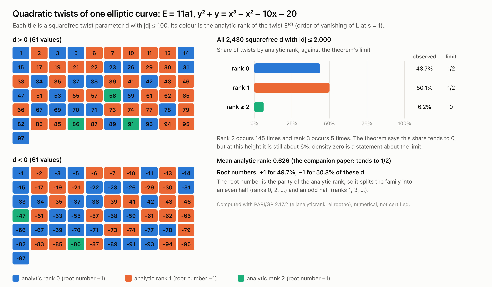

*Computed for this explainer with PARI/GP: every quadratic twist of one curve with twist parameter $`\lvert d\rvert \le 100`$, coloured by analytic rank, and the shares of each rank up to $`\lvert d\rvert \le 2000`$. See the [worked example](#a-worked-example-the-twists-of-11a1).*

### 1.3 The root number and parity

The completed $L$-function satisfies a functional equation that relates $s$ to $2 - s$, with a sign $\varepsilon(E) = \pm 1$ called the **root number**. If $\varepsilon(E) = -1$, then the equation forces $L(E,1) = -L(E,1)$, so $L(E,1) = 0$. In general the parity of the analytic rank is fixed by the sign:

```math
(-1)^{a(E)} = \varepsilon(E).
```

For twists the sign is easy to compute. For a twist parameter $h$ that is an odd fundamental discriminant prime to $2N$, the paper records (Section 2, citing Radziwiłł–Soundararajan)

```math
\varepsilon\bigl(E^{(h)}\bigr) = \varepsilon(E)\,\chi_h(-N),
```

where $\chi_h$ is the quadratic character of $\mathbb{Q}(\sqrt h)$. Goldfeld's 1979 paper writes the same sign as $w\chi(-N)$. As $h$ varies, $\chi_h(-N)$ is $+1$ about half the time and $-1$ about half the time. A congruence class can fix the sign. For the congruent-number curves $y^2 = x^3 - D^2x$, for instance, Heath-Brown's 1993 paper quotes Birch and Stephens: $\varepsilon_D = +1$ for $D \equiv 1, 2, 3 \pmod 8$ and $\varepsilon_D = -1$ for $D \equiv 5, 6, 7 \pmod 8$. Over the whole family $\mathcal{D}(X)$, the two signs are balanced.

Parity also holds on the algebraic side, unconditionally. By Monsky (1996), and Dokchitser–Dokchitser in general (Lemma 2.2 of the paper),

```math
(-1)^{c_2(E)} = \varepsilon(E).
```

So the root number tells you that the Selmer corank and the analytic rank are both even, or both odd. It does not tell you which even or odd value they take.

### 1.4 Goldfeld's conjecture

Goldfeld's paper (*Number Theory, Carbondale 1979*, Lecture Notes in Mathematics 751, pp. 108–118) lets $m_\chi$ be the order of the zero at $s = 1$ of the twisted $L$-function, for $\chi$ the character of a quadratic field of discriminant $D$. On page 113 he states:

> **Conjecture (B).** $`\displaystyle\sum_{\lvert D\rvert \le X} m_\chi \sim \frac12 \sum_{\lvert D\rvert \le X} 1.`$

On the next page he records the easy half, Proposition (1): the sum is at least about $\tfrac12$ of the count, because about half the discriminants have sign $-1$ and so a forced zero. His Proposition (2) shows, *assuming the Riemann hypothesis* for these $L$-functions, that the sum is at most $(3.25 + \varepsilon)$ times the count. The example he works out in the paper, for a companion conjecture about the average size of Ш, is the curve of conductor 11. That is the curve used in the [worked example](#a-worked-example-the-twists-of-11a1) below.

There are two forms of the conjecture:

- **The density form.** Analytic rank 0 occurs for half the twists and analytic rank 1 for the other half. Equivalently, twists of analytic rank 2 or more have density zero.
- **The mean form.** The average analytic rank tends to $1/2$.

The mean form is the stronger one. Since half the twists have odd rank, an average of $1/2$ leaves no room for a positive proportion of ranks 2 or more. (This is the explainer's own one-line deduction, using that the two signs are balanced.) The converse fails. A set of density zero can still have a large total rank: if a tiny fraction of twists had enormous ranks, the densities would be right but the mean would be wrong. As the companion paper puts it, "knowing the densities of ranks zero and one does not determine the mean without control of this contribution."

### 1.5 Three meanings of "rank", and the minimalist picture

The expectation that ranks in a family are as small as parity allows is often called the **minimalist conjecture**. Ellenberg and Landesman (arXiv, 2023) use the term for Selmer ranks in twist families over function fields, and Ellenberg's 2026 survey of Cohen–Lenstra heuristics (arXiv:2606.06024) describes Smith's theorems as "leading to a resolution of the minimalist conjecture for elliptic curves". The expectation can be asked about three different numbers, and keeping them apart is the key to this paper:

| Rank | What it measures | Twist-family statement | Status before family 006 |
|---|---|---|---|
| **Selmer corank** $c_2$ | Algebra: a finite-descent-type upper bound | Corank 0 for half, 1 for half | **Proved** by Smith (2025 preprint) for every curve over $\mathbb{Q}$ |
| **Mordell–Weil rank** $r$ | Actual rational points | Rank 0 for half, 1 for half | Known only in parts. Since $r \le c_2$, Smith's theorem gives $r \le 1$ for 100% and $r = 0$ for at least 50% (the explainer's deduction) |
| **Analytic rank** $a$ | Analysis: order of vanishing of $L$ | Goldfeld's conjecture | Positive proportions known only for special families; the full densities only for some CM families (such as the congruent-number curves, by Kriz's preprint with Smith's work), or assuming BSD |

Smith's 2025 paper is titled *The Birch and Swinnerton-Dyer conjecture implies Goldfeld's conjecture*. Its corollary needs BSD exactly to cross from the first row to the third. The **2-converse** of this paper is an unconditional bridge between the first and third rows, at least when the corank is 0 or 1. Once a twist has $c_2 \in \lbrace 0, 1\rbrace$, the converse gives $a = r = c_2$, so all three rows agree on that twist.

A different family is "all elliptic curves, ordered by the size of their coefficients". It has its own minimalist prediction and its own results, such as the theorem of Bhargava and Shankar that the average rank is bounded. Family 006 is about quadratic twists of one fixed curve only.

### 1.6 Why Selmer groups alone were not enough

The obvious computable tool is the 2-Selmer group, from a single 2-descent. Its statistics in twist families were worked out long before Smith:

- **Heath-Brown (1993, 1994)** studied the congruent-number curves $y^2 = x^3 - D^2x$ and wrote $`\#\mathrm{Sel}_2 = 2^{2 + s(D)}`$. The first paper proves that the average of $2^{s(D)}$ is 3 (over odd squarefree $D$ in a fixed class mod 8). The second computes every moment, the average of $2^{k s(D)}$ being $\prod_{j=1}^k (1 + 2^j)$, and deduces the full distribution of $s(D)$.
- **Swinnerton-Dyer (2008)** found the same kind of distribution for twists of a curve with full rational 2-torsion, "subject to a mild additional condition" (his abstract). He used an "unusual notion of asymptotic density", in Kane's words: he let the number of prime factors of $d$ tend to infinity.
- **Kane (2013)** proved the same distribution with the natural density, ordering $d$ by size.
- **Poonen and Rains (2012)** explained these distributions with a random model: the 2-Selmer group is the intersection of two maximal isotropic subspaces of a quadratic space over $\mathbb{F}_2$, and modelling one of them as random reproduces the observed statistics. **Bhargava, Kane, Lenstra, Poonen and Rains (2015)** extended it to a model for the whole sequence linking $E(\mathbb{Q})$, the $p^\infty$-Selmer group and $`\mathrm{Sha}[p^\infty]`$, as $E$ ranges over all elliptic curves over a global field. Smith's 2025 abstract notes that, in the twist families whose 2-Selmer distribution was not known before, the distribution he finds differs from the Poonen–Rains model.

For curves with full rational 2-torsion (and no rational cyclic subgroup of order 4), the limiting distribution in Kane's Theorem 2 gives these proportions for $s$ = (dimension of the 2-Selmer group) − 2. The numbers were computed here from his formula:

| $s$ | 0 | 1 | 2 | 3 | 4 |
|---|---|---|---|---|---|
| share of twists | 20.97% | 41.94% | 27.96% | 7.99% | 1.07% |

Only about 63% of twists have $s \le 1$. The 2-Selmer group therefore over-counts the rank for over a third of the family. The excess comes from 2-torsion in Ш, which a single 2-descent cannot see past. This is why the 2-Selmer distribution bounds the average rank but cannot prove Goldfeld's conjecture.

**Smith's idea** was to look at the whole tower of $2^n$-Selmer groups at once, the $2^\infty$-Selmer group, whose corank strips away the finite part of Ш. In 2017 he determined its distribution for curves with full rational 2-torsion and no rational cyclic subgroup of order 4. His 2022 papers treated further residual cases. His 2025 preprint covers every curve over $\mathbb{Q}$: corank 0 for 50% of twists and corank 1 for 50%.

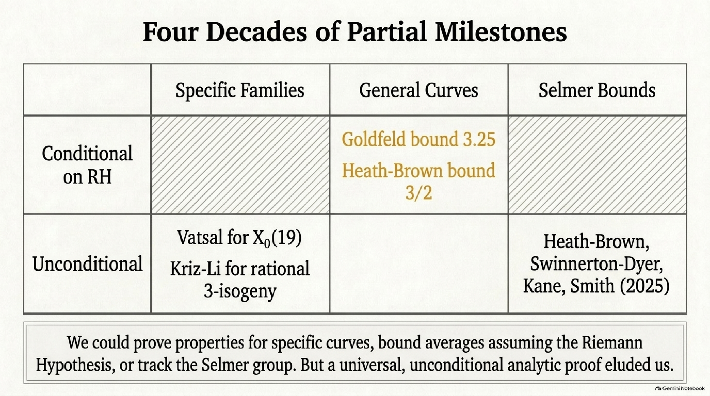

*AI-generated slide. The "Unconditional, specific families" cell means positive proportions, not the full densities.*

---

## 2. A short history

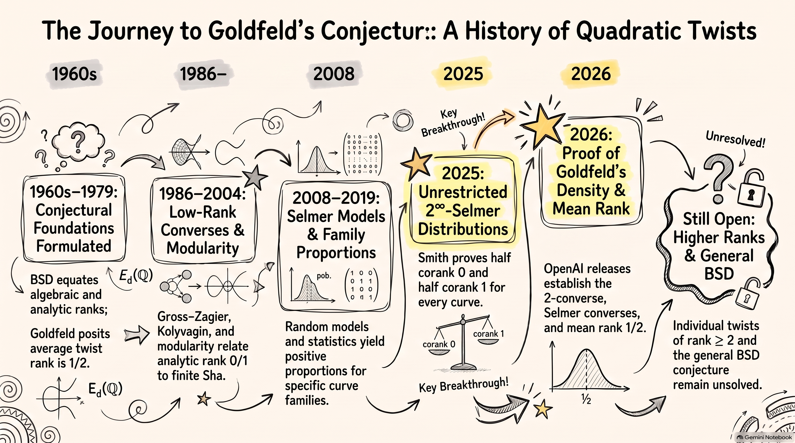

*AI-generated timeline in five eras. The 1986–2004 box mislabels Gross–Zagier–Kolyvagin as "converses" (they proved the forward direction), the 2008–2019 box mixes Selmer models with positive proportions, the bell curve is misleading, and "establish" overstates unrefereed preprints. See the [errata](assets/README.md#errata). The table below is the checked version.*

| When | Who | What happened |
|---|---|---|
| Early 1960s (papers 1963, 1965) | **Bryan Birch, Peter Swinnerton-Dyer** | Computations compare rational points with $L$-values; the conjecture that rank equals analytic rank |
| 1966 | **John Tate** | Places the rank prediction and the leading-term formula in the arithmetic of abelian varieties (Séminaire Bourbaki) |
| 1979 | **Dorian Goldfeld** | Conjecture (B): the average analytic rank of quadratic twists is $1/2$. Proves at least $1/2$ from the signs, and at most $3.25$ assuming the Riemann hypothesis for the twists |
| 1986; 1988–1990 | **Benedict Gross, Don Zagier; Victor Kolyvagin** | Analytic rank 0 or 1 implies rank 0 or 1 and finite Ш (the forward direction) |
| 1990, 1991 | **Daniel Bump, Solomon Friedberg, Jeffrey Hoffstein; Ram Murty, Kumar Murty** | Auxiliary twists with nonzero $L(E^{(d)},1)$ or $L'(E^{(d)},1)$, the input that Heegner-point arguments need |
| 1993, 1994 | **Roger Heath-Brown** | Average size, then the full distribution, of 2-Selmer groups in the congruent-number family |
| 1996 | **Paul Monsky** | The parity of the 2-Selmer rank matches the root number |
| 1998 | **Kevin James; Vinayak Vatsal; Ken Ono, Christopher Skinner** | Positive proportions of rank 0 for particular curves; both rank 0 and rank 1 for $X_0(19)$; a lower bound of order $X/\log X$ for the number of nonvanishing twists |
| 2001 | **Christophe Breuil, Brian Conrad, Fred Diamond, Richard Taylor** | Modularity of every elliptic curve over $\mathbb{Q}$, so every twist has an $L$-function with a functional equation |
| 2004 | **Roger Heath-Brown** | Assuming the Riemann hypothesis for the twists, the average analytic rank of twists is at most $3/2$, improving Goldfeld's bound |
| 2004 | **Kazuya Kato** | Zeta elements (Beilinson–Kato classes) linked to $L$-values; used here for analytic rank 0 |
| 2008 | **Peter Swinnerton-Dyer** | 2-Selmer distribution for twists of curves with full 2-torsion, in an unusual density |
| 2010 | **Tim and Vladimir Dokchitser** | The $p$-parity theorem: Selmer corank parity matches the root number |
| 2010 (arXiv) | **Manjul Bhargava, Arul Shankar** | A different family: all curves ordered by height have average 2-Selmer size 3 and average rank at most 1.5 |
| 2012; 2015 (2013 arXiv) | **Bjorn Poonen, Eric Rains; Manjul Bhargava, Daniel Kane, Hendrik Lenstra, Poonen, Rains** | Random models for Selmer groups, consistent with the Heath-Brown, Swinnerton-Dyer and Kane distributions; the second also models ranks and Ш |
| 2013 | **Daniel Kane** | Swinnerton-Dyer's distribution with the natural density |
| 2014–2017 | **Ye Tian; Tian, Xinyi Yuan, Shou-Wu Zhang; Alexander Smith** | Congruent numbers: Heegner-point results, then a positive density of congruent numbers (Smith's 2016 preprint) |
| 2016 (2014 arXiv) | **Daniel Fiorilli** | Average rank exactly $1/2$ in twist families, under a hypothesis slightly stronger than the Riemann hypothesis |
| 2017 (arXiv) | **Alexander Smith** | $2^\infty$-Selmer distribution for curves with full 2-torsion and no cyclic 4-subgroup; rank at least 2 for $o(N)$ twists |
| 2019 | **Daniel Kriz, Chao Li** | Positive proportions of both ranks for every curve with a rational 3-isogeny |
| 2020 (arXiv) | **Daniel Kriz** | A converse theorem for certain CM curves; Goldfeld's conjecture for the congruent-number family, combined with Smith's work |
| 2022 (arXiv) | **Alexander Smith** | $\ell^\infty$-Selmer groups in twist families, parts I and II |
| 2025 (arXiv) | **Alexander Smith** | Every curve over $\mathbb{Q}$: $2^\infty$-Selmer corank 0 for 50% of twists and 1 for 50%. Hence BSD implies Goldfeld's conjecture |
| 2026 | **Peter Koymans, Alexander Smith** | Exponential moment bounds for Mordell–Weil ranks in twist families (arXiv, June 2026) |
| 23 Sep 2026 | **OpenAI** (internal model), family 006 | **These papers:** the 2-converse, Goldfeld's density conjecture, and mean analytic rank $1/2$ |
| 24 Sep and 3 Oct 2026 | **OpenAI** (internal model), family 002 | The Selmer converse at every prime, and the exact BSD formula in Selmer corank 0 or 1, both using family 006 |

*Sources.* The entries come from the introductions of the two papers, except the following, which were checked against the original documents for this explainer: Goldfeld 1979 (the scanned paper, pp. 112–114), Heath-Brown 1993/1994 (their introductions), Swinnerton-Dyer 2008 (its published abstract) and Kane 2013 (Kane's abstract and introduction), Heath-Brown 2004, Bhargava–Shankar 2010, Poonen–Rains 2012, Bhargava–Kane–Lenstra–Poonen–Rains 2015, Fiorilli 2014, Smith 2017/2022/2025, Kriz 2020 and Koymans–Smith 2026 (their arXiv abstracts). The dates of Birch–Swinnerton-Dyer's papers are from the [BSD explainer](../Exact-Birch-Swinnerton-Dyer-Formula-from-Low-Selmer-Corank-October-3-2026/README.md#2-a-short-history).

---

## 3. What the papers prove

Write $a(E)$ for the analytic rank, $r(E)$ for the Mordell–Weil rank, and $c_2(E)$ for the $2^\infty$-Selmer corank (with the usual local conditions at every place).

> **Theorem 1.1 (the 2-converse).** For every elliptic curve $E/\mathbb{Q}$ with $c_2(E) \in \lbrace 0, 1\rbrace$,
>
> ```math
> a(E) = r(E) = c_2(E), \qquad \mathrm{Sha}(E/\mathbb{Q}) \text{ is finite.}
> ```
>
> There is no restriction on reduction type, complex multiplication, rational torsion or rational isogenies.

> **Theorem 1.2 (Goldfeld's analytic density conjecture).** For every elliptic curve $E/\mathbb{Q}$ and each $j \in \lbrace 0, 1\rbrace$,
>
> ```math
> \lim_{X\to\infty} \frac{\#\lbrace d \in \mathcal{D}(X) : a(E^{(d)}) = j\rbrace}{\#\mathcal{D}(X)} = \frac12 .
> ```
>
> So the twists of analytic rank at least 2 have density zero. For a density-one set of $d$, the analytic and Mordell–Weil ranks of $E^{(d)}$ agree and its whole Tate–Shafarevich group is finite.

> **Corollary 1.3 (a finite Selmer criterion).** Put $`d_2(E) = \dim_{\mathbb{F}_2}\mathrm{Sel}_2(E/\mathbb{Q}) - \dim_{\mathbb{F}_2}E(\mathbb{Q})[2]`$. If $d_2(E) \in \lbrace 0, 1\rbrace$, then $`a(E) = r(E) = c_2(E) = d_2(E)`$, Ш is finite, and its 2-primary part is zero.

The companion paper adds:

> **Companion, Theorem 1.1 (mean analytic rank).** For every elliptic curve $E/\mathbb{Q}$,
>
> ```math
> \lim_{Y\to\infty} \frac{1}{\#\mathcal{D}(Y)} \sum_{d \in \mathcal{D}(Y)} a(E^{(d)}) = \frac12 .
> ```
>
> **Companion, Theorem 1.2 (the tail).** There are constants $C_E > 0$ and $R_E \ge 1$ such that for every integer $R \ge R_E$, the twists of rank above $R$ carry a total rank of at most $C_E/R$ per unit of height:
>
> ```math
> \limsup_{Y\to\infty} \frac1Y \sum_{\substack{d\in\mathcal{D}(Y)\\ a(E^{(d)})>R}} a(E^{(d)}) \le \frac{C_E}{R}.
> ```
>
> **Companion, Corollary 1.3 (algebraic-rank moments).** For every fixed real $t$ and fixed integer $m \ge 1$, the averages of $`e^{t\,r(E^{(d)})}`$ and of $r(E^{(d)})^m$ over $\mathcal{D}(Y)$ tend to $(1+e^t)/2$ and to $1/2$.

**In plain words.**

- *Theorem 1.1* is a statement about **one curve at a time**. If the $2^\infty$-Selmer group (descent-type algebra, all powers of 2 at once) leaves room for at most one independent rational point, then the $L$-function vanishes to exactly that order, the point really exists (when the corank is 1), and Ш is finite.
- *Theorem 1.2* is a statement about **a whole family**. Take any curve and list its twists by $\lvert d\rvert$. In the limit, half have analytic rank 0, half have analytic rank 1, and the rest are a vanishing fraction. The proof is short given Theorem 1.1. Smith's theorem says that half the twists have $c_2 = 0$ and half have $c_2 = 1$, and Theorem 1.1 converts each of these into the same analytic rank. As the paper says, "the main work of this paper is the pointwise converse."
- *Corollary 1.3* is a practical consequence. A single 2-descent is a finite computation, which PARI/GP does with `ellrank`. If it shows $d_2(E) \le 1$, you now know the analytic rank, the rank, and that $`\mathrm{Sha}[2^\infty] = 0`$. The proof uses the alternating Cassels–Tate pairing to show $`d_2(E) - c_2(E)`$ is even (Lemma 2.4).
- *The companion* handles the mean. The density theorem says the high-rank twists are a vanishing fraction. The tail theorem says their **total** rank is also a vanishing fraction, so they cannot pull the average away from $1/2$. Its proof is analytic and independent of the density theorem, which it uses only in the last step.

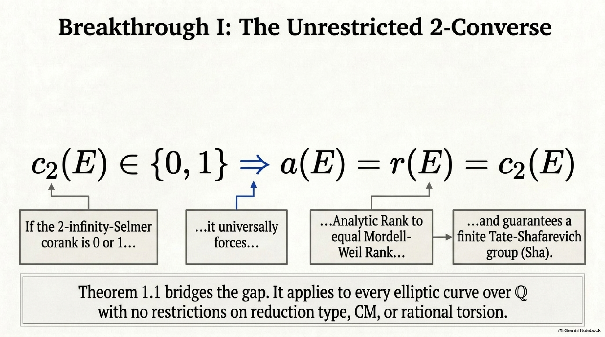

*AI-generated slide; it states Theorem 1.1 correctly.*

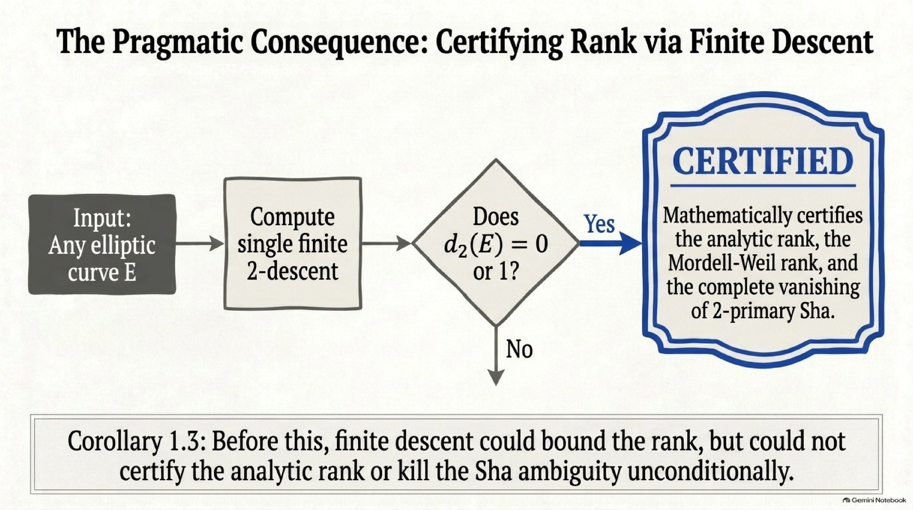

*AI-generated slide for Corollary 1.3. The classical Cassels–Tate argument (Lemma 2.4) already gave $`c_2 = d_2`$ when $`d_2 \le 1`$; what is new is the analytic rank and the finiteness of the whole of Ш.*

---

## 4. Why it matters

| Consequence | Before | After |
|---|---|---|
| **Goldfeld's density conjecture** | Positive proportions of ranks 0 and 1 for special families (for example $X_0(19)$ and curves with a rational 3-isogeny); the full densities only for some CM families such as the congruent-number curves (Kriz's preprint with Smith's work), or for every curve assuming BSD (Smith 2025) | Proved for **every** elliptic curve over $\mathbb{Q}$ (Theorem 1.2) |
| **Mean analytic rank** of twists | At most $3.25$ (Goldfeld) and then $3/2$ (Heath-Brown) assuming the Riemann hypothesis; exactly $1/2$ under a stronger hypothesis (Fiorilli) | Exactly $1/2$, unconditionally. The companion "invokes neither the Birch–Swinnerton-Dyer conjecture nor the generalized Riemann hypothesis" |
| **The rank part of BSD in twist families** | Rank = analytic rank was known whenever the analytic rank is at most 1, but a positive share of such twists was known only in special families | For 100% of the twists of every curve, rank = analytic rank $\in \lbrace 0, 1\rbrace$ and Ш is finite |
| **Certifying analytic rank by algebra** | A 2-descent bounds the rank but says nothing about $L(E,s)$ | If $d_2(E) \in \lbrace 0, 1\rbrace$, a finite 2-descent certifies $a(E) = r(E) = d_2(E)$ and $`\mathrm{Sha}[2^\infty] = 0`$ (Corollary 1.3) |
| **Algebraic-rank moments** | Bounded average rank in twist families (Smith 2022) and exponential moment bounds (Koymans–Smith 2026) | Every fixed moment of the Mordell–Weil rank of twists tends to $1/2$ (companion, Corollary 1.3) |
| **Family 002** (the Selmer converse at every prime and the exact BSD formula) | — | The Selmer converse at every prime "uses the 2-converse and analytic twist densities established here", and the exact BSD formula of family 002 picks its auxiliary twists using Theorem 1.2. Full BSD then holds for a density-one set of twists of every curve (see the [family 002 explainer](../Exact-Birch-Swinnerton-Dyer-Formula-from-Low-Selmer-Corank-October-3-2026/README.md#4-why-it-matters)) |

The paper also singles out two pieces of its method that "have uses beyond this assembly": an **interpolation algebra** that clears denominators through a bounded complex, "so the required congruence precision is independent of the number of new primes", and a **graph construction** that treats coefficient tests as polynomials in residue symbols and "makes separately nonzero tests nonzero together".

---

## 5. The main idea of the proof

The principal paper is 130 pages, and almost all of it proves Theorem 1.1. The deduction of Theorem 1.2 takes one page (Section 14). The companion is 41 pages of analytic number theory. Here is the argument at three zoom levels.

### Level 1: the one-paragraph version

Smith sorted the twists into two boxes by an **algebraic** measurement: Selmer corank 0 or 1, half in each. Goldfeld asked about an **analytic** measurement: how fast the $L$-function vanishes. The 2-converse guarantees that whenever the algebra says 0 or 1, the analysis says the same. To prove that guarantee for one curve $E$, the paper hides $E$ at one corner of a huge cube of its own twists. It arranges that at **every other corner** the $L$-value is known to be nonzero and not too divisible by 2. Then it uses a rigid algebraic link between the corners, a power series attached to each corner and a counting argument mod 2 (the Chevalley–Warning theorem), to show that the hidden corner cannot be zero either.

> **Analogy:** a sealed room in a building where every other room has its lights on. The wiring is built so that, with enough rooms, some lit room must show exactly the same reading as the sealed one to many decimal places. Since every lit room's reading is safely away from zero, so is the sealed room's.

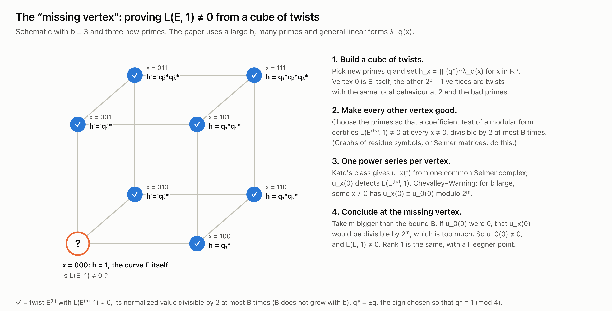

### Level 2: the step-by-step picture

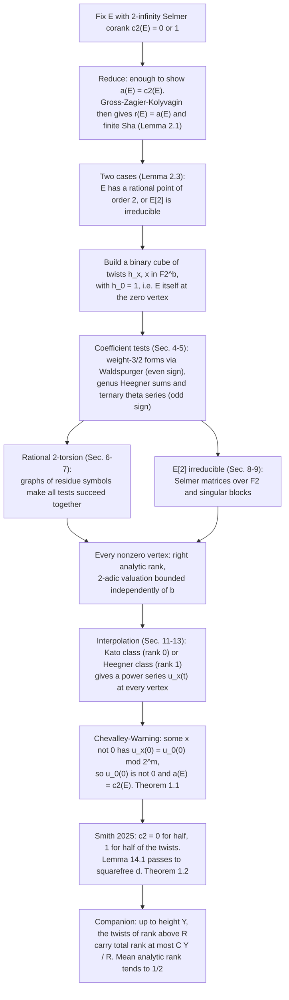
```mermaid
flowchart TD
    A["Fix E with 2-infinity Selmer corank c2(E) = 0 or 1"] --> B["Reduce: enough to show a(E) = c2(E).<br/>Gross-Zagier-Kolyvagin then gives r(E) = a(E) and finite Sha (Lemma 2.1)"]
    B --> C["Two cases (Lemma 2.3):<br/>E has a rational point of order 2, or E[2] is irreducible"]
    C --> D["Build a binary cube of twists h_x, x in F2^b,<br/>with h_0 = 1, i.e. E itself at the zero vertex"]
    D --> E["Coefficient tests (Sec. 4-5): weight-3/2 forms via Waldspurger (even sign),<br/>genus Heegner sums and ternary theta series (odd sign)"]
    E --> F1["Rational 2-torsion (Sec. 6-7):<br/>graphs of residue symbols make all tests succeed together"]
    E --> F2["E[2] irreducible (Sec. 8-9):<br/>Selmer matrices over F2 and singular blocks"]
    F1 --> G["Every nonzero vertex: right analytic rank,<br/>2-adic valuation bounded independently of b"]
    F2 --> G
    G --> H["Interpolation (Sec. 11-13): Kato class (rank 0) or Heegner class (rank 1)<br/>gives a power series u_x(t) at every vertex"]
    H --> I["Chevalley-Warning: some x not 0 has u_x(0) = u_0(0) mod 2^m,<br/>so u_0(0) is not 0 and a(E) = c2(E). Theorem 1.1"]
    I --> J["Smith 2025: c2 = 0 for half, 1 for half of the twists.<br/>Lemma 14.1 passes to squarefree d. Theorem 1.2"]
    J --> K["Companion: up to height Y, the twists of rank above R<br/>carry total rank at most C Y / R. Mean analytic rank tends to 1/2"]
```

**Step 1: Reduce to the analytic rank.** By Gross–Zagier–Kolyvagin (Lemma 2.1), once $a(E) \le 1$ everything else follows: $r(E) = a(E)$, Ш is finite and $c_2(E) = a(E)$. Parity (Lemma 2.2) already makes $a(E)$ and $c_2(E)$ both even or both odd. So the task is to show $L(E,1) \neq 0$ when $c_2(E) = 0$, and $L'(E,1) \neq 0$ when $c_2(E) = 1$.

**Step 2: Split into two cases.** The 2-torsion $E[2]$ of a curve over $\mathbb{Q}$ either contains a rational point of order 2, or it is irreducible as a Galois module, with image $C_3$ or $S_3$ (Lemma 2.3). Twisting does not change $E[2]$, and rational isogenies preserve $a$, $r$ and $c_2$ (Lemma 2.2). The two cases need different combinatorics but the same analytic engine.

**Step 3: Put $E$ at a corner of a cube of twists.** Choose a finite set of new primes $q$, write $q^{\ast} = \pm q$ with the sign that makes $q^{\ast} \equiv 1 \pmod 4$, and for $x \in \mathbb{F}_2^b$ set

```math
h_x = \prod_{q} (q^{\ast})^{\lambda_q(x)}, \qquad \lambda_q \text{ linear on } \mathbb{F}_2^b, \qquad h_0 = 1 .
```

All $2^b$ twists $E^{(h_x)}$ have the same local behaviour at 2 and at the bad primes, and the same root number. The corner $x = 0$ is $E$ itself.

**Step 4: Make every other corner good** (Sections 4–9). The paper needs, at every $x \neq 0$, a proof that $E^{(h_x)}$ has the right analytic rank, together with an upper bound on how often its normalized $L$-value is divisible by 2, with the bound independent of $b$. It gets both from a single **coefficient test**, a binary symbol that equals 1 when one Fourier coefficient of a modular form has the least possible normalized 2-adic valuation. In even sign the form has weight 3/2, and Waldspurger's formula links its coefficients to the central values $L(E^{(h)},1)$. In odd sign the coefficients come from genus Heegner sums, which reduce to weighted ternary theta coefficients. Hecke-trace identities (Section 5) turn the tests into rules for adding and deleting primes. The hard part is making the tests succeed at **all** nonzero vertices at once:

- With a rational point of order 2, graphs record prescribed quadratic residue symbols between the auxiliary primes, and an "address lemma" (Theorem 6.6) makes separately nonzero tests nonzero together.
- With $E[2]$ irreducible, the local Selmer conditions become matrices over $\mathbb{F}_2$. A nonzero test bounds the total nullity of these matrices (Proposition 8.2). Taking a configuration with the largest possible number of singular blocks then forces nonzero tests at every vertex (Section 9).

**Step 5: Interpolate to the missing corner** (Sections 11–13). At each vertex a determinant coordinate of a common Selmer complex gives a power series $u_x(t)$ with 2-adic coefficients. In rank 0 it comes from Kato's zeta element and $u_x(0)$ detects $L(E^{(h_x)},1)$. In rank 1 it comes from a Heegner point over an auxiliary imaginary quadratic field $K = \mathbb{Q}(\sqrt k)$. Its height detects the derivative of $L(E,s)L(E^{(k)},s)$, and a companion twist $E^{(k)}$ with $L(E^{(k)},1) \neq 0$ keeps that factor harmless. A counting argument then says that if $b$ is large compared with the precision $m$, some $x \neq 0$ has

```math
u_x(0) \equiv u_0(0) \pmod{2^m}.
```

Choose $m$ larger than the bound $B$ from Step 4. If $u_0(0)$ were $0$, that $u_x(0)$ would be divisible by $2^m$, so it would be divisible by 2 more than $B$ times. That contradicts Step 4. So $u_0(0) \neq 0$, which gives $L(E,1) \neq 0$ in rank 0 and a Heegner point of infinite order in rank 1. With Step 1, this proves Theorem 1.1 (Theorems 7.13 and 9.1, assembled in Section 14).

**Step 6: Add Smith's theorem** (Section 14). Smith's Theorem 1.1 says that among the integers $0 < \lvert n\rvert \le X$, the twists with $c_2 = 0$ and with $c_2 = 1$ each number $X + o(X)$. Lemma 14.1 converts this to squarefree $d$ by Möbius inversion over $n = m^2 d$. By Theorem 1.1 and Lemma 2.1, $c_2(E^{(d)}) = j$ holds exactly when $a(E^{(d)}) = j$, for $j = 0, 1$. So the analytic-rank counts equal the Selmer-corank counts **exactly**, and Theorem 1.2 follows.

**Step 7: Control the tail** (the companion). The companion proves that the twists of height about $X$ with analytic rank above $k$ number $O(X/k^2)$, uniformly for $k$ up to $(\log X)^{3/5}$ (Proposition 6.1). It also shows that no single twist has rank above $O(\log X)$ (Lemma 6.2, from Jensen's formula). Together these bound the total rank of the rare high-rank twists; see the calculation below. With the densities, the mean tends to $1/2$.

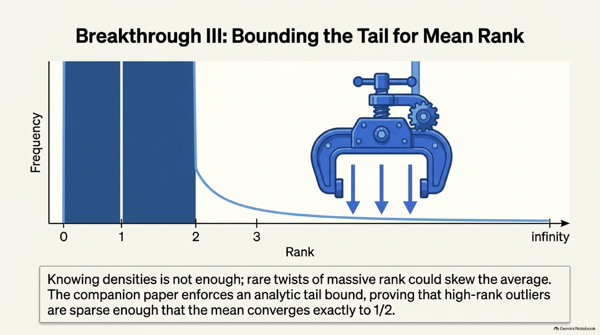

*AI-generated slide. The histogram is a schematic, not data.*

<details>
<summary><b>Why the tail bound gives the mean</b> (a short calculation)</summary>

Work with twists of height about $X$, so there are about $X$ of them, and write $N(k)$ for the number with rank above $k$. Every rank satisfies $a = \sum_{k \ge 0} \mathbf{1}[a > k]$, so the total rank of the twists with $a > R$ is

$$\sum_{a>R} a = (R+1) N(R) + \sum_{k>R} N(k).$$

Put $K = (\log X)^{3/5}$. For $R < k \le K$, Proposition 6.1 gives $N(k) \le CX/k^2$, so these terms add up to at most about $CX/R$, and so does $(R+1)N(R)$. For $k > K$, $N(k) \le N(K) \le CX/K^2$, and only the $O(\log X)$ values of $k$ below the largest possible rank (Lemma 6.2) contribute. Their total is at most about

$$\log X \cdot \frac{X}{(\log X)^{6/5}} = \frac{X}{(\log X)^{1/5}} = o(X).$$

So the twists of rank above $R$ carry total rank $O(X/R) + o(X)$, which is Theorem 1.2 of the companion. Now split the average: ranks 0 and 1 give $1/2 + o(1)$ (the densities), ranks $2, \ldots, R$ give at most $R$ times a density-zero fraction, which is $o(1)$, and ranks above $R$ give $O(1/R)$. Letting $R \to \infty$ gives a mean of $1/2$.

(This is the outline in the companion's introduction and Section 6, with constants and the dyadic bookkeeping suppressed.)
</details>

### A worked example: the twists of 11a1

<details>
<summary><b>Root numbers, analytic ranks and 2-descents for 6,084 twists of one curve</b> (click to expand)</summary>

The curve is Cremona's **11a1**, $E: y^2 + y = x^3 - x^2 - 10x - 20$, of conductor $N = 11$ (LMFDB [11.a2](https://www.lmfdb.org/EllipticCurve/Q/11/a/2)). It has rank 0, root number $+1$ and five rational torsion points, so $E(\mathbb{Q})[2] = 0$ and $E[2]$ is irreducible: the second case of Step 2. It is also the example in Goldfeld's 1979 paper. For every squarefree $d$ with $0 < \lvert d\rvert \le 5000$, this explainer computed with PARI/GP 2.17.2 (through `cypari2`) the conductor, the root number (`ellrootno`) and the analytic rank (`ellanalyticrank`) of $E^{(d)}$. For $\lvert d\rvert \le 2000$ it also ran a 2-descent (`ellrank`), which gives $d_2$ and bounds for the Mordell–Weil rank. Analytic ranks computed this way are numerical, not certified. The full table is in [`assets/data/twists-11a1.csv`](assets/data/twists-11a1.csv).

**Some individual twists:**

| $d$ | conductor of $E^{(d)}$ | root number | analytic rank | $d_2$ (2-descent) | Mordell–Weil rank |
|---|---|---|---|---|---|
| 1 (the curve itself) | 11 | $+1$ | 0 | 0 | 0 |
| $-1$ | 176 | $+1$ | 0 | 0 | 0 |
| 2 | 704 | $-1$ | 1 | 1 | 1 |
| $-3$ | 99 | $+1$ | 0 | 0 | 0 |
| 5 | 275 | $+1$ | 0 | 0 | 0 |
| $-7$ | 539 | $-1$ | 1 | 1 | 1 |
| 13 | 1859 | $-1$ | 1 | 1 | 1 |
| $-47$ | 24299 | $+1$ | **2** | 2 | 2 |
| $-58$ | 592064 | $+1$ | 0 | **2** | 0 |
| $-206$ | 7468736 | $-1$ | **3** | 3 | 3 |

The twist by $d = -47$ is the first with analytic rank 2, and $d = -206$ the first with analytic rank 3. The twist by $d = -58$ shows why a single 2-descent is not enough: $d_2 = 2$ but the rank is 0. PARI's descent shows that the two extra Selmer classes come from $`\mathrm{Sha}[2] \cong (\mathbb{Z}/2)^2`$. Here $c_2 = 0$ while $d_2 = 2$, and the difference is even, as Lemma 2.4 says it must be.

**The whole family:**

| $X$ | twists with $\lvert d\rvert \le X$ | root number $+1$ | rank 0 | rank 1 | rank $\ge 2$ | mean analytic rank |
|---|---|---|---|---|---|---|
| 100 | 122 | 49.2% | 45.1% | 50.8% | 4.1% | 0.590 |
| 300 | 366 | 49.5% | 43.4% | 50.3% | 6.3% | 0.631 |
| 1000 | 1216 | 49.8% | 44.0% | 50.1% | 5.9% | 0.620 |
| 2000 | 2430 | 49.7% | 43.7% | 50.1% | 6.2% | 0.626 |
| 5000 | 6084 | 49.9% | 44.5% | 49.9% | 5.6% | 0.613 |

Up to $\lvert d\rvert \le 5000$ there are 2705 twists of analytic rank 0, 3037 of rank 1, 333 of rank 2 and 9 of rank 3. Among the 2430 twists with $\lvert d\rvert \le 2000$, the 2-descent gives $d_2 = 0, 1, 2, 3$ for 35.9%, 49.8%, 13.8% and 0.5% of them.

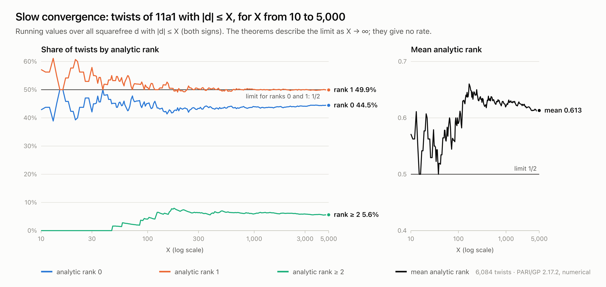

**What the numbers show, and what they don't.**

1. **The signs split evenly.** The root number is $+1$ for 49.9% of the twists with $\lvert d\rvert \le 5000$. The formula $\varepsilon(E^{(h)}) = \varepsilon(E)\chi_h(-N)$ of section 1.3 agreed with PARI on all 1858 parameters it applies to (odd fundamental discriminants prime to 22).
2. **Parity holds on both sides.** In every one of the 2430 descents, $(-1)^{d_2}$ equals the root number, as $(-1)^{c_2} = \varepsilon$ and Lemma 2.4 predict.
3. **Corollary 1.3 is consistent with the data.** In all 2082 twists with $d_2 \in \lbrace 0, 1\rbrace$, the numerical analytic rank equals $d_2$. This is a consistency check, not a test of the proof: for these small conductors the same conclusion could also be reached case by case.
4. **The limit is approached slowly.** Rank 1 sits near 50% from about $X = 100$ on, but rank 0 is still at 44.5%, because 5.5% of all the twists have even sign and rank 2 instead of 0. The theorems say that this share tends to 0 and the mean to $1/2$, but they give no rate. At $\lvert d\rvert \le 5000$ the mean is still 0.613. This gap between data in reachable ranges and the conjectured limit is well known. A survey by Bektemirov, Mazur, Stein and Watkins has the title *Average ranks of elliptic curves: tension between data and conjecture* (2007).

To reproduce a row in PARI/GP:

```gp
E  = ellinit([0,-1,1,-10,-20]);     \\ 11a1
Et = ellinit(elltwist(E, -47));      \\ twist by Q(sqrt(-47)); for d = 2,3 mod 4 use 4*d
[ellglobalred(Et)[1], ellrootno(Et)] \\ [24299, 1]
ellanalyticrank(Et)[1]               \\ 2
ellrank(Et)                          \\ [2, 2, 0, [...]]: rank exactly 2, Sha[2] trivial
```

In the output $`[r_1, r_2, s, L]`$ of `ellrank`, $r_1 \le$ rank $\le r_2$, and $`d_2 = r_2 + s`$ (from PARI's documentation of the algorithm).
</details>

### Level 3: the machinery, for readers who know some algebraic number theory

**Normalizations.** Valuations are 2-adic with $v(2) = 1$. For a twist parameter $h$ put $`\mathcal{L}(h) = \sqrt{\lvert h\rvert}\ L(E^{(h)},1)/\Omega_E^{\mathrm{sgn}(h)}`$. Each prime $p \mid h$ gets a weight $w$ according to the action of Frobenius on $E[2]$: identity (split, weight 1), a transposition (simple, weight 1/2) or a 3-cycle (root, weight 0). Write $s(h)$ for the length of $`\mathrm{Sha}(E^{(h)})[2^\infty]`$ when it is finite. The quantity that must stay bounded in rank 0 is

```math
D(h) = v(\mathcal{L}(h)) - 2w(h) - s(h),
```

and the "Cyclotomic lower bound" (Theorem 3.5, for curves whose $E[2]$ is an extension of two trivial modules, the rational-2-torsion case) is $D(h) \ge -C_E$. The coefficient test gives the matching upper bound at every nonzero vertex (Proposition 4.4).

**The two analytic detectors.** In rank 0, the Beilinson–Kato class and the invariant line at the real place form a determinant coordinate whose central valuation differs from $D(h_x)$ by a bounded amount (Proposition 12.3). In rank 1, a Heegner class over $K = \mathbb{Q}(\sqrt k)$ satisfies (Proposition 3.2)

```math
\widehat h\bigl(P_c(e)\bigr) = C_E\ c\sqrt{\lvert k\rvert}\ \bigl[L(E^{(e)},s)\,L(E^{(ek)},s)\bigr]'_{s=1},
```

and the index of the Heegner point plays the role of $D$. The paper uses two Heegner constructions: "genus data", where $k = h h_\ast$ with a fixed partner $h_\ast$ and the character is unramified, and "ring data", where $k$ is prime to $h$ and the ring-class conductor is $c = \lvert h\rvert$. It proves uniform lower bounds for both (Theorems 3.6 and 3.7).

**The binary algebra** (Section 11). Over $O = \widehat{\Lambda_{(2)}}$ with $`\Lambda = \mathbb{Z}_2[[t]]`$ and $G = (\mathbb{Z}/2)^b$, the vertex coordinates are evaluations at the $2^b$ sign characters of $`G`$. A Laurent coefficient $`A(x) = \sum_{g} a_g (-1)^{g\cdot x}`$ is a polynomial in the bits $x_i$ whose degree-$`\lvert S\rvert`$ coefficients are divisible by $2^{\lvert S\rvert}$. Expanding $(1+Z)^{A(x)}$ shows that each binary digit of $A(x)$ is a Boolean polynomial of bounded degree. Hence $q$ congruences modulo $2^M$ are a system over $\mathbb{F}_2$ of total degree at most $q(2^{M-1}-1)$. If $b$ exceeds that, Chevalley–Warning gives an even number of solutions, so $x = 0$ has a nonzero companion (Lemma 11.4). The delicate point is denominators. After eliminating the new local blocks by Schur complements with a uniform pole bound (Lemma 11.2), only a **bounded** complex is left, and its clearing factor $f$ has bounded degree and valuation (Lemma 11.3). So the number of congruences, and hence the required $b$, does not grow with the number of new primes (Lemma 11.5).

**The two combinatorial engines.** With rational 2-torsion, the coefficient tests are treated as polynomials in prescribed residue symbols. The proof "retains squared variables until after multiplying their highest-degree parts", which lets two separately nonzero tests be made nonzero together at every nonzero address (Theorem 6.6). With $E[2]$ irreducible, the active-prime Selmer equations give matrices over $\mathbb{F}_2$. A correction depending on finitely many local types makes them symmetric, and their nullities still bound the Selmer dimension up to a fixed cost (Proposition 8.2). Removing a selected prime or pair of primes, or keeping it with either of two local choices, gives three configurations whose tests satisfy the same sum-zero relation as the matrix determinants (Lemma 8.3). A test equal to 1 therefore allows only boundedly many singular blocks, and a configuration with the maximal number of singular blocks forces the tests to equal 1 at every nonzero vertex (Section 9).

**The companion's analytic engine.** For a twist of height $X$ and an integer $k$, an exact identity (Lemma 4.1) says that if $a(F^{(d)}) > k$ and the sign is $(-1)^k$, then a certain smoothed Dirichlet series $`\sum_n \lambda(n)\chi_d(n) n^{-1/2} W_{k}(\log n/\log X)`$ vanishes. Here $W_k$ is an exponentially smoothed $k$-th power of a truncated logarithm, and the companion's variable has its centre at $1/2$ rather than 1. The proof shows the series is **not** zero for most $d$. It splits the series into pieces with progressively shorter mollifiers, bounds unmollified second moments with only powers of $\log X$ (a Poisson-summation and "inflation" argument adapted from Xiannan Li's work on second moments of quadratic twists), and compares character values with independent random variables (Propositions 3.7 and 5.9). On most $d$, the first piece is then close to a positive Euler product and dominates all the others. Consecutive values of $k$ cover both signs. Because the derivative order $k$ may grow like $(\log X)^{3/5}$, this gives $O(X/k^2)$ exceptions with no second-moment bound on the ranks.

---

## 6. The people whose ideas this builds on

| Person | Idea | Where it shows up |
|---|---|---|
| **Dorian Goldfeld** | The twist conjecture (1979) and the first conditional upper bound | The statement being proved |
| **Bryan Birch, Peter Swinnerton-Dyer; John Tate** | The BSD conjecture and its framework | The rank equality and the finiteness of Ш proved on a density-one set |
| **Benedict Gross, Don Zagier; Victor Kolyvagin** | Heegner points and $L'(E,1)$; Euler systems | The forward implication (Lemma 2.1) and the Heegner detector in rank 1 |
| **Breuil, Conrad, Diamond, Taylor** | Modularity of all curves over $\mathbb{Q}$ | Analytic continuation and functional equations for every twist |
| **Alexander Smith** | Distribution of $2^\infty$-Selmer groups in twist families (2017, 2022, 2025) | The statistical input to Theorem 1.2 |
| **Roger Heath-Brown; Peter Swinnerton-Dyer; Daniel Kane** | 2-Selmer distributions in twist families; Heath-Brown's GRH bound $3/2$ for the mean | Background for the Selmer side; the conditional history of the mean |
| **Paul Monsky; Tim and Vladimir Dokchitser** | Parity of Selmer ranks | Lemma 2.2 |
| **J. W. S. Cassels; J. S. Milne** | The alternating Cassels–Tate pairing | Lemma 2.4 and Corollary 1.3 |
| **Kazuya Kato** | Zeta elements and explicit reciprocity | The rank-0 detector (Section 12) |
| **Jean-Loup Waldspurger** | Central values and coefficients of half-integral weight forms | The even-sign coefficient tests (Section 4) |
| **Benjamin Howard** | Kolyvagin systems for Heegner points | Related framework for the Heegner construction (Section 13) |
| **Claude Chevalley, Ewald Warning** | Counting zeros of polynomials over finite fields | The transfer to the missing vertex (Lemma 11.4) |
| **Bump–Friedberg–Hoffstein; Murty–Murty; Ono–Skinner; James; Vatsal; Kriz–Li; Tian–Yuan–Zhang** | Nonvanishing of twists and positive proportions in special families | Earlier routes to parts of the conjecture (introduction) |
| **Jeffrey Hoffstein, Wenzhi Luo; Henryk Iwaniec; Roger Heath-Brown** | Nonvanishing of twisted central values; derivative moments; the quadratic large sieve (1995) | The auxiliary nonvanishing with prescribed local conditions (Proposition 3.8, proved in Section 10) |
| **Maksym Radziwiłł, Kannan Soundararajan** | Moments and distribution of twisted central values | The root-number formula for twists (Section 2) |
| **Xiannan Li; Kannan Soundararajan, Matthew Young** | Second moments of quadratic twists of modular $L$-functions | The companion's logarithmic moment bounds (Section 3) |
| **Daniel Fiorilli; Steven J. Miller, Siman Wong; Kowalski–Michel–VanderKam; Perelli–Pomykała** | Conditional exact means, rank moments, derivative and mollifier methods | Context and methods for the companion |
| **Peter Koymans, Alexander Smith** | Exponential moments of Mordell–Weil ranks (2026) | The companion's algebraic-rank moments (Corollary 1.3) |

---

## 7. What it does not prove, and caveats

> [!IMPORTANT]
> **Density zero is not "never".** Theorem 1.2 says the twists of analytic rank 2 or more make up a vanishing *fraction* of $\mathcal{D}(X)$. It says nothing about any individual such twist. For those (such as $d = -47$ above) the papers prove neither rank = analytic rank nor the finiteness of Ш. It is also not a proof of BSD, even for the twist family: the rank equality and the finiteness of Ш are proved only on a density-one set.

> [!IMPORTANT]
> **Only the stated family and ordering.** The theorems are about the quadratic twists of one fixed curve, with signed squarefree $d$ ordered by $\lvert d\rvert$. Goldfeld's original conjecture counts discriminants of quadratic fields instead, and the companion says it resolves the mean conjecture "in this counting convention". A congruence class of $d$ can fix the root number, and the half-and-half statements are about the whole family, not about such subfamilies. The results say nothing about elliptic curves ordered by height, or about other families such as cubic twists. They give no rate of convergence, and the [worked example](#a-worked-example-the-twists-of-11a1) shows the convergence is slow.

> [!IMPORTANT]
> **Analytic, not algebraic, higher moments.** The companion proves that the *mean* analytic rank tends to $1/2$. Its Corollary 1.3 on all moments concerns the Mordell–Weil rank. The companion is explicit that this corollary "concerns algebraic ranks only: it gives no higher analytic-rank moments, no uniformity for parameters varying with $Y$, and no moment limit for thin polynomial subfamilies."

> [!NOTE]
> **Dependence on outside preprints.** Theorem 1.2 uses Smith's Theorem 1.1 from his 2025 arXiv preprint (arXiv:2503.17619, version 1) as a black box: "The theorem follows by combining the pointwise 2-converse with Smith's distribution". The companion's mean theorem uses Theorem 1.2 as its density input, so it rests on Smith's preprint too. The companion's algebraic-moment corollary also uses the Koymans–Smith preprint (arXiv, June 2026). If either input changed, the corresponding statement would need to be revisited. The 2-converse itself does not depend on Smith's work.

> [!NOTE]
> **Provenance.** Both papers were produced by an unreleased internal OpenAI model as part of the [openai/math](https://github.com/openai/math) release. That repository's README says the vast majority of its results came from one fixed procedure and names two exceptions (work on a zero-free region for the zeta function, and the Hodge conjecture for CM abelian varieties). Family 006 is not one of them.

> [!WARNING]
> **Verification status.** openai/math has **no Lean formalization** for this family: there is no `lean/docs/006.md`, and `lean/formalization.yaml` has no entry for either paper (checked 7 October 2026). The openai/math README warns that "some of the unformalized results could have issues." Both papers are preprints, and the usual next step is independent review by experts. This explainer did not check the proofs. The numbers in the worked example are numerical computations made for this page, not part of the papers.

> [!TIP]
> **Simplifications.** To stay readable, this explainer suppresses the filters of local conditions, the choice of genus and ring data, the companion twists, the limiting (ultrafilter) constructions of Section 13, the finite-precision realizations of the odd coefficient tests, and the dyadic bookkeeping of the companion. Every precise statement is in the papers.

---

## 8. Glossary

| Term | Meaning |
|---|---|
| **Elliptic curve** $E/\mathbb{Q}$ | A smooth cubic curve such as $y^2 = x^3 + ax + b$, with a point at infinity; see the [BSD explainer](../Exact-Birch-Swinnerton-Dyer-Formula-from-Low-Selmer-Corank-October-3-2026/README.md#8-glossary) |
| **Rank** $r(E)$ | The number of independent rational points of infinite order (Mordell–Weil rank) |
| **$`L`$-function** $L(E,s)$ | Built from the point counts modulo primes; its centre is $s = 1$ |
| **Analytic rank** $a(E)$ | The order of vanishing of $L(E,s)$ at $s = 1$ |
| **Conductor** $N$ | A positive integer measuring the bad primes of $E$; for 11a1 it is 11 |
| **Quadratic twist** $E^{(d)}$ | The curve $dy^2 = x^3 + ax + b$; it becomes isomorphic to $E$ over $\mathbb{Q}(\sqrt d)$ |
| **Twist family** $\mathcal{D}(X)$ | The signed squarefree $d$ with $0 < \lvert d\rvert \le X$; it has about $12X/\pi^2$ members |
| **Density** | The limiting fraction of $\mathcal{D}(X)$ with a property, as $X \to \infty$ |
| **Root number** $\varepsilon(E)$ | The sign $\pm 1$ in the functional equation; $(-1)^{a(E)} = \varepsilon(E)$ |
| **Fundamental discriminant** | The discriminant of a quadratic field, such as $-3$, $5$, $-4$ or $8$ |
| **Quadratic character** $\chi_d$ | The $\pm 1$-valued function on primes that records whether $d$ is a square mod $p$ |
| **2-Selmer group, $`d_2(E)`$** | The output of a single 2-descent; $`d_2 = \dim \mathrm{Sel}_2 - \dim E(\mathbb{Q})[2]`$ |
| **$`2^\infty`$-Selmer corank** $c_2(E)$ | The corank of the union of all $2^n$-Selmer groups; $c_2$ is $r$ plus the corank of $`\mathrm{Sha}[2^\infty]`$ |
| **Tate–Shafarevich group** Ш | The group measuring the failure of the local-to-global principle; conjecturally finite |
| **Converse theorem** | A result going from small Selmer corank to small analytic rank (the reverse of Gross–Zagier–Kolyvagin) |
| **Goldfeld's conjecture** | In twist families, the mean analytic rank is $1/2$; in density form, ranks 0 and 1 each occur half the time |
| **Minimalist conjecture** | The expectation that ranks in a family are as small as the root number allows |
| **$`E[2]`$ reducible / irreducible** | Whether the three points of order 2 include a rational one; the two cases of the proof |
| **Heegner point** | A point over an imaginary quadratic field built from CM points on a modular curve; its height is an $L$-derivative |
| **Kato's zeta element** | A Galois cohomology class whose image detects $L(E,1)$ |
| **Weight-3/2 modular form** | A modular form of half-integral weight; by Waldspurger, its coefficients detect central values of twists |
| **Binary cube** $\mathbb{F}_2^b$ | The $2^b$ vectors of 0s and 1s; each gives one twist $h_x$ in the proof |
| **Chevalley–Warning theorem** | If polynomial equations over a finite field of characteristic $p$ have total degree less than the number of variables, the number of common solutions is divisible by $p$ |
| **2-adic valuation** $v$ | The exponent of 2 in a number, for example $v(12) = 2$ |
| **Mollifier** | A short Dirichlet polynomial that approximates $1/L$ and tames the size of $L$-values in averages |
| **Lean 4** | A proof assistant: software that mechanically checks every logical step of a proof |

---

## 9. Slides, audio and other assets

Everything below except the hand-made figures and the data was generated with **Google NotebookLM** (now "Gemini Notebook") from the two papers and the Wikipedia article on the rank of an elliptic curve. The report and the mind map use the two papers only. The outputs are kept exactly as NotebookLM produced them. They are AI-generated and contain real mistakes, so see the [errata](assets/README.md#errata) before relying on any detail. In particular, slides 6, 9, 10 and 13 have factual errors, and the report has a wrong example in its section 8 and swapped theorem numbers in its section 9.

| Asset | What it is |
|---|---|
| [Slide deck (PDF)](assets/notebooklm/slides.pdf) · [PPTX](assets/notebooklm/slides.pptx) | 14-slide beginner deck |
| [Infographic: overview](assets/notebooklm/infographic-overview.png) | The one-page summary shown at the top |
| [Infographic: history timeline](assets/notebooklm/infographic-history-timeline.png) | From the 1960s to 2026, in five eras |
| [Audio overview (≈1.9 min)](assets/notebooklm/audio-overview-brief.m4a) | A short podcast-style summary (not reviewed) |
| [Report](assets/notebooklm/beginner-explainer-report.md) | NotebookLM's long-form synthesis; more technical than this page |
| [Mind map](assets/notebooklm/mindmaps.md) | How the results and the proof fit together |
| [Twist-rank figure](assets/figures/twists-11a1-ranks.png) ([SVG](assets/figures/twists-11a1-ranks.svg)) | Hand-made from PARI/GP data: analytic ranks of the twists of 11a1 for $\lvert d\rvert \le 100$, and the shares up to 2000 |
| [Convergence figure](assets/figures/twists-11a1-convergence.png) ([SVG](assets/figures/twists-11a1-convergence.svg)) | Hand-made from PARI/GP data: running shares and mean for $\lvert d\rvert \le X$, $X$ up to 5000 |
| [Missing-vertex figure](assets/figures/missing-vertex-cube.png) ([SVG](assets/figures/missing-vertex-cube.svg)) | Hand-made schematic of the cube-of-twists argument |
| [Twist data (CSV)](assets/data/twists-11a1.csv) | 6,084 twists of 11a1: conductor, root number, analytic rank, and for $\lvert d\rvert \le 2000$ the 2-descent data |

<details>
<summary><b>All 14 slides</b> (click to expand)</summary>

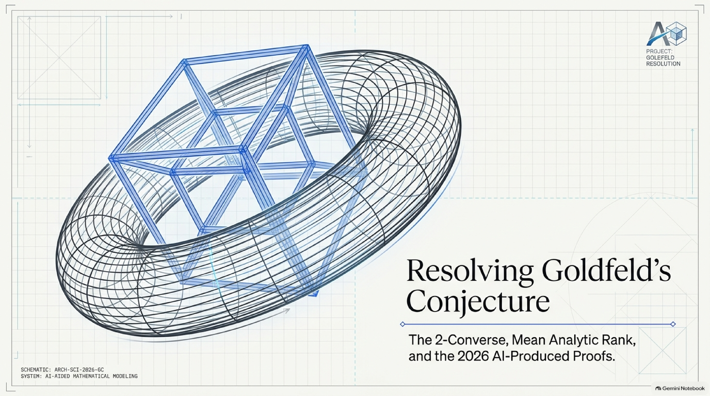

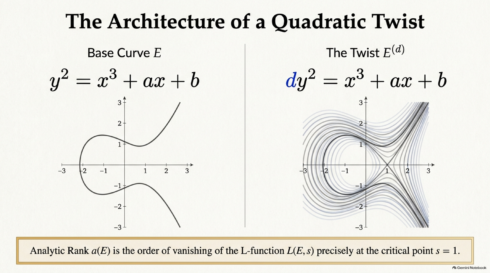

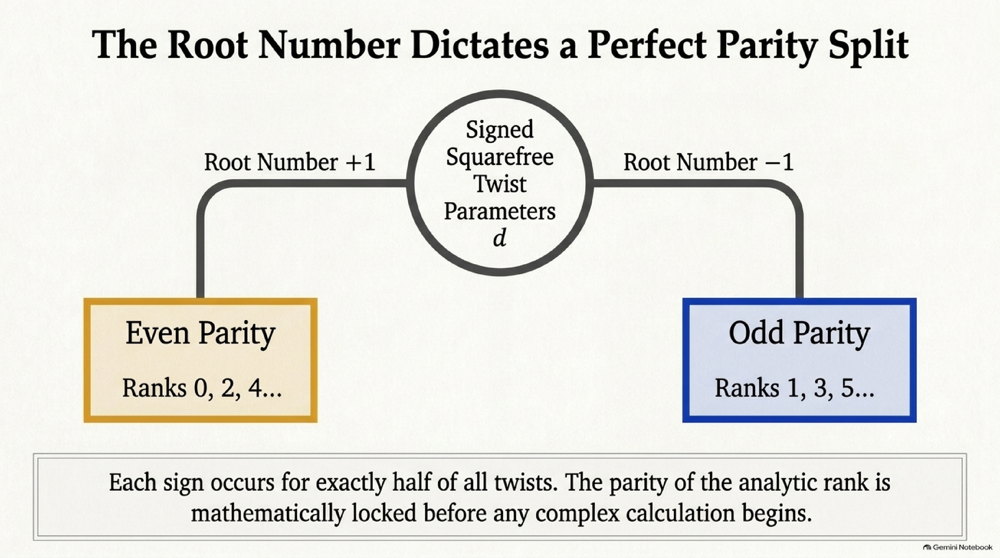

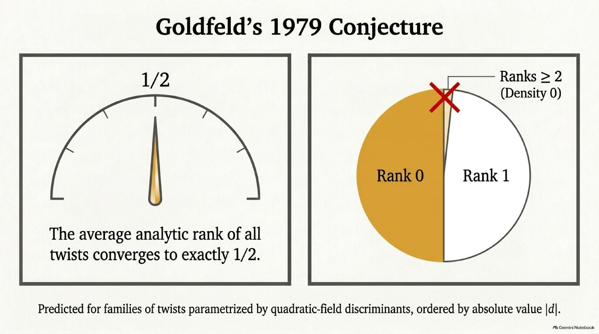


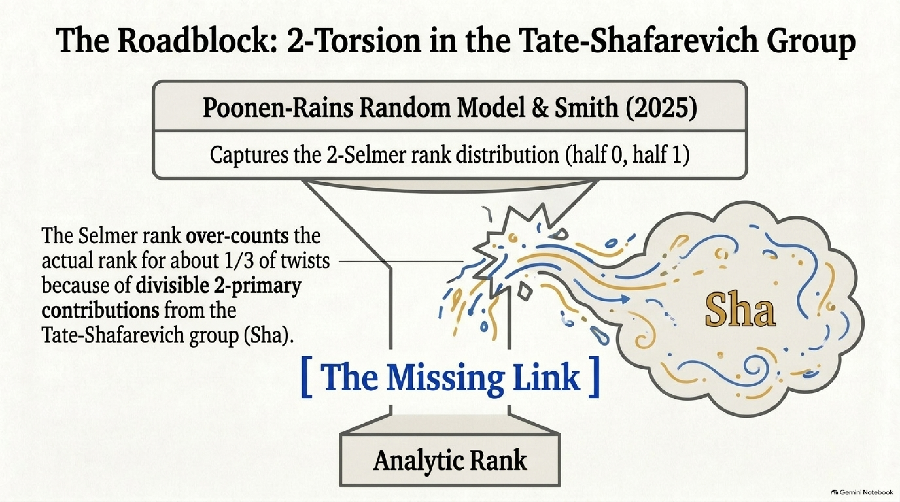


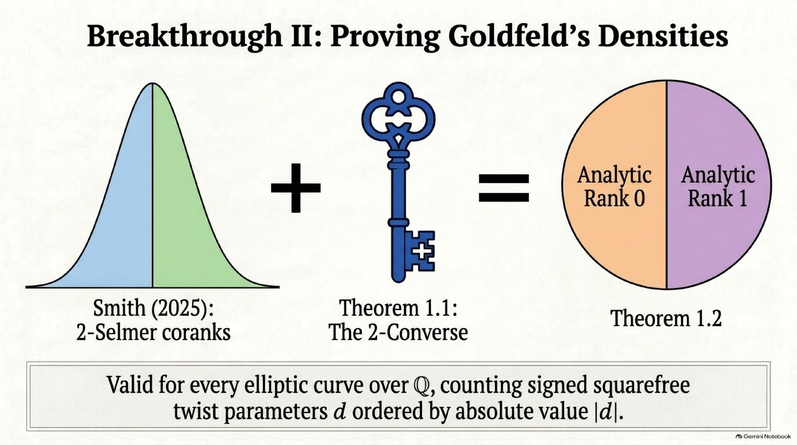

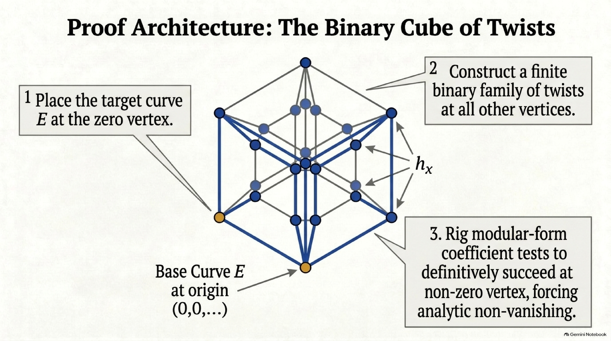

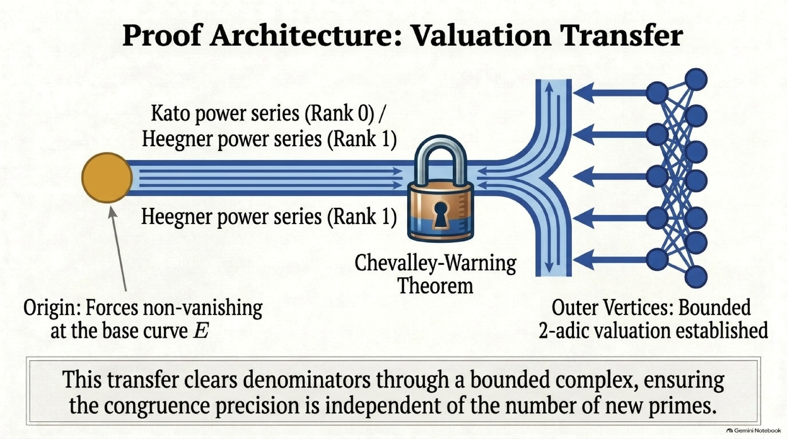


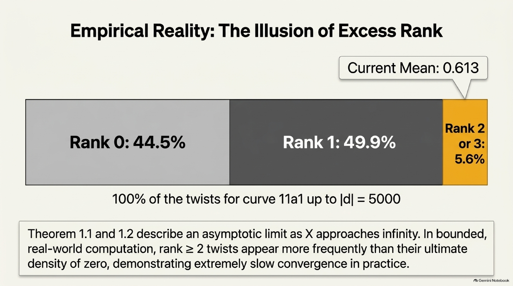

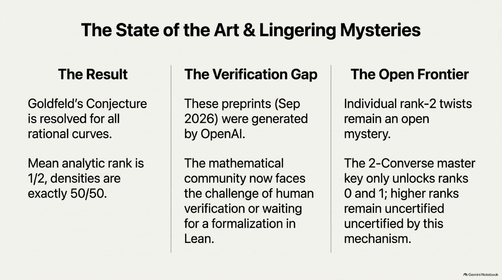

</details>

---

## How this explainer was made

1. The two papers, with their TeX sources, were downloaded from [openai/math](https://github.com/openai/math/tree/main/preprints), together with `CONTENTS.md`, the openai/math README and `lean/formalization.yaml`. There is no `lean/docs/006.md` and no reasoning trace for this family.
2. The text on this page was written by hand (with AI assistance) directly from the TeX sources: the introduction and Sections 2, 3, 11 and 14 of the principal paper, the statements in its Sections 4–13, and the introduction and Sections 4, 6 and 7 of the companion. Historical claims not found in the papers were checked against the original sources listed under the history table. Goldfeld's Conjecture (B), Propositions (1) and (2), and his conductor-11 example were read from the scanned 1979 paper.
3. The worked example and the two data figures were computed with PARI/GP 2.17.2 through `cypari2`, and all three figures were drawn as SVG by script.
4. The two papers and one Wikipedia background article were loaded into a NotebookLM notebook through the [`notebooklm-mcp-cli`](https://github.com/jacob-bd/gemini-notebook-mcp-cli) CLI, which generated the slides, infographics, report, mind map and audio in [`assets/notebooklm/`](assets/notebooklm/). Every slide, both infographics, the report and the mind map were then read against the papers. Errors that remain are listed in the [errata](assets/README.md#errata). No slide revision was run, because the shared generation quota was too low; the proposed revision is recorded there. NotebookLM's outputs were used only as visual and structural aids, never as the source of truth.

See [`PIPELINE.md`](../../PIPELINE.md) for the exact, repeatable steps.

*Citation for the underlying paper:*

```bibtex
@misc{OAI:Goldfelds-analytic-density-conjecture-and-the-2-converse-for-elliptic-curves-September-23-2026,
  author = {{OpenAI}},
  title = {{Goldfeld's analytic density conjecture and the $2$-converse for elliptic curves}},
  howpublished = {OpenAI Math Release preprint
                  \href{https://github.com/openai/math/blob/main/preprints/Goldfelds-analytic-density-conjecture-and-the-2-converse-for-elliptic-curves-September-23-2026/paper.pdf}{OAI:Goldfelds-analytic-density-conjecture-and-the-2-converse-for-elliptic-curves-September-23-2026}},
  year = {2026}
}
```

*Citation for the companion:*

```bibtex
@misc{OAI:The-mean-analytic-rank-of-quadratic-twists-of-elliptic-curves-September-23-2026,
  author = {{OpenAI}},
  title = {{The mean analytic rank of quadratic twists of elliptic curves}},
  howpublished = {OpenAI Math Release preprint
                  \href{https://github.com/openai/math/blob/main/preprints/The-mean-analytic-rank-of-quadratic-twists-of-elliptic-curves-September-23-2026/paper.pdf}{OAI:The-mean-analytic-rank-of-quadratic-twists-of-elliptic-curves-September-23-2026}},
  year = {2026}
}
```
