# Hilbert's tenth problem over the rational numbers, explained for beginners

> - **Paper:** [*Hilbert's tenth problem over the rational numbers*](https://github.com/openai/math/blob/main/preprints/Hilberts-tenth-problem-over-the-rational-numbers-September-24-2026/main.pdf), OpenAI, 24 September 2026 (62 pages)
> - **openai/math family:** 004, *Hilbert's tenth problem over ℚ* · **Field:** number theory and mathematical logic (computability)
> - **Companion:** [*A pointwise 2-converse for elliptic curves with rational two-torsion*](https://github.com/openai/math/blob/main/preprints/A-pointwise-2-converse-for-elliptic-curves-with-rational-two-torsion-September-24-2026/paper.pdf) (24 Sep 2026, 91 pages). The main paper uses it for one step, in Section 3
> - **Formal proof:** none. openai/math has no Lean scope document for family 004, and neither paper appears in its formalization catalogue
> - **Who this is for:** anyone who knows what a polynomial and a fraction are. Elliptic curves and the logic background are explained when they come up.

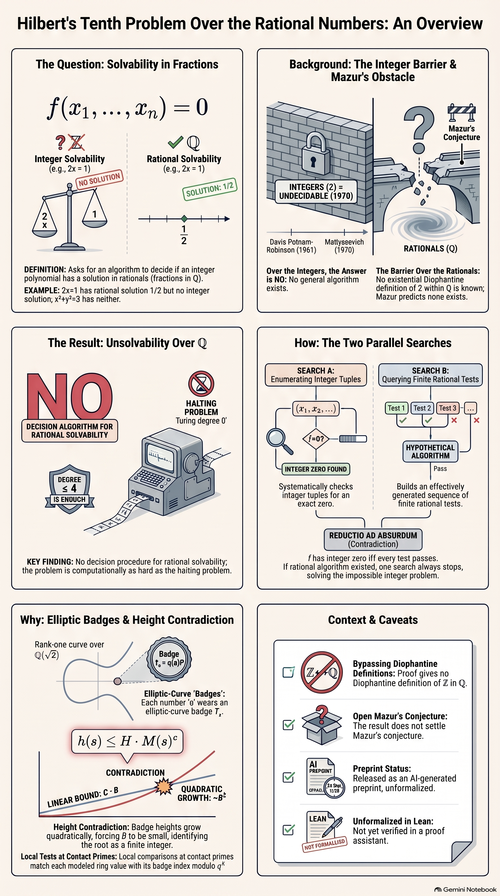

*AI-generated overview (NotebookLM). It has a few typos; for example, ℤ is printed as "2". See the [errata](assets/README.md#errata).*

## Contents

- [TL;DR](#tldr)
- [How to read this](#how-to-read-this)
- [1. The problem](#1-the-problem)
- [2. A short history](#2-a-short-history)
- [3. What the paper proves](#3-what-the-paper-proves)
- [4. Why it matters](#4-why-it-matters)
- [5. The main idea of the proof](#5-the-main-idea-of-the-proof)
- [6. The people whose ideas this builds on](#6-the-people-whose-ideas-this-builds-on)
- [7. What it does not prove, and caveats](#7-what-it-does-not-prove-and-caveats)
- [8. Glossary](#8-glossary)
- [9. Slides, audio and other assets](#9-slides-audio-and-other-assets)
- [How this explainer was made](#how-this-explainer-was-made)

---

## TL;DR

- **The question.** A *Diophantine equation* is a polynomial equation with integer coefficients, such as $x^2 + y^2 = 3$. In 1900 Hilbert asked for an algorithm that decides whether such an equation has a solution in whole numbers. The answer, completed by Matiyasevich in 1970 on top of work by Davis, Putnam and Robinson, is **no**. The same question for solutions in **fractions** (rational numbers) stayed open.
- **Why fractions are different.** A computer can always *find* a rational solution if one exists, by trying fractions one by one. The hard part is ever being sure there is *none*. The classical way to transfer the integer result, an equation-only test for "this fraction is a whole number", is not known to exist. A conjecture of Mazur predicts that it doesn't.
- **What this paper proves.** **No algorithm can decide whether a polynomial with integer coefficients has a rational zero.** Hilbert's tenth problem over $\mathbb{Q}$ has a negative answer. The problem is exactly as hard as the halting problem, and it stays that hard for polynomials of degree at most 4.
- **How.** The paper goes around the missing definition. For each integer equation it builds an endless list of *finite rational tests*. An integer solution passes all of them. The hard part is the converse: if every test passes, there must be an integer solution. That converse uses elliptic curves, a new inequality for the size of fractions, and a trick that controls whether denominators contain even or odd powers of primes.
- **What it doesn't do.** It gives no equation-only definition of the integers inside the rationals, and it does not settle Mazur's conjecture. It is an AI-generated preprint, it has not been formalized in Lean, and it relies on two other OpenAI preprints.

## How to read this

| You have… | Read |
|---|---|
| 2 minutes | The TL;DR, the infographic above and the [two-searches figure](#level-1-the-one-paragraph-version) |
| 15 minutes | Sections 1–4 and 7 |
| An hour, and you like number theory or logic | Everything, including [section 5](#5-the-main-idea-of-the-proof) and the [slides](#9-slides-audio-and-other-assets) |

---

## 1. The problem

### 1.1 Diophantine equations

A **Diophantine equation** is an equation $f(x_1,\dots,x_n) = 0$ where $f$ is a polynomial with integer coefficients. Some examples:

| Equation | Integer solutions? | Rational solutions? |
|---|---|---|
| $x^2 + y^2 = z^2$ | Yes, infinitely many, such as $(3,4,5)$ | Yes |
| $x^2 - 2y^2 = 1$ | Yes: $(3,2)$, $(17,12)$, … | Yes |
| $2x = 1$ | **No** | **Yes**: $x = 1/2$ |
| $x^2 + y^2 = 3$ | No | **No** (see below) |

The third line shows that the question changes when you allow fractions. An equation can have rational solutions and no integer ones.

<details>
<summary><b>Why x² + y² = 3 has no rational solutions</b> (a three-line argument)</summary>

Suppose $x = a/c$ and $y = b/c$ with a common denominator $c > 0$, where $a, b, c$ have no common factor. Then $a^2 + b^2 = 3c^2$. Every square leaves remainder 0 or 1 when divided by 3, so $a^2 + b^2$ is divisible by 3 only if both $a$ and $b$ are. But then $9$ divides $3c^2$, so 3 divides $c$ too, contradicting "no common factor".

No amount of computer searching could have told you this. A search can only ever say "nothing found yet". You need a proof, and Hilbert's question is whether some algorithm could always supply the answer.
</details>

### 1.2 Algorithms and undecidable problems

An **algorithm** is a finite recipe a computer can follow. To *decide* a yes/no question, it must **always stop** with the right answer. In 1936 Alan Turing gave a precise definition of algorithms and showed that some questions have no such recipe. The most famous one is the **halting problem**: given a program, will it ever stop?

For both whole numbers and fractions, half of the job is easy. You can list all candidate solutions (for fractions, list every tuple whose numerators and denominators are at most 1, then at most 2, and so on) and plug each one in. If a solution exists, you eventually find it. If none exists, the search runs forever and never tells you. A problem like this, where "yes" answers can be confirmed but "no" answers may never be, is called **computably enumerable**. The question is whether something cleverer can also certify the "no" answers.

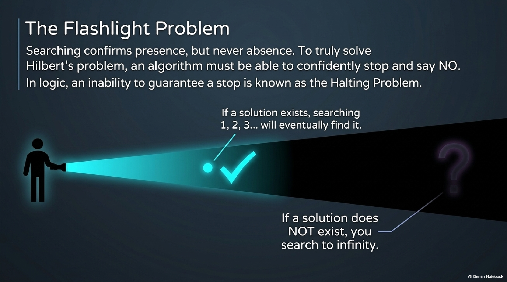

### 1.3 Over the integers: settled in 1970

The integer version was answered by a theorem the paper calls the Davis–Putnam–Robinson–Matiyasevich theorem (often abbreviated **MRDP**):

> **Every computably enumerable set of positive integers is Diophantine.**

"Diophantine" means it can be described as the set of parameter values $a$ for which some fixed polynomial equation $P(a, y_1, \dots, y_m) = 0$ has a solution in the unknowns $y_i$. A simple example: $a$ is composite exactly when $a = (y_1 + 2)(y_2 + 2)$ has a solution in natural numbers. MRDP says that *every* list a computer can generate, however complicated, has a description like this. That includes the list of programs that halt, suitably coded as numbers. Since no algorithm can decide halting, no algorithm can decide integer solvability.

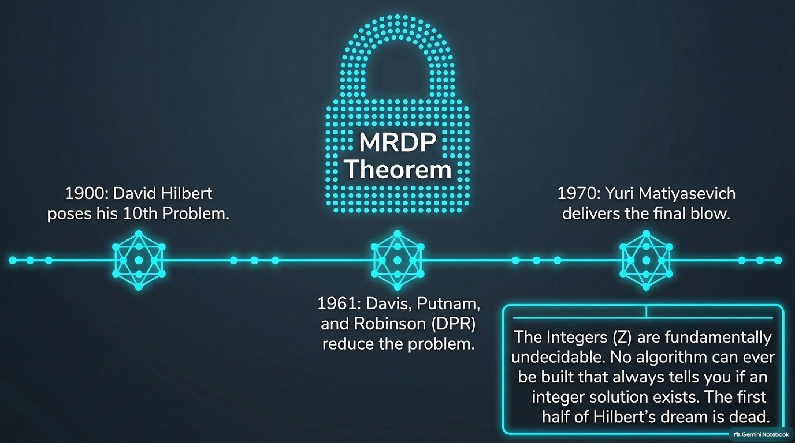

### 1.4 Why the rationals are harder

If there were a way to say "$t$ is an integer" using only polynomial equations over $\mathbb{Q}$, the integer result would transfer at once. You would replace each integer unknown by a rational unknown plus that condition. Such a condition is called a **Diophantine definition of $\mathbb{Z}$ in $\mathbb{Q}$**. Some sets *do* have one. For example, a rational number $t$ is $\ge 0$ exactly when $t = y_1^2 + y_2^2 + y_3^2 + y_4^2$ for some rationals $y_i$ (Lagrange's four-square theorem). For the integers, logicians found definitions, but only ones that also need "for all":

| Year | Who | Definition of $\mathbb{Z}$ inside $\mathbb{Q}$ |
|---|---|---|
| 1949 | **Julia Robinson** | A first-order formula using both "for all" and "there exists". Her work also shows that the full first-order theory of $\mathbb{Q}$ is undecidable |
| 2009 | **Bjorn Poonen** | Two "for all" followed by seven "there exists" |
| 2016 | **Jochen Koenigsmann** | Only "for all". Equivalently, the set of *non*-integers $\mathbb{Q}\setminus\mathbb{Z}$ is Diophantine |
| — | open | Only "there exists": a Diophantine definition. This is what the direct transfer needs |

A conjecture of **Barry Mazur** on the topology of rational points says, roughly, that sets cut out by rational solutions cannot be scattered into infinitely many separate pieces on the real line. The integers $\dots,-1,0,1,2,\dots$ are exactly such a scattered set. Mazur observed that his conjecture would rule out a Diophantine definition of $\mathbb{Z}$ in $\mathbb{Q}$. Cornelissen and Zahidi showed that it would also rule out a **Diophantine model** of the integers, a copy of integer arithmetic built from Diophantine subsets of some $\mathbb{Q}^k$. Both objects would prove undecidability, but the paper stresses that undecidability does not require either of them.

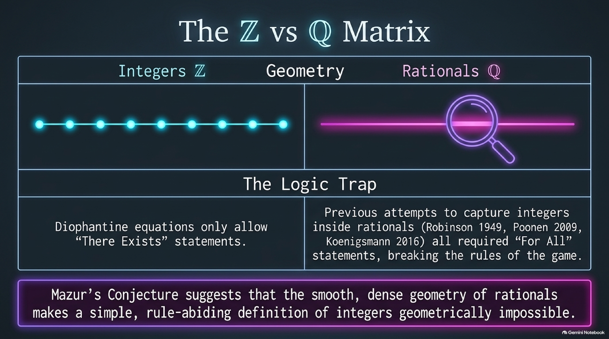

> **Another way to see the difficulty.** A rational solution of $f(x_1,\dots,x_n)=0$ is the same thing as an integer solution of a *homogeneous* equation (clear denominators with a new variable $x_0$) in which $x_0 \neq 0$. So the rational problem is the integer problem restricted to a special kind of equation. A restricted problem could, in principle, be easier, which is why the 1970 theorem does not settle it automatically.

### 1.5 The precise question

> **Hilbert's tenth problem over $\mathbb{Q}$.** Is there an algorithm which, given a polynomial $f$ with integer coefficients in any number of variables, decides whether $f$ has a zero whose coordinates are all rational numbers?

"Any number of variables" matters: the algorithm must work for polynomials in 1, 2, 1000 or more variables. The paper says the number of variables is part of the input.

---

## 2. A short history

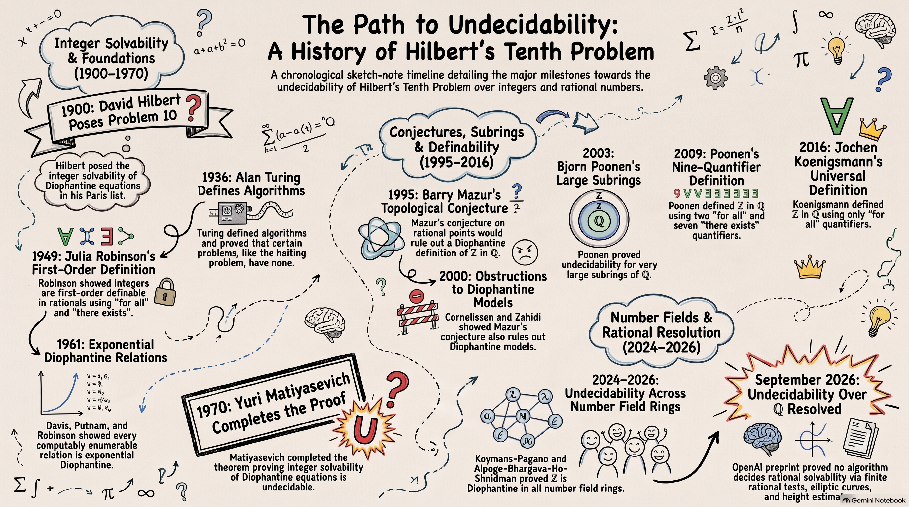

| When | Who | What happened |
|---|---|---|
| 1900 | **David Hilbert** | Problem 10 of his Paris list: find a procedure that decides whether an integer polynomial equation has an integer solution |
| 1936 | **Alan Turing** | A precise notion of algorithm, and the first problems proved to have none (background, not from the paper) |
| 1949 | **Julia Robinson** | $\mathbb{Z}$ is first-order definable in $\mathbb{Q}$; the first-order theory of $\mathbb{Q}$ is undecidable |
| 1961 | **Martin Davis, Hilary Putnam, Julia Robinson** | Every computably enumerable relation is Diophantine if exponentiation is allowed. This reduced the problem to one growth condition |
| 1970 | **Yuri Matiyasevich** | Supplied that growth through a Diophantine description of a Fibonacci relation. Integer solvability is undecidable |
| 1973 | **Martin Davis** | The survey "Hilbert's tenth problem is unsolvable", whose degree-reduction trick the paper reuses over $\mathbb{Q}$ |
| 1995 | **Barry Mazur** | Conjecture on the topology of rational points (in the form the paper cites), which would rule out a Diophantine definition of $\mathbb{Z}$ in $\mathbb{Q}$ |
| 2000 | **Gunther Cornelissen, Karim Zahidi** | Mazur's conjecture would also rule out Diophantine models of $\mathbb{Z}$ in any $\mathbb{Q}^k$ |
| 2002, 2003 | **Bjorn Poonen** | Rank-one elliptic curves transfer undecidability between rings of integers; undecidability for very large subrings of $\mathbb{Q}$ (denominators allowed at a set of primes of density one) |
| 2007 | **Cornelissen, Zahidi** | Elliptic divisibility sequences give undecidability of a fragment over $\mathbb{Q}$ with one "for all", assuming a conjecture |
| 2009 | **Poonen** | Defines $\mathbb{Z}$ in $\mathbb{Q}$ with two "for all" and seven "there exists" |
| 2010 | **Barry Mazur, Karl Rubin** | Assuming that $\dim\ \mathrm{Sha}(E/L)[2]$ is even for every elliptic curve $E$ over every number field $L$, undecidability for every infinite finitely generated ring over $\mathbb{Z}$ |
| 2016 | **Jochen Koenigsmann** | A purely universal definition of $\mathbb{Z}$ in $\mathbb{Q}$ |
| 2017 | **Kirsten Eisenträger, Russell Miller, Jennifer Park, Alexandra Shlapentokh** | Large subrings of $\mathbb{Q}$ whose Hilbert's tenth problem is exactly as hard as the one over $\mathbb{Q}$ |
| 2025 | **Natalia Garcia-Fritz, Hector Pasten, Xavier Vidaux** | Undecidability over $\mathbb{Q}$ if the language may also compare heights of rational tuples |
| 2024–2026 | **Peter Koymans, Carlo Pagano**; **Levent Alpöge, Manjul Bhargava, Wei Ho, Ari Shnidman** | $\mathbb{Z}$ is Diophantine in the ring of integers of every number field (Koymans–Pagano: undecidability for every infinite finitely generated ring over $\mathbb{Z}$). The field $\mathbb{Q}$ is not such a ring |
| Sept 2026 | **OpenAI** (internal model) | This paper: rational solvability is undecidable. The companion proves the pointwise 2-converse it uses |

---

## 3. What the paper proves

> **Main theorem (Theorem 1.1).** There is no algorithm which, given a polynomial $f\in\mathbb{Z}[X_1,\dots,X_n]$, with $n$ part of the input, decides whether $f$ has a zero in $\mathbb{Q}^n$.

In plain words: you cannot write a computer program that reads any integer polynomial and always correctly answers "does it have a solution in fractions?". In geometric language, you cannot decide in general whether a variety defined by integer equations has a rational point.

The paper also pins down exactly how hard the problem is (**Corollary 7.1**). Write $\mathrm{H10}(\mathbb{Q})$ for the set of integer polynomials that have a rational zero.

- $\mathrm{H10}(\mathbb{Q})$ has **Turing degree $0'$**, the degree of the halting problem. An oracle that answered rational-solvability questions would let you solve the halting problem, and vice versa.
- The same holds if the input is restricted to polynomials of **total degree at most 4**,
- or to sums of squares $q_1^2 + \dots + q_s^2$ of polynomials of degree at most 2, given as a list.

No bound is placed on the number of variables or on the size of the coefficients.

<details>
<summary><b>How degree 4 is enough</b> (a small example)</summary>

Over $\mathbb{Q}$, a sum of squares is zero only when every term is zero. So any system of equations can be packed into one polynomial. To bring the degree down, give every step of the computation of $f$ its own variable. For $f = x^3 - 2$:

$$Y_1 = x\cdot x,\qquad Y_2 = Y_1\cdot x,\qquad Y_2 - 2 = 0 .$$

Each equation has degree at most 2, and $f$ has a rational zero exactly when

$$(Y_1 - x^2)^2 + (Y_2 - Y_1 x)^2 + (Y_2 - 2)^2 = 0$$

has a rational solution. That polynomial has degree 4. Section 7 does this for any $f$ with an arithmetic circuit, following Davis (1973).
</details>

The heart of the paper is a statement it calls the **finite-test interface**. For each nonconstant integer polynomial $f$ the paper constructs an effectively generated sequence of finite tests, each of which can be answered by finitely many rational-solvability queries, such that

$$f\ \text{has an integer zero} \quad\Longleftrightarrow\quad \text{every test succeeds}.$$

The direction "$\Leftarrow$" is **Proposition 2.12**, and it is where almost all of the work goes.

---

## 4. Why it matters

| Question | Before | After |
|---|---|---|
| **Is integer solvability decidable?** | No (Davis–Putnam–Robinson–Matiyasevich, 1970) | Unchanged |
| **Is rational solvability decidable?** | Open | **No** (Theorem 1.1) |
| **How hard is it exactly?** | At most as hard as the halting problem, because "yes" answers can be found by search | **Exactly** as hard as the halting problem, Turing degree $0'$ |
| **Restricted inputs** | — | Polynomials of **degree at most 4** are already as hard as the general case |
| **Rings of integers of number fields** | Settled by Koymans–Pagano and Alpöge–Bhargava–Ho–Shnidman (2024–2026) | Unchanged. Those results cover finitely generated rings, and $\mathbb{Q}$ is not one |
| **Diophantine definition of $\mathbb{Z}$ in $\mathbb{Q}$** | Unknown; Mazur's conjecture predicts none exists | Still unknown. The proof doesn't need one and doesn't give one |

The deeper significance is the method. For decades, the standard route to undecidability was to build an existential copy of the integers inside the ring in question. The paper shows that for $\mathbb{Q}$ one can instead use a **Turing reduction through infinitely many finite tests**, and so avoid the definability question entirely. Along the way it proves arithmetic results that may be useful on their own:

- a **five-point height estimate** (Theorem 2.4) bounding the size of a fraction in terms of the primes where it meets five fixed points to odd order;
- a **pole-parity formula** (Proposition 2.8): an existential condition that every integer satisfies and that forces all prime-power denominators, outside a fixed finite set of primes, to have even exponent;
- in the companion, a **pointwise 2-converse** for elliptic curves with a rational point of order 2.

---

## 5. The main idea of the proof

The paper is 62 pages and the companion is 91. Here is the argument at three zoom levels.

### Level 1: the one-paragraph version

Suppose, for contradiction, that some program decides rational solvability. Take any integer equation $f = 0$ and run two searches side by side. **Search A** plugs in integer tuples, looking for a solution. **Search B** builds an endless list of finite systems of rational equations ("tests") from $f$ and asks the program about each one, looking for a test that fails. An integer solution passes every test, so if Search B finds a failure, the answer "no integer solution" is correct. The paper's main work is to show the converse: if every single test passes, then $f$ really has an integer solution. So exactly one search always stops, with the right answer. That would be an algorithm for *integer* equations, which is impossible. So no program can decide rational solvability.

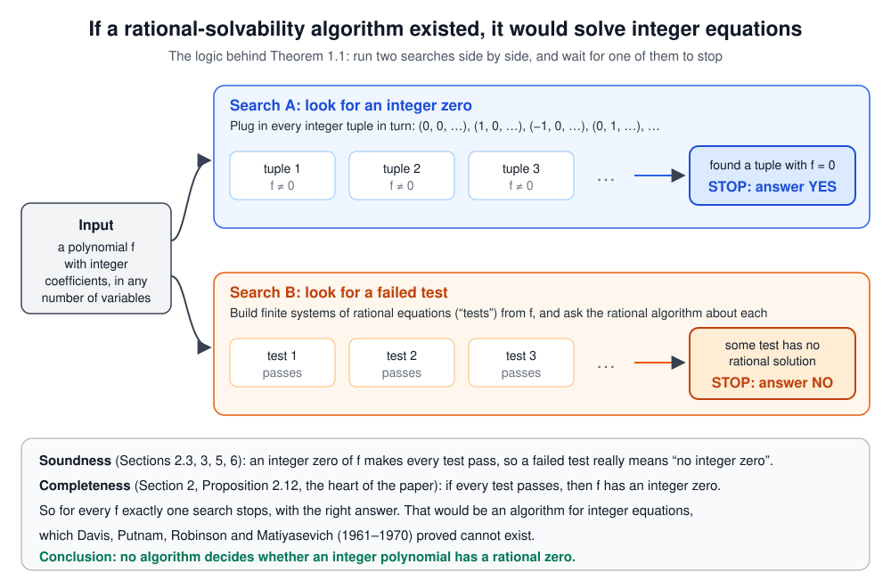

> **Analogy.** Imagine a number that *claims* to be a whole number. Each number must wear a badge: a point on an elliptic curve whose serial number adds up correctly when numbers are added. The tests can't check the serial numbers of products directly. Instead, at many primes, they check that the number agrees with its serial number in the last $K$ "digits" in base $q$. If an impostor root passes all of this, its serial numbers almost satisfy the equation, and their error is divisible by huge powers of many primes. A new inequality turns that into "every number in sight is fairly simple". But a badge's complexity grows like the *square* of its serial number. Linear can't beat quadratic for long, so the serial numbers are small, and the impostor turns out to be a genuine whole number.

### Level 2: the step-by-step picture

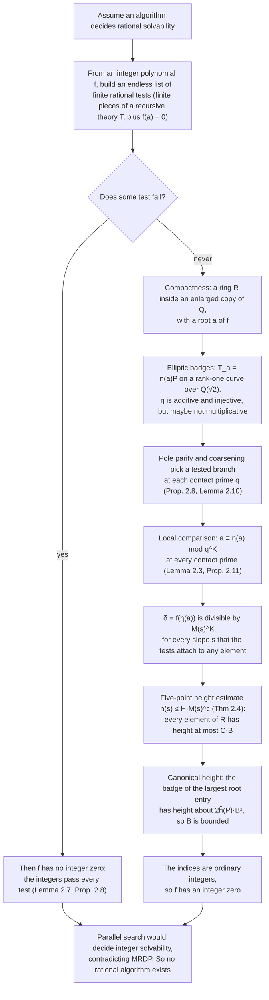
```mermaid
flowchart TD
    A["Assume an algorithm decides rational solvability"] --> B["From an integer polynomial f, build an endless list of<br/>finite rational tests (finite pieces of a recursive theory T, plus f(a) = 0)"]
    B --> C{"Does some test fail?"}
    C -->|"yes"| D["Then f has no integer zero:<br/>the integers pass every test (Lemma 2.7, Prop. 2.8)"]
    C -->|"never"| E["Compactness: a ring R inside an enlarged copy of Q,<br/>with a root a of f"]
    E --> F["Elliptic badges: T_a = η(a)P on a rank-one curve over Q(√2).<br/>η is additive and injective, but maybe not multiplicative"]
    F --> G["Pole parity and coarsening pick a tested branch<br/>at each contact prime q (Prop. 2.8, Lemma 2.10)"]
    G --> H["Local comparison: a ≡ η(a) mod q^K<br/>at every contact prime (Lemma 2.3, Prop. 2.11)"]
    H --> I["δ = f(η(a)) is divisible by M(s)^K<br/>for every slope s that the tests attach to any element"]
    I --> J["Five-point height estimate h(s) ≤ H·M(s)^c (Thm 2.4):<br/>every element of R has height at most C·B"]
    J --> K["Canonical height: the badge of the largest root entry<br/>has height about 2ĥ(P)·B², so B is bounded"]
    K --> L["The indices are ordinary integers,<br/>so f has an integer zero"]
    D --> M["Parallel search would decide integer solvability,<br/>contradicting MRDP. So no rational algorithm exists"]
    L --> M
```

**Step 1: Turn the question into finite tests (Section 2.4).** The paper writes down a recursive list of axioms $\mathcal{T}$ about a ring $R$ with extra functions, adds constants $a_1,\dots,a_n$ with $f(a_1,\dots,a_n) = 0$, and replaces every "there exists" by a function symbol (Skolemization). Each finite piece of the resulting list is a finite system of polynomial equations and "$\neq$" conditions over $\mathbb{Q}$. A condition $g \neq 0$ becomes $gy = 1$ with a new variable, and a system $g_1 = \dots = g_s = 0$ becomes $\sum g_i^2 = 0$. So each test is a finite set of rational-solvability questions. Every test also demands that every element satisfy the pole-parity formula $\Phi$ of Step 6.

**Step 2: The integers pass every test (Lemma 2.7).** In the "honest" model, $R = \mathbb{Z}$ and each integer $a$ wears the badge $T_a = aP$. Showing that all axioms hold needs real number theory. The prime patterns of Step 5 come from the Green–Tao–Ziegler theory of linear equations in primes (Lemma 6.1), and the formula $\Phi$ must hold on every integer (Section 3, which uses the companion paper).

**Step 3: Elliptic badges (Propositions 2.1 and 2.2, Section 5).** The paper fixes the elliptic curve

$$E:\ y^2 = x^3 - d^2x \quad\text{over } F = \mathbb{Q}(\sqrt2),\qquad d = 75 - 53\sqrt2 ,$$

and proves by a 2-isogeny descent that $E(F)$ has **rank one**. So, after multiplying by a fixed $m$, every point is $nP$ for a single point $P$ and a unique integer $n$. The axioms give every ring element $a$ a point $T_a$ with $T_0 = O$, $T_1 = P$ and $T_{a+a'} = T_a + T_{a'}$, and require $T_a \neq O$ when $a \neq 0$. So $T_a = \eta(a)P$ for an **index** $\eta(a)$ that is additive and injective, with $\eta(1) = 1$. Nothing forces $\eta(aa') = \eta(a)\eta(a')$, and that is the whole difficulty: the root satisfies $f(a) = 0$, but we need its *indices* to satisfy $f(\eta(a)) = 0$.

**Step 4: Read the index locally (Lemma 2.3).** Near the identity, an elliptic curve looks like ordinary addition. If a point $Q$ reduces to $O$ at a prime $q$, the **formal logarithm** $\ell$ satisfies $\ell(z(nQ)) = n\cdot\ell(z(Q))$. The tests use a truncated version $\ell_K$, a fixed polynomial, so that a ratio of two badge values recovers a ratio of indices to precision $q^K$. Each test is paired with a second comparison on the conjugate curve $E^\sigma$ (swap $\sqrt2 \mapsto -\sqrt2$). That comparison uses only additivity: it forces $q^K$ to divide $\eta((h-4)a)$, so $\eta(ha) \equiv 4\eta(a)$ and $\eta(h) \equiv 4$ modulo $q^K$. Together the two comparisons give

$$\widetilde a \ \text{is } q\text{-integral and}\quad v_q\big(\widetilde a - \eta(a)\big) \ge K \qquad\text{for every } a \in R .$$

In words, each element agrees with its index in the last $K$ base-$q$ "digits".

**Step 5: Where to read: contact primes and the height estimate (Theorem 2.4).** The paper fixes five rational points of the projective line, with linear forms $L_b$ vanishing at them. For a fraction $s = u/v$, a prime $q$ is a **contact prime** if, at $q$, some $L_b(u,v)$ has odd order, after removing the common factor of $u$ and $v$. Let $M(s)$ be the product of the contact primes outside a fixed finite set. The new **five-point height estimate** says

$$h(s) \le H\cdot M(s)^c$$

for fixed constants $H, c$, where $h$ is the logarithmic height (roughly proportional to the number of digits of $u$ and $v$). A fraction can only be complicated if it touches the five points to odd order at large primes. The tests write every ring element as a sum of three fractions $A = u_1/v + u_2/v + u_3/v$ (the "slopes") and require each of the 13 contact values to be $\pm k\cdot r$, with $k$ from a fixed finite set and $r$ prime-like. For actual integers, such representations exist by the prime-pattern Lemma 6.1.

**Step 6: Control the denominators (Proposition 2.8, Section 3).** The imaginary ring $R$ from Step 1 can contain fractions. To make the local tests line up with genuine primes, the paper needs a **positive existential formula** $\Phi(b)$ that every integer satisfies, and that forces every prime-power denominator of $b$ outside a finite set $S_1$ to have *even* exponent. The formula asks for rational points, with $x$-coordinate in a prescribed square class, on two curves of the form $E_l: y^2 = x(x - l)(x + 3l)$. Even exponents then let a valuation-coarsening argument (Lemma 2.10) match each contact prime with one of the two tested branches.

**Step 7: The squeeze (Proposition 2.12).** Put $\delta = f(\eta(a_1),\dots,\eta(a_n))$ and $B = \max(1, \lvert\eta(a_j)\rvert)$.

- If $\delta = 0$, the indices already form an integer zero, and by elementarity an ordinary one exists.
- Otherwise $\delta$ is a nonzero integer of size at most $C_f B^D$, where $D$ is the degree of $f$. By Step 4, $\delta \equiv f(\widetilde a) = 0$ modulo $q^K$ at every contact prime, so $M(s_i)^K$ divides $\delta$ for every slope. Choosing $K \ge cD$ makes $M(s_i)^c \le \lvert\delta\rvert^{c/K} \ll B$. The height estimate then gives $h(\widetilde A) \ll B$ **for every element $A$ of $R$**, with one constant.
- Apply this to the coordinates of the badge of the largest root entry: $h\big(x(\eta(a_j)P)\big) \ll B$. But canonical-height theory says $h(x(nP)) = 2\hat h(P)\ n^2 + O(1)$. So $B^2 \ll B$, and $B$ is bounded by an ordinary number.

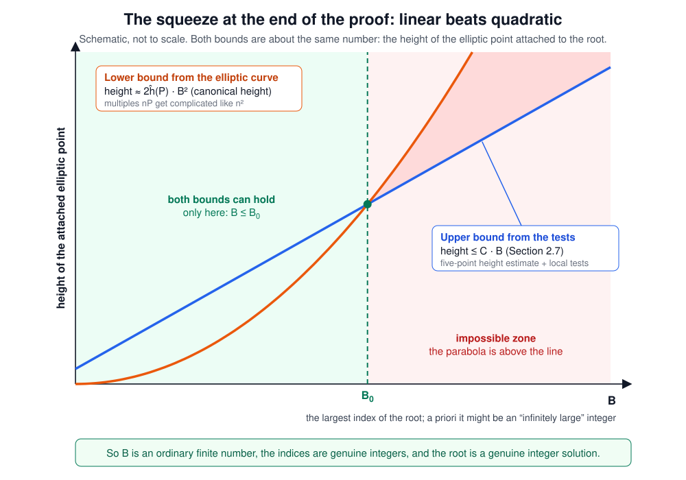

A bounded index is an ordinary integer. By additivity and injectivity each $a_j$ equals its index, so the root is a genuine integer solution. That completes the converse and the proof.

<details>
<summary><b>Worked example: why badges grow quadratically</b> (exact computation)</summary>

The paper's curve lives over $\mathbb{Q}(\sqrt2)$, but the phenomenon is easiest to see on a curve over $\mathbb{Q}$. Take $y^2 = x^3 - 25x$ and the point $P = (-4, 6)$ (check: $(-4)^3 - 25\cdot(-4) = 36 = 6^2$). Computing multiples $nP$ with the chord-and-tangent rule, in exact fractions:

| $n$ | $x(nP)$ | digits (top / bottom) | $h = \log\max(\lvert\text{top}\rvert, \text{bottom})$ | $h/n^2$ |
|---|---|---|---|---|
| 1 | $-4$ | 1 / 1 | 1.39 | 1.39 |
| 2 | $1681/144$ | 4 / 3 | 7.43 | 1.86 |
| 3 | $-2439844/5094049$ | 7 / 7 | 15.44 | 1.72 |
| 4 | $11183412793921/2234116132416$ | 14 / 13 | 30.05 | 1.88 |
| 5 | (20 digits) / (20 digits) | 20 / 20 | 45.82 | 1.83 |
| 10 | (83 digits) / (82 digits) | 83 / 82 | 189.76 | 1.90 |

The height settles at about $1.9\ n^2$: doubling $n$ roughly quadruples the number of digits. This is the lower bound in Step 7. Something whose complexity is at most a constant times $B$ cannot be the $B$-th multiple of $P$ once $B$ is large.

A small check on the parity theme: every denominator in the table is a perfect square ($144 = 12^2$, $5094049 = 2257^2$, …). On curves with integer coefficients like these, an odd power of a prime cannot appear in the denominator of $x$. For example, on $y^2 = x(x-1)(x+3)$, the value $x = 6/5$ gives $x(x-1)(x+3) = 126/125$, and $125 = 5^3$ has an odd exponent, so $126/125$ is not the square of a fraction. The formula $\Phi$ in Step 6 turns exactly this kind of valuation argument (Lemma 3.1) into a condition on $b$.
</details>

### Level 3: the arithmetic engine, for readers with background

**Logic.** The ambient structure is many-sorted: $\mathbb{Q},\mathbb{Z},\mathbb{R},F$ with prime and valuation relations, height functions, the elliptic multiple maps and finite-product functions. If every finite test succeeds, compactness (Lemma 2.9) embeds a model $R$ of $\mathcal{T}$ with a root of $f$ into the rational sort of an elementary extension. Its integer sort $^{\ast}\mathbb{Z}$ may contain nonstandard integers, and the indices $\eta(a)$ live there. Facts about integer multiples of the fixed points $P, P^\sigma$ and evaluations of the polynomials $\ell_K$ transfer to the extension; no infinite series is evaluated there. The pole-parity condition is what makes Lemma 2.10 work. It coarsens the $q$-adic valuation by the convex subgroup generated by the negative values on $R$. Every such value is even, so the odd value of the factor $r$ survives positively. The center of the coarsened valuation is then one of the two tested branch ideals $\mathfrak p_\pm$, because $R_F/rR_F \simeq (R/rR)^2$.

**The five-point height estimate (Section 4).** The five points are the branch values of a quotient map. Start with the Shimura curve $X$ (of genus 5) attached to the indefinite quaternion algebra $B/\mathbb{Q}$ of discriminant $210 = 2\cdot3\cdot5\cdot7$, and divide by its Atkin–Lehner group $(\mathbb{Z}/2)^4$. The quotient is $\mathbb{P}^1$ over $\mathbb{Q}$, with exactly five branch values, labelled $30, 42, 70, 105, 210$. A finite cover $Y \to \mathbb{P}^1$, ramified to index two exactly above them, carries principally polarized abelian surfaces with quaternionic multiplication. Outside fixed primes, the local equation is $t = z^2$, so only *odd* contact can ramify the field of definition of a fiber (Lemma 4.1). Fibers above a rational point are isogenous to their Galois conjugates. CM fibers have bounded height. Otherwise a controlled splitting of the isogeny obstruction yields a two-dimensional odd $2$-adic Galois representation. The OpenAI preprint *Fontaine–Mazur modularity at the prime 2* (family 010) makes it modular, with a weight-two newform whose level is at most a fixed power of $M(s)$ (Lemma 4.7). The surface is then an isogeny factor of $J_1(N)$ over a field of degree $O(M(s))$ (Lemma 4.8). Following a strategy of von Känel, Faltings-height bounds and the Gaudron–Rémond isogeny theorem give $h_F(A) \le CM^C$. Comparing Faltings height with base height (Lemma 4.2) gives $h(s) \le HM(s)^c$.

**Pole parity and the companion (Section 3).** For an integer $b$, the paper must produce rational points on $E_e$ and $E_{eH'}$ with prescribed $x$-coordinate square class $\beta$. A full 2-descent with Rédei-matrix conditions makes $\dim_{\mathbb{F}_2}\mathrm{Sel}_2(E_l/\mathbb{Q}) = 3$ (Lemma 3.3). With full rational two-torsion this means $\mathrm{rank}\ E_l(\mathbb{Q}) + \dim\ \mathrm{Sha}(E_l/\mathbb{Q})[2] = 1$, so the $2^\infty$-Selmer corank is at most one. **This is where the companion enters (Lemma 3.4).** Its Theorem 1.1 says: if $E/\mathbb{Q}$ has a rational point of order 2 and $2^\infty$-Selmer corank 0 or 1, then the analytic rank and the Mordell–Weil rank both equal that corank, and $\mathrm{Sha}(E/\mathbb{Q})$ is finite. With $\mathrm{Sha}$ finite, the Cassels–Tate pairing is perfect and alternating, so $\dim\ \mathrm{Sha}[2]$ is even, hence zero, and the rank is one. The Selmer class $(\beta,1)$ then comes from a genuine rational point. (Remark 3.5: the unrestricted 2-converse of family 006 could be used instead.) The companion itself combines Kato's zeta classes, Heegner points with Kolyvagin–Howard Euler-system arguments, Selmer complexes and Waldspurger-type coefficient tests, using integral interpolation over binary families of quadratic twists to control the prime 2 without residual-irreducibility hypotheses.

**Prime patterns (Section 6).** For every integer $A$, the paper needs $u_1, u_2, v$ with all 13 numbers $v$ and $L_b(u_i, v)$ equal to $\pm k\cdot r$ with large primes $r$ that split in $\mathbb{Q}(\sqrt2)$, have good reduction for $E$ and $E^\sigma$, and satisfy $\gcd(d_1,d_2) \mid 4$ and $r \nmid d_1d_2$ for the two reduction orders $d_1, d_2$. That gcd condition is what lets the Chinese remainder theorem pick $h \equiv 0 \pmod{d_1}$ and $h \equiv 4 \pmod{d_2 r^K}$ for the paired tests (Corollary 6.2). Existence comes from Green–Tao's linear equations in primes, with the Möbius–nilsequence theorem and the Green–Tao–Ziegler inverse theorem, plus explicit sieves.

---

## 6. The people whose ideas this builds on

| Person | Idea | Where it shows up in the proof |
|---|---|---|
| **David Hilbert** | Posed the problem (1900) | The whole question |
| **Martin Davis, Hilary Putnam, Julia Robinson, Yuri Matiyasevich** | Every computably enumerable set is Diophantine; integer solvability is undecidable | The contradiction in the last line of the proof; Davis's 1973 survey for the degree-4 form |
| **Julia Robinson; Bjorn Poonen; Jochen Koenigsmann** | Definitions of $\mathbb{Z}$ in $\mathbb{Q}$ with "for all" | The background the paper contrasts itself with |
| **Barry Mazur; Gunther Cornelissen, Karim Zahidi** | Topology of rational points; Diophantine models | Why the obvious route is blocked; the definition of a Diophantine model |
| **Bjorn Poonen** | Rank-one elliptic curves; reading indices from denominators and formal groups | Precedent for the badges and the local index comparison (Section 5) |
| **Barry Mazur, Karl Rubin; Peter Koymans, Carlo Pagano; Alpöge, Bhargava, Ho, Shnidman** | Elliptic curves and twists for rings of integers | The number-field program the paper places itself next to |
| **Jeroen Demeyer, Jan Van Geel** | Existential formulas controlling odd valuations | Precursor of the pole-parity formula $\Phi$ |
| **J. W. S. Cassels, John Tate** (with Poonen–Stoll) | The Cassels–Tate pairing, and when it is alternating | Forces $\dim\ \mathrm{Sha}[2]$ to be even in Section 3 |
| **László Rédei; Tao Wei, Xuejun Guo** | Rédei matrices; their 2-Selmer matrix formulation for the family $y^2 = x(x-n)(x+3n)$ | The Selmer-rank calculation in Section 3 |
| **Ben Green, Terence Tao, Tamar Ziegler** | Linear equations in primes; inverse theorem for Gowers norms | The prime-pattern Lemma 6.1 |
| **Pierre Deligne** | Canonical models of Shimura varieties | The discriminant-210 Shimura curve and its abelian surfaces |
| **Gerd Faltings** | Isogeny and semisimplicity theorems; Faltings height | Section 4, throughout |
| **Kenneth Ribet; Rafael von Känel; Levent Alpöge** | Abelian varieties of GL₂-type; height bounds via modularity | The modular-factor step of the height estimate |
| **Éric Gaudron, Gaël Rémond** | Quantitative isogeny and period theorems | Bounding the Faltings height in Section 4 |
| **Darren Long, Colin Maclachlan, Alan Reid; Joan Nualart Riera** | Tabulated the genus-zero Atkin–Lehner quotient of discriminant 210 | The five branch points |
| **Joseph Silverman** | Standard references for descent, formal groups and canonical heights | Sections 3 and 5, and the quadratic height growth |

---

## 7. What it does not prove, and caveats

> [!IMPORTANT]
> **No Diophantine definition of $\mathbb{Z}$ in $\mathbb{Q}$.** The reduction is a *Turing* reduction from integer solvability. It gives no single existential definition of $\mathbb{Z}$ in $\mathbb{Q}$ and no Diophantine model, so it does not resolve Mazur's conjecture either way. The paper notes that undecidability never required either object. It also does not show that $\mathrm{H10}(\mathbb{Q})$ is complete under the stricter many-one reductions. It gives no bound on the number of variables or on coefficient sizes, and it addresses only the field $\mathbb{Q}$.

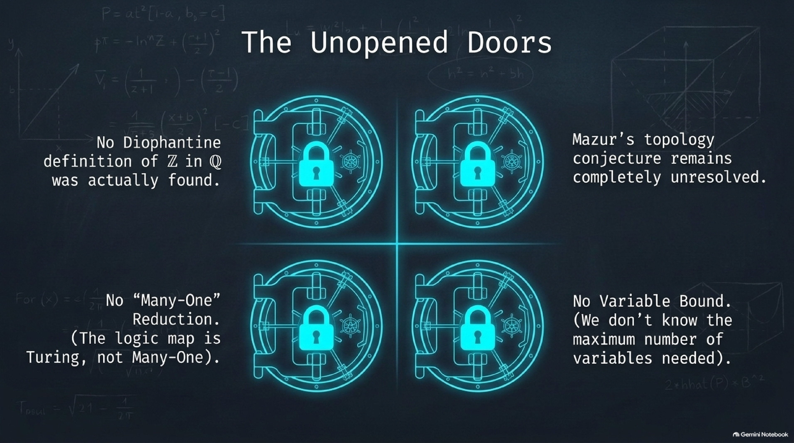

> [!NOTE]
> **Provenance.** The paper and its companion were produced by an unreleased internal OpenAI model as part of the [openai/math](https://github.com/openai/math) release. According to that repository's README, the vast majority of results came from one fixed procedure, using on average about three hours of ChatGPT Pro thinking compute per result. The exceptions it names are the zeta zero-free work and the Hodge conjecture for CM abelian varieties; this paper is not among them.

> [!WARNING]
> **Verification status.** openai/math lists **no Lean formalization** for family 004. There is no `lean/docs/004.md`, and neither paper appears in `lean/formalization.yaml` (checked 7 October 2026). The repository's README warns that "some of the unformalized results could have issues". The proof also depends on two other unformalized OpenAI preprints: the companion's pointwise 2-converse (or, by Remark 3.5, the 2-converse of family 006) and *Fontaine–Mazur modularity at the prime 2* (family 010). This explainer did not check the proofs. As of October 2026 the result is a preprint; the usual next step is independent review by experts.

> [!TIP]
> **Simplifications.** To stay readable, this explainer ignores the fixed finite sets of excluded primes, the multiplier set $\mathcal K$, the Skolem functions, the two residue branches above each split prime, and the exact constants. The reduction also hardcodes finitely many fixed constants and finite sets; the paper notes that their existence is enough, and no search for them is needed. Every precise statement is in the paper.

---

## 8. Glossary

| Term | Meaning |
|---|---|
| **Diophantine equation** | A polynomial equation with integer coefficients |
| **Rational number** $\mathbb{Q}$ | A fraction $u/v$ of integers with $v\neq0$ |
| **Algorithm; decidable** | A finite recipe that always stops; a yes/no question is decidable if some algorithm always answers it correctly |
| **Computably enumerable** | A set whose members can be listed by a program. "Yes" answers can be confirmed by search |
| **Halting problem** | Deciding whether a given program ever stops. Turing proved it undecidable |
| **Turing reduction; Turing degree $0'$** | Solving one problem with an oracle for another. $0'$ is the difficulty of the halting problem |
| **Diophantine set / definition** | A set described as "the parameters for which some polynomial equation has a solution", using only "there exists" |
| **Diophantine model** | A copy of integer arithmetic built from Diophantine subsets of some $\mathbb{Q}^k$ |
| **Quantifiers** | "For all" ($\forall$) and "there exists" ($\exists$). Robinson, Poonen and Koenigsmann's definitions of $\mathbb{Z}$ in $\mathbb{Q}$ need $\forall$ |
| **Mazur's conjecture** | The closure of the rational points of a variety in its real points has finitely many connected pieces. It would forbid a Diophantine definition of $\mathbb{Z}$ in $\mathbb{Q}$ |
| **Compactness theorem** | If every finite part of a list of first-order conditions can be satisfied, the whole list can, in some (possibly larger) structure |
| **Elementary extension; nonstandard integers** | A larger structure satisfying the same first-order statements; its integers can include "infinitely large" ones |
| **$q$-adic valuation** $v_q$ | The exponent of the prime $q$ in a fraction: $v_5(6/125) = -3$ |
| **Height** $h$ | Size of a fraction: $h(u/v) = \log\max(\lvert u\rvert, \lvert v\rvert)$ in lowest terms |
| **Elliptic curve; rank** | A curve $y^2 = x^3 + ax + b$ whose points form a group; rank one means every point is (up to finite error) a multiple of one point $P$ |
| **Index** $\eta(a)$ | The integer $n$ with $T_a = nP$: the "serial number" on an element's badge |
| **Formal logarithm** | A power series that turns the elliptic group law near the identity into ordinary addition |
| **Canonical height** $\hat h$ | A height on an elliptic curve with $\hat h(nP) = n^2\hat h(P)$ |
| **Contact prime** | A prime at which a fraction meets one of the five fixed points to odd order |
| **Selmer group; Shafarevich–Tate group** Sha | The Selmer group is a computable group that contains the rational points of an elliptic curve modulo 2 (or modulo powers of 2); Sha measures the gap between the two |
| **Cassels–Tate pairing** | A pairing on Sha; when Sha is finite it is perfect and, here, alternating, so $\dim\ \mathrm{Sha}[2]$ is even |
| **2-converse** | A theorem going from Selmer-group information at the prime 2 to the analytic rank (the companion's subject) |
| **Shimura curve** | A curve whose points classify abelian surfaces with quaternionic multiplication |
| **Modularity** | Matching a Galois representation with a modular form, as in the proof of Fermat's Last Theorem |
| **Faltings height** | A measure of the arithmetic complexity of an abelian variety |
| **Lean 4** | A proof assistant: software that mechanically checks every logical step of a proof |

---

## 9. Slides, audio and other assets

Everything below except the two hand-made figures was generated with **Google NotebookLM** (now "Gemini Notebook") from the paper, the companion and the Wikipedia article on Hilbert's tenth problem. The report and the mind map used only the two papers. The outputs are kept exactly as NotebookLM produced them. They are AI-generated and contain mistakes, so see the [errata](assets/README.md#errata) before relying on any detail.

| Asset | What it is |
|---|---|
| [Slide deck (PDF)](assets/notebooklm/slides.pdf) · [PPTX](assets/notebooklm/slides.pptx) | 15-slide beginner deck. Several slides, notably 6, 8, 9, 10, 11 and 15, contain errors listed in the errata |
| [Infographic: overview](assets/notebooklm/infographic-overview.png) | The one-page summary shown at the top. Several typos, including ℤ printed as "2" |
| [Infographic: history timeline](assets/notebooklm/infographic-history-timeline.png) | From Hilbert (1900) to September 2026 |
| [Audio overview (≈1.5 min)](assets/notebooklm/audio-overview-brief.m4a) | A short podcast-style summary (not reviewed) |
| [Beginner report](assets/notebooklm/beginner-explainer-report.md) | NotebookLM's long-form written explainer |
| [Mind map](assets/notebooklm/mindmaps.md) | NotebookLM's map of the two papers. It is very sparse: four nodes, no proof steps |
| [Two-searches figure](assets/figures/two-searches.svg) | Hand-made diagram of the reduction logic (section 5, level 1) |
| [Squeeze figure](assets/figures/squeeze.svg) | Hand-made schematic of the final height contradiction (section 5, level 2) |

<details>
<summary><b>All 15 slides</b> (click to expand)</summary>

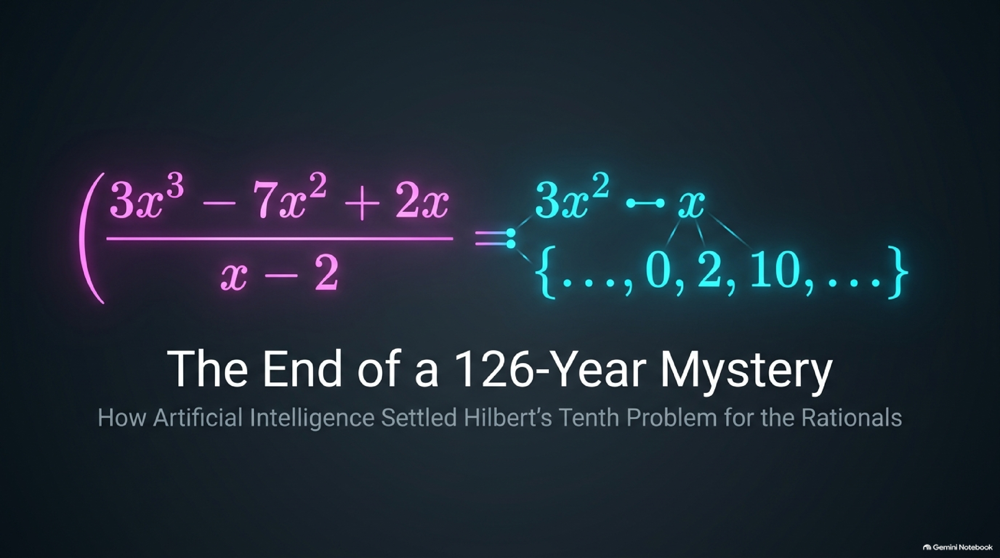

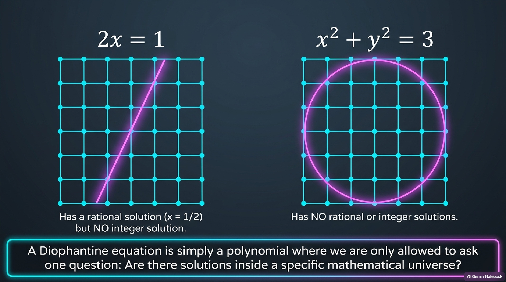


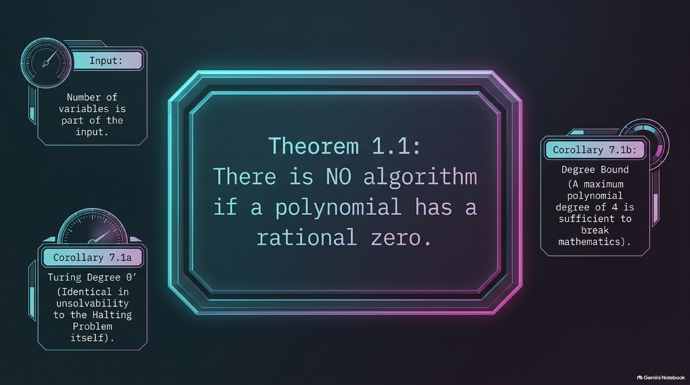

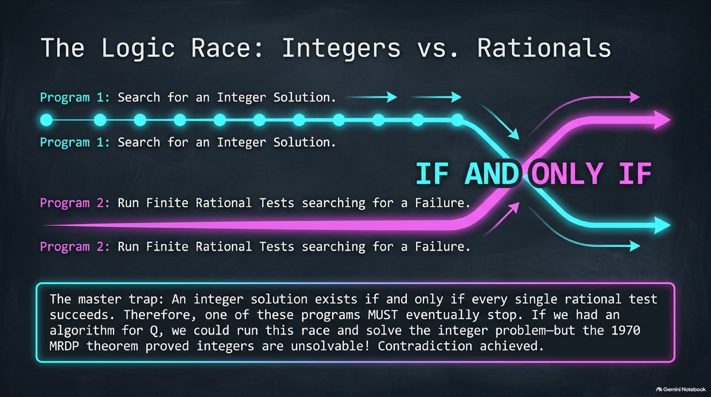

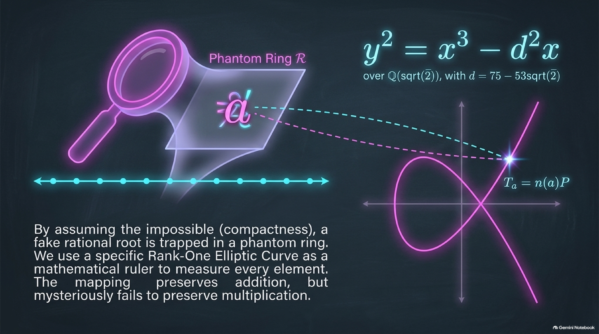

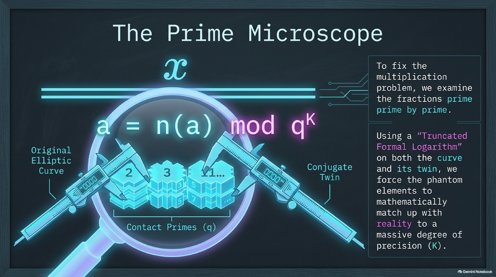

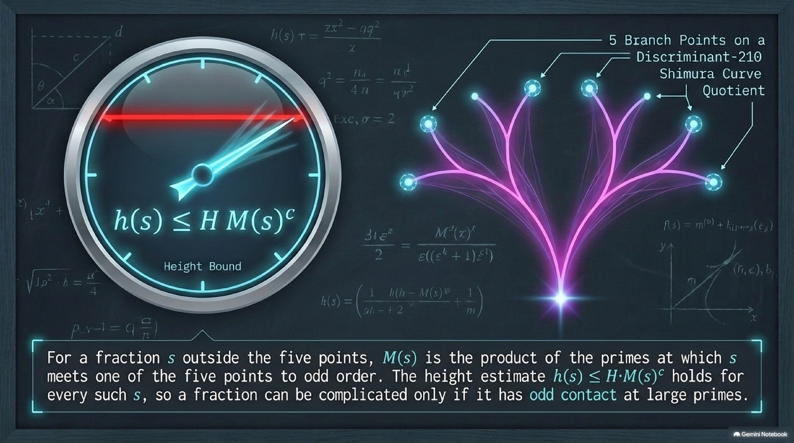

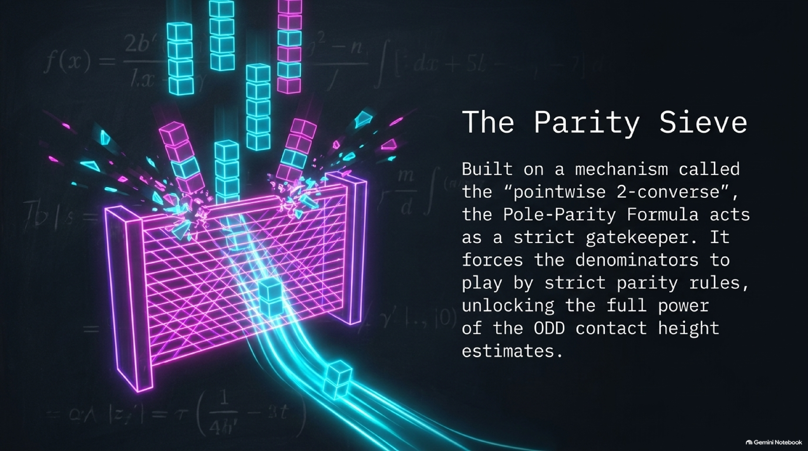

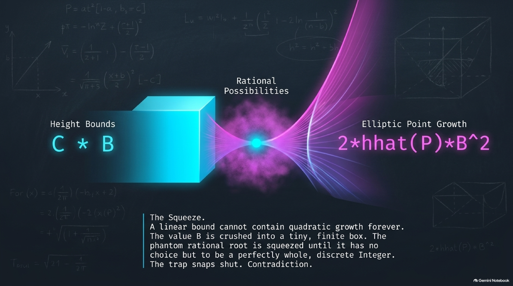


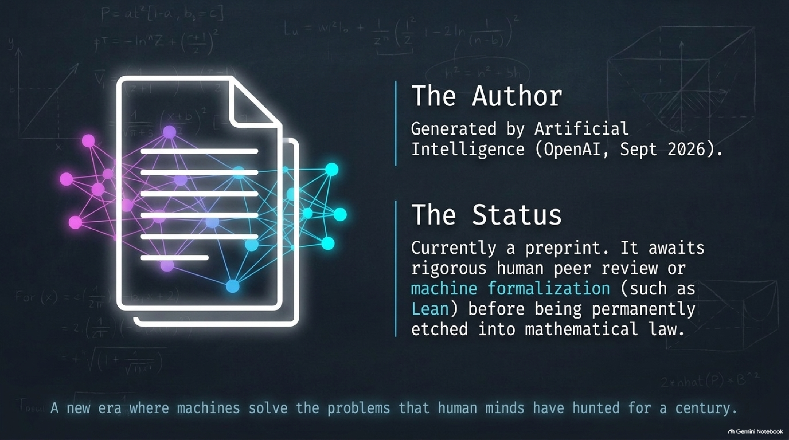

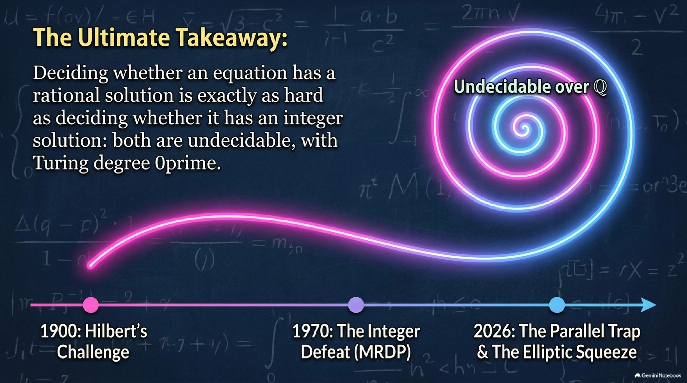

</details>

---

## How this explainer was made

1. The paper, its TeX source and the companion were downloaded from [openai/math](https://github.com/openai/math/tree/main/preprints). The Lean catalogue was checked for family 004 and nothing was found.
2. They were loaded into a NotebookLM notebook through the [`notebooklm-mcp-cli`](https://github.com/jacob-bd/gemini-notebook-mcp-cli) MCP/CLI, together with the Wikipedia article on Hilbert's tenth problem for background. NotebookLM generated the slides, infographics, report, mind map and audio in [`assets/notebooklm/`](assets/notebooklm/).
3. The text on this page was written by hand (with AI assistance) directly from the paper's introduction, its Section 2 reduction, the statements in Sections 3–7, and the companion's introduction. The worked example was computed exactly with Python fractions. NotebookLM's outputs contain mistakes, listed in the [errata](assets/README.md#errata), so they were used as visual and structural aids rather than as the source of truth.

See [`PIPELINE.md`](../../PIPELINE.md) for the exact, repeatable steps.

*Citation for the underlying paper:*

```bibtex
@misc{OAI:Hilberts-tenth-problem-over-the-rational-numbers-September-24-2026,
  author = {{OpenAI}},
  title = {{Hilbert's tenth problem over the rational numbers}},
  howpublished = {OpenAI Math Release preprint
                  \href{https://github.com/openai/math/blob/main/preprints/Hilberts-tenth-problem-over-the-rational-numbers-September-24-2026/main.pdf}{OAI:Hilberts-tenth-problem-over-the-rational-numbers-September-24-2026}},
  year = {2026}
}
```
