# Matrix multiplication with exponent at most 9/4, explained for beginners

> - **Paper:** [*An Upper Bound of 9/4 for the Matrix Multiplication Exponent*](https://github.com/openai/math/blob/main/preprints/Matrix-Multiplication-Nine-Fourths-October-2-2026/paper.pdf), OpenAI, 2 October 2026 (13 pages)
> - **openai/math family:** 107, *Matrix multiplication with exponent at most 9/4* · **Field:** algebraic complexity theory (theoretical computer science)
> - **Companions:** [Complex Matrix Multiplication Below 2.258 and Rectangular Bounds](https://github.com/openai/math/blob/main/preprints/Complex-Matrix-Multiplication-Below-2.258-and-Rectangular-Bounds-September-24-2026/Complex-Matrix-Multiplication-Below-2.258-and-Rectangular-Bounds-September-24-2026.pdf) (24 Sep 2026) · [Staggered extraction for exact matrix multiplication over every field](https://github.com/openai/math/blob/main/preprints/Staggered-extraction-for-exact-matrix-multiplication-over-every-field-September-24-2026/Staggered-extraction-for-exact-matrix-multiplication-over-every-field-September-24-2026.pdf) (24 Sep 2026)
> - **Formal proof:** the bound $\omega \le 9/4$ over the complex numbers is listed as formalized in Lean 4 ([scope](https://github.com/openai/math/blob/main/lean/docs/107.md))
> - **Who this is for:** programmers who know big-O notation and have written the triple loop for matrix multiplication. No algebra beyond matrices and polynomials is assumed.

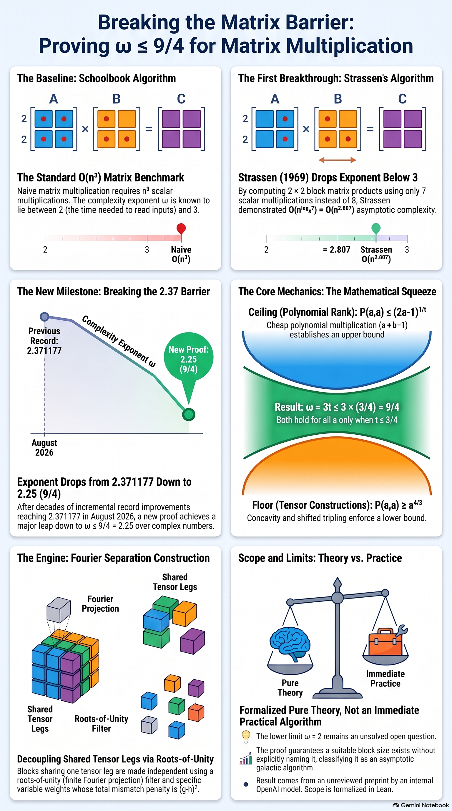

## Contents

- [TL;DR](#tldr)
- [How to read this](#how-to-read-this)
- [1. The problem](#1-the-problem)
- [2. A short history](#2-a-short-history)
- [3. What the paper proves](#3-what-the-paper-proves)
- [4. Why it matters](#4-why-it-matters)
- [5. The main idea of the proof](#5-the-main-idea-of-the-proof)
- [6. The people whose ideas this builds on](#6-the-people-whose-ideas-this-builds-on)
- [7. What it does not prove, and caveats](#7-what-it-does-not-prove-and-caveats)
- [8. Glossary](#8-glossary)
- [9. Slides, audio and other assets](#9-slides-audio-and-other-assets)
- [How this explainer was made](#how-this-explainer-was-made)

---

## TL;DR

- **The question.** The schoolbook triple loop multiplies two $n\times n$ matrices with $n^3$ multiplications. The **matrix multiplication exponent** $\omega$ is the best possible power: the fastest algorithms use about $n^{\omega}$ arithmetic operations. We know $2 \le \omega \le 3$, and most researchers expect $\omega = 2$.
- **What was known.** Strassen's 1969 trick (7 multiplications instead of 8 for $2\times 2$ blocks) gave $\omega < 2.81$. By 1990, Coppersmith and Winograd had reached $2.3755$. The next 36 years of hard work moved the record only to $2.371177$ (Dupont et al., 2026).
- **What this paper proves.** $\omega \le 9/4 = 2.25$ over the complex numbers: for every $\varepsilon > 0$, two $n\times n$ complex matrices can be multiplied with $O_\varepsilon(n^{9/4+\varepsilon})$ arithmetic operations.
- **How.** It does not write down a faster algorithm. It uses Strassen's theory of tensor *characters*, consistent "meters" for the cost of bilinear computations, and shows that none of them can rate matrix multiplication above $n^{9/4}$. It does this by playing matrix multiplication off against **polynomial multiplication**, which is known to be cheap. The whole proof fits in 13 pages.
- **What it doesn't do.** It does not prove $\omega = 2$, and it is not a practical algorithm: the proof shows that a suitable fixed block size exists but never says what it is. It is an unreviewed preprint written by an AI model, although the bound is listed as formalized in Lean.

## How to read this

| You have… | Read |
|---|---|
| 2 minutes | The TL;DR and the infographic above |
| 15 minutes | Sections 1–4 and 7 |
| An hour, and you like algorithms | Everything, including [section 5](#5-the-main-idea-of-the-proof) and the worked example inside it |

---

## 1. The problem

### 1.1 The schoolbook algorithm costs n³

The definition of the product $C = AB$ of two $n\times n$ matrices is a triple loop:

```python
for i in range(n):
    for j in range(n):
        for k in range(n):
            C[i][j] += A[i][k] * B[k][j]
```

That is $n^3$ scalar multiplications and about as many additions, so the cost is $\Theta(n^3)$. Any algorithm has to at least read the $2n^2$ input entries and write the $n^2$ output entries, so nothing can beat order $n^2$. The whole field lives in the gap between $n^2$ and $n^3$.

### 1.2 Strassen's trick: 7 multiplications instead of 8 (a worked calculation)

Split each matrix into four $n/2 \times n/2$ blocks. The schoolbook rule needs 8 block products ($C_{11} = A_{11}B_{11} + A_{12}B_{21}$, and so on). In 1969 Volker Strassen found a way to do it with **7**:

```math
\begin{aligned}
M_1 &= (A_{11}+A_{22})(B_{11}+B_{22}) & M_5 &= (A_{11}+A_{12})\,B_{22}\\
M_2 &= (A_{21}+A_{22})\,B_{11}        & M_6 &= (A_{21}-A_{11})(B_{11}+B_{12})\\
M_3 &= A_{11}\,(B_{12}-B_{22})        & M_7 &= (A_{12}-A_{22})(B_{21}+B_{22})\\
M_4 &= A_{22}\,(B_{21}-B_{11})        &     &
\end{aligned}
```

```math
C_{11} = M_1+M_4-M_5+M_7,\qquad C_{12} = M_3+M_5,\qquad C_{21} = M_2+M_4,\qquad C_{22} = M_1-M_2+M_3+M_6 .
```

(You can check these by expanding, or by running them on random integer matrices; we did.) The price is 18 block additions and subtractions instead of 4, but additions of $n/2\times n/2$ blocks cost only $O(n^2)$. Applying the trick recursively to the blocks gives the recurrence

$$T(n) = 7\ T(n/2) + O(n^2) \quad\Longrightarrow\quad T(n) = O(n^{\log_2 7}) \approx O(n^{2.807}).$$

| $n = 2^k$ | Schoolbook multiplications $8^k$ | Strassen multiplications $7^k$ |
|---|---|---|
| $2$ | 8 | 7 |
| $4$ | 64 | 49 |
| $8$ | 512 | 343 |
| $1024$ | 1,073,741,824 | 282,475,249 |

**The general lesson** is the engine behind every result in this field, including this paper. If you can multiply $u\times u$ matrices with $r$ multiplications, and the recipe never relies on the entries commuting (so that it still works when the entries are themselves matrix blocks), then recursion gives exponent $\log_u r$. Strassen's case is $u = 2$, $r = 7$. The last paragraph of the paper's proof is exactly this recursion: $S(N) \le r\ S(N/u) + C_{u,r}(N/u)^2$.

### 1.3 Tensors and tensor rank: counting multiplications

To reason about "the fewest multiplications", researchers encode matrix multiplication as a polynomial with one term per scalar product $a_{ij}b_{jk}$ that contributes to $c_{ik}$:

```math
T_n \;=\; \sum_{i,j,k=1}^{n} x_{ij}\, y_{jk}\, z_{ki}.
```

This is a **tensor** (a trilinear form). Its three groups of variables, the $x$'s, $y$'s and $z$'s, are called its three **legs**. The schoolbook algorithm writes $T_n$ as $n^3$ terms. The **rank** $R(T)$ is the smallest number of products of the form *(linear combination of $x$'s) × (linear combination of $y$'s) × (linear combination of $z$'s)* that add up to $T$. Each such product is one multiplication in an algorithm. Strassen's identities say $R(T_2) \le 7$, and 7 is known to be optimal for $2\times2$ (Winograd; Hopcroft and Kerr, 1971).

A few operations on tensors will matter later:

| Operation | Programmer's reading |
|---|---|
| **Direct sum** $A \oplus B$ | Two independent problems side by side, with no shared variables on any leg |
| **Tensor product** $A \otimes B$ | Nesting one problem inside the other, the way block recursion does. For example $T_n \otimes T_m = T_{nm}$ |
| **Restriction** $A \ge B$ | $B$ can be obtained from $A$ by substituting linear combinations of variables, separately on each leg. "If you can solve $A$, you can solve $B$ for free" |
| **Degeneration** | A restriction that may also use a small parameter $\varepsilon$: scale variables by powers of $\varepsilon$ and keep only the lowest-order terms. This is the idea behind "approximate" algorithms (Bini et al., 1979) |

The paper works with the **rank exponent** $\nu = \inf_n \log_n R(T_n)$. Because $n^2 \le R(T_n) \le n^3$, we have $2 \le \nu \le 3$, and the recursion of section 1.2 turns any bound on $\nu$ into algorithms with that exponent plus an arbitrarily small slack.

### 1.4 What "ω" means, and why it is an asymptotic statement

The paper's definition: $\omega$ is the infimum of all $\tau$ such that, for every $\varepsilon > 0$, two $n\times n$ matrices can be multiplied in $O_\varepsilon(n^{\tau+\varepsilon})$ arithmetic operations. Two things are worth noticing:

- The **$+\varepsilon$** means "$\omega \le 9/4$" promises $n^{2.25001}$, $n^{2.250001}$ and so on, with a hidden constant that is allowed to grow as the slack $\varepsilon$ shrinks. It does not promise $O(n^{2.25})$.
- The count is of **arithmetic operations** ($+$, $-$, $\times$ on scalars), not of bit operations, memory traffic or wall-clock time.

Strassen's own algorithm is used in practice; Wikipedia says it beats the schoolbook method from around $n > 100$ (the exact crossover depends heavily on hardware and implementation), and Pan's 1978 algorithm also has workable constants. The record-setting algorithms of the laser-method era, from Coppersmith–Winograd onward, are **galactic algorithms**: their hidden constants are so large that they only win on matrices far too big for any computer. This paper is in an even more abstract category, because its proof shows that a good fixed block size $u$ exists without saying what $u$ is (see [section 7](#7-what-it-does-not-prove-and-caveats)).

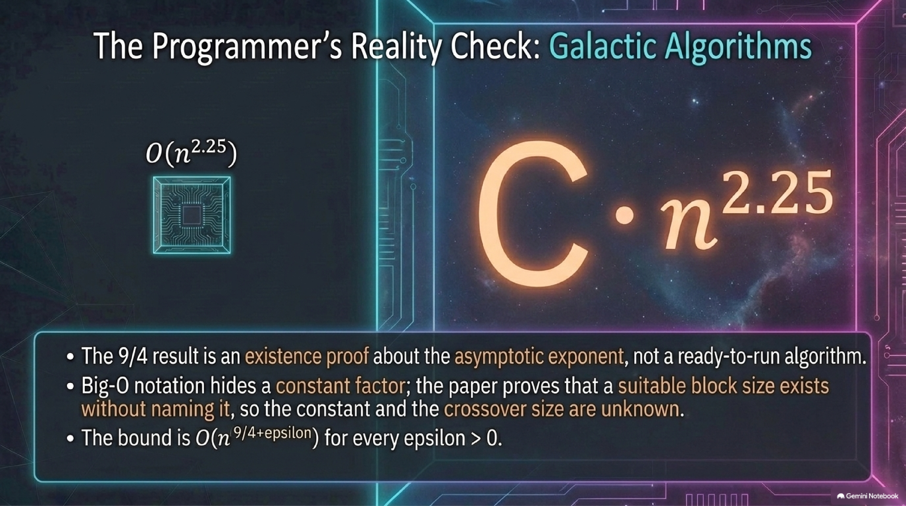

### 1.5 Why anyone cares about ω

Matrix multiplication is a building block for most of linear algebra. Strassen's 1969 paper already used fast multiplication to invert matrices, solve linear systems and compute determinants with the same exponent, and these problems are now known to have, up to a constant factor, the same complexity as multiplication. The 2.258 companion spells out this consequence for its own bound: determinants, inverses and solutions of $Ax = b$ in $O(n^{c})$ operations for some $c < 2.258$, via the classical reductions of Strassen and of Ibarra, Moran and Hui. Many other algorithms state their running time in terms of $\omega$, so every improvement propagates.

---

## 2. A short history

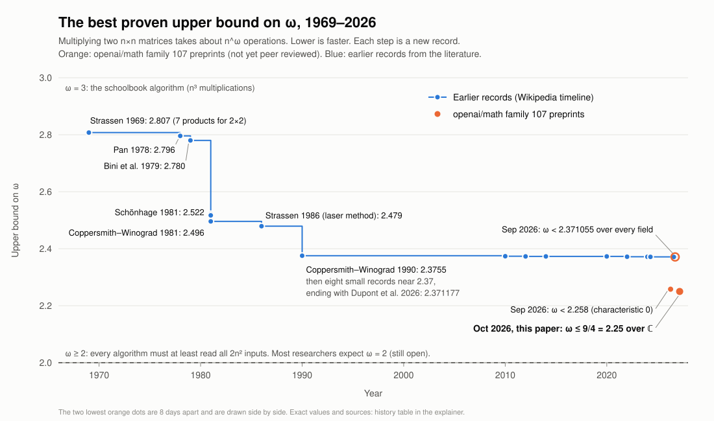

The chart plots the records in the table below. The numbers come from the Wikipedia timeline (checked 7 October 2026) and the introductions of the paper and its two companions.

| When | Who | What happened |
|---|---|---|
| 1969 | **Volker Strassen** | 7 multiplications for $2\times 2$: $\omega \le \log_2 7 \approx 2.8074$. Also: inversion and determinants are no harder than multiplication |
| 1971 | **Shmuel Winograd; John Hopcroft and Leslie Kerr** | 7 multiplications are necessary for $2\times 2$, so Strassen's recipe is optimal at that size |
| 1978 | **Victor Pan** | $2.796$, by "trilinear aggregating" |
| 1979 | **Dario Bini, Milvio Capovani, Grazia Lotti, Francesco Romani** | $2.780$ with *approximate* algorithms (border rank). Bini (1980) showed how to turn them into exact ones |
| 1981 | **Arnold Schönhage** | $2.522$, via the *asymptotic sum inequality*: computing many independent products at once yields exponent bounds |
| 1981–82 | **Francesco Romani; Don Coppersmith and Shmuel Winograd** | $2.517$ and $2.496$, found independently at about the same time |
| 1986–88 | **Volker Strassen** | The *laser method* ($2.479$) and the theory of the *asymptotic spectrum of tensors*, the framework this paper uses |
| 1990 | **Don Coppersmith, Shmuel Winograd** | $2.3755$, with a new small tensor and progression-free sets. Unbeaten for 20 years |
| 2010–2014 | **Andrew Stothers** (with A. M. Davie), **Virginia Vassilevska Williams**, **François Le Gall** | Higher tensor powers of the Coppersmith–Winograd construction (4th, 8th, 32nd): $2.3737$, $2.3729$, $2.3728639$ |
| 2015 | **Andris Ambainis, Yuval Filmus, François Le Gall** | A barrier: the laser method applied to ever higher powers of the Coppersmith–Winograd tensor cannot prove $\omega < 2.3725$, and a wide class of its variants cannot prove $\omega < 2.3078$ |
| 2020 | **Josh Alman, Virginia Vassilevska Williams** | Refined laser method: $2.3728596$ |
| 2022 | **Ran Duan, Hongxun Wu, Renfei Zhou** | Asymmetric hashing reduces "combination loss": $2.371866$, breaking the first barrier above |
| 2024 | **Vassilevska Williams, Yinzhan Xu, Zixuan Xu, Zhou**; then **Alman, Duan, Vassilevska Williams, Xu, Xu, Zhou** | $2.371552$, then $2.371339$ |
| Aug 2026 | **Emilien Dupont and co-authors** (including Alman, Vassilevska Williams and Zhou) | $2.371177$, by optimizing the asymmetric framework with modern optimization and AlphaEvolve |
| 24 Sep 2026 | **OpenAI** (internal model) | Two companion preprints: $\omega < 2.371054886006746$ over **every** field, and $\omega < 2.258$ in characteristic zero |
| 2 Oct 2026 | **OpenAI** (internal model) | This paper: $\omega \le 9/4 = 2.25$ over the complex numbers |

From 1990 to August 2026 the record moved by about $0.004$. The family 107 preprints claim a drop of more than $0.12$.

NotebookLM's sketch-note version of the same story is below. It is a good overview, but it skips several records and wrongly suggests that the 2022–2026 asymmetric-hashing work led to the 2.25 bound (see the [errata](assets/README.md#errata)).

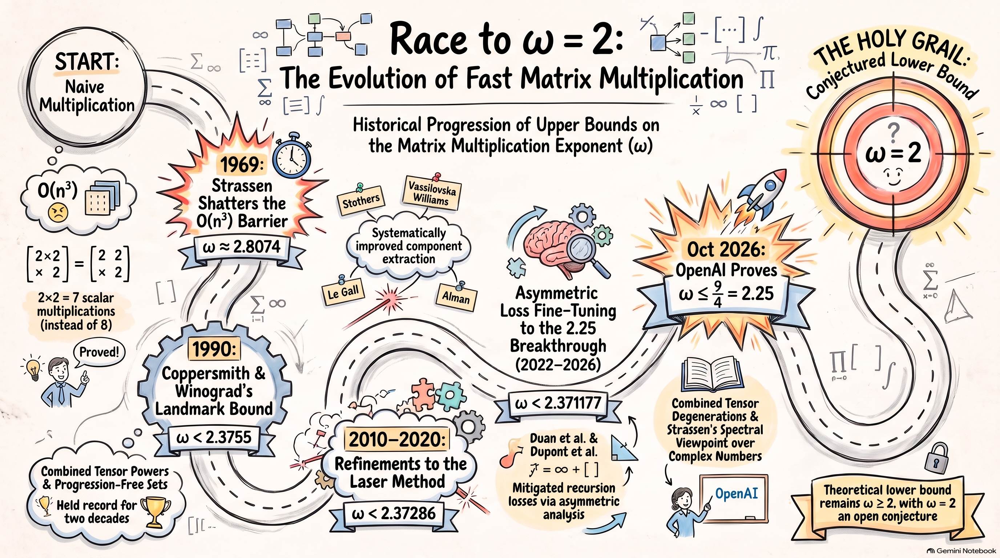

---

## 3. What the paper proves

> **Theorem 1.1.** For every $\varepsilon>0$, two $n\times n$ complex matrices can be multiplied using $O_\varepsilon(n^{9/4+\varepsilon})$ arithmetic operations. In particular, $\omega\le 9/4$.

In plain words: there is a family of recursive, Strassen-style algorithms whose exponents get as close to $2.25$ as you like. Each one uses a fixed block size $u$ and a fixed recipe that multiplies $u\times u$ matrices with fewer than $u^{9/4+\delta}$ multiplications. The paper proves that such recipes exist; it does not exhibit one.

A closing remark in the paper adds that the recipe's constants need not be arbitrary complex numbers. They can be chosen algebraic, all inside one number field.

The Lean 4 statement, from the [openai/math Comparator challenge file](https://github.com/openai/math/blob/main/lean/ComparatorChallenges/MatrixMultiplication.lean), reads:

```lean
theorem complex_omega_le_nine_quarters :
    Arithmetic.omega ℂ ≤ (9 : ℝ) / 4
```

There, `Arithmetic.omega ℂ` is defined as the infimum of exponents $\tau$ such that for every $\varepsilon > 0$ there is one constant $C$ and, for every $n$, a correct straight-line program built from complex constants, inputs, $+$, $-$ and $\times$, using at most $C n^{\tau+\varepsilon}$ additions, subtractions and multiplications.

**The whole family at a glance.** The bounds hold over different number systems ("fields"), and that matters:

| Bound | Over which fields | Where it is proved | Listed as formalized in Lean? |
|---|---|---|---|
| $\omega \le 9/4 = 2.25$ | The complex numbers $\mathbb{C}$ | This paper | Yes (`complex_omega_le_nine_quarters`) |
| $\omega < 2.258$ | Every field of characteristic zero; also every field outside one finite, uncomputed set of positive characteristics | [2.258 companion](https://github.com/openai/math/blob/main/preprints/Complex-Matrix-Multiplication-Below-2.258-and-Rectangular-Bounds-September-24-2026/Complex-Matrix-Multiplication-Below-2.258-and-Rectangular-Bounds-September-24-2026.pdf) | Over $\mathbb{C}$ it follows from the 9/4 statement |
| Dual exponent $\alpha > 0.465$ | Characteristic zero | 2.258 companion | Yes, over $\mathbb{C}$ (`complex_alpha_gt_93_div_200`) |
| $\omega(1, 0.709, 1) < 2.092$ (rectangular) | Characteristic zero, with the same finite-exception transfer | 2.258 companion | Yes, over $\mathbb{C}$ (`complex_rectangular_omega_lt_523_div_250`) |
| $\omega < 2.371054886006746$ | **Every** fixed field, including finite fields | [Staggered-extraction companion](https://github.com/openai/math/blob/main/preprints/Staggered-extraction-for-exact-matrix-multiplication-over-every-field-September-24-2026/Staggered-extraction-for-exact-matrix-multiplication-over-every-field-September-24-2026.pdf) | Yes (`omega_lt_source_constant`) |

The **dual exponent** $\alpha$ measures how lopsided a product can be while still costing only $n^{2+o(1)}$: an $n\times n^{a}$ matrix times an $n^{a}\times n$ matrix, for every $a < \alpha$. The 2.258 companion cites $\alpha \ge 0.321334$ from Vassilevska Williams, Xu, Xu and Zhou as the earlier bound.

---

## 4. Why it matters

| | Before | After (if the preprints hold up) |
|---|---|---|
| **Best exponent over $\mathbb{C}$** | $2.371177$ (Aug 2026) | $9/4 = 2.25$ |
| **Size of the jump** | About $0.004$ of total progress from 1990 to 2026 | About $0.12$ within eight days ($2.258$ on 24 September, then $9/4$), the largest drop since Schönhage in 1981 |
| **Method** | The laser method and its refinements, applied to Coppersmith–Winograd tensors | Bounds on *all* tensor characters, using polynomial multiplication. No Coppersmith–Winograd tensor appears |
| **Length and computer checks** | Recent records rely on large numerical optimizations | 13 pages; the only constants are small ones like 5, $4/3$ and $3/4$. No numerical certificate is needed |
| **Every field, including arithmetic mod $p$** | — | $\omega < 2.371054886006746$ (staggered-extraction companion), just below the $2.371177$ record. The 9/4 bound itself is only claimed over $\mathbb{C}$ |
| **Lopsided products** (dual exponent $\alpha$) | $\alpha \ge 0.321334$, as cited by the 2.258 companion | $\alpha > 0.465$ (2.258 companion) |

The deeper significance is the method. For decades, progress came from building ever more elaborate explicit constructions and optimizing them numerically. This paper instead works on the "dual" side that Strassen set up in the 1980s. It proves inequalities that every character must satisfy, without knowing what the characters are, and the bound falls out of a two-line comparison of growth rates. If the proof is right, then because $9/4$ is below both barrier values in the history table, the method lies outside the family of techniques those barriers cover.

---

## 5. The main idea of the proof

The paper has five short sections and an appendix. Here it is at three zoom levels.

### Level 1: the one-paragraph version

Imagine a **meter** that assigns a size to every bilinear computation, consistently. Running two independent computations side by side **adds** their sizes, nesting one inside another **multiplies** them, and anything you can derive from a computation for free can't measure **bigger**. An algorithm with $r$ multiplications forces every meter to read at most $r$. Strassen proved in the 1980s that, asymptotically, the converse also holds: the true exponent is set by the highest reading any meter gives matrix multiplication. So it is enough to show that **no meter can read $n\times n$ matrix multiplication above $n^{9/4}$**. The paper does this with a squeeze. Polynomial multiplication is cheap, so every meter reads it low (a ceiling). Two clever ways of finding smaller polynomial products inside bigger ones force any meter that rates matrix multiplication highly to read big polynomial products high (a floor). Floor and ceiling collide unless the meter's rating of matrix multiplication is at most $n^{9/4}$.

> **Analogy:** to show that no honest scale can read a sealed box above some limit, you never open the box. You show that any scale reading it higher would also have to read a second package above that package's certified maximum weight. Here the sealed box is matrix multiplication, and the package is polynomial multiplication.

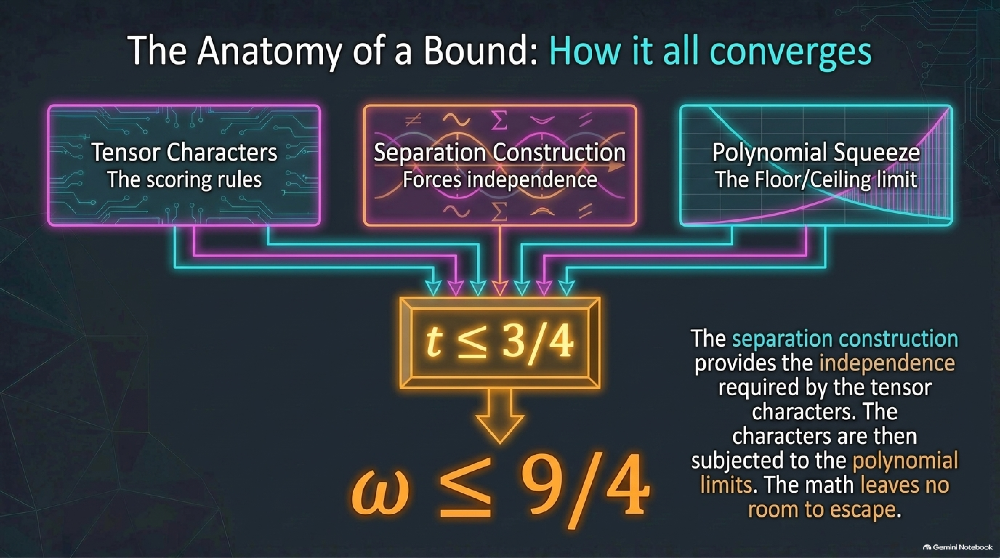

### Level 2: the step-by-step picture

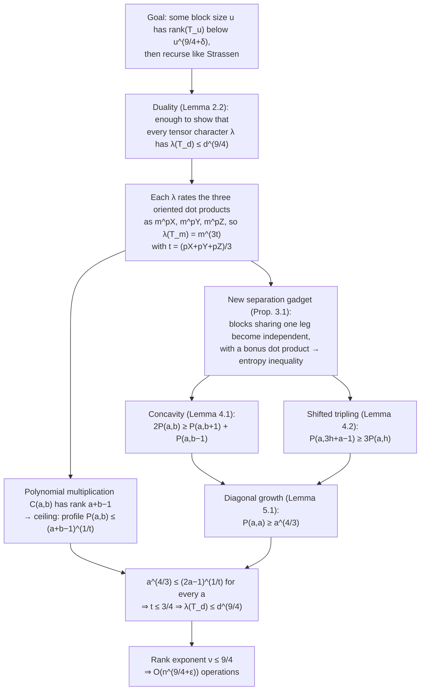
```mermaid
flowchart TD
    A["Goal: some block size u has rank(T_u) below u^(9/4+δ),<br/>then recurse like Strassen"] --> B["Duality (Lemma 2.2): enough to show that<br/>every tensor character λ has λ(T_d) ≤ d^(9/4)"]
    B --> C["Each λ rates the three oriented dot products<br/>as m^pX, m^pY, m^pZ, so λ(T_m) = m^(3t)<br/>with t = (pX+pY+pZ)/3"]
    C --> D["Polynomial multiplication C(a,b) has rank a+b−1<br/>→ ceiling: profile P(a,b) ≤ (a+b−1)^(1/t)"]
    C --> E["New separation gadget (Prop. 3.1):<br/>blocks sharing one leg become independent,<br/>with a bonus dot product → entropy inequality"]
    E --> F["Concavity (Lemma 4.1):<br/>2P(a,b) ≥ P(a,b+1) + P(a,b−1)"]
    E --> G["Shifted tripling (Lemma 4.2):<br/>P(a,3h+a−1) ≥ 3P(a,h)"]
    F --> H["Diagonal growth (Lemma 5.1):<br/>P(a,a) ≥ a^(4/3)"]
    G --> H
    D --> I["a^(4/3) ≤ (2a−1)^(1/t) for every a<br/>⇒ t ≤ 3/4 ⇒ λ(T_d) ≤ d^(9/4)"]
    H --> I
    I --> J["Rank exponent ν ≤ 9/4<br/>⇒ O(n^(9/4+ε)) operations"]
```

**Step 1: From algorithms to rank.** By the recursion in section 1.2, it is enough to prove that the rank exponent satisfies $\nu \le 9/4$, meaning that for every $\delta > 0$ some $T_u$ has rank below $u^{9/4+\delta}$.

**Step 2: Meters, officially "tensor characters".** A **character** is a function $\lambda$ from tensors to non-negative numbers with $\lambda(A\oplus B) = \lambda(A)+\lambda(B)$, $\lambda(A\otimes B) = \lambda(A)\lambda(B)$, $\lambda(A) \ge \lambda(B)$ whenever $A \ge B$, and $\lambda(\text{one multiplication}) = 1$. The three "flattening ranks" (view the tensor as a matrix, one leg against the other two, and take its ordinary matrix rank) are examples. Every character satisfies $1 \le \lambda(A) \le R(A)$ for nonzero $A$. The **detecting-character lemma** (Lemma 2.2) is the converse direction: for each $d$, some character has $\lambda(T_d) \ge \lceil d^{\nu}\rceil - 1$. So if *every* character has $\lambda(T_d) \le d^{9/4}$, then $d^{\nu} \le d^{9/4} + 1$ for all $d$, and $\nu \le 9/4$. This lemma is a special case of Strassen's spectral theory, and the paper's appendix proves it from scratch with a compactness argument, a separating-hyperplane argument and a fixed-point theorem.

> **Analogy for programmers:** this is like max-flow/min-cut or LP duality. Either there is a cheap algorithm, or there is a certificate (here, a character) proving there isn't. The paper rules out every possible certificate above $9/4$.

**Step 3: Dot products set the scale.** Write $B_X(m) = x\ (y_1z_1 + \cdots + y_mz_m)$. It is a dot product of two length-$m$ vectors, with the lone variable $x$ on the first leg. Moving the lone variable to the second or third leg (cyclically permuting the legs) gives its other two **orientations**, $B_Y(m)$ and $B_Z(m)$. Because $B_X(mn)$ is the tensor product of $B_X(m)$ and $B_X(n)$, a character must rate it as an exact power: $\lambda(B_X(m)) = m^{p_X}$ for some $p_X \in [0,1]$, and likewise $p_Y$, $p_Z$. Tensoring the three orientations gives exactly matrix multiplication, so

$$\lambda(T_m) = m^{p_X+p_Y+p_Z} = m^{3t}, \qquad t = \tfrac{1}{3}(p_X+p_Y+p_Z).$$

The goal is now concrete: **show $t \le 3/4$ for every character.**

**Step 4: Polynomial multiplication gives a ceiling.** Multiplying a polynomial with $a$ coefficients by one with $b$ coefficients is the tensor $C(a,b) = \sum x_i\ y_j\ z_{i+j}$, summed over $0 \le i \le a-1$ and $0 \le j \le b-1$. The schoolbook method uses $ab$ multiplications, but $a+b-1$ suffice: evaluate both polynomials at $a+b-1$ points, multiply the values, and interpolate. This is the same idea that powers FFT-based multiplication. So $R(C(a,b)) \le a+b-1$, and a flattening argument shows that no fewer will do, so $R(C(a,b)) = a+b-1$. The paper averages a character over the six ways of permuting the three legs and rescales, defining the **symmetrized profile**

$$P(a,b) = \Big(\prod_{\pi \in S_3} \lambda_\pi(C(a,b))\Big)^{1/(6t)}.$$

It is normalized so that $P(1,b) = b$ ($C(1,b)$ is just the dot product $B_X(b)$). It is symmetric, and the rank gives the **ceiling** $P(a,b) \le (a+b-1)^{1/t}$.

**Step 5: The new gadget, separating a shared leg.** Additivity only applies to pieces that are independent on *all three* legs. The paper's central construction (Proposition 3.1) handles pieces $A_1,\dots,A_M$ that have separate $y$ and $z$ variables but **share their $x$ variables**. From $5M$ copies of the whole tensor it degenerates to $M$ fully independent pieces, each tensored with a bonus dot product $B_X(M)$. Two tricks make it work:

- A **roots-of-unity filter**, the same identity behind the discrete Fourier transform: $\frac{1}{L}\sum_{r=0}^{L-1}\zeta^{rk}$ is $1$ if $L$ divides $k$ and $0$ otherwise. It gives each shared $x$ variable a tentative block label $g$.
- **Weights that penalize wrong labels.** Giving the variables weights $g^2$, $hu-h^2$ and $-hv$ makes the total weight of every surviving term exactly $(g-h)^2 \ge 0$. Keeping only the weight-zero terms forces the tentative label $g$ to equal the true block $h$.

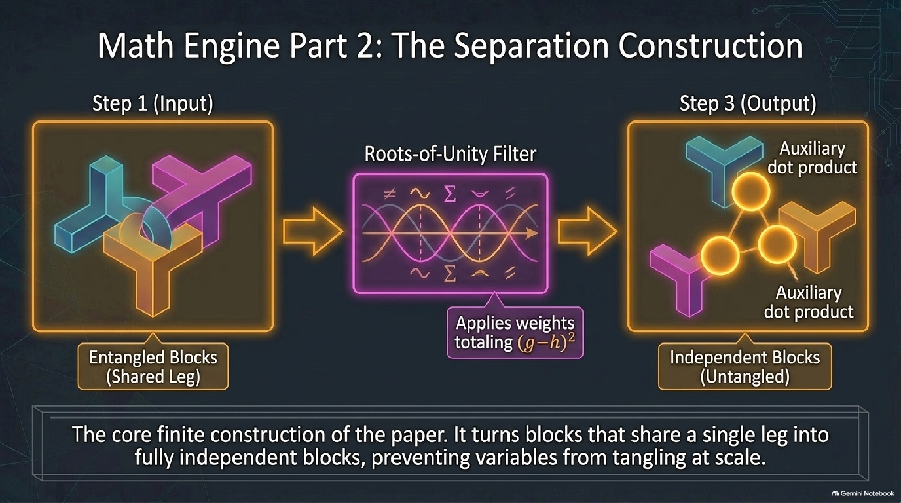

(The slide draws the $(g-h)^2$ weights inside the filter box. In the paper the weighting is a separate degeneration step applied after the filter.)

The $M$ output blocks pay for the $5M$ copies up to a factor 5, which washes out after taking tensor powers, and the bonus dot products supply a gain. After counting words with prescribed letter frequencies, the result is an **entropy inequality** (Corollary 3.2): if $T$ splits into shared-$x$ pieces $T_1,\dots,T_s$, then for every probability vector $q$

$$\lambda(T) \ge e^{p_X H(q)} \prod_{i=1}^{s} \lambda(T_i)^{q_i}, \qquad H(q) = -\sum_i q_i \log q_i .$$

After averaging over the six leg permutations and rescaling, this becomes simple: **in the profile $P$, a tensor made of pieces that share one leg is worth at least the sum of its pieces**, $P(T) \ge P(T_1) + \cdots + P(T_s)$. (A length-$s$ dot product is exactly $s$ single products sharing one $x$ variable, and $P$ gives it the value $s$.) A similar separation idea, built from an auxiliary group tensor, drives the 2.258 companion.

**Step 6: Two inequalities for polynomial products.**

- **Concavity (Lemma 4.1).** Tensoring $C(a,b)$ with a length-2 dot product and degenerating cleverly gives $C(a,b+1)$ and $C(a,b-1)$ side by side, sharing their first leg. The algebra is the "determinant filtration" of binary forms, a degree-one case of the Clebsch–Gordan decomposition from representation theory. With Step 5 this gives $2P(a,b) \ge P(a,b+1) + P(a,b-1)$: the increments $P(a,b+1)-P(a,b)$ never increase.
- **Shifted tripling (Lemma 4.2).** Cut the second-input indices and the output indices of $C(a, 3h+a-1)$ into left, middle and right ranges, and degenerate. What survives is three copies of $C(a,h)$ (the middle one with two legs swapped), sharing their first leg. With Step 5, $P(a, 3h+a-1) \ge 3P(a,h)$. The figure shows the smallest nontrivial case.

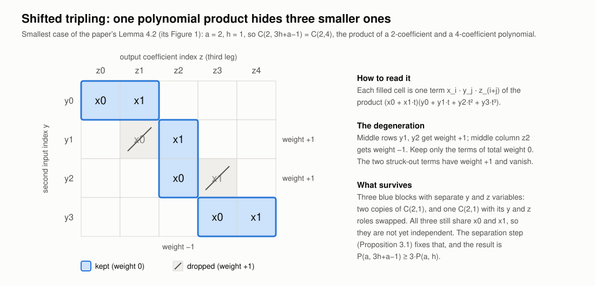

**Step 7: Discrete growth (Lemma 5.1).** A purely elementary lemma: any symmetric function with $P(1,b) = b$ that satisfies the concavity and tripling inequalities must have $P(a,a) \ge a^{4/3}$. Tripling says that going from $P(a,a)$ to $P(a,4a-1)$ at least triples the value. Concavity says the increments along a row never increase, so the first increment after the diagonal must already be at least $2P(a,a)/(3a-1)$. Feeding this into the diagonal one step at a time gives the paper's recursion $H_a \ge (1 + \frac{1}{3(a-1)})\ H_{a-1}$ for the normalized values $H_a = 2P(a,a)/(3a-1)$. The product of these factors grows like $a^{1/3}$, which is where the exponent $4/3 = 1 + 1/3$ comes from.

**Step 8: The squeeze.** Floor and ceiling together give $a^{4/3} \le P(a,a) \le (2a-1)^{1/t}$ for every $a$. Let $a\to\infty$: this forces $1/t \ge 4/3$, so $t \le 3/4$ and $\lambda(T_d) = d^{3t} \le d^{9/4}$ for every character. Step 2 then gives $\nu \le 9/4$, and Step 1 gives the algorithm.

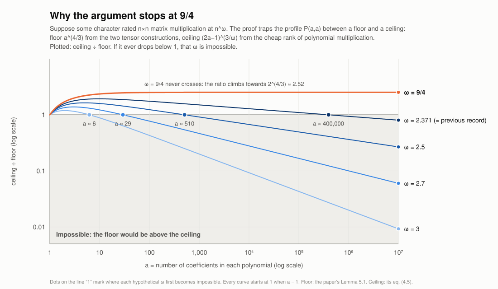

<details>
<summary><b>The whole argument with a = 2</b> (a worked calculation)</summary>

The proof lets $a \to \infty$, but each fixed $a$ already gives a valid (weaker) bound. Here is $a = 2$, using only the paper's lemmas. The arithmetic is ours, not the paper's.

1. $P(1,b) = b$ and symmetry give $P(2,1) = P(1,2) = 2$.
2. Tripling with $a = h = 2$ gives $P(2,7) \ge 3\ P(2,2)$.
3. Concavity says the increments $P(2,b+1)-P(2,b)$ never increase, so $P(2,7) - P(2,2)$, a sum of 5 increments, is at most $5\ (P(2,2) - P(2,1)) = 5\ (P(2,2)-2)$.
4. Combining 2 and 3: $2\ P(2,2) \le 5\ P(2,2) - 10$, so $P(2,2) \ge 10/3$.
5. The rank ceiling is $P(2,2) \le (2+2-1)^{1/t} = 3^{1/t}$. So $3^{1/t} \ge 10/3$, which gives $t \le \ln 3 / \ln(10/3) \approx 0.9125$.

So every character has $\lambda(T_d) \le d^{2.7375}$, and $\omega \le 2.7375$. That already beats Strassen's $\log_2 7 \approx 2.807$. Larger $a$ does better (here using the exact recursion behind Lemma 5.1 rather than its rounded form $a^{4/3}$):

| $a$ | Bound on $\omega$ |
|---|---|
| 2 | 2.7375 |
| 10 | 2.4927 |
| 100 | 2.3864 |
| 1,000 | 2.3438 (already below the 2.371177 record) |
| 10,000,000 | 2.2915 |
| $\to\infty$ | $9/4 = 2.25$ |

The bounds in the table are rounded up. The floor-versus-ceiling figure above uses the weaker rounded floor $a^{4/3}$, which is why it needs much larger $a$ (about 400,000) before $2.371$ is ruled out.

These $a$ are sizes of polynomials *inside the proof*, not matrix sizes. The block size $u$ of the final algorithm is not determined by this calculation.
</details>

### Level 3: the spectral picture, for readers who know some algebra

Strassen's **asymptotic spectrum** is the set of all monotone semiring homomorphisms from tensors (up to mutual restriction) to the non-negative reals, which is exactly the paper's characters. His spectral theorem describes asymptotic rank as a maximum over this spectrum, so $\omega$ is governed by $\max_\lambda \log_d \lambda(T_d)$. The detecting-character lemma (Lemma 2.2) is the half of this that the proof needs, and Appendix A proves it directly. It takes the compact convex set of "states" satisfying $\lambda(T_d s) \ge k\ \lambda(s)$. A finite cone-separation argument shows the set is nonempty, because otherwise one gets a "catalytic" comparison $D + ks \ge D + m + T_d s$ that, amplified, contradicts $k < d^{\nu}$. The Schauder–Tychonoff fixed-point theorem, applied to the normalized maps $\lambda \mapsto \lambda(z\cdot)/\lambda(z)$, then produces a multiplicative state, which is a character.

The proof never needs to know *which* characters exist. It only uses the three numbers $p_X, p_Y, p_Z$ of each character, and three facts valid for all characters: rank is an upper bound (Step 4), degenerations are monotone (Lemma 2.3, Bini's interpolation argument), and the entropy inequality (Corollary 3.2). The six-permutation average makes the dot-product exponent in the entropy inequality average to $t$, and the exponent $1/(6t)$ in the profile then turns "$e^{p_X H(q)}$" into "$e^{H(q)}$". Since the maximum of $e^{H(q)} \prod_i A_i^{q_i}$ over probability vectors $q$ is $\sum_i A_i$, the profile is superadditive over shared-leg decompositions. For the two blocks of Lemma 4.1 this is exactly the concavity $P(a,b+1) + P(a,b-1) \le 2P(a,b)$. For comparison, a *full* direct sum of $s$ copies multiplies $P$ by $s^{1/t}$, which is at least $s$ because $t \le 1$.

---

## 6. The people whose ideas this builds on

| Person | Idea | Where it shows up in the proof |
|---|---|---|
| **Volker Strassen** | The 7-multiplication algorithm (1969); the laser method; the asymptotic spectrum of tensors (1986–88) | The final recursion (Step 1); the whole character framework and Lemma 2.2 (Step 2) |
| **Dario Bini** (with Capovani, Lotti, Romani) | Approximate bilinear algorithms; interpolation turns them into exact ones (1979–80) | Lemma 2.3: degenerations never increase a character's value |
| **Arnold Schönhage** | The asymptotic sum inequality (1981) | Background in the introduction; central to the companions |
| **Don Coppersmith, Shmuel Winograd** | Tensor powers with progression-free sets (1990) | Background; both companions start from Coppersmith–Winograd tensors, but this paper does not use them |
| **Andrew Stothers, A. M. Davie, Virginia Vassilevska Williams, François Le Gall** | Higher-power analyses (2010–14); Le Gall's convex-optimization formulation | The fixed-frequency counting in Corollary 3.2 and the six-permutation balancing behind the profile $P$ both cite Le Gall's 2014 paper |
| **Josh Alman, Ran Duan, Hongxun Wu, Renfei Zhou, Yinzhan Xu, Zixuan Xu** and Vassilevska Williams | Refined laser method; asymmetric hashing and combination loss (2020–25) | The previous records the paper compares itself with |
| **Emilien Dupont et al.** | $2.371177$ by optimizing the combination-loss framework (2026) | The record immediately before family 107 |
| **Matthias Christandl, Péter Vrana, Jeroen Zuiddam** | Universal points in the asymptotic spectrum (2023) | The paper's modern reference for the spectral viewpoint |
| **Emmanuel Kowalski** | Textbook treatment of the determinant exact sequence (Clebsch–Gordan) | The determinant filtration in Lemma 4.1 |
| **Andrey Tychonoff** (Schauder–Tychonoff theorem) | Fixed points of continuous maps on compact convex sets | Producing a multiplicative character in Appendix A |

---

## 7. What it does not prove, and caveats

> [!IMPORTANT]
> **This does not prove $\omega = 2$.** The conjecture that matrices can be multiplied in $n^{2+o(1)}$ operations is still open. This paper narrows the gap from $[2,\ 2.371177]$ to $[2,\ 2.25]$ over $\mathbb{C}$, if it is correct.

> [!WARNING]
> **This is not a practical algorithm.** The paper says that Theorem 1.1 "concerns the asymptotic arithmetic exponent; its proof does not specify a competitive finite matrix size." The proof is an existence proof: it shows that for each $\varepsilon$ some block size $u$ and some recipe with fewer than $u^{9/4+\delta}$ multiplications exist, but it never constructs them, and the appendix that supplies the key character uses compactness and a fixed-point theorem. There is nothing here to plug into NumPy, BLAS or GPU kernels. The cost model counts arithmetic operations on exact complex numbers, not bits, memory traffic or floating-point stability.

> [!NOTE]
> **Which fields.** The $9/4$ bound is stated over the complex numbers (with constants that can be taken algebraic). The family's claims for other fields are weaker: $\omega < 2.258$ in characteristic zero and outside an uncomputed finite set of positive characteristics, and $\omega < 2.371054886006746$ over every field.

> [!NOTE]
> **Provenance.** The paper was produced by an unreleased internal OpenAI model as part of the [openai/math](https://github.com/openai/math) release. According to that repository's README, most results came from the same fixed procedure, averaging about three hours of ChatGPT Pro thinking compute per result. The README lists two exceptions to that procedure (a zero-free region for the Riemann zeta function, and the Hodge Conjecture for CM abelian varieties); this family is not among them. The README also notes that the collection "includes results at different stages of verification."

> [!NOTE]
> **Verification status.** The [Lean scope document for family 107](https://github.com/openai/math/blob/main/lean/docs/107.md) says the formalized results bound $\omega(\mathbb{C}) \le 9/4$, the dual exponent by $\alpha > 0.465$, and $\omega(\mathbb{C};1,0.709,1) < 2.092$, in a model that counts additions, subtractions and multiplications in finite division-free programs. It also says the formalized result gives $\omega(F) < 2.371054886006746$ for every field $F$, with no numerical inequalities left as hypotheses. [`lean/formalization.yaml`](https://github.com/openai/math/blob/main/lean/formalization.yaml) lists this paper among its sources and `OAI.MatrixMultiplication.complex_omega_le_nine_quarters` among its main results, checkable with the Comparator tool (permitted axioms: `propext`, `Quot.sound`, `Classical.choice`). Two details are worth knowing. The scope document's list of accompanying papers names only the two September companions, so the docs do not say which written proof the Lean development follows. And the catalogue-wide `review` field of `formalization.yaml` reads `unchecked`. This explainer did not re-run the Lean build or the companions' numerical certificate scripts. As of October 2026 all three papers are preprints; the usual next step is independent review by experts.

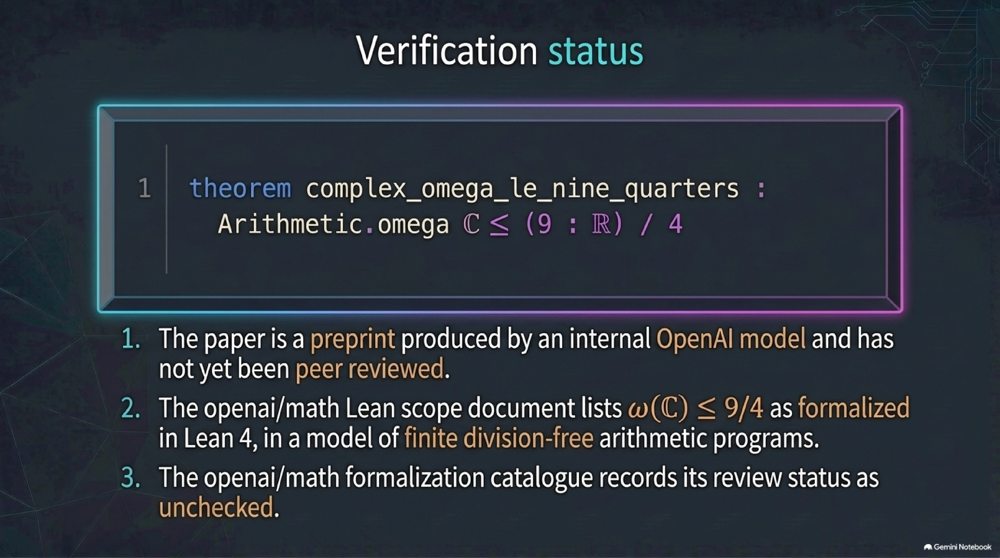

> [!TIP]
> **Simplifications.** To stay readable, this explainer suppresses the exact bookkeeping of degenerations (which variables get which weights), the passage from rational to real probability vectors, and the limits taken in the appendix. Every precise statement is in the 13-page paper, which is unusually readable for this field.

---

## 8. Glossary

| Term | Meaning |
|---|---|
| **Matrix multiplication exponent** $\omega$ | The smallest $\tau$ such that $n\times n$ matrices can be multiplied in $O(n^{\tau+\varepsilon})$ arithmetic operations for every $\varepsilon > 0$. Known: $2 \le \omega$; this paper claims $\omega \le 9/4$ over $\mathbb{C}$ |
| **Schoolbook algorithm** | The triple loop: $n^3$ multiplications |
| **Strassen's algorithm** | 7 block multiplications instead of 8 for $2\times 2$ blocks, applied recursively: $O(n^{\log_2 7})$ |
| **Bilinear algorithm** | An algorithm whose multiplications are each (combination of $A$-entries) × (combination of $B$-entries). These are the algorithms that can be applied recursively to blocks |
| **Tensor** (trilinear form) | A polynomial like $T_n = \sum x_{ij} y_{jk} z_{ki}$ that records which input products feed which outputs |
| **Legs** | The three variable groups ($x$, $y$, $z$) of a tensor |
| **Tensor rank** $R(T)$ | The fewest products of three linear forms that add up to $T$; the fewest multiplications in a bilinear algorithm |
| **Rank exponent** $\nu$ | $\inf_n \log_n R(T_n)$. The paper proves $\nu \le 9/4$ and converts it into the arithmetic bound |
| **Direct sum / tensor product** | Independent problems side by side (sizes add) / one problem nested inside another (sizes multiply) |
| **Restriction, degeneration** | Getting one tensor from another by linear substitutions / by substitutions with a small parameter $\varepsilon$, keeping the lowest-order terms |
| **Tensor character** | A "meter" $\lambda$ that adds on direct sums, multiplies on tensor products, can't increase under restriction, and gives 1 to a single product. The points of Strassen's asymptotic spectrum |
| **Dot-product exponents** $p_X, p_Y, p_Z$ | How a character rates the three orientations of the length-$m$ dot product: $\lambda(B_X(m)) = m^{p_X}$, and so on |
| **Polynomial multiplication tensor** $C(a,b)$ | $\sum x_i y_j z_{i+j}$: multiplying polynomials with $a$ and $b$ coefficients. Rank $a+b-1$ |
| **Symmetrized profile** $P(a,b)$ | A character's values on $C(a,b)$ over the 6 leg permutations, geometrically averaged and rescaled so that $P(1,b) = b$ |
| **Entropy** $H(q)$ | $-\sum q_i \log q_i$ for a probability vector $q$; it counts words with prescribed letter frequencies |
| **Galactic algorithm** | An algorithm that is asymptotically faster but only wins for inputs far too large to ever occur |
| **Dual exponent** $\alpha$ | The largest $a$ for which an $n\times n^a$ by $n^a \times n$ product costs $n^{2+o(1)}$ |
| **Field, characteristic** | A number system with $+,-,\times,\div$ (such as $\mathbb{C}$, $\mathbb{Q}$, or integers mod a prime $p$). Characteristic $p$ means $1+1+\cdots+1$ ($p$ times) $= 0$ |
| **Lean 4, Comparator** | A proof assistant that mechanically checks every step of a proof, and a tool that checks a formal proof matches a published statement and uses only allowed axioms |

---

## 9. Slides, audio and other assets

Everything below except the three hand-made figures was generated with **Google NotebookLM** (now "Gemini Notebook") from the paper, the Lean scope document and the Wikipedia article on the computational complexity of matrix multiplication. The report and the mind map used only the paper and the Lean scope document. The outputs are kept exactly as NotebookLM produced them, apart from one revision of the slide deck. They are AI-generated, so see the [errata](assets/README.md#errata) before relying on any detail.

| Asset | What it is |
|---|---|
| [Slide deck (PDF)](assets/notebooklm/slides.pdf) · [PPTX](assets/notebooklm/slides.pptx) | 15 beginner slides. Six slides were regenerated once to fix errors; a few smaller issues remain |
| [Infographic: overview](assets/notebooklm/infographic-overview.png) | The one-page summary shown at the top |
| [Infographic: history timeline](assets/notebooklm/infographic-history-timeline.png) | From Strassen 1969 to October 2026, in sketch-note style |
| [Audio overview (≈1.75 min)](assets/notebooklm/audio-overview-brief.m4a) | A short podcast-style summary (not reviewed) |
| [Beginner report](assets/notebooklm/beginner-explainer-report.md) | NotebookLM's long-form written explainer. Its proof walk-through is accurate; its history table has wrong numbers |
| [Mind map](assets/notebooklm/mindmaps.md) | How the proof fits together |
| [Timeline figure](assets/figures/omega-timeline.svg) | Hand-made chart of the record bounds, used in section 2 |
| [Shifted-tripling figure](assets/figures/shifted-tripling.svg) | Hand-made redraw of the paper's Figure 1, used in section 5 |
| [Floor-versus-ceiling figure](assets/figures/floor-vs-ceiling.svg) | Hand-made chart of the final squeeze, used in section 5 |

<details>
<summary><b>All 15 slides</b> (click to expand)</summary>

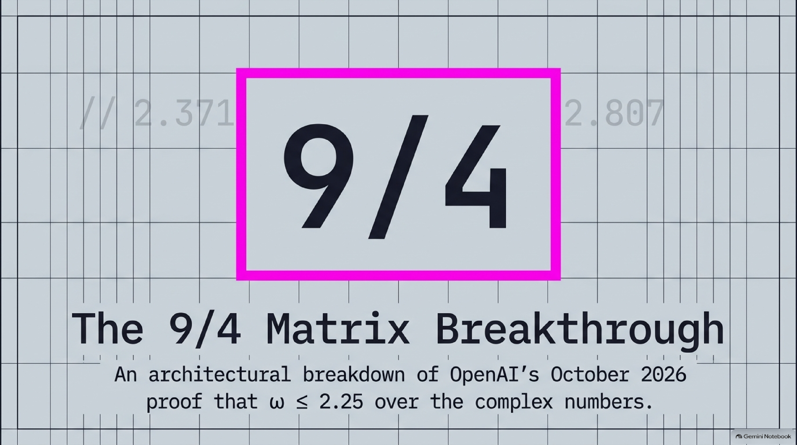

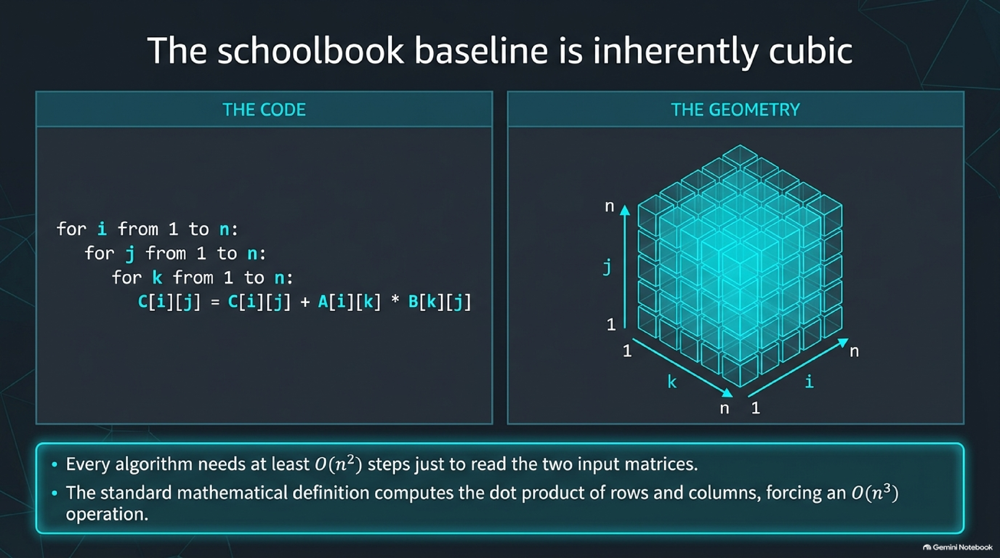

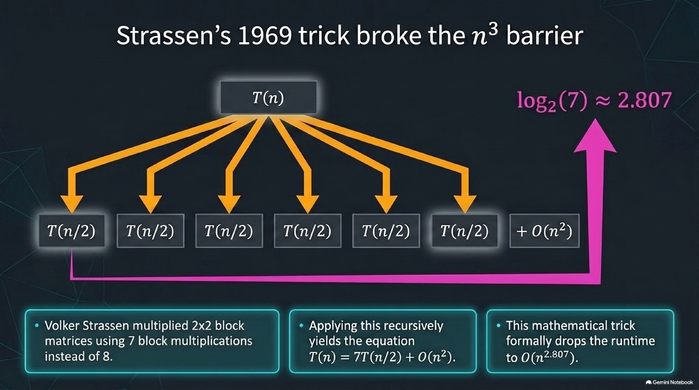

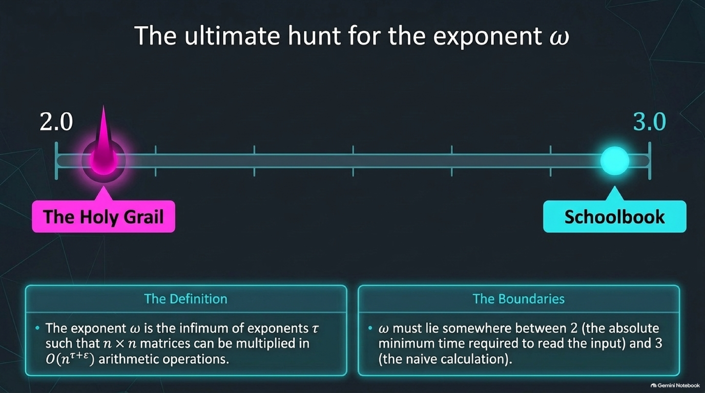

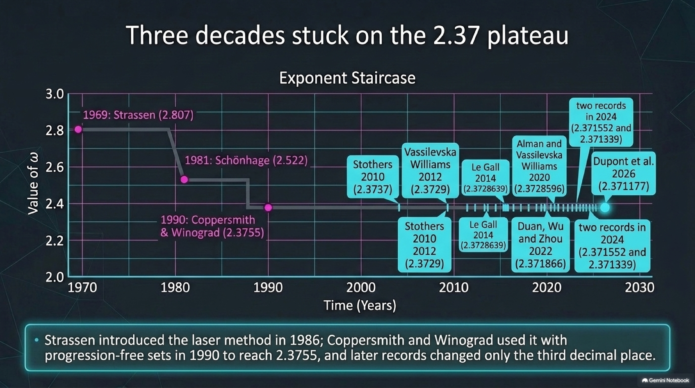

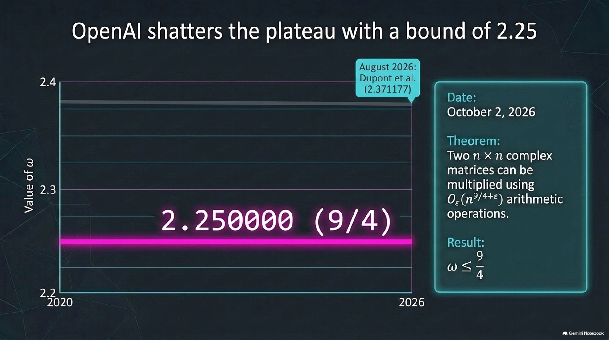

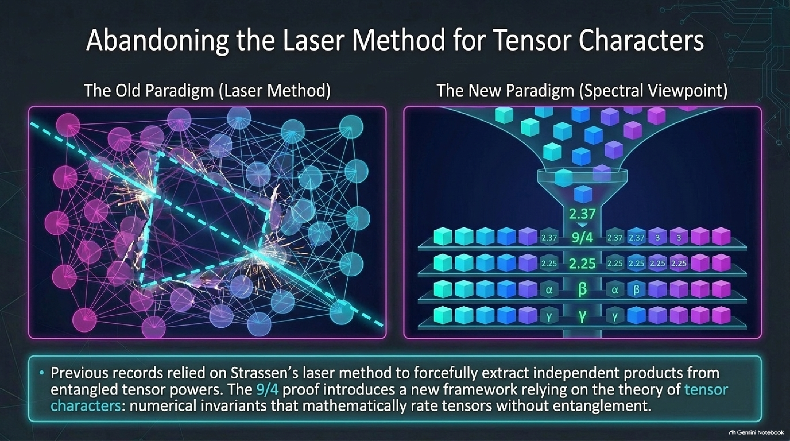

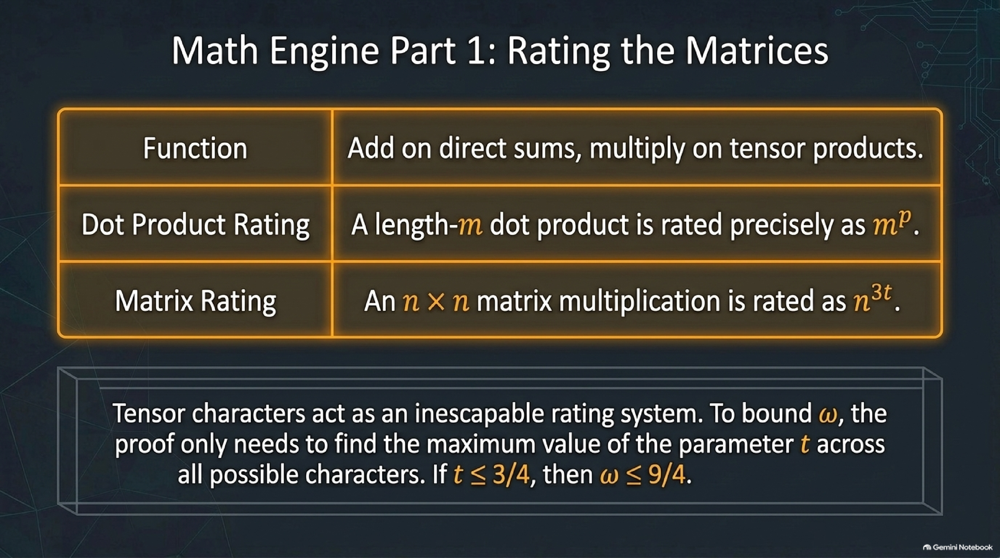


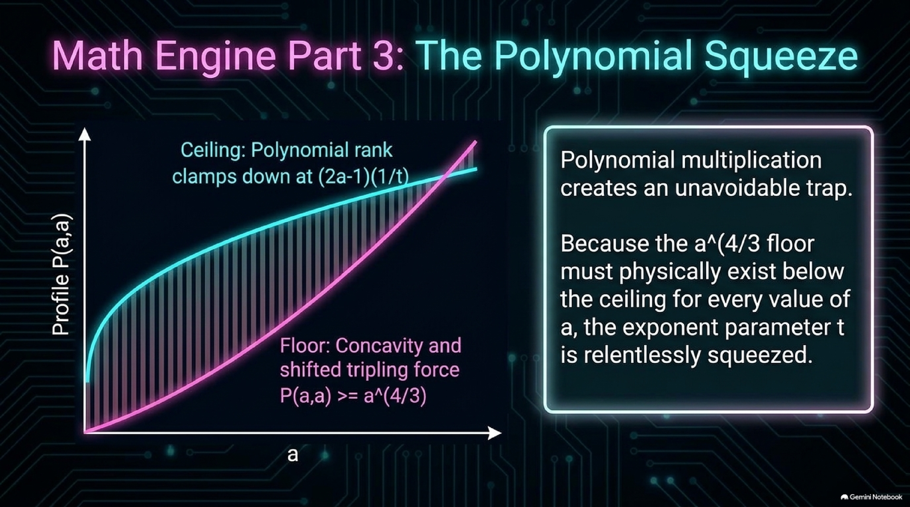


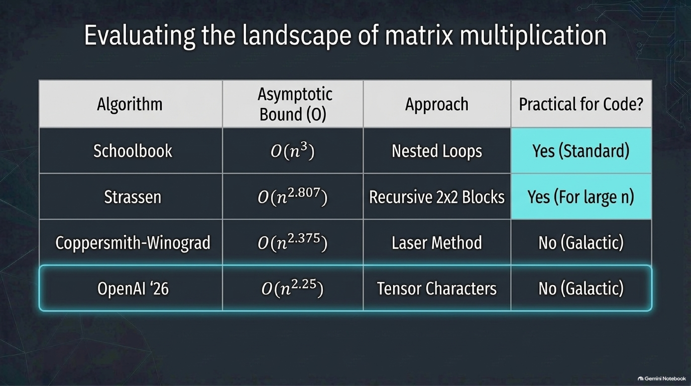

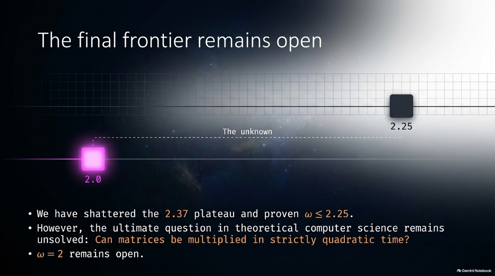

</details>

See [`assets/README.md`](assets/README.md) for the full inventory and the file-by-file [errata](assets/README.md#errata).

---

## How this explainer was made

1. The paper (with its TeX source) and its two companions were downloaded from [openai/math](https://github.com/openai/math/tree/main/preprints), together with the family entry in `CONTENTS.md`, the Lean scope document `lean/docs/107.md`, the Comparator challenge files and `lean/formalization.yaml`.
2. The paper, the 2.258 companion, the Lean scope document and the Wikipedia article on the [computational complexity of matrix multiplication](https://en.wikipedia.org/wiki/Computational_complexity_of_matrix_multiplication) were loaded into a NotebookLM notebook through the [`notebooklm-mcp-cli`](https://github.com/jacob-bd/gemini-notebook-mcp-cli) MCP/CLI. The assets in [`assets/notebooklm/`](assets/notebooklm/) were generated in a separate notebook, with the same sources, on a second NotebookLM account. That notebook generated the slides, infographics, report, mind map and audio, using prompts written as plain statements of the paper's results. Every slide, both infographics and the report were then read against the paper. Six clearly wrong slides were regenerated once with `nlm slides revise`, and a slide-by-slide diff confirmed nothing else changed.
3. The text on this page was written by hand (with AI assistance) directly from the paper's TeX source, the introductions of the two companions, and the openai/math documentation. The history table was checked against the Wikipedia timeline and the papers' own reference lists. Strassen's identities, the separation-weight identity, the tripling example, the growth recursion and the $a = 2$ calculation were re-checked with small scripts. The three figures were drawn by hand as SVG. NotebookLM's own outputs contain mistakes, listed in the [errata](assets/README.md#errata), so they were used as visual and structural aids rather than as the source of truth.

See [`PIPELINE.md`](../../PIPELINE.md) for the exact, repeatable steps.

*Citation for the underlying paper:*

```bibtex
@misc{OAI:Matrix-Multiplication-Nine-Fourths-October-2-2026,
  author = {{OpenAI}},
  title = {{An Upper Bound of $9/4$ for the Matrix Multiplication Exponent}},
  howpublished = {OpenAI Math Release preprint
                  \href{https://github.com/openai/math/blob/main/preprints/Matrix-Multiplication-Nine-Fourths-October-2-2026/paper.pdf}{OAI:Matrix-Multiplication-Nine-Fourths-October-2-2026}},
  year = {2026}
}
```
