# The Euclidean plane is not five-colorable, explained for beginners

> - **Paper:** [*The Euclidean plane is not five-colorable*](https://github.com/openai/math/blob/main/preprints/The-Euclidean-plane-is-not-five-colorable-September-23-2026/paper.pdf), OpenAI, 23 September 2026 (62 pages)
> - **openai/math family:** 158, *The Euclidean plane cannot be colored with five colors* · **Field:** combinatorics (geometric graph theory), with ergodic theory, harmonic analysis and topology in the proof
> - **Companions:** none. This family has a single paper
> - **Formal proof:** both "five colors are not enough" and "seven colors are enough" are listed as formalized in Lean 4 ([scope](https://github.com/openai/math/blob/main/lean/docs/158.md))
> - **Who this is for:** anyone who knows what a circle, a triangle and a function are. No graph theory needed for sections 1–4; section 5 gets gradually more technical.

## Contents

- [TL;DR](#tldr)
- [How to read this](#how-to-read-this)
- [1. The problem](#1-the-problem)
- [2. A short history](#2-a-short-history)
- [3. What the paper proves](#3-what-the-paper-proves)
- [4. Why it matters](#4-why-it-matters)
- [5. The main idea of the proof](#5-the-main-idea-of-the-proof)
- [6. The people whose ideas this builds on](#6-the-people-whose-ideas-this-builds-on)
- [7. What it does not prove, and caveats](#7-what-it-does-not-prove-and-caveats)
- [8. Glossary](#8-glossary)
- [9. Slides, audio and other assets](#9-slides-audio-and-other-assets)
- [How this explainer was made](#how-this-explainer-was-made)

---

## TL;DR

- **The question.** Paint every point of the plane with one of $k$ colors so that **no two points exactly 1 apart get the same color**. What is the smallest $k$ that works? This number is the *chromatic number of the plane*, $\chi(\mathbb{R}^2)$, and the question is the **Hadwiger–Nelson problem** (Edward Nelson, 1950).
- **What was known.** Since about 1950: at least 4 colors are needed and 7 are enough (a pattern of hexagons). In 2018 Aubrey de Grey raised the lower bound to 5 with a computer-assisted 1,581-point configuration. So the answer was 5, 6 or 7.
- **What this paper proves.** **Five colors are never enough**, however the colors are spread out, even if the color regions are wildly irregular "dust" that has no sensible area. So $6 \le \chi(\mathbb{R}^2) \le 7$.
- **How, in one line.** First a theorem about averaging turns any hypothetical coloring into a well-behaved ("measurable") one that is still almost proper. Then geometry and topology show that a well-behaved five-coloring would force a loop of 3, 4 or 5 colors around some point. Each case is impossible; the 3-color case because the seven-point **Moser spindle** would have to be colored with only three colors.
- **What it doesn't do.** It does **not** decide between 6 and 7. It also does not exhibit a finite set of points that can't be five-colored. The paper describes no computer search: its only explicit numerical check is a short rational certificate that can be verified with exact arithmetic.

## How to read this

| You have… | Read |
|---|---|
| 2 minutes | The TL;DR and the [Moser spindle picture](#13-why-at-least-four-colors-the-moser-spindle) |
| 15 minutes | Sections 1–4 and 7 |
| An hour, and you like analysis or topology | Everything, including [section 5](#5-the-main-idea-of-the-proof) |

---

## 1. The problem

### 1.1 Coloring the plane

Give every point of the plane one of $k$ colors. A coloring is **proper** if any two points at distance exactly 1 have different colors. Points at distance 0.99 or 1.01 may share a color; only the exact distance 1 is forbidden.

Two things make this harder than it looks:

- There are infinitely many points, and every point has infinitely many "forbidden partners" (the whole circle of radius 1 around it).
- **Nothing is assumed about the shape of the color regions.** A color class can be a nice region with a boundary, or a scattered "dust" of points so irregular that it has no well-defined area. The question asks about *all* colorings.

### 1.2 The same question as a graph

A **graph** is a set of dots (vertices) joined by lines (edges). Its **chromatic number** is the least number of colors needed so that every edge joins two different colors.

Turn the plane into a graph: every point is a vertex, and two points are joined exactly when they are 1 apart. This is the **unit-distance graph of the plane**, and $\chi(\mathbb{R}^2)$ is its chromatic number. Any finite set of points in the plane gives a finite **unit-distance graph**, with edges between points at distance 1. (When you draw such a graph, its edges may cross.) If some finite unit-distance graph needs $m$ colors, the whole plane needs at least $m$.

### 1.3 Why at least four colors: the Moser spindle

The smallest classical example is the **Moser spindle**, found by Leo and William Moser in 1961. It has 7 points and 11 unit-length edges.

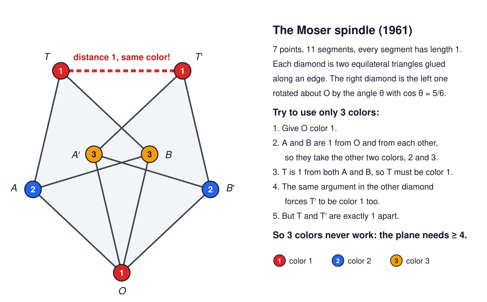

**Worked example: why three colors fail.** Each "diamond" is two equilateral triangles with side 1 that share an edge.

1. In a triangle $O, A, B$ with all sides 1, the three corners need three different colors: say $O$ is color 1, and $A, B$ are colors 2 and 3.
2. The tip $T$ is 1 away from both $A$ and $B$, so it can't be 2 or 3. With only three colors, $T$ must be color 1, the same as $O$.
3. The second diamond is the first one rotated about $O$ by the angle $\theta$ with $\cos\theta = 5/6$. The same argument forces its tip $T'$ to be color 1.
4. The rotation angle is chosen to make $T$ and $T'$ exactly 1 apart. Treat the plane as the complex numbers, so the rotation is multiplication by $u=(5+i\sqrt{11})/6$, with $\lvert u\rvert^2 = (25+11)/36 = 1$. The tips are $\sqrt{3}$ from $O$ and $T' = uT$, so

   $$\lvert T-T'\rvert^2 = 3\ \lvert 1-u\rvert^2 = 3\cdot\frac{1+11}{36} = 1.$$
5. So $T$ and $T'$ are 1 apart and have the same color. Contradiction: **three colors are never enough**, and $\chi(\mathbb{R}^2)\ge 4$.

This is the paper's own version of the spindle: $O = 0$, $A, B = (\sqrt{3}\pm i)/2$, $T=\sqrt{3}$, and their rotations by $u$. The figure shows the same graph turned upright. The seven points return at the very end of the proof (Step 8 below).

### 1.4 Why at most seven colors: hexagons

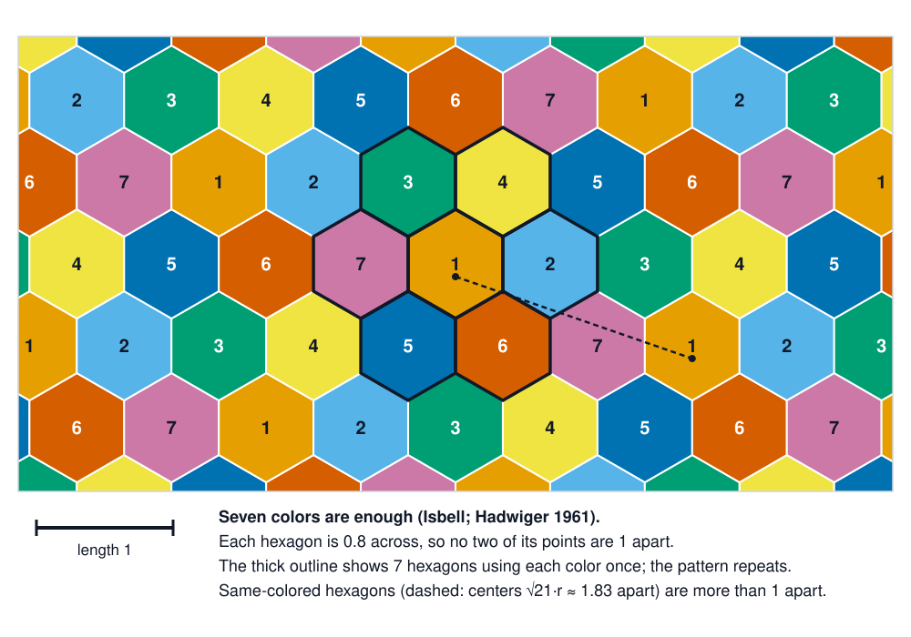

Tile the plane with regular hexagons and color them with 7 colors in a repeating pattern, so that every hexagon and its six neighbours use all 7 colors. The paper (following Hadwiger's 1961 description; the idea is due to John Isbell) makes this precise:

- Each hexagon has circumradius $r = 2/5$, so any two of its points are at most $2r = 0.8 < 1$ apart.
- The hexagon centers form a triangular lattice $\mathbb{Z}+\mathbb{Z}\omega$ (scaled), with $\omega = e^{2\pi i/3}$. Multiplying by $2-\omega$ gives a sublattice of index 7, because $\lvert 2-\omega\rvert^2 = 7$. A hexagon's color is the class of its center modulo that sublattice. (In the figure, the center $a+b\omega$ gets color $(a+2b) \bmod 7$, plus one.)
- Two different hexagons of the same color have centers at least $\sqrt{21}\ r \approx 1.83$ apart, so their points are at least $(\sqrt{21}-2)\ r \approx 1.03 > 1$ apart.

The value $2/5$ is not special. The true gap between same-colored hexagons is $\sqrt{7}\ r$ (Soifer's history makes the same computation for side-1 hexagons). So any circumradius with $2r < 1 < \sqrt{7}\ r$, that is $0.378 < r < 0.5$, works. Boundary points can go to either adjacent hexagon, so **seven colors are enough**, and $4 \le \chi(\mathbb{R}^2) \le 7$. That is where things stood for almost 70 years.

### 1.5 Finite graphs are enough in principle: de Bruijn–Erdős

In 1951 Nicolaas de Bruijn and Paul Erdős proved a **compactness theorem**: an infinite graph can be colored with $k$ colors if and only if every *finite* piece of it can. So if the plane can't be five-colored, there must be some finite set of points that can't be five-colored. (This uses the axiom of choice.)

So hunting for explicit finite graphs was a natural way to prove lower bounds, and every earlier lower bound on $\chi(\mathbb{R}^2)$ came from one. The paper also points out the flip side: *a lower bound can be proved without ever displaying the finite graph*. That is exactly what it does.

### 1.6 "No restriction on the color classes": why that phrase matters

Mathematicians also study restricted versions:

- **Measurable colorings**, where every color class has a well-defined area (it is *Lebesgue measurable*). Then you can use areas, densities and averages. Kenneth Falconer proved in 1981 that such colorings need at least 5 colors.
- **Map-type colorings**, where the color classes are regions with reasonable boundaries, like countries on a map. Then you can follow boundaries. Here at least 6 colors were known (Woodall 1973, corrected by Townsend in 1981 and 2005), and in 2025 Sokolov and Voronov proved at least 7 for polygonal colorings in a locally finite map framework.

None of these results says anything about a **completely arbitrary** coloring. With the axiom of choice there are sets with no meaningful area, and the restricted proofs can't touch them. The two settings really can differ: Payne (2009) gave a unit-distance graph on the whole plane, using only unit vectors with rational coordinates, that is two-colorable, while every *measurable* coloring of it needs at least five colors.

This paper's theorem is about arbitrary colorings: any function from the plane to five colors. It works in **ZFC**, the standard axioms of mathematics, including the axiom of choice.

---

## 2. A short history

| When | Who | What happened |
|---|---|---|
| 1945 | **Hugo Hadwiger** | A related result: if five congruent closed sets cover the plane, one of them contains two points at distance 1 |
| 1950 | **Edward Nelson, John Isbell** | The problem dates to Nelson in 1950. Nelson showed that at least 4 colors are needed, and Isbell found the hexagonal 7-coloring. Both observations were unpublished; Alexander Soifer's history records them |
| 1951 | **Nicolaas de Bruijn, Paul Erdős** | Compactness theorem: $k$ colors suffice for a graph if they suffice for every finite subgraph |
| 1960 | **Martin Gardner** | First publication of the problem, in his *Scientific American* column, which credits Leo Moser as his source (Jensen and Toft, as cited by Wikipedia; Soifer's history agrees) |
| 1961 | **Hadwiger** | Publishes the problem with the bounds 4 and 7 (*Ungelöste Probleme* Nr. 40) |
| 1961 | **Leo Moser, William Moser** | The 7-point Moser spindle, a small graph that can't be 3-colored |
| 1973; 1981, 2005 | **D. R. Woodall; S. P. Townsend** | Colorings by regular regions (maps). Townsend corrected Woodall's argument for a six-color lower bound, announcing the repair in 1981 and publishing details in 2005 |
| 1981 | **Kenneth Falconer** | Measurable colorings need at least 5 colors (density points and rotations) |
| 2009 | **Michael Payne** | Measurable and unrestricted colorings can behave very differently on translation-invariant unit-distance graphs |
| April 2018 | **Aubrey de Grey** | A finite unit-distance graph that can't be 4-colored: $\chi(\mathbb{R}^2)\ge 5$. His corrected construction has 1,581 vertices, and the proof is computer-assisted |
| 2018–2021 | **Polymath16 (D. H. J. Polymath), Marijn Heule, Jaan Parts** | Smaller 5-chromatic graphs: Heule's 553-vertex examples from satisfiability (SAT) solving and unsatisfiable-core extraction (2018); a 509-vertex graph by Parts (2020). A Polymath project organized the search |
| 2020 | **Geoffrey Exoo, Dan Ismailescu; Jaan Parts** | An alternative proof that 5 colors are needed; a human-verifiable proof (Parts) |
| 2025 | **Georgy Sokolov, Vsevolod Voronov** | Polygonal colorings (a locally finite map framework) need at least 7 colors |
| 23 Sept 2026 | **OpenAI** (internal model) | Arbitrary colorings: five colors are not enough, so $6 \le \chi(\mathbb{R}^2)\le 7$ |

The 1945, 1960 and Polymath16 rows, and the remark that de Grey's proof is computer-assisted, come from the Wikipedia article on the problem. The 1950 dates for both Nelson and Isbell, and Gardner's source, were checked against Soifer's 2003 history, which the paper cites. The month in the de Grey row is the date of his arXiv preprint (8 April 2018). Everything else in the table is stated or cited in the paper's introduction.

---

## 3. What the paper proves

> **Main theorem (Theorem 1.1).** The Euclidean plane has no proper five-coloring, even when arbitrary color classes are allowed. Consequently $6\le \chi(\mathbb{R}^2)\le 7$.

In plain words: **however you paint the plane with five colors, you can always find two points exactly 1 apart with the same color.** No condition on the color regions is needed: they don't have to have areas, boundaries or any other regularity. The proof works in ZFC. The upper bound 7 is the classical hexagon coloring from section 1.4, which the paper re-proves in a few lines, boundaries included.

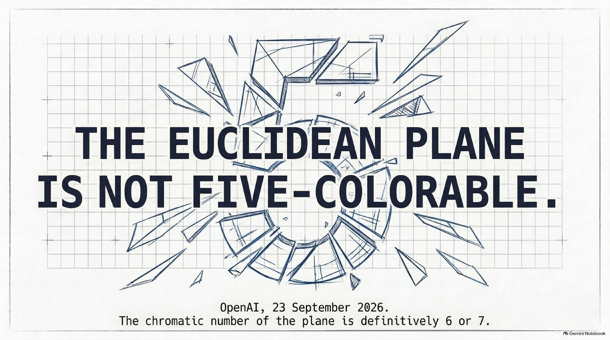

The proof is built from two theorems, and the first one holds for every number of colors.

> **Transfer of colorability (Theorem 1.3).** For every positive integer $k$: a proper $k$-coloring of the plane exists **if and only if** a *weak measurable* $k$-coloring exists.

A **weak measurable coloring** (Definition 1.2) is a coloring with measurable color classes that is proper "almost everywhere". The set of pairs $(x, u)$, with $x$ a point and $u$ a unit direction, for which $x$ and $x+u$ have the same color has measure zero. In other words, if you drop a unit needle at random, its two ends land on the same color with probability 0.

> **Geometric obstruction (Theorem 1.4).** There is no weak measurable five-coloring of the plane.

Theorem 1.1 follows at once: a proper five-coloring would give a weak measurable one by Theorem 1.3, and Theorem 1.4 says there is none.

The paper also derives a **"badness" corollary** (Corollary 1.5). There is a fixed $\delta > 0$ such that every five-coloring has *a positive proportion* of monochromatic unit pairs: at least $\delta$, measured with any invariant mean on the group of isometries of the plane. For periodic measurable colorings it is an ordinary probability: the chance that a randomly dropped unit needle has both ends on the same color. The constant $\delta$ is only shown to exist; it is not computed.

The [Lean 4 statement](https://github.com/openai/math/blob/main/lean/ComparatorChallenges/EuclideanFiveColor.lean) treats the plane as the complex numbers $\mathbb{C}$. Note that `coloring` is an arbitrary function, with no measurability hypothesis:

```lean
def ProperColoring (colorCount : ℕ) (coloring : ℂ → Fin colorCount) : Prop :=
  ∀ point otherPoint : ℂ, ‖point - otherPoint‖ = 1 → coloring point ≠ coloring otherPoint

theorem no_proper_five_coloring : ¬ ∃ coloring : ℂ → Fin 5, ProperColoring 5 coloring
```

---

## 4. Why it matters

| Question | Before | After |
|---|---|---|
| **Chromatic number of the plane** | $5 \le \chi(\mathbb{R}^2) \le 7$ (de Grey's 2018 lower bound) | $6 \le \chi(\mathbb{R}^2) \le 7$. Only two possible answers remain |
| **Measurable colorings** | At least 5 (Falconer, 1981) | At least 6 as well, because a measurable proper coloring is a special case. Theorem 1.4 even rules out five-colorings that are only proper almost everywhere |
| **Regular (map-type) colorings** | At least 6 (Townsend); at least 7 for polygonal colorings (Sokolov–Voronov, 2025) | Unchanged. The new point is that 6 now holds with no regularity at all |
| **How the lower bound is proved** | An explicit finite graph, found and checked with computer help (de Grey; Heule's SAT-based search), later also checked by hand (Parts) | No explicit graph, and no computer search is described. A finite non-5-colorable unit-distance graph must exist (de Bruijn–Erdős), but the proof neither builds it nor bounds its size |
| **Arbitrary vs. measurable colorings of the plane** | Known to differ for some unit-distance graphs (Payne) | For the whole plane, a proper $k$-coloring exists exactly when a weak measurable one does, for every $k$ (Theorem 1.3) |
| **How often must a five-coloring fail?** | No positive lower bound was known. Probabilistic work (Bourgeat et al. 2015; Gwyn–Stavrianos 2020) derives such bounds from finite graphs that can't be colored, and none was known for five colors | A fixed positive proportion $\delta$ of unit pairs (Corollary 1.5), with $\delta$ not computed |

The method is also new. The finite-graph approach looks for one explicit unsolvable puzzle. This paper goes the other way: it uses a symmetry argument to turn the hardest case, arbitrary colorings, into a case where analysis works, weak measurable colorings. Then it finishes with geometry and topology. Theorem 1.3 holds for every number of colors. So a future proof that no weak measurable six-coloring exists would immediately settle the problem at 7, and constructing one would settle it at 6.

---

## 5. The main idea of the proof

The paper is 62 pages long. Here it is at three zoom levels.

### Level 1: the one-paragraph version

Suppose a proper five-coloring existed. **Act 1: tame it.** Look at the coloring only on a countable, dense set of points (those with algebraic coordinates), and average over all algebraic shifts and rotations of it. This gives a "probabilistic coloring" that looks the same everywhere. Then filter out its wildly oscillating "static". A rigidity theorem says the static is pure white noise: it is uncorrelated with every shifted copy of itself, so removing it can't create same-colored unit pairs. One sample of what's left is a coloring with well-defined areas that is proper *almost everywhere*. **Act 2: break the tame coloring.** Stand at a point and look around the unit circle. Points 60° apart on it are exactly 1 apart (see the figure), so directions 60° apart must see different colors. With more work, this shows that each direction sees at most two colors. A topological argument, like the fact that a map of small countries must have points where three countries meet, forces the colors to run around a special point in a loop of 3, 4 or 5 colors. Each length is impossible: length 5 by counting, length 4 by a parity argument, and length 3 because it leaves a region that uses only three colors and a Moser spindle fits inside it.

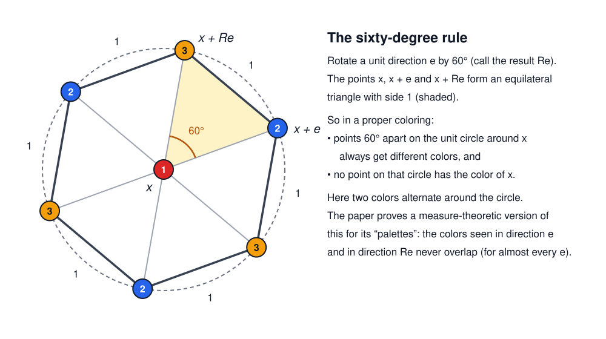

> **Analogy:** Act 1 is like noise reduction on a recording. You can't analyze pure hiss, so you filter it out, and a theorem guarantees that the filter can't add the forbidden sound. Act 2 is a proof by "looking around": the rules visible from each point contradict each other once you walk all the way around one special spot.

### Level 2: the step-by-step picture

This expands the paper's own proof-route figure (Figure 1) into more steps.

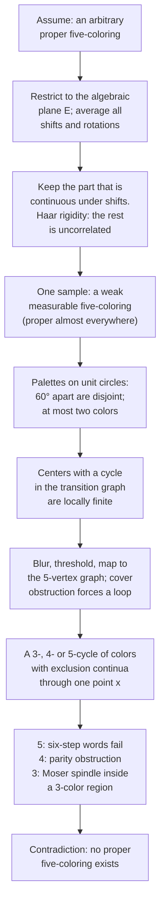
```mermaid
flowchart TD
    A["Assume: an arbitrary<br/>proper five-coloring"] --> B["Restrict to the algebraic<br/>plane E; average all<br/>shifts and rotations"]
    B --> C["Keep the part that is<br/>continuous under shifts.<br/>Haar rigidity: the rest<br/>is uncorrelated"]
    C --> D["One sample: a weak<br/>measurable five-coloring<br/>(proper almost everywhere)"]
    D --> E["Palettes on unit circles:<br/>60° apart are disjoint;<br/>at most two colors"]
    E --> F["Centers with a cycle<br/>in the transition graph<br/>are locally finite"]
    F --> G["Blur, threshold, map to<br/>the 5-vertex graph; cover<br/>obstruction forces a loop"]
    G --> H["A 3-, 4- or 5-cycle of colors<br/>with exclusion continua<br/>through one point x"]
    H --> I["5: six-step words fail<br/>4: parity obstruction<br/>3: Moser spindle inside<br/>a 3-color region"]
    I --> J["Contradiction: no proper<br/>five-coloring exists"]
```

**Step 1: Average away the arbitrariness.** Let $E$ be the points whose coordinates are real algebraic numbers (roots of polynomials with rational coefficients). $E$ is countable but dense, and the rotations $K$ with algebraic entries keep it inside itself. Restrict the hypothetical coloring to $E$. Then average over larger and larger finite sets of algebraic shifts and rotations (a *Følner sequence*; this group of motions is *amenable*, which is what makes such averaging work). The limit is a probability law on proper colorings of $E$ that is unchanged by every algebraic shift and rotation. The paper notes that this kind of invariant randomization is standard and was used before for probabilistic versions of the problem.

**Step 2: Filter out the static (the rigidity theorem).** Let $f_i$ be the indicator "the origin has color $i$" in this random coloring. Fourier analysis on $E$ (the spectral theorem) splits $f_i$ into two parts. One part, $p_i$, changes *continuously* under small shifts. The other part, $b_i$, is everything else. The central theorem of the paper (Theorem 2.3, **rigidity of wild character laws**) implies that the rotation-invariant spectral measure of $b_i$ must be a multiple (possibly zero) of Haar measure, that is, perfectly uniform "white noise". So $b_i$ has zero correlation with every nonzero (algebraic) shift of itself. Since the original coloring had zero same-color correlation at unit distance, so does the smooth part $p_i$. Moreover $p_i$ is a conditional expectation, so $0 \le p_i \le 1$ and $p_1 + \dots + p_5 = 1$: it is an honest "probability of color $i$" field.

**Step 3: Sample a weak measurable coloring.** The smooth fields extend from $E$ to the whole real plane. They admit jointly measurable versions, and then one random sample is chosen. Color each point by the first color whose field is positive there. The result has measurable color classes and is proper almost everywhere. That proves the forward half of Theorem 1.3. The reverse half uses *density points*: at points where a color class has density 1, the weak coloring is genuinely proper. Every finite configuration can be shifted onto such points, and de Bruijn–Erdős then gives a proper coloring of the whole plane.

**Step 4: Palettes, and at most two colors per direction.** From here on, assume a weak measurable five-coloring. For a center $x$ and a direction $e$, the **palette** $P_x(e)$ is the set of colors that show up near the point $x+e$ on the unit circle, in all limits of circle samples taken near $x$. Unit-distance exclusions transport along circles. The key case is the identity $e = Re + R^{-1}e$ for the 60° rotation $R$ (because $e^{i\pi/3}+e^{-i\pi/3} = 1$). It gives the **sixty-degree exclusion**: $P_x(e)$ and $P_x(Re)$ share no color, for almost every $e$. A separation lemma for "binary" centers (centers whose palettes alternate between one fixed pair of colors) then shows that **almost every palette has at most two colors** (Proposition 5.6).

**Step 5: Where three or more colors meet.** For each center $x$, the **transition graph** $\Gamma_x$ on the five colors has an edge $ij$ when colors $i$ and $j$ border each other near $x$ in a quantitative sense. Centers whose transition graph contains a **cycle** form a closed, *locally finite* set: any bounded region contains only finitely many of them (Theorem 6.5).

**Step 6: Make it continuous, then use topology.** Blur the coloring by averaging over disks of radius $\epsilon$, then drop every color whose blurred share is at most a small threshold. Outside a few tiny disks, at most two colors survive at each point. On a $10\times 10$ square, minus those tiny disks, this gives a continuous map to the complete graph on the five colors: a point with two surviving colors maps to the edge between them. Away from the special centers the transition graphs are forests, so the remaining holes can be filled continuously. If the loops around the special centers could also be filled, the pieces where each color survives would cover the whole square with every point in at most two pieces. Each piece would have diameter at most about 1, because a larger piece would straddle points at unit distance, and the unit-distance rule then empties out that color. But a square **can't** be covered by open pieces of diameter at most 2 that overlap at most two at a time. This is a planar version of "a square is two-dimensional", proved with the Brouwer fixed-point theorem (Lemma 7.5). So some loop around a special center wraps around a cycle of colors in the graph.

**Step 7: Exclusion continua.** That loop contains a simple cycle of colors of length 3, 4 or 5. For each edge of the cycle (a pair of colors), connected pieces of the map's preimage cross an annulus around the special center. Their limits are compact connected sets $K_j$ through one common point $x$. Both colors of edge $j$ are absent (almost everywhere) from the **straddling region** $\Delta(K_j)$: the points $z$ that are closer than 1 to some point of $K_j$ and farther than 1 from another. By connectedness, such a $z$ is at distance exactly 1 from some point of $K_j$.

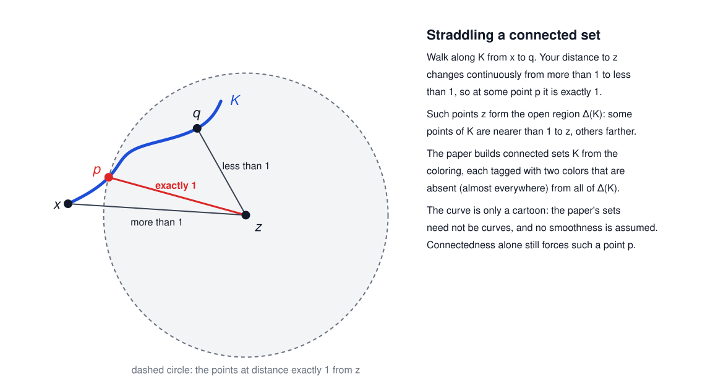

**Step 8: Three cases, three contradictions.** Each $K_j$ approaches $x$ along a limiting direction $v_j$. A direction $e$ at $x$ gets a sign for each edge: the sign of $e\cdot v_j$, that is, whether $e$ points roughly towards $v_j$ or away from it. The signs determine which colors are allowed just inside and just outside the unit circle around $x$.

- **Five colors in the cycle:** a counting argument with six-position "words" around a 60° orbit fails (the calculation is in the box below).
- **Four colors:** the four limiting directions must form two antipodal pairs, and then a parity rule for the palettes along 60° orbits can't be consistent.
- **Three colors (a triangle):** the two colors outside the triangle must alternate in six sectors of exactly 60°. Then an explicit open region around $x$ uses **only the three triangle colors**, almost everywhere. The paper places a copy of the Moser spindle (rotated by $\frac{35+12i}{37}$ and shifted) with all seven points strictly inside that region. A short rational certificate verifies this with exact rational arithmetic, without evaluating any irrational number; its interval checks need only the squaring of integers. A tiny common shift makes all seven points "typical". Now three colors properly color the Moser spindle, which section 1.3 showed is impossible.

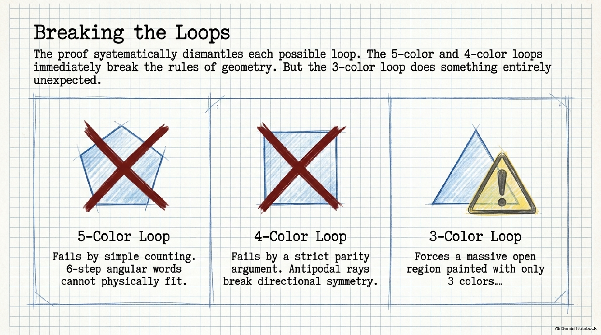

<details>
<summary><b>The five-cycle case</b> (a short counting argument)</summary>

Number the five cycle colors $0,1,2,3,4$ around the cycle, modulo 5. In this case the strip rules force almost every palette to be a "diagonal" pair $D_i = \lbrace i, i+2\rbrace$. At each direction there are only two options, whose indices differ by 2 modulo 5, and the opposite direction has the same two options.

- **60° steps:** $D_a$ and $D_b$ share no color exactly when $b - a = \pm 1 \pmod 5$. By the sixty-degree exclusion, the palette index changes by $+1$ or $-1$ at each of the six 60° steps around a full turn. The six steps must add up to $0 \pmod 5$, because the turn closes.
- **180° steps:** three steps make a half turn, and opposite directions share the same two options. So the sum of any three consecutive steps must be $0$ or $\pm 2 \pmod 5$.
- Three steps of $\pm1$ add up to $-3, -1, 1$ or $3$. None of these is $0 \pmod 5$, and only $\pm 3$ is $\pm 2 \pmod 5$. So every three consecutive steps have the **same sign**.
- Overlapping triples force all six steps to have the same sign. They add up to $\pm 6 \equiv \pm 1 \pmod 5$, not $0$. Contradiction.

(This is the proof of Proposition 8.2, with the measure-theoretic "almost every" qualifiers suppressed.)
</details>

### Level 3: the engine, for readers who know some ergodic theory

**The rigidity theorem.** Let $F$ be the real algebraic numbers, $E = F(i)$, $K = \lbrace u \in E : u\bar u = 1\rbrace$, and let $D$ be the compact dual group of the discrete group $E$. The continuous characters $z \mapsto e^{i\xi\cdot z}$, for $\xi\in\mathbb{R}^2$, form a Borel subgroup $C \subset D$. Theorem 2.3 says: **every $K$-invariant Borel probability $\nu$ on $D$ with $\nu(C) = 0$ is Haar measure.** The paper calls such measures "wild". The proof uses the compact-extension part of the Furstenberg–Zimmer structure theory. It builds a countable tower of compact extensions whose terminal factor $Y$ makes the relative product $X\times_Y X$ ergodic. A *relative singularity* lemma shows that the law of $d(x) - d(x')$, for conditionally independent samples over $Y$, still gives $C$ measure zero. Its Fourier coefficient $m(z) = \lVert \mathbb{E}(\psi_z \mid Y)\rVert_2^2$ is radial and nonnegative. Its line averages, taken with an invariant mean (no measurability in the radius is assumed), vanish. Two identities between sums of algebraic unit directions give $w(\lvert A-B\rvert)\le w(A)+w(B)$ for $w = -\log m$. They also give the averaging identity $\operatorname{Avg}_u\ m(2r\lvert\operatorname{Re} u\rvert)\to m(r)^2$ along Følner sequences. A number-field general-position argument then turns one positive value $m(r) > 0$ into a uniform positive lower bound on a whole interval of algebraic radii. That contradicts the vanishing line averages. Section 4 applies this to the spectral measure of $b_i = f_i - \mathbb{E}(f_i \mid \mathcal{F}_c)$. Here $\mathcal{F}_c$ is the factor whose $L^2$ space consists of the vectors with $L^2$-continuous translation orbits (Lemma 4.1).

**The geometric part** uses no regularity of the color boundaries. Palettes are defined from weak-$\ast$ limits of typical angular samples $e\mapsto(\mathbf 1_{A_i}(y+re))_i$ with $y\to x$, $r\to 1$. Its estimates use the decay of the Fourier transform of circle measure, without finite perimeter or smoothness of any boundary. The graph-valued map is built from thresholded disk averages $q^\epsilon$ into the one-skeleton of the 4-simplex. A reduced cyclic edge word of a non-null-homotopic core loop supplies the simple cycle (Lemma 7.7). Midpoint preimages cross an annulus around the core disk, and limits of these crossing components give the continua (Lemma 7.8 and Proposition 7.1). The final triangle case reduces to the polynomial inequality

$$\upsilon^2(3\xi^2-\upsilon^2)^2 < l^3\ (1-l/4)\ (l-1)^2,\qquad l=\xi^2+\upsilon^2\in(0,4),$$

in sector coordinates $z = \xi + i\upsilon$ around $x$. Every point satisfying it has a neighborhood that uses only the three triangle labels, almost everywhere (Lemma 8.8).

---

## 6. The people whose ideas this builds on

| Person | Idea | Where it shows up in the proof |
|---|---|---|
| **Edward Nelson, Hugo Hadwiger** | The problem itself; the classical bounds | The whole question; Hadwiger's description of the hexagon coloring for the upper bound |
| **John Isbell** | The hexagonal 7-coloring | The upper bound $\chi(\mathbb{R}^2)\le 7$ |
| **Leo Moser, William Moser** | The 7-point Moser spindle | The final contradiction in the three-color case |
| **Nicolaas de Bruijn, Paul Erdős** | Compactness for graph coloring | The converse transfer (weak measurable → proper); the existence of a finite witness in Corollary 1.5 |
| **Kenneth Falconer, Michael Payne** | Density points and rotations for measurable colorings | Density-point properness of weak colorings (Lemma 4.3) |
| **John von Neumann, Erling Følner** | Invariant means; Følner averaging over amenable groups | Building the invariant random labeling; the invariant-mean line averages |
| **Hillel Furstenberg, Robert Zimmer** (modern account by **Asgar Jamneshan**) | Structure theory of measure-preserving systems: compact extensions and relative weak mixing | The compact-factor tower behind the rigidity theorem |
| **Salomon Bochner** and the spectral theorem | Positive-definite functions; spectral measures of unitary representations | Identifying the continuous part of the random coloring |
| **L. E. J. Brouwer** | The fixed-point theorem | The planar cover obstruction (Lemma 7.5) |
| **D. R. Woodall, S. P. Townsend** | Map-type colorings need 6 colors; Townsend's annulus argument with two complementary colors near a unit circle | Townsend's argument is the predecessor of the "two outside colors" step in the three-color case |
| **Georgy Sokolov, Vsevolod Voronov** | Interface arguments for polygonal colorings | Predecessor of the straddling-region exclusion and the one-sided strips |
| **Thomas Bourgeat, Marc Heinrich, Paul Melotti, Jean-Marc Robert; Haydn Gwyn, Jacob Stavrianos** | Probabilistic Hadwiger–Nelson problems | Invariant randomization; the frequency bounds in Corollary 1.5 |
| **Aubrey de Grey, Marijn Heule, Jaan Parts, Geoffrey Exoo, Dan Ismailescu** | Finite 5-chromatic unit-distance graphs | The previous lower bound of 5, which this paper improves by a different route |

---

## 7. What it does not prove, and caveats

> [!IMPORTANT]
> **The answer is still 6 or 7.** The paper proves $\chi(\mathbb{R}^2) \ge 6$ and recalls the classical $\chi(\mathbb{R}^2) \le 7$. It says plainly that "the remaining alternatives six and seven are unresolved."

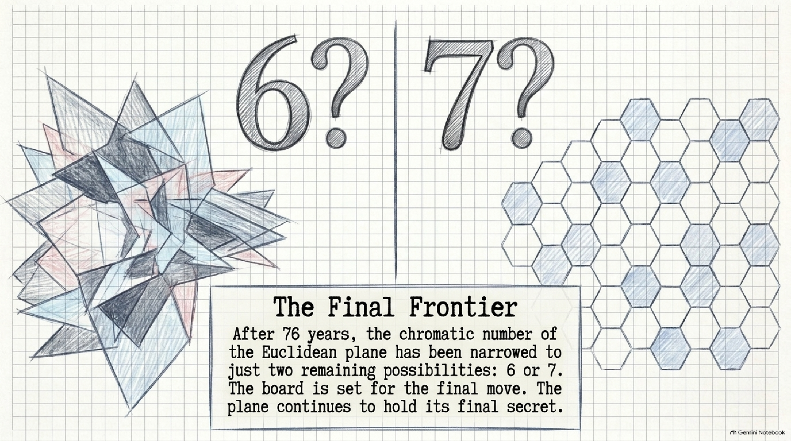

> [!IMPORTANT]
> **No finite graph, and no computer search described.** The proof does not construct a finite unit-distance graph that can't be five-colored. By de Bruijn–Erdős such a graph must exist, but the paper notes that it, and the constant $\delta$ of Corollary 1.5, are only shown to exist. The paper gives no bound on its size. The only explicit finite obstruction in the argument is the 7-point Moser spindle, and it only rules out three colors. (The proof also uses small unit-distance configurations, such as equilateral triangles and short paths of unit steps, as local tools.) The spindle's placement inside the three-color region is checked by a small rational certificate written out in the paper. The paper describes no SAT solving or computer search.

> [!NOTE]
> **Set theory.** The theorem is proved in ZFC, the standard axioms including the axiom of choice. Choice is what makes non-measurable color classes possible, and the compactness step uses it too. Wikipedia notes, citing Soifer (2008) and Shelah and Soifer (2003), that the answer to the Hadwiger–Nelson problem could in principle depend on the axioms of set theory. The paper does not discuss this question; its result is a theorem of ZFC.

> [!NOTE]
> **Provenance.** The paper was produced by an unreleased internal OpenAI model as part of the [openai/math](https://github.com/openai/math) release. That repository's README says most results came from one fixed procedure, averaging about three hours of ChatGPT Pro thinking compute per result. This paper is not among the exceptions the README lists. The README also warns that unformalized results "could have issues"; this one is formalized (next note).

> [!NOTE]
> **Verification status.** [`lean/docs/158.md`](https://github.com/openai/math/blob/main/lean/docs/158.md) says the formalized results prove that five colors don't suffice and that seven colors do. The lower bound covers arbitrary colorings, "with no measurability or continuity assumption", and the upper bound includes every boundary point. The two Comparator statements it links correspond to two entries in the main-results list of [`lean/formalization.yaml`](https://github.com/openai/math/blob/main/lean/formalization.yaml). One is `OAI.EuclideanFiveColor.no_proper_five_coloring`, in `OAI/Geometry/PlaneColoring/Five.lean`, checked against [EuclideanFiveColor.lean](https://github.com/openai/math/blob/main/lean/ComparatorChallenges/EuclideanFiveColor.lean). The other is `OAI.Problem160.properColoring_seven`, in `OAI/Geometry/PlaneColoring/Seven.lean`, checked against [PlaneColoring.lean](https://github.com/openai/math/blob/main/lean/ComparatorChallenges/PlaneColoring.lean). Both Comparator configurations permit only the axioms `propext`, `Quot.sound` and `Classical.choice`. The catalogue's project-wide fields give the automation method as "agent" and the review status as "unchecked". The general transfer theorem for every $k$ (Theorem 1.3) and the badness corollary (Corollary 1.5) are not listed as separate formalized statements. This explainer did not re-run the Lean build or the Comparator check.

> [!NOTE]
> **Preprint status.** As of October 2026 this is a preprint in the openai/math collection. It has not been through journal peer review.

> [!NOTE]
> **A competing claim.** In a footnote, the paper discusses a manuscript by Reed (version of 14 May 2026, posted on GitHub) that announces $\chi(\mathbb{R}^2) = 7$ through a circle-density argument. That manuscript proposes a strict bound of $\pi/3$ on the angular measure of any subset of the unit circle with no two points 1 apart. The paper points out that the half-open arc $\lbrace e^{it} : 0 \le t < \pi/3\rbrace$ has angular measure exactly $\pi/3$ and contains no such pair, so the bound fails. It adds that the manuscript's formal theorem assumes this bound as a hypothesis, and concludes that the argument does not establish $\chi(\mathbb{R}^2) = 7$. This explainer has not examined the Reed manuscript.

> [!TIP]
> **Simplifications.** To stay readable, this explainer suppresses most "almost every" qualifiers, the choice of typical points and Borel representatives, the details of the compact-factor tower, and the exact construction of the hole-filling maps. Every precise statement is in the paper.

---

## 8. Glossary

| Term | Meaning |
|---|---|
| **Proper coloring** | A coloring in which points at distance exactly 1 always get different colors |
| **Chromatic number of the plane** $\chi(\mathbb{R}^2)$ | The fewest colors that allow a proper coloring of the plane. By this paper (formalized in Lean, not yet peer reviewed), it is 6 or 7 |
| **Hadwiger–Nelson problem** | The problem of determining $\chi(\mathbb{R}^2)$ |
| **Unit-distance graph** | Points in the plane, with an edge between any two at distance 1 |
| **Moser spindle** | A 7-point, 11-edge unit-distance graph that needs 4 colors |
| **de Bruijn–Erdős theorem** | A graph is $k$-colorable if and only if all its finite subgraphs are (uses the axiom of choice) |
| **ZFC / axiom of choice** | The standard axioms of mathematics. Choice allows sets so irregular that they have no area |
| **Lebesgue measurable set** | A set with a well-defined area; "measure zero" means area zero |
| **Almost everywhere** | Everywhere except on a set of measure zero |
| **Density point** | A point where a set fills almost all of every tiny disk around it |
| **Weak measurable coloring** | A measurable coloring whose same-color unit pairs have measure zero (Definition 1.2) |
| **Amenable group, Følner averaging, invariant mean** | Groups with good averages: you can average over growing finite sets of motions so that shifting barely changes the average |
| **Character, dual group** | A homomorphism from a group into the unit circle; all of them together form the dual group $D$ (Fourier analysis on a group) |
| **Haar measure** | The uniform probability on a compact group. On $D$ it corresponds to "white noise" with no correlations |
| **Spectral measure** | The measure that records which frequencies a function on a group contains |
| **Conditional expectation** | The best approximation of a random quantity using only partial information. Applied to the color indicators, it keeps their values between 0 and 1 and their sum equal to 1 |
| **Palette** $P_x(e)$ | The colors that appear in the limit near the point $x+e$ on the unit circle around $x$ |
| **Transition graph** $\Gamma_x$ | A graph on the colors, recording which pairs of colors border each other near $x$ |
| **Continuum** | A compact connected set, like a curve but possibly much wilder |
| **Straddling region** $\Delta(K)$ | The points that are closer than 1 to some part of $K$ and farther than 1 from another part |
| **Null-homotopic loop** | A loop that can be shrunk to a point inside the space it lives in |
| **Brouwer fixed-point theorem** | Every continuous map of a disk (or square) into itself has a fixed point |
| **Lean 4 / Comparator** | A proof assistant that mechanically checks every step of a proof, and openai/math's tool for checking a formal proof against a fixed theorem statement |

---

## 9. Slides, audio and other assets

The slide deck below was generated with **Google NotebookLM** (now "Gemini Notebook") from the paper, the Lean scope document and the Wikipedia article on the Hadwiger–Nelson problem. It is kept exactly as NotebookLM produced it. It is AI-generated, and several slides have errors: slides 4, 5, 10 and 14 in particular have wrong pictures or invented details, and slide 7 has garbled text. See the [errata](assets/README.md#errata) before relying on any of it. The other planned NotebookLM assets (two infographics, a report, a mind map and an audio overview) have not been generated yet, because the shared NotebookLM quota ran out.

| Asset | What it is |
|---|---|
| [Slide deck (PDF)](assets/notebooklm/slides.pdf) ([PPTX](assets/notebooklm/slides.pptx)) | 15-slide beginner deck, unrevised |
| [Moser spindle](assets/figures/moser-spindle.svg) ([PNG](assets/figures/moser-spindle.png)) | Hand-made: the 7-point graph, with the forced three-coloring and the monochromatic unit edge |
| [Hexagon seven-coloring](assets/figures/hexagon-seven-coloring.svg) ([PNG](assets/figures/hexagon-seven-coloring.png)) | Hand-made: the paper's version of Isbell's coloring, with $r = 2/5$ and colors $(a+2b) \bmod 7$ |
| [Sixty-degree rule](assets/figures/sixty-degree-rule.svg) ([PNG](assets/figures/sixty-degree-rule.png)) | Hand-made: why directions 60° apart on a unit circle see different colors |
| [Straddling region](assets/figures/straddling-region.svg) ([PNG](assets/figures/straddling-region.png)) | Hand-made: a cartoon of a connected set $K$ and a point $z$ in $\Delta(K)$ |

<details>
<summary><b>All 15 slides</b> (click to expand; see the errata first)</summary>

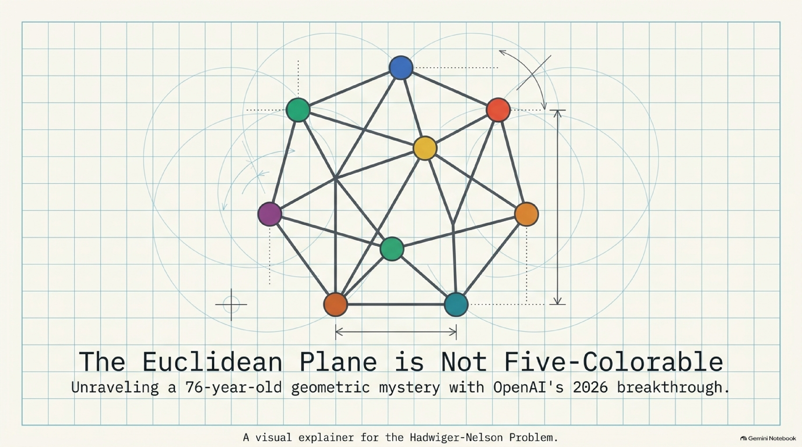

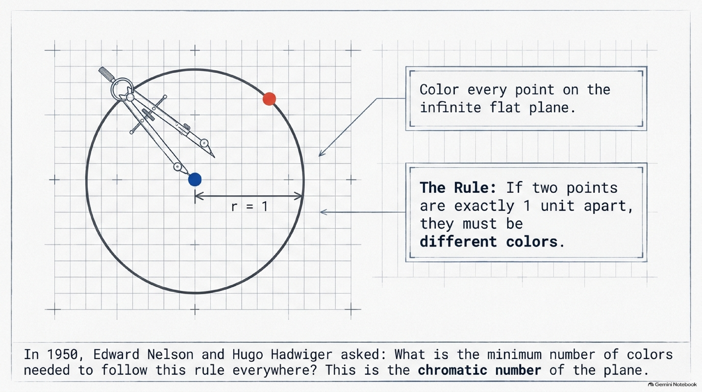

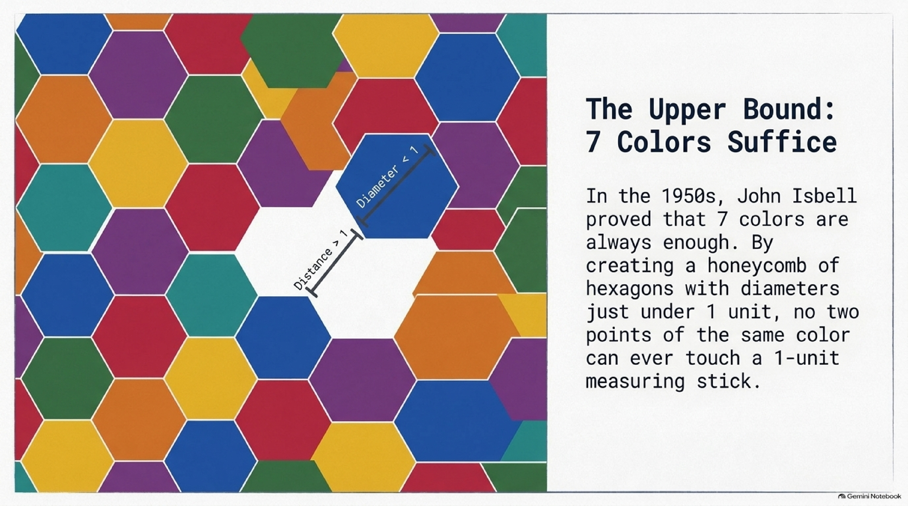

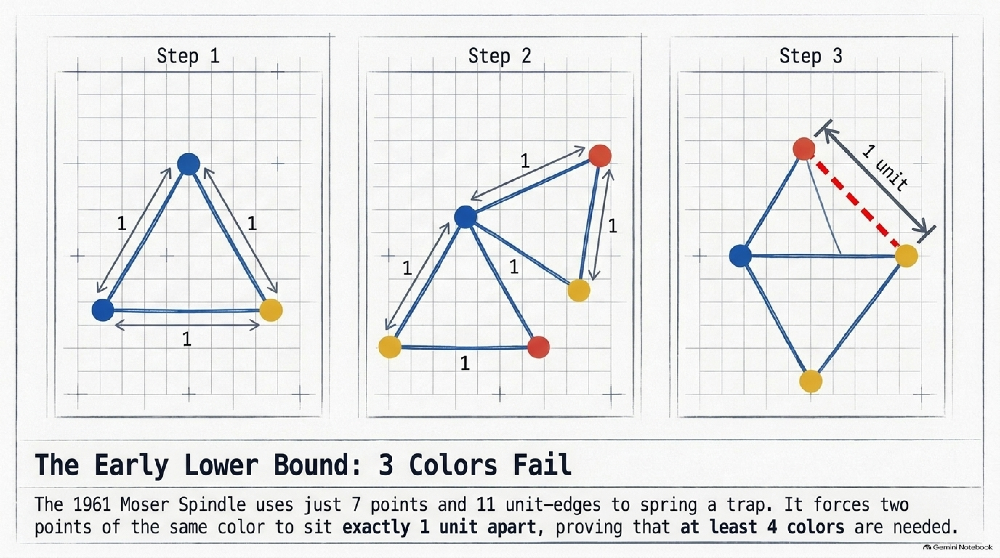

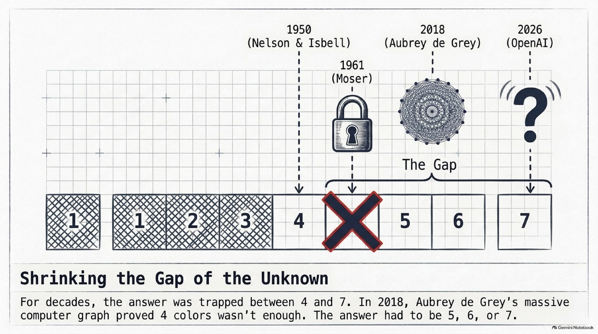


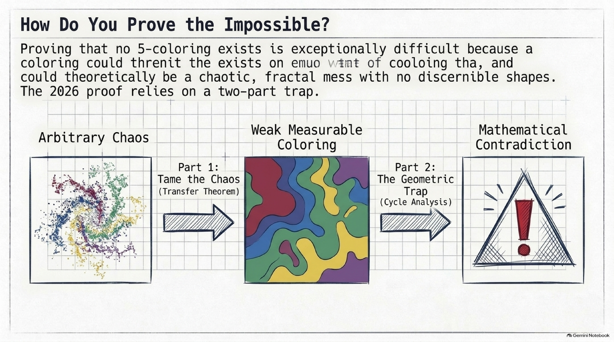

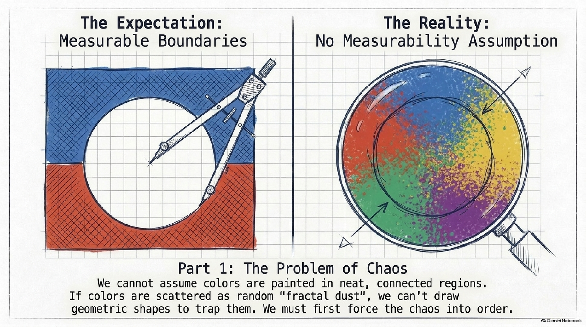

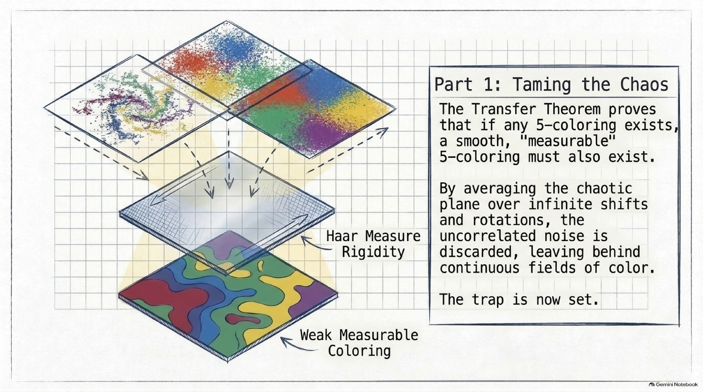

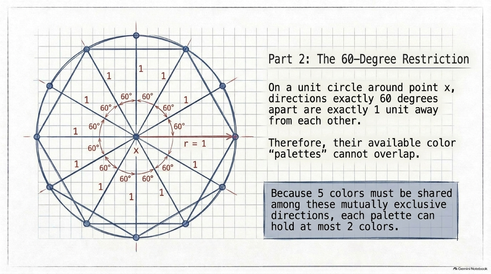

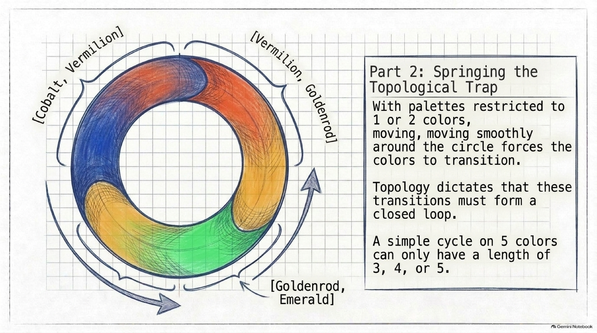


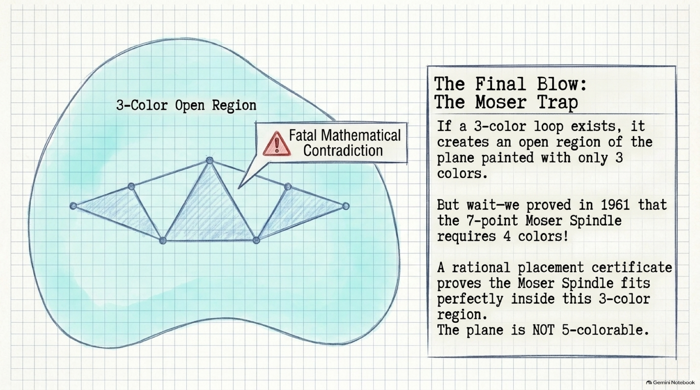

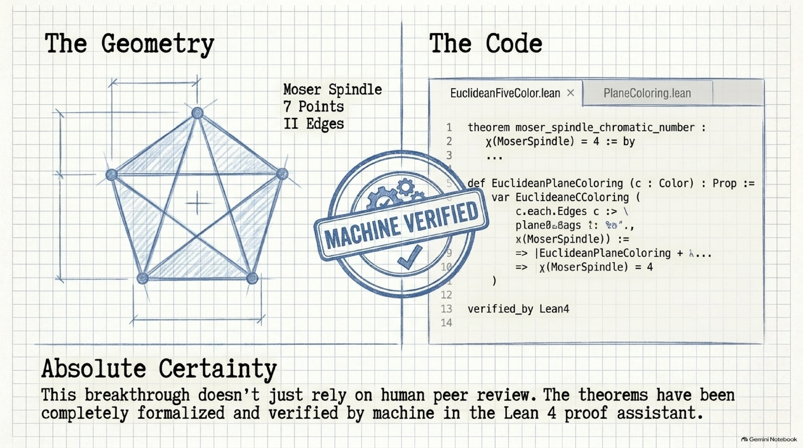


</details>

---

## How this explainer was made

1. The paper, its TeX source, and the Lean scope document were downloaded from [openai/math](https://github.com/openai/math/tree/main/preprints/The-Euclidean-plane-is-not-five-colorable-September-23-2026).
2. They were loaded into a NotebookLM notebook through the [`notebooklm-mcp-cli`](https://github.com/jacob-bd/gemini-notebook-mcp-cli) MCP/CLI, together with the Wikipedia article on the Hadwiger–Nelson problem as background. The NotebookLM assets come from a notebook on a second NotebookLM account. Only the slide deck in [`assets/notebooklm/`](assets/notebooklm/) has been generated so far. Every slide was compared with the paper, and the errors are listed in the [errata](assets/README.md#errata). The planned single revision of the deck was not run, for lack of quota.
3. The text on this page was written by hand (with AI assistance) directly from the paper's TeX source, not from NotebookLM output: the introduction and proof overview, the statements in every section, and the transfer, palette, interface and angular arguments. The Lean status comes from `lean/docs/158.md`, `lean/formalization.yaml` and the Comparator statement files. The figures were drawn as SVG from coordinates computed numerically. Every unit edge was checked, and the paper's seven-point Moser placement was re-checked against its certificate table.

See [`PIPELINE.md`](../../PIPELINE.md) for the exact, repeatable steps.

*Citation for the underlying paper:*

```bibtex
@misc{OAI:The-Euclidean-plane-is-not-five-colorable-September-23-2026,
  author = {{OpenAI}},
  title = {{The Euclidean plane is not five-colorable}},
  howpublished = {OpenAI Math Release preprint
                  \href{https://github.com/openai/math/blob/main/preprints/The-Euclidean-plane-is-not-five-colorable-September-23-2026/paper.pdf}{OAI:The-Euclidean-plane-is-not-five-colorable-September-23-2026}},
  year = {2026}
}
```
