# The Hilbert–Smith conjecture in every dimension, explained for beginners

> - **Paper:** [*The Hilbert–Smith conjecture in every finite dimension*](https://github.com/openai/math/blob/main/preprints/The-Hilbert-Smith-conjecture-in-every-finite-dimension-September-23-2026/paper.pdf), OpenAI, 23 September 2026 (46 pages)
> - **openai/math family:** 304, *The Hilbert–Smith conjecture in every dimension* · **Field:** topology (topological transformation groups)
> - **Companions:** none. Family 304 consists of this one paper
> - **Formal proof:** none. openai/math has no Lean formalization for family 304 (no `lean/docs/304.md`, and no entry in `lean/formalization.yaml`)
> - **Who this is for:** anyone who knows basic point-set topology (open sets, compactness, connectedness, what a manifold is) and basic group theory (subgroups, homomorphisms, quotients). Level 3 of section 5 is an optional part for readers who know some sheaf theory and algebraic topology.

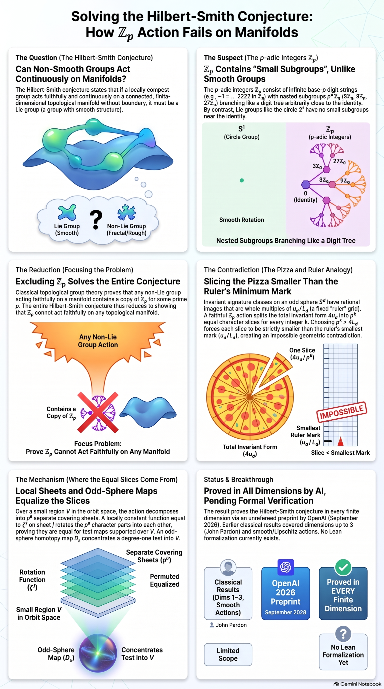

*AI-generated overview. The big picture is right, including the pizza-and-ruler mechanism, but it has typos and garbled subgroup labels, writes "p^6 sheets" for p^k, and its badges overstate the status of an unrefereed preprint. See the [errata](assets/README.md#errata).*

## Contents

- [TL;DR](#tldr)
- [How to read this](#how-to-read-this)
- [1. The problem](#1-the-problem)
- [2. A short history](#2-a-short-history)
- [3. What the paper proves](#3-what-the-paper-proves)
- [4. Why it matters](#4-why-it-matters)
- [5. The main idea of the proof](#5-the-main-idea-of-the-proof)
- [6. The people whose ideas this builds on](#6-the-people-whose-ideas-this-builds-on)
- [7. What it does not prove, and caveats](#7-what-it-does-not-prove-and-caveats)
- [8. Glossary](#8-glossary)
- [9. Slides, audio and other assets](#9-slides-audio-and-other-assets)
- [How this explainer was made](#how-this-explainer-was-made)

---

## TL;DR

- **The question.** A **Lie group** is a group that is also a smooth manifold, such as the circle, the rotations of space, or the invertible matrices. These are the symmetry groups of smooth geometry. **Hilbert's fifth problem** (1900) asked how much of this theory survives if you drop differentiability. For a group that is itself a manifold, the answer came in 1952 (Gleason; Montgomery and Zippin): it is automatically a Lie group. The **Hilbert–Smith conjecture** is the version about *actions*: if a locally compact group acts faithfully and continuously on a connected manifold, must it be a Lie group?
- **What was known.** Classical structure theory reduces the conjecture to a single kind of group: the **$`p`$-adic integers** $`\mathbb{Z}_p`$ (one for each prime $`p`$), a compact group shaped like a Cantor set, with arbitrarily small subgroups. The conjecture was known in dimensions 1 and 2 (classical) and 3 (Pardon, 2013), and for actions with extra regularity (smooth, Lipschitz, Hölder with a large exponent, quasiconformal). For merely continuous actions in dimension 4 and higher it was open.
- **What this paper proves.** The conjecture in **every finite dimension**: a locally compact, second-countable, Hausdorff group acting faithfully and jointly continuously on a connected, Hausdorff, second-countable topological $`n`$-manifold without boundary is a Lie group. The heart of it is that $`\mathbb{Z}_p`$ can never act faithfully on such a manifold.
- **How.** The paper builds a "signature" invariant, made from symmetric forms on sheaves over an odd-dimensional sphere $`S^d`$ with $`d > n`$. It proves that the invariant's values lie in a fixed lattice $`L_d^{-1}\mathbb{Z}\,\bar u_d`$. A faithful $`\mathbb{Z}_p`$-action would split one class worth $`4\bar u_d`$ into $`p^k`$ provably equal pieces, for every $`k`$. Once $`p^k > 4L_d`$, each piece is too small to fit in the lattice.
- **What it doesn't do.** It is an AI-generated preprint with no Lean formalization and no referee report yet. The theorem is stated for finite-dimensional manifolds without boundary and for second-countable groups. It says nothing about groups that are not locally compact, or about spaces that are not manifolds (where $`\mathbb{Z}_p`$ *can* act faithfully).

## How to read this

| You have… | Read |
|---|---|
| 2 minutes | The TL;DR and the infographic above |
| 15 minutes | Sections 1, 3, 4 and 7, and the [worked example](#15-the-p-adic-integers-and-why-they-are-not-a-lie-group) in section 1.5 |
| An hour, and you like topology | Everything, including [section 5](#5-the-main-idea-of-the-proof) |

---

## 1. The problem

### 1.1 Groups of symmetries, and Lie groups

A **topological group** is a group with a topology in which multiplication and inversion are continuous. A **Lie group** is a topological group that is also a smooth manifold, with smooth multiplication and inversion. Examples:

- the real line $`(\mathbb{R}, +)`$ and the plane $`(\mathbb{R}^2, +)`$;
- the circle $`S^1 = \mathbb{R}/\mathbb{Z}`$ (rotations of the plane) and the torus $`S^1 \times S^1`$;
- the rotation group $`SO(3)`$ of 3-dimensional space, and the invertible matrices $`GL_n(\mathbb{R})`$;
- every finite group, viewed as a 0-dimensional manifold.

Lie groups are the natural symmetry groups of geometry, and they **act** on manifolds. $`SO(3)`$ rotates the sphere $`S^2`$. The circle rotates the plane about the origin. $`GL_n(\mathbb{R})`$ acts on $`\mathbb{R}^n`$.

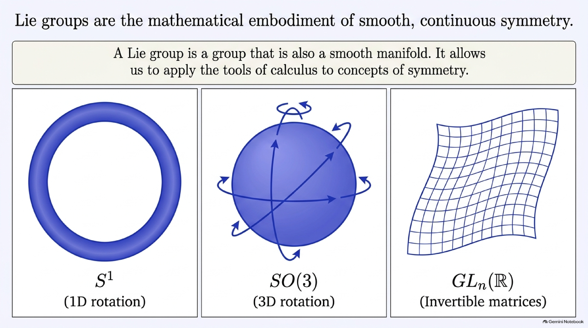

### 1.2 Hilbert's fifth problem

In 1900 David Hilbert published his famous list of problems. In the paper's words, the fifth "asked how far differentiability assumptions could be removed from the theory of continuous transformation groups". Sophus Lie had built that theory using derivatives. Was smoothness really needed, or does it come for free?

The question has two natural readings.

1. **The group is itself a manifold.** If a topological group is locally Euclidean, must it be a Lie group? Yes. Gleason and Montgomery–Zippin proved this in 1952, in back-to-back papers in the *Annals of Mathematics*. Yamabe extended the structure theory to all locally compact groups in 1953. (Earlier special cases, from the Wikipedia background source: von Neumann for compact groups in 1933, and Pontryagin for locally compact abelian groups in 1934.)
2. **The group acts on a manifold.** This is the **Hilbert–Smith conjecture**, named after Hilbert and Paul A. Smith (Wikipedia cites Smith's 1941 lectures on periodic transformations). Pardon calls it "a natural generalization of Hilbert's fifth problem". The Wikipedia article on Hilbert's fifth problem (this explainer's background source), written before this preprint, still calls it open in full generality.

> **Hilbert–Smith conjecture.** If a locally compact group $`G`$ acts faithfully and continuously on a connected manifold $`M`$, then $`G`$ is a Lie group.

The words "locally compact" matter. For example, the group $`\mathrm{Homeo}(S^1)`$ of *all* homeomorphisms of the circle acts faithfully on the circle, but it is infinite-dimensional, not locally compact, and not a Lie group. (This standard example is ours, not the paper's.)

### 1.3 The hypotheses, one word at a time

| Word | Meaning | Example |
|---|---|---|
| **Locally compact** | Every point has a compact neighbourhood | $`\mathbb{R}^n`$, every Lie group, and $`\mathbb{Z}_p`$ (section 1.5) |
| **Hausdorff** | Distinct points have disjoint neighbourhoods | All the spaces in this explainer |
| **Second countable** | The topology has a countable base | $`\mathbb{R}^n`$; a countable discrete group |
| **Action** | A map $`G \times M \to M`$, written $`(g,x) \mapsto g\cdot x`$, with $`e\cdot x = x`$ and $`g\cdot(h\cdot x) = (gh)\cdot x`$ | Rotations acting on the plane |
| **Jointly continuous** | The map $`G \times M \to M`$ is continuous in both variables together. The paper notes that this is the same as a continuous homomorphism $`G \to \mathrm{Homeo}(M)`$, with the compact-open topology | |
| **Faithful** | Only the identity element acts as the identity map: the kernel is trivial. In the paper's words, "faithfulness does not require point stabilizers to be trivial" | Rotations of the plane: faithful, even though every rotation fixes the origin |
| **Connected $`n`$-manifold without boundary** | A connected space that looks like $`\mathbb{R}^n`$ near every point | $`\mathbb{R}^n`$, the sphere $`S^n`$, the open Möbius band. Not the closed disk, which has a boundary circle |

### 1.4 "No small subgroups"

The key property separating Lie groups from other locally compact groups is simple to state. A topological group has **no small subgroups** if some neighbourhood $`N`$ of the identity contains no subgroup except $`\lbrace e\rbrace`$.

The circle has this property. Take $`N = (-1/4, 1/4)`$, measured in turns. If $`x \neq 0`$ is in $`N`$, its multiples $`x, 2x, 3x, \dots`$ walk around the circle and eventually leave $`N`$, so no subgroup other than $`\lbrace 0\rbrace`$ fits inside. We computed when this happens:

| $`x`$ (turns) | 0.1 | 0.01 | 0.001 | 0.000001 |
|---|---|---|---|---|
| first $`n`$ with $`nx \notin (-1/4, 1/4)`$ | 3 | 25 | 250 | 250,000 |

Smaller steps take longer to escape, but they always escape. All Lie groups behave this way. The deep converse comes from the solution of Hilbert's fifth problem: a locally compact group with no small subgroups **is** a Lie group. (Pardon cites Yamabe's 1953 paper for this form. Wikipedia credits the characterization to Gleason, Montgomery and Zippin.) So the enemy is a group that has small subgroups.

### 1.5 The p-adic integers, and why they are not a Lie group

Fix a prime $`p`$. The **$`p`$-adic integers** are the inverse limit

```math
\mathbb{Z}_p=\varprojlim_k \mathbb{Z}/p^k\mathbb{Z},
```

which is how the paper defines them. Concretely, an element is an infinite string of base-$`p`$ digits $`\dots d_2 d_1 d_0`$, added and multiplied with carries that run to the left forever. Reducing it modulo $`p^k`$ means keeping the last $`k`$ digits. Here are some elements of $`\mathbb{Z}_3`$, computed by script:

| Number | Its 3-adic digits | Check |
|---|---|---|
| $`-1`$ | $`\dots 22222222`$ | Adding 1 carries forever and gives $`\dots 00000000 = 0`$ |
| $`1/2`$ | $`\dots 11111112`$ | $`2 \times 3281 = 6562 \equiv 1 \pmod{3^8}`$, where $`3281 = 11111112_3`$ |
| $`5`$ | $`\dots 00000012`$ | An ordinary integer has finitely many nonzero digits |
| $`81`$ | $`\dots 00010000`$ | $`81 = 3^4`$ ends in four zeros |

Two numbers are **close** when they agree in many final digits. Write $`v`$ for the number of trailing zeros of $`x`$. The $`p`$-adic size is $`\lvert x\rvert_p = p^{-v}`$. For example, $`\lvert 9\rvert_3 = 1/9`$, $`\lvert 54\rvert_3 = 1/27`$, and $`\lvert 1\rvert_3 = \lvert 2\rvert_3 = 1`$. With this topology, $`\mathbb{Z}_p`$ is a compact group (the paper calls it "the additive group of $`p`$-adic integers … with its profinite topology").

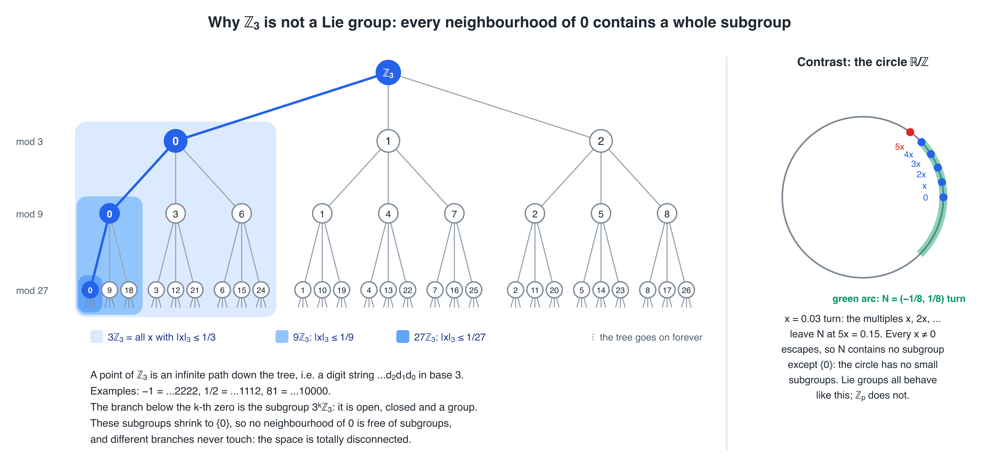

**Worked example: $`\mathbb{Z}_p`$ is not a Lie group.** Here are two independent reasons, both visible in the figure.

1. **It has small subgroups.** The numbers ending in at least $`k`$ zeros form the subgroup $`p^k\mathbb{Z}_p`$, which is exactly the ball $`\lbrace x : \lvert x\rvert_p \le p^{-k}\rbrace`$. It is open, and it is a whole group: a multiple of a number ending in $`k`$ zeros still ends in at least $`k`$ zeros. (Our script checked $`\lvert n\cdot 3^k\rvert_3 \le 3^{-k}`$ for every $`n < 2000`$ and $`k = 1, 2, 3, 5`$. It holds for all $`n`$, because $`\lvert n\rvert_3 \le 1`$.) These subgroups shrink to $`\lbrace 0\rbrace`$, so **every** neighbourhood of 0 contains one of them. Compare the circle: small elements escape, small subgroups don't exist. By section 1.4, $`\mathbb{Z}_p`$ cannot be a Lie group.
2. **It is totally disconnected, yet not discrete.** The last digit splits $`\mathbb{Z}_p`$ into $`p`$ disjoint pieces that are both open and closed. Each piece splits again by the next digit, forever. So no connected subset has more than one point; topologically, $`\mathbb{Z}_p`$ is a Cantor set. A Lie group of positive dimension contains little arcs, so if $`\mathbb{Z}_p`$ were a Lie group it would be 0-dimensional, that is, discrete. A compact discrete group is finite. But $`\mathbb{Z}_p`$ is infinite (and 0 is the limit of $`p, p^2, p^3, \dots`$, so it isn't discrete either).

There is nothing wrong with $`\mathbb{Z}_p`$ acting faithfully on *some* spaces: it acts on itself, a Cantor set, by translation. Pardon's introduction also cites Raymond and Williams for faithful $`\mathbb{Z}_p`$-actions on compact metric spaces of every dimension $`n \ge 2`$. The conjecture is that it can't do this on a **manifold**.

### 1.6 The reduction to the p-adic integers, and Newman's theorem

The structure theory from Hilbert's fifth problem turns the conjecture into a question about a single group. The paper states this "classical Hilbert–Smith reduction" in its final proof, citing Pardon's introduction:

> A locally compact group that acts faithfully and continuously on a connected manifold, and is not a Lie group, contains a topologically embedded copy of $`\mathbb{Z}_p`$ for some prime $`p`$.

So the Hilbert–Smith conjecture is equivalent to: **no $`\mathbb{Z}_p`$ acts faithfully on a connected manifold.** The paper says the reduction "combines this structure theory with rigidity of periodic transformations", and it points to Lee (1997) for a treatment.

The rigidity input is **Newman's theorem** (1931). In the form the paper uses:

> A finite-order homeomorphism of a connected manifold that fixes a nonempty open set pointwise is the identity.

For example, a rotation of the plane by 120° has order 3 and fixes only the origin, and a reflection fixes only a line. Consistent with Newman's theorem, neither fixes an open set. Pardon's introduction puts the intuition this way. What distinguishes $`\mathbb{Z}_p`$ from a Lie group is its small subgroups $`p^k\mathbb{Z}_p`$. Newman's theorem implies that a compact Lie group acting nontrivially on a manifold "must have large orbits". So ruling out $`\mathbb{Z}_p`$ is, "in essence", extending Newman's theorem to $`\mathbb{Z}_p`$.

The paper also uses Newman's theorem a second time, inside the proof (Proposition 5.1), to move the whole problem into a single coordinate chart. See section 5.

### 1.7 What was known before

- **Dimensions 1 and 2.** Classical. Pardon cites Montgomery and Zippin's 1955 book, and later gave his own account of the 2-dimensional case (2019), crediting Montgomery–Zippin.
- **Dimension 3.** Proved by John Pardon in 2013. In the paper's words, his local argument "uses incompressible surfaces in a suitable invariant open set and the resulting action on a surface mapping class group".
- **Restricted classes of actions.** If the transformations are better than merely continuous, or of a special kind, the conjecture was known in every dimension, on the manifolds each result covers:
  - differentiable actions, by Bochner and Montgomery (1946; Pardon says $`C^2`$);
  - Lipschitz actions on Riemannian manifolds, by Repovš and Ščepin (1997);
  - Hölder actions on closed manifolds with a common exponent above $`n/(n+2)`$, by Maleshich (1997);
  - quasiconformal actions, by Martin (1999);
  - uniformly quasisymmetric actions on suitable compact metric spaces, by Mj (2012);
  - and, in symplectic topology, actions by homeomorphisms in the $`C^0`$-closure of the Hamiltonian diffeomorphisms of suitable closed symplectic manifolds, by Shelukhin (2024).
- **Yang's dimension jump.** C. T. Yang (1960) showed that a faithful $`\mathbb{Z}_p`$-action on an $`n`$-manifold would force the orbit space $`M/\mathbb{Z}_p`$ (the space obtained by collapsing each orbit to a single point) to have (integral) cohomological dimension $`n + 2`$. Cohomological dimension is a measure of dimension read off from cohomology, and for an $`n`$-manifold it is $`n`$. (The precise "$`n+2`$" is from Pardon's introduction. The paper itself speaks of "the dimension-raising theory of Yang and Bredon–Raymond–Williams".) The Lipschitz proof uses an averaged invariant metric to keep the Hausdorff dimension of the orbit space too small for this jump. The Raymond–Williams examples above show that the jump itself can happen on compact metric spaces, so the jump alone is not a contradiction.

---

## 2. A short history

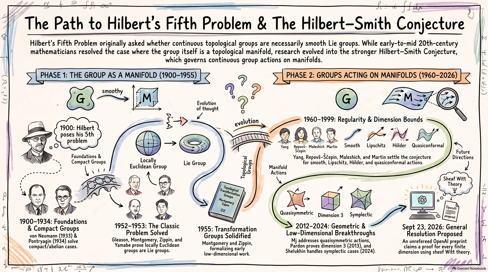

*AI-generated timeline. Its caption for 1960–1999 misattributes the regularity cases: Yang proved the dimension jump, and the smooth case is Bochner–Montgomery (1946), who are missing, as are Newman and Smith. The portraits are generated likenesses. The table below is the checked version; see the [errata](assets/README.md#errata).*

Entries marked † come from the Wikipedia background source or from Pardon's 2013 introduction rather than from this paper. All others are cited in the paper.

| When | Who | What happened |
|---|---|---|
| 1900 | **David Hilbert** | The fifth of his 23 problems: Lie's theory of continuous transformation groups without differentiability (English version in the *Bulletin of the AMS*, 1902) |
| 1931 | **M. H. A. Newman** | A finite-order homeomorphism of a connected manifold fixing an open set is the identity |
| 1933, 1934 | **John von Neumann; Lev Pontryagin** † | The fifth problem for compact groups, then for locally compact abelian groups |
| 1941 | **Paul A. Smith** † | Lectures on periodic and nearly periodic transformations; the conjecture is named after him and Hilbert |
| 1946 | **Salomon Bochner, Deane Montgomery** | Locally compact groups of differentiable transformations are Lie groups |
| 1952 | **Andrew Gleason; Deane Montgomery, Leo Zippin** | Locally Euclidean groups are Lie groups: the fifth problem in its "group is a manifold" form |
| 1953 | **Hidehiko Yamabe** | Structure theory for all locally compact groups; no small subgroups implies Lie |
| 1955 | **Montgomery, Zippin** | *Topological Transformation Groups*, the standard reference; it covers dimensions 1 and 2 † |
| 1960 | **Chung-Tao Yang** | $`p`$-adic transformation groups: the orbit space would have cohomological dimension $`n+2`$ † |
| 1961 | **Glen Bredon, Frank Raymond, Robert Williams; Raymond** | $`p`$-adic groups of transformations and their orbit spaces |
| 1997 | **Dušan Repovš, Evgenij Ščepin** | The conjecture for Lipschitz actions on Riemannian manifolds |
| 1997 | **Maleshich** | The conjecture for Hölder actions with exponent above $`n/(n+2)`$, on closed manifolds |
| 1997 | **Joo Sung Lee** | An exposition of the reduction to $`\mathbb{Z}_p`$ |
| 1999 | **Gaven Martin** | The conjecture for quasiconformal actions |
| 2012 | **Mahan Mj** | Uniformly quasisymmetric actions, with applications to boundaries of hyperbolic groups |
| 2013 | **John Pardon** | The conjecture in dimension 3 (*J. Amer. Math. Soc.*) |
| 2019 | **John Pardon** | A short account of the 2-dimensional case, crediting Montgomery–Zippin |
| 2024 | **Egor Shelukhin** | A symplectic Hilbert–Smith conjecture, by Floer theory (arXiv preprint) |
| 23 Sep 2026 | **OpenAI** (internal model) | This paper: the conjecture in every finite dimension |

The paper's proof method has its own line of ancestors, listed in [section 6](#6-the-people-whose-ideas-this-builds-on): Verdier's duality for sheaves (1965), Balmer's triangular Witt groups (2000), Balmer–Walter (2002), Hornbostel–Schlichting (2004), Woolf's Witt groups of sheaves (2008) and Ranicki–Weiss (2010).

---

## 3. What the paper proves

> **Theorem 1.1 (The Hilbert–Smith conjecture).** Let $`n \ge 1`$. A locally compact second-countable Hausdorff group acting faithfully and jointly continuously on a connected Hausdorff second-countable topological $`n`$-manifold without boundary is a Lie group.

> **Theorem 1.2 ($`p`$-adic exclusion).** Let $`n \ge 1`$ be an integer and $`p`$ a prime. Every jointly continuous action of $`\mathbb{Z}_p`$ on a connected Hausdorff second-countable topological $`n`$-manifold without boundary has nonzero kernel. Consequently the action factors through a finite quotient of $`\mathbb{Z}_p`$.

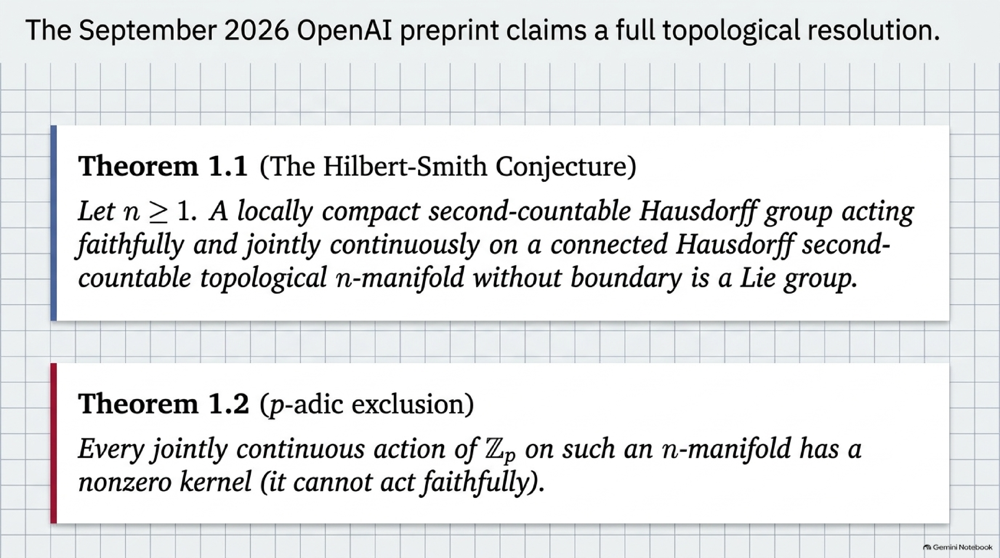

*AI-generated slide. Both statements match the paper.*

In plain words: whatever continuous action of $`\mathbb{Z}_p`$ you try to build on a manifold, some subgroup $`p^j\mathbb{Z}_p`$ ends up doing nothing at all. The action is really an action of the finite cyclic group $`\mathbb{Z}/p^j`$. With the classical reduction of section 1.6, Theorem 1.2 gives Theorem 1.1.

**What is assumed, and what is allowed.**

| Assumed | Allowed |
|---|---|
| The group is locally compact, second countable and Hausdorff | Any such group: no compactness, no connectedness, no smoothness |
| The action is faithful and jointly continuous | No regularity at all (not Lipschitz, Hölder or smooth); arbitrary fixed points and stabilizers |
| The manifold is connected, Hausdorff, second countable, finite-dimensional, without boundary | Noncompact, nonorientable, or nontriangulable manifolds (stated in the paper) |

The paper adds that dimension zero is trivial (a connected 0-manifold is a point, so a faithful group is trivial). And "no dimension bound on the orbit space is assumed".

**A consequence for dynamics.** The paper also derives the dynamical statement that Pardon recorded as his Conjecture 1.4. Call a homeomorphism $`f`$ of $`M`$ *almost periodic* if the closure $`K`$ of $`\lbrace f^j : j \in \mathbb{Z}\rbrace`$ in $`\mathrm{Homeo}(M)`$ is compact. Then some power $`f^m`$ with $`m \ge 1`$ is the time-one map of a continuous flow: there is a continuous homomorphism $`\Phi : \mathbb{R} \to \mathrm{Homeo}(M)`$ with $`\Phi(1) = f^m`$. The argument is short. $`K`$ is a compact abelian group acting faithfully and jointly continuously. It is second countable, because evaluation on a countable dense subset of $`M`$ embeds it in a countable product of copies of $`M`$. So by Theorem 1.1 it is a compact abelian Lie group. Its identity component is a torus of finite index, so some power $`f^m`$ lies on the torus, and the torus's exponential map puts $`f^m`$ on a one-parameter subgroup.

---

## 4. Why it matters

| | Before | After (if the preprint holds up) |
|---|---|---|
| **The Hilbert–Smith conjecture** | Known in dimensions 1, 2 and 3 | Proved in every finite dimension |
| **Regularity** | Known in all dimensions only under regularity hypotheses: smooth, Lipschitz, Hölder (exponent above $`n/(n+2)`$), quasiconformal, quasisymmetric | Continuity is enough |
| **Actions of $`\mathbb{Z}_p`$ on manifolds** | Not known to be impossible in dimension 4 and up | Never faithful; every action factors through a finite quotient $`\mathbb{Z}/p^j`$ |
| **Almost periodic homeomorphisms** | Pardon's Conjecture 1.4 | A power of each one is the time-one map of a flow |
| **Hilbert's fifth problem** | Settled for groups that are themselves manifolds (1952–53) | The action version, the Hilbert–Smith conjecture, is also settled in every finite dimension |

**Why the method is interesting.** Several earlier results went through dimension theory. Yang's theorem says the orbit space must jump up by two dimensions, and the Lipschitz proof (and Mj's extension of it) shows that the jump is impossible for sufficiently regular actions. The paper avoids the orbit space's dimension entirely. In its words, "only the actual manifold sources and the test spaces carry Verdier duality in this argument. The compact orbit spaces enter through ordinary sheaf direct images, averaging, and Čech cohomology. No dimension bound on the orbit spaces or regularity assumption on the boundary of $`O`$ is used." The contradiction is a **divisibility** argument about a signature-type invariant, not a dimension count. The paper also says two of its tools, the "cutoff description" of quotient categories and the integral bound for dense inclusions, "are also useful independently of the group action".

---

## 5. The main idea of the proof

The paper has six sections and an appendix. Sections 2–4 build and bound the invariant, section 5 prepares the "tests" from the action, and section 6 derives the contradiction. Here is the argument at three zoom levels.

### Level 1: the one-paragraph version

Imagine a currency whose coins come only in whole multiples of a smallest coin, worth $`1/L`$. Someone claims that a purse worth exactly 4 can be split into $`p^k`$ purses of exactly equal value, and for every $`k`$ you like. Pick $`k`$ with $`p^k > 4L`$. Each purse would be worth $`4/p^k`$, which is more than nothing but less than the smallest coin. That is impossible, so the claim is false. The paper builds the currency (a signature invariant for sheaves on a sphere), proves that the smallest coin exists (a fixed lattice with denominator $`L_d`$), and shows that a faithful $`\mathbb{Z}_p`$-action would produce the equal purses, for every $`k`$. The equality comes from a symmetry. On a small region, the action looks like $`p^k`$ separate sheets that the group shuffles cyclically. Multiplying by a function that takes the value $`\zeta^j`$ on sheet $`j`$ rotates the $`p^k`$ pieces into each other, like turning a pizza by one slice.

> **Analogy:** a pizza that a symmetry rotates slice by slice must have slices of equal size. If the pizza weighs 4 and the scale only reads multiples of $`1/L`$, it can't have more than $`4L`$ equal slices.

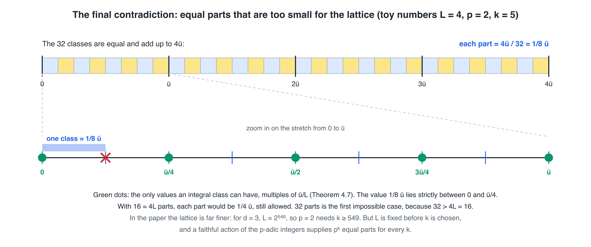

### Level 2: the step-by-step picture

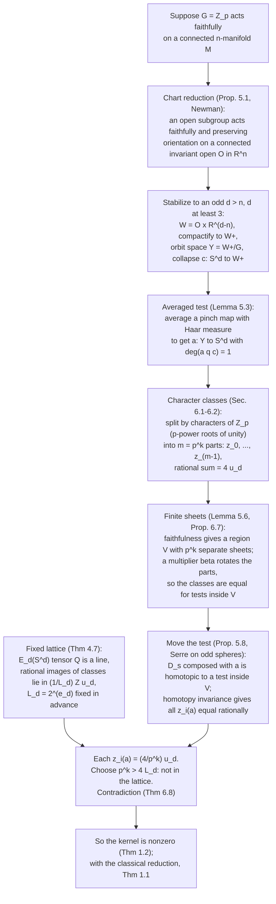
```mermaid
flowchart TD
    A["Suppose G = Z_p acts faithfully<br/>on a connected n-manifold M"] --> B["Chart reduction (Prop. 5.1, Newman):<br/>an open subgroup acts faithfully and preserving<br/>orientation on a connected invariant open O in R^n"]
    B --> C["Stabilize to an odd d > n, d at least 3:<br/>W = O x R^(d-n), compactify to W+,<br/>orbit space Y = W+/G, collapse c: S^d to W+"]
    C --> D["Averaged test (Lemma 5.3):<br/>average a pinch map with Haar measure<br/>to get a: Y to S^d with deg(a q c) = 1"]
    E["Fixed lattice (Thm 4.7):<br/>E_d(S^d) tensor Q is a line,<br/>rational images of classes lie in (1/L_d) Z u_d,<br/>L_d = 2^(e_d) fixed in advance"] --> I
    D --> F["Character classes (Sec. 6.1-6.2):<br/>split by characters of Z_p (p-power roots of unity)<br/>into m = p^k parts: z_0, ..., z_(m-1),<br/>rational sum = 4 u_d"]
    F --> G["Finite sheets (Lemma 5.6, Prop. 6.7):<br/>faithfulness gives a region V with p^k separate sheets;<br/>a multiplier beta rotates the parts,<br/>so the classes are equal for tests inside V"]
    G --> H["Move the test (Prop. 5.8, Serre on odd spheres):<br/>D_s composed with a is homotopic to a test inside V;<br/>homotopy invariance gives all z_i(a) equal rationally"]
    H --> I["Each z_i(a) = (4/p^k) u_d.<br/>Choose p^k > 4 L_d: not in the lattice.<br/>Contradiction (Thm 6.8)"]
    I --> J["So the kernel is nonzero (Thm 1.2);<br/>with the classical reduction, Thm 1.1"]
```

**Step 1: Move into one chart** (Proposition 5.1). The paper first finds a point $`x`$ such that no open subgroup of $`\mathbb{Z}_p`$ fixes a whole neighbourhood of $`x`$. If no such point existed, then the interior of the fixed set of some subgroup $`p^j\mathbb{Z}_p`$ would be nonempty. Newman's theorem shows that this interior is also closed, so by connectedness it would be all of $`M`$, contradicting faithfulness. Around such an $`x`$, a small open subgroup $`H`$ moves a coordinate ball $`B`$ only a little, and $`O = HB`$ is a connected invariant open subset of $`\mathbb{R}^n`$ on which $`H`$ still acts faithfully. Finally, replacing $`H`$ by $`2H`$ makes every element preserve orientation. (For odd $`p`$ this changes nothing; for $`p = 2`$ it has index 2.) The new group is again a copy of $`\mathbb{Z}_p`$. **This is a big advantage of $`\mathbb{Z}_p`$ for the proof: its small subgroups $`p^j\mathbb{Z}_p`$ are again copies of $`\mathbb{Z}_p`$, and they still act faithfully.**

**Step 2: Stabilize to an odd sphere.** Choose an odd integer $`d > n`$ with $`d \ge 3`$. Put $`W = O \times \mathbb{R}^{d-n} \subset \mathbb{R}^d`$, with $`G`$ acting trivially on the new coordinates. The paper uses the one-point compactification $`W^+`$ ($`W`$ with a single point $`\infty`$ added "at infinity", which makes it compact), its orbit space $`Y = W^+/G`$, and the map $`c : S^d \to W^+`$ that is the identity on $`W`$ and collapses everything else to $`\infty`$ (Lemma 5.2). Then it considers "tests": continuous maps $`t : Y \to X`$ to a compact space, giving the composite $`S^d \to W^+ \to Y \to X`$. Their source is always the same sphere $`S^d`$. Odd $`d`$ is what makes the rational homotopy argument of Step 6 work (Lemma 5.5), and for odd $`d`$ the rational invariant group of Step 4 is a single line (Proposition 4.5). The paper says that "the odd stabilization is the only dimensional choice".

**Step 3: A degree-one test** (Lemma 5.3). Take a "pinch" map $`W^+ \to S^d`$ of degree 1 that is constant outside a small round ball. It is not $`G`$-invariant, so it doesn't descend to $`Y`$. Shrink $`G`$ to an open subgroup $`H`$ that moves the pinch by less than $`1/2`$ everywhere, and **average** the pinch over $`H`$ using Haar measure (the uniform probability measure on a compact group). Normalized, the average is an $`H`$-invariant map that is still homotopic to the pinch (it can be continuously deformed into it, so it has the same degree). It descends to $`a : Y \to S^d`$ with $`\deg(a\circ q\circ c) = 1`$.

**Step 4: The invariant and its fixed lattice** (sections 2–4). For a symmetric matrix, the **signature** is the number of positive eigenvalues minus the number of negative ones. It is an integer, it adds under direct sums, and it vanishes on "neutral" forms such as $`x^2 - y^2`$, which have a half-dimensional subspace (here the line $`x = y`$) on which they vanish. A **Witt group** collects symmetric forms with neutral forms set to zero. For forms over a point, the paper's Lemma 4.1 confirms that the Witt group is $`\mathbb{Z}`$, through the signature. The paper builds a version over a space $`X`$:

- The objects are complexes of real **sheaves** on $`X`$ built from direct images $`Rf_{\ast}\underline{\mathbb{R}}_B`$ of constant sheaves along arbitrary continuous maps $`f : B \to X`$ from compact polyhedra. In the paper's words, a direct image "records the cohomology of the fibers". The category $`\mathcal{T}(X)`$ is everything obtained from these by finite sums, shifts, cones and direct summands.
- The forms are symmetric isomorphisms to the (shifted) **Verdier dual**, the sheaf version of Poincaré duality. Write $`E_r(X)`$ for the Witt group in degree $`r`$.

The key estimate is the **fixed sphere lattice** (Theorem 4.7). For odd $`d \ge 3`$, with $`\bar u_d`$ the rational image of the orientation class of $`S^d`$,

```math
E_d(S^d)\otimes\mathbb{Q}=\mathbb{Q}\,\bar u_d,\qquad \mathrm{im}\big(E_d(S^d)\to E_d(S^d)\otimes\mathbb{Q}\big)\subseteq L_d^{-1}\,\mathbb{Z}\,\bar u_d,
```

where $`L_d = 2^{e_d}`$ is a power of 2 that "is independent of every later action, test map, character partition, prime $`p`$, and exponent $`k`$". In words: the invariant is rationally one-dimensional, and the rational images of its classes are **multiples of $`\bar u_d / L_d`$**. That is the smallest coin.

**Step 5: Split by characters** (sections 6.1–6.2). A **character** of $`\mathbb{Z}_p`$ is a continuous homomorphism to the unit circle. The paper identifies them with the $`p`$-power roots of unity $`\Lambda = \bigcup_j \mu_{p^j}`$. Use complex coefficients, viewed as the real plane with the pairing $`B(z,w) = \mathrm{Re}(z\bar w)`$. Then the direct image of the constant sheaf along the orbit map breaks into **eigensheaves**, one per character (Lemma 6.1), and parts belonging to different characters are orthogonal (Lemma 6.2). Fix $`m = p^k`$ and $`\zeta = e^{2\pi i/m}`$. Choose a set $`D_0`$ containing exactly one character from each coset of the $`m`$-th roots of unity, and put $`D_i = \zeta^i D_0`$. This partitions the characters into $`m`$ pieces $`D_0, \dots, D_{m-1}`$. The partition gives self-adjoint projectors $`e_i`$ onto the parts, but only away from the special point $`b`$, the image of $`\infty`$. The paper works around this with a quotient category that ignores a small contractible neighbourhood $`U`$ of $`b`$, plus an integral isomorphism $`\ell_U`$ that lifts classes back (Proposition 4.9). It defines the **character classes** $`z_i(t) \in E_d(X)`$ by

```math
\ell_U\big(z_i(t)\big)=[A_t,\alpha_t]+[A_t,\alpha_t\circ(2e_i-\mathrm{id})].
```

Here $`(A_t, \alpha_t)`$ is the pushed-forward orientation form of the test. If $`e_i`$ were an honest direct summand, the right side would double part $`i`$ and cancel the rest: its signature would be twice the signature of part $`i`$. An explicit matrix isometry (Proposition 6.4) proves $`\sum_i z_i(t) = 2[A_t, \alpha_t]`$ exactly, without ever splitting the projectors. (We checked this matrix identity numerically on random orthogonal projectors.)

For the degree-one test $`a`$, the complex coefficients contribute a factor 2 ($`\mathbb{C}`$ is two real lines) and the construction another factor 2. So

```math
\sum_{i=0}^{m-1}\bar z_i(a)=4\,\bar u_d .
```

**Step 6: Faithfulness makes the parts equal** (Lemma 5.6, Proposition 6.7, Proposition 5.8). Faithfulness gives a point whose stabilizer lies inside $`p^kG`$. Near it there is a nonempty open region $`V`$ of the orbit space over which $`W/(p^kG) \to W/G`$ is $`m = p^k`$ **separate sheets**, and a locally constant function $`\beta`$ equal to $`\zeta^j`$ on sheet $`j`$, with $`\beta(g\cdot w) = \zeta^{\bar g}\beta(w)`$. Multiplying by $`\beta`$ preserves the form and carries the $`\lambda`$-part to the $`\zeta^{-1}\lambda`$-part, so it rotates $`D_i`$ to $`D_{i-1}`$. Hence, for any test $`h`$ that is constant outside $`V`$, all the classes $`z_i(h)`$ are equal.

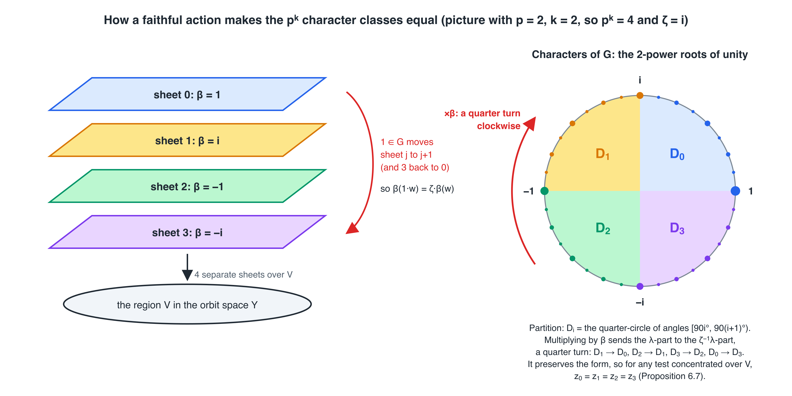

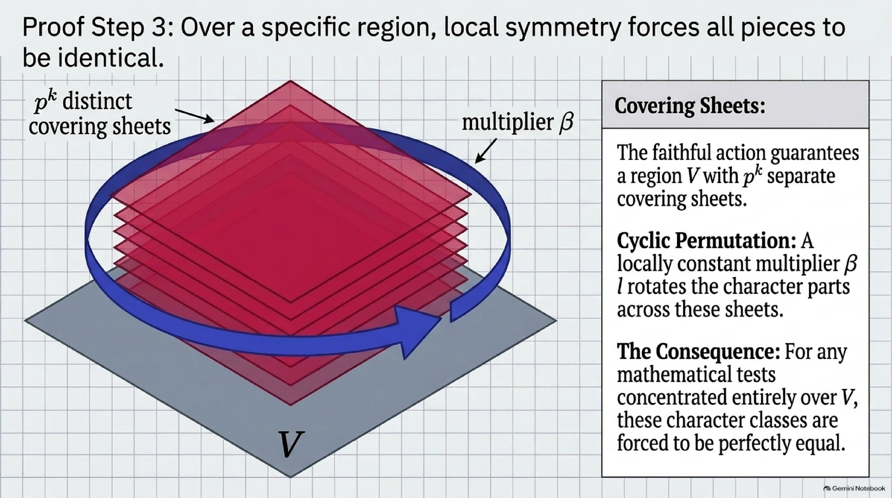

*AI-generated slide. Accurate, including the condition that the test is concentrated over V ("β l rotates" is a typo).*

The degree-one test $`a`$ is not concentrated in $`V`$, so the paper moves it there. The restriction of $`a`$ to the complement $`F = Y \setminus V`$ is zero in rational cohomology: it pulls the orientation class of $`S^d`$ back to zero in (Čech) cohomology with rational coefficients. (The pinch can be slid into the part of $`W`$ over $`V`$, and pullback from the orbit space is injective on rational Čech cohomology, by averaging locally constant functions with Haar measure: Lemma 5.4.) On an **odd** sphere, Serre's theorems say this is enough: after composing with a map $`D_s : S^d \to S^d`$ of some positive degree $`s`$, the restriction becomes nullhomotopic, that is, deformable to a constant map (Lemma 5.5). Extending that nullhomotopy (Lemma 5.7) gives a test $`h \simeq D_s \circ a`$ that is constant on $`F`$. Because the classes behave well under maps and homotopies (Propositions 6.5 and 6.6),

```math
s\,\bar z_i(a)=\bar z_i(D_s\circ a)=\bar z_i(h)=\bar z_j(h)=s\,\bar z_j(a),
```

and dividing by the nonzero rational number $`s`$ shows that all the $`\bar z_i(a)`$ are equal. As the paper stresses, $`s`$ is cancelled "only as a nonzero rational scalar": the classes $`z_i(a)`$ themselves stay integral, so their rational images stay in the lattice.

**Step 7: The contradiction** (Theorem 6.8). The $`m = p^k`$ equal rational classes add up to $`4\bar u_d`$, so each is $`(4/p^k)\bar u_d`$. Each is the image of an integral class, so it lies in $`L_d^{-1}\mathbb{Z}\,\bar u_d`$, which forces $`4L_d/p^k`$ to be an integer. But $`L_d`$ was fixed **before** $`k`$, and $`k`$ can be chosen with $`p^k > 4L_d`$, so that $`0 < 4L_d/p^k < 1`$. This "applies to every prime, including $`p = 2`$". So no faithful action exists on the chart, and therefore none on $`M`$ (Theorem 1.2). Every nonzero closed subgroup of $`\mathbb{Z}_p`$ is some $`p^j\mathbb{Z}_p`$, so the action factors through $`\mathbb{Z}/p^j`$.

<details>
<summary><b>The final arithmetic with the paper's actual numbers</b> (computed by script)</summary>

Remark 4.4 of the paper gives an explicit (unoptimized) exponent: $`e_0 = 0`$ and $`e_j = 9e_{j-1} + 6`$, so $`e_j = 3(9^j - 1)/4`$, and one may take $`L_d = 2^{e_d}`$.

| $`j`$ | 0 | 1 | 2 | 3 | 4 | 5 |
|---|---|---|---|---|---|---|
| $`e_j`$ | 0 | 6 | 60 | 546 | 4,920 | 44,286 |

The smallest admissible sphere for an $`n`$-manifold is the smallest odd $`d > n`$ with $`d \ge 3`$:

| Manifold dimension $`n`$ | 1 or 2 | 3 or 4 | 5 or 6 |
|---|---|---|---|
| Sphere dimension $`d`$ | 3 | 5 | 7 |
| Lattice denominator $`L_d`$ | $`2^{546}`$ | $`2^{44286}`$ | $`2^{3587226}`$ |

With this (unoptimized) choice, for $`d = 3`$ the size argument needs $`p^k > 4L_3 = 2^{548}`$. The smallest such $`k`$ is 549 for $`p = 2`$, 346 for $`p = 3`$, 237 for $`p = 5`$, 196 for $`p = 7`$ and 83 for $`p = 101`$. The figure above uses toy numbers ($`L = 4`$, $`p = 2`$): 16 parts of $`\bar u/4`$ would still be allowed, and 32 parts of $`\bar u/8`$ are the first impossible case.

(A remark of ours, not the paper's: because $`L_d`$ is a power of 2, for an *odd* prime $`p`$ the number $`4L_d/p^k`$ is already not an integer when $`k = 1`$. The paper's size argument $`p^k > 4L_d`$ treats every prime, including $`p = 2`$, the same way.)
</details>

<details>
<summary><b>Why doesn't the same argument rule out a rotation of the plane?</b> (our explanation, not the paper's)</summary>

Finite groups do act faithfully on manifolds; the rotation of $`\mathbb{R}^2`$ by 120° is an action of $`\mathbb{Z}/3`$. So the argument must break somewhere for them. For every finite group it breaks at Step 3. Averaging needs a subgroup that moves every point of the pinch ball only a little *and still acts faithfully*. $`\mathbb{Z}_p`$ has such subgroups ($`p^j\mathbb{Z}_p`$, again copies of $`\mathbb{Z}_p`$). A finite group's only small open subgroup is the trivial one, which does not act faithfully. Without that step there is no reason for a test of degree 1 to exist, and in this example none does. Take $`W = \mathbb{R}^2 \times \mathbb{R}`$ with the rotation about the vertical axis. The orbit map $`S^3 \to S^3/(\mathbb{Z}/3)`$ is a 3-fold branched cover (the quotient is again a 3-sphere), so every test $`a\circ q`$ has degree divisible by 3. The three equal character classes then add up to a multiple of $`12\bar u`$, so each is a multiple of $`4\bar u`$, which sits happily in the lattice. Groups of order $`2^j`$ also fail at Step 7: a finite group supplies only $`p^k \le \lvert G\rvert`$ equal parts, so $`k`$ cannot be taken large. (For odd $`p`$ this second point alone would not save a finite group, by the remark on odd primes above.)
</details>

<details>
<summary><b>Why the sphere must be odd-dimensional</b> (an illustration of ours)</summary>

Step 6 uses the fact that every map from a compact metrizable space to an odd sphere $`S^d`$ with $`d \ge 3`$ that is zero in rational cohomology becomes nullhomotopic after composing with a map of positive degree. The paper proves this from Serre's theorems: the higher homotopy groups of odd spheres are finite, and a mapping telescope of degree maps is an Eilenberg–MacLane space $`K(\mathbb{Q}, d)`$. Even spheres fail this test. The Hopf map $`\eta : S^3 \to S^2`$ is zero in rational cohomology, since $`H^2(S^3) = 0`$. Composing it with a degree-$`s`$ map of $`S^2`$ multiplies its Hopf invariant by $`s^2 \neq 0`$, so it never becomes nullhomotopic. On the Witt-group side, the Witt group of a point is $`\mathbb{Z}`$ in degrees divisible by 4 and 0 otherwise (Lemma 4.1). This is how Proposition 4.5 shows that $`E_d(S^d)\otimes\mathbb{Q}`$ is a single line when $`d`$ is odd. That count alone would not force $`d`$ to be odd: by the same formula, the line is also one-dimensional when $`d \equiv 2 \pmod 4`$. So the Witt-group count does not rule out those even $`d`$; the homotopy step does.
</details>

<details>
<summary><b>A toy model of the cyclic rotation</b> (computed by script)</summary>

Take the finite group $`\mathbb{Z}/4`$ acting on four sheets, so a "section" is a vector $`s = (s_0, s_1, s_2, s_3)`$. With the paper's convention $`(Ts)(x) = s((-1)x)`$, the generator acts by $`(Ts)_j = s_{j-1}`$. Its eigenvectors are $`v_\lambda = (\lambda^{-j})_j`$ for the four 4th roots of unity $`\lambda`$, one for each character. Let $`M_\beta`$ multiply sheet $`j`$ by $`\zeta^j`$, with $`\zeta = i`$. Our script checks that $`T M_\beta = \zeta^{-1} M_\beta T`$ (the identity in the proof of Proposition 6.7), and that $`M_\beta`$ sends the eigenvector for $`\zeta^i`$ to an eigenvector for $`\zeta^{i-1}`$, for each $`i = 0, 1, 2, 3`$. So multiplying by $`\beta`$ rotates the four character parts one step, exactly as in the figure.
</details>

### Level 3: the sheaf-theoretic engine, for readers who know some sheaf theory

**The categories** (section 2). For a test space $`X`$ (for instance a finite polyhedron, or an open subset of one), $`\mathcal{T}^0(X)`$ is the smallest full replete triangulated subcategory of the bounded derived category $`\mathsf{D}(X)`$ of real sheaves containing all $`Rf_{\ast}\underline{\mathbb{R}}_B`$, where $`f : B \to X`$ is any continuous map from a compact polyhedron. $`\mathcal{T}(X)`$ is its closure under summands. These images "need not be constructible", and their stalks can be infinite-dimensional, yet Verdier duality restricts to a triangulated duality on $`\mathcal{T}(X)`$, and the biduality map is an isomorphism (Proposition 2.3, proved from simplex generators). Direct image along continuous maps of test spaces preserves these categories and commutes with duality (Proposition 2.5). Homotopy invariance of $`E_r(X) = W_r(\mathcal{T}(X))`$ comes from a cylinder argument. A neutral form on an interval product has the two endpoint forms on its diagonal with opposite signs (Lemma 2.8, Theorem 2.9), and the appendix fixes the signs. The same constructions run in a semialgebraic subcategory $`\mathcal{P}(X)`$, generated by semialgebraic maps, with Witt groups $`F_r(X)`$.

**Localization and density** (section 3). For $`\mathcal{B}`$ either $`\mathcal{P}`$ or $`\mathcal{T}`$, the Witt groups of the Verdier quotient $`\mathcal{B}(X)/\mathcal{B}(U)`$ fit into a long exact localization sequence (Theorem 3.4, using Balmer–Walter). Morphisms in the quotient are germs of morphisms near $`X \setminus U`$ (Theorem 3.3, using a "cutoff" lemma for finite constructions). The integral heart of the paper is **dense doubling** (Theorem 3.6). If $`\mathcal{A} \subset \mathcal{C}`$ is a full duality-stable triangulated subcategory such that every object of $`\mathcal{C}`$ is a summand of one in $`\mathcal{A}`$, then there is a map $`d`$ back with $`\iota d = 2`$ and $`d\iota = 2`$. So the kernel and cokernel of $`W_r(\mathcal{A}) \to W_r(\mathcal{C})`$ are killed by 2. This is a consequence of Hornbostel–Schlichting's cofinality theorem, and the paper gives an explicit construction.

**The lattice** (section 4). Induction over the pole cover of $`S^j`$, with five-lemma-type chases that track exponents (Lemma 4.2), bounds the kernel and cokernel of $`F_r(S^j) \to E_r(S^j)`$ by $`2^{e_j}`$, uniformly in $`r`$ (Theorem 4.3). Rationally, $`G_r(S^j)\otimes\mathbb{Q} \cong (G_r(\mathrm{pt}) \oplus G_{r-j}(\mathrm{pt}))\otimes\mathbb{Q}`$ (Proposition 4.5). On the semialgebraic side, Hardt's triviality theorem gives every finite collection of objects finite-dimensional locally constant cohomology on a common dense open set. On a small oriented ball there, every finite Witt relation can be evaluated by ordinary integer signature (Proposition 4.6). So $`F_d(S^d)`$ has rational image exactly $`\mathbb{Z}\,\bar u_{F,d}`$, and the comparison transfers this to $`E_d(S^d)`$ with denominator $`L_d = 2^{e_d}`$. The paper notes that a comparison only "after inverting 2" would not suffice, because $`\mathbb{Z} \subset \mathbb{Z}[1/2]`$ has unbounded 2-primary cokernel. Proposition 4.9 shows that the quotient by a contractible open $`U`$ is an integral isomorphism on $`E_d`$. This is what lets the classes $`z_i(t)`$ be lifted without splitting idempotents.

**The orbit side** (sections 5–6). For the compact metrizable $`G`$-space $`E`$ with orbit map $`r`$, each orbit $`G/G_x`$ is compact and zero-dimensional, so proper base change gives $`Rr_{\ast}\underline{k}_E \simeq r_{\ast}\underline{k}_E`$, with no bound on covering dimension (Lemma 5.4). The stalk of $`\mathcal{H} = q_{\ast}\underline{\mathbb{C}}_{W^+}`$ at an orbit consists of the locally constant functions on that orbit $`G/G_x`$. These are unions of finite cyclic representations, which split into eigenspaces of the generator, and compactness lets the derived direct image commute with the countable sum over characters (Lemma 6.1). Covariance of the classes uses a carefully shrunk neighbourhood $`N' = X' \setminus g(X\setminus N)`$ (Proposition 6.5). Homotopy invariance uses the "close pair" test space $`C_d = \lbrace (x_0,x_1) \in S^d\times S^d : \langle x_0,x_1\rangle \ge 0\rbrace`$, whose two projections are homotopic (Proposition 6.6). The design principle throughout: duality is only ever used on the oriented manifold $`f_t^{-1}(X\setminus\lbrace b\rbrace) \subset W`$ and on test spaces, never on the orbit space $`Y`$, whose dimension is not controlled.

---

## 6. The people whose ideas this builds on

| Person | Idea | Where it shows up in the proof |
|---|---|---|
| **David Hilbert** | The fifth problem (1900) | The question |
| **Paul A. Smith** † | Periodic transformations; the conjecture bears his name | The question |
| **M. H. A. Newman** | Rigidity of periodic homeomorphisms (1931) | The classical reduction, and the chart reduction (Proposition 5.1) |
| **Andrew Gleason, Deane Montgomery, Leo Zippin, Hidehiko Yamabe** | Structure of locally compact groups; no small subgroups implies Lie | The reduction from any non-Lie group to $`\mathbb{Z}_p`$ (proof of Theorem 1.1) |
| **Joo Sung Lee; John Pardon** | Expositions of the reduction; Pardon's local reduction (his §4.1) and the 3-dimensional case | Proposition 5.1 and the proof of Theorem 1.1 |
| **Salomon Bochner, Dušan Repovš, Evgenij Ščepin, Maleshich, Gaven Martin, Mahan Mj, Egor Shelukhin** | The conjecture under regularity hypotheses | Context. The new proof needs no regularity |
| **Chung-Tao Yang; Glen Bredon, Frank Raymond, Robert Williams** | Dimension raising for orbit spaces of $`p`$-adic actions | Context. The new proof avoids orbit-space dimension |
| **Alfréd Haar** † | Invariant probability measure on compact groups | Averaging the pinch map (Lemma 5.3) and locally constant functions (Lemma 5.4) |
| **Jean-Pierre Serre** | Finiteness of homotopy groups of spheres; degree maps kill torsion on odd spheres (1951, 1953) | Killing rationally trivial maps to odd spheres (Lemma 5.5) |
| **Alexander Dranishnikov, Steven Ferry, Shmuel Weinberger** | The same odd-sphere telescope argument (2003) | Lemma 5.5 |
| **Samuel Eilenberg, Norman Steenrod** | Čech cohomology through nerves of finite covers | Lemma 5.5 and the orbit-space cohomology |
| **Jean-Louis Verdier; Masaki Kashiwara, Pierre Schapira** | Duality for sheaves on locally compact spaces; its derived-functor formulation | The duality on the test categories (section 2) |
| **Paul Balmer, Charles Walter** | Triangular Witt groups; the localization theorem | $`E_r(X)`$ and its localization sequence (Theorem 3.4) |
| **Jens Hornbostel, Marco Schlichting** | Cofinality in Hermitian K-theory | The bound by 2 for dense inclusions (Theorem 3.6) |
| **Jon Woolf** | Witt groups of sheaves on topological spaces, with a cylinder homotopy relation | The closest antecedent of sections 2–3 |
| **Andrew Ranicki, Michael Weiss** | A local chain theory generated by continuous simplex maps | A "close antecedent" of the generated-category strategy |
| **Robert Hardt** | Semialgebraic local triviality (1980) | Integral signatures on the semialgebraic side (Proposition 4.6) |

† From the background sources rather than the paper.

---

## 7. What it does not prove, and caveats

> [!IMPORTANT]
> **Read the hypotheses exactly.** The theorem is about **finite-dimensional** topological manifolds that are connected, Hausdorff, second countable and **without boundary**, and about groups that are **locally compact, second countable and Hausdorff**. The paper's statements assume all of these, and this explainer does not speculate about removing any of them. The conjecture says nothing about groups that are not locally compact, such as $`\mathrm{Homeo}(M)`$ itself. It also says nothing about spaces that are not manifolds: $`\mathbb{Z}_p`$ acts faithfully on the Cantor set (on itself), and, per Pardon's introduction, on compact metric spaces of every dimension $`n \ge 2`$ (Raymond–Williams).

> [!WARNING]
> **Verification status.** openai/math has **no Lean formalization** for this family: there is no `lean/docs/304.md`, `lean/formalization.yaml` has no entry for this paper, and the CONTENTS entry has no Lean link (all checked 7 October 2026). The openai/math README warns that "some of the unformalized results could have issues." The paper is 46 pages, mostly sheaf theory and Witt-group algebra in non-standard categories: proper images of polyhedra under *arbitrary* continuous maps, which "need not be constructible". The whole contradiction rests on integrality (Theorem 4.7), which in turn rests on the paper's comparison results in sections 3 and 4 (germ description, dense doubling, bounded comparison). As of October 2026 the result is an unrefereed preprint; the usual next step is independent review by experts. This explainer did not check the proofs.

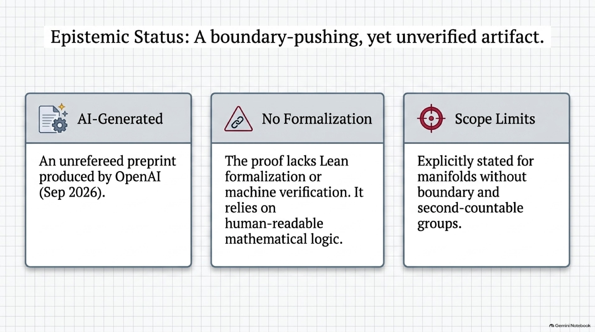

*AI-generated slide. Its three points match this section.*

> [!NOTE]
> **Provenance.** The paper was produced by an unreleased internal OpenAI model, as part of the [openai/math](https://github.com/openai/math) release. According to that repository's README, most results came from one fixed procedure (on average about three hours of ChatGPT Pro thinking compute per result). The README names two exceptions, the zero-free region for the Riemann zeta function and the Hodge conjecture for CM abelian varieties; family 304 is not one of them. No reasoning summary is published for this family.

> [!NOTE]
> **A typesetting quirk.** In the PDF, some cross-references to lemmas and propositions are printed with the word "Theorem". For example, the proof of Theorem 6.8 cites "Theorem 5.8" for what is Proposition 5.8. The numbers are right, so look up the number rather than the label. We found no unresolved citations.

> [!TIP]
> **Simplifications.** To stay readable, this explainer suppresses the shifts and signs of the dualities, the difference between $`\mathcal{T}^0`$ and $`\mathcal{T}`$, the semialgebraic models, the exact roof calculus in quotient categories, and the bookkeeping of open subgroups when $`G`$ is shrunk. Every precise statement is in the paper.

---

## 8. Glossary

| Term | Meaning |
|---|---|
| **Topological group** | A group with a topology in which multiplication and inversion are continuous |
| **Lie group** | A topological group that is a smooth manifold with smooth operations, such as $`\mathbb{R}^n`$, the circle, $`SO(3)`$, $`GL_n(\mathbb{R})`$, or a finite group |
| **Locally compact** | Every point has a compact neighbourhood |
| **Second countable** | The topology has a countable base |
| **Action, faithful action** | A rule $`(g, x) \mapsto g\cdot x`$ compatible with the group law; faithful means only the identity acts trivially |
| **Jointly continuous** | $`G \times M \to M`$ is continuous; equivalently $`G \to \mathrm{Homeo}(M)`$ is a continuous homomorphism (compact-open topology) |
| **Stabilizer, kernel** | The elements fixing one point / fixing every point |
| **No small subgroups (NSS)** | Some neighbourhood of the identity contains no nontrivial subgroup; for locally compact groups this characterizes Lie groups |
| **$`p`$-adic integers** $`\mathbb{Z}_p`$ | The inverse limit of $`\mathbb{Z}/p^k`$: infinite base-$`p`$ digit strings; a compact, totally disconnected group |
| **Totally disconnected** | No connected subset has more than one point |
| **Orbit space** $`M/G`$ | The space of orbits $`G\cdot x`$, with the quotient topology |
| **Cohomological dimension** | A notion of dimension read off from sheaf cohomology; an $`n`$-manifold has cohomological dimension $`n`$ |
| **One-point compactification** $`W^+`$ | The space $`W`$ with one extra point $`\infty`$, whose neighbourhoods are the complements of compact subsets of $`W`$ |
| **Homotopic, nullhomotopic** | Two maps are homotopic if one can be continuously deformed into the other; a map is nullhomotopic if it is homotopic to a constant map |
| **Hilbert–Smith conjecture** | A locally compact group acting faithfully on a connected manifold is a Lie group |
| **Newman's theorem** | A finite-order homeomorphism of a connected manifold that fixes an open set is the identity |
| **Haar measure** | The translation-invariant probability measure on a compact group, used for averaging |
| **Degree** of a map $`S^d \to S^d`$ | The integer by which it multiplies the top homology; it counts how many times the sphere is wrapped around itself |
| **Character** of $`\mathbb{Z}_p`$ | A continuous homomorphism to the unit circle; these are the $`p`$-power roots of unity |
| **Signature** | For a symmetric form: number of positive minus number of negative eigenvalues |
| **Witt group** | Symmetric (nonsingular) forms up to isometry and sums, with neutral forms (those with a lagrangian) set to zero; over a point it is $`\mathbb{Z}`$ via signature |
| **Sheaf, direct image** $`Rf_{\ast}`$ | Data attached to open sets compatibly with restriction; the direct image along $`f`$ records the cohomology of the fibres of $`f`$ |
| **Verdier duality** | The sheaf-theoretic generalization of Poincaré duality |
| **Fixed sphere lattice** | The paper's Theorem 4.7: integral classes in $`E_d(S^d)`$ have rational images in $`L_d^{-1}\mathbb{Z}\,\bar u_d`$ |
| **Lean 4** | A proof assistant: software that mechanically checks every logical step of a proof |

---

## 9. Slides, audio and other assets

Everything below except the three hand-made figures was generated with **Google NotebookLM** (now "Gemini Notebook") from the paper and the Wikipedia article on Hilbert's fifth problem. The report and the mind map used the paper only. The outputs are kept exactly as NotebookLM produced them; the slide deck was not revised. They are AI-generated and contain real mistakes, so see the [errata](assets/README.md#errata) before relying on any detail. In particular, slides 5, 6, 10 and 13 have errors in their pictures or formulas, and both infographics have attribution or labelling errors.

| Asset | What it is |
|---|---|
| [Slide deck (PDF)](assets/notebooklm/slides.pdf) · [PPTX](assets/notebooklm/slides.pptx) | 15 beginner slides |
| [Infographic: overview](assets/notebooklm/infographic-overview.png) | The one-page summary shown at the top |
| [Infographic: history timeline](assets/notebooklm/infographic-history-timeline.png) | From Hilbert (1900) to the September 2026 preprint, in sketch-note style |
| [Audio overview (≈1.7 min)](assets/notebooklm/audio-overview-brief.m4a) | A short podcast-style summary (not reviewed) |
| [Beginner report](assets/notebooklm/beginner-explainer-report.md) | NotebookLM's long-form technical explainer. Its proof walk-through is accurate; a few background statements are wrong |
| [Mind map](assets/notebooklm/mindmaps.md) | How the proof fits together |
| [ℤ_3 tree figure](assets/figures/z3-small-subgroups.png) ([SVG](assets/figures/z3-small-subgroups.svg)) | Hand-made: $`\mathbb{Z}_3`$ as a tree of digits with its small subgroups, and the circle for contrast (section 1.5) |
| [Sheets and characters figure](assets/figures/sheets-and-characters.png) ([SVG](assets/figures/sheets-and-characters.svg)) | Hand-made: four sheets over $`V`$ and the rotation of the four character parts (section 5, Step 6) |
| [Lattice figure](assets/figures/equal-parts-lattice.png) ([SVG](assets/figures/equal-parts-lattice.svg)) | Hand-made: the final contradiction with toy numbers (section 5, Level 1) |

<details>
<summary><b>All 15 slides</b> (click to expand)</summary>

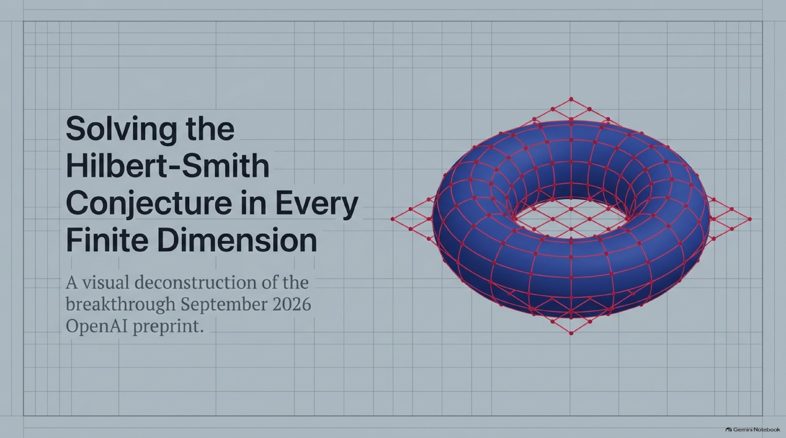


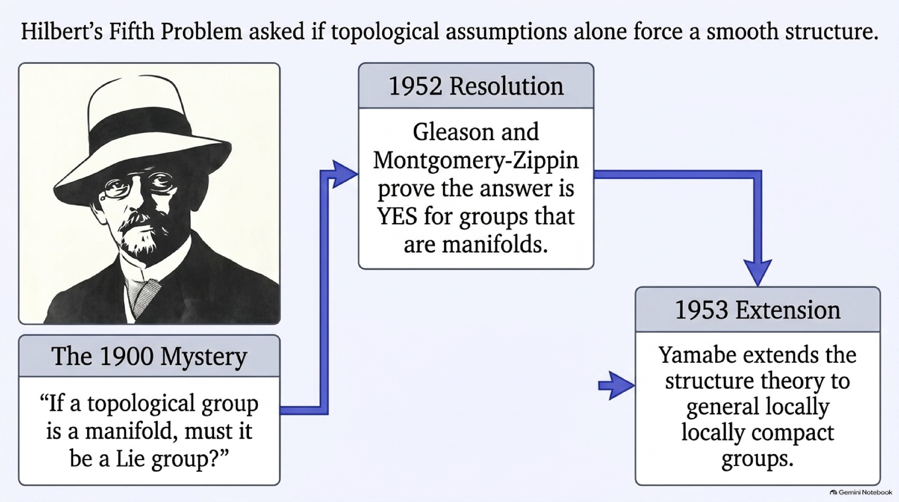

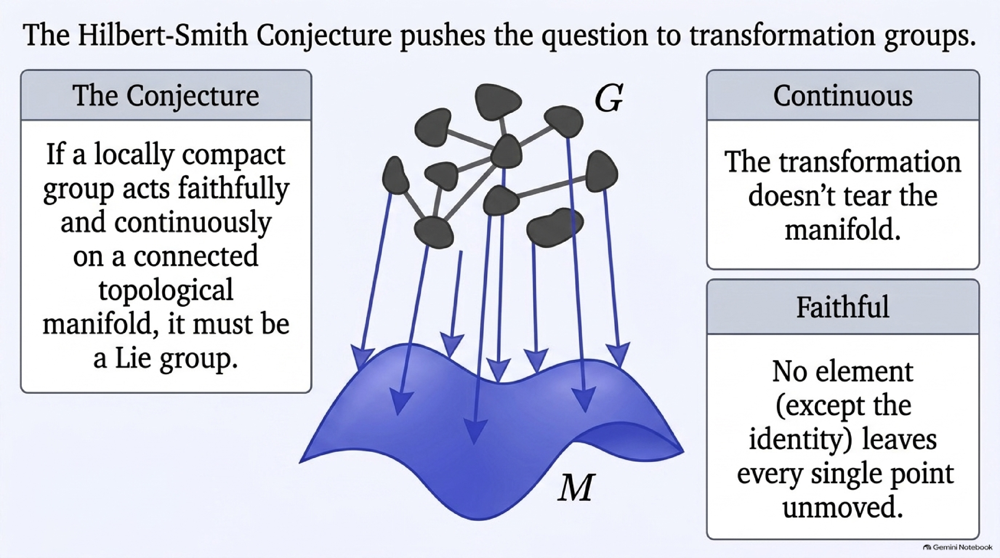

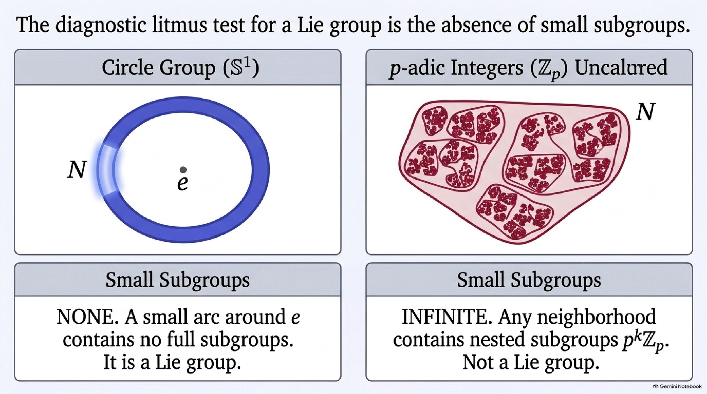

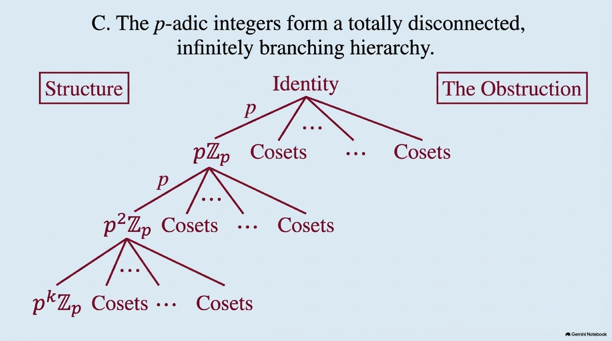

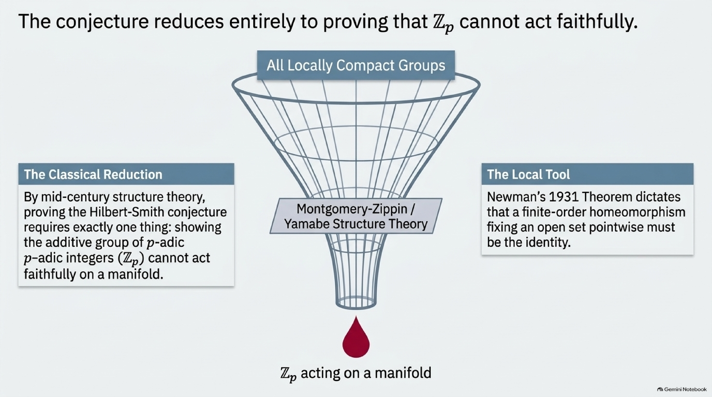

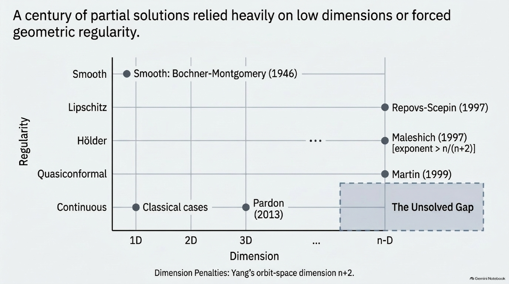


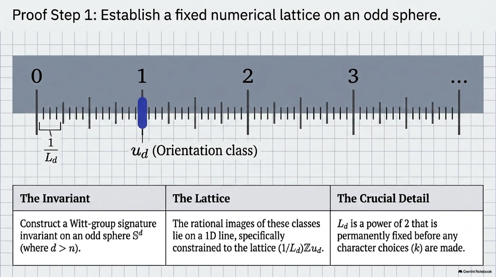

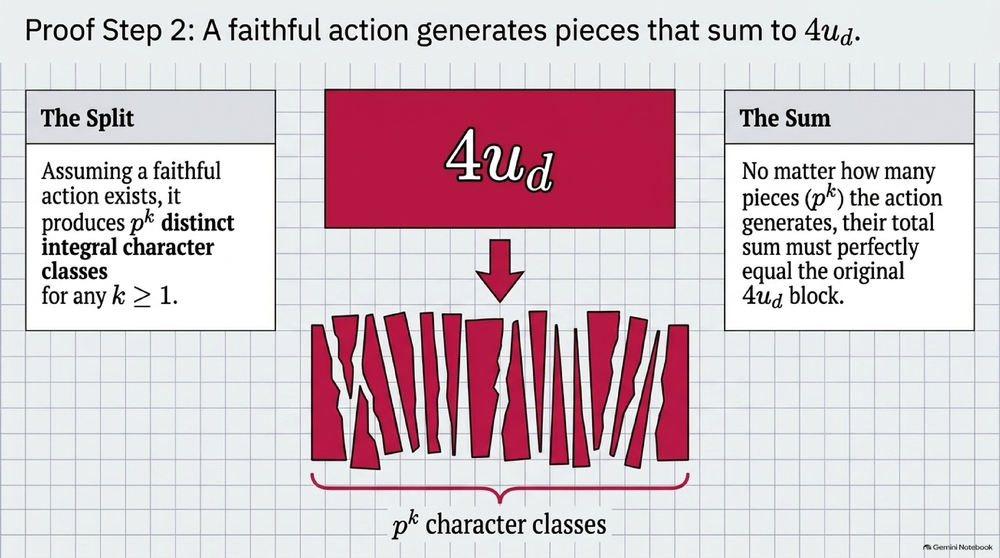


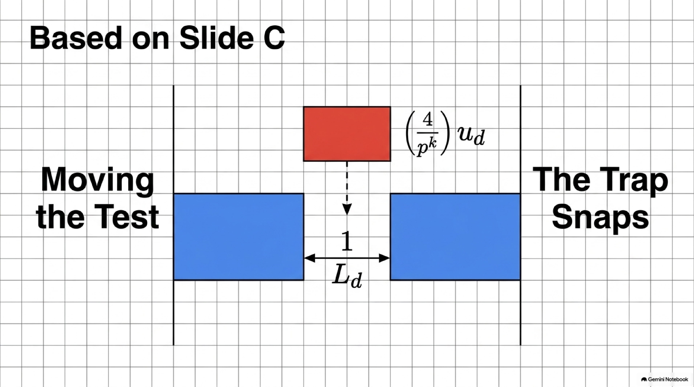


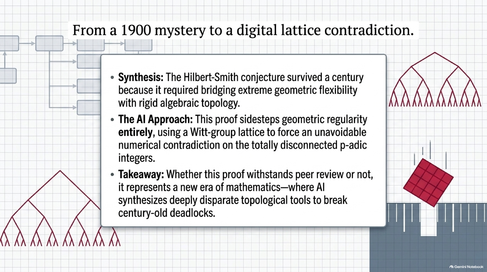

</details>

---

## How this explainer was made

1. The paper's PDF and its TeX source (`build/`) were downloaded from [openai/math](https://github.com/openai/math/tree/main/preprints/The-Hilbert-Smith-conjecture-in-every-finite-dimension-September-23-2026), together with the catalogue entry, the Lean catalogue (`lean/formalization.yaml`) and the list of Lean scope documents, which has no entry for family 304.
2. The text on this page was written by hand (with AI assistance) directly from the TeX source: the introduction, every theorem statement in sections 2–4, and sections 5 and 6 in full. Historical claims were checked against the paper's bibliography, the introduction of Pardon's 2013 paper ([arXiv:1112.2324](https://arxiv.org/abs/1112.2324)) and the Wikipedia articles on [Hilbert's fifth problem](https://en.wikipedia.org/wiki/Hilbert%27s_fifth_problem) and the [Hilbert–Smith conjecture](https://en.wikipedia.org/wiki/Hilbert%E2%80%93Smith_conjecture). Claims from those background sources are marked †, and remarks of our own are labelled as such.
3. The worked examples (3-adic digits and sizes, the circle escape times, the cyclic rotation of characters, the matrix identity of Proposition 6.4, and the exponents $`e_j`$ and the values of $`k`$) were computed with short Python scripts. The three figures were drawn as SVG by a layout script and rendered with `rsvg-convert`.
4. The paper and the Wikipedia article on Hilbert's fifth problem were loaded into a NotebookLM notebook through the [`notebooklm-mcp-cli`](https://github.com/jacob-bd/gemini-notebook-mcp-cli) MCP/CLI, which generated the slides, infographics, report, mind map and audio in [`assets/notebooklm/`](assets/notebooklm/). The report and the mind map were restricted to the paper. Every slide, both infographics, the report and the mind map were then read against the paper, and the errors are listed in the [errata](assets/README.md#errata). NotebookLM's outputs were used only as visual aids, not as the source of truth. An independent fact-check of this page was also made against the TeX source, and its corrections are included.

See [`PIPELINE.md`](../../PIPELINE.md) for the exact, repeatable steps.

*Citation for the underlying paper:*

```bibtex
@misc{OAI:The-Hilbert-Smith-conjecture-in-every-finite-dimension-September-23-2026,
  author = {{OpenAI}},
  title = {{The Hilbert--Smith conjecture in every finite dimension}},
  howpublished = {OpenAI Math Release preprint
                  \href{https://github.com/openai/math/blob/main/preprints/The-Hilbert-Smith-conjecture-in-every-finite-dimension-September-23-2026/paper.pdf}{OAI:The-Hilbert-Smith-conjecture-in-every-finite-dimension-September-23-2026}},
  year = {2026}
}
```
