# Kakeya in three and four dimensions, explained for beginners

> - **Paper:** [*The Kakeya maximal conjecture in three dimensions*](https://github.com/openai/math/blob/main/preprints/The-Kakeya-maximal-conjecture-in-three-dimensions-September-23-2026/paper.pdf), OpenAI, 23 September 2026 (97 pages)
> - **openai/math family:** 074, *Kakeya in three and four dimensions* · **Field:** harmonic analysis and geometric measure theory (catalogued under real and complex analysis)
> - **Key companion:** [*Every Four-Dimensional Kakeya Set Has Full Hausdorff Dimension*](https://github.com/openai/math/blob/main/preprints/Every-four-dimensional-Kakeya-set-has-full-Hausdorff-dimension-September-24-2026/paper.pdf), OpenAI, 24 September 2026 (175 pages)
> - **Formal proof:** none. openai/math has no Lean formalization for family 074 (no `lean/docs/074.md`, and no entry in `lean/formalization.yaml`)
> - **Who this is for:** anyone who knows calculus: areas, volumes, integrals and limits. No measure theory or Fourier analysis is assumed; the [glossary](#8-glossary) defines the rest.

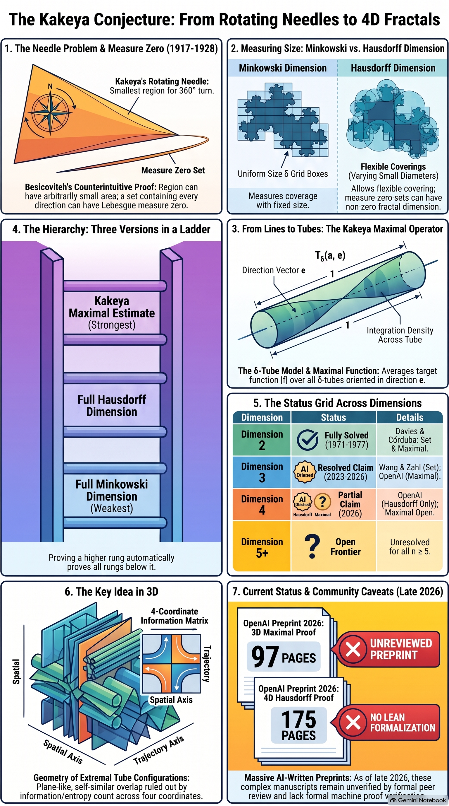

*AI-generated overview (NotebookLM). Its big picture matches the papers, but it has typos ("Besicoviteh", "Córduba"), garbled badges, and it lumps the human-proved 3D set theorem together with the AI-claimed 3D maximal theorem as one "resolved claim". See the [errata](assets/README.md#errata).*

## Contents

- [TL;DR](#tldr)
- [How to read this](#how-to-read-this)
- [1. The problem](#1-the-problem)
- [2. A short history](#2-a-short-history)
- [3. What the papers prove](#3-what-the-papers-prove)
- [4. Why it matters](#4-why-it-matters)
- [5. The main idea of the proof](#5-the-main-idea-of-the-proof)
- [6. The people whose ideas this builds on](#6-the-people-whose-ideas-this-builds-on)
- [7. What it does not prove, and caveats](#7-what-it-does-not-prove-and-caveats)
- [8. Glossary](#8-glossary)
- [9. Slides, audio and other assets](#9-slides-audio-and-other-assets)
- [How this explainer was made](#how-this-explainer-was-made)

---

## TL;DR

- **The question.** In 1917 Sōichi Kakeya asked how small a region can be if a needle of length 1 can be turned around inside it. Besicovitch showed that the answer is "as small as you like", and that a set containing a unit segment pointing in **every** direction can have **zero area**. The **Kakeya conjecture** says that such a set, in $n$-dimensional space, is nevertheless as big as possible in a subtler sense: it has **dimension $`n`$**.
- **Three versions.** The conjecture comes in three strengths. The *Minkowski* version measures dimension by counting small boxes. The *Hausdorff* version uses a finer notion of dimension and is harder. The *maximal-function* version is a quantitative inequality about averages of a function over thin tubes, and it is the strongest of the three: it implies the other two.
- **What was known.** In the plane, everything was settled by Davies (1971) and Córdoba (1977). In three dimensions, Hong Wang and Joshua Zahl proved the Kakeya **set** conjecture (both dimension versions) in a preprint posted in February 2025. The three-dimensional **maximal** conjecture stayed open: their method gives the right dependence on the size of the tubes but not the right dependence on how much of each tube is used. In four dimensions the best Hausdorff bound was about $3.059$ (Katz and Zahl).
- **What this family claims.** The principal paper proves the **Kakeya maximal conjecture in three dimensions**: for every $\varepsilon > 0$, averaging over tubes of radius $\delta$ satisfies $`\lVert K_\delta f\rVert_{L^3(S^2)} \le C_\varepsilon \delta^{-\varepsilon}\lVert f\rVert_{L^3(\mathbb R^3)}`$ (the notation is explained in [section 1.5](#15-tubes-shadings-and-the-maximal-function)). The companion proves the **Hausdorff-dimension Kakeya conjecture in four dimensions**: every subset of $\mathbb{R}^4$ that contains a unit segment in every direction has Hausdorff dimension 4.
- **What it doesn't do.** It does **not** prove the four-dimensional *maximal* conjecture, or anything complete in five or more dimensions. The three-dimensional *set* conjecture was already a theorem, and the new proof uses the Guth–Wang–Zahl version of it as an ingredient. Both papers are AI-written preprints with no Lean formalization, and they have not been through peer review.

## How to read this

| You have… | Read |
|---|---|
| 2 minutes | The TL;DR and the [status figure](#16-three-versions-of-the-conjecture) |
| 15 minutes | Sections 1, 3, 4 and 7 |
| An hour, and you like analysis | Everything, including [section 5](#5-the-main-idea-of-the-proof) and the [worked calculation](#a-worked-calculation-why-the-exponent-is-3) |

---

## 1. The problem

### 1.1 Kakeya's needle

Put a needle of length 1 on a table. What is the smallest area of a region in which you can turn the needle completely around, sliding and rotating it but never lifting it?

A disk of diameter 1 works, with area $\pi/4 \approx 0.785$. You can do better. Kakeya posed the question in 1917, first for convex regions, in a paper with Matsusaburô Fujiwara. For convex regions the answer turned out to be an equilateral triangle of height 1, with area $1/\sqrt{3} \approx 0.577$ (Gyula Pál, 1920). For general regions Kakeya is said to have suggested a three-pointed curved triangle (a deltoid), but that guess was wrong.

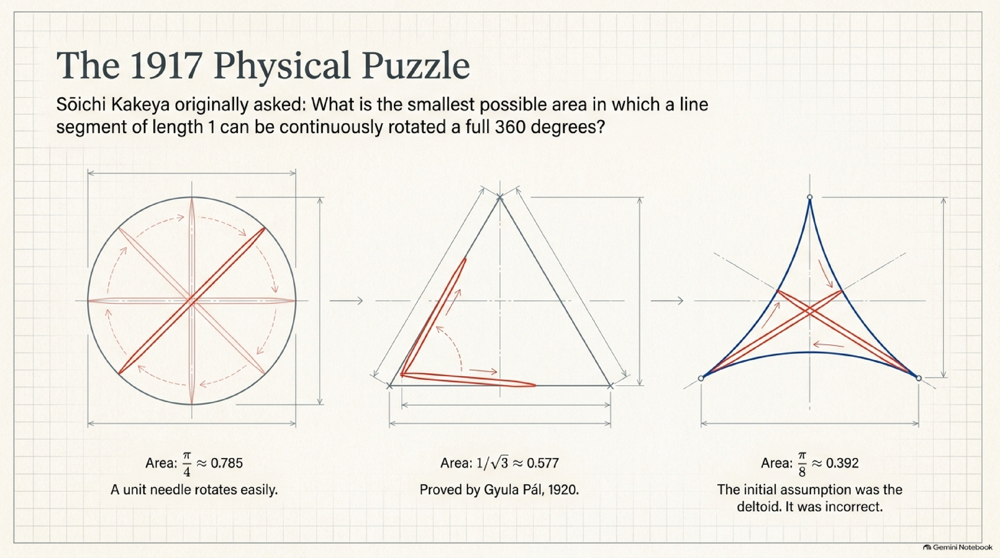

*AI-generated slide. The disk and triangle areas match the text above. The deltoid's area $`\pi/8`$ is NotebookLM's own figure and was not checked.*

### 1.2 Besicovitch: zero area is possible

Around 1919, while working on an unrelated question about integrals, Abram Besicovitch constructed something astonishing: a set in the plane that contains a unit line segment in **every direction** and yet has **area zero**. In 1928 he used such sets to answer Kakeya: there is **no positive minimum**. A needle can be turned around in a region of area less than any $\varepsilon > 0$.

These are two different requirements. A **Kakeya set** (also called a Besicovitch set) only has to *contain* a segment in every direction. Kakeya's original problem also asks that the needle can move continuously from one position to the next. The modern conjecture is about Kakeya sets.

Here is a classical construction that you can check with a little arithmetic. It goes back to Jean-Pierre Kahane (1969); the details below are our own write-up. Let $C$ be the Cantor set of numbers in $[0,1]$ whose base-4 digits are only 0 and 3. (Keep the first and last quarter of $[0,1]$, then the first and last quarter of each piece, and so on.) Draw every segment from a point $(x, 0)$ with $x \in C$ to a point $(y/2, 1)$ with $y \in C$.

- **Every direction in a fan.** A segment's horizontal shift is $y/2 - x$. Digit by digit in base 4, that is (0 or 1.5) minus (0 or 3), which is $1.5$ times one of $-2, -1, 0, 1$. Base-4 expansions with four consecutive digits fill a whole interval, so the shifts fill $[-1, 1/2]$. That is a fan of directions about $71.6°$ wide. Three copies rotated by $60°$ cover every direction.
- **Area tending to zero.** The horizontal slice at height $t$ is $(1-t)C + (t/2)C$, a flattened shadow of the "four-corner" Cantor set $C \times C$. By a theorem of Besicovitch on projections, almost every such shadow has length zero, so the limiting set has area zero. (This step is background knowledge, not something we computed.)

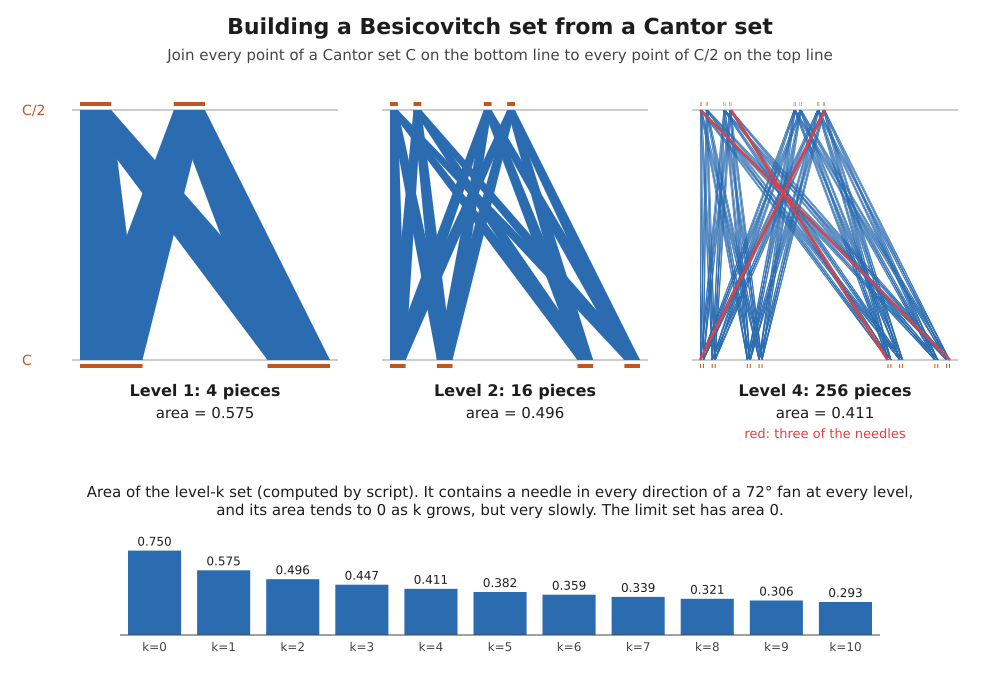

The figure shows the sets you get after $k$ steps of the Cantor construction, with their areas computed by a script. Every level contains a segment in every direction of the fan, yet the area keeps falling: 0.750, 0.575, 0.496, … , 0.293 at level 10. It tends to zero, but very slowly. That slowness is a first hint that such sets cannot be "too thin". Making that hint precise is the Kakeya conjecture.

### 1.3 Measuring size when the volume is zero: dimension

If area or volume can't tell a Kakeya set apart from a point, we need a finer ruler. That ruler is **dimension**.

**Minkowski (box-counting) dimension.** Cover a bounded set $K$ with a grid of cubes of side $\delta$ and count how many cubes meet it; call the count $N_\delta(K)$. For a segment, $N_\delta \approx 1/\delta$. For a square, $N_\delta \approx 1/\delta^2$. In general, if $N_\delta(K) \approx \delta^{-d}$ as $\delta \to 0$, then $K$ has box-counting dimension $d$:

$$\dim_{\mathrm{M}} K = \lim_{\delta\to 0} \frac{\log N_\delta(K)}{\log(1/\delta)} .$$

(When the limit doesn't exist, one takes the upper or lower limit: the upper and lower Minkowski dimensions.)

**Hausdorff dimension.** Box counting uses one size of box at a time. Hausdorff dimension allows covers by sets $U_i$ of *different* sizes, all of diameter at most $\delta$. For $s \ge 0$ the companion paper defines

$$\mathcal{H}^s_\delta(K) = \inf\Big\lbrace \sum_i (\mathrm{diam}\ U_i)^s : K \subset \bigcup_i U_i,\ \mathrm{diam}\ U_i \le \delta \Big\rbrace, \qquad \mathcal{H}^s(K) = \lim_{\delta \to 0} \mathcal{H}^s_\delta(K),$$

and $\dim_{\mathrm H} K = \inf\lbrace s : \mathcal{H}^s(K) = 0 \rbrace$. For bounded sets, Hausdorff dimension is at most the lower Minkowski dimension, which is at most the upper one. So **"Hausdorff dimension $n$" is the stronger statement.**

A computed example shows that the two can differ. Take $A = \lbrace 0 \rbrace \cup \lbrace 1, \tfrac12, \tfrac13, \tfrac14, \dots \rbrace$. A script counts the grid intervals of length $\delta$ that meet $A$:

| $\delta$ | $N_\delta(A)$ | $\log N_\delta / \log(1/\delta)$ |
|---|---|---|
| $10^{-2}$ | 20 | 0.651 |
| $10^{-4}$ | 200 | 0.575 |
| $10^{-6}$ | 2,000 | 0.550 |
| $10^{-8}$ | 20,000 | 0.538 |
| $10^{-10}$ | 200,000 | 0.530 |

The count is exactly $2/\sqrt{\delta}$ at these scales, so the box-counting dimension is $1/2$. But $A$ is countable: cover its $n$-th point by an interval of length $\varepsilon 2^{-n}$, and the sum of $s$-th powers is $\varepsilon^s/(2^s - 1)$, which tends to $0$ as $\varepsilon \to 0$ for any $s > 0$. So its Hausdorff dimension is $0$. Box counting is fooled by the crowded points near 0, and Hausdorff dimension is not.

### 1.4 The Kakeya set conjecture

> **Kakeya set conjecture.** Every set in $\mathbb{R}^n$ that contains a unit line segment in every direction has Hausdorff dimension $n$ (and, if it is bounded, Minkowski dimension $`n`$).

In words: you can squeeze the *volume* of a Kakeya set to zero, but not its *dimension*. It always "looks $n$-dimensional" under a fine enough microscope. On the line ($`n = 1`$) this is trivial. In the plane Roy Davies proved it in 1971. For $n \ge 3$ it became one of the central open problems of harmonic analysis. In 1995 Thomas Wolff proved the lower bound $(n+2)/2$, which is $5/2$ in $\mathbb{R}^3$ and $3$ in $\mathbb{R}^4$.

### 1.5 Tubes, shadings and the maximal function

To make the problem quantitative, thicken everything to a fixed small scale $\delta$. A unit segment becomes a **$`\delta`$-tube**, a cylinder of length 1 and radius $\delta$. In $\mathbb{R}^3$ the principal paper uses

$$T_\delta(a,\omega) = \lbrace a + t\omega + u : \lvert t\rvert \le \tfrac12,\ u \cdot \omega = 0,\ \lvert u\rvert \le \delta \rbrace, \qquad \text{volume } \pi\delta^2,$$

a tube centred at $a$ pointing in the direction $\omega$, a unit vector on the sphere $S^2$. The **Kakeya maximal function** of a function $f$ records, for each direction, the best average of $\lvert f\rvert$ that any tube in that direction can find:

$$K_\delta f(\omega) = \sup_{a \in \mathbb{R}^3} \frac{1}{\pi\delta^2} \int_{T_\delta(a,\omega)} \lvert f(x)\rvert\ dx .$$

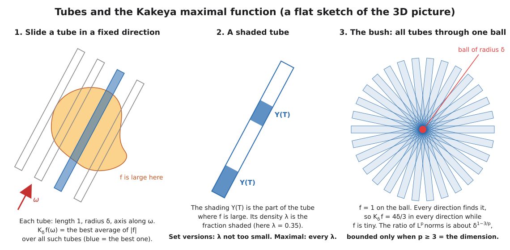

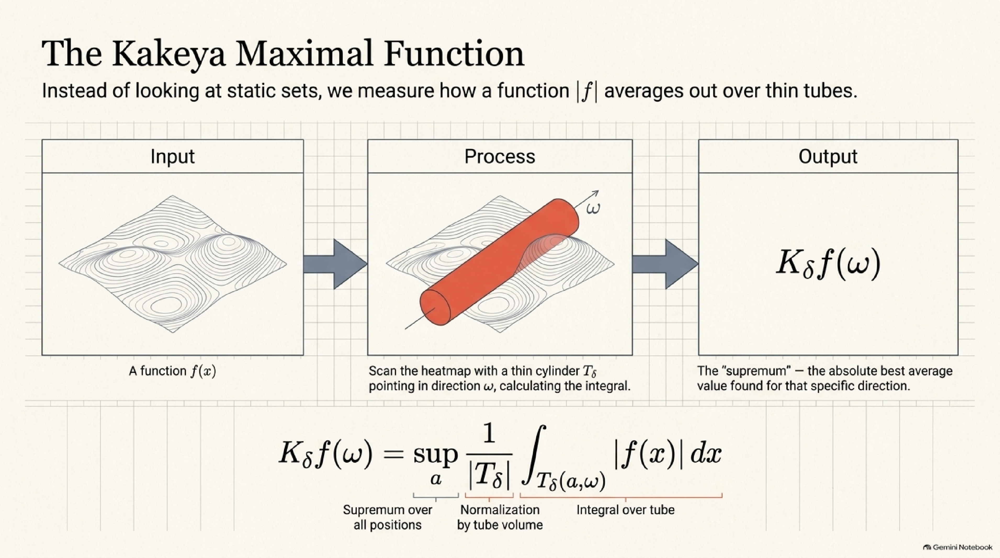

*AI-generated slide. Its formula is the paper's definition, written with $`\lvert T_\delta\rvert`$ for the tube volume $`\pi\delta^2`$.*

The **Kakeya maximal conjecture** in $\mathbb{R}^n$ says that this operation is bounded on $L^n$, up to an arbitrarily small power of $\delta$:

$$\lVert K_\delta f\rVert_{L^n(S^{n-1})} \le C_{\varepsilon}\ \delta^{-\varepsilon}\ \lVert f\rVert_{L^n(\mathbb{R}^n)} \qquad \text{for every } \varepsilon > 0 .$$

Here $\lVert g\rVert_{L^p} = (\int \lvert g\rvert^p)^{1/p}$, and on the sphere the integral uses surface area. The loss $\delta^{-\varepsilon}$ is a deliberately generous allowance: any power, however small, is fine, but a fixed power is not.

The same statement can be phrased with tubes and **shadings**, which is how the proof works. Take tubes pointing in $\delta$-separated directions, and in each tube $T$ mark a subset $Y(T)$, its shading, where $\lvert Y(T)\rvert \ge \lambda \lvert T\rvert$. Think of $Y(T)$ as the part of the tube where $f$ is large. The maximal conjecture is equivalent to the union bound (this is display (1.1) in the paper; Zahl's survey records the equivalence as its Conjectures 1.3′ and 1.3″)

$$\Big\lvert \bigcup_T Y(T) \Big\rvert \ \gtrsim_\varepsilon\ \delta^{\varepsilon}\ \lambda^3 \sum_T \lvert T\rvert, \qquad 0 < \lambda \le 1,$$

with the power $\lambda^3$ exactly, and with a constant that does not depend on $\lambda$.

### 1.6 Three versions of the conjecture

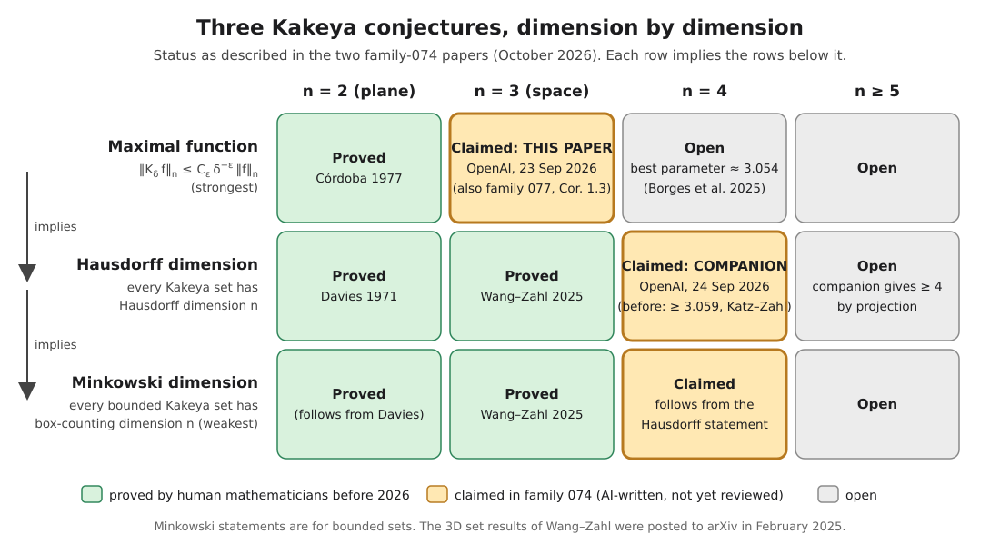

| Version | What it asks, in tube language | Strength |
|---|---|---|
| **Minkowski** (set) | Full tubes ($`\lambda = 1`$) in separated directions have a union of volume at least $\delta^{\varepsilon}\sum\lvert T\rvert$ | Weakest |
| **Hausdorff** (set) | The same for shadings of only logarithmically small density, such as $\lambda \approx 1/\log(1/\delta)$ | Middle |
| **Maximal** | The same for every density $\lambda$, with exactly the factor $\lambda^n$ in front | Strongest: implies the other two |

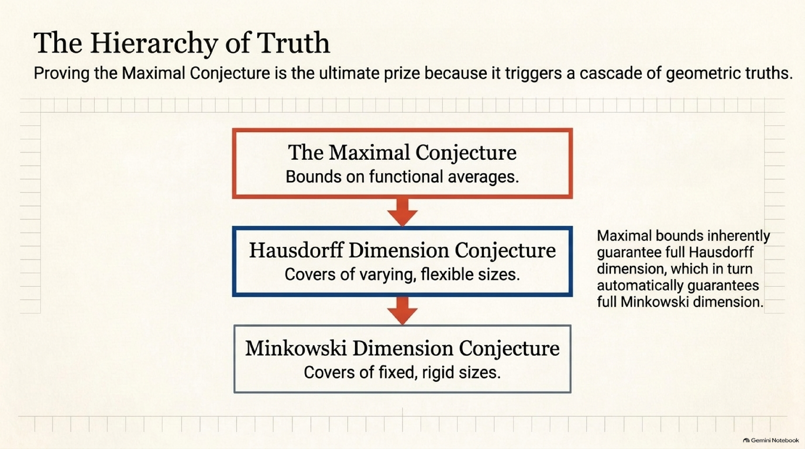

*AI-generated slide. The order of the three versions is right; the rest of this section explains why each arrow holds.*

Why does the Hausdorff version need shadings? Covers with many sizes are the culprit. The companion's reduction (its Theorem 2.17, *Reduction to a bad weighted problem*) starts like this. If a Kakeya set had Hausdorff dimension below $4 - \sigma$, cover it by balls with $\sum r_i^{4-\sigma} \le 1$ and sort the balls by dyadic size $2^{-k}$. Each unit segment must spend a fraction at least $c k^{-2}$ of its length inside the balls of one size. So at one scale $\delta = 2^{-k}$, many tubes have shadings of density about $1/\log^2(1/\delta)$, packed into a union of very small volume. A union estimate that tolerates such logarithmically thin shadings rules this out. Zahl's survey states the Hausdorff form of the conjecture as a union estimate of this kind, for shadings of density at least $1/\log(1/\delta)$.

The maximal version asks for much more: shadings of *any* density, with the clean power $\lambda^3$. Wang and Zahl's three-dimensional set theorem gives a union estimate with a power $\lambda^{K(\varepsilon)}$ instead. That is enough for dimension, but not for the maximal function. The principal paper notes that the need to replace it by $\lambda^3$ "is stated explicitly after their theorem". Zahl's 2025 survey describes the obstruction: the induction on scales in that argument tends to replace a density $\lambda$ by $\lambda^2$ at each step.

**Maximal implies Minkowski, in four lines.** (This is the standard argument, written out by us; it is not quoted from the papers.) Let $K \subset \mathbb{R}^3$ be a bounded Kakeya set and $E$ its $\delta$-neighbourhood. Every direction $\omega$ has a whole tube inside $E$, so $K_\delta \mathbf{1}_E(\omega) = 1$ for all $\omega$. The maximal inequality with $f = \mathbf{1}_E$ gives

$$(4\pi)^{1/3} = \lVert K_\delta \mathbf{1}_E\rVert_{L^3(S^2)} \le C_\varepsilon \delta^{-\varepsilon} \lvert E\rvert^{1/3} \quad\Longrightarrow\quad \lvert E\rvert \ge 4\pi C_\varepsilon^{-3}\ \delta^{3\varepsilon}.$$

If $N_\delta(K)$ grid cubes of side $\delta$ cover $K$, then cubes of side $3\delta$ around them cover $E$, so $\lvert E\rvert \le 27\delta^3 N_\delta(K)$. Hence $N_\delta(K) \gtrsim \delta^{-3+3\varepsilon}$. Since $\varepsilon$ is arbitrary, $K$ has Minkowski dimension 3. Getting Hausdorff dimension takes the shaded version and the pigeonholing above.

**Dimensions 3 and 4 are different problems.** In $\mathbb{R}^3$ the set version was already settled, and the new paper upgrades it to the maximal version. In $\mathbb{R}^4$ even the set version was open: Wolff's bound gave 3, and decades of work had raised it only to about $3.059$. The companion jumps to 4, but only for the Hausdorff (set) version. The four-dimensional maximal conjecture is still open. The companion lists its best known parameter as $(159+\sqrt{145})/56 \approx 3.054$ (Borges, Chan, Chen, Liu, Xi and Zhan, 2025).

### 1.7 Why harmonic analysts care: Fourier restriction

Kakeya sets entered Fourier analysis in 1971, when Charles Fefferman used Besicovitch's construction to settle the "ball multiplier" problem. He showed that cutting off a function's Fourier transform to a ball is not a bounded operation on $L^p$ for $p \ne 2$, in dimension 2 and higher. In 1991 Jean Bourgain developed maximal estimates in higher dimensions and connected them with **Stein's restriction conjecture**. That conjecture concerns the *Fourier extension operator*

$$Ef(x) = \int_{B(0,1)} f(\omega)\ e^{2\pi i (x_1\omega_1 + \cdots + x_{n-1}\omega_{n-1} + x_n \lvert\omega\rvert^2)}\ d\omega ,$$

which builds a wave out of data $f$ living on a curved surface (here a paraboloid). The conjecture asks for $\lVert Ef\rVert_{L^p(\mathbb{R}^n)} \lesssim \lVert f\rVert_{L^p}$ for every $p > 2n/(n-1)$; in $\mathbb{R}^3$, that is every $p > 3$.

Here is the link, in the form Zahl's survey describes it. Chop the surface into small caps. The wave coming from one cap splits into pieces ("wave packets"), each concentrated on a long thin tube whose direction is fixed by the position of the cap. So $Ef$ is a sum of tube-shaped waves pointing in many directions, and bounding it requires knowing how such tubes can overlap. That is a Kakeya question. A classical argument (background knowledge, not from the papers) shows that the restriction conjecture implies the Kakeya maximal conjecture, so Kakeya is the geometric core of restriction.

The principal paper mentions an independent route to its own theorem through this link: another openai/math preprint, *Elliptic capacity propagation and Fourier restriction to the sphere* (family 077), states the same three-dimensional maximal estimate as its Corollary 1.3.

---

## 2. A short history

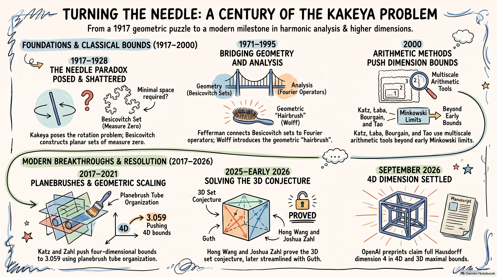

*AI-generated timeline (NotebookLM, sketch-note style). It skips Davies, Córdoba and Bourgain's 1991 paper, merges Bourgain's 1999 work with Katz–Łaba–Tao under "2000", and its "4D dimension settled" headline overstates an unreviewed preprint. The table below is the checked version.*

Dates come from the two papers' introductions and reference lists, Joshua Zahl's survey *A survey of the Kakeya conjecture, 2000–2025* (arXiv, December 2025), and the Wikipedia article on Kakeya sets (checked 7 October 2026). Rows marked † come only from Wikipedia.

| When | Who | What happened |
|---|---|---|
| 1917 | **Sōichi Kakeya** (with Matsusaburô Fujiwara) | The needle problem, first for convex regions |
| 1919 | **Abram Besicovitch** | A planar set of measure zero with a unit segment in every direction, found while studying a problem about integration (Wikipedia cites a 1919 paper for it, though its text dates the result 1920) † |
| 1920 | **Gyula Pál** | The convex minimum is the equilateral triangle of height 1 † |
| 1928 | **Besicovitch; Oskar Perron** | Besicovitch: a needle can be reversed in a region of arbitrarily small area. Perron simplifies the construction (the "Perron tree") † |
| 1969 | **Jean-Pierre Kahane** | A measure-zero Besicovitch set built from Cantor sets † |
| 1971 | **Charles Fefferman** | Besicovitch sets show that the ball multiplier is unbounded: the first concrete link to Fourier analysis |
| 1971 | **Roy O. Davies** | Every Kakeya set in the plane has full Hausdorff dimension 2 |
| 1977 | **Antonio Córdoba** | The Kakeya maximal estimate in the plane |
| 1991 | **Jean Bourgain** | Maximal estimates in higher dimensions and their connection with Fourier restriction |
| 1995 | **Thomas Wolff** | The "hairbrush" argument: maximal estimates giving dimension $(n+2)/2$, that is $5/2$ in $\mathbb{R}^3$ and $3$ in $\mathbb{R}^4$ |
| 1999 | **Bourgain** | Additive combinatorics (sums and differences of slices) enters the problem |
| 2000 | **Nets Katz, Izabella Łaba, Terence Tao** | Upper Minkowski dimension above $5/2$ in $\mathbb{R}^3$. They identify "stickiness", "planiness" and "graininess" in near-extremal tube families |
| 2001, 2002 | **Łaba and Tao; Katz and Tao** | Upper Minkowski dimension above $(n+2)/2$ for $n \ge 4$; sums-and-differences bounds in high dimensions |
| 2006, 2010 | **Jonathan Bennett, Anthony Carbery, Tao; Larry Guth** | Multilinear Kakeya, and Guth's endpoint version |
| 2008 | **Zeev Dvir** | The finite-field Kakeya conjecture is proved (arXiv 2008, published 2009) † |
| 2018 | **Guth and Zahl; Zahl; Katz and Rogers** | Polynomial Wolff axioms: Hausdorff dimension at least $3 + 1/40$ for compact Kakeya sets in $\mathbb{R}^4$ |
| 2019 | **Katz, Zahl** | Hausdorff dimension strictly above $5/2$ in $\mathbb{R}^3$ |
| 2021 | **Katz, Zahl** | "Planebrushes": Hausdorff dimension at least $3.059$ in $\mathbb{R}^4$ |
| 2022–2025 | **Hong Wang, Joshua Zahl** | The sticky case (preprint 2022), the Assouad dimension (preprint 2024), then the full **Kakeya set conjecture in $`\mathbb{R}^3`$**, Hausdorff and Minkowski (arXiv, 24 February 2025) |
| 2023–2025 | **Kevin Ren, Hong Wang** | The planar Furstenberg set estimate, a key input here |
| 2025 | **Tainara Borges, Tiklung Chan, Mingfeng Chen, Diankun Liu, Yakun Xi, Yufei Zhan** | Four-dimensional maximal parameter $\approx 3.0543$ |
| Jan 2026 | **Larry Guth, Hong Wang, Joshua Zahl** | A streamlined proof of the 3D set conjecture, used as an input in both papers |
| 23 Sep 2026 | **OpenAI** (internal model) | **This paper:** the Kakeya maximal conjecture in $\mathbb{R}^3$ |
| 24 Sep 2026 | **OpenAI** (internal model) | **Companion:** the Hausdorff-dimension Kakeya conjecture in $\mathbb{R}^4$ |

---

## 3. What the papers prove

### The principal paper (three dimensions)

> **Theorem 1.1.** For every $\varepsilon>0$ there is a finite constant $C_\varepsilon$ such that, for every $0<\delta<1$ and every $f\in L^3(\mathbb{R}^3)$,
> $$\lVert K_\delta f\rVert_{L^3(S^2)} \le C_\varepsilon\ \delta^{-\varepsilon}\ \lVert f\rVert_{L^3(\mathbb{R}^3)} .$$

Here $K_\delta$ is the maximal function of section 1.5, over tubes of length 1 and radius $\delta$, and $S^2$ carries its usual surface measure. The paper states that this "resolves the three-dimensional Kakeya maximal conjecture affirmatively", and it singles out the key feature: "uniformity in the density of the part of each tube on which a function is large".

In plain words: however you arrange a function in space, the "best tube average in each direction" is never much larger, in the $L^3$ sense, than the function itself. Equivalently, shaded tubes in different directions can overlap only as much as the $\lambda^3$ rule allows, for every shading density $\lambda$ at once.

The proof has two halves, which meet in Section 10.

1. **Proposition 10.2 (*Maximal reduction*):** if a certain critical exponent $h(p,0)$ vanishes for some $p > 2$, then $`\lVert K_\delta f\rVert_{3} \le C\ \delta^{-(p-2)/3-\kappa}\lVert f\rVert_{3}`$ for every $\kappa > 0$.
2. **Proposition 10.1 (*Vanishing at the maximal endpoint*):** $h(p,0) = 0$ for values of $p > 2$ arbitrarily close to 2.

Letting $p \to 2$ gives every $\varepsilon > 0$.

### The companion (four dimensions)

> **Theorem 1.1.** Let $K\subset\mathbb{R}^4$. Suppose that for every $e\in S^3$ there is a point $a_e\in\mathbb{R}^4$ such that $\lbrace a_e+te : 0\le t\le1\rbrace\subset K$. Then $\dim_{\mathrm H} K=4$.

The companion stresses that neither $K$ nor the choice of segments has to be measurable or compact, and that no "stickiness" hypothesis is imposed on the family of lines.

### The family at a glance

| Statement | Dimension | Where | Before this family |
|---|---|---|---|
| Kakeya **maximal** conjecture | $n = 3$ | Principal paper, Theorem 1.1 | Open. The set version was proved by Wang–Zahl (2025) |
| Kakeya **set** conjecture, Hausdorff dimension | $n = 4$ | Companion, Theorem 1.1 | Best bound about $3.059$ (Katz–Zahl) |
| Minkowski and packing dimension 4 for Kakeya sets | $n = 4$ (bounded sets for Minkowski) | Companion, Section 11.1 (immediate from Theorem 1.1) | Open |
| $\dim_{\mathrm H} \ge 4$ for every Kakeya set | every $n \ge 4$ | Companion, Section 11.2, by projecting to four dimensions | For $n \ge 6$, Wolff's $(n+2)/2$ already gives at least 4 (our remark), so the gain is in $n = 5$ |
| Kakeya maximal conjecture | $n = 4$ | **Not claimed** | Best parameter about $3.0543$ |

---

## 4. Why it matters

| | Before | After (if the preprints hold up) |
|---|---|---|
| **Three dimensions** | Set conjecture proved (Wang–Zahl, 2025); maximal conjecture open | The strongest standard form, the maximal conjecture, is proved. It holds for every shading density at once |
| **Four dimensions** | Hausdorff dimension at least about $3.059$ | Full dimension 4: the first case of the Kakeya set conjecture beyond three dimensions |
| **Higher dimensions** | Bounds such as Wolff's $(n+2)/2$ | Every Kakeya set in $\mathbb{R}^n$, $n \ge 4$, has Hausdorff dimension at least 4 (the companion highlights dimension five; for $n \ge 6$ Wolff's bound already gave this) |

**Consequences stated in the principal paper (Section 11).** The theorem supplies the input for established transfer theorems of Gao, Liu and Xi, which give:

- **Nikodym maximal estimates** in $\mathbb{R}^3$, and locally on three-dimensional manifolds of constant curvature. These average over segments through a given point rather than in a given direction. For $1 \le p \le 3$ and $q = 2p'$, the bound is $\delta^{1-3/p-\varepsilon}$ from $L^p$ to $L^q$.
- **Local curved Kakeya maximal estimates** for a fixed nondegenerate translation-invariant phase that satisfies Bourgain's condition, in which the tubes follow curves instead of lines.

**Consequences stated in the companion (Section 11).**

- Packing dimension 4, and Minkowski dimension 4 for bounded Kakeya sets in $\mathbb{R}^4$.
- **Partial direction sets:** if $E \subset \mathbb{R}^4$ contains a segment in every direction of a set $D$, then $\dim_{\mathrm H} E \ge 1 + \dim_{\mathrm H} D$ (via a theorem of Keleti and Máthé). Extending every segment of a family to a full line does not change the dimension of the union.
- **Nikodym sets** on four-dimensional manifolds of constant curvature have full dimension 4. This resolves Conjecture 1.4 of Gao, Liu and Xi in dimension four.
- **Curved Kakeya sets** in a fixed chart in $\mathbb{R}^4$, and a three-dimensional consequence for compact sets containing the curves $t \mapsto (w_y + (t I_2 + t^2 B)y,\ t)$ with $\mathrm{rank}\ B = \mathrm{rank}\ B^2 = 1$ (via Nadjimzadah's lifting theorem).

**Inside openai/math.** Family 077's paper *Diagonal Fourier extension for positively curved surfaces in three dimensions* cites the principal paper's Theorem 1.1 to control weighted tube concentration in its proof of Fourier extension estimates. And the sphere-restriction paper of family 077 derives the same maximal estimate independently, as noted in section 1.7.

The deeper significance is about *uniformity*. A dimension statement only cares whether shaded tubes can hide inside a set of tiny volume. Fourier analysis needs to know *how much* tubes overlap when each one is only partly used, with the exact power of the density. That is what the maximal theorem supplies, and it is why it is a key input for work on restriction, Bochner–Riesz (another problem about cutting off Fourier transforms) and Nikodym problems.

---

## 5. The main idea of the proof

Both papers are long (97 and 175 pages) and technical. Here is the three-dimensional proof at three zoom levels, then a sketch of the four-dimensional one.

### Level 1: the one-paragraph version

The proof is a **proof by extreme counterexample**. Suppose shaded tubes *could* overlap more than the $\lambda^3$ rule allows, by some power of the resolution. Measure the worst possible excess with a single number, the **critical exponent**, and look at configurations that achieve it. Such a worst case must be perfectly balanced. If some small region held too many tubes, zooming in on that region would produce an even worse configuration, which is impossible. Balance forces rigid structure. Near each point the tube directions lie close to a plane, the tubes gather into thin flat plates, and the whole configuration repeats itself from scale to scale. Finally the paper does an **information count**. It describes each tube by four numbers (two for position, two for velocity) and looks at the same tube from two of its marked points. Projection theorems from the plane then show that the four numbers cannot carry the information that the self-similar structure demands. So the worst case doesn't exist, the critical exponent is zero, and the maximal inequality follows.

> **Analogy:** a detective assumes the perfect crime exists, then studies the most perfect version of it. The more perfect it is, the more organized it must be, until it would need more secret information than any accomplice could carry. So there was no crime.

### Level 2: the step-by-step picture

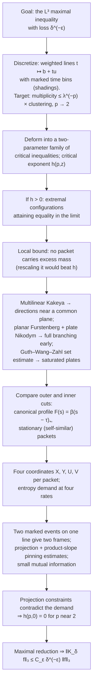
```mermaid
flowchart TD
    A["Goal: the L³ maximal inequality<br/>with loss δ^(−ε)"] --> B["Discretize: weighted lines t ↦ b + tu<br/>with marked time bins (shadings).<br/>Target: multiplicity ≤ λ^(−p) × clustering, p → 2"]
    B --> C["Deform into a two-parameter family of<br/>critical inequalities; critical exponent h(p,z)"]
    C --> D["If h > 0: extremal configurations<br/>attaining equality in the limit"]
    D --> E["Local bound: no packet carries excess mass<br/>(rescaling it would beat h)"]
    E --> F["Multilinear Kakeya → directions near a common plane;<br/>planar Furstenberg + plate Nikodym → full branching early;<br/>Guth–Wang–Zahl set estimate → saturated plates"]
    F --> G["Compare outer and inner cuts:<br/>canonical profile F(s) = β(s − τ)₊,<br/>stationary (self-similar) packets"]
    G --> H["Four coordinates X, Y, U, V per packet;<br/>entropy demand at four rates"]
    H --> I["Two marked events on one line give two frames;<br/>projection + product-slope pinning estimates;<br/>small mutual information"]
    I --> J["Projection constraints contradict the demand<br/>⇒ h(p,0) = 0 for p near 2"]
    J --> K["Maximal reduction ⇒ ‖K_δ f‖₃ ≤ C_ε δ^(−ε) ‖f‖₃"]
```

**Step 1: From functions to counting.** Write each tube as the graph of a moving point $t \mapsto M_i(t) = b_i + t u_i$ in the plane, with $t$ playing the role of time. At resolution $N = 1/\delta$, a shading is a set of marked time bins on that line. Lines carry weights and keep their identity even if two of them coincide, because rescaling can make different tubes look identical. The paper bounds the average **multiplicity** $m$, the number of marked bins per occupied space–time cell, in terms of the shading density $\lambda$ and the concentration of lines in **planks** (thin slabs around a moving centre). For separated directions this target becomes $\lvert E\rvert \gtrsim nN\lambda^{p+1}$, which approaches the cubic density bound as $p \to 2$. Section 10.2 converts this discrete estimate back into the $L^3$ inequality for arbitrary functions.

**Step 2: A family of inequalities and its critical exponent.** Total density alone doesn't describe what happens when you zoom. The paper therefore records a **temporal deficit profile** $F$, which says, scale by scale, how far the marked bins fall short of filling each time block. It defines a family of inequalities whose cost depends on this profile and on the two plank widths, and lets $h(p,z)$ be the least extra power of $N$ needed to make the inequality true for every configuration. The theorem follows once $h(p,0) = 0$. If instead $h > 0$, there are configurations attaining equality in the limit, and the rest of the proof studies them.

**Step 3: Local structure of a worst case.** An equality configuration cannot contain a local packet with too much mass, because rescaling that packet would improve the exponent. These **local bounds**, combined with the **multilinear Kakeya** theorem (Bennett–Carbery–Tao, with Guth's endpoint), force the directions on short time blocks to lie near a common plane. The **planar Furstenberg estimate** (Ren–Wang) gives density inside plates, and a "plate Nikodym" bound controls the cost of filling missing times. So equality forces full branching on an initial range of scales. On those scales the weighted **Guth–Wang–Zahl set theorem** captures saturated plates, and an anisotropic rescaling rules out equality with arbitrarily small total deficit. The paper calls these local planes and plates its forms of Katz–Łaba–Tao's planiness and graininess.

**Step 4: Stationarity.** The paper varies the two parameters of the critical inequality to select the shapes of saturated packets. It then compares two ways of cutting an equality configuration: an *outer* cut removes the initial scales, and an *inner* cut keeps a fine-scale model after aligning its plates. A minimum-delay argument forces the canonical profile

$$F(s) = \beta\ (s-\tau)_+ ,$$

which is flat up to scale $\tau$ and then has constant slope. Repeating the outer cut reproduces the same profile and the same packet geometry. This self-reproduction is the "stationarity" used in the rest of the proof.

**Step 5: Four coordinates and an entropy demand.** In each packet, with a nearly constant normal parameter $\vartheta$, the paper uses position and velocity coordinates

$$X = M_i(t)_1 + \vartheta M_i(t)_2,\qquad Y = M_i(t)_2,\qquad U = u_{i,1} + \vartheta u_{i,2},\qquad V = u_{i,2}.$$

Their admissible widths shrink at four prescribed rates. The packet masses dictate how much information, measured as conditional entropy per $\log N$, these four coordinates must carry. This is the **entropy demand**.

**Step 6: Two frames on one line.** Pick two marked events on the same line, at time difference $\Delta t$ and normal difference $\Delta\vartheta$. They give two frames for the same line, related by

```math
\begin{pmatrix}X'&Y'\\ U'&V'\end{pmatrix}
=
\begin{pmatrix}1&\Delta t\\0&1\end{pmatrix}
\begin{pmatrix}X&Y\\U&V\end{pmatrix}
\begin{pmatrix}1&0\\\Delta\vartheta&1\end{pmatrix}.
```

Changing time adds velocity to position, and changing the normal mixes the two spatial components. The resulting one-dimensional projections are constrained by the planar Furstenberg theorem. When the two middle coordinates $Y$ and $U$ shrink at the same rate, one combination needs more: the coefficient $\Delta t\ \Delta\vartheta$ multiplying $V$ in $X'$. For this "product slope" the paper proves a **pinning estimate**, adapting the radial-projection bootstrap of Shmerkin–Wang and Orponen–Shmerkin–Wang.

**Step 7: Dependence, handled by information.** The two events share a line, so their matrix and slope are not independent. The paper compares their actual joint law with a product law. If a rate constraint failed, the product law would land in the recorded support only with polynomially small probability, while the actual law always lands there. Such a gap requires a positive amount of **mutual information**, and an averaged short-gap estimate shows there isn't enough.

**Step 8: Contradiction.** The projection constraints are incompatible with the entropy demand of the stationary packets (Section 10.1). So $h(p,0) = 0$ for $p$ near 2, and the maximal reduction gives Theorem 1.1.

### A worked calculation: why the exponent is 3

Two simple examples, computed by script, show that both the exponent $L^3$ and the density power $\lambda^3$ are forced in $\mathbb{R}^3$.

**The bush.** Let $f$ be 1 on a ball of radius $\delta$ at the origin and 0 elsewhere. For every direction $\omega$, the tube $T_\delta(0,\omega)$ contains the whole ball, so

$$K_\delta f(\omega) = \frac{\tfrac43\pi\delta^3}{\pi\delta^2} = \frac{4\delta}{3}\quad\text{for every }\omega .$$

(A Monte Carlo check with 400,000 random points in the tube gives 0.1333, 0.0665 and 0.0268 for $\delta = 0.1, 0.05, 0.02$, against $4\delta/3 = 0.1333, 0.0667, 0.0267$.) Then

$$\frac{\lVert K_\delta f\rVert_{L^p(S^2)}}{\lVert f\rVert_{L^p(\mathbb{R}^3)}} = \frac{\tfrac{4\delta}{3}(4\pi)^{1/p}}{(\tfrac43\pi\delta^3)^{1/p}} = \frac43\ 3^{1/p}\ \delta^{1-3/p}.$$

| $p$ | $\delta = 10^{-1}$ | $10^{-2}$ | $10^{-3}$ | $10^{-4}$ | $10^{-6}$ |
|---|---|---|---|---|---|
| 2 | 7.30 | 23.1 | 73.0 | 231 | 2,309 |
| 2.5 | 3.28 | 5.20 | 8.24 | 13.1 | 32.8 |
| **3** | **1.92** | **1.92** | **1.92** | **1.92** | **1.92** |
| 4 | 0.99 | 0.55 | 0.31 | 0.18 | 0.06 |

Below $p = 3$ the ratio blows up like a power of $1/\delta$, so no $\delta^{-\varepsilon}$ bound can hold. At $p = 3$, the dimension, it stays constant. That is why the conjecture lives in $L^n$ in $\mathbb{R}^n$.

**The shaded bush.** Take $M$ tubes through the origin, one for each direction in a $\delta$-separated set. There can be about $\delta^{-2}$ of them, so $\sum\lvert T\rvert = M\pi\delta^2$ is a constant $c$. Shade each tube only inside the ball of radius $\lambda/2$, so that each shading has density about $\lambda$ (for $\lambda$ much larger than $\delta$). The union of all shadings is that ball, of volume $\tfrac{\pi}{6}\lambda^3$. So

$$\frac{\lvert\bigcup Y(T)\rvert}{\lambda^3\sum\lvert T\rvert} = \frac{\pi}{6c} \quad\text{for every }\lambda .$$

(With the script's choice $M = 2\pi/\delta^2$, so $c = 2\pi^2$, this is $1/(12\pi) \approx 0.0265$ for every $\lambda$, for example $\lambda = 1, 0.1, 0.01$ when $\delta = 10^{-3}$.) The union can be as small as a constant times $\lambda^3\sum\lvert T\rvert$, so the power $\lambda^3$ in the union bound cannot be improved. The theorem says that, up to a factor $\delta^{\varepsilon}$, the union is never smaller than this.

### The four-dimensional companion

The companion uses a different machine. Its basic object is a **chart**: a collection of line pieces inside a moving box, over a time interval, on which one quadratic polynomial test stays small, with a lower bound on the incidence mass it covers. Charts can be nested, because normalizing inside a chart produces a problem of the same kind. What matters is the trade-off between how thin the quadratic relation is and how long the line pieces are on which it holds. The **horizon** $H$ is the least time cost of a good chart system covering a substantial part of the problem.

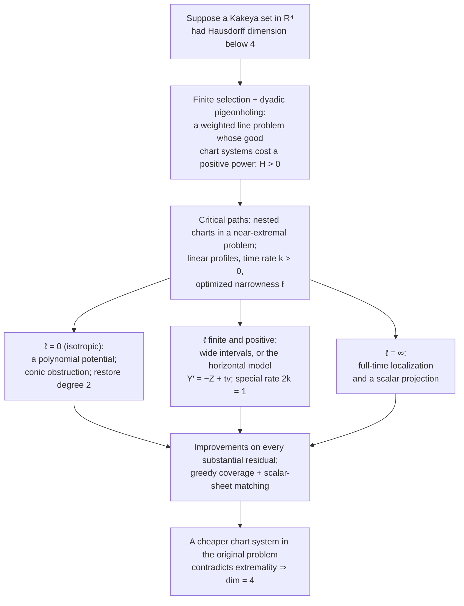
```mermaid
flowchart TD
    A["Suppose a Kakeya set in R⁴<br/>had Hausdorff dimension below 4"] --> B["Finite selection + dyadic pigeonholing:<br/>a weighted line problem whose good<br/>chart systems cost a positive power: H > 0"]
    B --> C["Critical paths: nested charts in a near-extremal problem;<br/>linear profiles, time rate k > 0,<br/>optimized narrowness ℓ"]
    C --> D["ℓ = 0 (isotropic):<br/>a polynomial potential;<br/>conic obstruction; restore degree 2"]
    C --> E["ℓ finite and positive:<br/>wide intervals, or the horizontal model<br/>Y′ = −Z + tv; special rate 2k = 1"]
    C --> F["ℓ = ∞:<br/>full-time localization<br/>and a scalar projection"]
    D --> G["Improvements on every substantial residual;<br/>greedy coverage + scalar-sheet matching"]
    E --> G
    F --> G
    G --> H["A cheaper chart system in the original problem<br/>contradicts extremality ⇒ dim = 4"]
```

1. **Reduction.** A hypothetical counterexample is turned into a weighted problem with positive horizon $H > 0$ (section 1.6 shows the first step). Lines are written as $(t,\ y_0 + tV,\ w_0 + tW)$ with $y \in \mathbb{R}^2$: an observation keeps $t$ and $y$ exactly and only bins the last coordinate $w$.
2. **Comparison.** Local graphs of the polynomial tests give "scalar sheets". Because a density exponent $d < 1$ is available, two lists of such sheets cannot often agree in value while their derivatives disagree. This both lengthens terminal charts and glues local fits together.
3. **Three regimes.** Following nested charts in a near-extremal problem, the profiles become linear with a time rate $k > 0$ and a "narrowness" rate $\ell$, which measures how much thinner the small spatial axis gets than the time scale. When $\ell = 0$, enough separated velocities give an approximate potential, and a possible cubic or quartic obstruction (directions near a conic) is folded back into a quadratic test. When $0 < \ell < \infty$, either projected intervals are wide enough already, or planar rigidity forces a "horizontal model". When $\ell = \infty$, two nested chart labels localize trajectories over the whole time interval.
4. **Assembly.** In every regime the local improvements are assembled into a chart system with recoverable labels in the original problem. It has a smaller time cost (or extra narrowness), which contradicts the extremal choice.

The four-dimensional proof also uses one three-dimensional ingredient. That is a weighted "full-time plank" estimate from the principal paper (its Lemma 3.3; see section 7), which the principal paper derives from the Guth–Wang–Zahl union estimate. That lemma is the only part of the principal paper the companion cites, so it does not use the three-dimensional maximal theorem itself. Other inputs are Carbery–Valdimarsson's determinant form of multilinear Kakeya, a restricted-triple dot-product theorem of Wang–Zahl, a multiplicative-convolution estimate of Orponen–de Saxcé–Shmerkin, and Balog–Szemerédi–Gowers-type graph arguments.

### Level 3: the critical-exponent machinery, for readers with background

In the indexed model, an index $i$ has a weight $\omega_i$, a matrix $M_i = (b_i, u_i)$ in a fixed bounded set, and a nonempty set $S_i$ of the $N$ dyadic time bins. With

$$n = \sum_i \omega_i,\qquad \mathcal{I} = \sum_i \omega_i\lvert S_i\rvert,\qquad k = \mathcal{I}/n,\qquad m = \mathcal{I}/\lvert E\rvert,\qquad \lambda = k/N,$$

the target is $m \le_{\exp} \lambda^{-p} \sup_B n_B/(ab)$ for $p > 2$ arbitrarily close to 2. Here $B$ runs over full-time planks of widths $a \le b$ (in units of $`1/N`$), and $A \le_{\exp} B$ means $\limsup \log(A/B)/\log N \le 0$. An index belongs to a plank only if its *entire* trace does, which is stronger than having an event in it.

The deformation uses a uniform profile $F$ (nondecreasing, 1-Lipschitz, $F(0) = 0$; the number of marked bins in an occupied block of $N^\kappa$ bins is $`N^{\kappa - F(\kappa) + o(1)}`$). It introduces a temporal cost $\Pi_F(1) = \int_0^1 P_{p,q}(F'(u))\ du$ with $P_{p,q}(e) = pe - \mathcal{D}(q,e)$, where $\mathcal{D}$ is a smoothed discount, and a plank parameter $\Delta_A = \sup_B n_B / (a^{d-1-A} b^{1+A})$ with $d = 2 - q$. The critical exponent $h(p,z)$, with $z = -q$, is the least $A$ with $m \le_{\exp} N^{A + \Pi_F(1)}\Delta_A$ for all sequences of configurations with a uniform profile $F$. At $q = 0$ the cost is just $pF(1)$, so only total density matters, and $h(p,0) = 0$ is exactly the density target above; Proposition 10.2 turns it into the maximal bound with loss $\delta^{-(p-2)/3-\kappa}$. At an interior differentiability point with $h > 0$ and $h_z > 0$, derivatives of $h$ select the temporal deficits and plank shapes that the local analysis uses.

The canonical profile $F(\kappa) = \beta(\kappa - \tau)_+$, with $\ell = 1 - \tau$ and $\beta = v/\ell \le 1$, is shown to have the least initial delay $\tau$ among equalities with deficit $v$. In the stationary frame the four coordinates have rates $(k_X, k_Y, k_U, k_V) = (0, \tau, \ell, 1)$. When $\tau = \ell$ the two middle speeds coincide, and only their joint entropy rate is directly available. This is where the product slope $\Delta t\ \Delta\vartheta$ and the pinning estimate are needed. Section 8 proves the projection constraints. When $\tau \ne \ell$ they include $a_1 \ge y_1$, $u_1 \ge v_1$, and $a_1 < 1 \Rightarrow u_1 \le (a_1 - s_0)_+$, where $s_0 = 1 - \beta > 0$ and $a_1, y_1, u_1, v_1$ are conditional entropy rates of $X, Y, U, V$. Section 10.1 shows that they are incompatible with the adjusted entropy rate that the stationary packets demand. Every limiting exponent comes from finite configurations, and the paper fixes all scales, partitions and tests at each finite stage before increasing the resolution.

---

## 6. The people whose ideas this builds on

| Person | Idea | Where it shows up |
|---|---|---|
| **Sōichi Kakeya** (with Matsusaburô Fujiwara) | The needle problem (1917) | The name and origin of the problem |
| **Abram Besicovitch** | Measure-zero sets with a segment in every direction; needle sets of tiny area | The "compression" phenomenon that the conjecture quantifies |
| **Roy O. Davies, Antonio Córdoba** | The planar set (1971) and maximal (1977) theorems | The $n = 2$ case of both versions |
| **Charles Fefferman** | The ball multiplier counterexample (1971) | The link between tubes and Fourier analysis |
| **Jean Bourgain** | Higher-dimensional maximal estimates and restriction (1991); arithmetic methods (1999) | Background in both introductions |
| **Thomas Wolff** | Hairbrushes; dimension $(n+2)/2$ | The baseline bounds $5/2$ in $\mathbb{R}^3$ and $3$ in $\mathbb{R}^4$ |
| **Nets Katz, Izabella Łaba, Terence Tao** | Stickiness, planiness, graininess | The local planes and plates of Step 3 are "the forms of planiness and graininess" the proof needs |
| **Jonathan Bennett, Anthony Carbery, Terence Tao; Larry Guth; Carbery and Stefán Valdimarsson** | Multilinear Kakeya and its endpoint | Controls three transverse tube families (3D); the determinant version controls independent velocities (4D) |
| **Hong Wang, Joshua Zahl** | The 3D Kakeya set conjecture; sticky Kakeya; a restricted-triple dot-product theorem | The theorem being upgraded (3D); planar rigidity (4D) |
| **Larry Guth, Hong Wang, Joshua Zahl** | A streamlined proof of the 3D set conjecture | The weighted set estimate used in both papers |
| **Kevin Ren, Hong Wang; Hong Wang, Shukun Wu** | The planar Furstenberg estimate and its shaded-tube form | Planar incidence and projection bounds (Steps 3 and 6) |
| **Pablo Shmerkin, Hong Wang; Tuomas Orponen, Shmerkin, Wang** | Radial-projection bootstraps | The product-slope pinning estimate (Step 6) |
| **Michael Hochman, Pablo Shmerkin** | Local entropy averages | The entropy-increment bookkeeping of Step 5 is related to their method |
| **Larry Guth, Joshua Zahl; Zahl; Nets Katz, Keith Rogers** | Polynomial Wolff axioms in $\mathbb{R}^4$ | The earlier 4D bound $3 + 1/40$ |
| **Nets Katz, Joshua Zahl** | Planebrushes (2021); Hausdorff dimension above $5/2$ in 3D (2019) | The earlier 4D bound $3.059$ |
| **Tuomas Orponen, Nicolas de Saxcé, Pablo Shmerkin** | Multiplicative convolutions | Scalar coefficients with small interval probabilities (4D) |
| **Antal Balog, Endre Szemerédi, Timothy Gowers; Benny Sudakov, Szemerédi, Van Vu; Tao, Vu** | Balog–Szemerédi–Gowers and sumset calculus | Retaining incidence edges in the 4D planar-rigidity step |
| **Chuanwei Gao, Diankun Liu, Yakun Xi; Tamás Keleti, András Máthé; Arian Nadjimzadah** | Transfer theorems | The Nikodym, curved-Kakeya, direction-set and lifting consequences |

---

## 7. What it does not prove, and caveats

> [!IMPORTANT]
> **The three-dimensional set conjecture was already a theorem.** Hong Wang and Joshua Zahl proved that every Kakeya set in $\mathbb{R}^3$ has Hausdorff and Minkowski dimension 3 (arXiv, February 2025). The new claim in three dimensions is the stronger *maximal* inequality. Its proof uses the Guth–Wang–Zahl set estimate as an ingredient, so it is not an independent proof of the set conjecture.

> [!IMPORTANT]
> **Four dimensions: Hausdorff dimension only.** The companion proves the Kakeya *set* conjecture in $\mathbb{R}^4$ (Hausdorff dimension 4, and hence Minkowski dimension 4 for bounded sets). It does **not** prove the four-dimensional *maximal* conjecture, whose best known parameter it lists as about $3.0543$. In five or more dimensions both conjectures remain open. The companion only gives the lower bound 4 there, by projection.

> [!NOTE]
> **Not the restriction conjecture.** The Kakeya maximal conjecture is implied by Stein's restriction conjecture; the reverse implication is not known. A separate openai/math family (077) claims three-dimensional restriction estimates: the bounded-data restriction conjecture for the sphere, and $L^p \to L^p$ extension bounds for every $p > 3$ on compact positively curved surfaces. That claim is not part of family 074 and is not reviewed here.

> [!NOTE]
> **Provenance.** Both papers were produced by an unreleased internal OpenAI model as part of the [openai/math](https://github.com/openai/math) release. That repository's README says the vast majority of its results came from one fixed procedure and names two exceptions (work on a zero-free region for the zeta function, and the Hodge conjecture for CM abelian varieties). Family 074 is not one of them.

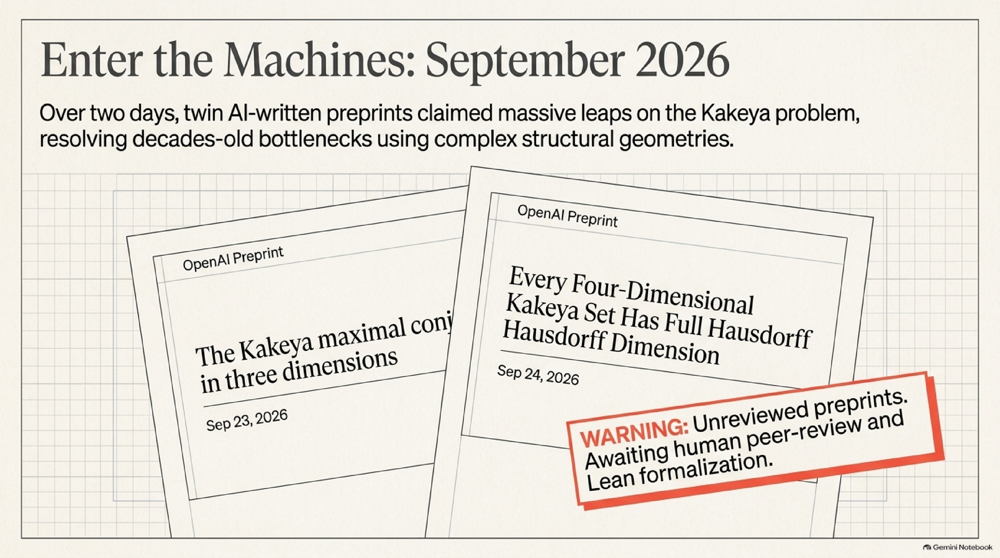

*AI-generated slide. The deck's later slides call both results "claimed", the accurate word for unreviewed preprints.*

> [!WARNING]
> **Verification status.** openai/math has **no Lean formalization** for this family. There is no `lean/docs/074.md`, and `lean/formalization.yaml` has no entry for either paper (checked 7 October 2026). The openai/math README warns that "some of the unformalized results could have issues." Both proofs are long (97 and 175 pages) and lean on recent work, much of it cited from arXiv: Guth–Wang–Zahl (January 2026), Wang–Zahl, Ren–Wang, Wang–Wu, Gao–Liu–Xi, and others. The four-dimensional paper also depends on the principal paper. It cites a weighted plank estimate as "Lemma 2.3" of the three-dimensional paper; in the released PDF the matching statement is **Lemma 3.3** (*Weighted set estimate in a line chart*), and the label 2.3 belongs to Definition 2.3 (the critical exponent). The "independent route" through family 077 is also an unreviewed AI-written preprint from the same release, so it is not an outside confirmation. As of October 2026 both results are preprints; the usual next step is independent review by experts. This explainer did not check the proofs.

> [!TIP]
> **Simplifications.** To stay readable, this explainer suppresses the weights and repeated indices of the indexed model, the slow-diagonal choice of tolerances, the smoothing width $\eta$ in the temporal cost, the regularization of profiles, and the exact definitions of charts, true systems and narrowness in the companion. Every precise statement is in the papers.

---

## 8. Glossary

| Term | Meaning |
|---|---|
| **Kakeya set** (Besicovitch set) | A set in $\mathbb{R}^n$ containing a unit line segment in every direction |
| **Needle problem** | Kakeya's question: the least area in which a unit needle can be turned around |
| **Lebesgue measure** | Length, area or volume, extended to complicated sets |
| **$`\delta`$-tube** | A cylinder of length 1 and radius $\delta$; volume $\pi\delta^2$ in $\mathbb{R}^3$ |
| **$`\delta`$-separated directions** | Unit vectors at mutual distance at least about $\delta$; there are at most about $\delta^{-(n-1)}$ of them |
| **Minkowski (box-counting) dimension** | The exponent $d$ in $N_\delta(K) \approx \delta^{-d}$, where $N_\delta$ counts grid cubes of side $\delta$ that meet $K$ |
| **Hausdorff dimension** | The dimension defined by covers with sets of varying sizes; for bounded sets, at most the Minkowski dimension |
| **Packing dimension** | Another notion of dimension, between Hausdorff dimension and the ambient dimension |
| **$`L^p`$ norm** | $\lVert f\rVert_{L^p} = (\int \lvert f\rvert^p)^{1/p}$ |
| **Kakeya maximal function** $K_\delta f(\omega)$ | The largest average of $\lvert f\rvert$ over a $\delta$-tube pointing in direction $\omega$ |
| **Kakeya maximal conjecture** | $\lVert K_\delta f\rVert_{L^n(S^{n-1})} \le C_\varepsilon\delta^{-\varepsilon}\lVert f\rVert_{L^n(\mathbb{R}^n)}$ for every $\varepsilon > 0$ |
| **Shading, density $`\lambda`$** | A marked part $Y(T)$ of a tube with $\lvert Y(T)\rvert \ge \lambda\lvert T\rvert$ |
| **Multiplicity** | How many marked tube pieces pass through a typical occupied cell |
| **Plank** | A thin slab around a moving centre, used to measure how lines cluster |
| **Convex clustering / Wolff axioms** | Bounds on how many tubes can lie inside a convex body; the hypothesis of the set estimates |
| **Stickiness, planiness, graininess** | Structures of nearly extremal tube families: nearby tubes stay grouped across scales; tubes through a point lie near a plane; the union splits into thin flat pieces |
| **Multilinear Kakeya** | A sharp bound for overlaps of tubes from several transverse families |
| **Furstenberg set estimate** | A bound for sets in the plane containing many points on many lines; used here for planar projections |
| **Entropy, mutual information** | Measures of information in a random quantity, and of the dependence between two |
| **Nikodym set / maximal function** | The "dual" problem: segments through points, rather than in directions |
| **Fourier transform** | The way of writing a function as a combination of waves $e^{2\pi i x\cdot\xi}$ of different frequencies $\xi$; "cutting it off to a ball" keeps only the frequencies in that ball |
| **Fourier extension (restriction)** | Building a function on $\mathbb{R}^n$ from data on a curved surface; the restriction conjecture bounds it in $L^p$ |
| **Wave packet** | A piece of the extension concentrated on a thin tube; the reason tubes appear in Fourier analysis |
| **Lean 4** | A proof assistant: software that mechanically checks every logical step of a proof |

---

## 9. Slides, audio and other assets

Everything below except the three hand-made figures was generated with **Google NotebookLM** (now "Gemini Notebook") from the two papers and the Wikipedia article on Kakeya sets. The report and the mind map used only the two papers. The outputs are kept exactly as NotebookLM produced them. They are AI-generated, so see the [errata](assets/README.md#errata) before relying on any detail.

| Asset | What it is |
|---|---|
| [Slide deck (PDF)](assets/notebooklm/slides.pdf) · [PPTX](assets/notebooklm/slides.pptx) | 15 beginner slides. Four slides (3, 12, 13 and 15) were regenerated once to fix errors; smaller issues remain on slides 1, 6, 12, 13, 14 and 15 (see the errata) |
| [Infographic: overview](assets/notebooklm/infographic-overview.png) | The one-page summary shown at the top |
| [Infographic: history timeline](assets/notebooklm/infographic-history-timeline.png) | From 1917 to September 2026, in sketch-note style |
| [Audio overview (≈1.8 min)](assets/notebooklm/audio-overview-brief.m4a) | A short podcast-style summary (not reviewed) |
| [Beginner report](assets/notebooklm/beginner-explainer-report.md) | NotebookLM's long-form written explainer. Its four-dimensional part is good; its account of the three-dimensional proof mixes in notions from the four-dimensional paper |
| [Mind map](assets/notebooklm/mindmaps.md) | Requested as "How the proof works", but NotebookLM built it around the four-dimensional companion only |
| [Cantor-set Besicovitch figure](assets/figures/besicovitch-cantor.svg) | Hand-made: levels 1, 2 and 4 of the construction in section 1.2, with areas computed by script |
| [Tubes and maximal function figure](assets/figures/tubes-and-maximal-function.svg) | Hand-made: the maximal function, a shaded tube and the bush example (section 1.5) |
| [Status figure](assets/figures/kakeya-landscape.svg) | Hand-made: the three versions of the conjecture in dimensions 2, 3, 4 and higher (section 1.6) |

<details>
<summary><b>All 15 slides</b> (click to expand)</summary>

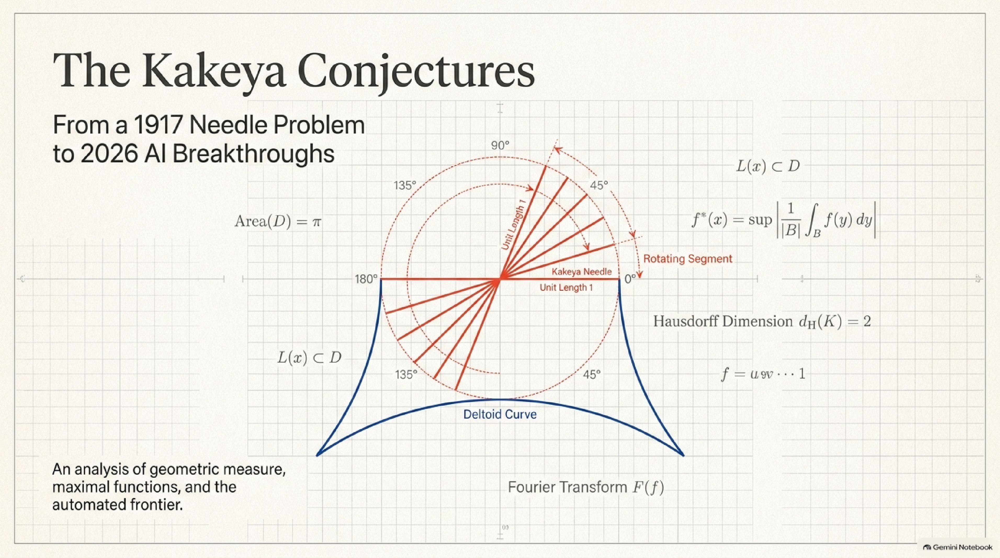


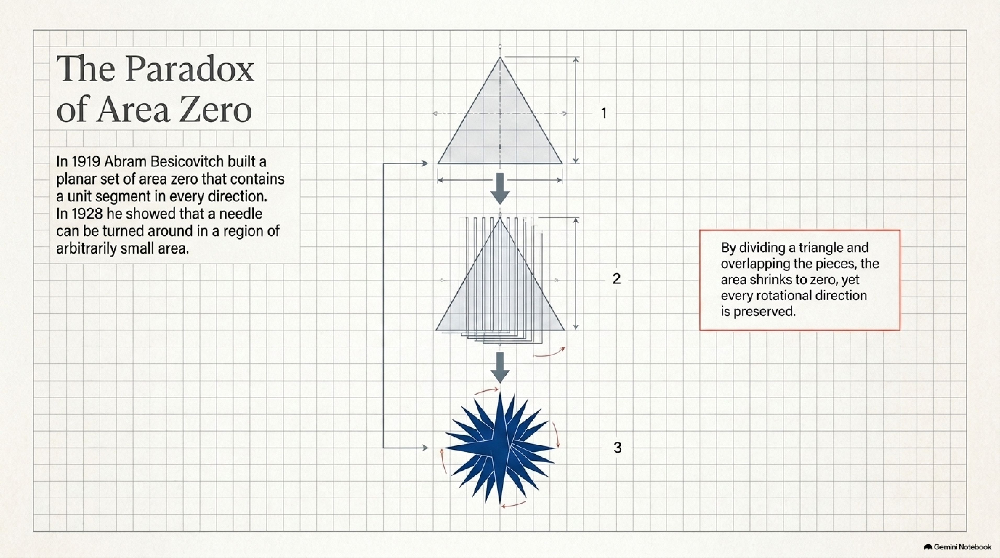

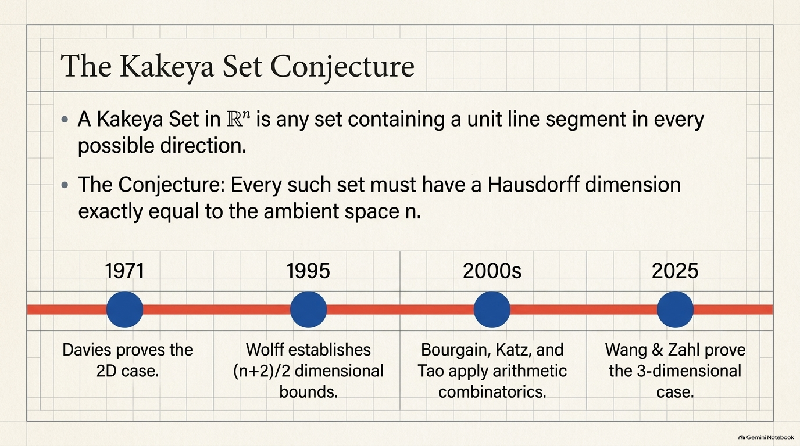

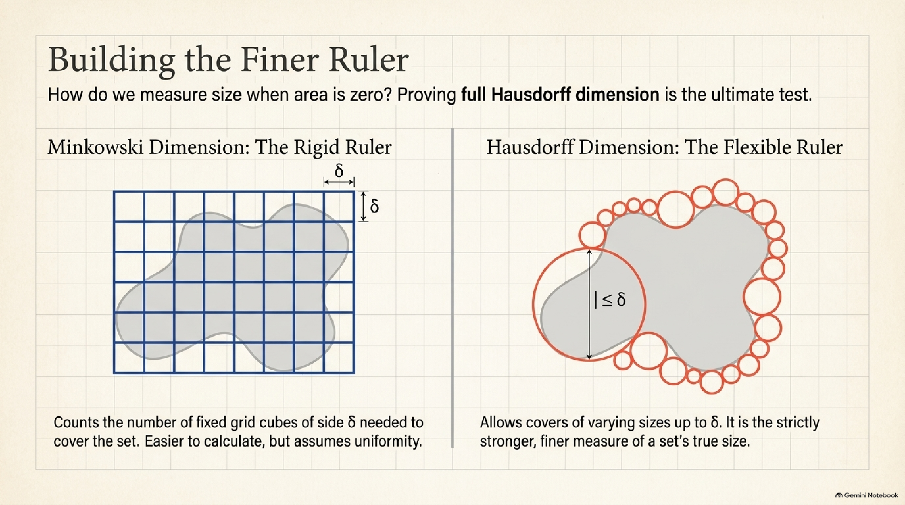

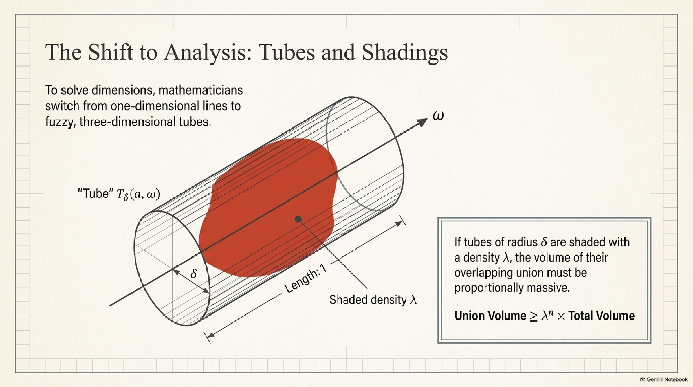


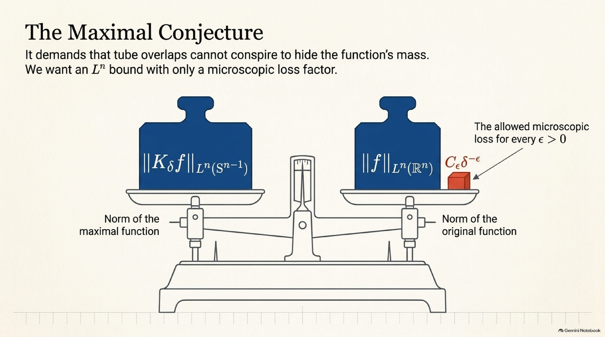

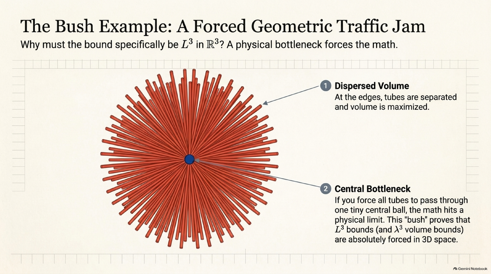


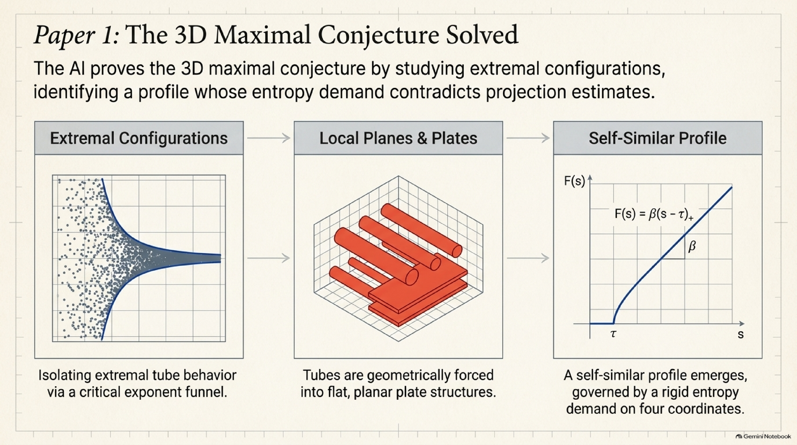

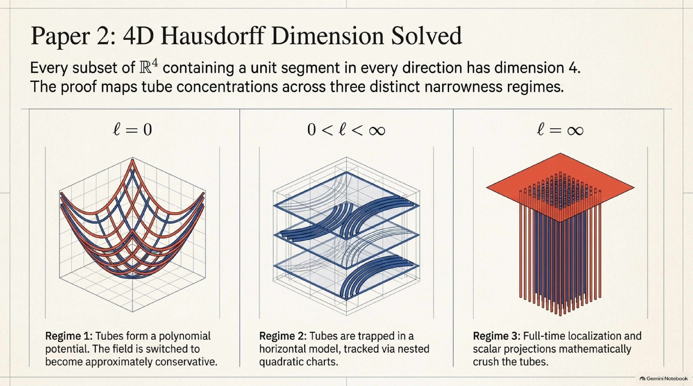

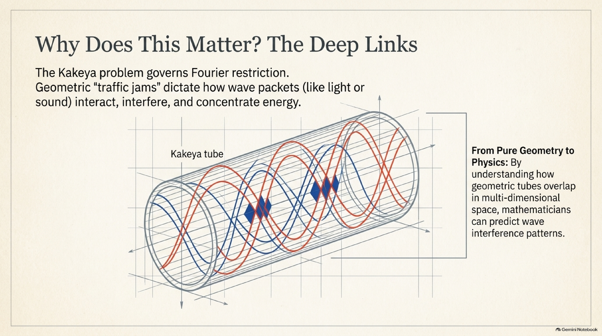

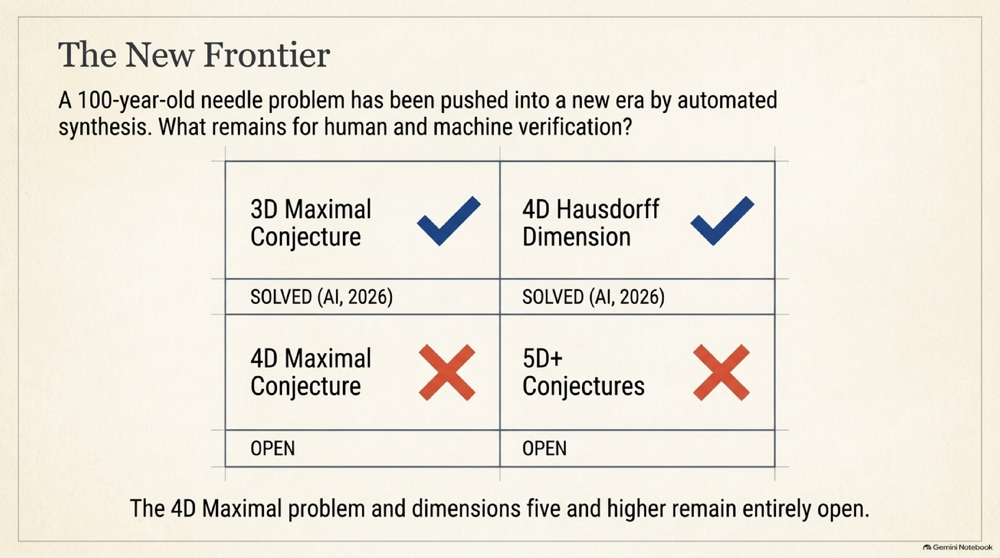

</details>

See [`assets/README.md`](assets/README.md) for the full inventory and the file-by-file [errata](assets/README.md#errata).

---

## How this explainer was made

1. The paper (with its TeX source), the four-dimensional companion (with its TeX source), the family entry in `CONTENTS.md`, `lean/formalization.yaml` and the openai/math README were downloaded from [openai/math](https://github.com/openai/math). There is no `lean/docs/074.md`. For context, the introductions of the two family-077 restriction papers and Joshua Zahl's survey (arXiv:2512.09397) were also read.
2. Both papers and the Wikipedia article on [Kakeya sets](https://en.wikipedia.org/wiki/Kakeya_set) were loaded into a NotebookLM notebook through the [`notebooklm-mcp-cli`](https://github.com/jacob-bd/gemini-notebook-mcp-cli) MCP/CLI. The notebook lives on a second NotebookLM account, separate from the one used for most other papers in this repository. That notebook generated the slides, infographics, report, mind map and audio in [`assets/notebooklm/`](assets/notebooklm/), from prompts written as plain statements of the papers' results. The first slide-deck request failed, and the deck shipped here is the second attempt. Every slide, both infographics and the report were then read against the papers. Four clearly wrong slides (3, 12, 13 and 15) were regenerated once with `nlm slides revise`, and a slide-by-slide diff confirmed that nothing else changed. The remaining issues are listed in the [errata](assets/README.md#errata).
3. The text on this page was written by hand (with AI assistance) directly from the papers' introductions, theorem statements, proof overviews and consequence sections, and then checked by an independent fact-checking pass. NotebookLM's outputs were used only as visual aids. The history table was checked against the papers' reference lists, Zahl's survey and Wikipedia. The Cantor-set areas and direction fan, the box counts for $\lbrace 1/n\rbrace$, the bush ratios and the shaded-bush constant were computed with small scripts. The three figures were drawn as SVG by script.

See [`PIPELINE.md`](../../PIPELINE.md) for the exact, repeatable steps.

*Citation for the underlying papers:*

```bibtex
@misc{OAI:The-Kakeya-maximal-conjecture-in-three-dimensions-September-23-2026,
  author = {{OpenAI}},
  title = {{The Kakeya maximal conjecture in three dimensions}},
  howpublished = {OpenAI Math Release preprint
                  \href{https://github.com/openai/math/blob/main/preprints/The-Kakeya-maximal-conjecture-in-three-dimensions-September-23-2026/paper.pdf}{OAI:The-Kakeya-maximal-conjecture-in-three-dimensions-September-23-2026}},
  year = {2026}
}

@misc{OAI:Every-four-dimensional-Kakeya-set-has-full-Hausdorff-dimension-September-24-2026,
  author = {{OpenAI}},
  title = {{Every Four-Dimensional Kakeya Set Has Full Hausdorff Dimension}},
  howpublished = {OpenAI Math Release preprint
                  \href{https://github.com/openai/math/blob/main/preprints/Every-four-dimensional-Kakeya-set-has-full-Hausdorff-dimension-September-24-2026/paper.pdf}{OAI:Every-four-dimensional-Kakeya-set-has-full-Hausdorff-dimension-September-24-2026}},
  year = {2026}
}
```
