# The Unique Games Theorem, explained for beginners

> - **Paper:** [*The Unique Games Theorem*](https://github.com/openai/math/blob/main/preprints/The-Unique-Games-Theorem-September-23-2026/paper.pdf), OpenAI, 23 September 2026 (58 pages)
> - **openai/math family:** 102, *The Unique Games Conjecture and optimal approximation thresholds* · **Field:** theoretical computer science (hardness of approximation)
> - **Companions (all 23 Sep 2026):** [A Direct Proof of Optimal Max-Cut Hardness](https://github.com/openai/math/blob/main/preprints/A-Direct-Proof-of-Optimal-Max-Cut-Hardness-September-23-2026/paper.pdf) · [The Factor-Two Hardness Threshold for Vertex Cover](https://github.com/openai/math/blob/main/preprints/The-Factor-Two-Hardness-Threshold-for-Vertex-Cover-September-23-2026/paper.pdf) · [Constant-factor hardness of Min-UnCut](https://github.com/openai/math/blob/main/preprints/Constant-factor-hardness-of-Min-UnCut-September-23-2026/paper.pdf) · [Constant-factor hardness of directed feedback vertex set](https://github.com/openai/math/blob/main/preprints/Constant-factor-hardness-of-directed-feedback-vertex-set-September-23-2026/paper.pdf)
> - **Reasoning summary:** [*Ordinary NP-hardness at the basic semidefinite threshold*](https://github.com/openai/math/blob/main/reasoning_traces/basic-semidefinite-threshold-np-hardness.pdf), an abridged summary of the model's reasoning released with openai/math (not a proof; see [section 7](#7-what-it-does-not-prove-and-caveats))
> - **Formal proof:** the main theorem, and the Max-Cut and Vertex Cover gap theorems of the companions, are listed as formalized in Lean 4 ([scope](https://github.com/openai/math/blob/main/lean/docs/102.md))
> - **Who this is for:** anyone who knows what a graph is and what a polynomial-time algorithm is. No PCPs, Fourier analysis or complexity theory beyond "P vs NP" needed.

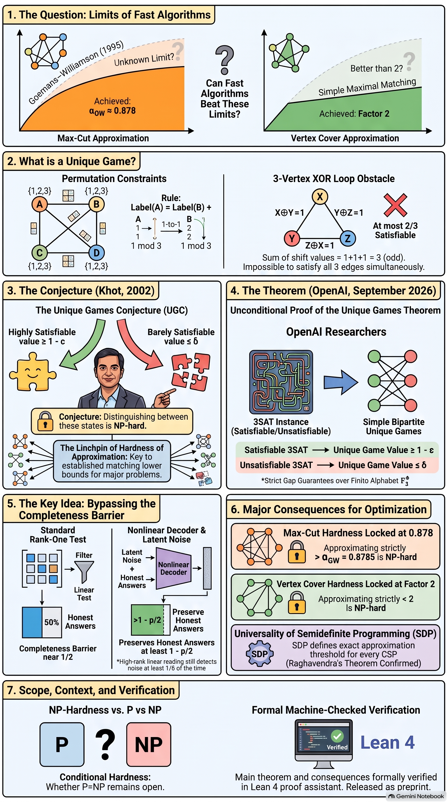

*AI-generated overview. Its known slips, such as "1/6" where the paper's detection bound is 1/8, are listed in the [errata](assets/README.md#errata).*

## Contents

- [TL;DR](#tldr)
- [How to read this](#how-to-read-this)
- [1. The problem](#1-the-problem)
- [2. A short history](#2-a-short-history)
- [3. What the paper proves](#3-what-the-paper-proves)
- [4. Why it matters](#4-why-it-matters)
- [5. The main idea of the proof](#5-the-main-idea-of-the-proof)
- [6. The people whose ideas this builds on](#6-the-people-whose-ideas-this-builds-on)
- [7. What it does not prove, and caveats](#7-what-it-does-not-prove-and-caveats)
- [8. Glossary](#8-glossary)
- [9. Slides, audio and other assets](#9-slides-audio-and-other-assets)
- [How this explainer was made](#how-this-explainer-was-made)

---

## TL;DR

- **The question.** Many graph optimization problems are NP-hard to solve exactly. Examples are splitting a network into two groups so that as many links as possible cross between them (**Max-Cut**), and choosing the fewest vertices that touch every edge (**Vertex Cover**). So we ask how *close* to the optimum a fast algorithm can be guaranteed to get. For decades the best known algorithms were suspected to be the best possible, but nobody could prove it from the standard assumption P ≠ NP.
- **The conjecture.** In 2002 Subhash Khot proposed the **Unique Games Conjecture (UGC)**. It says that a certain kind of labeling puzzle, in which every constraint is a one-to-one rule, is hard to solve even *approximately*. If the UGC is true, a long list of algorithms is exactly optimal. The list includes Goemans and Williamson's 0.878 for Max-Cut and the simple factor-2 algorithm for Vertex Cover.
- **What this paper proves.** The UGC is true. Fix any small errors ε and δ. The paper gives a fixed alphabet and a deterministic polynomial-time reduction from 3SAT to unique games. Satisfiable formulas become games where a $1-\varepsilon$ fraction of the constraints can be satisfied. Unsatisfiable formulas become games where no labeling satisfies more than a δ fraction.
- **Why that's a big deal.** Hardness results proved "assuming the UGC" in its standard form, by deterministic reductions, become plain NP-hardness results. Unless P = NP: Max-Cut can't be approximated better than 0.878; Vertex Cover can't be approximated within any factor below 2; for every constraint satisfaction problem, one standard semidefinite program gives the best possible ratio (Raghavendra's theorem); and several cut and clustering problems have no constant-factor approximation at all. Two companion papers prove the Max-Cut and Vertex Cover thresholds again by direct routes that avoid the UGC.
- **What it doesn't do.** It does **not** prove P ≠ NP. "NP-hard" means "no fast algorithm *unless* P = NP". It is an AI-generated preprint from September 2026 that has not been through peer review. openai/math lists its main statement as formalized in Lean.

## How to read this

| You have… | Read |
|---|---|
| 2 minutes | The TL;DR, the infographic above and the [before-and-after figure](#4-why-it-matters) |
| 15 minutes | Sections 1–4 and 7 |
| An hour, and you like probability and linear algebra over bits | Everything, including [section 5](#5-the-main-idea-of-the-proof) |

---

## 1. The problem

### 1.1 Easy problems, hard problems, and reductions

A problem is in **P** if some algorithm solves it in time polynomial in the input size. It is in **NP** if a proposed solution can be *checked* in polynomial time. The standard example is **3SAT**: given a formula made of clauses like $(x_1 \lor \lnot x_4 \lor x_7)$, is there a true/false assignment that satisfies every clause? Checking a proposed assignment is easy. Finding one seems to require search.

A **reduction** from problem A to problem B is a fast translation of inputs of A into inputs of B that preserves the yes/no answer. If B had a fast algorithm, A would too. A problem is **NP-hard** if every NP problem reduces to it. Cook and Levin (1971–1973) showed that SAT is NP-hard, and Karp (1972) added 21 classic problems, including Max-Cut and Vertex Cover. Whether P = NP is the most famous open question in computer science. Most researchers believe P ≠ NP, which would mean NP-hard problems have no polynomial-time algorithm.

### 1.2 Settling for "close enough": approximation algorithms

When exact answers are out of reach, we ask for a guarantee. The paper uses the standard conventions (Section 8). For a **maximization** problem, *ratio* $r$ means always returning a solution worth at least $r$ times the optimum. For a **minimization** problem, *factor* $c$ means returning a solution costing at most $c$ times the optimum.

Two running examples:

- **Vertex Cover** asks for the fewest vertices such that every edge has at least one chosen endpoint. A simple algorithm achieves factor 2: while some edge has neither endpoint chosen, choose *both* its endpoints. The edges picked this way share no endpoints, and any cover must contain at least one endpoint of each of them. So the optimum is at least the number of picked edges, and we chose exactly twice that many vertices.
- **Max-Cut** asks to split the vertices into two sides so that as many edges as possible cross. A coin flip for each vertex cuts every edge with probability $1/2$, so a random split already achieves ratio $1/2$ on average.

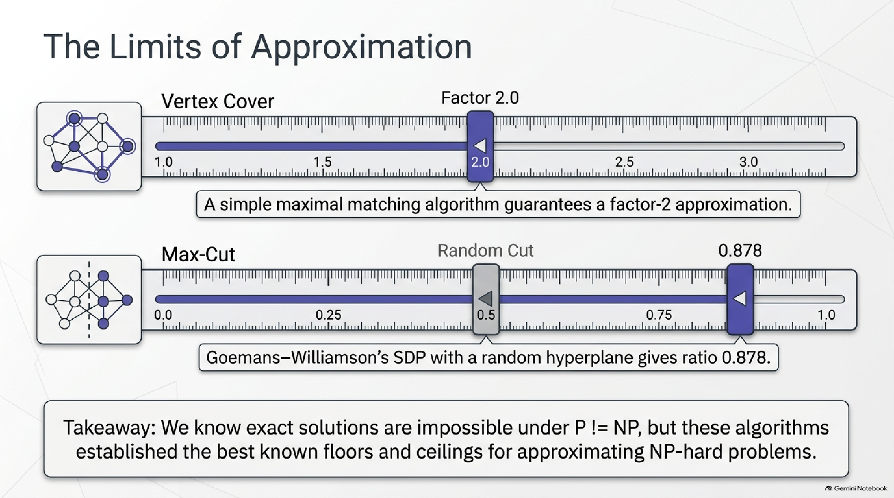

### 1.3 Max-Cut and the number 0.878

In 1994 Goemans and Williamson did much better with **semidefinite programming (SDP)**. Replace each vertex's side ($\pm1$) by a unit vector in a high-dimensional space, and maximize the sum over edges of $(1-\rho_{uv})/2$, where $\rho_{uv}$ is the inner product of the two endpoint vectors. This relaxation can be solved efficiently, and its value is at least the best cut. Then cut the vectors with a random hyperplane through the origin. An edge whose vectors have inner product $\rho$ earned $(1-\rho)/2$ in the SDP, and the hyperplane separates its endpoints with probability $\arccos(\rho)/\pi$. The worst case over $\rho$ is the **Goemans–Williamson constant** (as written in the Max-Cut companion):

$$\alpha_{\mathrm{GW}}=\min_{-1\le \rho<1}\frac{2\arccos\rho}{\pi(1-\rho)}=0.878567\ldots$$

<details>
<summary><b>Worked example: where 0.878 comes from, and how a hardness gap matches it</b></summary>

The minimum is attained near $\rho \approx -0.689$, an angle of about $133.6^\circ$ between the two vectors. There the SDP credits the edge with $(1+0.689)/2 \approx 0.845$, but the hyperplane cuts it only with probability $133.6/180 \approx 0.742$. With more digits the ratio is $0.74202/0.84458 \approx 0.87857$, which is $\alpha_{\mathrm{GW}}$.

The Max-Cut companion's gap theorem (its Theorem 1.2) is built to match this. For rational $t\in(0,1)$ and small $\varepsilon>0$ it is NP-hard to tell weighted graphs (edge weights summing to 1) whose best cut is at least $\frac{1+t}{2}-\varepsilon$ from those whose best cut is at most $\frac{1+B(t)}{2}+\varepsilon$, where $B(t)=\frac{2}{\pi}\arcsin t$. With $t=-\rho$, these two thresholds are exactly the SDP credit and the hyperplane probability above. At $t = 0.689$:

$$\text{YES} \approx \frac{1+0.689}{2} = 0.8445,\qquad \text{NO} \approx \frac{1+\frac{2}{\pi}\arcsin 0.689}{2} \approx 0.74195,\qquad \frac{0.74195}{0.8445}\approx 0.87857 .$$

For example, an algorithm with ratio 0.88 would find, on every YES graph, a cut worth at least $0.88\times(0.8445-\varepsilon)\approx 0.7432$. That is above the NO bound $0.74195+\varepsilon$ once $\varepsilon<0.0006$, so the algorithm would tell the two cases apart and therefore solve 3SAT. Any ratio above $\alpha_{\mathrm{GW}}$ is handled the same way, with $t$ closer to the worst case $-\rho\approx0.6892$ and a smaller $\varepsilon$.
</details>

Before 2026, the best NP-hardness result for Max-Cut was much weaker. Håstad's theorem, combined with gadgets of Trevisan, Sorkin, Sudan and Williamson, rules out ratios above $16/17 \approx 0.941$. Between 0.878 and 0.941, nobody knew. Khot, Kindler, Mossel and O'Donnell (KKMO, 2004) showed that **if the UGC holds**, 0.878 is optimal. Their proof needed the "Majority Is Stablest" theorem, which Mossel, O'Donnell and Oleszkiewicz proved in 2005.

### 1.4 Hardness of approximation: gap problems and the PCP theorem

How do you prove that approximating is hard? You show that a **gap problem** is NP-hard. You need a reduction from 3SAT that maps satisfiable formulas to instances of value at least $c$ (the "YES" case, or **completeness**) and unsatisfiable formulas to instances of value at most $s$ (the "NO" case, or **soundness**). If $s < r\cdot c$, an algorithm with ratio $r$ would separate the two cases and solve 3SAT.

Where do gaps come from? From the **PCP theorem** (1992; Arora–Safra and Arora–Lund–Motwani–Sudan–Szegedy, building on Feige–Goldwasser–Lovász–Safra–Szegedy). Proofs of NP statements can be written so that a verifier reading only a constant number of randomly chosen bits catches every false claim with constant probability. Equivalently, constraint problems with a constant gap are NP-hard. Håstad sharpened this for parity equations $x+y+z=b$ (mod 2). For every $\xi>0$ it is NP-hard to tell systems where a $1-\xi$ fraction of the equations can be satisfied from systems where at most $1/2+\xi$ can (Theorem 4.1 in the paper). That is the starting point of this paper.

### 1.5 Label Cover: the usual starting point

Most hardness proofs start from a **two-prover game**, also called **Label Cover**. A referee picks a random edge $(u,v)$ of a bipartite graph and sends $u$ to one prover and $v$ to the other. The provers can't talk to each other. Each answers with a label, and they win if the labels satisfy the edge's rule. The paper's basic example is the **equation-versus-variable game**. One prover receives a parity equation and answers with a satisfying assignment of its three variables. The other receives one of those variables and answers with a bit. They win if the bits agree (Section 4.1). The **value** of a game is the best winning probability.

Combining the PCP theorem with Raz's **parallel repetition** theorem (1995), which plays many rounds at once, makes it NP-hard to tell games of value 1 from games of value at most δ, for any fixed δ. The Vertex Cover companion starts from exactly this.

In Label Cover the rules are **projections**. Many labels on one side may map to the same label on the other (panel B below). For the simplest tests, which read *two* values and compare them like an edge of Max-Cut, you would like each label to determine the other completely.

### 1.6 Unique games and the conjecture

A **unique game** is exactly that (Section 1.1 of the paper). It has a finite set of vertices, a finite alphabet $K$ of labels, and a list of constraints $(u_e, v_e, \pi_e)$, where each $\pi_e$ is a *permutation* of $K$. A labeling $a$ satisfies constraint $e$ when $a(v_e) = \pi_e(a(u_e))$, and the **value** $\mathrm{val}(G)$ is the largest fraction of constraints one labeling can satisfy.

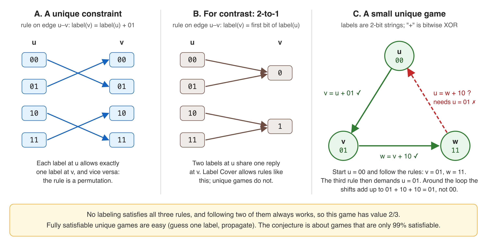

Panel C shows why the conjecture is about games that are *almost* satisfiable rather than fully satisfiable. If every constraint can be satisfied, a labeling is easy to find. In each connected piece of the graph, guess the label of one vertex (there are only $\lvert K\rvert$ choices). The rules then force every other label, and you check the result. Max-Cut itself is a unique game with alphabet $\lbrace 0,1\rbrace$ and the rule "labels differ" on every edge. Panel C is the 2-bit version of the familiar fact that a triangle's best cut contains only 2 of its 3 edges.

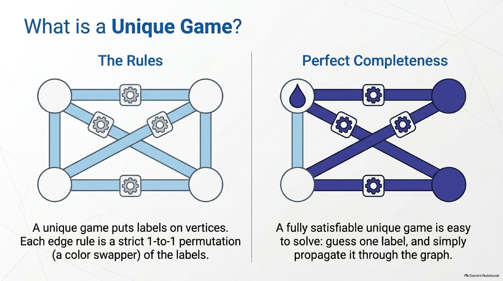

> **Unique Games Conjecture** (Khot, 2002, in the usual "edge-value" form the paper cites). For every $\varepsilon, \delta > 0$ there is a fixed alphabet size such that it is NP-hard to distinguish unique games of value at least $1-\varepsilon$ from unique games of value at most $\delta$.

The **order of the quantifiers** matters. The errors come first, and the alphabet may be as large as needed after that. The paper explains why known algorithms do not contradict this. Charikar, Makarychev and Makarychev (2006) turn a $q$-label game of value $1-\epsilon$ into a labeling of expected value $1-O(\sqrt{\epsilon\log q})$, which loses accuracy as the alphabet grows. Arora, Barak and Steurer (2010) find good labelings in *subexponential*, not polynomial, time.

Before this paper, the closest result was the **2-to-2 Games Theorem** of Khot, Minzer and Safra (2018), building on work with Dinur and Kindler and on Barak–Kothari–Steurer. As a by-product it gave a unique-games gap with completeness close to **one half**, not close to one. In the paper's words, "obtaining Unique Games completeness arbitrarily close to one was a separate problem."

---

## 2. A short history

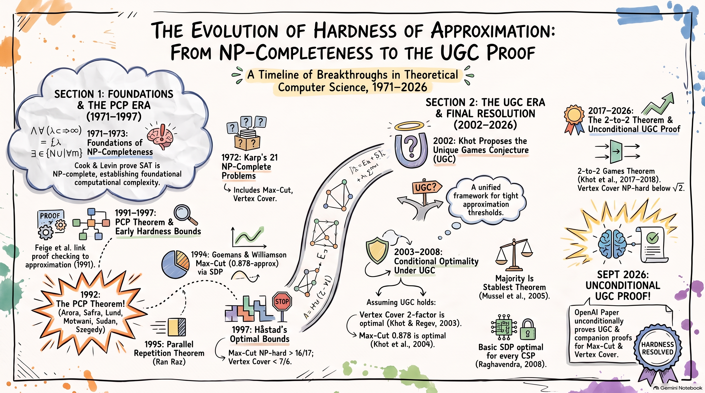

*AI-generated timeline. It misspells Mossel as "Mussel", omits Dinur–Safra (2002), and its formulas are decoration; see the [errata](assets/README.md#errata). The table below is the checked version.*

| When | Who | What happened |
|---|---|---|
| 1971–1973 | **Stephen Cook, Leonid Levin** | SAT is NP-complete |
| 1972 | **Richard Karp** | 21 NP-complete problems, including Max-Cut and Vertex Cover ("Node Cover") |
| 1991 | **Uriel Feige, Shafi Goldwasser, László Lovász, Shmuel Safra, Mario Szegedy** | Proof checking is linked to hardness of approximation |
| 1992 | **Sanjeev Arora, Shmuel Safra; Arora, Carsten Lund, Rajeev Motwani, Madhu Sudan, Szegedy** | The PCP theorem: constant-query proof checking, hence constant approximation gaps |
| 1994 | **Michel Goemans, David Williamson** | SDP with random-hyperplane rounding: ratio 0.878 for Max-Cut |
| 1995 | **Ran Raz** | Parallel repetition: playing a two-prover game many times in parallel drives the cheaters' success down exponentially |
| 1995 | **Mihir Bellare, Oded Goldreich, Madhu Sudan** | The long code and "folding" |
| 1997 | **Johan Håstad** | Optimal hardness for parity equations ($1-\xi$ vs $1/2+\xi$). Max-Cut is hard beyond 16/17 (with gadgets of Trevisan–Sorkin–Sudan–Williamson), and Vertex Cover is hard below 7/6 |
| 2002 | **Subhash Khot** | Introduces the Unique Games Conjecture |
| 2002 | **Irit Dinur, Shmuel Safra** | Vertex Cover is hard below $10\sqrt5-21\approx1.3607$ |
| 2003 | **Subhash Khot, Oded Regev** | If the UGC holds, Vertex Cover is hard below factor 2 |
| 2004 | **Khot, Guy Kindler, Elchanan Mossel, Ryan O'Donnell** | If the UGC holds (and Majority Is Stablest), 0.878 is optimal for Max-Cut |
| 2005 | **Mossel, O'Donnell, Krzysztof Oleszkiewicz** | Majority Is Stablest proved |
| 2005 | **Khot, Nisheeth Vishnoi** | Unique games whose SDP value is near 1 but whose true value is near 0, even with triangle inequalities (an integrality gap) |
| 2005–2010 | **Luca Trevisan; Charikar–Makarychev–Makarychev; Arora–Boaz Barak–David Steurer** | Algorithms for unique games, the last in subexponential time; none contradicts the UGC |
| 2008 | **Prasad Raghavendra** | Under the UGC, a basic SDP gives the optimal ratio for *every* constraint satisfaction problem |
| 2017–2018 | **Khot, Dor Minzer, Muli Safra; Dinur, Khot, Kindler, Minzer, Safra; Barak, Pravesh Kothari, Steurer** | The 2-to-2 Games Theorem via expansion in Grassmann graphs. Unique games are hard with completeness near 1/2, and Vertex Cover is hard below $\sqrt2$ |
| Sept 2026 | **OpenAI** (internal model) | This family: the UGC is proved, and Max-Cut and Vertex Cover get separate direct proofs |

---

## 3. What the paper proves

> **Theorem 1.1 (Unique Games Theorem).** For every fixed $\varepsilon,\delta\in(0,1/2)$, there are an integer $s\ge1$ and a deterministic polynomial-time reduction from 3SAT to explicit unweighted Unique Games instances $G_\varphi$ over $K=\mathbb{F}_2^s$ such that
>
> - if $\varphi$ is satisfiable, then $\mathrm{val}(G_\varphi)\ge1-\varepsilon$;
> - if $\varphi$ is unsatisfiable, then $\mathrm{val}(G_\varphi)\le\delta$.
>
> The graph is simple and bipartite, and every constraint is a translation $a(v_e)=a(u_e)+c_e$ of $K$. The alphabet, the degree of the running-time polynomial, and its constants depend only on $\varepsilon,\delta$.

In plain words: pick how nearly satisfiable the good case should be and how hopeless the bad case should be, say 99% and 1%. The paper then fixes, once and for all, an alphabet of bit-strings of some length $s$. It also gives a procedure that turns any 3SAT formula into a unique game over that alphabet in polynomial time. If the formula is satisfiable, some labeling satisfies 99% of the constraints. If not, every labeling satisfies at most 1%. A polynomial-time algorithm that told 99%-games from 1%-games would therefore solve 3SAT, so the UGC holds.

Some details make the result especially clean:

- **Translations.** Every rule has the form "label of $v$ = label of $u$ XOR a fixed bit-string $c_e$", as in panel C of the figure above. The paper notes that this binary translation form is a known equivalent formulation of the conjecture (Khot–Kindler–Mossel–O'Donnell), and the reduction produces it directly.
- **Unweighted, simple and bipartite.** The output is a plain list of edges between two sides, with at most one edge per pair of vertices and no hidden weights.
- **Errors first.** The two errors are fixed independently, *before* the alphabet is chosen, as the conjecture requires.

The Lean 4 statement in openai/math's [Comparator challenge file](https://github.com/openai/math/blob/main/lean/ComparatorChallenges/UniqueGamesTheorem.lean) reads:

```lean
theorem theorem11 (ε δ : ℝ)
    (hε : 0 < ε) (hεhalf : ε < 1 / 2)
    (hδ : 0 < δ) (hδhalf : δ < 1 / 2) :
    Nonempty (Explicit.MachineOutputContract.BinaryGapReduction ε δ)
```

Here `BinaryGapReduction ε δ` bundles everything in the theorem. It contains an alphabet of size at least 2 identified with bit-vectors of a fixed dimension, and a map from encoded 3SAT formulas to games that is simple bipartite and uses only translations. It requires this map to be computable in polynomial time by a Turing machine (Mathlib's `Turing.TM2ComputableInPolyTime`). Finally it states the completeness bound $1-\varepsilon$ for satisfiable inputs and the soundness bound $\delta$ for unsatisfiable ones.

---

## 4. Why it matters

The paper's Section 8 states the payoff directly: Theorem 1.1 "turns established conditional hardness results into NP-hardness results". The reductions and thresholds below are due to their original authors. The paper adds the arguments needed to fit the exact problem formulations.

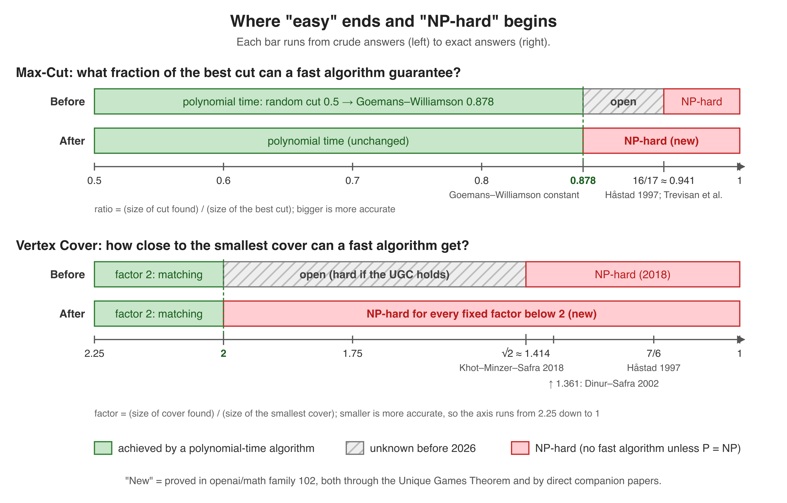

| Problem | What a polynomial-time algorithm achieves | What was NP-hard before | What this family proves NP-hard |
|---|---|---|---|
| **Max-Cut** | Ratio $\alpha_{\mathrm{GW}}\approx0.87856$ (Goemans–Williamson) | Ratio above $16/17\approx0.941$ | **Every ratio above $\alpha_{\mathrm{GW}}$**, via Khot–Kindler–Mossel–O'Donnell. The Max-Cut companion proves it directly, on simple unweighted graphs |
| **Vertex Cover** | Factor 2 (take both endpoints of a maximal matching) | Factor below $\sqrt2$ (2018) | **Every factor below 2**, via Khot–Regev. The Vertex Cover companion proves it directly |
| **Every finite Max-CSP** (constraint satisfaction with a fixed finite domain and predicates) | Raghavendra (2008): the best ratio is set, up to arbitrarily small error, by a basic SDP relaxation | Matching hardness only under the UGC | **Corollary 8.1:** any instance $J$ whose true optimum $A$ is below its SDP value $B$ yields NP-hardness of telling "optimum $\ge B-\eta$" from "optimum $\le A+\eta$" |
| **Ordering CSPs**, such as Maximum Acyclic Subgraph and Betweenness | A uniformly random ordering: $\lvert\Pi\rvert/k!$, which is $1/2$ and $1/3$ respectively | This threshold only under the UGC | **Corollary 8.2:** no fixed ratio above the random-ordering value (Guruswami–Håstad–Manokaran–Raghavendra–Charikar) |
| **Multicut, non-uniform Sparsest Cut, Min-2CNF≡ Deletion, Correlation Clustering** | | Ruling out every constant factor: only under the UGC | **Corollary 8.3:** no fixed constant factor at all (Chawla–Krauthgamer–Kumar–Rabani–Sivakumar; Demaine–Emanuel–Fiat–Immorlica). For Sparsest Cut this concerns the search version, under Cook reductions |
| **Identity-target kernel clustering** with $k\ge3$ clusters | The "propeller" rounding factor $\alpha_k=\frac{8\pi}{9}\left(1-\frac1k\right)$ | | **Every loss factor below $\alpha_k$**, in the Gaussian propeller companion (openai/math family 096), which uses Theorem 1.1 |
| **Min-UnCut**, **directed feedback vertex set** | | | **No fixed constant factor**, by independent direct reductions in companion papers of this family, which use established PCP and Label Cover hardness |

All of these say "NP-hard". They rule out deterministic polynomial-time algorithms at these thresholds **if P ≠ NP**, which is how the paper phrases the consequence.

### Two roads to the same thresholds

The family proves Max-Cut and Vertex Cover twice. The road through Theorem 1.1 uses the classical conditional reductions. The companion papers take separate, direct roads. The Max-Cut companion says "the Unique Games Conjecture enters only as historical context".

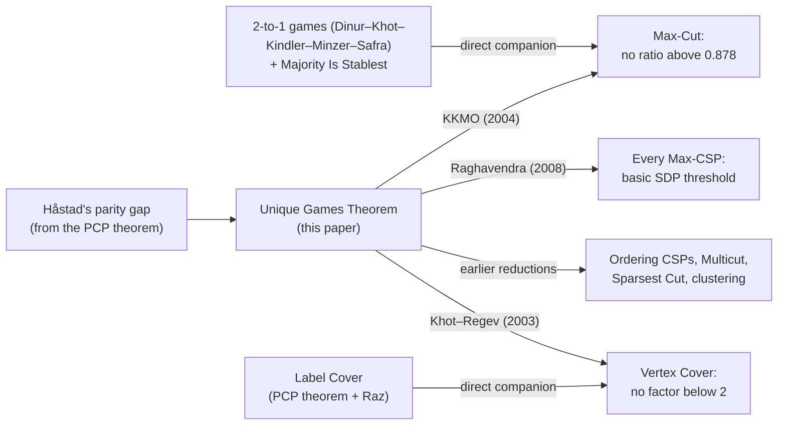
```mermaid
flowchart LR
    TT["2-to-1 games (Dinur–Khot–Kindler–Minzer–Safra)<br/>+ Majority Is Stablest"] -->|"direct companion"| MC["Max-Cut:<br/>no ratio above 0.878"]
    H["Håstad's parity gap<br/>(from the PCP theorem)"] --> UG["Unique Games Theorem<br/>(this paper)"]
    UG -->|"KKMO (2004)"| MC
    UG -->|"Raghavendra (2008)"| CSP["Every Max-CSP:<br/>basic SDP threshold"]
    UG -->|"earlier reductions"| OTHER["Ordering CSPs, Multicut,<br/>Sparsest Cut, clustering"]
    UG -->|"Khot–Regev (2003)"| VC["Vertex Cover:<br/>no factor below 2"]
    LC["Label Cover<br/>(PCP theorem + Raz)"] -->|"direct companion"| VC
```

- **[Max-Cut companion](https://github.com/openai/math/blob/main/preprints/A-Direct-Proof-of-Optimal-Max-Cut-Hardness-September-23-2026/paper.pdf)** (38 pages). It starts from the published 2-to-1 games construction with imperfect completeness, in a precise affine form. Labels are encoded by a tree-shaped code whose gates are random tables. Majority Is Stablest locates an influential entry of a cut that does too well. A new "vector-valued affine hashing lemma" and a "hidden coordinate" trick then turn that entry into consistent labels, with losses that don't depend on the alphabet size.
- **[Vertex Cover companion](https://github.com/openai/math/blob/main/preprints/The-Factor-Two-Hardness-Threshold-for-Vertex-Cover-September-23-2026/paper.pdf)** (25 pages). It starts from ordinary Label Cover and builds graphs where, for each integer $m\ge4$, satisfiable formulas give a cover smaller than $\left(\frac12+\frac1m\right)$ of the vertices, and unsatisfiable formulas force a cover larger than $\left(1-\frac1m\right)$ of them. The ratio of the two is $2-\frac{6}{m+2}$. For example, $m=100$ gives "below 51%" versus "above 99%", a ratio of about 1.94. The analysis extracts short lists of candidate labels from derivatives of a Lipschitz function. It also uses a variance-preserving restriction step adapted from the Efron–Stein decomposition.

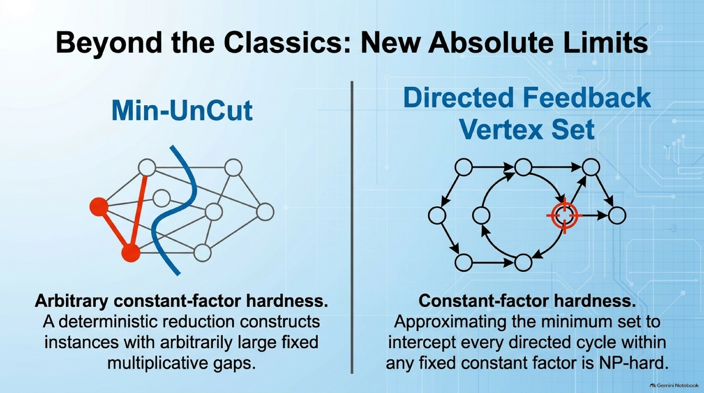

---

## 5. The main idea of the proof

The paper is 58 pages of combinatorics, Fourier analysis over bits, and careful probability. Here it is at three zoom levels.

### Level 1: the one-paragraph version

Think of the reduction as a **spot-check exam**. A labeling has written down one answer for each of a huge number of "tables". The examiner picks a random table, nudges it slightly, and checks that the two answers agree. That one comparison is one unique-game constraint. Two things must hold. An honest examinee, who knows a nearly satisfying assignment, must pass about 99% of the checks. And when the formula is unsatisfiable, *every* examinee must fail most of them. The existing 2-to-2 machinery can't simply be made unique. Its test accepts one of *two* replies, and if it demands equal answers instead, its nudge moves even honest answers half the time. This paper's new ingredient works like a car's suspension. The nudge ("latent noise") is a bump in the road, and honest answers are read through a nonlinear decoder that absorbs almost every bump. A sensor bolted to the frame, which is any sufficiently complicated *linear* way of reading the table, still registers the bump at least one time in eight. So an examinee who passes 99% of checks must be mostly "simple" (most of its Fourier weight is low rank). Simple examinees are the kind the Khot–Minzer–Safra theory can decode, here into strategies that would win a related two-prover game far too often. For an unsatisfiable formula that is impossible.

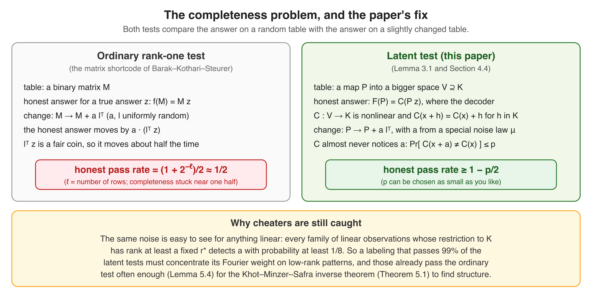

### Level 2: the step-by-step picture

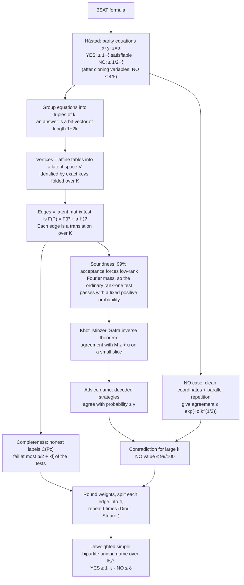
```mermaid
flowchart TD
    A["3SAT formula"] --> B["Håstad: parity equations x+y+z=b<br/>YES: ≥ 1−ξ satisfiable · NO: ≤ 1/2+ξ<br/>(after cloning variables: NO ≤ 4/5)"]
    B --> C["Group equations into tuples of k;<br/>an answer is a bit-vector of length 1+2k"]
    C --> D["Vertices = affine tables into a latent space V,<br/>identified by exact keys, folded over K"]
    D --> E["Edges = latent matrix test:<br/>is F(P) = F(P + a·lᵀ)?<br/>Each edge is a translation over K"]
    E --> F["Completeness: honest labels C(Pz)<br/>fail at most p/2 + kξ of the tests"]
    E --> G["Soundness: 99% acceptance forces low-rank<br/>Fourier mass, so the ordinary rank-one test<br/>passes with a fixed positive probability"]
    G --> H["Khot–Minzer–Safra inverse theorem:<br/>agreement with M z + u on a small slice"]
    H --> I["Advice game: decoded strategies<br/>agree with probability ≥ γ"]
    B --> J["NO case: clean coordinates + parallel repetition<br/>give agreement ≤ exp(−c·k^(1/3))"]
    I --> K["Contradiction for large k:<br/>NO value ≤ 99/100"]
    J --> K
    K --> L["Round weights, split each edge into 4,<br/>repeat t times (Dinur–Steurer)"]
    F --> L
    L --> M["Unweighted simple bipartite unique game over 𝔽₂ˢ:<br/>YES ≥ 1−ε · NO ≤ δ"]
```

**Step 1: Start from parity equations (Section 4.1).** Håstad's theorem turns a 3SAT formula into a weighted list of equations $x+y+z=b$ over bits. In the YES case a $1-\xi$ fraction can be satisfied; in the NO case at most $1/2+\xi$. A cloning trick (100 copies of each variable) makes the three variables of every equation distinct while keeping the NO case at most $4/5$. In the equation-versus-variable game from [section 1.5](#15-label-cover-the-usual-starting-point), the NO case then has value at most $14/15$.

**Step 2: Tuples and answers as bit-vectors (Section 4.2).** A question $U$ is a tuple of $k$ random equations. An answer is a vector in $\mathbb{F}_2^{1+2k}$: one fixed "homogeneous" coordinate equal to 1, plus the first two bits of each equation (the third bit is forced). A second, *sparser* question $O$ replaces each equation, independently with small probability $\beta$, by just one of its variables. The test itself never samples $O$; it is used only in the soundness analysis (Steps 8 and 9).

**Step 3: Tables, keys and folding (Section 4.3).** A *table* on a question is an affine map $P$ from its answer space into a fixed binary space $\mathcal V$ that contains the label space $K=\mathbb{F}_2^{\ell}$. Tables are recorded by an exact **key**: only the coordinates the table really depends on, plus the induced map. As a result, a table on the sparse question $O$ and its pullback to $U$ are *literally the same vertex*. This adapts the "virtual tables" of Khot and Safra, and it means no separate consistency test is needed. Tables that differ by a constant shift in $K$ are merged ("folding", after Bellare–Goldreich–Sudan). A labeling assigns each merged vertex an element of $K$.

**Step 4: The test (Section 4.4).** Sample a tuple $U$, a uniform table $P$, a vector $a$ from a special **latent noise** law $\mu$, and a uniform bit-vector $l$. Then check whether the answer on $P$ equals the answer on $P + a\ l^{\top}$. Because of folding, each such check is a constraint $\lambda(v_1)=\lambda(v_0)+c$ between two vertices: a translation, so the whole test is a unique game over $K$.

**Step 5: Completeness (Lemma 4.3).** Take a near-satisfying parity assignment, and on each tuple let $z_U$ be its answer vector. Label each table by $C(Pz_U)$, where $C:\mathcal V\to K$ is the **latent decoder** from Lemma 3.1. The test compares $C(Pz_U)$ with $C(Pz_U + a(l^{\top}z_U))$. It can only fail when the fair coin $l^{\top}z_U$ is 1 and $C$ notices $a$, so it fails with probability at most $p_{\ast}/2$, plus $k\xi$ for tuples containing an unsatisfied equation. The value is at least $1-k\xi-p_{\ast}/2$.

**Step 6: Soundness, part 1. High acceptance forces low rank (Lemma 5.4).** The latent noise is invisible to $C$ but visible to linear observations. By Lemma 3.1, every family of linear functionals whose restriction to $K$ has rank at least $r_{\ast}$ detects $a$ with probability at least $1/8$. A labeling passing 99% of the tests must therefore have at least $0.9$ of its Fourier weight on low-rank frequencies. Those frequencies also pass the **ordinary** rank-one test, where $a$ is uniform in $K$, with probability at least $0.9\cdot2^{-r_{\ast}}$ on average.

**Step 7: Soundness, part 2. The inverse shortcode theorem (Theorem 5.1).** This step uses the deepest outside theorem. Khot, Minzer and Safra proved that sets in the Grassmann graph that keep their neighbours ("non-expanding" sets) must concentrate on a small structured piece. Barak, Kothari and Steurer's matrix picture makes this concrete. A function on binary matrices that passes the rank-one test with probability $\eta$ must agree with an affine evaluation $Mz+u$ on a fixed fraction $\alpha$ of a "slice". A slice is cut out by at most $r_{\mathrm s}$ row equations and $r_{\mathrm s}$ column equations, and $\alpha$ and $r_{\mathrm s}$ depend only on $\eta$.

**Step 8: Soundness, part 3. Decoding with advice (Proposition 5.3).** Two provers get the questions $U$ and $O$. Both also see matching random linear "hints" about a table sampled on $O$: a random map $A$ to $\mathbb{F}_2^{r_{\mathrm s}}$, the table's component $T$ outside $K$, and the rows $AM$ (the $U$-prover sees them pulled back to $U$). An "erasure" argument shows that useful hints occur with probability bounded below. Given a useful hint, the $U$-prover samples from a short list of valid answers, and the $O$-prover samples a Fourier frequency of its own table function, with probability equal to its squared weight. They agree with probability at least a constant $\gamma>0$ that does *not* depend on $k$.

**Step 9: Soundness, part 4. The NO case kills agreement (Lemma 6.2).** Call a position "clean" if it was replaced by a single variable *and* the hint has zero coefficient on that variable's bit. On clean positions, the two provers are just playing many independent copies of the equation-versus-variable game, whose NO value is at most $14/15$. Dinur–Steurer parallel repetition then shows that *any* pair of strategies agrees with probability at most $\exp(-c\ k^{1/3})$. The choice $\beta = k^{-2/3}$ does two jobs. It makes $k\beta^2\to0$, so a table sampled on $O$ and pulled back to $U$ looks almost like a uniformly random table on $U$ (Lemma 5.6), and it makes $k\beta\to\infty$, so there are many clean positions. For large $k$ this contradicts Step 8. So on NO instances the test game has value at most $99/100$, while on YES instances it is at least $1-k\xi-p_{\ast}/2$ (Proposition 6.3).

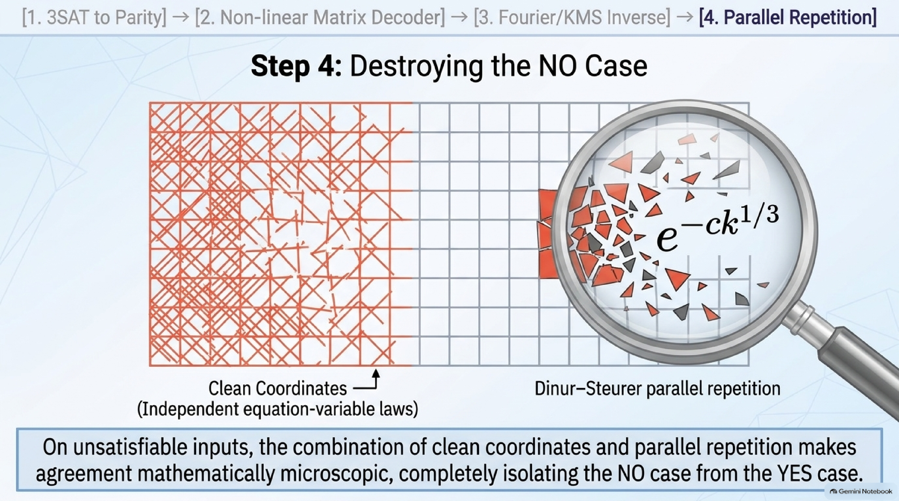

**Step 10: Cleaning up (Section 7).** Round the weights to integer multiplicities. Then replace each constraint by a path of four edges with three fresh middle vertices: three identity rules and the original translation. This gives a simple bipartite unweighted game, and its value becomes exactly $1-(1-\text{value})/4$, where "value" is that of the rounded game. Allowing for the rounding error, the NO case is now at most $1-1/800$. Finally, repeat the game $t$ times in parallel. The Dinur–Steurer bound for projection games does not depend on the alphabet, so a fixed number of rounds pushes the NO value below δ; the paper's sufficient choice is $t \ge 10{,}240{,}000\cdot\log(1/\delta)$. Choosing $p_{\ast}$, the rounding error, and $\xi$ small enough keeps the YES value at least $1-\varepsilon$. The final alphabet is $K^t=\mathbb{F}_2^{\ell t}$.

<details>
<summary><b>Worked example: the "one-half" barrier, and how the latent decoder escapes it</b> (a three-line calculation)</summary>

Take the ordinary matrix shortcode test (Section 1.4 of the paper). A table is a binary $\ell\times m$ matrix $M$, the honest answer for a fixed nonzero $z$ is $f_z(M)=Mz$, and the test compares $f_z(M)$ with $f_z(M+a\ l^{\top})$ for uniform random $a\in\mathbb{F}_2^{\ell}$, $l\in\mathbb{F}_2^m$. Since

$$f_z(M+a\ l^{\top})-f_z(M)=a\ (l^{\top}z),$$

the answer stays the same exactly when $l^{\top}z=0$ (a fair coin) or $a=0$:

$$\Pr[\text{honest pass}] = \frac12 + \frac12\cdot 2^{-\ell} = \frac{1+2^{-\ell}}{2}\approx\frac12 .$$

That is the completeness-one-half obstacle. In the latent test the honest answer is $C(Pz)$, and the change is $C(Pz)$ versus $C(Pz+a\ (l^{\top}z))$. When $l^{\top}z=0$ nothing changes. When $l^{\top}z=1$ the decoder sees $C(x)$ versus $C(x+a)$ for a uniform $x$, which differ with probability at most $p_{\ast}$. So

$$\Pr[\text{honest fail}]\le\frac{p_{\ast}}{2},$$

and $p_{\ast}$ can be chosen as small as you like. Only ε, δ and the repetition count are fixed before it; the gadget and the alphabet come after.

**How small can a decoder's change probability get?** The decoder is built from a "quadratic block" over the field $F=\mathbb{F}_{2^d}$ with $q=2^d$ elements: $C_{\mathrm{blk}}(x,y)=y+Q(x)$ with $Q(x_1,x_2,x_3)=(x_2x_3,\ x_1x_3,\ x_1x_2)$. A random nonzero update from one of its special update spaces changes the output with probability exactly $1-\theta$, where $\theta=1/(q^2+q+1)$ (Lemma 3.3). Stacking $t$ levels of blocks, with the noise entering at one random leaf, gives change probability $(1-q^{-3})(1-\theta)^t$ (Lemma 3.7). For illustration only (the paper takes $d$ large), $d=2$ gives $q=4$ and $\theta=1/21$. A hundred levels then give $(63/64)(20/21)^{100}\approx0.0075$.
</details>

### Level 3: the analytic engine, for readers who know Fourier analysis over $\mathbb{F}_2$

**The spectral comparison (Lemma 5.4).** For a fixed tuple $U$ and an output character $\sigma\in K^{\ast}$, write $f_{U,\sigma}(P)=(-1)^{\sigma(F_U(P))}$. A frequency on tables is a tuple $g=(g_i)$ of functionals in $\mathcal V^{\ast}$, one per column. Adding $a\ l^{\top}$ and averaging over the uniform selector $l$ multiplies the character of $g$ by an eigenvalue:

```math
\Lambda_g=\Pr_{a\sim\mu}\bigl[g_i(a)=0\text{ for every }i\bigr],\qquad
\Pr[\text{test accepts}]=\mathbb{E}_{U,\sigma}\sum_g \bigl|\widehat f_{U,\sigma}(g)\bigr|^2\Lambda_g .
```

Latent detection says $\Lambda_g\le 7/8$ whenever $`\dim\operatorname{span}\{g_i|_K\}\ge r_{\ast}`$. If $B$ is the average Fourier mass on such high-rank frequencies, acceptance $0.99$ forces $0.99\le 1-B/8$, so $B\le0.08$. For noise uniform in $K$ the eigenvalue is $`2^{-\dim\operatorname{span}\{g_i|_K\}}`$, so the remaining mass yields ordinary-test acceptance at least $0.9\cdot 2^{-r_{\ast}}$. That is the input to the inverse theorem.

**The latent gadget (Lemma 3.1, Section 3).** The goal is a space $\mathcal V\supseteq K$, a map $C$ with $C(x+h)=C(x)+h$ for $h\in K$, and noise $\mu$ such that $C$ changes with probability at most $p_{\ast}$, while every linear family of $K$-rank at least $r_{\ast}$ detects the noise with probability at least $1/8$. The threshold $r_{\ast}$ is fixed before $\ell$. The construction has three layers:

1. *A quadratic block.* Take $X=B=F^3$ and $C_{\mathrm{blk}}(x,y)=y+Q(x)$. For each of the $q^2+q+1$ lines $A=Fv$ in $F^3$ there is an update space $U_A$ on which the quadratic part of an update cancels. A uniform nonzero update in $U_A$ then changes the output with probability $1-\theta$.
2. *Recursion along a random path.* A parent block adds up the embedded outputs of one child for every pair $(A,J)$, where $J:B\to U_A$ is a binary isomorphism. Noise perturbs one uniformly chosen child. The nonlinear change probability decays like $(1-\theta)^t$. For linear observers, the paper tracks a **harmonic potential** $H_r=\sum_{j\le r}1/j$ of the surviving rank $r$. For "generic" families of characters, no field line contains two of the characters, so the rank drops by at most one per level. At most $3r$ characters satisfy a certain alignment equation, so a drop happens with probability at most $3r\theta$. The expected potential drop per level is therefore $O(\theta)$. With depth $s=\lfloor H_{r_0}/(8\theta)\rfloor$, the honest decoder's change probability is at most $e^{\theta-H_{r_0}/8}$. Meanwhile a full-rank linear family survives to a leaf with probability at least $1/2$ and then detects the noise with probability at least $1/2$ (Proposition 3.9). Random isomorphisms $J$ make non-generic families rare, even though later choices may depend on earlier ones.
3. *Enlargement.* Copies of this fixed-size gadget, indexed by all injections $B\to K$, are combined. A family of rank at least $r_{\ast}=b+2$ on $K$ restricts onto all of $B^{\ast}$ on at least 3/4 of the copies. This gives detection probability at least $\frac34\cdot\frac14\ge\frac18$ for every large $\ell$.

**The order of the constants (Section 7.2).** The proof works only because every constant is fixed in the right order. First come ε and δ. Then the repetition count $t$, then $p_{\ast}$ and the rounding error. Next the latent threshold $r_{\ast}$, then the shortcode constants $\eta=2^{-r_{\ast}}/16$, $\alpha$ and $r_{\mathrm s}$, then $\ell$ and the latent data. After that the tuple length $k$, a cube, so that $\beta=k^{-2/3}$ is rational. Last comes the parity error $\xi$, chosen below $\varepsilon_0/(2kt)$ for a rational $\varepsilon_0\le\varepsilon$. The repetition bound $(1-g^2/16)^n$ does not depend on the alphabet, so $t$ can be fixed *before* the latent alphabet, without circularity.

---

## 6. The people whose ideas this builds on

| Person | Idea | Where it shows up in the proof |
|---|---|---|
| **Subhash Khot** | The Unique Games Conjecture (2002) | The statement proved |
| **Johan Håstad** | Near-satisfiable parity equations are hard; Fourier analysis decodes strategies from proof tables | Step 1 (Theorem 4.1); the decoding style |
| **Feige–Goldwasser–Lovász–Safra–Szegedy; Arora–Safra; Arora–Lund–Motwani–Sudan–Szegedy** | Proof checking ↔ approximation; the PCP theorem | The foundation of every gap reduction |
| **Mihir Bellare, Oded Goldreich, Madhu Sudan** | The long code and folding | Folding over translates of $K$ (Step 3) |
| **Subhash Khot, Muli Safra** (2011) | Virtual tables; comparing a question with a sparsely projected one; Fourier list decoding | Exact keys, the sparse question $O$, the decoders (Steps 3 and 8) |
| **Khot, Dor Minzer, Muli Safra; Irit Dinur, Guy Kindler** | The Grassmann graph route to 2-to-2 games and its expansion theorem; correlated advice and vanishing coordinates | Theorem 5.1's input; the advice experiment (Steps 7–9) |
| **Boaz Barak, Pravesh Kothari, David Steurer** | The matrix shortcode; linking expansion to the agreement test | The rank-one test and the matrix chart in Theorem 5.1 |
| **Dor Minzer, Kai Zhe Zheng** | A later use of the advice framework | Cited alongside Khot–Minzer–Safra for the advice experiment |
| **Ran Raz; Thomas Holenstein; Anup Rao; Irit Dinur, David Steurer** | Parallel repetition, made alphabet-independent for projection games | Lemma 6.2 and the final amplification (Theorem 6.1 is Dinur–Steurer's bound) |
| **Michel Goemans, David Williamson** | SDP and random-hyperplane rounding for Max-Cut | The 0.878 threshold that is shown to be optimal |
| **Khot, Kindler, Mossel, O'Donnell; Mossel, O'Donnell, Oleszkiewicz** | Max-Cut optimality under the UGC; Majority Is Stablest | Section 8.1; also the Max-Cut companion |
| **Subhash Khot, Oded Regev** | Vertex Cover below 2 under the UGC; the "strong" form of unique games | Section 8.1 and Appendix A.1 |
| **Prasad Raghavendra** | Optimal algorithms and hardness for every CSP under the UGC | Corollary 8.1 |
| **Guruswami, Håstad, Manokaran, Raghavendra, Charikar** | Ordering CSPs can't beat a random order under the UGC | Corollary 8.2 |
| **Chawla, Krauthgamer, Kumar, Rabani, Sivakumar; Demaine, Emanuel, Fiat, Immorlica** | Multicut, Sparsest Cut and correlation clustering under the UGC | Corollary 8.3 |
| **Khot–Vishnoi; Barak–Gopalan–Håstad–Meka–Raghavendra–Steurer** | Integrality gaps; the short code | Context: limits of relaxations, which are not hardness proofs |
| **Trevisan; Charikar–Makarychev–Makarychev; Kolla; Arora–Barak–Steurer; Bafna–Barak–Kothari–Schramm–Steurer** | Algorithms for unique games | Context: why the order of quantifiers matters. The paper notes that its rank-one matrix-shortcode graph differs from the noisy-hypercube and short-code graphs that Bafna et al. treat, and that its argument does not assume their certificates |
| **David Ellis, Guy Kindler, Noam Lifshitz** | A shorter proof of Grassmann expansion | Mentioned; the paper uses the Khot–Minzer–Safra theorem itself |

---

## 7. What it does not prove, and caveats

> [!IMPORTANT]
> **This does not settle P vs NP.** Every statement here is an NP-hardness statement: a fast algorithm at these thresholds would give a fast algorithm for 3SAT. If P ≠ NP (as almost everyone expects), the thresholds are optimal for deterministic polynomial-time algorithms. If P = NP, they say nothing. The reduction never assumes P ≠ NP.

> [!WARNING]
> **"Polynomial" here is astronomically large.** The alphabet, the degree of the running-time polynomial and its constants depend on ε and δ, and they grow fast. For the final repetition step alone, the paper's sufficient choice is $t\ge10{,}240{,}000\cdot\log(1/\delta)$ rounds, and the output then has $(4Q)^t$ edges, where $Q$ is itself polynomial in the input size. This is a theorem about asymptotic complexity, not a practical way to generate hard instances. The proof also uses deep published theorems as black boxes: Håstad's parity gap (Theorem 4.1), the Khot–Minzer–Safra Grassmann expansion theorem in the Barak–Kothari–Steurer matrix form (Theorem 5.1), and the Dinur–Steurer repetition bound (Theorem 6.1). The consequences in Section 8 reuse earlier reductions by other authors.

> [!NOTE]
> **Provenance.** The paper was produced by an unreleased internal OpenAI model as part of the [openai/math](https://github.com/openai/math) release. That repository says the vast majority of its results came from one fixed procedure and lists a few exceptions; this family is not among them. openai/math also released an [abridged summary of the model's reasoning](https://github.com/openai/math/blob/main/reasoning_traces/basic-semidefinite-threshold-np-hardness.pdf) for this family. It is a summarized chain of thought, a narrative with short verbatim excerpts, not a proof and not the full trace. Its original prompt asked for something else: NP-hardness at the basic-SDP threshold for every fixed finite Max-CSP, without assuming the UGC. The summary describes the model deciding early to go through unique-games hardness and then transfer it with Raghavendra's framework, and then working through many tests, gadgets and algorithmic alternatives that failed. The paper records the corresponding consequence as Corollary 8.1. The summary also shows the key ingredients appearing along the way: the quadratic map $(x_2x_3,x_1x_3,x_1x_2)$ over $\mathbb{F}_{2^d}$, shared affine tables, and the sparse projection rate $\beta=k^{-2/3}$.

> [!NOTE]
> **Verification status.** openai/math's [scope document](https://github.com/openai/math/blob/main/lean/docs/102.md) describes a Lean formalization of: the Unique Games gap reduction (for every fixed $0<\varepsilon,\delta<1/2$, from binary 3SAT to nonempty unweighted simple bipartite unique games with translation constraints over a fixed $\mathbb{F}_2^s$); the Max-Cut gap beyond $\alpha_{\mathrm{GW}}$; the Vertex Cover density gap and factor-two threshold; and the Min-UnCut and directed feedback vertex set results. Each has a Comparator statement. [`lean/formalization.yaml`](https://github.com/openai/math/blob/main/lean/formalization.yaml) lists `OAI.UniqueGamesTheorem.theorem11`, `OAI.OptimalMaxCut.main` and `OAI.VertexCover.every_fixed_factor_below_two` among its main results. The Min-UnCut and directed-feedback statements are linked from the scope document but were not in that list when this was written, and the file's top-level review status reads "unchecked". The Comparator configuration for the Unique Games statement permits only Lean's standard axioms (`propext`, `Quot.sound`, `Classical.choice`). The consequences in Section 8 (Raghavendra's theorem, ordering CSPs, cut and clustering problems, kernel clustering) are **not** among the formalized statements. This explainer did not re-run the Lean build or the Comparator check. As of October 2026 the paper is a preprint; the usual next step is independent review by experts.

> [!TIP]
> **Simplifications.** To stay readable, this explainer suppresses weights, the homogeneous coordinate's bookkeeping, the exact definition of keys and slices, conditioning arguments, and most constants. Every precise statement is in the paper; section and lemma numbers above follow its PDF.

---

## 8. Glossary

| Term | Meaning |
|---|---|
| **P / NP** | Problems solvable in polynomial time / problems whose solutions can be checked in polynomial time |
| **NP-hard** | At least as hard as every NP problem: a polynomial-time algorithm for it would give one for 3SAT |
| **Reduction** | A fast translation of one problem's inputs into another's that preserves the answer (or, here, a gap) |
| **3SAT** | Is there a true/false assignment satisfying a formula made of 3-literal clauses? |
| **Approximation ratio / factor** | Guaranteed fraction of the optimum (maximization) / guaranteed multiple of the optimum (minimization) |
| **Gap problem; completeness; soundness** | Tell YES instances (value ≥ $c$, the completeness) from NO instances (value ≤ $s$, the soundness) |
| **PCP theorem** | NP proofs can be checked by reading a constant number of random bits; equivalently, constant gaps are NP-hard |
| **Max-Cut** | Split the vertices into two sides to maximize the number of crossing edges |
| **Vertex Cover** | Fewest vertices touching every edge |
| **Semidefinite program (SDP)** | An optimization over vectors (or positive semidefinite matrices) that can be solved efficiently; used as a relaxation |
| **Integrality gap** | An instance where a relaxation's value is far above the true optimum |
| **Two-prover game / Label Cover** | A referee sends related questions to two provers who can't communicate and checks their labels against a rule |
| **Projection, 2-to-1, unique** | A rule maps each left label to one right label; 2-to-1 when two left labels share each right label; unique when the map is a permutation |
| **Value** | The largest fraction of constraints one labeling satisfies (the best winning probability) |
| **Unique Games Conjecture** | For all ε, δ there is an alphabet size making "value ≥ 1−ε vs value ≤ δ" NP-hard |
| **Translation constraint** | A rule "label(v) = label(u) + $c$" on bit-strings, with + meaning XOR |
| $\mathbb{F}_2$, $\mathbb{F}_2^s$ | Bits with addition mod 2; bit-strings of length $s$ |
| **Long code / shortcode** | Highly redundant encodings of labels used to build tests; the shortcode of Barak et al. is based on Reed–Muller codes, and the matrix shortcode used here has binary matrices as vertices |
| **Folding** | Building a symmetry into the encoding so that answers on shifted tables are determined by one representative |
| **Rank-one test** | Compare a function's values on a matrix $M$ and on $M+a\ l^{\top}$ |
| **Fourier analysis over $\mathbb{F}_2$** | Writing a function on bit-vectors as a combination of parity characters $(-1)^{g(x)}$ |
| **Grassmann graph** | Vertices are subspaces of a fixed dimension; two are adjacent when they share all but one dimension |
| **Parallel repetition** | Playing many independent copies of a game at once, which drives down the success of cheating provers |
| **Latent gadget** | This paper's space $\mathcal V\supseteq K$, decoder $C$ and noise $\mu$: noise rarely moves $C$, but high-rank linear observations detect it |
| **Lean 4 / Comparator** | A proof assistant that checks every logical step / a tool, used by openai/math, for checking that a formal proof matches a fixed statement |

---

## 9. Slides, audio and other assets

The slides, infographics and report below were generated with **Google NotebookLM** (now "Gemini Notebook"). The notebook held the paper, the Max-Cut and Vertex Cover companions, the Lean scope document and the Wikipedia article on the Unique Games Conjecture; the report used only the papers and the Lean document. The outputs are kept exactly as NotebookLM produced them. They are AI-generated: slides 9, 11 and 14 contain clear errors, and the other files have smaller slips, all listed in the [errata](assets/README.md#errata). A mind map and an audio overview were not generated, because the shared NotebookLM quota ran low.

| Asset | What it is |
|---|---|
| [Slide deck (PDF)](assets/notebooklm/slides.pdf) · [PPTX](assets/notebooklm/slides.pptx) | 15 beginner slides (not revised; see errata) |
| [Infographic: overview](assets/notebooklm/infographic-overview.png) | The one-page summary shown at the top |
| [Infographic: history timeline](assets/notebooklm/infographic-history-timeline.png) | From Cook–Levin to 2026 |
| [Beginner report](assets/notebooklm/beginner-explainer-report.md) | NotebookLM's long-form written explainer |
| [Thresholds figure](assets/figures/thresholds.svg) | Hand-made: Max-Cut and Vertex Cover, achievable, open and NP-hard ranges before and after (section 4) |
| [Tiny unique game](assets/figures/tiny-unique-game.svg) | Hand-made: a unique constraint, a 2-to-1 constraint, and a 3-vertex game of value 2/3 (section 1.6) |
| [Latent-noise figure](assets/figures/latent-noise.svg) | Hand-made: the one-half barrier of the ordinary rank-one test and the paper's fix (section 5) |

<details>
<summary><b>All 15 slides</b> (click to expand)</summary>


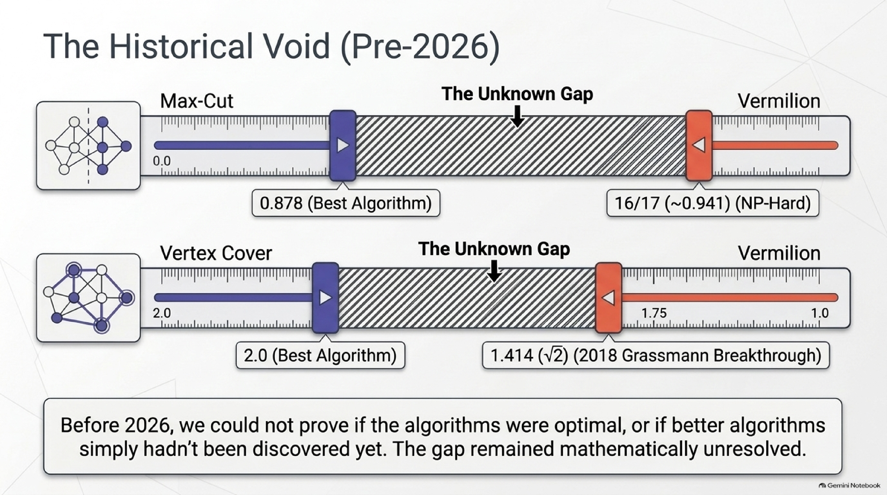


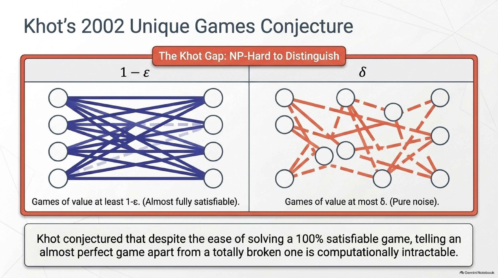

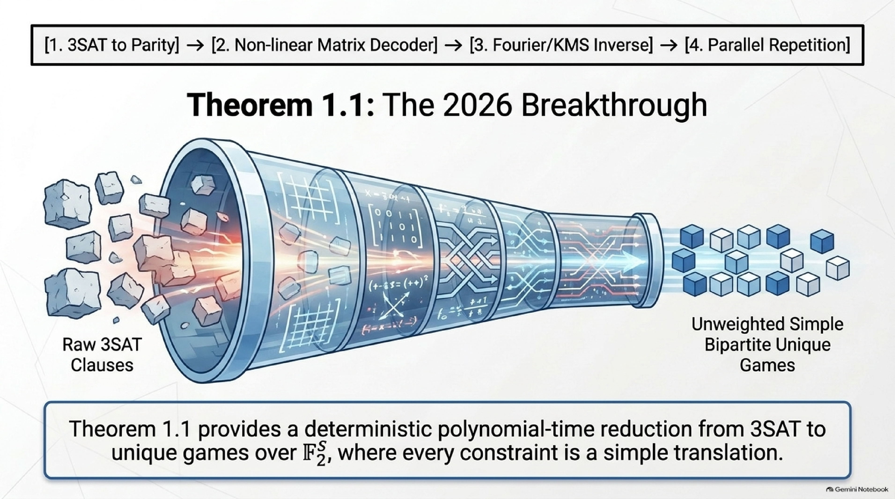

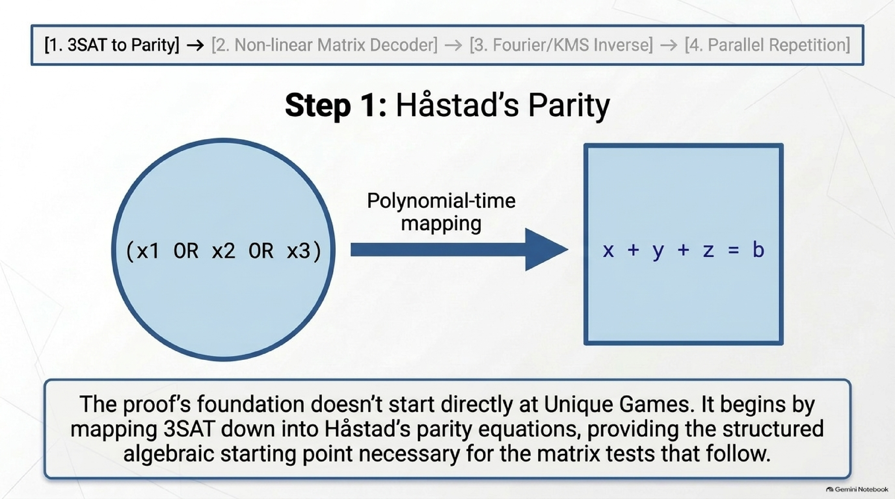

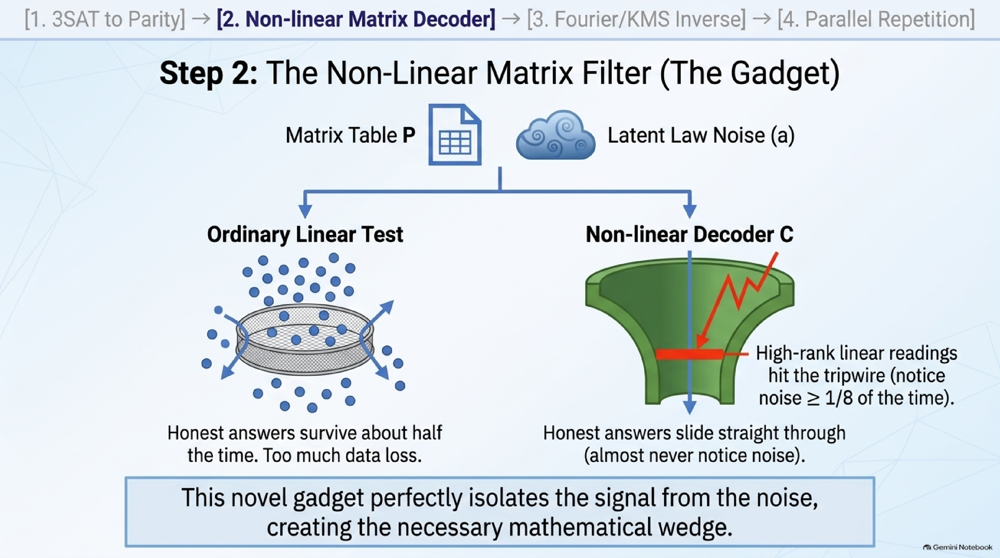

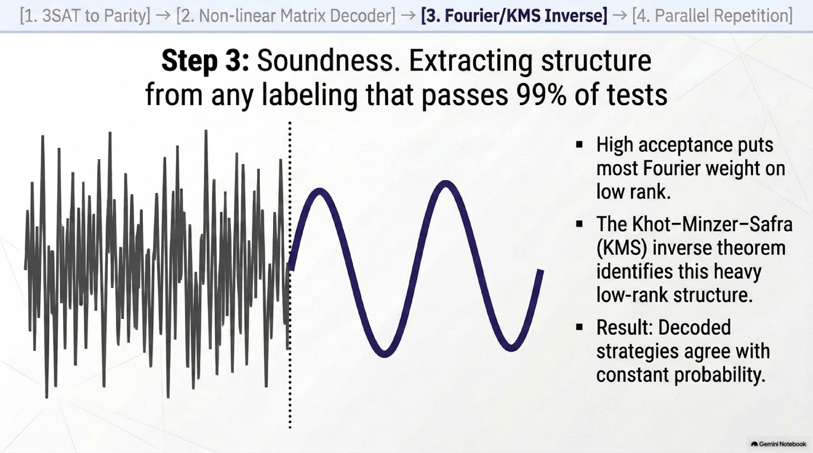


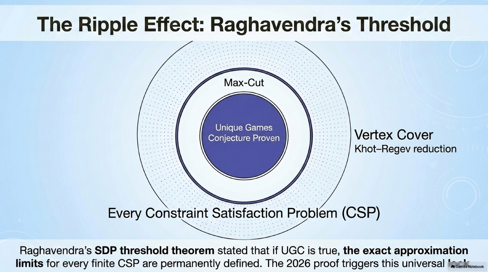

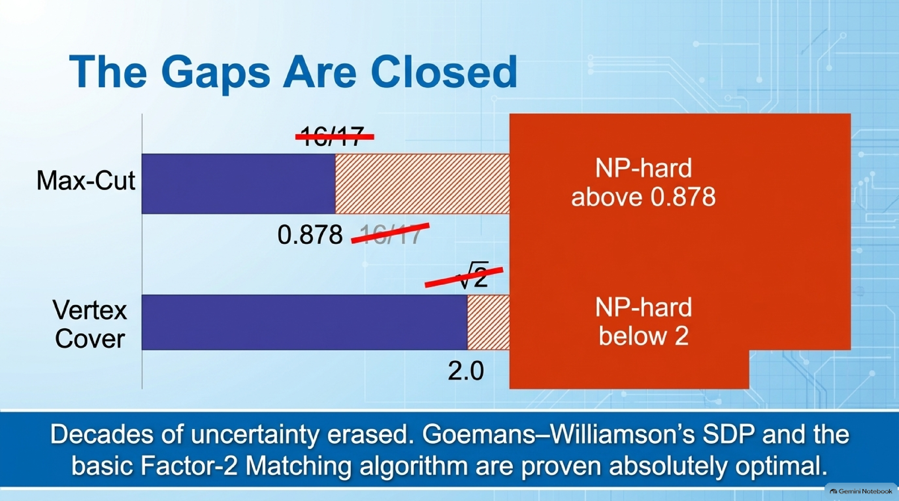


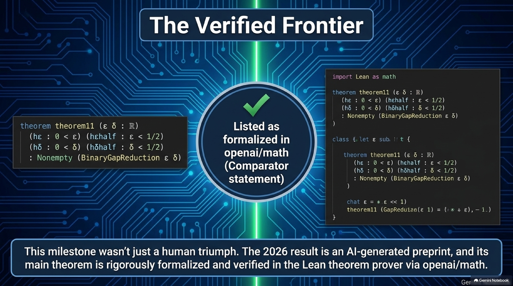

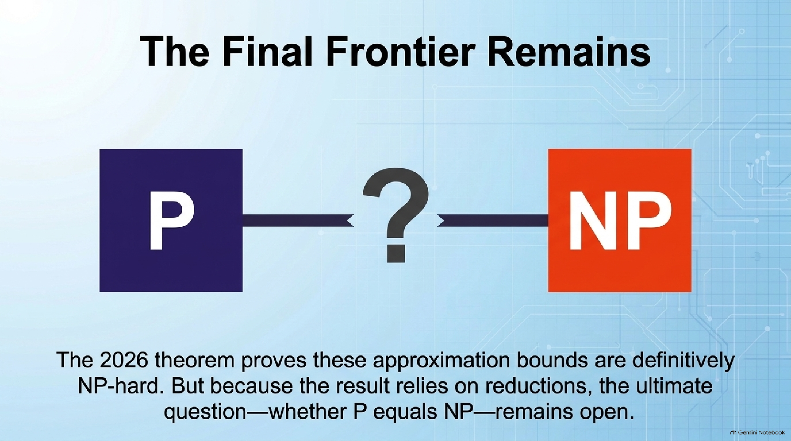

</details>

---

## How this explainer was made

1. The paper, its companions, the Lean scope document and the reasoning summary were downloaded from [openai/math](https://github.com/openai/math/tree/main/preprints), and the paper's LaTeX source was read directly.
2. They were loaded into a NotebookLM notebook through the [`notebooklm-mcp-cli`](https://github.com/jacob-bd/gemini-notebook-mcp-cli) MCP/CLI, together with the Wikipedia article on the Unique Games Conjecture for background. NotebookLM generated the slides, infographics and report in [`assets/notebooklm/`](assets/notebooklm/).
3. The text on this page was written by hand (with AI assistance) directly from the paper's introduction, its Sections 3–8, and the introductions of the Max-Cut and Vertex Cover companions. NotebookLM's outputs contain mistakes, listed in the [errata](assets/README.md#errata), so they were used as visual and structural aids rather than as the source of truth. Historical attributions follow the papers' own accounts. Dates are those the papers give (1992 for the PCP theorem, 2002 for the UGC, 2018 for the 2-to-2 theorem) or the standard conference dates of the cited works, which are earlier than the journal years in the bibliographies.

See [`PIPELINE.md`](../../PIPELINE.md) for the exact, repeatable steps.

*Citation for the underlying paper:*

```bibtex
@misc{OAI:The-Unique-Games-Theorem-September-23-2026,
  author = {{OpenAI}},
  title = {{The Unique Games Theorem}},
  howpublished = {OpenAI Math Release preprint
                  \href{https://github.com/openai/math/blob/main/preprints/The-Unique-Games-Theorem-September-23-2026/paper.pdf}{OAI:The-Unique-Games-Theorem-September-23-2026}},
  year = {2026}
}
```
