# The irrationality exponent of π is 2, explained for beginners

> - **Paper:** [*The irrationality exponent of π is 2*](https://github.com/openai/math/blob/main/preprints/The-irrationality-exponent-of-pi-is-2-September-24-2026/paper.pdf), OpenAI, 24 September 2026 (23 pages)
> - **openai/math family:** 017, *The irrationality exponent of π is 2* · **Field:** number theory (Diophantine approximation)
> - **Companion material:** an [abridged summary of the model's reasoning](https://github.com/openai/math/blob/main/reasoning_traces/irrationality-exponent-of-pi.pdf) released by OpenAI (42 pages). It records the search for the proof; it is not itself a proof
> - **Formal proof:** according to the [Lean scope document](https://github.com/openai/math/blob/main/lean/docs/017.md), the main theorem, $\mu(\pi) = 2$, is formalized in Lean 4. The Flint–Hills consequence is outside the selected statement (see [section 7](#7-what-it-does-not-prove-and-caveats))
> - **Who this is for:** anyone comfortable with fractions, decimals and powers such as $q^{-2}$. No number theory needed for sections 1–4.

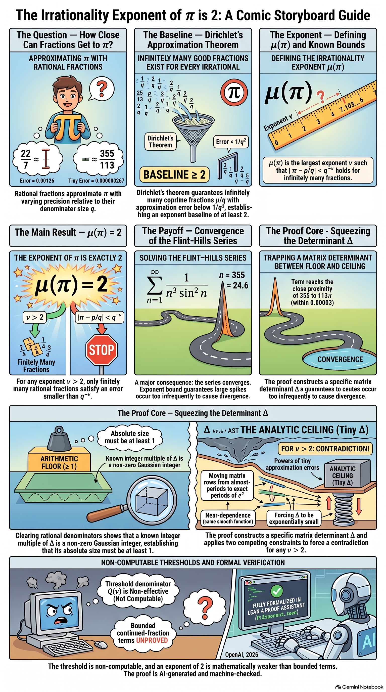

*AI-generated overview (NotebookLM). It has a few typos and one garbled panel; see the [errata](assets/README.md#errata).*

## Contents

- [TL;DR](#tldr)
- [How to read this](#how-to-read-this)
- [1. The problem](#1-the-problem)
- [2. A short history](#2-a-short-history)
- [3. What the paper proves](#3-what-the-paper-proves)
- [4. Why it matters](#4-why-it-matters)
- [5. The main idea of the proof](#5-the-main-idea-of-the-proof)
- [6. The people whose ideas this builds on](#6-the-people-whose-ideas-this-builds-on)
- [7. What it does not prove, and caveats](#7-what-it-does-not-prove-and-caveats)
- [8. Glossary](#8-glossary)
- [9. Slides, audio and other assets](#9-slides-audio-and-other-assets)
- [How this explainer was made](#how-this-explainer-was-made)

---

## TL;DR

- **The question.** Fractions such as 22/7 and 355/113 are famously close to π. Every irrational number has infinitely many fractions $p/q$ within $1/q^2$ of it; that much is automatic. The **irrationality exponent** $\mu(\pi)$ asks whether π allows *much* better approximations, within $1/q^{\nu}$ for some $\nu$ bigger than 2, infinitely often.
- **What was known.** $\mu(\pi) \ge 2$ comes for free. Upper bounds came down from 42 (Mahler, 1953) to 7.103… (Zeilberger and Zudilin, 2020). The expected answer was 2, the value for almost every real number, but the best proven bound was still above 7.
- **What this paper proves.** $\mu(\pi) = 2$ exactly. For every $\nu > 2$, only finitely many fractions satisfy $\lvert \pi - p/q \rvert < q^{-\nu}$. In the long run, π is no easier to approximate by fractions than a typical number.
- **Why that's a big deal.** It settles the **Flint–Hills series** question: $\sum 1/(n^3 \sin^2 n)$ converges. It also gives an exact rule for which series $\sum 1/(n^a \lvert \sin n \rvert^b)$ converge. And it brings a new kind of argument to π, related to Roth's method for algebraic numbers.
- **What it doesn't do.** The theorem is **not effective**: it gives no computable point beyond which the inequality holds. It does **not** say π is "badly approximable" (bounded continued-fraction terms). It is an AI-generated preprint. The main theorem has a Lean formalization; the Flint–Hills corollary is outside the statement that formalization was set up to check.

## How to read this

| You have… | Read |
|---|---|
| 2 minutes | The TL;DR and the infographic above |
| 15 minutes | Sections 1–4 and 7 |
| An hour, and you like algebra or analysis | Everything, including [section 5](#5-the-main-idea-of-the-proof) |

---

## 1. The problem

### 1.1 Fractions that are close to π

$\pi = 3.14159265358979\ldots$ is not a fraction, but some fractions come remarkably close:

- **22/7** $= 3.142857\ldots$ is off by about $0.00126$. In the 3rd century BCE, Archimedes proved $223/71 < \pi < 22/7$.
- **355/113** $= 3.14159292\ldots$ is off by about $0.000000267$. It was found by the Chinese mathematician Zu Chongzhi in the 5th century.

How impressive is that? Any denominator $q$ gets you within $1/(2q)$ of π for free: just round $q\pi$ to the nearest whole number $p$. For $q = 113$ that free guarantee is about $0.0044$. 355/113 is more than ten thousand times better. So the interesting question is not "how close?" but "how close **compared with the size of the denominator**?"

### 1.2 Continued fractions: where the best fractions come from

There is a mechanical way to find the best fractions. Take the whole-number part, flip the remainder upside down, and repeat:

| Step | Number | Whole part | Remainder | 1 / remainder |
|---|---|---|---|---|
| 0 | 3.14159265… | **3** | 0.14159265… | 7.0625133… |
| 1 | 7.0625133… | **7** | 0.0625133… | 15.9965944… |
| 2 | 15.9965944… | **15** | 0.9965944… | 1.0034172… |
| 3 | 1.0034172… | **1** | 0.0034172… | 292.6345910… |
| 4 | 292.6345910… | **292** | 0.6345910… | 1.5758181… |

This gives the **continued fraction**

```math
\pi = 3 + \cfrac{1}{7 + \cfrac{1}{15 + \cfrac{1}{1 + \cfrac{1}{292 + \cdots}}}} = [3;\ 7, 15, 1, 292, 1, 1, 1, 2, 1, 3, 1, 14, \ldots]
```

The whole numbers $3, 7, 15, 1, 292, \ldots$ are the **partial quotients**. Cutting the expansion short gives the **convergents** $3,\ 22/7,\ 333/106,\ 355/113,\ 103993/33102, \ldots$ Each convergent is closer to π than any fraction with a smaller denominator. And a convergent is unusually good exactly when the *next* partial quotient is large. Its error is roughly $1/(a\ q^2)$, where $a$ is the next partial quotient.

**A worked calculation** (computed for this explainer with 60-digit arithmetic):

| Convergent $p/q$ | Error $\lvert \pi - p/q \rvert$ | How many times smaller than $1/q^2$ | Next partial quotient |
|---|---|---|---|
| 22/7 | 0.00126 | 16 | 15 |
| 333/106 | 0.0000832 | 1.07 | 1 |
| **355/113** | **0.000000267** | **294** | **292** |
| 103993/33102 | 0.000000000578 | 1.6 | 1 |

The 292 after 355/113 is the whole story of why 355/113 is so good: $1/(292 \cdot 113^2) \approx 0.000000268$, almost exactly the actual error.

### 1.3 Dirichlet's theorem: $1/q^2$ is always possible

Every irrational number $x$ has **infinitely many** fractions with

```math
\left\lvert x - \frac{p}{q} \right\rvert < \frac{1}{q^2}.
```

This is Dirichlet's approximation theorem (1842; the date is from my own knowledge, see [section 2](#2-a-short-history)). The proof is the pigeonhole principle, and the paper repeats it as the last step of its main proof. Cut the interval from 0 to 1 into $N$ equal boxes and look at the fractional parts of $0, x, 2x, \ldots, Nx$. That is $N+1$ points in $N$ boxes, so two of them share a box. Their difference gives a $q \le N$ and a whole number $p$ with $\lvert qx - p \rvert \le 1/N$. Dividing by $q$ gives $\lvert x - p/q \rvert \le 1/(qN) \le 1/q^2$.

So exponent 2 is the universal baseline: every irrational number can be approximated that well, infinitely often.

### 1.4 The irrationality exponent

The paper defines the **irrationality exponent** (also called the irrationality measure) of an irrational number $x$ as

```math
\mu(x) = \sup\left\lbrace \nu > 0 :\ 0 < \left\lvert x - \frac{p}{q} \right\rvert < q^{-\nu} \text{ for infinitely many coprime } p, q \in \mathbb{Z},\ q \ge 2 \right\rbrace .
```

("Coprime" means $p$ and $q$ have no common factor, so each fraction is counted once, in lowest terms.) In words: **the largest exponent $\nu$ for which you can beat $q^{-\nu}$ infinitely often.** Dirichlet gives $\mu(x) \ge 2$ for every irrational $x$. A bigger $\mu$ means a number with infinitely many freakishly good fractions.

| Number | $\mu$ | Why |
|---|---|---|
| Irrational algebraic numbers, such as $\sqrt{2}$ or the golden ratio | 2 | Roth's theorem (1955) |
| $e = 2.71828\ldots$ | 2 | Its continued fraction has a regular pattern, $[2;\ 1, 2, 1, 1, 4, 1, 1, 6, \ldots]$ |
| Almost every real number | 2 | A probability argument (the Borel–Cantelli lemma) |
| Liouville numbers, such as $\sum_k 10^{-k!}$ | $\infty$ | Built on purpose to have absurdly good fractions |
| π, before this paper | between 2 and 7.103… | Mahler (1953) through Zeilberger–Zudilin (2020) |
| π, after this paper | **2** | Theorem 1.1 |

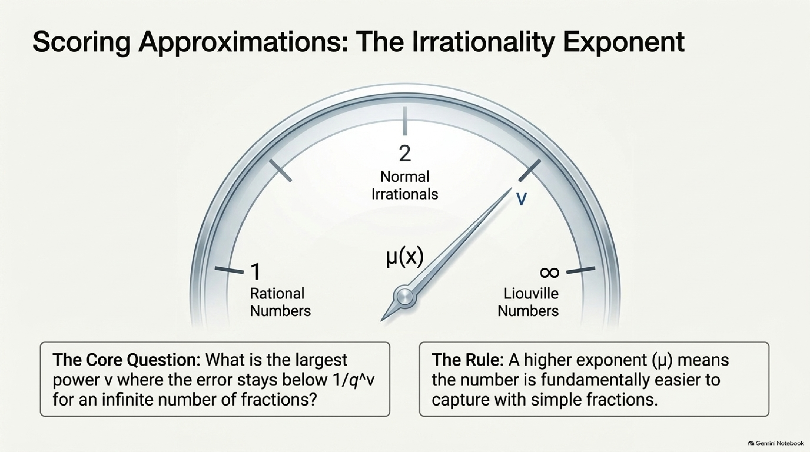

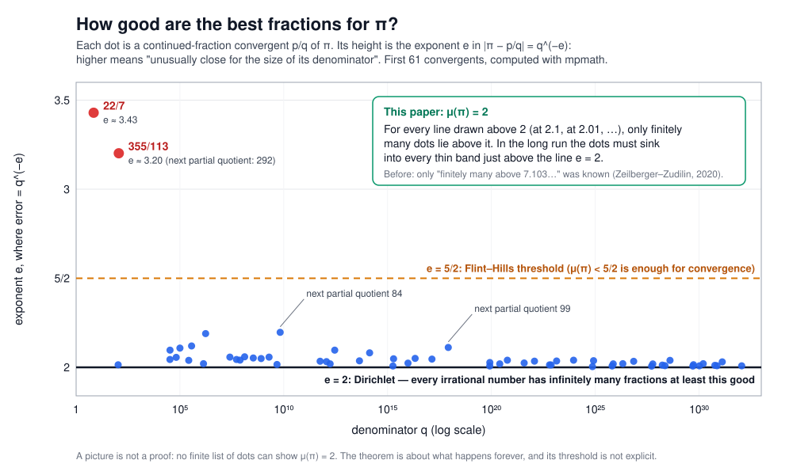

The figure shows what the exponent measures. For each convergent, the dot's height $e$ is defined by $\lvert \pi - p/q \rvert = q^{-e}$. All dots sit above 2: every convergent beats $1/q^2$, which is one way to prove Dirichlet's theorem. 22/7 and 355/113 are tall because their denominators are tiny and their next partial quotients (15 and 292) are large. In terms of the convergent denominators $q_k$, a standard formula reads

```math
\mu(x) = 1 + \limsup_{k \to \infty} \frac{\log q_{k+1}}{\log q_k},
```

so $\mu(\pi) = 2$ says that, for every $\varepsilon > 0$, the next denominator $q_{k+1}$ is eventually smaller than $q_k^{1+\varepsilon}$. No finite picture can prove this: it is a statement about what happens forever.

### 1.5 Roth's theorem, and why it says nothing about π

For **algebraic** numbers (roots of polynomials with integer coefficients, such as $\sqrt{2}$), this problem was solved long ago:

- **Liouville (1844)** showed that an algebraic number of degree $d$ has $\mu \le d$. He used this to write down the first explicit transcendental numbers.
- **Thue (1909), Siegel (1921) and Dyson (1947)** lowered the bound step by step.
- **Roth (1955)** proved that every irrational algebraic number has $\mu = 2$ exactly. His method uses **several approximations at once, of wildly different sizes**, together with an auxiliary polynomial in many variables (a helper polynomial built only for the proof). Roth's theorem is also *ineffective*, like the result in this paper.

But π is **transcendental**: Lindemann proved in 1882 that π is not a root of any such polynomial. Roth's theorem does not apply. For π, the record bounds came from explicit constructions. Since Hata's work these have mostly been integrals that produce small combinations of the form $a + b\pi$ with integer $a, b$. Step by step they brought the bound from 42 down to about 7.1. The last steps were 7.606 (2008), 7.103 (2020) and a claimed 7.1019 (2026), still far from 2.

### 1.6 The Flint–Hills series

The **Flint–Hills series**, popularized by Clifford Pickover, is

```math
\sum_{n=1}^{\infty} \frac{1}{n^3 \sin^2 n} \qquad (\text{angles in radians}).
```

$\sin n$ is never zero, because π is irrational. But it becomes tiny whenever the whole number $n$ is very close to a multiple of π, that is, whenever $n/q$ is a very good fraction for π. Each such near-miss makes one term spike. For example, $355 - 113\pi \approx 0.0000301$, so $\sin 355 \approx -0.0000301$, and the single term $n = 355$ is about **24.6**.

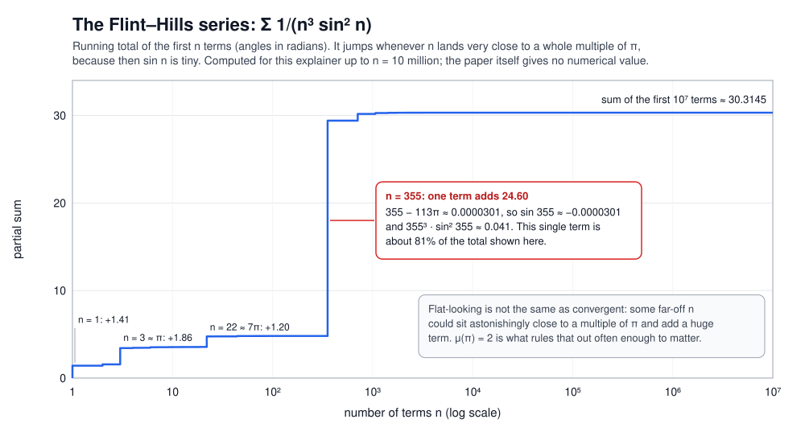

Whether the series converges is therefore a question about **how often, and how well, π can be approximated by fractions**. Two known results tie it to the irrationality exponent:

- **Alekseyev (2011):** if the series converges, then $\mu(\pi) \le 5/2$.
- **Meiburg (2022):** if $\mu(\pi) < 5/2$, then the series converges.

With the best proven bound stuck above 7, the question was open.

---

## 2. A short history

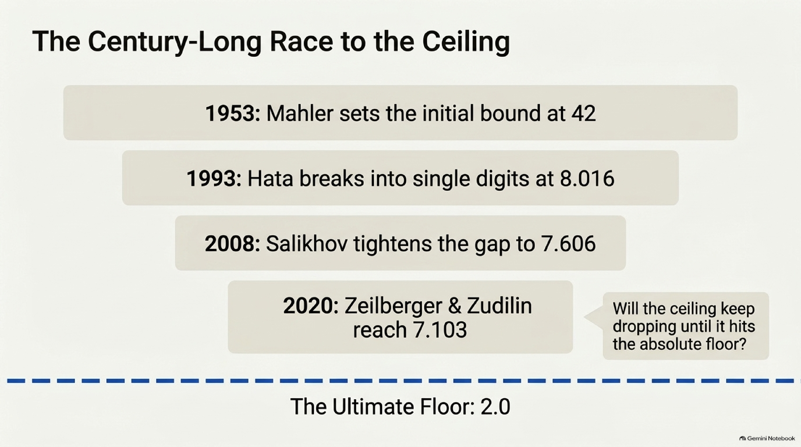

| When | Who | What happened |
|---|---|---|
| 3rd century BCE | **Archimedes** | Proves $223/71 < \pi < 22/7$ with 96-sided polygons |
| 5th century | **Zu Chongzhi** | Gives 355/113 (the "milü"), correct to six decimal places |
| 1768 (in the Berlin Academy's volume dated 1761) | **Johann Heinrich Lambert** | First proof that π is irrational, using a continued fraction for $\tan x$ |
| 1842 | **Peter Gustav Lejeune Dirichlet** | Approximation theorem: every irrational number has infinitely many fractions within $1/q^2$ |
| 1844 | **Joseph Liouville** | Algebraic numbers cannot be approximated too well; the first explicit transcendental numbers |
| 1882 | **Ferdinand von Lindemann** | π is transcendental, so the theory for algebraic numbers does not reach it |
| 1909, 1921, 1947 | **Axel Thue, Carl Ludwig Siegel, Freeman Dyson** | Successive improvements of Liouville's bound for algebraic numbers |
| 1953 | **Kurt Mahler** | First finite bound for π: $\mu(\pi) \le 42$, and 30 for large denominators |
| 1955 | **Klaus Roth** | Every irrational algebraic number has exponent exactly 2 |
| 1974 | **Maurice Mignotte** | 21 for all denominators, 20 for large ones |
| 1982 | **G. V. Chudnovsky** | Hermite–Padé approximations to exponential functions with precise asymptotic estimates |
| 1993 | **Masayoshi Hata** | $\mu(\pi) \le 8.01604539\ldots$ from integral constructions |
| 2004 | **Michel Waldschmidt** | Records the conjecture $\mu(\pi) = 2$ in his survey *Open Diophantine problems* |
| 2008 | **V. Kh. Salikhov** | $\mu(\pi) \le 7.606308\ldots$ with a symmetric-integral method (full account 2010) |
| 2011 | **Max Alekseyev** | Convergence of the Flint–Hills series would force $\mu(\pi) \le 5/2$ |
| 2020 | **Doron Zeilberger, Wadim Zudilin** | $\mu(\pi) \le 7.103205334137\ldots$, combining parameter experiments with a rigorous arithmetic and asymptotic analysis |
| 2022 | **Alex Meiburg** | $\mu(\pi) < 5/2$ would be enough for convergence |
| Sept 2026 | **Yufei Bai** (preprint) | Claims $\mu(\pi) < 7.101862832357$ |
| 24 Sept 2026 | **OpenAI** (internal model) | $\mu(\pi) = 2$, and the Flint–Hills series converges |

The rows from 1953 on (except Roth) come from the paper and its bibliography. The earlier rows, and Roth's 1955 date, are background the paper does not give; they were checked against Wikipedia and MacTutor. The one exception is Dirichlet's 1842 date, which is from my own knowledge (his 1842 note to the Berlin Academy); none of those sources states it.

The paper also mentions earlier claims that it does **not** use. N. A. Carella (arXiv:1902.08817, version 10 of 2022) claims both exponent 2 and the stronger bounded-partial-quotient property. The paper points out a sign problem in the displayed proof of the stronger claim, and says this objection does not decide either claim. A 2025 convergence claim by Mantzakouras and López Zapata was withdrawn in September 2026.

---

## 3. What the paper proves

> **Main theorem (Theorem 1.1).** The irrationality exponent of π is 2. More precisely, for every real $\nu > 2$ there is an integer $Q(\nu)$ such that
> $\lvert \pi - p/q \rvert \ge q^{-\nu}$ for all integers $p$ and all integers $q \ge Q(\nu)$.

In plain words: pick any exponent a little above 2, say 2.001. Fractions that beat $q^{-2.001}$ may exist, but there are **only finitely many** of them. Past some denominator, π is never approximated that well again. A few details:

- The inequality covers every fraction, reduced or not.
- The threshold $Q(\nu)$ depends on $\nu$, and the proof **does not compute it** (it is *ineffective*).
- The argument does not assume that π is irrational. It re-proves it along the way, because a rational π would give "perfect" approximations with arbitrarily large denominators.

> **Corollary 1.2.** The classical Flint–Hills series $\sum_{n \ge 1} 1/(n^3 \sin^2 n)$ converges.

> **Corollary 5.2.** For fixed real numbers $a, b > 0$, the series $\sum_{n \ge 1} 1/(n^a \lvert \sin n \rvert^b)$ (angles in radians) converges **if and only if** $a > \max\lbrace 1, b\rbrace$.

So the boundary is sharp. For example, $\sum 1/(n^2 \sin^2 n)$ diverges ($a = b = 2$), while $\sum 1/(n^{2.01} \sin^2 n)$ converges. The divergence half is elementary; the convergence half needs Theorem 1.1.

The Lean 4 challenge statement, from [`ComparatorChallenges/PiExponent.lean`](https://github.com/openai/math/blob/main/lean/ComparatorChallenges/PiExponent.lean), contains both the eventual lower bound and the "supremum equals 2" form of the definition:

```lean
theorem main :
  (∀ ν : ℝ, 2 < ν → ∃ Q : ℤ, 2 ≤ Q ∧
    ∀ p q : ℤ, Q ≤ q →
      (q : ℝ) ^ (-ν) ≤ |Real.pi - (p : ℝ) / (q : ℝ)|) ∧
  sSup {ν : ℝ | 0 < ν ∧
    Set.Infinite {r : ℚ | 2 ≤ r.den ∧
      0 < |Real.pi - (r : ℝ)| ∧
      |Real.pi - (r : ℝ)| < (r.den : ℝ) ^ (-ν)}} = 2
```

---

## 4. Why it matters

| Consequence | Before | After |
|---|---|---|
| **Irrationality exponent of π** | $2 \le \mu(\pi) \le 7.103\ldots$ | $\mu(\pi) = 2$ |
| **Fractions beating $q^{-2.01}$** | Could not be ruled out: infinitely many were possible | Only finitely many; the same for $q^{-2-\varepsilon}$ with any $\varepsilon > 0$ |
| **Flint–Hills series** | Open; known to hinge on $\mu(\pi)$ versus 5/2 | Converges |
| **The family** $\sum 1/(n^a \lvert \sin n \rvert^b)$ | No complete criterion (the classical case $a = 3$, $b = 2$ was open) | Converges exactly when $a > \max\lbrace 1, b\rbrace$ |
| **Continued fraction of π** | Partial quotients $a_{k+1}$ were only known to be eventually below about $q_k^{5.11}$ | They eventually stay below $q_k^{\varepsilon}$ for every $\varepsilon > 0$. They may still be unbounded |

The last row uses the standard formula $\mu(x) = 2 + \limsup_k \log a_{k+1} / \log q_k$; it is a reformulation, not a separate theorem of the paper.

The deeper significance is twofold. First, π joins the numbers whose irrationality exponent is known exactly, such as the algebraic numbers and $e$. Second, the method is new for π. Earlier records (Hata, Salikhov, Zeilberger–Zudilin) came from explicit integrals, and the paper treats them as context, not inputs. This proof instead adapts the strategy behind Roth's theorem (use several approximations of very different sizes at once) and combines it with interpolation determinants and modern algebraic geometry. π enters the argument through one classical fact: $e^{2\pi \mathrm{i}} = 1$.

<details>
<summary><b>Why an exponent below 5/2 is enough for Flint–Hills</b> (the paper's short argument in Section 5)</summary>

Write $\lVert y \rVert$ for the distance from $y$ to the nearest whole number.

1. Fix $\nu$ between 2 and 5/2. Theorem 1.1, plus irrationality for the finitely many small $q$, gives a constant $c > 0$ with $\lVert q\pi \rVert \ge c\ q^{1-\nu}$ for every $q \ge 1$.
2. Look at one block of denominators, $K \le q < 2K$. Put the points $q\pi$ (ignoring whole numbers) on a circle of length 1. Each one is at distance at least $d = c\ (2K)^{1-\nu}$ from 0. Any two of them are also at least $d$ apart: apply the same bound to their difference, which is smaller than $2K$.
3. So on each half of the circle the distances to 0 are at least $d, 2d, 3d, \ldots$. The block contributes at most

```math
\sum_{K \le q < 2K} \frac{1}{q^3 \lVert q\pi \rVert^2} \le \frac{2}{K^3 d^2}\left(1 + \frac14 + \frac19 + \cdots\right) = O\big(K^{2\nu - 5}\big).
```

4. Because $\nu < 5/2$, the exponent $2\nu - 5$ is negative. Summing over $K = 1, 2, 4, 8, \ldots$ gives a finite total.
5. Finally, group each $n$ with the nearest multiple $q\pi$. Then $\lvert \sin n \rvert \ge (2/\pi)\lVert q\pi \rVert$ and $n \ge \pi q/2$, with at most four values of $n$ per $q$. Each group contributes at most $(8/\pi)/(q^3 \lVert q\pi \rVert^2)$, and the series converges.

With the old bound 7.103 this argument gives nothing: the block estimate only becomes useful below 5/2.
</details>

---

## 5. The main idea of the proof

The paper is short for a result of this kind: about 20 pages of mathematics plus references. Here it is at three zoom levels.

### Level 1: the one-paragraph version

Suppose, for contradiction, that π had infinitely many "too good" fractions, with error below $q^{-\nu}$ for some fixed $\nu > 2$. The paper picks several of them, of wildly different sizes, and uses them to build one enormous table of numbers. From it, it cuts out a square block and looks at that block's **determinant** $\Delta$, a single number computed from the block. Two facts about $\Delta$ cannot both be true:

- **Arithmetic says $\Delta$ is not too small.** A hard theorem from algebraic geometry guarantees $\Delta \neq 0$. After clearing denominators, a known multiple of $\Delta$ becomes a nonzero number of the form $a + b\mathrm{i}$ with whole numbers $a, b$, and such a number has size at least 1. So $\lvert\Delta\rvert$ is at least one over that known factor.
- **Analysis says $\Delta$ is very small.** Because each fraction is so close to π, the table is almost the same as one built from the exact number $2\pi\mathrm{i}$, the period of the exponential function. That ideal table has a great deal of internal cancellation, and the leftover differences carry powers of the tiny approximation errors. Together these drag $\Delta$ below the arithmetic floor.

Both can't hold, so the too-good fractions are only finitely many.

> **Analogy:** this is the classic shape of irrationality proofs. A whole number that is not zero is at least 1 in size. If you can also show it is smaller than 1, one of your assumptions was false. The novelty here is *which* number is built, and how its smallness is proved.

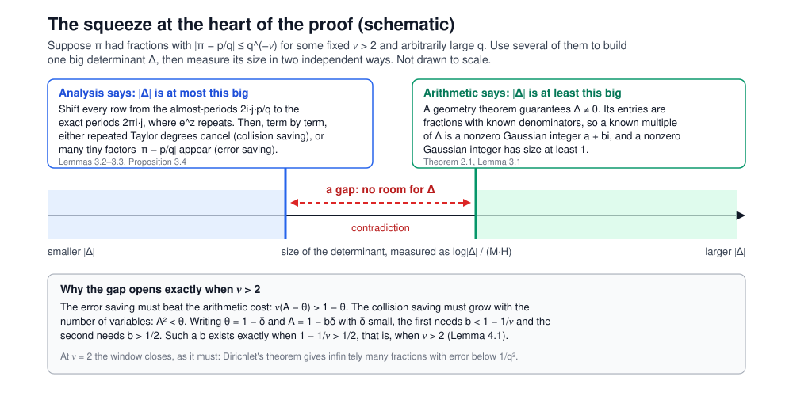

### Level 2: the step-by-step picture

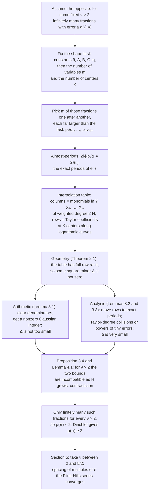
```mermaid
flowchart TD
    A["Assume the opposite: for some fixed ν > 2,<br/>infinitely many fractions with error ≤ q^(−ν)"] --> B["Fix the shape first: constants θ, A, B, C, η,<br/>then the number of variables m<br/>and the number of centers K"]
    B --> C["Pick m of those fractions one after another,<br/>each far larger than the last: p₁/q₁, …, pₘ/qₘ"]
    C --> D["Almost-periods: 2i·j·pᵢ/qᵢ ≈ 2πi·j,<br/>the exact periods of e^z"]
    D --> E["Interpolation table: columns = monomials in Y, X₁, …, Xₘ<br/>of weighted degree ≤ H; rows = Taylor coefficients<br/>at K centers along logarithmic curves"]
    E --> F["Geometry (Theorem 2.1): the table has full row rank,<br/>so some square minor Δ is not zero"]
    F --> G["Arithmetic (Lemma 3.1): clear denominators,<br/>get a nonzero Gaussian integer:<br/>Δ is not too small"]
    F --> H["Analysis (Lemmas 3.2 and 3.3): move rows to exact periods;<br/>Taylor-degree collisions or powers of tiny errors:<br/>Δ is very small"]
    G --> I["Proposition 3.4 and Lemma 4.1: for ν > 2 the two bounds<br/>are incompatible as H grows: contradiction"]
    H --> I
    I --> J["Only finitely many such fractions for every ν > 2,<br/>so μ(π) ≤ 2; Dirichlet gives μ(π) ≥ 2"]
    J --> K["Section 5: take ν between 2 and 5/2;<br/>spacing of multiples of π:<br/>the Flint–Hills series converges"]
```

**Step 1: Assume the opposite.** Fix $\nu > 2$ and suppose that arbitrarily large denominators $q$ have a numerator $p$ with $\lvert \pi - p/q \rvert \le q^{-\nu}$.

**Step 2: Fix the shape before anything else.** Lemma 4.1 supplies a handful of constants $\theta, A, B, C, \eta$ that depend only on $\nu$. Then the proof fixes a number of variables $m$ and a number of points $K = \lfloor C^m \rfloor$. The paper stresses that the order of choices is essential. First the shape, then the fractions, and only at the very end does the polynomial degree $H$ go to infinity.

**Step 3: Pick several fractions of very different sizes.** Choose $m$ of the assumed good fractions $p_1/q_1, \ldots, p_m/q_m$ one after another, each large enough for thresholds set by the earlier choices. Each fraction gets a weight $w_i = \lceil \log q_i \rceil$. These "successively separated" sizes are the same device that drives Roth's theorem. A crucial point is that the thresholds do **not** depend on where the fractions land, so the choice is not circular.

**Step 4: Turn fractions into almost-periods.** The exponential function repeats: $e^{z + 2\pi\mathrm{i}} = e^z$. Each good fraction gives a number $r_i = 2\mathrm{i}\ p_i/q_i$ that is extremely close to $2\pi\mathrm{i}$. The proof uses the "centers" $j r_i$ for $j = 0, 1, \ldots, K-1$, which imitate the exact periods $2\pi\mathrm{i}\ j$. This is where π enters the proof.

**Step 5: Build the table.** The columns are monomials $Y^h X_1^{\alpha_1} \cdots X_m^{\alpha_m}$ whose weighted degree is at most $H$. The rows are Taylor coefficients ("jets") of these polynomials at the $K$ centers, taken along the logarithmic curves $Y = 1 + t$, $X_i = j r_i + u_i + \log(1+t)$. Here $t$ moves along the curve and the $u_i$ move across it, in the "transverse" directions. The logarithm is cut off to a polynomial so that every entry is an ordinary fraction (with $\mathrm{i}$ allowed).

**Step 6: Geometry: the table has full rank.** There are more columns than rows, but that count alone does not prove the rows are independent at these special points. Theorem 2.1, the longest part of the paper, proves it with algebraic geometry. So some square piece of the table has a nonzero determinant $\Delta$ that uses every row.

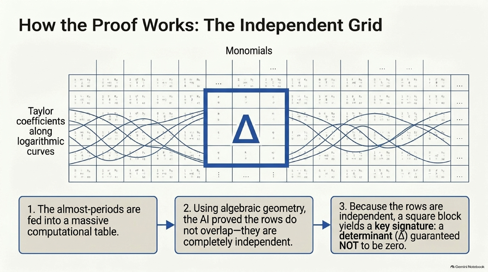

**Step 7: Arithmetic: $\Delta$ cannot be tiny.** Multiply rows and columns by known powers of the $q_i$ and by least common multiples that clear the logarithm's denominators. Then every entry becomes a Gaussian integer $a + b\mathrm{i}$, so the scaled determinant is a nonzero Gaussian integer and has size at least 1. Undoing the scaling gives a lower bound for $\lvert\Delta\rvert$ (Lemma 3.1).

**Step 8: Analysis: $\Delta$ must be tiny.** Now shift every row from the almost-period $j r_i$ to the exact period $2\pi\mathrm{i}\ j$ (Lemma 3.2). The cost is a correction proportional to powers of the tiny differences $j(r_i - 2\pi\mathrm{i})$, which are about $q_i^{-\nu}$ in size. After the shift, each row tests one of a family of smooth functions, labelled by a multi-index $a$ (the row's **transverse index**: which coefficient in the transverse variables $u_1, \ldots, u_m$ it picks out). Many rows share an index, so they test **the same** functions. Expand those functions in Taylor series and multiply out the determinant. In any resulting term where two rows with the same index pick the same Taylor degree, those two rows are identical, so the term vanishes. The proof then splits every term of the expanded determinant into two cases (Lemma 3.3 and Proposition 3.4):

- **Many rows with small transverse index.** Rows sharing an index test the same function, so their Taylor degrees must all differ. That forces a big total degree and a *quadratic* saving in the size of the term.
- **Few such rows.** Then most rows have a large index, and each such row brings in a high power of the tiny approximation errors.

> **Analogy:** take many rows that all record the same smooth function, sampled at points inside a region that is small compared with the scale on which the function changes. Such rows are nearly dependent, like the rows $1, x, x^2, \ldots$ of a table built from several nearby numbers $x$ (a Vandermonde table), so their determinant is tiny. The second case is different: there the smallness comes directly from the approximation errors, which shrink as the fractions get closer to π.

**Step 9: The squeeze.** Either way the determinant is smaller than the arithmetic floor allows, once $m$ is large, the chosen denominators $q_i$ are large, and then $H$ is large. That contradiction shows there are only finitely many fractions with error below $q^{-\nu}$, for every $\nu > 2$. With Dirichlet's $\mu(\pi) \ge 2$, this gives $\mu(\pi) = 2$.

**Step 10: Flint–Hills.** Take $\nu$ between 2 and 5/2 and run the spacing argument from [section 4](#4-why-it-matters).

<details>
<summary><b>Where the number 2 comes from</b> (a three-line calculation)</summary>

Two requirements have to hold at once (Lemma 4.1):

- **Error saving beats arithmetic cost:** $\nu(A - \theta) > 1 - \theta$. Here $\theta$ measures how far the rows reach in the transverse directions, compared with the columns, and $A$ is the cutoff between "small" and "large" indices.
- **The collision saving can grow with the number of variables:** $A^2 < \theta$. This permits a choice of $B$ and $C$ that makes every dimension-dependent error shrink while the collision saving grows without bound.

Write $\theta = 1 - \delta$ and $A = 1 - b\delta$ with $\delta$ small. Then

```math
\nu(A-\theta) - (1-\theta) = \big(\nu(1-b) - 1\big)\delta > 0 \iff b < 1 - \frac{1}{\nu},
\qquad
\theta - A^2 = (2b-1)\delta - b^2\delta^2 > 0 \iff b > \frac12 \ \ (\delta \text{ small}).
```

A number $b$ with $\tfrac12 < b < 1 - \tfrac1\nu$ exists **exactly when $\nu > 2$**. At $\nu = 2$ the window closes, as it must: Dirichlet's theorem guarantees infinitely many fractions with error below $1/q^2$, so no correct argument can work at exponent 2 itself.
</details>

### Level 3: the machinery, for readers with some algebraic geometry and complex analysis

**The interpolation matrix.** Give $Y, X_1, \ldots, X_m$ weights $W = (w_0, w_1, \ldots, w_m)$ and put $V = (v_0, w_1/\theta, \ldots, w_m/\theta)$. Columns are monomials $Y^h X^\alpha$ with $w_0 h + w\cdot\alpha \le H$. Rows are triples $(j, s, \beta)$ with $v_0 s + w\cdot\beta/\theta < H$, and the entry is

```math
[t^s u^\beta]\ P\big(1+t,\ j r_1 + G_1(t) + u_1,\ \ldots,\ j r_m + G_m(t) + u_m\big),
\qquad r_i = \frac{2\mathrm{i}\ p_i}{q_i},
```

where $G_i(t) = \sum_{1 \le k < T_i} (-1)^{k+1} t^k / k$ truncates $\log(1+t)$. The truncation changes the jets only by a filtration-preserving, invertible substitution, so it does not affect rank.

**Rank (Section 2).** Theorem 2.1 (*separated-weight interpolation*) says the jet map

```math
\mathcal{P}_W(H) \longrightarrow \bigoplus_{j=0}^{K-1} \mathcal{J}_V(H),\qquad
P \longmapsto \Big(P\big(1+t,\ (c_{ji} + u_i + \log(1+t))_{i=1}^m\big)\Big)_{j}
```

is surjective for all large, sufficiently divisible $H$. The hypotheses are the volume conditions $K\theta^m < 1$ and $K(w_0/v_0)\theta^m < 1$, weights $w_1, \ldots, w_m$ above successive thresholds that do not depend on the centers, and centers whose coordinates are distinct in each slot. The proof has three parts:

1. **Lemma 2.2** compares local multiplicities along commuting vector fields with a weighted Bézout bound. It is applied to the frame $D_0 = Y\partial_Y + \sum_i \partial_{X_i}$, $D_i = \partial_{X_i}$, which follows the logarithmic curves.
2. **Proposition 2.3 (curve inequality):** every curve satisfies $\deg_W C \ge (1+\sigma)\sum_P h_P$, where $h_P$ measures weighted contact with the logarithmic curves at the centers. If a curve violated this, an auxiliary polynomial and many of its derivatives would vanish on it. A persistent component of the derivative zero loci then exists, and on it the separated weights force either $dY = 0$ or a relation $dX_i = dY/Y$. In the second case a residue argument finishes the job: at a zero or pole of a nonconstant $Y$, the form $dY/Y$ has residue $\mathrm{ord}_P Y \ne 0$, while the exact form $dX_i$ has residue 0. So $Y$ is constant, and the fiber $Y = 1$ is handled by a second, similar argument.
3. Blow up the ideal of the jet conditions, with exceptional divisor $E$, and let $p^{\ast}L$ be the pulled-back hyperplane class. The curve inequality makes $p^{\ast}L - (1+\sigma)E$ nef, hence $p^{\ast}L - E$ ample. Rees-algebra pushforward and Serre vanishing then give $H^1(X, I^n \otimes L^n) = 0$, which is the required surjectivity.

**Arithmetic (Lemma 3.1).** Scaling columns by $\prod_i q_i^{\alpha_i}$, rows by $\prod_i q_i^{-\beta_i}$, and everything by $\prod_i \mathrm{lcm}(1, \ldots, T_i - 1)^{\lfloor H/w_i \rfloor}$ produces a matrix over $\mathbb{Z}[\mathrm{i}]$. With $M$ the number of rows and $\bar b \in [0, \theta]$ the average normalized transverse weight of the rows,

```math
\frac{\log\lvert\Delta_H\rvert}{MH} \ \ge\ -(1-\bar b) - E_{\mathrm{ar}}.
```

**Analysis (Lemmas 3.2–3.3, Proposition 3.4).** Write $\omega = 2\pi\mathrm{i}$. Since $e^{j\omega} = 1$, each row is an exact combination of rows of Taylor coefficients of the entire functions

```math
f_{a,P}(z) = [u^a]\ P\big(e^z,\ z+u_1,\ \ldots,\ z+u_m\big)\quad\text{at}\quad z = j\omega + \log(1+t),
```

with scalars of size at most $\exp(-\nu\ w\cdot(a-\beta) + H E_{\mathrm{tr}})$. Rows with the same index $a$ test the same entire functions. In the power-series expansion of the determinant, repeated degrees within one $a$-group kill a term, which gives $\lvert\det T\rvert \le \exp(-c\sum_a n_a^2 + MH(E_{\mathrm{hol}} + \rho_H))$ with $c = (\log 2)/4$ (the Taylor-expansion mechanism of Laurent's interpolation determinants). Splitting each term according to whether at least $\eta M$ rows have $w\cdot a \le AH$, and using Cauchy–Schwarz in the first case,

```math
\frac{\log\lvert\Delta_H\rvert}{MH} \ \le\ E_{\mathrm{an}} + \varepsilon_H + \max\Big\lbrace -cL_H,\ -\nu\big(A(1-\eta) - \bar b\big)\Big\rbrace .
```

**Parameters (Section 4).** With $K = \lfloor C^m \rfloor$, $w_0 = B^{-m}$ and $v_0 = 2K\theta^m w_0$, the collision budget is $L = \eta^2 (B/A)^m / (2(m+1)) \to \infty$, while $K/w_0 \le (CB)^m \to 0$ and $v_0 \to \infty$. Proposition 3.4's conditions

```math
g = \nu\big(A(1-\eta) - \theta\big) - (1-\theta) > 0,\qquad E_{\mathrm{ar}} + E_{\mathrm{an}} < g,\qquad cL > 1 + E_{\mathrm{ar}} + E_{\mathrm{an}}
```

then hold once $m$ is large and the weights $w_i$ are large, and the upper bound falls below the lower bound as $H \to \infty$. The paper relates this organization to Laurent's interpolation-determinant method and to Roth's separated denominators. It relates the geometric step to Philippon's zero estimates, Farhi's Roth lemma with separated multidegrees, and Demailly's link between curvewise positivity and jet generation.

---

## 6. The people whose ideas this builds on

Archimedes, Zu Chongzhi, Lambert, Lindemann, Dirichlet, Liouville, Thue, Siegel and Dyson are background for this explainer: the paper does not cite them. Everyone else in the table is cited or named in the paper.

| Person | Idea | Where it shows up |
|---|---|---|
| **Archimedes, Zu Chongzhi** | Early fractions for π: 22/7 and 355/113 | The worked examples in section 1 |
| **Johann Heinrich Lambert, Ferdinand von Lindemann** | π is irrational (Lambert), then transcendental (Lindemann) | Why Roth's theorem does not cover π |
| **Peter Gustav Lejeune Dirichlet** | The pigeonhole principle; every irrational has exponent at least 2 | The final step of the main proof gives $\mu(\pi) \ge 2$ this way |
| **Joseph Liouville, Axel Thue, Carl Ludwig Siegel, Freeman Dyson, Klaus Roth** | How well algebraic numbers can be approximated; Roth's many-variable method with successively separated denominators | The overall strategy: several approximations of very different sizes at once |
| **Kurt Mahler, Maurice Mignotte, G. V. Chudnovsky, Masayoshi Hata, V. Kh. Salikhov, Wadim Zudilin, Doron Zeilberger** | The earlier upper bounds for $\mu(\pi)$ | Context only; the paper uses none of them |
| **Michel Waldschmidt** | Recorded the conjecture $\mu(\pi) = 2$ | The conjecture the paper proves |
| **Clifford Pickover, Max Alekseyev, Alex Meiburg** | The Flint–Hills problem and its link to $\mu(\pi)$ | Corollary 1.2 and Section 5 |
| **Michel Laurent** | Interpolation determinants; the Taylor-expansion mechanism that eliminates repeated degrees | Section 3, the collision estimate |
| **Patrice Philippon, Bakir Farhi** | Zero estimates; a Roth lemma with separated multidegrees | Section 2, the curve inequality |
| **Jean-Pierre Demailly, Robert Lazarsfeld** | Curvewise positivity and jet generation; the nef-plus-ample criterion | Section 2, from the curve inequality to full rank |
| **Pinaki Mondal; the Stacks Project** | Bézout bounds with local multiplicities; blow-ups, Proj and Serre vanishing | Lemma 2.2 and Section 2.3 |

---

## 7. What it does not prove, and caveats

> [!IMPORTANT]
> **It is not effective.** For each $\nu > 2$ the theorem says some threshold $Q(\nu)$ exists, but the proof does not compute it. So it cannot certify, for example, that no fraction with denominator above $10^{100}$ beats $q^{-2.01}$. Roth's theorem has the same limitation.

> [!IMPORTANT]
> **Exponent 2 is not the same as "badly approximable".** The paper stresses that $\mu(\pi) = 2$ differs from a uniform bound $\lvert \pi - p/q \rvert \ge c/q^2$, which is equivalent to the continued fraction of π having bounded partial quotients. That stronger property is not proved here. Large partial quotients like 292 may keep appearing; they just have to stay small compared with every power $q_k^{\varepsilon}$ of the denominators.

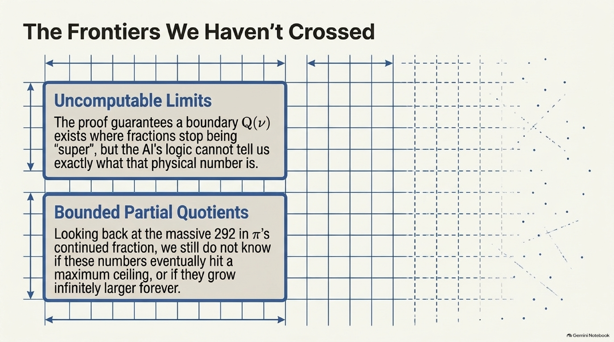

Other things the paper does not do:

- It gives **no numerical value** for the Flint–Hills sum. (The partial sum of the first $10^7$ terms is about 30.3145. This explainer computed that number; the paper does not mention it.)
- It treats **π only**. The reasoning summary shows the model considering extensions to other logarithms, but the paper makes no such claim.
- It says nothing about the **decimal digits** of π, for example whether every digit string appears equally often.

> [!NOTE]
> **Provenance.** The paper was produced by an unreleased internal OpenAI model as part of the [openai/math](https://github.com/openai/math) release. That repository's README says the vast majority of results came from one fixed procedure and names two exceptions (work on a zero-free region for the Riemann zeta function and on the Hodge Conjecture for CM abelian varieties); this paper is not among those named.

> [!NOTE]
> **The reasoning summary.** OpenAI also released a 42-page [abridged summary of the model's reasoning](https://github.com/openai/math/blob/main/reasoning_traces/irrationality-exponent-of-pi.pdf) for this result, with short verbatim excerpts. It is a record of the search, not a proof. **Part I** follows a long attempt to prove Flint–Hills convergence: arctangent Padé approximants, Salikhov-style integrals, the BBP formula, modular forms, complex multiplication, theta functions, beta moments, gamma-function quotients and more. These run repeatedly into denominator ("height") costs and nonvanishing problems. Along the way the model derives the sufficient condition $\mu(\pi) < 5/2$. Eventually it develops the weighted-interpolation-and-determinant method and claims an intermediate bound of $62/25 = 2.48$. While stress-testing it, the model notices that pushing one parameter toward 1 seems to bring the threshold down toward 2, but it keeps the 62/25 claim in Part I. **Part II** is a separate attempt that starts from that technique, explicitly without assuming the 62/25 bound, and arrives at exponent 2 with no effective threshold. The 62/25 bound does not appear in the paper. The summary also repeatedly credits OpenAI's earlier manuscript *Catalan's constant is irrational* (family 005) as inspiration for comparing arithmetic and analytic determinant bounds; the paper does not cite it.

> [!NOTE]
> **Verification status.** According to [`lean/docs/017.md`](https://github.com/openai/math/blob/main/lean/docs/017.md), the Lean formalization proves that the irrationality exponent of π is exactly 2: for every $\nu > 2$, all sufficiently large positive denominators $q$ satisfy $\lvert \pi - p/q \rvert \ge q^{-\nu}$ for every integer numerator $p$, and the exact supremum characterization holds. The same document says the Flint–Hills consequence is **outside** the selected statement. (The Lean solution file also contains a theorem named `flint_hills_summable`, but it is not part of the Comparator challenge, and this explainer has not checked it.) The challenge is [`PiExponent.lean`](https://github.com/openai/math/blob/main/lean/ComparatorChallenges/PiExponent.lean). Its Comparator configuration, [`PiExponent.json`](https://github.com/openai/math/blob/main/lean/ComparatorChallenges/PiExponent.json), names the solution theorem `OAI.PiExponent.main` and permits only Lean's standard axioms (`propext`, `Quot.sound`, `Classical.choice`). The repository publishes this configuration, not a log of a Comparator run. The catalogue file [`lean/formalization.yaml`](https://github.com/openai/math/blob/main/lean/formalization.yaml), as of the 6 October 2026 release, does not list this paper or its Comparator configuration among its main results. This explainer did not re-run the Lean build. As of October 2026 the result is a preprint; the usual next step is independent review by experts.

> [!TIP]
> **Simplifications.** To stay readable, this explainer suppresses the error terms $E_{\mathrm{ar}}, E_{\mathrm{an}}$, the divisibility conditions on $H$, the exact form of the weights, and the scheme-theoretic details of Section 2. Every precise statement is in the paper.

---

## 8. Glossary

| Term | Meaning |
|---|---|
| **Rational / irrational number** | A rational number is a fraction $p/q$ of whole numbers; an irrational number, such as $\sqrt{2}$ or π, is not |
| **Algebraic number** | A root of a polynomial with integer coefficients, such as $\sqrt{2}$ (a root of $x^2 - 2$) |
| **Transcendental number** | A number that is not algebraic. π and $e$ are examples |
| **Continued fraction** | Writing a number as $a_0 + 1/(a_1 + 1/(a_2 + \cdots))$. For π this is $[3;\ 7, 15, 1, 292, \ldots]$ |
| **Partial quotient** | One of the whole numbers $a_k$ in a continued fraction |
| **Convergent** | The fraction obtained by cutting a continued fraction short: 3, 22/7, 333/106, 355/113, … for π |
| **Dirichlet's approximation theorem** | Every irrational $x$ has infinitely many fractions with $\lvert x - p/q \rvert < 1/q^2$ |
| **Irrationality exponent (measure)** $\mu(x)$ | The largest $\nu$ for which $\lvert x - p/q \rvert < q^{-\nu}$ has infinitely many solutions |
| **Liouville number** | A number with $\mu = \infty$, approximable absurdly well |
| **Roth's theorem** | Every irrational algebraic number has $\mu = 2$ |
| **Badly approximable** | $\lvert x - p/q \rvert \ge c/q^2$ for every fraction, for some fixed $c > 0$; the same as bounded partial quotients. Not proved for π |
| **Effective / ineffective** | A result is effective if its constants, here the threshold $Q(\nu)$, can actually be computed |
| **Flint–Hills series** | $\sum_{n \ge 1} 1/(n^3 \sin^2 n)$, with $n$ in radians |
| **Gaussian integer** | A number $a + b\mathrm{i}$ with whole numbers $a, b$. A nonzero one has size at least 1 |
| **Determinant** | A number computed from a square table. It is zero when the rows are dependent, and small when they are nearly dependent |
| **Interpolation determinant** | A determinant built from values or Taylor coefficients of many functions at chosen points; a standard tool of transcendence theory |
| **Jet** | A finite packet of Taylor coefficients at a point |
| **Weighted degree** | A degree in which each variable counts with its own weight: $Y^h X^\alpha$ has weight $w_0 h + \sum_i w_i \alpha_i$ |
| **Period of the exponential** | The number $2\pi\mathrm{i}$, because $e^{z + 2\pi\mathrm{i}} = e^z$. This is how π enters the proof |
| **Entire function** | A function given by a power series that converges everywhere, such as $e^z$ |
| **Blow-up, nef, ample** | Tools of algebraic geometry used in Section 2 to turn an inequality about curves into the full-rank statement |
| **Lean 4 / Comparator** | Lean 4 is a proof assistant that mechanically checks every logical step. Comparator checks a Lean proof against a fixed statement file |

---

## 9. Slides, audio and other assets

The slide deck and the overview infographic were generated with **Google NotebookLM** (now "Gemini Notebook") from the paper, the reasoning summary, the Lean scope document and the Wikipedia article on irrationality measures. They are kept exactly as NotebookLM produced them. They are AI-generated and contain errors, clear ones on slides 6, 9, 11 and 12, so see the [errata](assets/README.md#errata) before relying on any detail. The rest of the usual set (a history-timeline infographic, a written report, a mind map and an audio overview) was not generated, because the NotebookLM quota shared with other papers ran out ([details](assets/README.md#not-generated)).

| Asset | What it is |
|---|---|
| [Slide deck (PDF)](assets/notebooklm/slides.pdf) | 15 beginner slides, also as [PowerPoint](assets/notebooklm/slides.pptx) |
| [Infographic: overview](assets/notebooklm/infographic-overview.png) | The one-page summary shown at the top |
| [Exponent figure](assets/figures/pi-approximation-exponents.svg) | Hand-made figure in section 1.4, from computed convergents |
| [Flint–Hills figure](assets/figures/flint-hills-partial-sums.svg) | Hand-made figure in section 1.6, from computed partial sums |
| [Squeeze figure](assets/figures/determinant-squeeze.svg) | Hand-made schematic in section 5 |

<details>
<summary><b>All 15 slides</b> (click to expand; slides 6, 9, 11 and 12 contain errors listed in the errata)</summary>

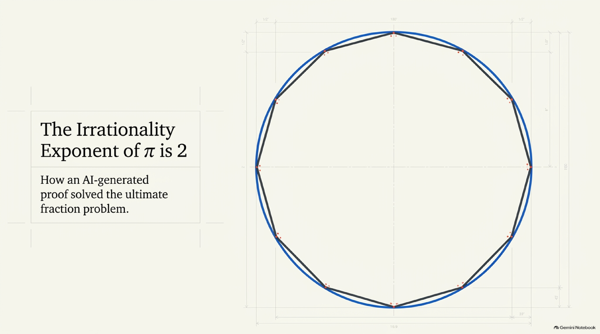

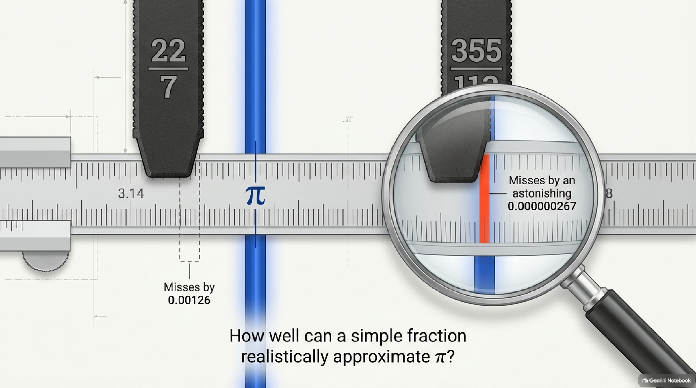

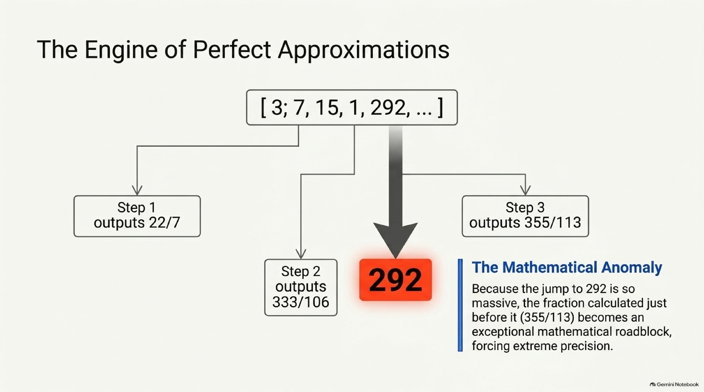

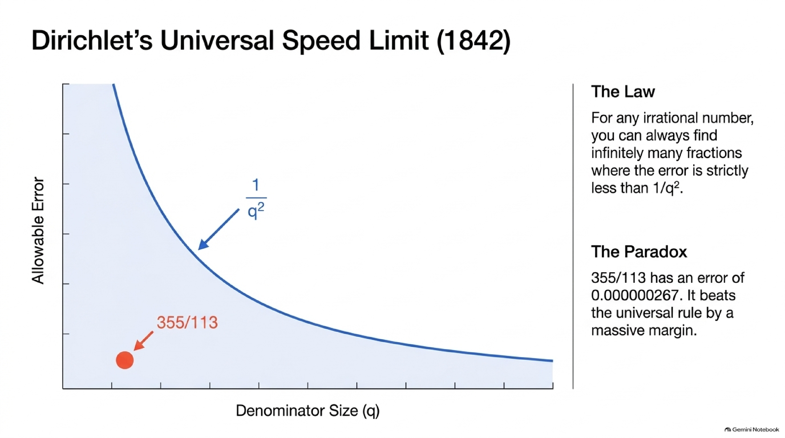


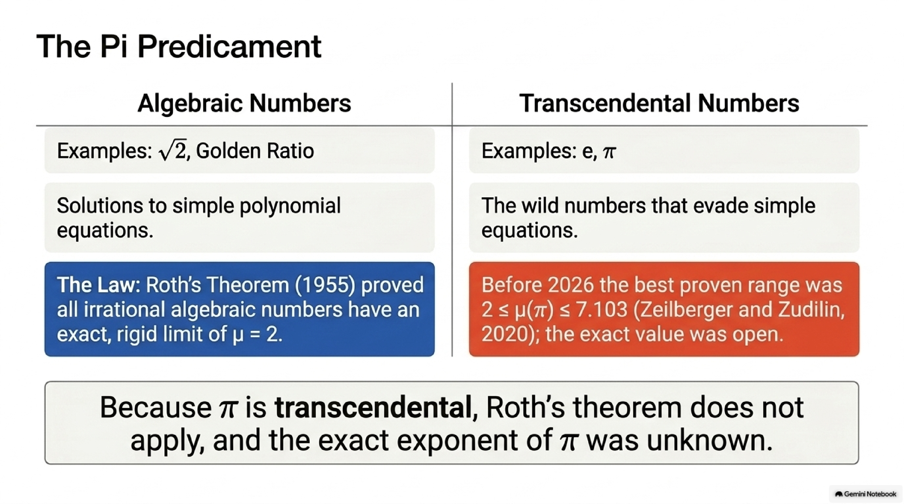


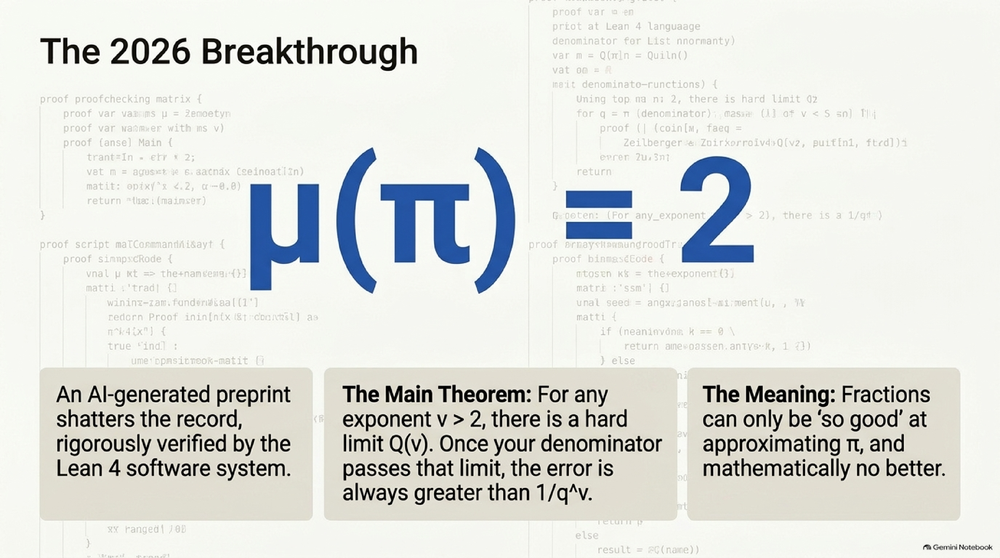

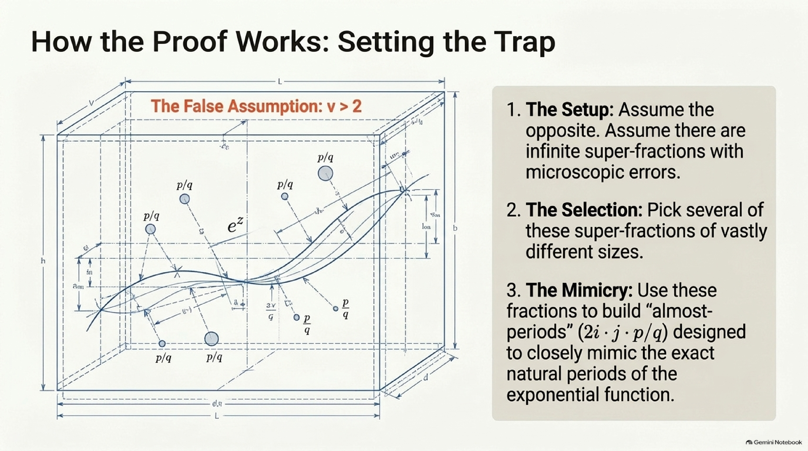


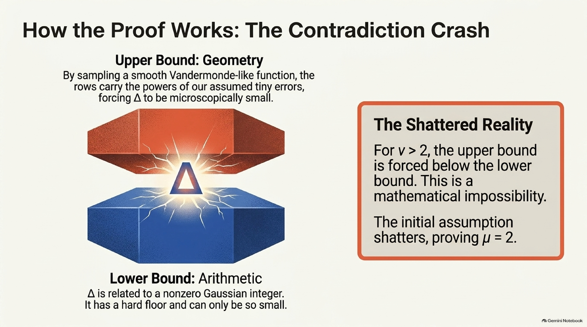

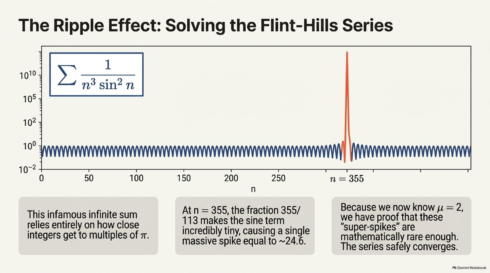


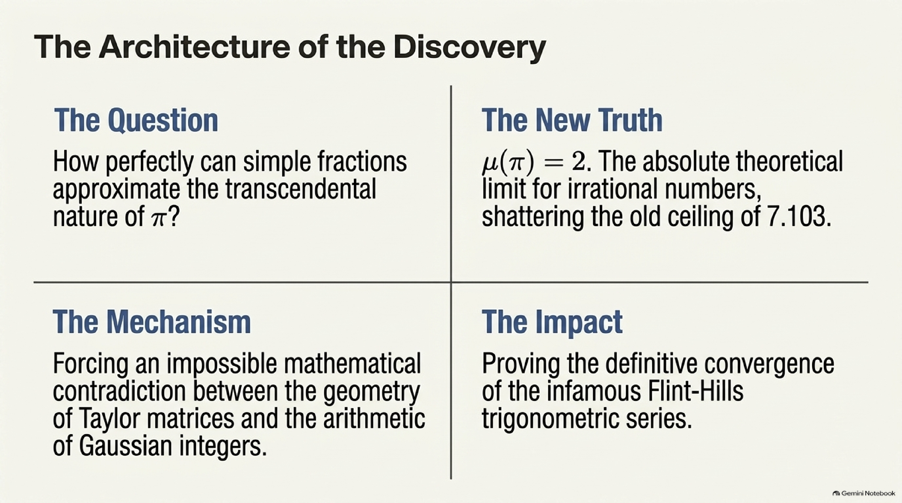

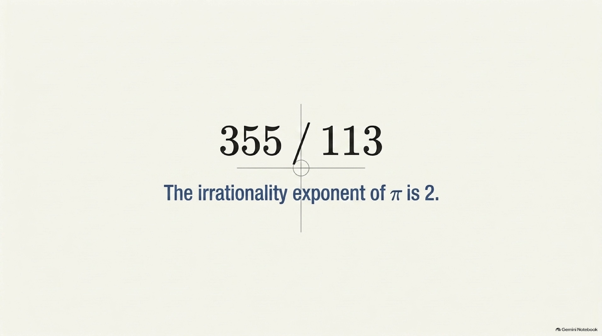

</details>

---

## How this explainer was made

1. The paper, its TeX source, the reasoning summary, the Lean scope document and the Lean challenge files were downloaded from [openai/math](https://github.com/openai/math).
2. The paper, the reasoning summary, the Lean scope document and the Wikipedia article on irrationality measures were loaded into a NotebookLM notebook through the [`notebooklm-mcp-cli`](https://github.com/jacob-bd/gemini-notebook-mcp-cli) MCP/CLI, which generated the slide deck and the overview infographic in [`assets/notebooklm/`](assets/notebooklm/). The rest of the usual set (timeline infographic, report, mind map, audio) was not generated because the shared NotebookLM quota ran out. NotebookLM's outputs contain mistakes, listed in the [errata](assets/README.md#errata), so they were used as visual aids rather than as the source of truth.
3. The text on this page was written by hand (with AI assistance) directly from the paper's TeX source: the introduction, the proof outline, and Sections 2–5. Historical dates were checked against the paper's bibliography, Wikipedia and MacTutor; the one date none of these confirms (Dirichlet, 1842) is marked as coming from my own knowledge. Every number in the tables and figures (continued fraction, convergents, errors, Flint–Hills partial sums) was computed for this explainer: with [mpmath](https://mpmath.org/) at high precision, and in double precision with compensated summation for the ten-million-term Flint–Hills sum, whose large terms were cross-checked with mpmath.

See [`PIPELINE.md`](../../PIPELINE.md) for the exact, repeatable steps.

*Citation for the underlying paper:*

```bibtex
@misc{OAI:The-irrationality-exponent-of-pi-is-2-September-24-2026,
  author = {{OpenAI}},
  title = {{The irrationality exponent of $\pi$ is $2$}},
  howpublished = {OpenAI Math Release preprint
                  \href{https://github.com/openai/math/blob/main/preprints/The-irrationality-exponent-of-pi-is-2-September-24-2026/paper.pdf}{OAI:The-irrationality-exponent-of-pi-is-2-September-24-2026}},
  year = {2026}
}
```
