# The rational Hodge conjecture for CM abelian varieties, explained for beginners

> - **Paper:** [*The rational Hodge conjecture for CM abelian varieties*](https://github.com/openai/math/blob/main/preprints/The-rational-Hodge-conjecture-for-CM-abelian-varieties-September-30-2026/paper.pdf), OpenAI, 30 September 2026 (53 pages)
> - **openai/math family:** 032, *Hodge and Kuga–Satake results for all projective K3 surfaces* · **Field:** algebraic geometry (Hodge theory), with arithmetic geometry
> - **Companions:** [The rational Hodge conjecture for products of K3 surfaces](https://github.com/openai/math/blob/main/preprints/The-rational-Hodge-conjecture-for-products-of-K3-surfaces-October-4-2026/hodge-conjecture-products-k3.pdf) (4 Oct 2026) · [Weil classes and Hodge classes on abelian powers](https://github.com/openai/math/blob/main/preprints/Weil-classes-and-Hodge-classes-on-abelian-powers-September-30-2026/paper.pdf) (30 Sep 2026) · related: [Milne's rationality conjecture for abelian varieties](https://github.com/openai/math/blob/main/preprints/Milnes-rationality-conjecture-for-abelian-varieties-September-23-2026/paper.pdf) (family 001, 23 Sep 2026)
> - **Formal proof:** none. openai/math has no Lean scope document for family 032, and its [formalization catalogue](https://github.com/openai/math/blob/main/lean/formalization.yaml) lists no paper from this family
> - **Who this is for:** anyone comfortable with complex numbers and basic linear algebra (vector spaces, dimension). No algebraic geometry needed for sections 1–4.

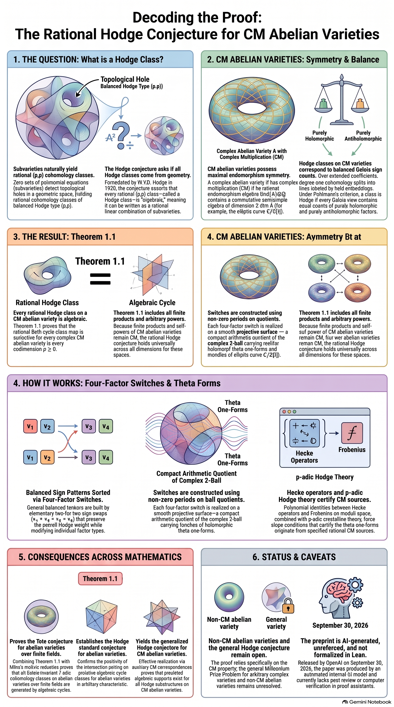

*AI-generated by NotebookLM. It dates Hodge's formulation to 1920 instead of 1950 and garbles some text; see the [errata](assets/README.md#errata).*

## Contents

- [TL;DR](#tldr)
- [How to read this](#how-to-read-this)
- [1. The problem](#1-the-problem)
- [2. A short history](#2-a-short-history)
- [3. What the paper proves](#3-what-the-paper-proves)
- [4. Why it matters](#4-why-it-matters)
- [5. The main idea of the proof](#5-the-main-idea-of-the-proof)
- [6. The people whose ideas this builds on](#6-the-people-whose-ideas-this-builds-on)
- [7. What it does not prove, and caveats](#7-what-it-does-not-prove-and-caveats)
- [8. Glossary](#8-glossary)
- [9. Slides, audio and other assets](#9-slides-audio-and-other-assets)
- [How this explainer was made](#how-this-explainer-was-made)

---

## TL;DR

- **The question.** A *variety* is a shape cut out by polynomial equations. Its cohomology records its "holes", and over the complex numbers every cohomology class splits into pieces of *Hodge type* $(a,b)$. Every subvariety gives a rational class of type $(p,p)$. The **Hodge conjecture** (Hodge, 1950; one of the Clay Millennium Prize Problems since 2000) asks for the converse: is every rational class of type $(p,p)$, a *Hodge class*, a rational combination of classes of subvarieties?
- **What was known.** Codimension 1 has been settled since the Lefschetz $(1,1)$ theorem of 1924. For *abelian varieties* (higher-dimensional doughnuts that are also groups), Deligne proved in 1982 that Hodge classes behave arithmetically like algebraic ones, and work of Deligne, André, Hazama and others reduced the problem on **CM abelian varieties**, the most symmetric ones, to special "Weil-type" classes and to relations among four labels. Those reductions said which classes would be enough. They did not build the cycles in all dimensions.
- **What this paper proves.** On **every complex abelian variety with complex multiplication**, in every dimension and every codimension, every rational Hodge class is a rational combination of classes of algebraic cycles (Theorem 1.1). Finite products and powers of CM abelian varieties are included.
- **Why that's a big deal.** Combined with theorems of J. S. Milne from 1999 and 2002, it gives the **Tate conjecture for every abelian variety over a finite field** and the **Hodge standard conjecture for abelian varieties in every characteristic**. It also gives the *generalized* Hodge conjecture for CM abelian varieties. The family's companion papers use it as an input, for products of K3 surfaces and for powers of certain abelian varieties.
- **What it doesn't do.** It does **not** prove the Hodge conjecture in general, nor even for all abelian varieties: CM abelian varieties are a special class. It is an AI-generated preprint that has not been peer reviewed or formalized in Lean.

## How to read this

| You have… | Read |
|---|---|
| 2 minutes | The TL;DR, the infographic above and [the first figure](#13-hodge-types-the-shaded-middle-column) |
| 15 minutes | Sections 1–4 and 7 |
| An hour, and you like algebra and geometry | Everything, including [section 5](#5-the-main-idea-of-the-proof) and its worked examples |

---

## 1. The problem

### 1.1 Shapes cut out by polynomials

A **complex projective variety** is the set of solutions of some polynomial equations, with complex-number coordinates, inside projective space (ordinary space with "points at infinity" added so that nothing escapes to infinity). Examples are a smooth plane cubic curve such as $y^2 = x^3 - x$, or a surface given by one equation in four homogeneous variables. Inside a variety $X$ we can draw smaller varieties, called **subvarieties**: points, curves, surfaces and so on. A subvariety $Z$ has a **codimension** $p$, the number of complex dimensions it is missing compared to $X$. A curve on a surface has codimension 1.

A complex dimension is two real dimensions. A complex curve is a real surface (a doughnut, a pretzel), and a complex surface is a real 4-dimensional object.

### 1.2 Holes and cohomology

**Cohomology** $H^k(X,\mathbb{Q})$ is a vector space that measures the $k$-dimensional "holes" of $X$, with rational-number coefficients. A doughnut has a 2-dimensional $H^1$: one loop around the hole and one loop through it.

A subvariety $Z$ of complex codimension $p$ has real codimension $2p$, and it determines a class $[Z]$ in $H^{2p}(X,\mathbb{Q})$. Rational combinations of such classes are called **algebraic classes**. The question is which cohomology classes arise this way.

### 1.3 Hodge types: the shaded middle column

Over the complex numbers, cohomology classes can be represented by differential forms built from the holomorphic differentials $dz_j$ and their conjugates $d\bar z_j$. A form with $a$ factors $dz$ and $b$ factors $d\bar z$ has **type** $(a,b)$. For smooth projective $X$, Hodge theory splits complex cohomology into these types:

$$H^k(X,\mathbb{C}) = \bigoplus_{a+b=k} H^{a,b}(X).$$

For an elliptic curve $\mathbb{C}/\Lambda$, $H^1$ is spanned by $dz$ (type $(1,0)$) and $d\bar z$ (type $(0,1)$). For an abelian surface, $H^2$ is spanned by $dz_1\wedge dz_2$, the four forms $dz_i\wedge d\bar z_j$, and $d\bar z_1\wedge d\bar z_2$, so its pieces have dimensions $1+4+1$.

A complex subvariety has "as many holomorphic directions as antiholomorphic ones", and its class always lands in the middle piece. So **the class of a codimension-$p$ subvariety is rational and of type $(p,p)$**.

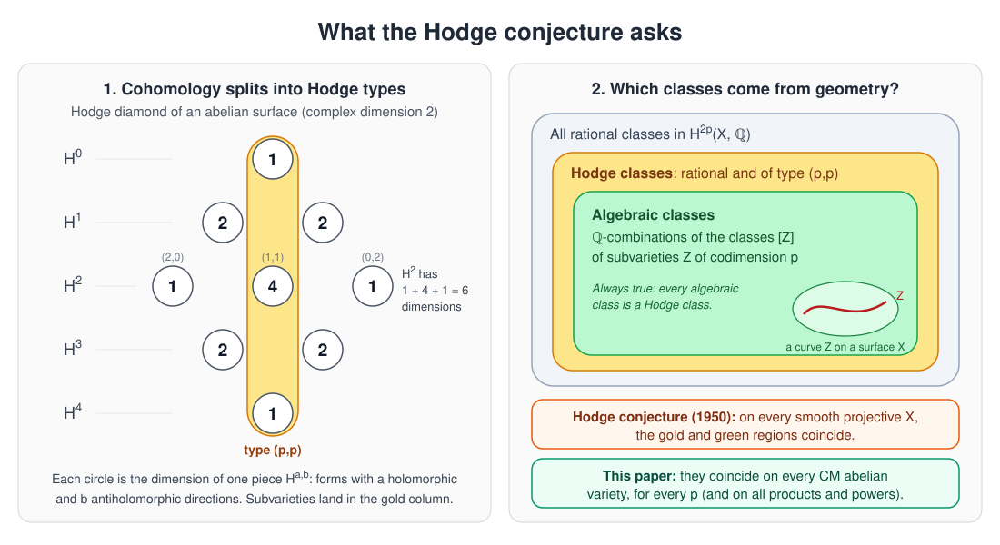

### 1.4 The conjecture

The rational classes of type $(p,p)$ are the **Hodge classes**:

$$\mathrm{Hdg}^{2p}(X) = H^{2p}(X,\mathbb{Q}) \cap H^{p,p}(X).$$

Every algebraic class is a Hodge class. Taking classes of cycles gives the **cycle class map** from $\mathrm{CH}^p(X)_{\mathbb{Q}}$, the codimension-$p$ cycles with rational coefficients up to rational equivalence, to the Hodge classes.

> **The rational Hodge conjecture.** For every smooth projective complex variety $X$ and every $p$, every Hodge class in $\mathrm{Hdg}^{2p}(X)$ is a rational combination of classes of subvarieties. Equivalently, the cycle class map onto $\mathrm{Hdg}^{2p}(X)$ is surjective.

Some context:

- **Rational coefficients matter.** Atiyah and Hirzebruch showed in 1962 that the version with integer coefficients is false.
- **Codimension 1 is known.** The Lefschetz $(1,1)$ theorem (1924) says every rational $(1,1)$ class is algebraic. With the hard Lefschetz theorem this also handles curves, which settles every variety of dimension at most 3.
- **In general it is wide open.** It is one of the seven Clay Millennium Prize Problems.

### 1.5 Abelian varieties

A complex **abelian variety** of dimension $g$ is a complex torus $\mathbb{C}^g/\Lambda$, with $\Lambda$ a lattice of rank $2g$, that can be embedded in projective space. It is both a variety and a group (you can add points). In dimension 1 these are the elliptic curves.

Abelian varieties have very simple cohomology. $H^1(A,\mathbb{Q})$ has dimension $2g$, and the whole cohomology is its exterior algebra, $H^{\ast}(A,\mathbb{Q}) = \Lambda^{\ast} H^1(A,\mathbb{Q})$. So a class in $H^{2p}$ is a combination of "words" of $2p$ letters from $H^1$. Its Hodge type counts how many letters are holomorphic and how many are antiholomorphic.

Divisor classes (codimension 1) are algebraic by Lefschetz, and so are their cup products. If every Hodge class were a product of divisor classes, the problem would be solved. It is not. **Weil classes** are the classic counterexample. When an imaginary quadratic field $K$ acts on an abelian variety of dimension $2n$, with its two embeddings occurring equally often in $H^{1,0}$, the top exterior power $\Lambda_K^{2n}H^1$ supplies a 2-dimensional rational space of classes of type $(n,n)$. These need not lie in the algebra generated by divisors; this already happens on abelian fourfolds (Weil, 1977; see also Moonen–Zarhin, 1999). Something genuinely new has to be built.

### 1.6 Complex multiplication: when Hodge types become a counting problem

Every abelian variety has the endomorphisms "multiply by an integer". Some have many more. The elliptic curve $\mathbb{C}/\mathbb{Z}[i]$ can also be multiplied by $i$, because $i\mathbb{Z}[i] = \mathbb{Z}[i]$.

> **Definition (paper, §1).** A complex abelian variety $A$ has **complex multiplication (CM)** if $\mathrm{End}(A)\otimes\mathbb{Q}$ contains a commutative semisimple $\mathbb{Q}$-algebra of dimension $2\dim A$. (A point counts as CM by convention.) Finite products and powers of CM abelian varieties are again CM.

For $\mathbb{C}/\mathbb{Z}[i]$ the algebra is $\mathbb{Q}(i)$, of dimension $2 = 2\cdot 1$.

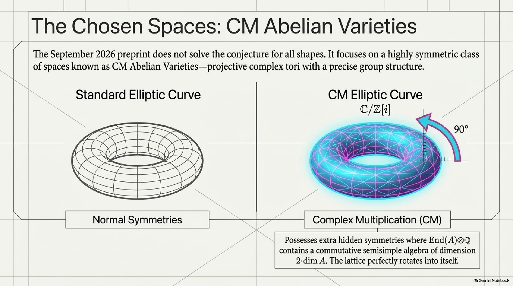

Why CM helps: by Lemma 2.3 of the paper, $H^1(A,\mathbb{Q})$ breaks into pieces that are lines over **CM fields** (fields such as $\mathbb{Q}(i)$ or $\mathbb{Q}(\zeta_7)$: totally imaginary quadratic extensions of totally real fields). After extending scalars to the algebraic numbers, each piece splits further into lines, **one for each embedding of the field into** $\mathbb{C}$. Each line is purely holomorphic, of type $(1,0)$, or purely antiholomorphic, of type $(0,1)$. The list of which embeddings are holomorphic is the **CM type**. On $\mathbb{C}/\mathbb{Z}[i]$, the line where $i$ acts as $+i$ is spanned by $dz$, and the line where it acts as $-i$ is spanned by $d\bar z$.

So on a CM abelian variety the cohomology has a basis of "monomials", wedge products of these lines, and each monomial has a definite Hodge type found by counting. A rational class must also look balanced after every Galois conjugation of its coefficients, because conjugation moves lines to other lines. **Pohlmann's balance criterion** (1968) says exactly this: a monomial lies in the span of the rational Hodge classes (after extending scalars) precisely when every Galois conjugate has equally many holomorphic and antiholomorphic factors.

On CM abelian varieties, then, *deciding* whether a class is Hodge is bookkeeping. *Proving it is algebraic* means building subvarieties, and no amount of counting does that. That is the problem this paper solves.

---

## 2. A short history

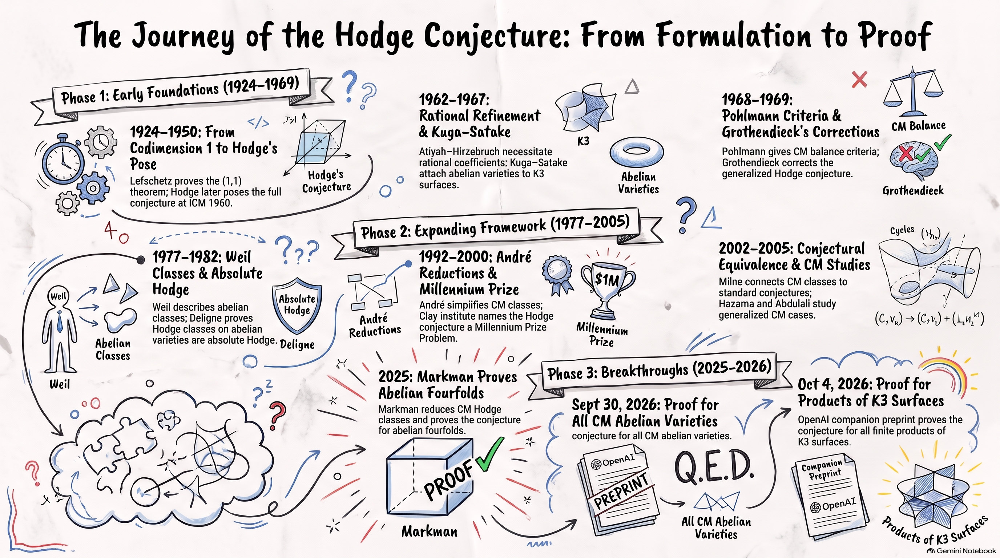

*AI-generated timeline. Its "ICM 1960" should be 1950, and Markman did not "reduce CM Hodge classes" (see the table below and the [errata](assets/README.md#errata)).*

| When | Who | What happened |
|---|---|---|
| 1924 | **Solomon Lefschetz** | The $(1,1)$ theorem: rational $(1,1)$ classes are algebraic. This settles codimension 1 |
| 1950 | **W. V. D. Hodge** | Poses the problem in his address to the International Congress of Mathematicians, Cambridge, Massachusetts (published 1952) |
| 1962 | **Michael Atiyah, Friedrich Hirzebruch** | The integer-coefficient version is false, so the conjecture is stated with $\mathbb{Q}$ |
| 1964 | **André Weil** | The Weil representation and its theta series, the analytic engine of Section 4 of the paper |
| 1967 | **Michio Kuga, Ichirō Satake** | Attach an abelian variety to a K3 surface (the Kuga–Satake construction), the bridge used by the K3 companion |
| 1968 | **Henry Pohlmann** | The balance criterion for Hodge classes on CM abelian varieties |
| 1969 | **Alexander Grothendieck** | Corrects Hodge's *generalized* conjecture ("Hodge's general conjecture is false for trivial reasons"); his *Standard conjectures on algebraic cycles* (a 1968 Bombay lecture) appears in print the same year |
| 1977 | **André Weil** | Weil classes: Hodge classes on abelian varieties with an imaginary quadratic action that are not explained by divisors in general, already on abelian fourfolds |
| 1982 | **Pierre Deligne** | Every Hodge class on an abelian variety is *absolute Hodge*. This is an arithmetic property that algebraic classes have, but it does not produce cycles |
| 1992 | **Yves André** | CM Hodge classes reduce to Weil-type classes on auxiliary CM abelian varieties |
| 1999 | **Ben Moonen, Yuri Zarhin** | Compute the Hodge groups of all abelian varieties of dimension at most 5: their Hodge classes come from divisor classes and Weil classes, and the Weil classes are really needed in some fourfold cases |
| 1999, 2002 | **J. S. Milne** | The Hodge conjecture for CM abelian varieties would imply the Tate conjecture for abelian varieties over finite fields (1999) and the Hodge standard conjecture for abelian varieties (2002) |
| 2000 | **Clay Mathematics Institute** | The Hodge conjecture becomes one of the seven Millennium Prize Problems |
| 2003, 2005 | **Fumio Hazama; Salman Abdulali** | Hazama's "arrangement method" describes balanced CM tensors by antipodal pairs and four-label relations, with a codimension-2 reduction; he and Abdulali (effective realization) derive the generalized conjecture for CM abelian varieties from the ordinary one |
| 2016 | **Nicolas Bergeron, John Millson, Colette Mœglin** | *The Hodge conjecture and arithmetic quotients of complex balls*; one of its calculations is a close predecessor of a step in Section 4 |
| 2020 (rev. 2022) | **J. S. Milne** | States André's reduction in the form the paper uses: a CM Hodge class is a sum of pullbacks of split Weil classes |
| 2024 (publ. 2026) | **Ziyang Gao, Emmanuel Ullmo** | Quadratic relations between periods on CM abelian varieties, using equivalent four-label relations |
| 2025 | **Eyal Markman** | Weil classes on abelian sixfolds of Weil type (polarization discriminant $-1$) are algebraic; hence the Hodge conjecture for all abelian fourfolds |
| 30 Sep – 4 Oct 2026 | **OpenAI** (internal model) | This paper (30 Sep), and companions that use it: powers of abelian varieties with a quadratic action (30 Sep) and products of K3 surfaces (4 Oct) |

---

## 3. What the paper proves

> **Main theorem (Theorem 1.1).** Let $`A`$ be a complex CM abelian variety. For every integer $`p\ge 0`$, the Betti cycle-class map $`\mathrm{cl}_B`$ from $`\mathrm{CH}^p(A)_{\mathbb{Q}}`$ to $`H^{2p}(A,\mathbb{Q})\cap H^{p,p}(A)`$ is surjective. In particular, the rational Hodge conjecture holds in every codimension on every finite product of complex CM abelian varieties and on every power of such a product.

In plain words: take any abelian variety with complex multiplication, of any dimension. Pick any rational cohomology class of type $(p,p)$. Then some rational combination of $p$-codimensional subvarieties has exactly that class. Nothing about the dimension, the CM field or the CM type is assumed.

Almost all of the work goes into one special case, a statement about **four factors**. Fix a Galois CM field $E$ with complex conjugation $c$. An **odd sign function** is a function $v$ from the Galois group $G_E$ to $\lbrace +1,-1\rbrace$ with $v(c\tau) = -v(\tau)$. It is the same thing as a CM type of $E$. Each $v$ gives a CM abelian variety $B(v)$, whose $H^1$ is $E$ with the embedding lines marked holomorphic where $v = +1$. Write $U(v)_1$ and $U(v)_c$ for its embedding lines labelled by the identity and by $c$.

> **The engine (Theorem 2.5, "four-factor switch").** If four odd sign functions satisfy $v_1+v_2 = v_3+v_4$, then the line $U(v_1)_1\otimes U(v_2)_1\otimes U(v_3)_c\otimes U(v_4)_c$ in $H^4$ of $B(v_1)\times B(v_2)\times B(v_3)\times B(v_4)$ is **algebraic**.

The relation $v_1+v_2 = v_3+v_4$ makes this line of type $(2,2)$ in every Galois conjugate, so by Pohlmann's criterion it lies in the span of the Hodge classes (after extending scalars). The theorem says it is algebraic, and the paper stresses that this "does not follow from this balance alone". Proposition 2.6 shows that the four-factor switch, for all $E$ and all such quadruples, implies Theorem 1.1.

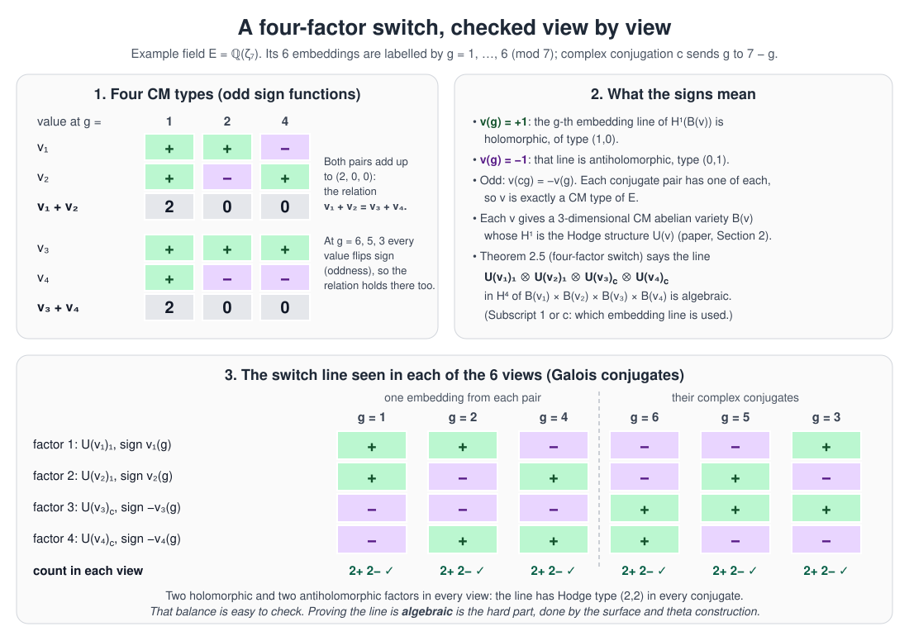

The paper is organized around this reduction:

| Section | What it does |
|---|---|
| §2 | Reduces Theorem 1.1 to the four-factor switch (Proposition 2.6) |
| §3 | A surface criterion: one surface with a nonzero period makes a switch algebraic (Proposition 3.1) |
| §4 | Builds that period from theta one-forms on a compact ball quotient (Corollary 4.7) |
| §5–6 | Proves the theta one-forms come from the right CM varieties (Theorem 5.1, Corollary 6.7) |
| §7 | Puts the pieces together |
| §8 | Consequences: generalized Hodge, Tate, Hodge standard, specialization |

---

## 4. Why it matters

| Consequence | Before | After (where in the paper) |
|---|---|---|
| **Generalized Hodge conjecture** for CM abelian varieties (Grothendieck's corrected form: a Hodge substructure whose twist is effective is supported on a closed subset of the predicted codimension) | Hazama (2003) reduced it to codimension-2 classes on a special family; Abdulali (2005) gave an effective-realization argument | Proved for every CM abelian variety, its products and powers (Corollary 8.2) |
| **Tate conjecture for abelian varieties over finite fields**: algebraic cycles span the Galois-invariant $\ell$-adic classes | Milne (1999) showed it would follow from the Hodge conjecture for CM abelian varieties | Proved for every abelian variety over every finite field, in every codimension and for every $\ell$ different from the characteristic. Numerical and $\ell$-adic homological equivalence also coincide (Corollary 8.3) |
| **Hodge standard conjecture** for abelian varieties: a sign-definiteness (positivity) property of the intersection form on primitive algebraic classes | Milne (2002) showed it would follow from the same input | Proved for abelian varieties over every algebraically closed field, in every characteristic (Corollary 8.4) |
| **Specialization of Hodge classes** to finite characteristic | Family 001 (Milne's rationality conjecture) gives a "CM transport" of specialized Hodge classes | For $A$ over $\overline{\mathbb{Q}}$ with good reduction at a prime $p$, every rational Hodge class specializes to the class of one rational algebraic cycle on the reduction, in all prime-to-$p$ and crystalline realizations at once (Remark 8.5) |
| **Products of K3 surfaces** (companion, 4 Oct 2026) | Known only in special cases, such as powers of K3 surfaces with a CM endomorphism field and particular families | Rational Hodge conjecture for every finite product of projective K3 surfaces. That paper cites Theorem 1.1 as one of its inputs |
| **Powers of abelian varieties with an imaginary-quadratic action** (companion, 30 Sep 2026) | Markman: the Weil classes on split Weil sixfolds are algebraic | Rational Hodge conjecture on every self-power of a split Weil sixfold, and of every abelian variety of dimension at most 5 with an imaginary-quadratic action. That paper calls Theorem 1.1 "the precise CM input used in this paper" |

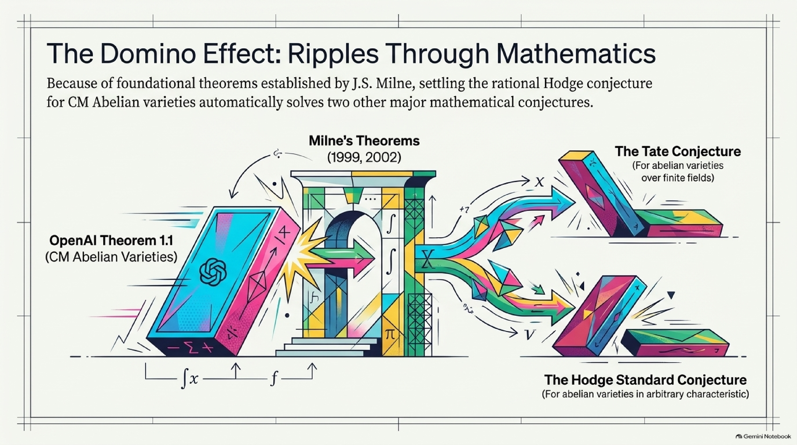

The Tate and standard-conjecture corollaries are the headline arithmetic consequences. Both are old open problems in positive characteristic, and Milne had shown more than twenty years ago that the CM Hodge conjecture over $\mathbb{C}$ would settle them for abelian varieties. The paper supplies that missing input and applies Milne's theorems, read together with Milne's own addenda to those papers (see [caveats](#7-what-it-does-not-prove-and-caveats)).

---

## 5. The main idea of the proof

The paper is 53 pages long. Here is its argument at three zoom levels.

### Level 1: the one-paragraph version

Think of a Hodge class on a CM abelian variety as a **balanced word**: a string of letters, each marked "holomorphic" or "antiholomorphic", that stays balanced in every Galois view. The paper does two things. First, a **sorting argument**: every balanced word can be turned into a trivially algebraic one by a sequence of elementary *two-for-two trades*, and each trade involves only four letters. Algebraic "glue" (correspondences built from divisors) lets the trades be composed. So it is enough to build the cycle for one trade. Second, a **construction for one trade**: find a single surface that maps to four auxiliary CM abelian varieties at once and "sees" all four letters with a nonzero overlap number. Its image, combined with a few divisor classes, then gives the needed cycle. Such a surface is found among **ball quotients**, surfaces made by folding the 2-dimensional complex ball by a group of arithmetic symmetries. Theta functions supply the needed one-forms on it, and arithmetic (Frobenius at a prime and Hecke operators) certifies that these one-forms come from exactly the right CM varieties.

> **Analogy:** to show a workshop can build every balanced structure, show (1) every structure can be assembled from copies of a single four-piece joint by standard gluing, and (2) the four-piece joint can actually be built. Step (2) is the hard engineering, and here it happens on a surface.

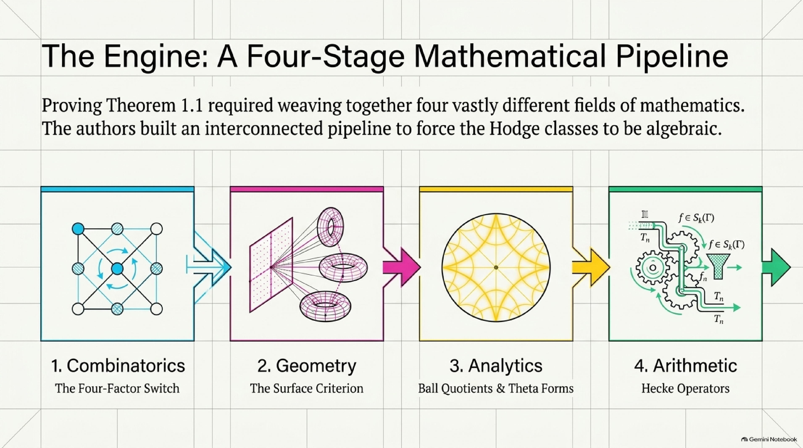

### Level 2: the step-by-step picture

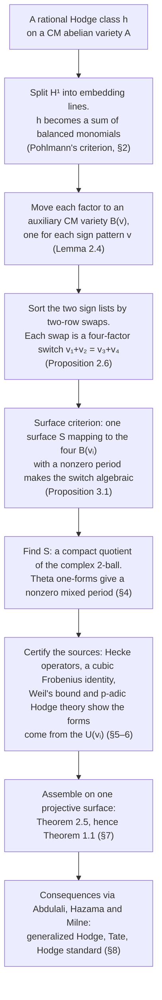
```mermaid
flowchart TD
    A["A rational Hodge class h<br/>on a CM abelian variety A"] --> B["Split H¹ into embedding lines.<br/>h becomes a sum of balanced monomials<br/>(Pohlmann's criterion, §2)"]
    B --> C["Move each factor to an auxiliary CM variety B(v),<br/>one for each sign pattern v (Lemma 2.4)"]
    C --> D["Sort the two sign lists by two-row swaps.<br/>Each swap is a four-factor switch v₁+v₂ = v₃+v₄<br/>(Proposition 2.6)"]
    D --> E["Surface criterion: one surface S mapping to the four B(vᵢ)<br/>with a nonzero period makes the switch algebraic<br/>(Proposition 3.1)"]
    E --> F["Find S: a compact quotient of the complex 2-ball.<br/>Theta one-forms give a nonzero mixed period (§4)"]
    F --> G["Certify the sources: Hecke operators, a cubic Frobenius identity,<br/>Weil's bound and p-adic Hodge theory show the forms<br/>come from the U(vᵢ) (§5–6)"]
    G --> H["Assemble on one projective surface:<br/>Theorem 2.5, hence Theorem 1.1 (§7)"]
    H --> I["Consequences via Abdulali, Hazama and Milne:<br/>generalized Hodge, Tate, Hodge standard (§8)"]
```

**Step 1: from a Hodge class to balanced sign lists.** Choose one Galois CM field $E$ containing all the CM fields that act on pieces of $H^1(A,\mathbb{Q})$. Over the algebraic numbers $H^1$ becomes a sum of embedding lines, and the exterior monomials in these lines split all of $H^{\ast}(A)$ into one-dimensional lines, each of one Hodge type. A rational Hodge class $h$ has components only on monomials that are balanced in every Galois view. Record each factor of such a monomial by its *complete type function*, an odd sign function telling whether that factor is holomorphic in each view. Balance means these $2p$ sign functions add up to zero. Splitting them into two halves, and flipping the signs of the second half, gives two lists $x = (x_1,\dots,x_p)$ and $y = (y_1,\dots,y_p)$ with equal sums.

**Step 2: one auxiliary CM variety for each sign pattern.** For every odd sign function $v$ there is a CM abelian variety $B(v)$ of dimension $[E^+:\mathbb{Q}]$ with $H^1(B(v),\mathbb{Q}) = U(v)$ (§2.2). Any embedding line of $A$ can be moved to the matching line of $B(v)$, and back, by an algebraic-coefficient combination of pullbacks along homomorphisms (Lemma 2.4). So it suffices to prove that the "transition line" from $x$ to $y$ on a product of these $B(v)$'s is algebraic.

**Step 3: sorting by two-row swaps.** Write $x$ and $y$ as sign matrices with $p$ rows and one column per conjugate pair of embeddings. Equal sums mean that, in each column, $x$ and $y$ have the same number of $+$ signs. In a column, the rows where $x$ has $+$ but $y$ has $-$ are exactly as many as the rows where it is the other way round. Pair them up and swap. Each swap replaces two rows $a, b$ by $a', b'$ with $a+b = a'+b'$, which is exactly a four-factor switch. Rows that don't change are joined to their copies by two-factor lines $U(v)_1\otimes U(v)_c$, which have type $(1,1)$ in every view and so are algebraic by Lefschetz. Consecutive transitions are composed by an algebraic correspondence that cups with powers of an ample divisor. The Hodge–Riemann positivity relations guarantee the resulting coefficient is not zero. Finally the paper transfers the lines back to $A$ (Lemma 2.4, which rests on "scalar descent", Lemma 2.1), pulls back along the diagonal of $A$, and sums the algebraic monomial components of $h$. Since $h$ itself is rational, its coefficients descend to $\mathbb{Q}$ (Equation (2.1)).

<details>
<summary><b>A worked example: sorting two sign lists by swaps</b> (a hand calculation)</summary>

Take $p = 3$ and the three embeddings $g = 1, 2, 4$ of $\mathbb{Q}(\zeta_7)$, one from each conjugate pair. In Step 3's language each list is a sign matrix with one row per entry $x_i$ and one column per embedding. The table below shows it transposed, which is easier to read:

| | $x_1$ | $x_2$ | $x_3$ | column sum | | $y_1$ | $y_2$ | $y_3$ | column sum |
|---|---|---|---|---|---|---|---|---|---|
| $g=1$ | $+$ | $-$ | $+$ | $+1$ | | $+$ | $+$ | $-$ | $+1$ |
| $g=2$ | $+$ | $-$ | $-$ | $-1$ | | $-$ | $+$ | $-$ | $-1$ |
| $g=4$ | $+$ | $-$ | $+$ | $+1$ | | $+$ | $-$ | $+$ | $+1$ |

(Each sign function $x_i$ or $y_i$ is a column here, and the table rows are the three embeddings, so $x_2$ reads $(-,-,-)$ from top to bottom. The values at the other three embeddings $6, 5, 3$ are the negatives, by oddness.) The sums agree at every embedding, so the lists can be sorted.

1. **Embedding 1.** $x_2$ has $-$ where $y_2$ has $+$, and $x_3$ has $+$ where $y_3$ has $-$. Swap these two entries. The lists $x_2 = (-,-,-)$ and $x_3 = (+,-,+)$ become $(+,-,-)$ and $(-,-,+)$. Check: both pairs add up to $(0,-2,0)$. That is one four-factor switch, and the unchanged list $x_1$ is carried along by a two-factor $(1,1)$ class.
2. **Embedding 2.** Now $x_1 = (+,+,+)$ and $x_2 = (+,-,-)$ disagree with $y_1, y_2$ there, in opposite directions. Swap. They become $(+,-,+)$ and $(+,+,-)$. Both pairs add up to $(2,0,0)$: a second switch, with $x_3$ carried along.
3. **Embedding 4.** Everything already agrees. Done: $x$ has become $y$ in two switches.

The second switch, $(+,+,+) + (+,-,-) = (+,-,+) + (+,+,-)$, is the same relation as in the figure in [section 3](#3-what-the-paper-proves), with the two sides exchanged. The figure checks it view by view.
</details>

**Step 4: the surface criterion (Proposition 3.1).** Suppose there is one smooth projective surface $S$, rational Hodge maps $h_i$ from $U(v_i)$ to $H^1(S,\mathbb{Q})$, and vectors $\alpha_i$ on the four chosen lines such that

$$\int_S h_1(\alpha_1)\cup h_2(\alpha_2)\cup h_3(\alpha_3)\cup h_4(\alpha_4)\neq 0.$$

Degree-one Hodge maps come from actual morphisms: up to a whole-number multiple, $h_i$ is pullback along a map $f_i$ from $S$ to $B(v_i)$ (Lemma 2.2). The image of $S$ in the product of the four $B(v_i)$ is an algebraic 2-dimensional cycle $Z$, and the nonzero integral says $Z$ pairs nontrivially with the switch line. That is a nonzero *functional* on the line, not yet a vector on it. Four divisor classes, one on each $B(v_i)\times B(v_i)$ and algebraic by Lefschetz, turn it into one: pushing $Z$ through the correspondence built from these divisors gives $k$ times a generator of the conjugate switch line, where $k\neq 0$ is the integral above, and a complex conjugation of coefficients then gives the switch line itself. So the whole problem becomes: **find four degree-one classes on one surface, with the right CM sources, whose cup product has a nonzero integral.**

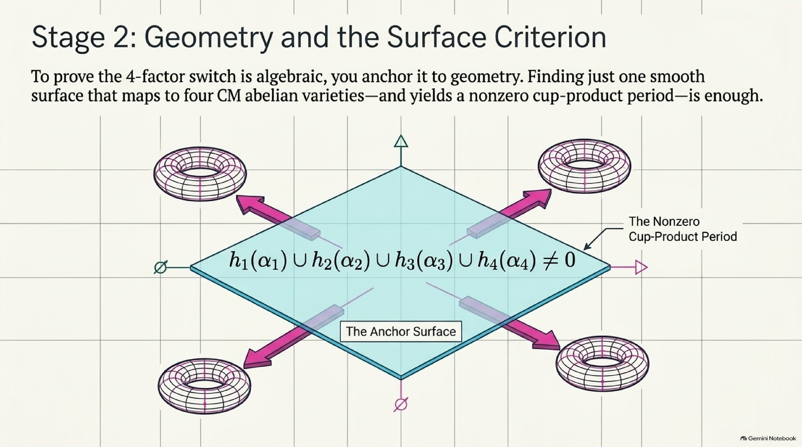

**Step 5: theta one-forms on a ball quotient (§4).** Take a 3-dimensional Hermitian space $V$ over $E$ that has signature $(2,1)$ at one distinguished embedding and is positive definite at all other real places. Its special unitary group acts on the **complex 2-ball** $D$ (the negative lines in $V$), and its arithmetic subgroups give **compact** quotients $X = \Gamma\backslash D$, which are smooth compact surfaces at deep enough level. For each sign function, theta series from the Weil representation give **holomorphic one-forms** $\Theta_i(\phi)$, and their values span every cotangent space (Proposition 4.5). The paper needs a nonzero *mixed* period, with two holomorphic and two antiholomorphic factors. A rank-two theta construction gives a total two-form for the Hermitian plane $W = W_1\perp W_2$. Because $v_1+v_2 = v_3+v_4$, the pairs $\lbrace v_1,v_2\rbrace$ and $\lbrace v_3,v_4\rbrace$ have the same local signs at each compact place. Weak approximation then finds a second rational splitting $W = W_3\perp W_4$ whose local data are as close as desired to the first. The total form varies continuously, so its pairing with the first form stays nonzero (Corollary 4.7). Expanding both forms as sums of wedges of one-forms yields a nonzero period $\int \Theta_1\wedge\Theta_2\wedge\overline{\Theta_3}\wedge\overline{\Theta_4}$.

**Step 6: certifying the CM sources (§5–6).** The theta one-forms are complex classes. The surface criterion needs them to come from the rational Hodge structures $U(v_i)$. To prove this, the paper:

1. realizes the ball quotients as components of a projective moduli space of polarized abelian varieties with an $E$-action (Lemma 5.2);
2. makes the Hecke operators (correspondences given by isogenies) into algebraic endomorphisms of the product of the components' Albanese varieties (Lemma 5.4);
3. counts isogeny neighbours at ordinary points modulo a suitable prime $q$ to get a cubic identity between Frobenius $\Phi$ and three Hecke operators: $\Phi^3 - D_1\Phi^2 + qD_2\Phi - q^3D_3 = 0$ (Proposition 5.5);
4. computes the Hecke (Satake) parameters of the theta forms. The $q$-adic sizes of the Galois conjugates of one parameter encode the signs $v(g)$ (Proposition 6.3);
5. combines the cubic identity with **Weil's theorem** that Frobenius eigenvalues have absolute value $q^{1/2}$. This singles out one eigenvalue, whose $q$-adic valuation is $0$ or $1$ according to the sign. **$p$-adic Hodge theory** (weak admissibility) then turns valuation $1$ into "holomorphic" and $0$ into "antiholomorphic" (Lemma 6.5, Proposition 6.6). Doing this in every Galois view recovers the whole CM type $v$, and scalar descent gives the rational Hodge maps (Theorem 5.1).

**Step 7: assembly (§7).** All four families of one-forms are pulled back to one common projective surface $Y$. A nonzero term of the expanded period is picked, and the surface criterion applies. That proves Theorem 2.5, and Proposition 2.6 turns it into Theorem 1.1.

### Level 3: two key formulas, for readers who know some Hodge theory

**From a surface to a vector on the line.** In Proposition 3.1, write $A$ for the product of the four $B(v_i)$, $n = \dim A$, $Z = \mathrm{cl}(f_{\ast}[S])$, and $t_\alpha = \alpha_1\otimes\cdots\otimes\alpha_4$. Let $A'$ be a second copy, $t_\beta = \beta_1\otimes\cdots\otimes\beta_4$ with $\beta_i$ on the conjugate lines of the copies, and $K = \prod_i \pi_i^{\ast}(\alpha_i\otimes\beta_i)$, where $\pi_i$ picks out the $i$-th old and new factors. Each $\alpha_i\otimes\beta_i$ is of type $(1,1)$ in every conjugate, hence algebraic with $\overline{\mathbb{Q}}$-coefficients by scalar descent and Lefschetz. Then

```math
p'_{\ast}\bigl(p^{\ast}Z \cup K\bigr) \;=\; \Bigl(\int_A Z\cup t_\alpha\Bigr)\, t_\beta \;=\; k\, t_\beta ,\qquad k\in\overline{\mathbb{Q}}^{\times},
```

where $p$ and $p'$ project $A\times A'$ to its factors. The left side is algebraic of codimension $(n-2)+4-n = 2$, and dividing by $k$ shows the line spanned by $t_\beta$ is algebraic. Complex conjugation of coefficients then moves the labels $(c,c,1,1)$ back to $(1,1,c,c)$.

**Gluing transitions (Proposition 2.6).** For lists $a, b, e$ of sign functions, put $A_a = \prod_i B(a_i)$ and similarly $A_b$, $A_e$. Suppose the consecutive transition lines have algebraic generators $t_{ab} = \alpha_1\otimes\cdots\otimes\alpha_p\otimes\beta_1\otimes\cdots\otimes\beta_p$ on $A_a\times A_b$ and $t_{be} = \gamma_1\otimes\cdots\otimes\gamma_p\otimes\delta_1\otimes\cdots\otimes\delta_p$ on $A_b\times A_e$, with $\beta_i\in U(b_i)_c$ and $\gamma_i\in U(b_i)_1$. Let $r_{ab}, r_{be}, r_{ae}$ be the projections from $A_a\times A_b\times A_e$, and $t_{ae} = \alpha_1\otimes\cdots\otimes\alpha_p\otimes\delta_1\otimes\cdots\otimes\delta_p$. With $\ell_i$ an ample class on $B(b_i)$ and $s = [E^+:\mathbb{Q}] = \dim B(b_i)$,

```math
(r_{ae})_{\ast}\Bigl(r_{ab}^{\ast}t_{ab}\cup r_{be}^{\ast}t_{be}\cup\prod_{i=1}^{p}\ell_i^{\,s-1}\Bigr) = (-1)^{p(p-1)/2}\Bigl(\prod_{i=1}^{p}q_i\Bigr)t_{ae},\qquad q_i=\int_{B(b_i)}\beta_i\wedge\gamma_i\wedge\ell_i^{\,s-1}.
```

Here $\gamma_i$ is a nonzero multiple of $\bar\beta_i$, so Hodge–Riemann positivity makes every $q_i\neq 0$. The codimension count is $p+p+p(s-1)-ps = p$.

<details>
<summary><b>Which Frobenius root survives</b> (the arithmetic heart of §6)</summary>

On a generalized Hecke eigenspace containing a theta class, the cubic identity of Proposition 5.5, evaluated at the Hecke eigenvalues, forces every Frobenius eigenvalue to be one of

```math
b\,q^{3/2},\qquad b\,q^{1/2},\qquad q\,b\,e' ,
```

where every complex conjugate of $b$ and $e'$ has absolute value $1$. Their absolute values are $q^{3/2}$, $q^{1/2}$ and $q$. Weil's theorem for abelian varieties over $\mathbb{F}_q$ allows only absolute value $q^{1/2}$, so **only $b q^{1/2}$ survives**. Its $q$-adic valuation is

```math
\nu\bigl(b\,q^{1/2}\bigr) = \tfrac12 - \tfrac13\,\nu(e') = \tfrac12 + \tfrac12\,v(g) \in \lbrace 0, 1\rbrace ,
```

using Proposition 6.3, which says $\nu(\sigma e) = -\tfrac32 v(g)$ for the Galois conjugate $\sigma e$ with $\sigma$ restricting to $g$. The Hecke projector onto this eigenspace preserves the Hodge filtration. Weak admissibility then forces the whole eigenspace to be of type $(1,0)$ when the slope is $1$ (that is, $v(g) = +1$) and of type $(0,1)$ when it is $0$. So the arithmetic at a single prime reads off the CM type $v$, view by view.
</details>

---

## 6. The people whose ideas this builds on

| Person | Idea | Where it shows up in the proof |
|---|---|---|
| **W. V. D. Hodge** | The problem itself; Hodge theory | The statement of Theorem 1.1 |
| **Solomon Lefschetz** | The $(1,1)$ theorem | Supplies every two-factor tensor and the divisor kernels in the surface criterion |
| **Henry Pohlmann** | The balance criterion on CM abelian varieties | Step 1: which monomials are Hodge |
| **André Weil** | Weil classes; the Weil representation and rational theta covariance; Weil's theorem on Frobenius eigenvalues | The motivating difficulty; theta one-forms in §4; root selection in §6 |
| **Pierre Deligne, Yves André, J. S. Milne** | Absolute Hodge classes; reduction of CM Hodge classes to (split) Weil classes | The background reductions that the paper turns into constructions |
| **Fumio Hazama, Ziyang Gao, Emmanuel Ullmo** | Four-label relations on CM types; quadratic period relations | The idea that four-factor relations generate everything; Proposition 2.6 proves the needed tensor version directly |
| **Ben Moonen, Yuri Zarhin; Eyal Markman** | Hodge classes in dimension at most 5 (divisor and Weil classes); algebraicity of Weil classes on sixfolds | Context: why new cycles are needed |
| **Armand Borel, Harish-Chandra** | Arithmetic subgroups and compactness | The ball quotients in §4 are compact |
| **Stephen Kudla, John Millson** | (Kudla) local splittings of the Weil representation for unitary groups; (Kudla–Millson) differential-form theta kernels in the unitary setting | The theta one-forms in §4 |
| **Nicolas Bergeron, John Millson, Colette Mœglin** | Work on the Hodge conjecture for arithmetic quotients of complex balls | Their pure-cocycle product calculation is a close predecessor of the rank-two projection in §4 |
| **N. Borade, J. Franzel, J. Girsch, W. Yao, Q. Yu, E. Zelingher** | A formulation of the unitary splittings and their local and adelic compatibility | Descent of theta forms to congruence quotients (§4) |
| **Benedict Gross** (Satake isomorphism; formula attributed to Tamagawa) | Hecke algebras and their Satake parameters | The theta Hecke parameters in §6 |
| **Bhargav Bhatt, Matthew Morrow, Peter Scholze**, and $p$-adic Hodge theory | Crystalline comparison; weak admissibility | Turning Frobenius slopes into Hodge types (Lemma 6.5) |
| **Alexander Grothendieck, Salman Abdulali** | The corrected generalized Hodge conjecture; effective realization | Corollary 8.2 |
| **J. S. Milne** | Hodge for CM implies Tate and the Hodge standard conjecture for abelian varieties | Corollaries 8.3 and 8.4 |

---

## 7. What it does not prove, and caveats

> [!IMPORTANT]
> **This is not a proof of the Hodge conjecture.** Theorem 1.1 covers abelian varieties with complex multiplication, and their products and powers. The conjecture for general varieties, and even for general (non-CM) abelian varieties, is not claimed. The paper's own specialization remark (Remark 8.5) says it "asserts algebraicity on the special fiber, not the Hodge conjecture for arbitrary complex abelian varieties". The theorem is also stated with rational coefficients only.

> [!NOTE]
> **Provenance.** The paper is part of the [openai/math](https://github.com/openai/math) release of manuscripts produced by an internal OpenAI model. According to that repository's README, the proof of the Hodge conjecture for CM abelian varieties was an *exception* to the model's standard fixed procedure. The README does not say what was different.

> [!WARNING]
> **Verification status.** There is **no Lean formalization**. openai/math has no `lean/docs/032.md`, and `lean/formalization.yaml` lists no paper from family 032 (checked 7 October 2026). The openai/math README warns that "some of the unformalized results could have issues". As of October 2026 this is a preprint that has not been peer reviewed. Because it would settle long-standing open problems, independent expert checking matters especially here. This explainer reports what the paper claims and did not check the proof.

> [!NOTE]
> **The consequences lean on earlier work.** Corollaries 8.3 and 8.4 apply Milne's 1999 and 2002 theorems, and the paper says it uses them together with Milne's own addenda (posted on his website) and a corrected choice of auxiliary fields. Corollary 8.2 follows Abdulali's and Hazama's arguments. Remark 8.5 uses the CM transport from the family-001 paper on Milne's rationality conjecture, and the paper notes this is "not an input to Theorem 1.1".

> [!TIP]
> **Simplifications.** To stay readable, this explainer suppresses polarizations, levels, the normalization to sign functions positive at the identity (Lemma 2.7), Tate twists, and the distinction between rational and algebraic-number coefficients. Every precise statement is in the paper.

---

## 8. Glossary

| Term | Meaning |
|---|---|
| **Smooth projective variety** | A shape without singular points, cut out by polynomial equations in projective space over $\mathbb{C}$ |
| **Subvariety, codimension** | A smaller variety inside $X$; its codimension is how many complex dimensions it is missing |
| **Cohomology** $H^k(X,\mathbb{Q})$ | A vector space measuring the $k$-dimensional holes of $X$, with rational coefficients |
| **Hodge decomposition, type** $(a,b)$ | The splitting of $H^k(X,\mathbb{C})$ by how many holomorphic ($dz$) and antiholomorphic ($d\bar z$) directions a form has |
| **Hodge class** | A rational class of type $(p,p)$ |
| **Algebraic cycle / algebraic class** | A rational combination of subvarieties / of their cohomology classes |
| **Cycle class map**, $\mathrm{CH}^p(X)_{\mathbb{Q}}$ | The map sending a cycle (up to rational equivalence, with $\mathbb{Q}$-coefficients) to its cohomology class |
| **Divisor** | A codimension-1 cycle. Its classes are handled by the Lefschetz $(1,1)$ theorem |
| **Abelian variety** | A projective complex torus $\mathbb{C}^g/\Lambda$; a variety that is also a group. Dimension 1: elliptic curves |
| **CM field** | A totally imaginary quadratic extension of a totally real number field, e.g. $\mathbb{Q}(i)$ or $\mathbb{Q}(\zeta_7)$ |
| **Complex multiplication (CM)** | $\mathrm{End}(A)\otimes\mathbb{Q}$ contains a commutative semisimple algebra of dimension $2\dim A$ |
| **Embedding line** | After extending scalars, the line of $H^1$ on which the CM field acts through one embedding into $\mathbb{C}$; it is purely $(1,0)$ or purely $(0,1)$ |
| **CM type / odd sign function** | The choice of which embedding lines are holomorphic, one from each conjugate pair; the paper writes it as $v$ with $v(c\tau) = -v(\tau)$ |
| **Balance (Pohlmann's criterion)** | A tensor of embedding lines is Hodge exactly when every Galois conjugate has equally many holomorphic and antiholomorphic factors |
| **Weil class** | A Hodge class on an abelian variety with an imaginary quadratic action, built from a top exterior power; often not a product of divisors |
| **Four-factor switch** | The paper's Theorem 2.5: the balanced line $U(v_1)_1\otimes U(v_2)_1\otimes U(v_3)_c\otimes U(v_4)_c$ is algebraic when $v_1+v_2 = v_3+v_4$ |
| **Correspondence** | A cycle on a product $X\times Y$, used as a "map" between cohomologies |
| **Complex ball, ball quotient** | The unit ball in $\mathbb{C}^2$ as a symmetric space; its quotient by an arithmetic group is a compact surface here |
| **Theta series, Weil representation** | Automorphic functions built from a quadratic or Hermitian space; here they produce holomorphic one-forms on ball quotients |
| **Hecke operator** | A correspondence on a moduli space defined by isogenies; it acts on cohomology and commutes with Frobenius |
| **Frobenius, Weil's theorem** | The $q$-power map on a variety over $\mathbb{F}_q$; for abelian varieties all its eigenvalues on $H^1$ have absolute value $q^{1/2}$ |
| **Slope, weak admissibility** | The $q$-adic size of a Frobenius eigenvalue; a $p$-adic Hodge theory condition that ties slopes to Hodge filtrations |
| **Tate conjecture** | The $\ell$-adic analogue of the Hodge conjecture: cycles span the Galois-invariant classes |
| **Hodge standard conjecture** | One of Grothendieck's standard conjectures: a positivity property of the intersection form on primitive algebraic classes |
| **Generalized Hodge conjecture** | A Hodge substructure with the right Hodge types is supported on a closed subset of the predicted codimension (Grothendieck's corrected form) |
| **K3 surface, Kuga–Satake** | A simply connected surface with a nowhere-vanishing 2-form; Kuga–Satake attach an abelian variety to it. Used by the K3 companion |
| **Lean 4** | A proof assistant that mechanically checks every step of a proof. Not used for this paper |

---

## 9. Slides, audio and other assets

Everything in `assets/notebooklm/` was generated with **Google NotebookLM** (now "Gemini Notebook") from the paper, the two companions and the Wikipedia article on the Hodge conjecture. The report and the mind map used only the three papers. The outputs are kept exactly as NotebookLM produced them. They are AI-generated, so see the [errata](assets/README.md#errata) before relying on any detail. In particular, slides 8, 12 and 15 contain the most serious errors, and no slide was revised.

| Asset | What it is |
|---|---|
| [Slide deck (PDF)](assets/notebooklm/slides.pdf) ([PPTX](assets/notebooklm/slides.pptx)) | 15-slide beginner deck |
| [Infographic: overview](assets/notebooklm/infographic-overview.png) | The one-page summary shown at the top |
| [Infographic: history timeline](assets/notebooklm/infographic-history-timeline.png) | From Lefschetz (1924) to October 2026 |
| [Audio overview (about 1.7 min)](assets/notebooklm/audio-overview-brief.m4a) | A short podcast-style summary (not reviewed) |
| [Beginner report](assets/notebooklm/beginner-explainer-report.md) | NotebookLM's long-form written explainer, fairly technical |
| [Mind map](assets/notebooklm/mindmaps.md) | How the proof fits together, with branches for the two companions |
| [Hodge conjecture figure](assets/figures/hodge-conjecture.svg) ([PNG](assets/figures/hodge-conjecture.png)) | Hand-made diagram used in section 1 |
| [Four-factor switch figure](assets/figures/four-factor-switch.svg) ([PNG](assets/figures/four-factor-switch.png)) | Hand-made worked example over $\mathbb{Q}(\zeta_7)$, used in section 3 |

<details>
<summary><b>All 15 slides</b> (click to expand)</summary>

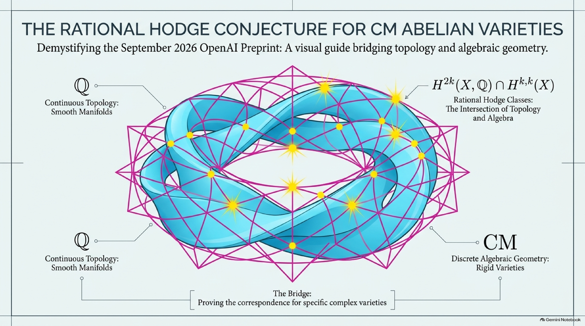

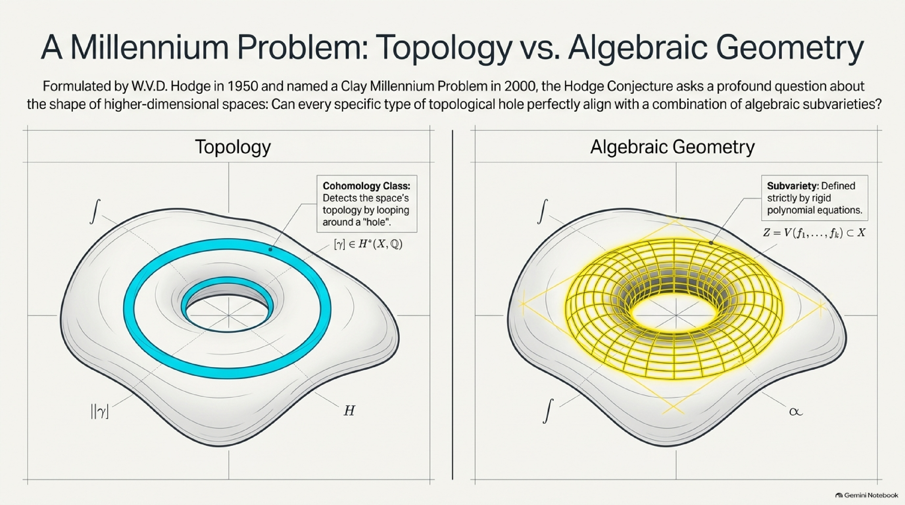

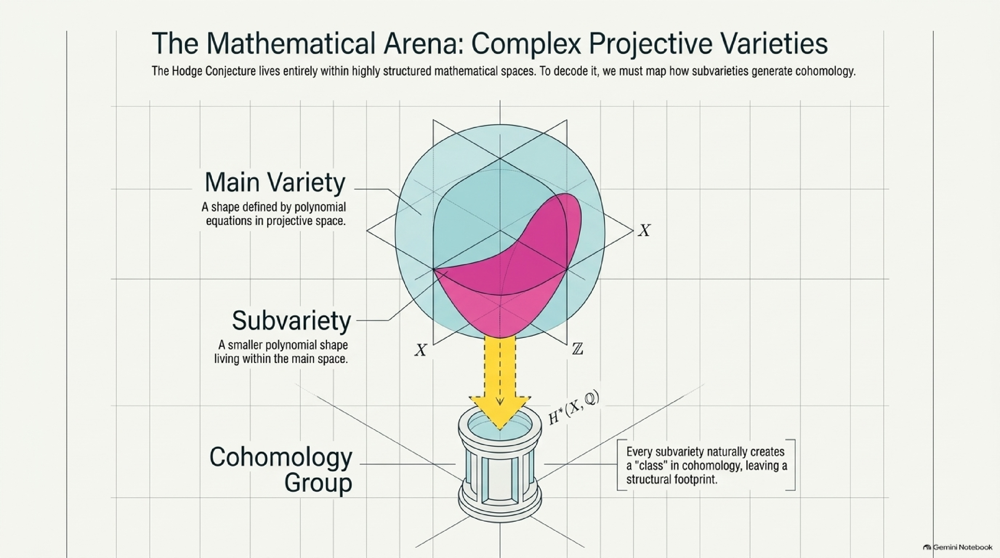

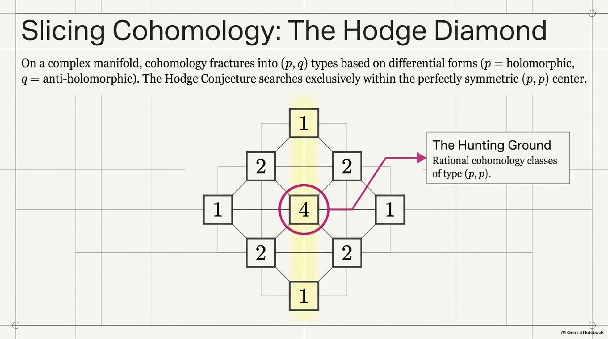

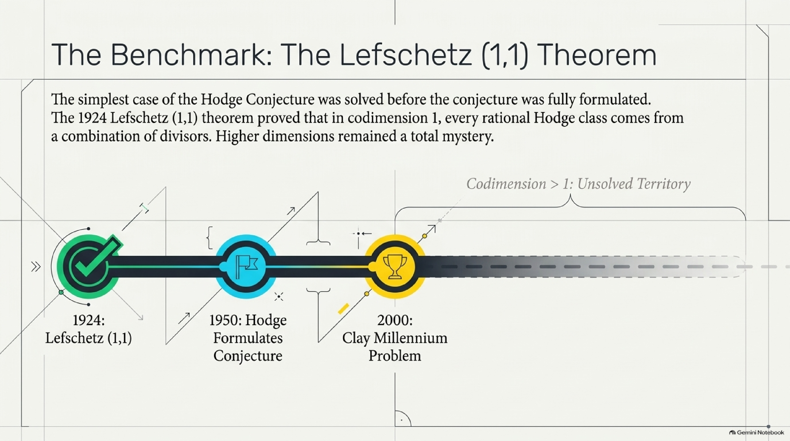


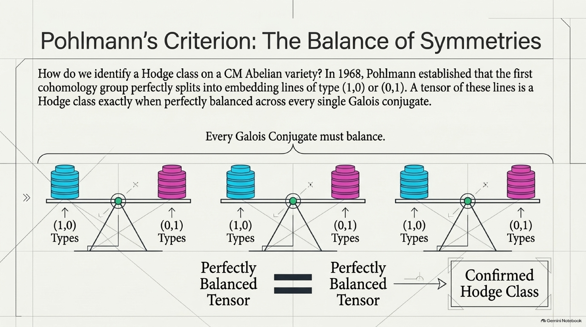

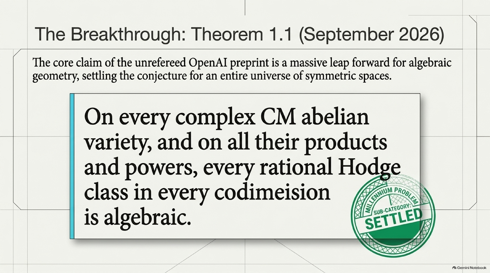


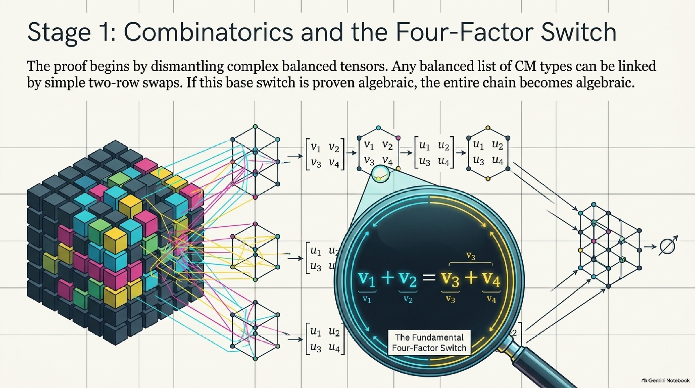


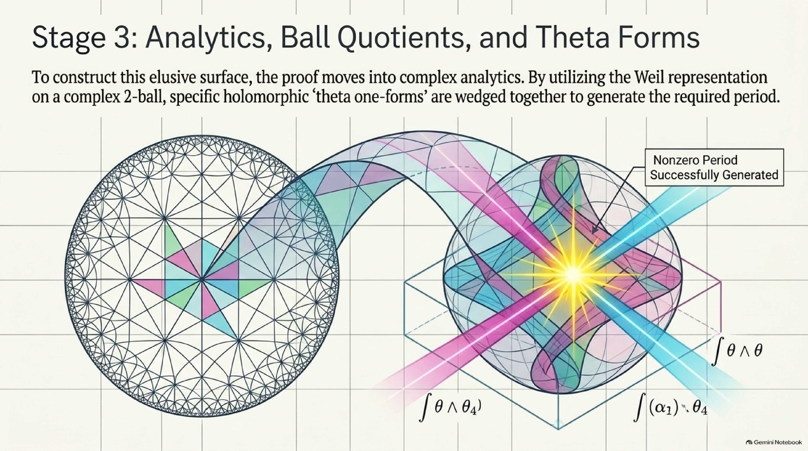

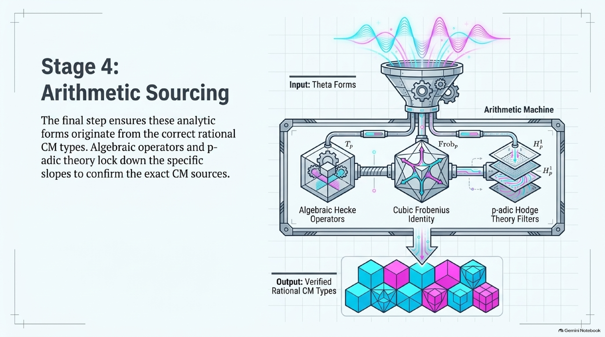


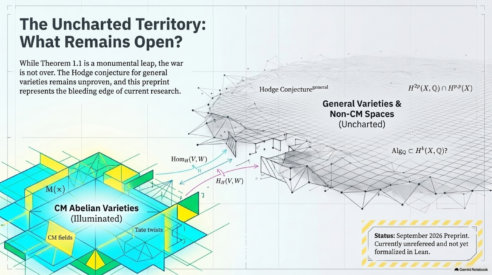

</details>

---

## How this explainer was made

1. The paper, its TeX source and the companion papers were downloaded from [openai/math](https://github.com/openai/math/tree/main/preprints).
2. They were loaded into a NotebookLM notebook through the [`notebooklm-mcp-cli`](https://github.com/jacob-bd/gemini-notebook-mcp-cli) MCP/CLI, together with the Wikipedia article on the Hodge conjecture. The slides, infographics, report, mind map and audio in [`assets/notebooklm/`](assets/notebooklm/) were generated in a notebook on a second NotebookLM account, to share the usage quota.
3. The text on this page was written by hand (with AI assistance) directly from the paper's introduction, Sections 2, 3, 7 and 8, the statements of Sections 4–6, and the introductions of the two companions. The worked examples and both figures were made by hand and checked against the paper's definitions. NotebookLM's outputs contain mistakes, listed in the [errata](assets/README.md#errata), so they were used as visual and structural aids rather than as the source of truth.

See [`PIPELINE.md`](../../PIPELINE.md) for the exact, repeatable steps.

*Citation for the underlying paper (from its openai/math directory):*

```bibtex
@misc{OAI:The-rational-Hodge-conjecture-for-CM-abelian-varieties-September-30-2026,
  author = {{OpenAI}},
  title = {{The rational Hodge conjecture for CM abelian varieties}},
  howpublished = {OpenAI Math Release preprint
                  \href{https://github.com/openai/math/blob/main/preprints/The-rational-Hodge-conjecture-for-CM-abelian-varieties-September-30-2026/paper.pdf}{OAI:The-rational-Hodge-conjecture-for-CM-abelian-varieties-September-30-2026}},
  year = {2026}
}
```
