# Thompson's group F is nonamenable, explained for beginners

> - **Paper:** [*Thompson's group F is nonamenable*](https://github.com/openai/math/blob/main/preprints/Thompsons-group-F-is-nonamenable-September-23-2026/paper.pdf), OpenAI, 23 September 2026 (13 pages, including the appendix and references)
> - **openai/math family:** 248, *Thompson's group F is nonamenable* · **Field:** geometric group theory
> - **Companions:** none in the family. The consequences in the paper's Section 3 use two results from other families: [*Unitarizability implies amenability for discrete groups*](https://github.com/openai/math/blob/main/preprints/Unitarizability-Implies-Amenability-for-Countable-Groups-September-23-2026/paper.pdf) (family 251; its directory name says "Countable Groups", but its title and Theorem 1.1 cover all discrete groups, and the countable case gives the separable Hilbert space used here) and [*Nonuniqueness of percolation on nonamenable quasi-transitive graphs*](https://github.com/openai/math/blob/main/preprints/Nonuniqueness-of-percolation-on-nonamenable-quasi-transitive-graphs-September-24-2026/paper.pdf) (family 214)
> - **Formal proof:** the nonamenability of F is listed as formalized in Lean 4 ([scope](https://github.com/openai/math/blob/main/lean/docs/248.md))
> - **Who this is for:** readers who know basic group theory (groups, subgroups, generators, homomorphisms). No functional analysis or geometric group theory is assumed.

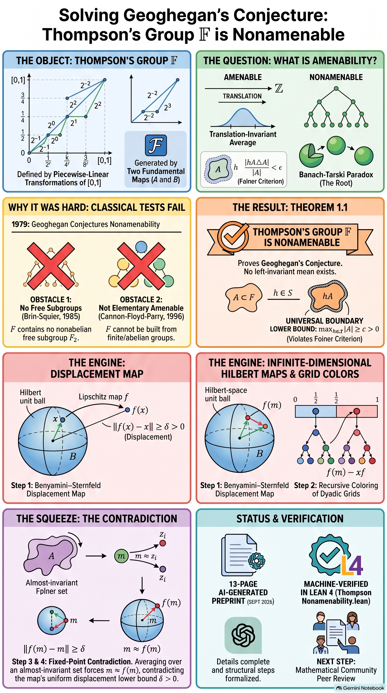

*NotebookLM's one-page overview. The big picture is right, but its graphs of the generators are garbled, a formula in "The result" panel is broken, and its "machine-verified" label overstates the Lean status; see the [errata](assets/README.md#errata) and the hand-made figures below.*

## Contents

- [TL;DR](#tldr)
- [How to read this](#how-to-read-this)
- [1. The problem](#1-the-problem)
- [2. A short history](#2-a-short-history)
- [3. What the paper proves](#3-what-the-paper-proves)
- [4. Why it matters](#4-why-it-matters)
- [5. The main idea of the proof](#5-the-main-idea-of-the-proof)
- [6. The people whose ideas this builds on](#6-the-people-whose-ideas-this-builds-on)
- [7. What it does not prove, and caveats](#7-what-it-does-not-prove-and-caveats)
- [8. Glossary](#8-glossary)
- [9. Slides, audio and other assets](#9-slides-audio-and-other-assets)
- [How this explainer was made](#how-this-explainer-was-made)

---

## TL;DR

- **The question.** A group is **amenable** if you can "average" bounded functions on it in a way that does not change when you translate by a group element. Finite groups and $\mathbb{Z}$ are amenable; the free group on two generators is not. **Thompson's group F**, the group of piecewise-linear bijections of $[0,1]$ with dyadic breakpoints and slopes that are powers of 2, has resisted classification since Ross Geoghegan conjectured in 1979 that it is *not* amenable.
- **Why it was hard.** F slips past both standard tests. It contains no free subgroup on two generators (Brin–Squier, 1985), so the classical proof of nonamenability does not apply. It is also not built from finite and abelian groups (Cannon–Floyd–Parry, 1996), so the classical proof of amenability does not apply either. Proofs were claimed in both directions between 2009 and 2021; the paper cites the main ones, and several were withdrawn or found to contain errors.
- **What this paper proves.** F is **not** amenable (Theorem 1.1). In fact it gives a quantitative form: there is one fixed finite set $S \subset F$ such that *every* finite set $A \subset F$ is moved by some $h \in S$ by at least a fixed positive fraction of its size.
- **How.** It colours every dyadic grid on $[0,1]$ by a point of a Hilbert-space ball, using a self-similar recursion built around a Lipschitz map $f$ that moves *every* point of the ball by at least a fixed distance $\delta$ (Benyamini and Sternfeld showed in 1983 that such maps exist in every infinite-dimensional space; in finite dimensions Brouwer's fixed-point theorem rules them out). If F were amenable, averaging over an almost-invariant finite set would produce a point that $f$ barely moves. That is impossible.
- **Status.** A 13-page preprint produced by an internal OpenAI model, not yet peer reviewed. The headline statement is listed as formalized in Lean 4; this explainer did not re-run that check.

## How to read this

| You have… | Read |
|---|---|
| 2 minutes | The TL;DR and the infographic above |
| 15 minutes | Sections 1–4 and 7 |
| An hour, and you like algebra or analysis | Everything, including [section 5](#5-the-main-idea-of-the-proof), the worked example inside it, and the [slides](#9-slides-audio-and-other-assets) |

---

## 1. The problem

### 1.1 Groups as symmetries, and the trouble with averaging

A group is the set of symmetries of something, with composition as the operation. The rotations of a square form a group of order 4; the translations $x \mapsto x + n$ of the integers form the infinite group $\mathbb{Z}$.

On a **finite** group $G$ you can always average. For a function $\varphi : G \to \mathbb{R}$, take $`M(\varphi) = \frac{1}{\lvert G\rvert}\sum_{g\in G}\varphi(g)`$. This average has three properties that matter later:

1. it is **normalized**: the constant function 1 has average 1;
2. it is **positive**: a function that is never negative has a non-negative average;
3. it is **invariant**: shifting the function by a group element, $g \mapsto \varphi(hg)$, does not change the average, because $g \mapsto hg$ just reorders the group.

For an **infinite** group there is no uniform probability on the elements, so the formula breaks. Amenability asks whether *some* averaging rule with properties 1–3 still exists.

### 1.2 Finitely generated groups and words

A group is **finitely generated** if a finite list of elements, together with their inverses, produces every element by multiplication. $\mathbb{Z}$ is generated by $1$, and $\mathbb{Z}^2$ by $(1,0)$ and $(0,1)$. The **free group** $F_2$ on two letters $a, b$ consists of all *reduced words* in $a, a^{-1}, b, b^{-1}$ (no $a$ next to $a^{-1}$, no $b$ next to $b^{-1}$), multiplied by concatenating and cancelling. Nothing else is assumed, so it is the "freest" group with two generators. Its elements of length at most $n$ number $2\cdot 3^n - 1$, so it grows exponentially.

A group is **finitely presented** if, in addition, finitely many relations between the generators imply all the others.

### 1.3 Thompson's group F

Following the paper, **F** is the group of increasing, piecewise-linear bijections $g : [0,1] \to [0,1]$ with finitely many pieces, whose breakpoints are **dyadic rationals** (numbers $k/2^n$) and whose slopes are powers of 2. The operation is composition, written $hg = h\circ g$ (first $g$, then $h$).

Two elements generate all of F. In the standard choice,

```math
A(x)=\begin{cases} x/2 & 0\le x\le \tfrac12\\ x-\tfrac14 & \tfrac12\le x\le \tfrac34\\ 2x-1 & \tfrac34\le x\le 1\end{cases}
\qquad
B(x)=\begin{cases} x & 0\le x\le \tfrac12\\ x/2+\tfrac14 & \tfrac12\le x\le \tfrac34\\ x-\tfrac18 & \tfrac34\le x\le \tfrac78\\ 2x-1 & \tfrac78\le x\le 1.\end{cases}
```

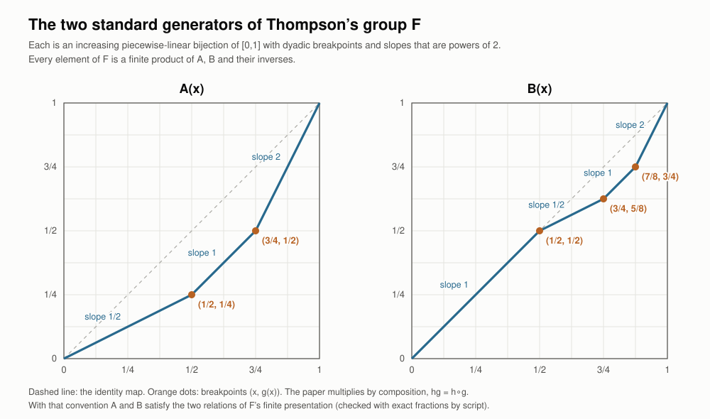

For example, $AB(13/16) = A(B(13/16)) = A(11/16) = 7/16$. With this convention, A and B satisfy the two relations of F's finite presentation (as given in the Wikipedia article on Thompson groups),

```math
\big[AB^{-1},\,A^{-1}BA\big] = \big[AB^{-1},\,A^{-2}BA^{2}\big] = \mathrm{id},\qquad [x,y]=xyx^{-1}y^{-1}.
```

We checked both relations with exact fractions (they fail if you compose in the opposite order). Some standard facts about F, from the same article: it is finitely presented with 2 generators and 2 relations, it has exponential growth, its commutator subgroup $[F,F]$ is simple, and $F/[F,F] \cong \mathbb{Z}^2$. It is torsion-free (the title of Brown and Geoghegan's 1984 paper calls it "an infinite-dimensional torsion-free $\mathrm{FP}_\infty$ group").

**The dyadic-grid picture.** The proof thinks of elements of F as acting on grids. A **basic dyadic interval** is $[k2^{-r}, (k+1)2^{-r}]$, and a **basic partition** cuts $[0,1]$ into such intervals. Let $T^{(n)}$ be the uniform grid with $2^n$ cells. An element $g$ of F carries $T^{(n)}$ to the grid of image cells $gT^{(n)}$. For large $n$ this is again a basic partition (the paper's Lemma 2.1), just an uneven one. For instance, $A$ carries $T^{(4)}$ (16 cells of length $1/16$) to a grid with cells of length $1/32$ on $[0,\tfrac14]$, $1/16$ on $[\tfrac14,\tfrac12]$ and $1/8$ on $[\tfrac12, 1]$.

### 1.4 Amenability: invariant means

The paper uses the standard definition. A discrete group $G$ is **amenable** if there is a linear functional $M$ on the bounded real functions $\ell^\infty(G)$ such that

```math
M(1)=1,\qquad M(\varphi)\ge 0 \ \text{ whenever } \varphi\ge 0,\qquad M\big(g\mapsto \varphi(hg)\big)=M(\varphi)\ \text{ for every } h\in G.
```

Such an $M$ is called a **left-invariant mean**: properties 1–3 of section 1.1, without any formula. Every finite group and every abelian group is amenable. Amenability passes to subgroups, quotients, extensions and directed unions, so all solvable groups are amenable. The free group $F_2$ is not.

### 1.5 Følner sets: amenability you can count

Means on infinite groups are abstract objects; to construct one on $\mathbb{Z}$ you need a limiting procedure such as the Hahn–Banach theorem. Erling Følner (1955) gave a criterion in terms of finite sets. The paper uses the direction "amenable implies Følner sets": if $G$ is amenable, then for every finite $S \subset G$ and every $\varepsilon > 0$ there is a nonempty finite $A \subset G$ with

```math
\frac{\lvert hA \,\triangle\, A\rvert}{\lvert A\rvert} < \varepsilon \qquad\text{for every } h\in S,
```

where $\triangle$ is the symmetric difference. Such an $A$ is "almost invariant": translating it by any $h \in S$ moves only a tiny fraction of its elements. In $\mathbb{Z}$, long intervals work. In the free group, balls do not:

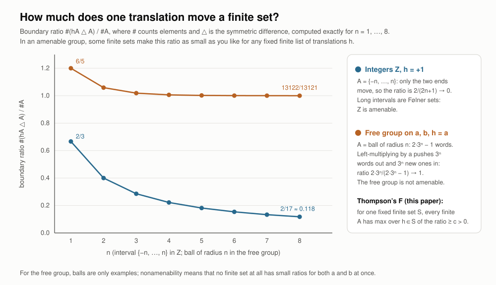

| $n$ | Interval $\lbrace -n,\dots,n\rbrace$ in $\mathbb{Z}$, $h = +1$ | Ball of radius $n$ in $F_2$, $h = a$ |
|---|---|---|
| 1 | $2/3 \approx 0.667$ | $6/5 = 1.2$ |
| 2 | $2/5 = 0.4$ | $18/17 \approx 1.059$ |
| 5 | $2/11 \approx 0.182$ | $486/485 \approx 1.002$ |
| 8 | $2/17 \approx 0.118$ | $13122/13121 \approx 1.0001$ |

(Computed by script. In $\mathbb{Z}$ only the two ends move, giving $2/(2n+1)$. In $F_2$, left-multiplying the ball by $a$ pushes the $3^n$ words of length $n$ that do not start with $a^{-1}$ out of the ball and pulls $3^n$ others in, giving $2\cdot 3^n/(2\cdot 3^n - 1)$.)

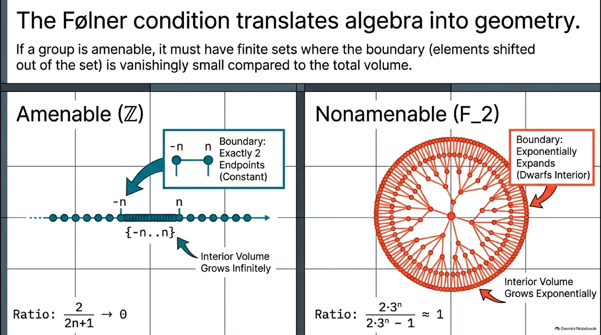

So to prove a group is **not** amenable, it is enough to find one finite set $S$ and one $c > 0$ such that **every** finite set $A$ has $\max_{h\in S} \lvert hA \triangle A\rvert / \lvert A\rvert \ge c$. That is exactly what this paper does for F.

### 1.6 The Banach–Tarski connection

Amenability was born from a paradox. In 1914 Felix Hausdorff showed that there is no finitely additive, rotation-invariant way to measure *all* subsets of the sphere. In 1924 Stefan Banach and Alfred Tarski proved the **Banach–Tarski paradox**: a solid ball can be cut into finitely many pieces and reassembled, using only rotations and translations, into two balls of the same size. In dimensions 1 and 2, by contrast, Banach (1923) showed that a finitely additive, isometry-invariant "length" or "area" on all bounded sets does exist.

The difference is group theory. The rotation group in three dimensions contains a free subgroup on two generators, and a free group has a **paradoxical decomposition**: writing $X(s)$ for the reduced words that start with the letter $s$,

```math
F_2=\lbrace e\rbrace\cup X(a)\cup X(a^{-1})\cup X(b)\cup X(b^{-1}),\qquad X(a)\cup aX(a^{-1}) = F_2 = X(b)\cup bX(b^{-1}).
```

Two of the four pieces, suitably translated, rebuild the whole group, and so do the other two. No invariant mean can survive that. The isometry groups of the line and the plane are solvable, hence amenable, so no paradox is possible there. In 1929 John von Neumann isolated the property behind this distinction and introduced amenable groups. Tarski later proved that a group is amenable exactly when it has no paradoxical decomposition.

### 1.7 The von Neumann–Day problem

Von Neumann's observation gives an easy test: **a group containing a free subgroup on two generators is not amenable**. Is the converse true? Does every nonamenable group contain such a free subgroup? This became known as the **von Neumann conjecture** or the **von Neumann–Day problem**. According to Wikipedia, its first written appearance seems to be in Mahlon Day's 1957 paper *Amenable semigroups*.

The general answer is **no**. Alexander Ol'shanskii (1980) showed that his *Tarski monster* groups are nonamenable but have no free subgroups, and Sergei Adian (1982) showed the same for certain free Burnside groups. These examples are finitely generated but not finitely presented. Finitely presented counterexamples came later: Ol'shanskii and Mark Sapir (2002–03), then Yash Lodha and Justin Moore, whose group (announced in 2013) was the first torsion-free finitely presented one. Within linear groups, Jacques Tits's alternative (1972) shows the conjecture is true.

### 1.8 Why F was the test case

Wikipedia's article on the conjecture calls F "the historically first potential counterexample". F is natural, finitely presented and torsion-free, and it dodges every standard tool:

| Standard tool | What it needs | What F does |
|---|---|---|
| Free subgroup ⇒ nonamenable (von Neumann) | A free subgroup on two generators | **Has none** (Brin–Squier, 1985) |
| Built from finite and abelian groups ⇒ amenable | F is "elementary amenable" | **It is not** (Cannon–Floyd–Parry, Theorem 4.10) |
| Subexponential growth ⇒ amenable | Balls in the Cayley graph grow slower than exponentially | **Exponential growth** |
| Computer search for Følner sets | Følner sets small enough to find | Moore (2013) proved that any Følner sets would have to be of **tower size** (a tower of exponentials) |

So neither the "easy no" nor the "easy yes" applies, and Moore's bound makes a brute-force search for Følner sets hopeless. That is what made F a famous open problem.

---

## 2. A short history

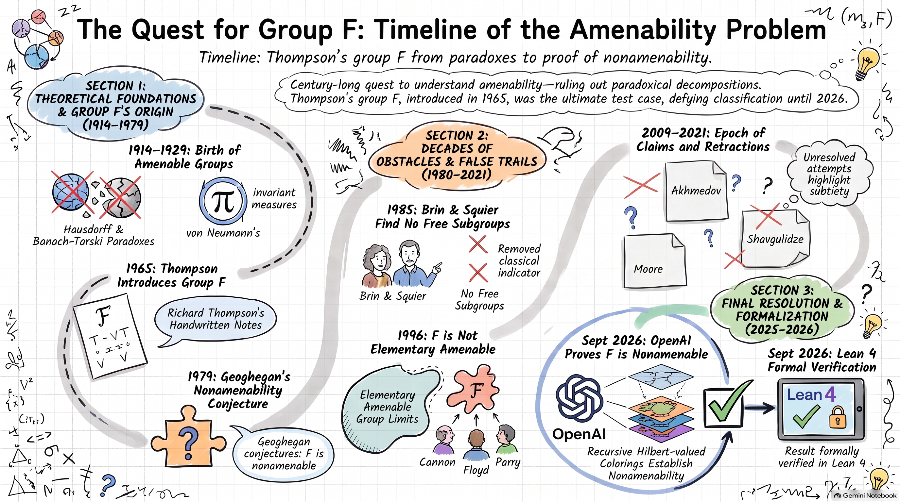

NotebookLM's sketch-note timeline above tells the story in broad strokes. It skips several milestones, and its "Claims and Retractions" panel, with its red crosses, suggests that the claimed proofs between 2009 and 2021 were all retracted, which is not what the paper says (see the [errata](assets/README.md#errata)). The table below is the checked version.

The rows come from the paper's introduction and bibliography, the arXiv records of the 2009–2021 preprints, and the Wikipedia articles on amenable groups, the von Neumann conjecture, Thompson groups, the Banach–Tarski paradox and the Grigorchuk group (all checked on 7 October 2026).

| When | Who | What happened |
|---|---|---|
| 1914 | **Felix Hausdorff** | Hausdorff paradox: no rotation-invariant, finitely additive measure on all subsets of the sphere |
| 1923–24 | **Stefan Banach; Banach and Alfred Tarski** | Invariant finitely additive measures exist in dimensions 1 and 2 (1923); the Banach–Tarski paradox in dimension 3 (1924) |
| 1929 | **John von Neumann** | Introduces amenable groups ("messbar") to explain the paradox; groups with a free subgroup of rank 2 are not amenable |
| 1949 | **Mahlon Day** | Coins the English word "amenable" |
| 1955 | **Erling Følner** | The Følner criterion: amenability through almost-invariant finite sets |
| 1957 | **Mahlon Day** | *Amenable semigroups*: the first written appearance of the "von Neumann conjecture", and a question about elementary amenable groups |
| 1965 | **Richard Thompson** | Introduces F (and the groups T and V) in unpublished handwritten notes |
| 1972 | **Jacques Tits** | The Tits alternative: the conjecture holds for linear groups |
| 1973 | **Ralph McKenzie, Richard Thompson** | An early published construction of F, in work on unsolvable word problems |
| 1979 | **Ross Geoghegan** | Conjectures that F is nonamenable (with three other conjectures about F) |
| 1980 | **Alexander Ol'shanskii** | Tarski monster groups: nonamenable groups without free subgroups. The von Neumann conjecture is false |
| 1982 | **Sergei Adian** | Free Burnside groups give more counterexamples |
| 1984 | **Kenneth Brown, Ross Geoghegan** | F has a classifying space with finitely many cells in each dimension |
| 1984 | **Rostislav Grigorchuk** | A group that is amenable but not elementary amenable, answering Day's question |
| 1985 | **Matthew Brin, Craig Squier** | F has no nonabelian free subgroup |
| 1996 | **James Cannon, William Floyd, Walter Parry** | *Introductory notes on Richard Thompson's groups*; F is not elementary amenable |
| 2002–03 | **Alexander Ol'shanskii, Mark Sapir** | Finitely presented counterexamples to the von Neumann conjecture |
| 2009 | **Azer Akhmedov** | Posts a claimed proof that F is nonamenable (arXiv:0902.3849), later withdrawn |
| 2009 | **E. T. Shavgulidze** | Claims a proof that F is amenable (arXiv:0906.0107; also published in 2009) |
| 2011 | **Justin Moore** | Identifies errors in Shavgulidze's approach |
| Sept 2012 | **Justin Moore** | Posts a claimed proof of amenability (arXiv:1209.2063). Three weeks later he withdraws it, after Akhmedov points out an error in its Lemma 4.13 |
| 2013 | **Justin Moore** | Tower-type lower bounds on the size of any Følner sets of F; a characterization of F's amenability by a Ramsey property of finite binary trees |
| 2013 | **Nicolas Monod; Yash Lodha and Justin Moore** | Groups of piecewise *projective* homeomorphisms give new counterexamples, including the first torsion-free finitely presented one |
| 2013–21 | **Azer Akhmedov** | arXiv:1310.4395 claims nonamenability through a height-function criterion; the paper cites its 2021 version |
| 2017 | **Uffe Haagerup, Kristian Knudsen Olesen** | If the reduced $C^{\ast}$-algebra of Thompson's group T is simple, then F is nonamenable |
| 2025–26 | **Victor Guba** | Better density estimates for finite pieces of F's Cayley graphs; restrictions on right-invariant means |
| 23 Sep 2026 | **OpenAI** (internal model) | This preprint: F is nonamenable |

Before this preprint the question was regarded as open: the Wikipedia article on Thompson groups still described its status as open when we checked it.

---

## 3. What the paper proves

> **Theorem 1.1.** Thompson's group F is not amenable.

This confirms Geoghegan's 1979 conjecture. The proof gives more than the bare statement. Fix a Lipschitz map $f$ of a Hilbert-space unit ball with Lipschitz constant $L$ and displacement at least $\delta$ (section 5), and an integer $D > 4L^2/\delta^2$. Then:

> **Proposition 2.3.** There is a finite set $S \subset F$, depending only on these choices and on the intervals of section 5 (not on $A$), such that for every nonempty finite set $A\subset F$,
>
> ```math
> \max_{h\in S}\ \frac{\lvert hA\,\triangle\,A\rvert}{\lvert A\rvert}\ \ge\ \frac{\delta^2/L^2-4/D}{4\,(1-1/D)}\ >\ 0 .
> ```

In plain words: there is a fixed, finite "test kit" of moves in F such that no finite set of elements of F, however large or cleverly chosen, is nearly invariant under all of them. This contradicts the Følner criterion of section 1.5, so no invariant mean can exist.

The bound is explicit in $\delta$, $L$ and $D$, but the paper does not compute a numerical value of $L$ for its map, and $S$ is a specially built set rather than the generators $A$, $B$. As $D$ grows the right-hand side approaches $\delta^2/(4L^2)$.

The Lean 4 statement, from the [openai/math Comparator challenge file](https://github.com/openai/math/blob/main/lean/ComparatorChallenges/ThompsonNonamenability.lean), reads:

```lean
theorem thompson_F_nonamenable_composition :
    ∃ group : Group F, letI := group;
      (∀ (h g : F) (x : UnitInterval),
        (h * g).val.toHomeomorph x = h.val.toHomeomorph (g.val.toHomeomorph x)) ∧
      ¬ Nonempty (InvariantMean F)
```

In that file, `F` is defined concretely as the strictly increasing homeomorphisms of $[0,1]$ that have finitely many affine pieces with dyadic breakpoints and slopes $2^k$. `InvariantMean F` is a positive, normalized, left-invariant linear functional on the bounded real functions on F. The statement says that composition makes F a group (multiplication is $h\circ g$) and that no invariant mean exists.

---

## 4. Why it matters

| | Before | After (if the preprint holds up) |
|---|---|---|
| **Geoghegan's conjecture (1979)** | Open, with claimed proofs in both directions | Proved: F is nonamenable |
| **The von Neumann–Day problem** | F was the oldest candidate counterexample | F is a counterexample: finitely presented, torsion-free, no free subgroups (Brin–Squier), and nonamenable. Earlier finitely presented counterexamples existed (Ol'shanskii–Sapir, Lodha–Moore), but F is the classical one |
| **Følner sets of F** | Moore: any Følner sets would have to be of tower size | There are none. For a fixed finite set $S$, every finite set has relative boundary at least a fixed positive constant |
| **Uniformly bounded representations** (Corollary 3.1) | — | For every $\varepsilon > 0$, F has a representation on a separable Hilbert space with every operator of norm at most $1 + \varepsilon$ that is *not* similar to a unitary representation. This uses the family-251 companion theorem |
| **Percolation on F's Cayley graphs** (Corollary 3.2) | — | For every finite symmetric generating set, $p_c < p_{2\to 2} \le p_u$, so there is a range of edge probabilities with infinitely many infinite clusters. This uses the family-214 companion theorem |
| **Method** | Følner sets, Ramsey theory of trees, diagram groups, operator algebras | A recursive Hilbert-valued colouring of dyadic grids, and a fixed-point-free Lipschitz map from infinite-dimensional geometry |

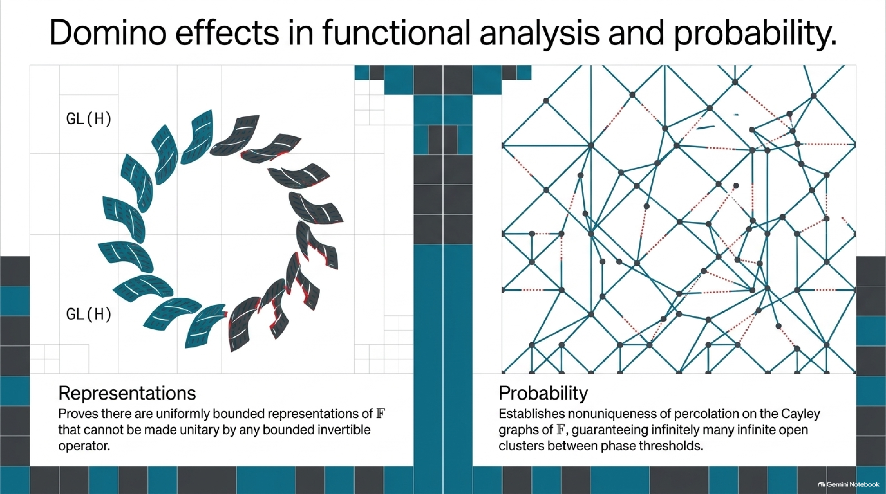

(Both corollaries on this slide come from companion theorems in families 251 and 214; the slide leaves that out.)

The paper describes its own strategy in one sentence: it "turns approximate translation invariance of finite averages of scalar functions on F into an approximate fixed point of a Lipschitz map on a Hilbert ball." The proof of the main theorem (Section 2) takes about four and a half pages, and the appendix spends about four more constructing the Lipschitz map from scratch.

---

## 5. The main idea of the proof

### Level 1: the one-paragraph version

Think of each element $g$ of F as a **lens** that distorts the uniform grid on $[0,1]$ into an uneven dyadic grid. Fix $D$ separated "windows" inside $[0,1]$ (the **parents**), and inside each window a scaled copy of the same $D$ windows (the **descendants**). From any grid, compute a **colour**, a point in the unit ball of a Hilbert space, by a self-similar recipe: look at the grid through each parent window, compute those colours the same way, average them, and apply a fixed map $f$ that moves every point by at least $\delta$. Now suppose F were amenable. Then some finite crowd $A$ of lenses would be almost unchanged by a fixed finite set of moves. Because F can move any separated pair of windows onto any other, every separated pair of windows would then look *statistically the same* on average over the crowd. Statistical sameness forces the average colour of the $D$ parents, $m$, to be close to the average colour $z_i$ of the $D$ children of each parent. But each parent's colour is *exactly* $`f(z_i)`$, so $m$ is an average of $f$-values at points near $m$, and therefore close to $f(m)$. Then $f$ would nearly fix $m$, which is impossible.

> **Analogy:** in a room of $D$ people who are statistically interchangeable, the average answer of one person's $D$ "children" should be close to the average answer of the whole room, with an error of about $1/D$. If every person's answer is obtained from their children's average by a distortion that always changes it by at least $\delta$, the room's average would have to be both nearly unchanged and changed by $\delta$. Taking $D$ large makes the contradiction sharp.

### Level 2: the step-by-step picture

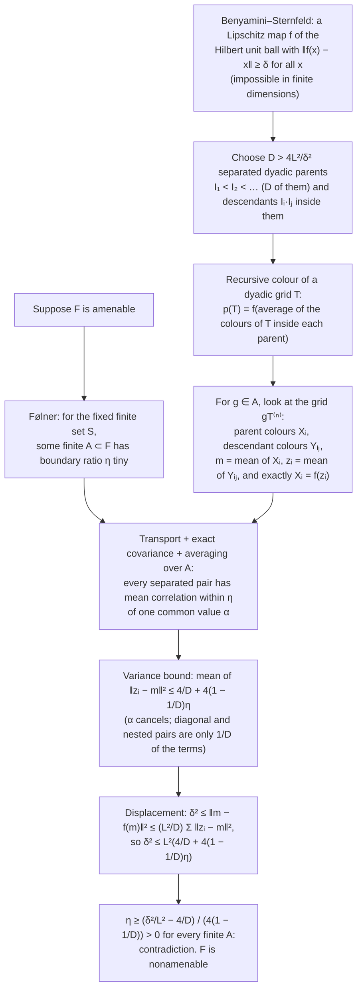
```mermaid
flowchart TD
    A["Suppose F is amenable"] --> B["Følner: for the fixed finite set S,<br/>some finite A ⊂ F has boundary ratio η tiny"]
    C["Benyamini–Sternfeld: a Lipschitz map f of the<br/>Hilbert unit ball with ‖f(x) − x‖ ≥ δ for all x<br/>(impossible in finite dimensions)"] --> D
    D["Choose D > 4L²/δ² separated dyadic parents<br/>I₁ < I₂ < … (D of them) and descendants Iᵢ·Iⱼ inside them"] --> E["Recursive colour of a dyadic grid T:<br/>p(T) = f(average of the colours of T inside each parent)"]
    E --> F2["For g ∈ A, look at the grid gT⁽ⁿ⁾:<br/>parent colours Xᵢ, descendant colours Yᵢⱼ,<br/>m = mean of Xᵢ, zᵢ = mean of Yᵢⱼ, and exactly Xᵢ = f(zᵢ)"]
    B --> G["Transport + exact covariance + averaging over A:<br/>every separated pair has mean correlation within η<br/>of one common value α"]
    F2 --> G
    G --> H["Variance bound: mean of ‖zᵢ − m‖² ≤ 4/D + 4(1 − 1/D)η<br/>(α cancels; diagonal and nested pairs are only 1/D of the terms)"]
    H --> I["Displacement: δ² ≤ ‖m − f(m)‖² ≤ (L²/D) Σ ‖zᵢ − m‖²,<br/>so δ² ≤ L²(4/D + 4(1 − 1/D)η)"]
    I --> J["η ≥ (δ²/L² − 4/D) / (4(1 − 1/D)) > 0 for every finite A:<br/>contradiction. F is nonamenable"]
```

**Step 1: a map that moves everything.** In a finite-dimensional space, every continuous map of the closed unit ball to itself has a fixed point (Brouwer's fixed-point theorem). In an infinite-dimensional Hilbert space this fails badly. Benyamini and Sternfeld (1983) proved that in every infinite-dimensional normed space there is a Lipschitz map $f$ of the unit ball $B$ to itself and a $\delta > 0$ with

```math
\lVert f(x)-x\rVert\ \ge\ \delta\qquad\text{for every } x\in B .
```

This is the paper's Lemma 1.2. For completeness, the appendix builds such a map on $L^2([0,1];\mathbb{R}^2)$ with $\delta = 1/2$ and $\lVert f(x)\rVert = 1$ for every $x$. It uses a curve in the Hilbert space that is a straight line through 0 for parameters $t \le 1$ and then, for $t \ge 1$, keeps turning into new directions inside the ball of radius $5/16$ while staying uniformly separated from itself. A thin tube around the curve is used to build a Lipschitz map $G$ that never vanishes and is the identity where $\lVert x\rVert \ge 1/2$; then $f(x) = -G(x)/\lVert G(x)\rVert$. The proof uses only $\delta$ and the Lipschitz constant $L$ of $f$, never its formula.

**Step 2: dyadic grids and F.** A grid $T$ **respects** an interval $I$ if $I$ is a union of cells of $T$. Its **normalized restriction** $T_I$ takes the cells inside $I$ and stretches them back to $[0,1]$ by the inverse of the increasing affine map $s_I : [0,1] \to I$. Writing $`I\cdot J = s_I(J)`$ for "the copy of $J$ inside $I$", restrictions compose: $`(T_I)_J = T_{I\cdot J}`$ (equation 2.1). Two facts about F carry the proof:

- **Transport (Lemma 2.2).** If $I < J$ and $I' < J'$ are pairs of basic intervals with a gap between them and endpoints inside $(0,1)$, some $h \in F$ maps $I$ affinely onto $I'$ and $J$ affinely onto $J'$. The proof cuts the three gaps into dyadic cells, bisects cells until both sides have equally many, and maps cell to cell.
- **Exact covariance (equation 2.2).** If $h$ carries $I$ affinely onto $I'$, then $`\big((hg)T^{(n)}\big)_{I'} = (gT^{(n)})_I`$. Looking through window $I'$ after applying $h$ is the same as looking through window $I$ before.

**Step 3: the recursive colouring.** Choose $D$ parents $I_1 < \cdots < I_D$, for instance $`I_j = [(2j-1)2^{-r}, 2j\cdot 2^{-r}]`$ with $2^r > 2D$. Define a colour $p(T) \in B$ for every basic partition by

```math
p(T)=\begin{cases} f\Big(\dfrac1D\sum_{j=1}^{D}p(T_{I_j})\Big) & \text{if } T \text{ respects every } I_j,\\[4pt] 0 & \text{otherwise.}\end{cases}
```

Each $T_{I_j}$ has fewer cells than $T$, so the recursion terminates. The average of points of the ball stays in the ball, so $f$ can always be applied.

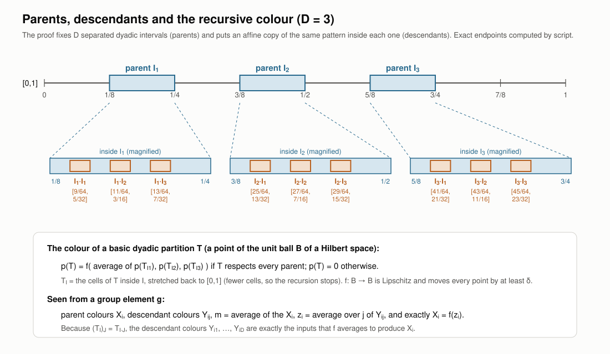

**Step 4: colours seen from a group element.** For $g \in F$ and a fine enough level $n$, let $`X_I(g) = p\big((gT^{(n)})_I\big)`$ be the colour seen through window $I$. Put

```math
m(g)=\frac1D\sum_{k=1}^{D}X_{I_k}(g),\qquad z_i(g)=\frac1D\sum_{j=1}^{D}X_{I_i\cdot I_j}(g).
```

Because $`(T_{I_i})_{I_j} = T_{I_i\cdot I_j}`$, the recursion gives the **exact identity** $`X_{I_i}(g) = f(z_i(g))`$ (equation 2.11). The scalar **correlations** $`\varphi_{I,J}(g) = \langle X_I(g), X_J(g)\rangle`$ are bounded functions on F with values in $[-1, 1]$.

**Step 5: amenability makes all separated pairs look alike.** For each ordered separated pair $I < J$ among the parents and descendants, Lemma 2.2 gives an element $h_{I,J}$ carrying $I, J$ onto the reference pair $I_1, I_2$. These finitely many elements form the set $S$, chosen *before* any set $A$ is given. Covariance gives $`\varphi_{I,J}(g) = \varphi_{I_1,I_2}(h_{I,J}\,g)`$. Averaging a function with values in $[-1,1]$ over $A$ and over $hA$ differs by at most $\lvert hA\triangle A\rvert/\lvert A\rvert$ (equation 2.7). So if $\eta$ is the largest boundary ratio of $A$ over $h \in S$, then

```math
\Big|\ \mathbb{E}_{g\in A}\,\langle X_I(g),X_J(g)\rangle-\alpha\ \Big|\ \le\ \eta\qquad\text{for every separated pair } I,J,
```

where $\alpha$ is the average correlation of the reference pair (equation 2.10). Nothing is claimed for nested pairs, such as a descendant and its own parent.

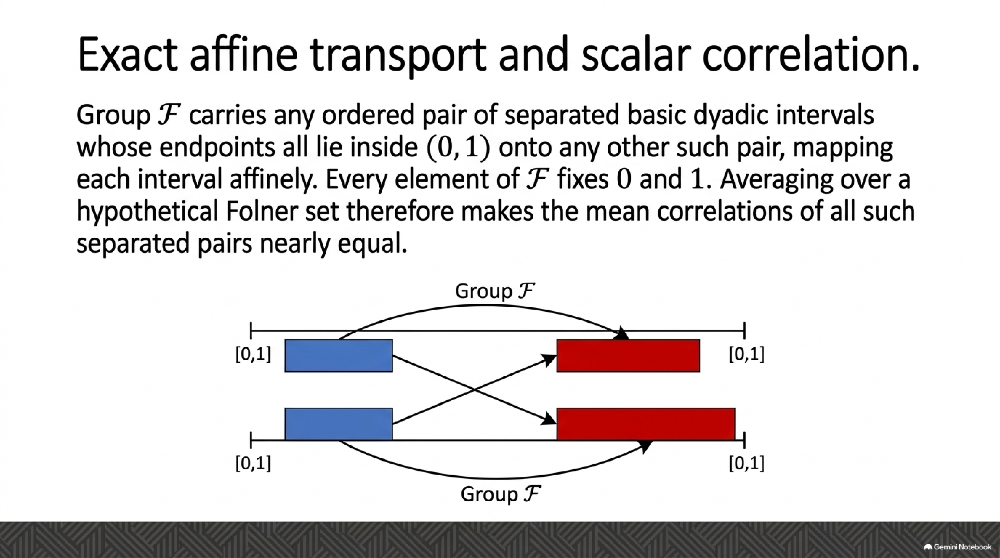

(The slide says "any separated pair of dyadic intervals". Lemma 2.2 needs basic dyadic intervals with both endpoints inside $(0,1)$: every element of F fixes 0 and 1, so, for example, an interval starting at 0 can only be carried to another interval starting at 0.)

**Step 6: the variance estimate.** Expand $\lVert m\rVert^2$, $\lVert z_i\rVert^2$ and $\langle z_i, m\rangle$ into $D^2$ inner products each. In $\lVert m\rVert^2$ and $\lVert z_i\rVert^2$ the $D(D-1)$ off-diagonal terms are separated pairs, and the $D$ diagonal terms are at most 1. In $\langle z_i, m\rangle$, the pairs $\langle X_{I_i\cdot I_j}, X_{I_k}\rangle$ with $k \ne i$ are separated, and only the $D$ terms with $k = i$ are nested; each of those is at least $-1$. Putting this together, the unknown $\alpha$ cancels:

```math
\mathbb{E}_A\lVert z_i-m\rVert^2\ \le\ 2\Big[\big(1-\tfrac1D\big)(\alpha+\eta)+\tfrac1D\Big]-2\Big[\big(1-\tfrac1D\big)(\alpha-\eta)-\tfrac1D\Big]\ =\ \frac4D+4\Big(1-\frac1D\Big)\eta .
```

**Step 7: the contradiction.** Since $m$ is the average of the $`X_{I_i} = f(z_i)`$, the displacement bound, convexity of $\lVert\cdot\rVert^2$ and the Lipschitz bound give, for every $g \in A$,

```math
\delta^2\ \le\ \lVert m-f(m)\rVert^2=\Big\lVert \frac1D\sum_{i=1}^{D}\big(f(z_i)-f(m)\big)\Big\rVert^2\ \le\ \frac{L^2}{D}\sum_{i=1}^{D}\lVert z_i-m\rVert^2 .
```

Averaging over $A$ and using Step 6 gives $\delta^2 \le L^2\big(4/D + 4(1-1/D)\eta\big)$. Rearranged, this is Proposition 2.3. The right-hand side is positive because $D > 4L^2/\delta^2$, and it does not depend on $A$. So F has no Følner sets for the finite set $S$, and F is not amenable.

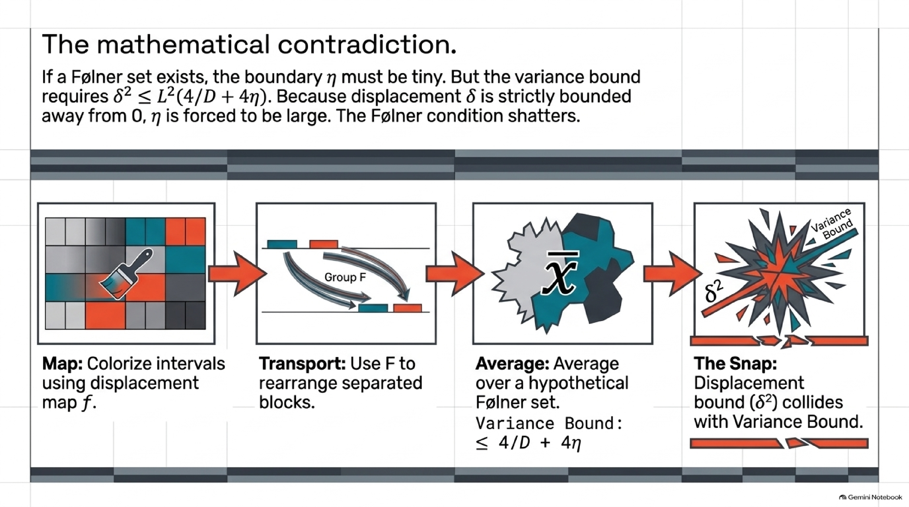

(The slide writes the bound as $\delta^2 \le L^2(4/D + 4\eta)$, which follows from the paper's sharper $4(1-1/D)\eta$.)

<details>
<summary><b>A worked example: colours, a transport element and the pair count</b> (computed by script)</summary>

**Colours for D = 2.** Take $r = 3$, so the parents are $I_1 = [1/8, 1/4]$ and $I_2 = [3/8, 1/2]$. The descendants inside $I_1$ are $I_1\cdot I_1 = [9/64, 5/32]$ and $I_1\cdot I_2 = [11/64, 3/16]$. Writing colours as expressions in $f$:

| Grid | Restrictions to $I_1$, $I_2$ | Colour |
|---|---|---|
| $T^{(0)}$ (one cell) | Does not respect $I_1$ | $0$ |
| $T^{(3)}$ (cells of length $1/8$) | $T^{(0)}$, $T^{(0)}$ | $f\big(\tfrac{0+0}{2}\big) = f(0)$ |
| $T^{(6)}$ (cells of length $1/64$) | $T^{(3)}$, $T^{(3)}$ | $f\big(\tfrac{f(0)+f(0)}{2}\big) = f(f(0))$ |
| $AT^{(4)}$ (cells $1/32$, $1/16$, $1/8$) | $T^{(2)}$, $T^{(1)}$, neither respects $I_1$ | $f(0)$ |
| $AT^{(6)}$ (cells $1/128$, $1/64$, $1/32$) | $T^{(4)}$, $T^{(3)}$, each of colour $f(0)$ | $f(f(0))$ |
| $BT^{(6)}$ ($B$ is the identity on $[0,\tfrac12]$) | $T^{(3)}$, $T^{(3)}$ | $f(f(0))$ |
| $A^{-1}T^{(6)}$ (cells $1/32$ on $[0,\tfrac12]$) | $T^{(2)}$, $T^{(2)}$ | $f(0)$ |

The first three rows match the paper's remark that $p(T^{(r)}) = f(0)$ and $p(T^{(2r)}) = f(f(0))$. Different group elements see different colours, and the proof only ever compares their *averages*.

**A transport element.** One of the elements of $S$ for $D = 2$ must carry the separated pair $`\big(I_1\cdot I_2,\ I_2\big) = \big([11/64, 3/16],\ [3/8, 1/2]\big)`$ onto $`(I_1, I_2)`$. Running the bisection recipe of Lemma 2.2 gives the element $h$ with

```math
h:\quad 0\mapsto 0,\quad \tfrac{3}{32}\mapsto\tfrac{3}{64},\quad \tfrac{11}{64}\mapsto\tfrac18,\quad \tfrac{3}{16}\mapsto\tfrac14,\quad \tfrac{5}{16}\mapsto\tfrac{5}{16},\quad 1\mapsto 1,
```

which is linear between these points, with slopes $1/2, 1, 8, 1/2, 1$. All breakpoints are dyadic and all slopes are powers of 2, so $h \in F$. Its slope-8 piece stretches $[11/64, 3/16]$ (length $1/64$) onto $[1/8, 1/4]$ (length $1/8$), and it fixes $[3/8, 1/2]$. We checked the covariance identity $`\big((hg)T^{(n)}\big)_{I_1} = (gT^{(n)})_{I_1\cdot I_2}`$ exactly for $g \in \lbrace \mathrm{id}, A, B\rbrace$ and $n = 8, 9$.

**The pair count for D = 3.** For a fixed parent $I_i$, the mixed term $\langle z_i, m\rangle$ is an average of $D^2 = 9$ inner products $\langle X_{I_i\cdot I_j}, X_{I_k}\rangle$. Six of them ($k \ne i$) pair a descendant with a *different* parent. They are separated, so their averages lie within $\eta$ of $\alpha$. Three ($k = i$) pair a descendant with its own parent and are only known to be at least $-1$. In general the nested pairs are a fraction $D/D^2 = 1/D$ of the terms (the paper's Figure 1), which is why the error is of order $1/D$.

**The final arithmetic.** Symbolic algebra confirms that the bound in Step 6 equals $4/D + 4\eta - 4\eta/D$, with no $\alpha$ left, and that solving $\delta^2 = L^2(4/D + 4(1-1/D)\eta)$ for $\eta$ gives exactly the right-hand side of Proposition 2.3, which tends to $\delta^2/(4L^2)$ as $D \to \infty$.
</details>

### Level 3: what makes it work, for readers with some analysis

- **Only scalar functions are averaged.** Amenability is about means on *bounded real functions*. The proof never averages Hilbert-space vectors over the group directly. It averages the correlations $\varphi_{I,J}$, which are bounded real functions on F, and uses finite averages over a Følner set $A$ in place of the abstract mean. The Hilbert-space geometry enters only pointwise, for each $g$, through convexity and the Lipschitz bound.
- **Infinite dimensions are essential.** In finite dimensions Brouwer's theorem gives every continuous self-map of the ball a fixed point, so no $\delta$ exists. The proof needs a map that is far from having approximate fixed points *and* is Lipschitz, which is the content of Benyamini–Sternfeld's theorem ("spheres in infinite-dimensional normed spaces are Lipschitz contractible").
- **What F contributes.** Three properties of the dyadic model do all the group-theoretic work: the image grids $gT^{(n)}$ are basic partitions once $n$ is large (Lemma 2.1); restrictions compose exactly, $`(T_I)_J = T_{I\cdot J}`$, which makes the colouring self-similar; and F acts transitively on ordered pairs of separated internal basic dyadic intervals, with exact covariance of restrictions (Lemma 2.2 and equation 2.2). The proof does not use the Brin–Squier theorem, the finite presentation, or Moore's Ramsey characterization.
- **Uniformity.** The set $S$ depends only on $D$ and the chosen intervals, and the level $n$ is chosen after $A$, only to make all grids in $A \cup SA$ fine enough. No sign condition on the common correlation $\alpha$ is needed, because $\alpha$ cancels exactly. The conclusion is a uniform isoperimetric inequality for one fixed finite set, the quantitative face of nonamenability.

---

## 6. The people whose ideas this builds on

| Person | Idea | Where it shows up |
|---|---|---|
| **Richard Thompson** | Introduced F, T and V (1965); with **Ralph McKenzie**, an early published construction (1973) | The object of the theorem |
| **Ross Geoghegan** | Conjectured in 1979 that F is nonamenable; with **Kenneth Brown**, F is of type $\mathrm{FP}_\infty$ | The conjecture the paper proves |
| **Matthew Brin, Craig Squier** | F has no nonabelian free subgroup (1985) | Why von Neumann's test cannot decide F |
| **James Cannon, William Floyd, Walter Parry** | The standard introduction to Thompson's groups; F is not elementary amenable | The dyadic-partition model of F used in Section 2 |
| **John von Neumann, Mahlon Day** | Amenable groups and invariant means (1929, 1949, 1957) | The definition the theorem negates |
| **Erling Følner** | Amenability through almost-invariant finite sets (1955) | The contradiction at the end of the proof |
| **Felix Hausdorff, Stefan Banach, Alfred Tarski** | Paradoxical decompositions and invariant measures (1914–1924) | The origin of the whole subject |
| **Alexander Ol'shanskii, Sergei Adian, Mark Sapir** | Counterexamples to the von Neumann conjecture (1980–2003) | Background: the general problem was already settled |
| **Yoav Benyamini, Y. Sternfeld** | Fixed-point-free Lipschitz maps of balls in infinite-dimensional spaces (1983) | Lemma 1.2, the analytic engine; re-proved in the appendix |
| **Justin Moore** | Følner-function lower bounds and a Ramsey characterization (2013); critique of Shavgulidze (2011); a withdrawn amenability claim (2012) | Prior work and history cited in the introduction |
| **Azer Akhmedov** | Claimed nonamenability proofs (2009, 2013–21); found the error in Moore's 2012 manuscript | History cited in the introduction |
| **E. T. Shavgulidze** | Claimed amenability (2009) | History cited in the introduction |
| **Victor Guba** | Density of finite Cayley subgraphs; restrictions on right-invariant means (2025–26) | Prior work cited in the introduction |
| **Uffe Haagerup, Kristian Knudsen Olesen** | $C^{\ast}$-simplicity of T would imply nonamenability of F (2017) | Prior work cited in the introduction |
| **Nicolas Monod, Yash Lodha** | Piecewise projective counterexamples to the von Neumann conjecture (2013) | Background: the closest relatives of F among known counterexamples |

---

## 7. What it does not prove, and caveats

> [!IMPORTANT]
> **This is an unreviewed preprint on a problem with a history of failed proofs.** Claims in both directions have appeared before, and the paper itself lists the main ones. A 13-page solution of a 47-year-old conjecture deserves careful independent checking. The repository lists a Lean formalization of the main theorem (described below), but this explainer did not re-run it, and the repository's catalogue-wide review field reads `unchecked`.

> [!NOTE]
> **What the theorem does and does not say.**
> - It gives no numerical value for the boundary constant. The bound in Proposition 2.3 depends on the Lipschitz constant $L$ of the appendix map, which the paper does not compute, and the Lean scope document says that no explicit boundary constant is given.
> - The finite set $S$ is a set of transport elements built from the parent intervals, not the standard generators $A, B$. (Because amenability does not depend on the choice of finite generating set, the Cayley graph for $A, B$ also has a positive isoperimetric constant. That is a standard consequence, not a statement of the paper, which gives no value for it.)
> - The two corollaries in Section 3 depend on companion theorems from families 251 and 214 and are not part of the family-248 Lean statement.
> - The theorem settles amenability of F only. It does not claim, for example, simplicity of the reduced $C^{\ast}$-algebra of Thompson's group T, which Haagerup and Olesen showed would imply this result.

> [!NOTE]
> **Provenance.** The paper was produced by an unreleased internal OpenAI model as part of the [openai/math](https://github.com/openai/math) release. According to that repository's README, most results came from the same fixed procedure, averaging about three hours of ChatGPT Pro thinking compute per result. The README lists two exceptions to that procedure (a zero-free region for the Riemann zeta function, and the Hodge Conjecture for CM abelian varieties); this family is not among them. The README also notes that the collection "includes results at different stages of verification" and that some unformalized results could have issues. No reasoning summary is released for this family.

> [!NOTE]
> **Verification status.** The [Lean scope document for family 248](https://github.com/openai/math/blob/main/lean/docs/248.md) says the formalized result rules out a positive normalized left-invariant mean on bounded real functions "for the standard group of dyadic piecewise-linear homeomorphisms of the interval, proving nonamenability", and that "no explicit boundary constant or prescribed generating set is given." [`lean/formalization.yaml`](https://github.com/openai/math/blob/main/lean/formalization.yaml) lists this paper among its sources and `OAI.ThompsonNonamenability.thompson_F_nonamenable_composition` (in `OAI/GroupTheory/Thompson/Main.lean`) among its main results. It is checkable with the Comparator tool, with permitted axioms `propext`, `Quot.sound` and `Classical.choice`. The Lean development under `lean/OAI/GroupTheory/Thompson/` has 68 files. Its `Main.lean` also proves the uniform boundary bound with the paper's formula and $\delta = 1/2$, and a separate file derives Følner sets from an invariant mean, so the Følner step is not taken on trust. The catalogue-wide `review` field of `formalization.yaml` reads `unchecked`. This explainer did not re-run the Lean build. As of October 2026 the result is a preprint; the usual next step is independent review by experts.

> [!TIP]
> **Simplifications.** To stay readable, this explainer suppresses the bookkeeping of admissible levels (a single level $n$ that makes every grid in $A \cup SA$ fine enough), the global definition of colours as 0 at inadmissible levels, and the Lipschitz estimates of the appendix. Every precise statement is in the paper, whose main proof is short enough to read in an afternoon.

---

## 8. Glossary

| Term | Meaning |
|---|---|
| **Finitely generated / finitely presented group** | Every element is a product of finitely many fixed generators and their inverses / in addition, finitely many relations imply all others |
| **Free group** $F_2$ | Reduced words in $a, a^{-1}, b, b^{-1}$; no relations at all |
| **Dyadic rational** | A number $k/2^n$ |
| **Thompson's group F** | Increasing piecewise-linear bijections of $[0,1]$ with finitely many pieces, dyadic breakpoints and slopes in $2^{\mathbb{Z}}$, under composition |
| **Basic dyadic interval / basic partition** | An interval $[k2^{-r},(k+1)2^{-r}]$ / a cutting of $[0,1]$ into such intervals |
| **Respects, normalized restriction** | $T$ respects $I$ if $I$ is a union of cells of $T$; $T_I$ is the part of $T$ inside $I$, stretched back to $[0,1]$ |
| **Invariant mean** | A positive, normalized, translation-invariant linear functional on bounded functions; an "average" for infinite groups |
| **Amenable group** | A group with an invariant mean |
| **Symmetric difference** $X \triangle Y$ | The elements in exactly one of $X$ and $Y$ |
| **Følner set** | A finite set $A$ with $\lvert hA \triangle A\rvert/\lvert A\rvert$ small for every $h$ in a given finite set |
| **Paradoxical decomposition** | A splitting of a group (or a set it acts on) into pieces that can be moved to make two copies of the whole |
| **Elementary amenable** | Built from finite and abelian groups by subgroups, quotients, extensions and directed unions |
| **Von Neumann–Day problem** | Must every nonamenable group contain a free subgroup on two generators? (No, by Ol'shanskii, 1980) |
| **Hilbert space, unit ball** | A complete inner-product space, possibly infinite-dimensional, such as $L^2([0,1];\mathbb{R}^2)$ / its vectors of norm at most 1 |
| **Lipschitz map** | A map with $\lVert f(x)-f(y)\rVert \le L\lVert x-y\rVert$ for a constant $L$ |
| **Displacement** | $\lVert f(x) - x\rVert$, how far $f$ moves the point $x$ |
| **Brouwer's fixed-point theorem** | Every continuous map of a finite-dimensional closed ball to itself has a fixed point |
| **Recursive colour** $p(T)$ | The paper's point of the Hilbert ball attached to a dyadic grid: $f$ of the average of the colours of its restrictions to the parents |
| **Uniformly bounded representation** | A homomorphism into invertible operators on a Hilbert space with $`\sup_g \lVert \pi(g)\rVert < \infty`$ |
| **Bernoulli percolation,** $p_c$, $p_u$, $p_{2\to 2}$ | Keep each edge of a graph independently with probability $p$ / the thresholds for some infinite cluster to exist and for it to be unique / the supremum of the $p$ at which the connection probabilities define a bounded operator on $\ell^2$ |
| **Lean 4, Comparator** | A proof assistant that mechanically checks every step of a proof, and a tool that checks that a formal proof proves a fixed challenge statement and uses only allowed axioms |

---

## 9. Slides, audio and other assets

Everything below except the three hand-made figures was generated with **Google NotebookLM** (now "Gemini Notebook") from the paper, the Lean scope document and the Wikipedia article on amenable groups. The report and the mind map used only the paper and the Lean scope document. The outputs are kept exactly as NotebookLM produced them; the slide deck was not revised. They are AI-generated, so see the [errata](assets/README.md#errata) before relying on any detail. In particular, slides 5, 6, 10 and 14 contain clear errors (a duplicated and misdated card, a graph that is not increasing, a misstated colouring rule, and invented Lean code).

| Asset | What it is |
|---|---|
| [Slide deck (PDF)](assets/notebooklm/slides.pdf) · [PPTX](assets/notebooklm/slides.pptx) | 15 beginner slides. Most are accurate; four have clear errors listed in the errata |
| [Infographic: overview](assets/notebooklm/infographic-overview.png) | The one-page summary shown at the top. Its generator graphs are garbled |
| [Infographic: history timeline](assets/notebooklm/infographic-history-timeline.png) | From Hausdorff (1914) to 2026, in sketch-note style; a selection of events |
| [Audio overview (≈1.7 min)](assets/notebooklm/audio-overview-brief.m4a) | A short podcast-style summary (not reviewed) |
| [Beginner report](assets/notebooklm/beginner-explainer-report.md) | NotebookLM's long-form technical explainer. Its proof walk-through is accurate; a few background sentences are not |
| [Mind map](assets/notebooklm/mindmaps.md) | How the proof fits together |
| [Generators figure](assets/figures/generators-A-B.svg) | Hand-made graphs of A and B, used in section 1.3 |
| [Boundary-ratio figure](assets/figures/folner-ratios.svg) | Hand-made chart of intervals in $\mathbb{Z}$ versus balls in $F_2$, used in section 1.5 |
| [Parents-and-descendants figure](assets/figures/parents-and-descendants.svg) | Hand-made drawing of the intervals and the recursive colour for $D = 3$, used in section 5 |

<details>
<summary><b>All 15 slides</b> (click to expand)</summary>

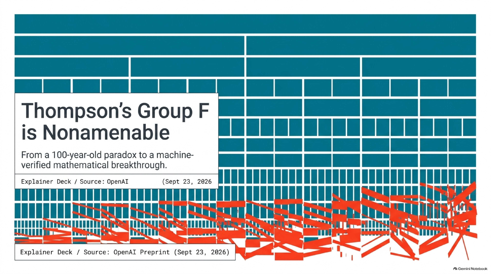

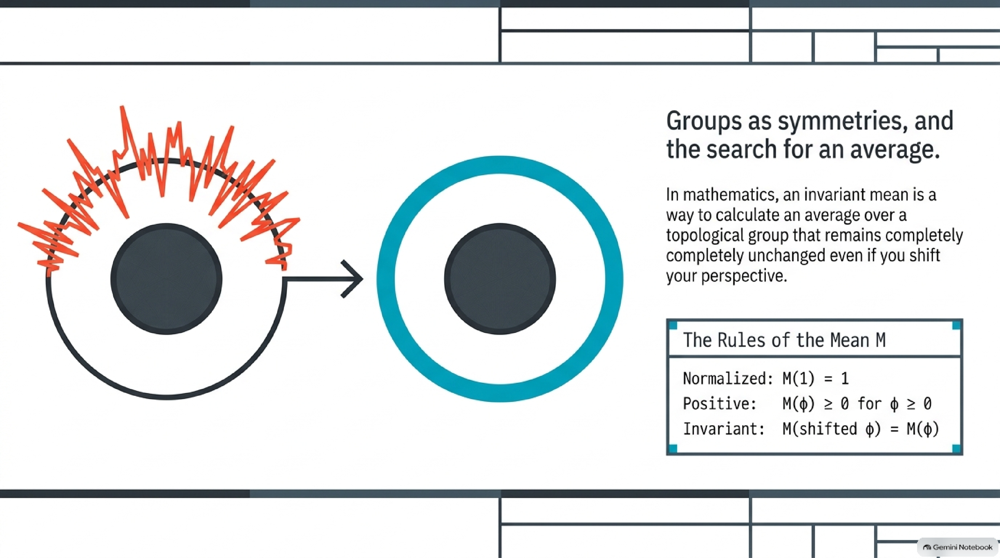

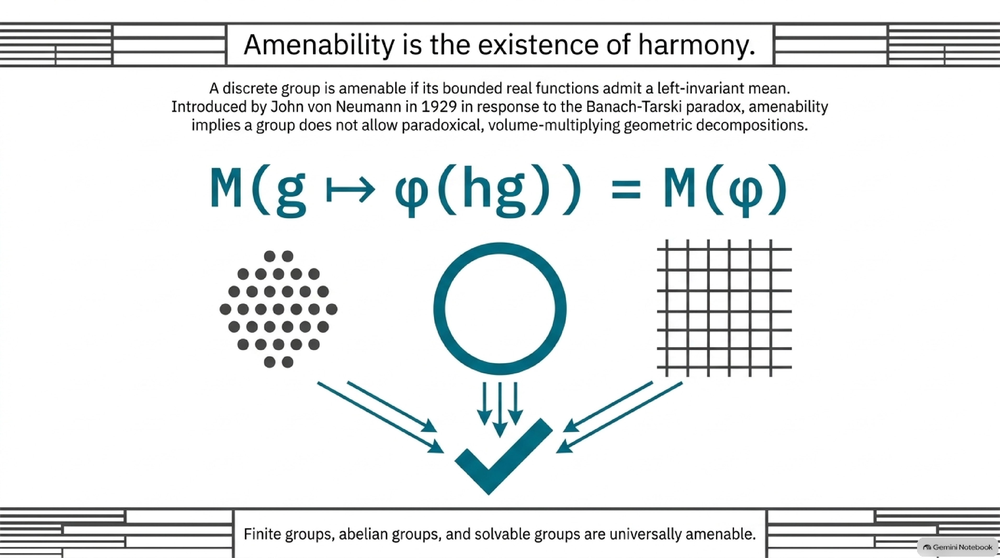


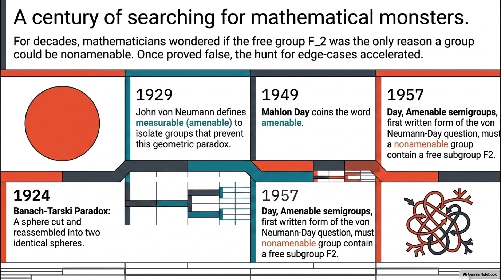

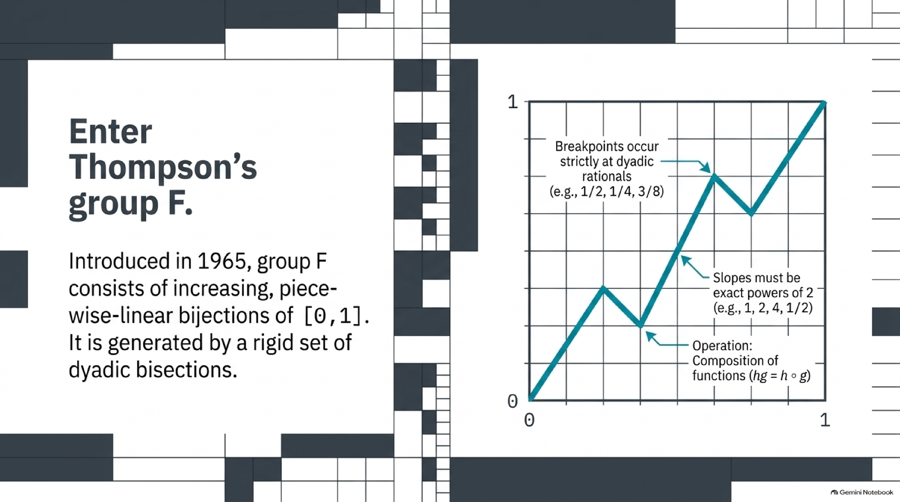

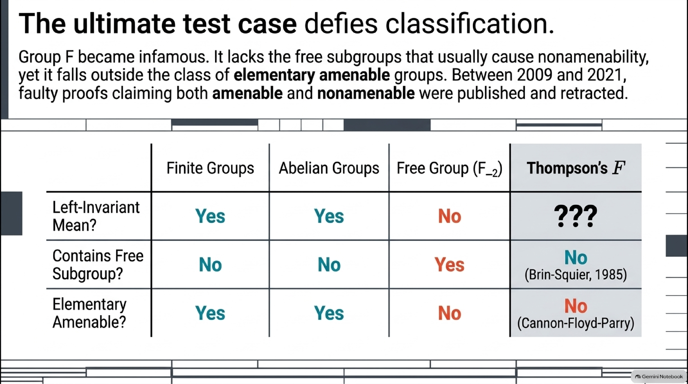

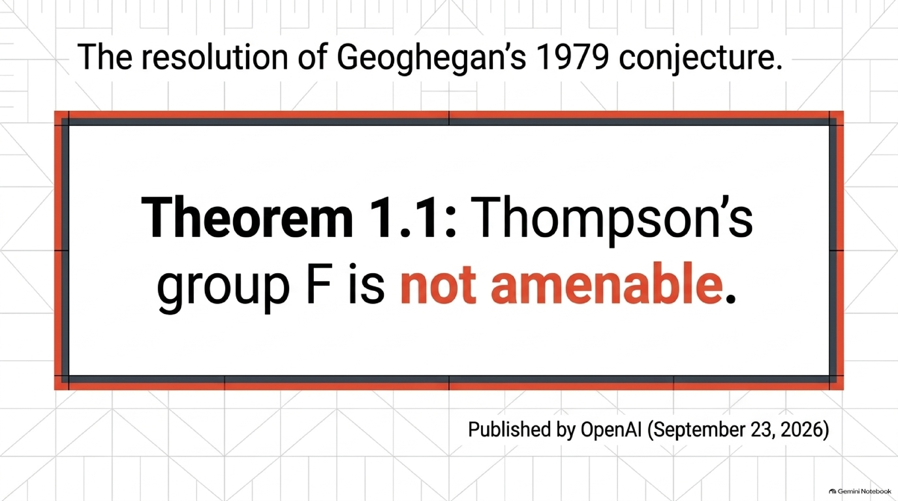

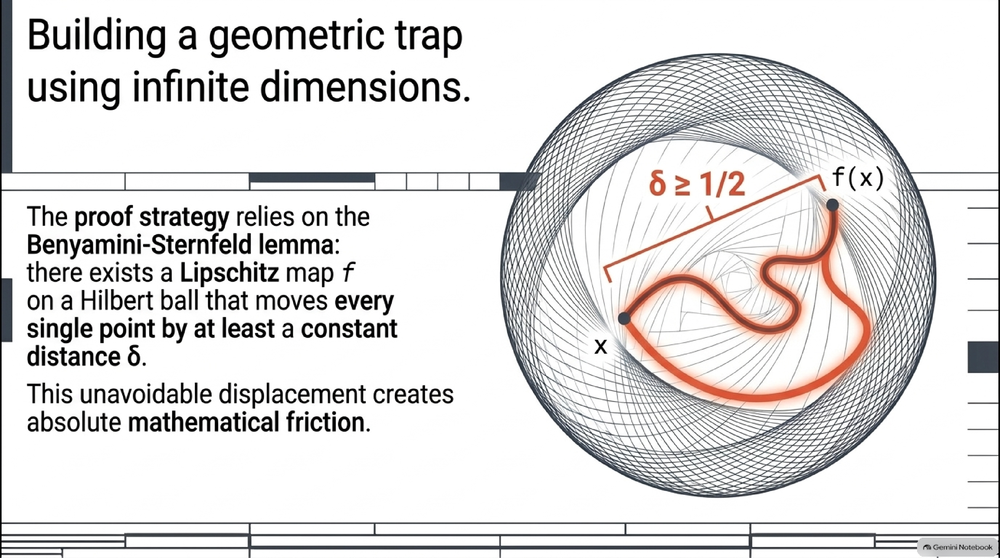

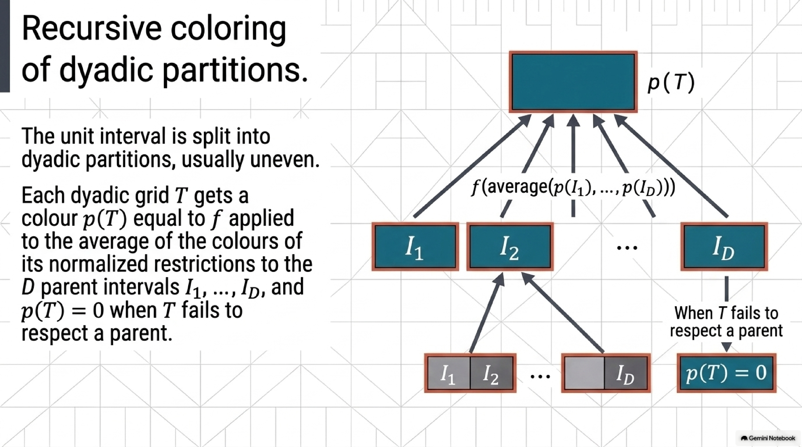


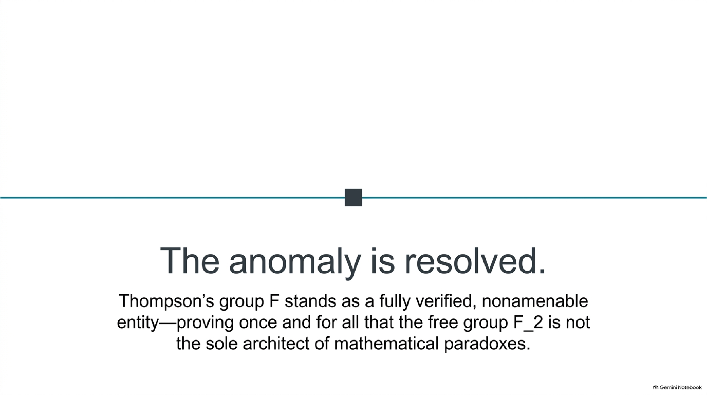

</details>

See [`assets/README.md`](assets/README.md) for the full inventory and the file-by-file [errata](assets/README.md#errata).

---

## How this explainer was made

1. The paper (with its TeX source), its openai/math README, the family entry in `CONTENTS.md`, the Lean scope document `lean/docs/248.md`, the Comparator challenge files, the main Lean file and `lean/formalization.yaml` were downloaded from [openai/math](https://github.com/openai/math).
2. The paper, the Lean scope document and the Wikipedia article on [amenable groups](https://en.wikipedia.org/wiki/Amenable_group) were loaded into a NotebookLM notebook on a second NotebookLM account, through the [`notebooklm-mcp-cli`](https://github.com/jacob-bd/gemini-notebook-mcp-cli) MCP/CLI. That notebook generated the slides, infographics, report, mind map and audio in [`assets/notebooklm/`](assets/notebooklm/), using prompts written as plain statements of the paper's results. The report and the mind map were restricted to the paper and the Lean scope document. Every slide, both infographics, the report and the mind map were then read against the paper, and the errors are listed in the [errata](assets/README.md#errata). The slide deck was not revised, because the shared NotebookLM quota was too low for a revision.
3. The text on this page was written by hand (with AI assistance) directly from the paper's TeX source and the openai/math documentation. The history table was checked against the paper's introduction and bibliography, the arXiv records of the 2009–2021 preprints, and Wikipedia's articles on amenable groups, the von Neumann conjecture, Thompson groups, the Banach–Tarski paradox and the Grigorchuk group. The relations between $A$ and $B$, the Følner ratios, the interval endpoints, the colours, the transport element, the covariance identity and the variance algebra were all computed with small scripts using exact fractions and symbolic algebra. The three figures were drawn by hand as SVG from those computed values. NotebookLM's outputs were used as visual and structural aids, not as the source of truth.

See [`PIPELINE.md`](../../PIPELINE.md) for the exact, repeatable steps.

*Citation for the underlying paper:*

```bibtex
@misc{OAI:Thompsons-group-F-is-nonamenable-September-23-2026,
  author = {{OpenAI}},
  title = {{Thompson's group $F$ is nonamenable}},
  howpublished = {OpenAI Math Release preprint
                  \href{https://github.com/openai/math/blob/main/preprints/Thompsons-group-F-is-nonamenable-September-23-2026/paper.pdf}{OAI:Thompsons-group-F-is-nonamenable-September-23-2026}},
  year = {2026}
}
```
