# Uniform bounds for planar polynomial limit cycles (Hilbert's 16th problem), explained for beginners

> - **Paper:** [*Uniform bounds for planar polynomial limit cycles*](https://github.com/openai/math/blob/main/preprints/uniform-bounds-for-planar-polynomial-limit-cycles-September-24-2026/uniform-bounds-for-planar-polynomial-limit-cycles-September-24-2026.pdf), OpenAI, 24 September 2026 (160 pages)
> - **openai/math family:** 143, *Hilbert's sixteenth problem: uniform bounds for limit cycles* · **Field:** dynamical systems (planar ordinary differential equations)
> - **Companion:** [*Two limit cycles for quintic Liénard systems*](https://github.com/openai/math/blob/main/preprints/two-limit-cycles-for-quintic-lienard-systems-September-24-2026/two-limit-cycles-for-quintic-lienard-systems-September-24-2026.pdf), OpenAI, 24 September 2026 (40 pages)
> - **Formal proof:** only the **companion's** theorem (at most two limit cycles for quintic Liénard systems) is listed as formalized in Lean 4 ([scope](https://github.com/openai/math/blob/main/lean/docs/143.md)). The principal paper's uniform bound is **not** formalized.
> - **Who this is for:** anyone who knows what a derivative is. A first course in differential equations helps but is not needed.

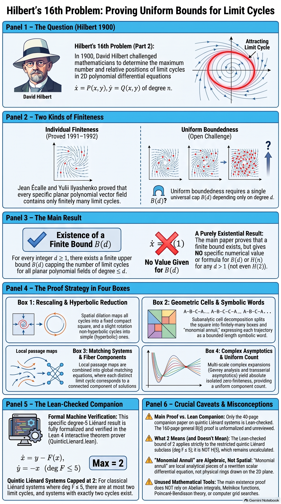

*AI-generated overview (NotebookLM). It gets the big picture right, but panel 4 overstates two proof steps (the rotation and the "word" for each trajectory), and there are typos such as "cyclc" and "Melnikox". See the [errata](assets/README.md#errata).*

## Contents

- [TL;DR](#tldr)
- [How to read this](#how-to-read-this)
- [1. The problem](#1-the-problem)
- [2. A short history](#2-a-short-history)
- [3. What the paper proves](#3-what-the-paper-proves)
- [4. Why it matters](#4-why-it-matters)
- [5. The main idea of the proof](#5-the-main-idea-of-the-proof)
- [6. The people whose ideas this builds on](#6-the-people-whose-ideas-this-builds-on)
- [7. What it does not prove, and caveats](#7-what-it-does-not-prove-and-caveats)
- [8. Glossary](#8-glossary)
- [9. Slides and other assets](#9-slides-and-other-assets)
- [How this explainer was made](#how-this-explainer-was-made)

---

## TL;DR

- **The question.** A pair of polynomial equations $\dot x = P(x,y)$, $\dot y = Q(x,y)$ describes a flow in the plane. Some flows have **limit cycles**: isolated closed loops that nearby motions spiral towards or away from. In 1900 David Hilbert asked, in the second part of his 16th problem, how many limit cycles such a system of degree $n$ can have, and how they can be arranged.
- **What was known.** Each *single* polynomial system has only finitely many limit cycles (claimed by Dulac in 1923; proved by Écalle and by Ilyashenko around 1991–92, though in 2025 Yeung questioned one step of Ilyashenko's argument). But a ceiling that depends **only on the degree** was not known for any $n \ge 2$, not even for quadratic systems, where examples with 4 limit cycles have been known since 1979–80.
- **What this paper proves.** For every degree $d$ there is a finite number $B(d)$ such that **every** real planar polynomial vector field of degree at most $d$ has at most $B(d)$ limit cycles in the whole plane. In the usual notation, the **Hilbert number** $H(d)$ is finite.
- **What the companion proves.** For the classical Liénard systems $\dot x = y - F(x)$, $\dot y = -x$ with $F$ a polynomial of degree at most 5, the exact maximum is **two** limit cycles. This settles the degree-five case of a 1977 conjecture of Lins, de Melo and Pugh, and it is the part of the family that has been checked in Lean.
- **What it doesn't do.** It gives **no formula or numerical value** for $B(d)$ or $H(d)$, not even for $d = 2$. It says nothing about how the cycles can be arranged. The 160-page argument was produced by an AI model and is not formalized, and no independent expert review of it has been reported.

## How to read this

| You have… | Read |
|---|---|
| 2 minutes | The TL;DR and the infographic above |
| 15 minutes | Sections 1–4 and 7 |
| An hour, and you like analysis | Everything, including [section 5](#5-the-main-idea-of-the-proof), the [worked example](#a-worked-example-two-limit-cycles-you-can-find-by-hand) and the [slides](#9-slides-and-other-assets) |

---

## 1. The problem

### 1.1 Vector fields and phase portraits

Pick two polynomials $P(x,y)$ and $Q(x,y)$. At every point of the plane, draw the arrow $(P, Q)$. You get a **vector field**, like a weather map of wind directions. A **solution** (or **trajectory**) of

$$\dot x = P(x,y), \qquad \dot y = Q(x,y)$$

is the path of a speck of dust carried by this wind. The dot means "rate of change in time". The **degree** of the vector field is the larger of the degrees of $P$ and $Q$. The picture of all trajectories together is called the **phase portrait**.

Two simple examples:

- $\dot x = -y$, $\dot y = x$. Every trajectory is a circle around the origin, traversed again and again. This is a **center**: every orbit is closed, but the closed orbits come in a continuous family.
- $\dot x = -x$, $\dot y = -y$. Everything flows straight into the origin. Points where the arrow is zero, like the origin here, are **equilibria**.

### 1.2 Periodic orbits and limit cycles

A **periodic orbit** is a closed loop traced by a solution that is not just sitting at an equilibrium. The paper (and the companion) use this definition:

> A periodic orbit is a **limit cycle** if some open neighborhood of it contains no other periodic orbit.

So the circles of a center are *not* limit cycles: every one of them has other circles right next to it. A limit cycle is a *lonely* closed orbit. Nearby trajectories must spiral towards it (an **attracting** cycle), away from it (a **repelling** cycle), or towards it on one side and away on the other (a **semi-stable** cycle).

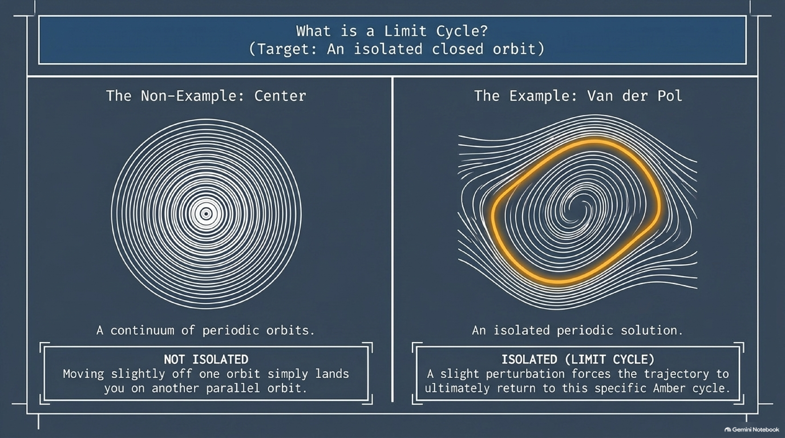

*(The slide's last line, that nearby motions "ultimately return" to the cycle, describes an attracting cycle only. A limit cycle can also repel; see the [errata](assets/README.md#errata).)*

The classic example is the **Van der Pol oscillator** from the 1920s, a model of a self-sustaining electrical circuit:

$$\ddot x - \mu(1 - x^2)\dot x + x = 0, \qquad \mu > 0.$$

Small swings are pumped up and large swings are damped, so every motion except the equilibrium settles onto one particular oscillation. That oscillation is a limit cycle, and its amplitude is close to 2 when $\mu$ is small. Written as a first-order system, the Van der Pol equation is a **Liénard system** $\dot x = y - F(x)$, $\dot y = -x$ with $F(x) = \mu(x^3/3 - x)$. This is exactly the class studied in the companion paper.

The figure below shows a Liénard system of degree five from the companion paper. It has two limit cycles: a repelling one near the circle of radius 1 (dashed) and an attracting one near the circle of radius 2 (solid).

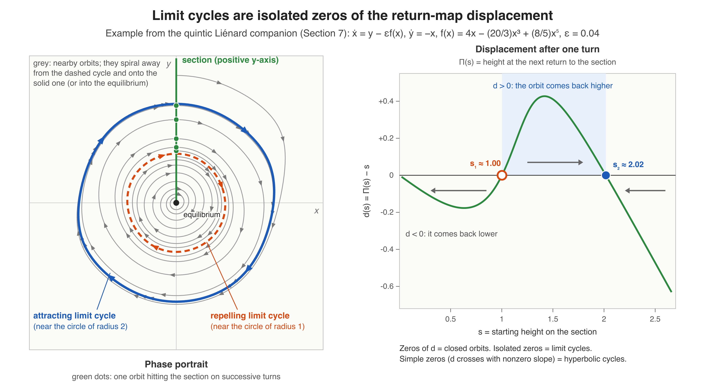

### 1.3 How to find limit cycles: the return map

Henri Poincaré's idea, which is also the starting point of this paper's proof strategy, is to watch a single line instead of the whole plane.

1. Draw a short segment that the flow crosses, a **section** (green in the figure). Label its points by a coordinate $s$.
2. Start a trajectory at $s$. Follow it once around until it comes back to the section, at the point $\Pi(s)$. The function $\Pi$ is the **return map** (or Poincaré map).
3. Look at the **displacement** $d(s) = \Pi(s) - s$. If $d(s) > 0$ the orbit comes back further out, and if $d(s) < 0$ it comes back further in.

Then:

- **closed orbits** through the section are the **zeros** of $d$;
- **limit cycles** are the **isolated** zeros of $d$;
- a limit cycle is **hyperbolic** when the zero is *simple*, meaning $\Pi'(s) \neq 1$. Hyperbolic cycles are the robust ones: a small change in the equations moves them a little but does not destroy them.

Counting limit cycles therefore means **counting isolated zeros of functions defined by differential equations**. The whole difficulty is that these functions are not given by a formula.

### 1.4 Why polynomials, and why the degree matters

Without the polynomial restriction, even a single field can have infinitely many limit cycles. In polar coordinates, the system $\dot r = \sin r$, $\dot \theta = 1$ is a perfectly smooth (even analytic) vector field on the plane. Its limit cycles are the circles $r = \pi, 2\pi, 3\pi, \dots$, infinitely many.

Polynomial fields can also have many limit cycles, if the degree is allowed to grow. Take a polynomial $p(u) = (u - 1)(u - 4)\cdots(u - k^2)$ and the system

$$\dot x = x\ p(x^2 + y^2) - y, \qquad \dot y = y\ p(x^2 + y^2) + x.$$

In polar coordinates it reads $\dot r = r\ p(r^2)$, $\dot \theta = 1$, so the circles $r = 1, 2, \dots, k$ are limit cycles. The system has degree $2k + 1$. So a field of degree $2k+1$ can have at least $k$ limit cycles. (These two examples are standard illustrations, not taken from the paper.)

So the natural question is not "finitely many?" but **"how many, at most, for a given degree?"**

### 1.5 Two kinds of finiteness

The paper stresses that two different statements must be kept apart:

| | Statement | Status before this paper |
|---|---|---|
| **Individual finiteness** | Each *single* polynomial vector field has finitely many limit cycles | Proved by Écalle and by Ilyashenko (1991–92) |
| **Uniform boundedness** | There is a ceiling $H(n)$ that works for *all* fields of degree $n$ | Open for every $n \ge 2$ |

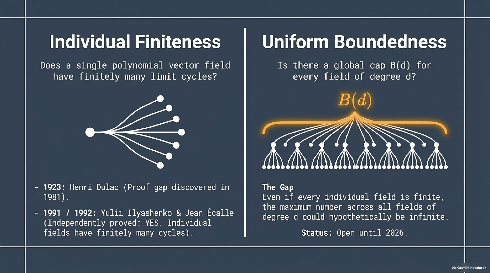

*(The slide's "Status: Open until 2026" treats the unreviewed 2026 claim as settled; see the [errata](assets/README.md#errata).)*

The first does not imply the second. A toy example, which the paper itself uses in a remark: the equation $\sin x = 0$ on the interval $0 < x < p$ has only finitely many solutions for each value of $p$, but there are more and more of them as $p$ grows. Finiteness for every member of a family gives no single bound for the family.

For vector fields, the "parameter" is the list of coefficients of $P$ and $Q$. As the coefficients change, cycles can be born from degenerate configurations (a center, a loop of trajectories joining saddle points, or "infinity") and can drift arbitrarily far from the origin. Knowing that each single field has finitely many cycles says nothing about how many such degenerations can produce. (The paper's argument does not assume the coefficients stay in a bounded set.)

The smallest number that works is called the **Hilbert number** $H(n)$:

$$H(n) = \text{the largest number of limit cycles of any planar polynomial vector field of degree } \le n.$$

Before this paper, $H(n)$ could in principle have been infinite.

Linear fields have none, so $H(1) = 0$. Quadratic fields with four limit cycles exist, so $H(2) \ge 4$. Before this paper it was not known whether $H(2)$ is finite.

---

## 2. A short history

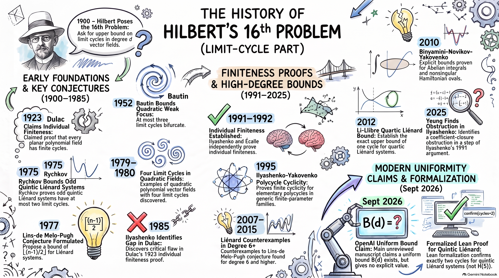

| When | Who | What happened |
|---|---|---|
| 1881–1886 | **Henri Poincaré** | The qualitative theory of differential equations: limit cycles, and the return map used to find them |
| 1900 | **David Hilbert** | Problem 16 at the Paris International Congress of Mathematicians. Its second part asks for the maximum number and the arrangement of limit cycles of planar polynomial systems |
| 1923 | **Henri Dulac** | Claims that every single polynomial vector field has finitely many limit cycles |
| 1926 | **Balthasar van der Pol** | Self-sustained ("relaxation") oscillations in electrical circuits; the Van der Pol oscillator |
| 1928 | **Alfred-Marie Liénard** | Studies the equations now named after him and gives conditions for a unique limit cycle |
| 1952 | **N. N. Bautin** | At most three limit cycles can bifurcate from a nondegenerate weak focus or center of a quadratic field under quadratic perturbations, and three can occur |
| 1955–1957 | **I. G. Petrovskii, E. M. Landis** | Claim that $H(2) = 3$ and that $H(n)$ is at most a cubic polynomial in $n$. The argument was shown to be wrong in the early 1960s |
| 1975 | **G. S. Rychkov** | Liénard systems with an *odd* quintic $F$ have at most two limit cycles |
| 1977 | **A. Lins, W. de Melo, C. C. Pugh** | Conjecture: a classical Liénard system with $\deg F = n$ has at most $\lfloor (n-1)/2 \rfloor$ limit cycles |
| 1979–1980 | **Chen Lansun and Wang Mingshu; Shi Songling** | Quadratic fields with four limit cycles, so $H(2) \ge 4$ |
| 1981 | **Yulij Ilyashenko** | Finds a serious gap in Dulac's proof (published in a 1982 preprint and his 1985 survey of Dulac's memoir) |
| 1984 | **Askold Khovanskii** | A Rolle-type principle for planar trajectories, and component bounds through critical points in the Pfaffian setting |
| 1991–1992 | **Yulij Ilyashenko; Jean Écalle** | Independent proofs of individual finiteness, using complex and asymptotic analysis of return maps |
| 1995 | **Yulij Ilyashenko, Sergei Yakovenko** | Finite cyclicity of elementary polycycles in generic finite-parameter families |
| 1998 | **Robert Roussarie** | Book on limiting periodic sets, desingularization and Hilbert's 16th problem |
| 1998 | **Stephen Smale** | Puts Hilbert's 16th problem on his list of problems for the 21st century (problem 13), asking for a bound polynomial in the degree, and singles out Liénard systems as a simpler version |
| 2003 | **Vadim Kaloshin** | An explicit cyclicity bound for elementary polycycles, in terms of the number of parameters |
| 2007–2015 | **F. Dumortier, D. Panazzolo, R. Roussarie; P. De Maesschalck, F. Dumortier; P. De Maesschalck, R. Huzak** | Counterexamples to the Lins–de Melo–Pugh bound: four cycles in degree 7, then in degree 6, then at least $n - 2$ cycles in every degree $n \ge 6$ |
| 2009 | **T. Kaiser, J.-P. Rolin, P. Speissegger** | Transition maps at nonresonant hyperbolic singularities are definable in an o-minimal structure; uniform bounds near certain polycycles |
| 2010 | **G. Binyamini, D. Novikov, S. Yakovenko** | Explicit bounds for the "infinitesimal" Hilbert 16th problem (zeros of Abelian integrals) |
| 2012 | **Chengzhi Li, Jaume Llibre** | Quartic classical Liénard systems have at most one limit cycle |
| 2014 | **Chengzhi Li, Kening Lu** | In degree five, nondegenerate slow–fast cycles have cyclicity at most two |
| 2025 | **Melvin Yeung** | Identifies a coefficient-closure obstruction in a leading-term argument of Ilyashenko's 1991 monograph. The paper notes this is a problem with that proof method, not a counterexample |
| Sept 2026 | **OpenAI** (internal model) | A finite bound $B(d)$ for every degree; exactly two cycles for quintic classical Liénard systems |

---

## 3. What the paper proves

> **Main theorem (Theorem 1.1, Uniform boundedness).** For each integer $d \ge 1$ there is a finite nonnegative integer $B(d)$ such that every real planar polynomial vector field of degree at most $d$ has at most $B(d)$ limit cycles in the whole plane.

In plain words: fix the degree. However you choose the coefficients, however large they are, and wherever in the plane the cycles sit, you can never get more than $B(d)$ limit cycles. Every limit cycle counts once, whether it attracts, repels, or is degenerate. So the Hilbert number is finite: $H(d) \le B(d) < \infty$.

Three details matter:

- **No restrictions.** The paper says there is no restriction on the coefficients, the locations of the cycles, or their stability.
- **No formula.** The paper says plainly that it "does not furnish an effective formula for $B(d)$".
- **Individual finiteness comes for free.** The proof does not assume that each field has finitely many limit cycles. That follows as a corollary, so the paper also gives a proof of individual finiteness that does not rely on Écalle's or Ilyashenko's.

The companion proves a sharp result for one special class:

> **Companion theorem (Theorem 1.1).** If $\deg F \le 5$, the Liénard system $\dot x = y - F(x)$, $\dot y = -x$ has at most two limit cycles in $\mathbb{R}^2$. Some members of this class have two limit cycles. Thus its exact maximum is two.

No parity, sign, amplitude or hyperbolicity condition is imposed on $F$. This is the case $n = 5$ of the Lins–de Melo–Pugh conjecture, since $\lfloor (5-1)/2 \rfloor = 2$. The Lean 4 statement in [openai/math](https://github.com/openai/math/blob/main/lean/ComparatorChallenges/QuinticLienard.lean) reads:

```lean
theorem main :
    (∀ F : Polynomial ℝ, F.degree ≤ 5 → {C : Set Plane | IsLimitCycle F C}.encard ≤ 2) ∧
    (∃ F : Polynomial ℝ, F.degree ≤ 5 ∧ {C : Set Plane | IsLimitCycle F C}.encard = 2)
```

Here `IsLimitCycle F C` says that `C` is the image of a nonconstant periodic solution and that some open set around `C` contains no other periodic orbit, the same definition as above.

---

## 4. Why it matters

| Question | Before | After (if the proofs are correct) |
|---|---|---|
| **Is $H(n)$ finite?** | Open for every $n \ge 2$ (Hilbert's question in its "existential" form) | **Yes, for every $n$**, though with no value |
| **Quadratic fields** | At least 4 limit cycles possible; no upper bound proved | Some finite upper bound exists. Its value is still unknown |
| **Individual finiteness** | Écalle and Ilyashenko (1991–92). Yeung (2025) questioned one step of Ilyashenko's method | Re-derived as a corollary, without using the earlier proofs |
| **Quintic classical Liénard systems** (companion) | The Lins–de Melo–Pugh bound was proved for odd quintic $F$ (Rychkov) and was false from degree 6 on. The general quintic case was reported open in August 2026 | Exact maximum **2**, with the upper bound and the example both checked in Lean |
| **Method** | Uniform bounds were known in local, generic or restricted settings (Bautin, Ilyashenko–Yakovenko, Kaloshin, Kaiser–Rolin–Speissegger) and for the infinitesimal problem (Binyamini–Novikov–Yakovenko) | A general "absolute finiteness ⇒ uniform bound" counting principle that the paper says can be applied to other classes of equations |

The deeper point is the switch from *one field at a time* to *all fields of a given degree at once*. Earlier finiteness proofs studied one return map very carefully. This paper sets up finitely many fixed systems of equations in which the coefficients of the vector field enter only as parameters, and bounds the number of solution pieces for all values of those parameters at once.

---

## 5. The main idea of the proof

The principal paper has 11 sections over 160 pages. Most of it (Sections 2–8) is a new asymptotic analysis. The overall logic, though, is in Section 1.2 and the final Section 11, and can be followed without the analysis. Here it is at three zoom levels.

### Level 1: the one-paragraph version

Put all the cycles you want to count into one fixed square, and nudge the field so that you get at least as many *hyperbolic* (robust) cycles. Then cut the square into finitely many standard pieces whose types depend only on the degree. Each cycle is now described by a "word", the list of pieces it passes through, and only finitely many words are possible. For each word, the paper writes down one fixed system of analytic equations ("matching equations") in which the coefficients of the vector field appear as parameters. Every hyperbolic cycle gives a solution, and **different cycles land in different connected pieces of the solution set**. A general counting theorem then bounds the number of connected pieces **by a constant that does not depend on the parameters**. The theorem only applies if the equations pass a very strong finiteness test. Passing that test is the hard part. When solutions run off to infinity, the paper expands the functions involved in exponentially small quantities on nested complex domains, and shows that the expansion either has a nonzero leading term or the function is identically zero.

> **Analogy:** think of a hotel with finitely many floor plans (the words). Each guest (a hyperbolic limit cycle) must sleep in a separate room (a connected component). If you can show that every floor plan has at most $N$ rooms, however the building is stretched (the coefficients), then there are at most (number of plans) × $N$ guests.

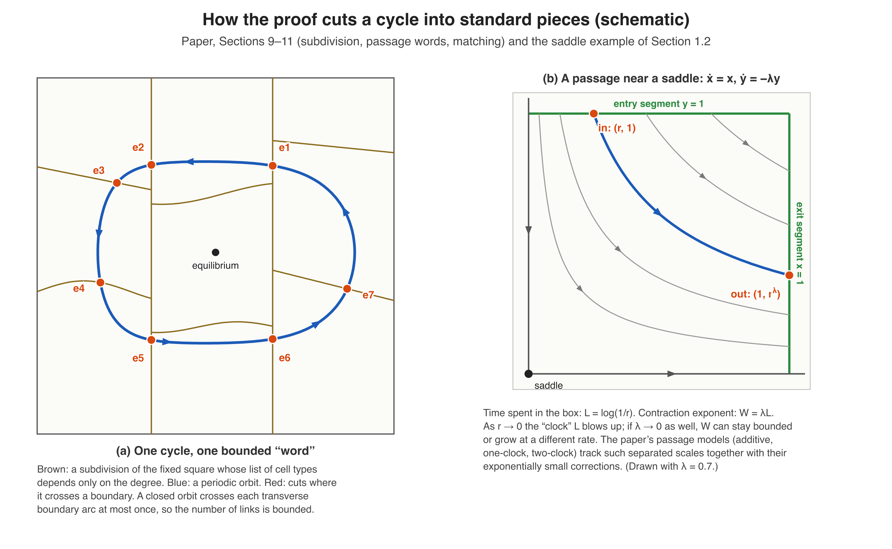

### Level 2: the step-by-step picture

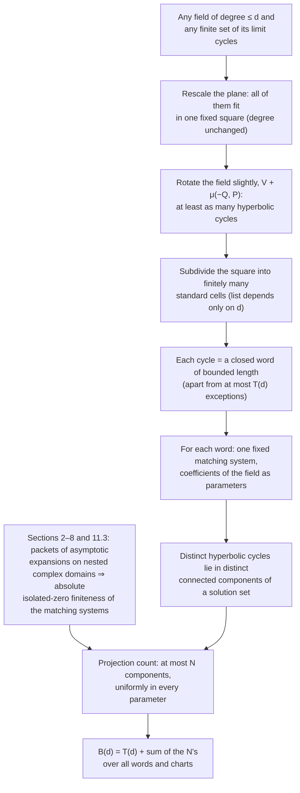
```mermaid
flowchart TD
    A["Any field of degree ≤ d and<br/>any finite set of its limit cycles"] --> B["Rescale the plane: all of them fit<br/>in one fixed square (degree unchanged)"]
    B --> C["Rotate the field slightly, V + μ(−Q, P):<br/>at least as many hyperbolic cycles"]
    C --> D["Subdivide the square into finitely many<br/>standard cells (list depends only on d)"]
    D --> E["Each cycle = a closed word of bounded length<br/>(apart from at most T(d) exceptions)"]
    E --> F["For each word: one fixed matching system,<br/>coefficients of the field as parameters"]
    F --> G["Distinct hyperbolic cycles lie in distinct<br/>connected components of a solution set"]
    H["Sections 2–8 and 11.3: packets of asymptotic<br/>expansions on nested complex domains ⇒ absolute<br/>isolated-zero finiteness of the matching systems"] --> I
    G --> I["Projection count: at most N components,<br/>uniformly in every parameter"]
    I --> J["B(d) = T(d) + sum of the N's<br/>over all words and charts"]
```

**Step 1: One box, robust cycles (Section 11.4).** Changing coordinates by $z = a + Ru$ shrinks the plane. It keeps the degree and moves any finite set of cycles into one fixed square. Then comes a small trick. Replacing $V = (P, Q)$ by $V + \mu(-Q, P)$ for a small $\mu$ of a well-chosen sign *rotates* every arrow slightly. This turns any finite collection of limit cycles, even degenerate ones, into **at least as many hyperbolic cycles** nearby, and it does not raise the degree. So it is enough to bound hyperbolic cycles inside one square, uniformly over all coefficients.

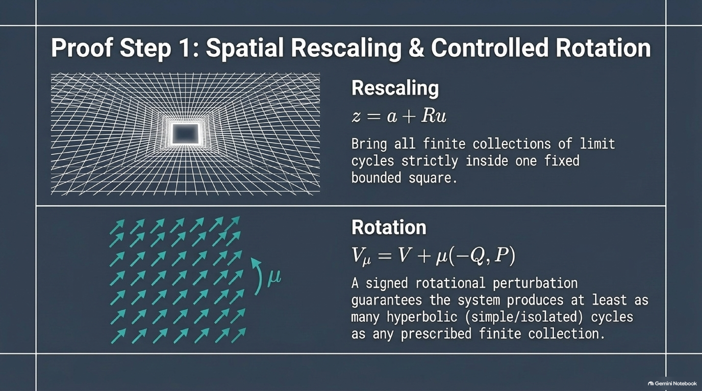

*(The slide glosses hyperbolic as "simple/isolated". Hyperbolic means a simple zero of the displacement; being isolated is weaker. See the [errata](assets/README.md#errata).)*

**Step 2: A finite catalogue of pieces (Section 9).** Using a "preparation theorem" for globally subanalytic functions (due to Lion and Rolin), with the coefficients treated as parameters, the square is cut into finitely many cells. On each cell the orbit equation is rewritten as a single scalar equation (for example $dy/dx = Q/P$ away from $P = 0$) of one of a few prepared forms: a constant-state field, a box where it has no zero or a simple root, or a "monomial annulus" where it is a monomial times a nearly constant factor. The *list* of cell types and the bounds on their number depend only on the degree $d$, never on the particular coefficients.

**Step 3: Bounded words (Lemma 9.6).** A periodic orbit is a closed curve without self-intersections, so it has an inside and an outside. Walk along a boundary arc. Each time the arc meets the orbit, the arc passes from outside the loop to inside, or back out, alternately. So the orbit would have to cross the arc in alternating directions. On an arc where the flow always crosses in the same direction that is impossible, so the orbit meets such an arc **at most once**. (This is the no-contact case of Khovanskii's planar Rolle principle.) Orbits that run *along* a boundary arc are at most $T(d)$ exceptions. Every other cycle is a cyclic list of at most $N_d$ passages through cells. Only finitely many such words exist.

**Step 4: Standard passages (Sections 6–8 and 10).** Each piece of the orbit between two cuts is computed by one scalar differential equation, a **transfer**. There are only four kinds: an ordinary analytic transfer, an additive transfer, a transfer with one large "clock", and a mixed transfer with two clocks. The paper's motivating example is a saddle, $\dot x = x$, $\dot y = -\lambda y$ (panel (b) above). An orbit entering at $(r, 1)$ leaves at $(1, r^{\lambda})$ after time $L = \log(1/r)$, and its contraction exponent is $W = \lambda L$. As $r \to 0$ the first clock $L$ blows up. If $\lambda \to 0$ at the same time, the second clock $W$ may stay bounded or blow up at a different rate. That is exactly the kind of degeneration a *uniform* bound must survive.

**Step 5: Matching systems (Theorem 11.4).** For a word with $k$ links, the unknowns are the $k$ cut points $e_1, \dots, e_k$ (plus auxiliary variables), and there is one equation per link: "the transfer starting at $e_j$ arrives at $e_{j+1}$". Three facts make this system useful:

- The cuts can slide along the orbit, so each cycle gives a whole $k$-dimensional family of solutions, not a point.
- At a hyperbolic cycle the equations have full rank, because the product of the link derivatives is the return multiplier, which is not 1.
- Two different hyperbolic cycles **cannot lie in the same connected component** of the solution set. This is proved by an analytic-continuation argument: along a connected component, the first endpoint is stuck on one cycle.

So bounding cycles reduces to bounding **connected components of solution sets**, uniformly in the parameters.

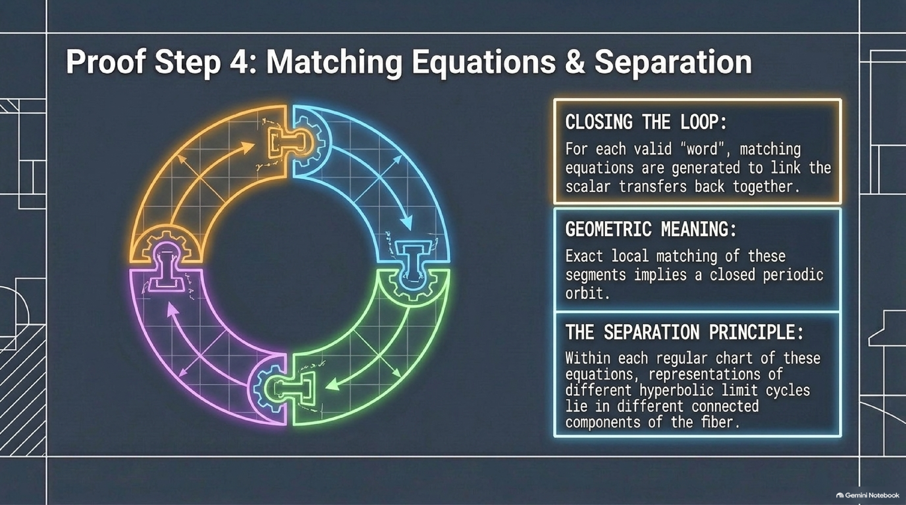

*(The deck numbers the steps differently: its step 4 is Step 5 here. "Exact local matching implies a closed periodic orbit" holds only near actual cycles, since a component can also contain points that are not physical orbits. The slide's "separation principle" is not the paper's separation theorem. See the [errata](assets/README.md#errata).)*

**Step 6: The projection count (Theorem 11.2).** Suppose a system $F(p, x) = 0$, with parameters $p$, has a strong property called **absolute isolated-zero finiteness**. This means that it, and every system built from it by taking derivatives, adding multiplier variables and so on, has only finitely many isolated solutions *when the parameters are treated as unknowns too*. Then the number of connected components of the solution set $\lbrace x : F(p,x) = 0 \rbrace$ is bounded by one constant $N$ for **all** $p$. The proof uses a bowl-shaped function that every component must have a lowest point of, plus Sard's theorem and an induction on the number of parameters (see Level 3).

The paper's own warning example shows why the strong hypothesis is needed. The zeros of $\sin x$ on $0 < x < p$ are not isolated in the $(p, x)$-plane, yet their number for fixed $p$ is unbounded. Adding the harmless-looking equation $p = x + 1$ produces infinitely many isolated solutions. The finiteness test therefore has to hold for every system in the closure, not just the original one.

**Step 7: Passing the finiteness test (Sections 2–5, used in Section 11.3).** Suppose some system had infinitely many isolated solutions. Take a sequence of them.

- *If the sequence stays bounded*, the equations are analytic near the limit point, and isolated zeros of an analytic system cannot pile up. Contradiction.
- *If some coordinates run off to infinity*, the paper sorts the large quantities into a **logarithmic flag** $Z_1 \gg Z_2 \gg \cdots \gg Z_m \gg 1$, the scales at which things blow up. Every function in the system is then described by a **packet**: the function itself, plus two trees of successive asymptotic expansions in the exponentially small quantities $e^{-Z_i}$, valid on nested complex domains on either side of the real line. The **separation theorem** (Theorem 3.2) says that either some coefficient in the tree is nonzero, and it gives the leading behavior, or the function is identically zero. A calculus for packets (Theorem 4.4) and an elimination procedure (Section 5, ending in Theorem 5.7) then build a chart where the equations vanish identically while one large coordinate is still free to move. Moving it gives nearby solutions, so the original solutions were not isolated. Contradiction again.

**Step 8: Add up.** The bound is

$$B(d) = T(d) + \sum_{\text{words } w}\ \sum_{\text{charts } I} N_{w,I},$$

a finite sum of numbers that depend only on the degree.

### Level 3: the key arguments, for readers with background

**The rotation trick (Lemma 11.8).** Let $z(t)$ be a limit cycle with period $T$, and perturb to $V_\mu = V + \mu J V$ with $J(a,b) = (-b, a)$. The derivative $u = \partial_\mu z_\mu$ satisfies $u' = DV(z)\ u + JV(z)$. For $w(t) = \det(V(z(t)), u(t))$ one gets

$$w' = (\operatorname{div} V)\ w + \lvert V \rvert^2, \qquad w(T) = \int_0^T e^{\int_s^T \operatorname{div} V}\ \lvert V(z(s)) \rvert^2\ ds > 0.$$

So the displacement $D(r, \mu)$ has $D_\mu(0,0) \neq 0$, and its zero set is a curve $\mu = \psi(r) = a r^m + O(r^{m+1})$ with $a \neq 0$. If $m$ is odd, each small sign of $\mu$ gives one simple zero nearby. If $m$ is even, one sign gives two. Choosing the better sign for a whole collection of cycles gives at least as many hyperbolic cycles as there were cycles. Rotating the field is a constant linear combination of $P$ and $Q$, so the degree does not go up.

**The projection count (Theorem 11.2).** On the solution set of $F(p,x) = 0$ with margins $g_j > 0$, use

$$\rho(p,x) = 1 + \lvert p \rvert^2 + \lvert x \rvert^2 + \sum_j g_j(p,x)^{-2}.$$

Its sublevel sets are compact, so on every fiber each connected component contains a minimum of $\rho + \ell \cdot x$ for any linear "tilt" $\ell$. For square systems, freeing one parameter $t$ turns the solutions into curves on which $t$ is monotone. Sard's theorem gives one tilt that makes all their minima nondegenerate for almost every remaining parameter. These minima solve a new square critical-point system with **one parameter fewer**, which still lies in the closure where absolute finiteness holds. Induction and a perturbation argument for the exceptional parameters finish the square case. Fibers of positive dimension are handled with Lagrange multipliers. This step is like the classical uniform bounds on fiber components for subanalytic families (Gabrielov) and Khovanskii's critical-point method, adapted to open analytic systems with an explicit closure hypothesis.

**Why complex domains and "trees" (Sections 2–4).** A real function can vanish to infinite order without being zero: $e^{-1/x^2}$ near $x = 0$ is the textbook example. So real asymptotics alone cannot decide whether a return-map displacement is identically zero. The Écalle–Ilyashenko tradition gets around this with *quasianalyticity*: an analytic function on a large enough complex domain is determined by its asymptotic expansion. This paper does **not** assume that a single convergent series in all the small exponentials exists. Instead it uses a *tree* of expansions on successive complex bands, and upgrades "decays faster than any fixed exponential" to "is exactly zero" with weighted Cauchy corrections and maximum principles. Yeung's 2025 observation, that a closure step fails in a classical leading-term argument, is why the paper builds its own *differentiated* calculus (Theorem 4.4) before making any implicit substitution. One more structural point: the flags and charts used in a finiteness test depend on the chosen sequence. They are never used to cover the coefficient space. The uniformity comes only from the finite geometric catalogue and the projection count.

### A worked example: two limit cycles you can find by hand

The companion's Section 7 proves that two cycles really occur, with a calculation a first-year student can follow. Take

$$\dot x = y - \varepsilon f(x),\qquad \dot y = -x,\qquad f(x) = 4x - \tfrac{20}{3}x^3 + \tfrac{8}{5}x^5 .$$

**Energy.** Let $E = (x^2 + y^2)/2$. Along solutions,

$$\dot E = x\dot x + y \dot y = x(y - \varepsilon f(x)) - yx = -\varepsilon\ x f(x).$$

**One turn.** When $\varepsilon = 0$ the orbit through $(0, s)$ is the circle $x = s\sin t$, $y = s\cos t$. To first order in $\varepsilon$, the energy gained in one turn is $\varepsilon Q(s)$ with

$$Q(s) = -\int_0^{2\pi} x f(x)\ dt = -\int_0^{2\pi}\Big(4s^2\sin^2 t - \tfrac{20}{3}s^4 \sin^4 t + \tfrac{8}{5}s^6\sin^6 t\Big)dt .$$

Using $\int_0^{2\pi}\sin^2 t\ dt = \pi$, $\int_0^{2\pi}\sin^4 t\ dt = 3\pi/4$ and $\int_0^{2\pi}\sin^6 t\ dt = 5\pi/8$:

$$Q(s) = -\pi s^2\left(4 - 5s^2 + s^4\right) = -\pi s^2 (s^2 - 1)(s^2 - 4).$$

**Read off the cycles.** $Q$ vanishes at $s = 1$ and $s = 2$, and the zeros are simple: $Q'(1) = 6\pi$ and $Q'(2) = -48\pi$. The implicit function theorem turns them into two genuine periodic orbits for small $\varepsilon > 0$, near the circles of radius 1 and 2. The signs tell you the stability. For $1 < s < 2$ energy grows, and outside that range it shrinks. So the inner cycle **repels** and the outer one **attracts**, exactly as in the [figure in section 1.2](#12-periodic-orbits-and-limit-cycles). That figure was computed numerically with $\varepsilon = 0.04$, which puts the cycles at heights $s \approx 1.00$ and $s \approx 2.02$ on the section.

<details>
<summary><b>The same calculation for Van der Pol</b> (one cycle of amplitude 2)</summary>

Van der Pol's equation is the Liénard system with $\varepsilon f(x) = \mu(x^3/3 - x)$. The same computation gives

$$Q(s) = -\int_0^{2\pi}\Big(\tfrac{1}{3}s^4\sin^4 t - s^2\sin^2 t\Big)dt = \pi s^2\Big(1 - \frac{s^2}{4}\Big),$$

which has a single simple zero at $s = 2$. That is the classical amplitude 2 of the Van der Pol cycle for small $\mu$.

Only the odd-degree terms of $F$ contribute: an even-degree term $x^{2j}$ turns $x f(x)$ into an odd power of $\sin t$, which integrates to zero over a full turn. After removing the factor $s^2$, a cubic $F$ therefore gives a polynomial of degree 1 in $s^2$, with at most one positive root. A quintic $F$ gives degree 2 in $s^2$, hence up to two. In general this count gives $\lfloor (n-1)/2 \rfloor$, the Lins–de Melo–Pugh number.

(This first-order count only describes the cycles that branch off the circles of the center when $\varepsilon$ is *small*. From degree 6 on, the true maximum is larger, as the counterexamples in the history table show. Proving that no quintic $F$, small or large, gives more than two is the hard part of the companion.)
</details>

### How the companion proves "at most two"

The upper bound is a different, self-contained argument (companion Sections 2–6):

1. **Fold the plane.** On each half-plane $x > 0$ and $x < 0$, set $u = x^2/2$ and use $y$ as the coordinate along the orbit. An orbit becomes an "arch" solving $du/dy = \phi_\pm(u) - y$ with $\phi_\pm(u) = F(\pm\sqrt{2u})$. The even coefficients of $F$ give the same part in both profiles, and the odd coefficients change sign.
2. **Match the halves.** A periodic orbit is a right arch and a left arch with the same endpoints on the $y$-axis. Measure each arch at height zero by its half-width $r$ and the midpoint $M_\pm(0,r)$ of its endpoints. Periodic orbits then correspond exactly to the zeros of one function $\Delta(r) = M_+(0,r) - M_-(0,r)$ on one interval (Proposition 2.5).
3. **Fit by parabolas.** Every arch's data $(M, M_r)$ is matched by a unique quadratic profile $\lambda(u - h) + \kappa(u - h)^2/2$ (Theorem 3.6). Transport equations (Lemma 3.7) say how the fitted slope $\lambda$ and curvature $\kappa$ change along an arch. A model inequality, proved with endpoint variations, a Riccati linearization and a Schwarzian-derivative identity, controls their coefficients. Together they turn sign conditions on the profile $\phi_\pm$ into monotonicity statements for $\kappa$ and $\lambda$.
4. **Four sign cases.** Normalize the top coefficient to be $\ge 0$ and split by the signs of the coefficients of $x$ and $x^3$. In three cases there is at most one cycle. In the remaining case the matching function satisfies $\Delta' = A\Delta + Bq$ with $B > 0$ and $q$ nondecreasing. Multiplying $\Delta$ by a positive integrating factor removes the $A\Delta$ term, so the new function's derivative is a positive multiple of $q$. A function whose derivative has the sign of a nondecreasing function first decreases, then increases, so it has **at most two isolated zeros**, and so does $\Delta$. This argument counts multiple and degenerate cycles directly, without perturbing them away.

The two-cycle example above falls in exactly this remaining case, Case 2 of the companion's Section 6 (positive $x$ coefficient, negative $x^3$ coefficient).

---

## 6. The people whose ideas this builds on

| Person | Idea | Where it shows up |
|---|---|---|
| **Henri Poincaré** | Qualitative theory; return maps | The displacement function whose isolated zeros are the limit cycles (Section 1.2 of the paper) |
| **David Hilbert** | The 16th problem | The question being answered |
| **Henri Dulac, Yulij Ilyashenko, Jean Écalle** | Individual finiteness; complex and asymptotic analysis of return maps; quasianalyticity | The separation theorem continues their idea that a suitably analytic function is determined by its asymptotics |
| **N. N. Bautin** | Sharp local bound (three) near a quadratic weak focus or center | Historical context: what the paper calls a foundational local result |
| **Robert Roussarie** | Limit periodic sets, graphics, desingularization | Historical context for the geometric approach to uniformity |
| **Yulij Ilyashenko, Sergei Yakovenko; Vadim Kaloshin** | Finite cyclicity of elementary polycycles; cyclic systems of equations for a return map | The paper's matching equations generalize the Ilyashenko–Yakovenko cyclic systems, with cuts allowed to slide |
| **Gal Binyamini, Dmitry Novikov, Sergei Yakovenko** | Explicit bounds for the infinitesimal problem | Context: explicit bounds for a related, linearized version of the question |
| **Tobias Kaiser, Jean-Philippe Rolin, Patrick Speissegger; Zeinab Galal** | o-minimality of transition maps; Ilyashenko algebras | Parallel approach through definability; the paper proves the closure properties it needs instead of assuming definability |
| **Jean-Marie Lion, Jean-Philippe Rolin; Andre Opris** | Preparation theorem for globally subanalytic functions | Step 2: the finite catalogue of cells |
| **Askold Khovanskii** | Rolle principle for planar trajectories; critical-point method for component bounds | Steps 3 and 6 |
| **Andrei Gabrielov; Edward Bierstone, Pierre Milman** | Projections of semianalytic sets; uniform bounds on components; local finiteness of analytic sets | Steps 6 and 7 |
| **Arthur Sard** | Sard's theorem | The generic tilt in the projection count |
| **Melvin Yeung** | A closure obstruction in a classical leading-term argument | The reason the paper builds a differentiated packet calculus |
| **Alfred-Marie Liénard, Balthasar van der Pol** | Liénard systems; the Van der Pol oscillator | Liénard systems are the companion's class of equations; Van der Pol is this explainer's warm-up example |
| **A. Lins, W. de Melo, C. C. Pugh; G. S. Rychkov; C. Li, J. Llibre; C. Li, K. Lu; P. De Maesschalck, F. Dumortier, R. Huzak, D. Panazzolo, R. Roussarie** | The Lins–de Melo–Pugh conjecture, its proofs in low degree and its counterexamples | The companion settles the open degree-five case |
| **K. Odani** | Liénard systems with exactly $N$ periodic solutions | The companion uses it to show that a 2026 preprint's proposed four-cycle quintic example actually has two cycles |
| **V. Ovsienko, S. Tabachnikov; B. Coll, A. Gasull, R. Prohens** | The Schwarzian derivative and its use for cycle bounds | The companion's model inequality |

---

## 7. What it does not prove, and caveats

> [!IMPORTANT]
> **No value of the Hilbert number.** The paper proves that $B(d)$ exists but, in its own words, "does not furnish an effective formula" for it. Its key finiteness steps argue by contradiction along sequences of solutions, which shows that a bound exists without computing one. So $H(2)$ is still unknown: four limit cycles are possible, and the paper gives no upper bound you could write down.

> [!IMPORTANT]
> **Only the counting part of Hilbert's question.** Hilbert also asked about the *arrangement* of limit cycles (which can sit inside which), and the first part of his problem concerns real algebraic curves and surfaces. Neither is addressed.

> [!NOTE]
> **The companion is about one special class.** "At most two" holds for $\dot x = y - F(x)$, $\dot y = -x$ with $\deg F \le 5$. It does **not** say that $H(5) = 2$. A general field of degree 5 can have more: quadratic fields count as "degree at most 5", and they can already have four.

> [!WARNING]
> **An extraordinary claim that is not yet checked.** Uniform boundedness has been open since 1900, and the history includes a famous gap (Dulac's) and a recently identified obstruction in a classical argument (Yeung's). The principal paper's proof is 160 pages of new asymptotic machinery. It has **not** been formalized, and as of October 2026 it is a preprint with no independent expert review reported. The openai/math README warns that "some of the unformalized results could have issues".

> [!NOTE]
> **Provenance.** Both papers were produced by an unreleased internal OpenAI model as part of the [openai/math](https://github.com/openai/math) release. According to that repository's README, most results came from the same fixed procedure. This family is not among the listed exceptions, and no human editing is mentioned for it.

> [!NOTE]
> **Verification status.** The Lean scope document [`lean/docs/143.md`](https://github.com/openai/math/blob/main/lean/docs/143.md) covers **only the companion**: "every real polynomial $F$ of degree at most five yields at most two limit cycles, and that some such $F$ yields exactly two", with no sign, parity, hyperbolicity or amplitude restriction. [`lean/formalization.yaml`](https://github.com/openai/math/blob/main/lean/formalization.yaml) lists the companion among its sources and the declaration `OAI.QuinticLienard.main` (in `OAI/Analysis/LienardCycles/Main.lean`, Comparator configuration `ComparatorChallenges/QuinticLienard.json`, allowed axioms `propext`, `Quot.sound` and `Classical.choice`) among its main results. The principal paper does not appear in that file. The catalogue as a whole lists its formalization method as `agent` and its review status as `unchecked`. This explainer did not re-run the Lean build or the Comparator check.

> [!TIP]
> **Simplifications.** To stay readable, this explainer leaves out the preparation parameters, the minor charts, the exceptional tangential orbits, the precise closure operations, and nearly all of the asymptotic bookkeeping (bands, fringes, lateral determinations, safe columns). Every precise statement is in the paper.

---

## 8. Glossary

| Term | Meaning |
|---|---|
| **Vector field** $(P, Q)$ | An arrow at every point of the plane; solutions of $\dot x = P$, $\dot y = Q$ follow the arrows |
| **Degree** | The largest degree of the polynomials $P$ and $Q$ |
| **Trajectory / orbit** | The path traced by one solution |
| **Phase portrait** | The picture of all trajectories of a vector field |
| **Equilibrium** | A point where the vector field is zero; the solution stays put |
| **Periodic orbit** | A closed loop traced by a nonconstant solution |
| **Limit cycle** | A periodic orbit with a neighborhood containing no other periodic orbit |
| **Attracting / repelling / semi-stable** | Nearby orbits spiral towards it / away from it / towards it on one side only |
| **Center** | An equilibrium surrounded by a continuous family of closed orbits; none of them is a limit cycle |
| **Section** | A short segment crossed by the flow, used to watch the orbits come back |
| **Return (Poincaré) map** $\Pi$ | Where an orbit starting on the section first comes back to it |
| **Displacement** $d(s) = \Pi(s) - s$ | Its zeros are closed orbits; isolated zeros are limit cycles |
| **Hyperbolic limit cycle** | A limit cycle whose return map has derivative $\neq 1$, so a simple zero of the displacement; it survives small perturbations |
| **Hilbert number** $H(n)$ | The largest number of limit cycles of any planar polynomial vector field of degree $\le n$; this paper proves it is finite |
| **Individual finiteness / uniform boundedness** | Finitely many cycles for each field / one bound for all fields of a given degree |
| **Liénard system** | $\dot x = y - F(x)$, $\dot y = -x$, equivalent to $\ddot x + F'(x)\dot x + x = 0$ |
| **Saddle** | An equilibrium where orbits come in along one direction and leave along another |
| **Polycycle (graphic)** | A closed chain of trajectories joining equilibria; limit cycles can be born from it as coefficients vary |
| **Cyclicity** | How many limit cycles can appear near a given configuration under small perturbations in a family |
| **Subanalytic set** | A set built by projecting sets defined by analytic equations and inequalities; *globally* subanalytic sets can be cut into finitely many well-behaved cells |
| **Asymptotic expansion** | An approximation by a series of simpler terms (here, powers of exponentially small quantities $e^{-Z}$) that gets more accurate as the variables grow |
| **Packet** (this paper) | A function together with two trees of asymptotic expansions on nested complex domains, with the estimates that link them |
| **Matching system** (this paper) | Equations saying that consecutive passage maps connect a cycle's cut points |
| **Absolute isolated-zero finiteness** (this paper) | A system, and every system built from it, has finitely many isolated solutions even when its parameters are treated as unknowns |
| **Connected component** | A maximal piece of a set that does not fall apart into separate parts |
| **Sard's theorem** | For a smooth map, the set of critical values has measure zero, so "most" values are regular |
| **Lean 4** | A proof assistant: software that mechanically checks every logical step of a proof |

---

## 9. Slides and other assets

Everything in the first six rows below was generated with **Google NotebookLM** (now "Gemini Notebook") from the paper, the companion, the Lean scope document and the Wikipedia article on Hilbert's sixteenth problem. The report, the mind map and the audio used only the two papers and the Lean document. The outputs are kept exactly as NotebookLM produced them. They are AI-generated: seven of the fifteen slides contain serious errors, and all but one of the rest have smaller slips. See the [errata](assets/README.md#errata) before relying on any detail.

| Asset | What it is |
|---|---|
| [Slide deck (PDF)](assets/notebooklm/slides.pdf) ([PPTX](assets/notebooklm/slides.pptx)) | 15 beginner slides. Slides 4, 7, 9, 10, 12, 14 and 15 have serious errors (wrong pictures, labels or statements); every other slide except slide 5 has a smaller slip. All are listed in the errata |
| [Infographic: overview](assets/notebooklm/infographic-overview.png) | The one-page summary shown at the top. Panel 4 overstates two proof steps; several typos |
| [Infographic: history timeline](assets/notebooklm/infographic-history-timeline.png) | From Hilbert (1900) to the 2026 preprints |
| [Beginner report](assets/notebooklm/beginner-explainer-report.md) | NotebookLM's long-form written explainer, restricted to the paper sources |
| [Mind map](assets/notebooklm/mindmaps.md) | How the two proofs fit together, as a nested list ([JSON](assets/notebooklm/mindmap-proof.json)). It leaves out the steps that make the bound uniform; see the errata |
| [Audio overview (≈1.5 min)](assets/notebooklm/audio-overview-brief.m4a) | A short podcast-style summary. Not reviewed |
| [Assets README and errata](assets/README.md) | Inventory, notebook sources, and every error found |
| [Limit cycles and the return map](assets/figures/limit-cycles-return-map.svg) ([PNG](assets/figures/limit-cycles-return-map.png)) | Hand-made figure, computed numerically: the companion's two-cycle example and its displacement function |
| [Cycle words and a saddle passage](assets/figures/cycle-words-and-saddle.svg) ([PNG](assets/figures/cycle-words-and-saddle.png)) | Hand-made schematic of Steps 2–4 of the proof |

<details>
<summary><b>All 15 slides</b> (click to expand; slides 4, 7, 9, 10, 12, 14 and 15 contain serious errors and most others minor slips, see the errata)</summary>

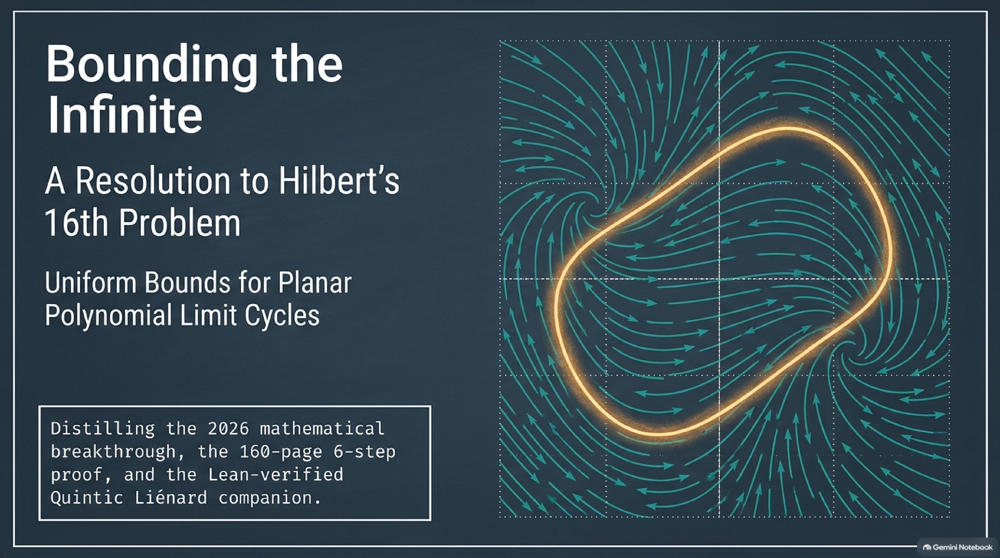

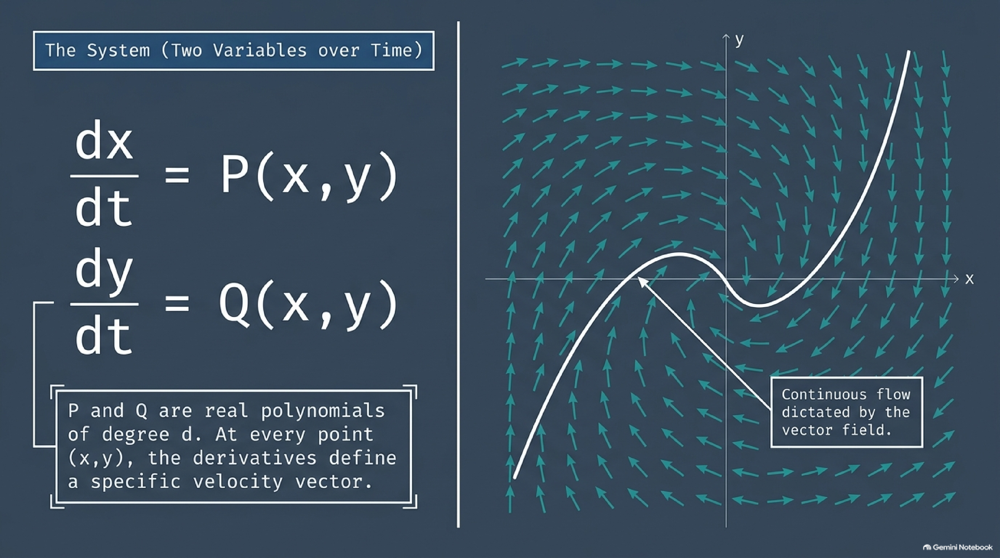


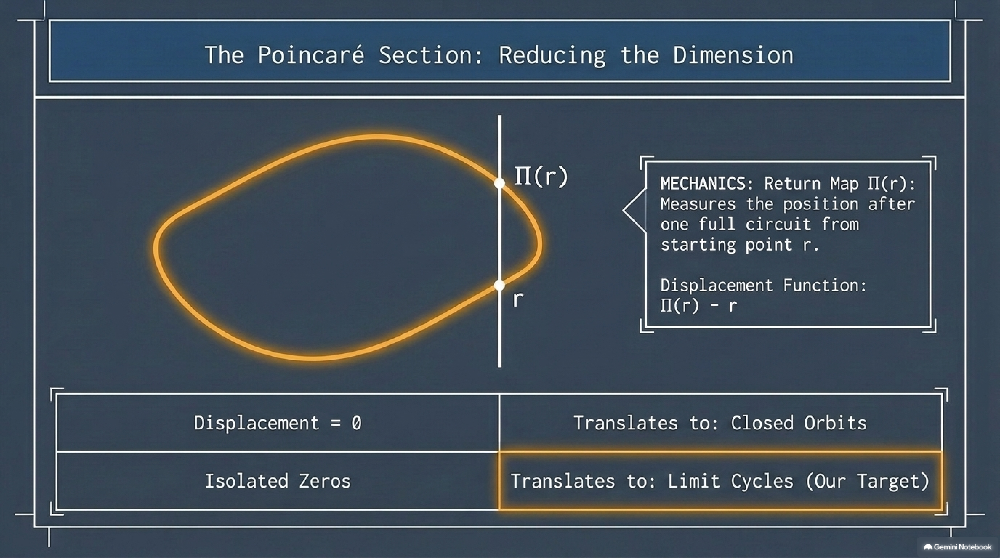

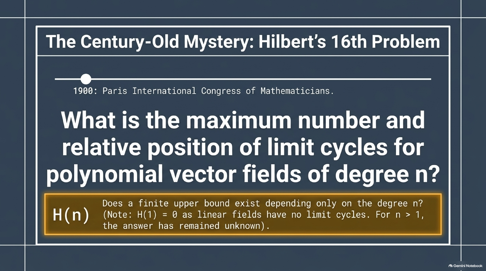


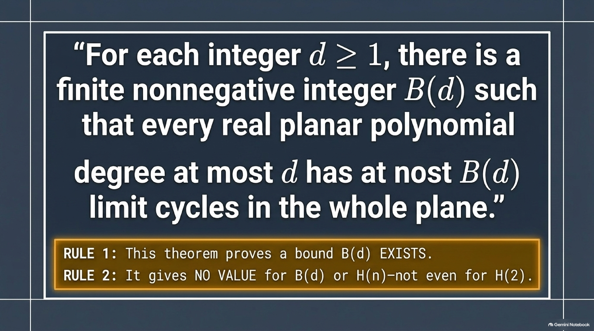


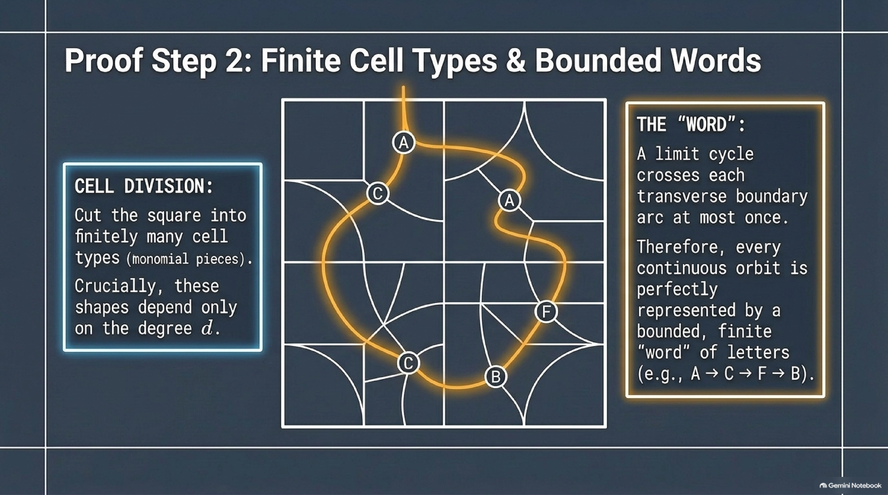

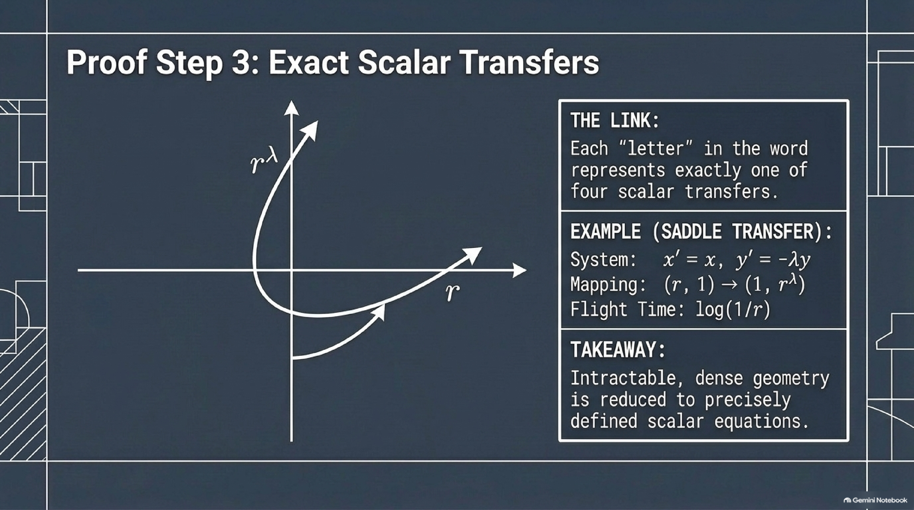


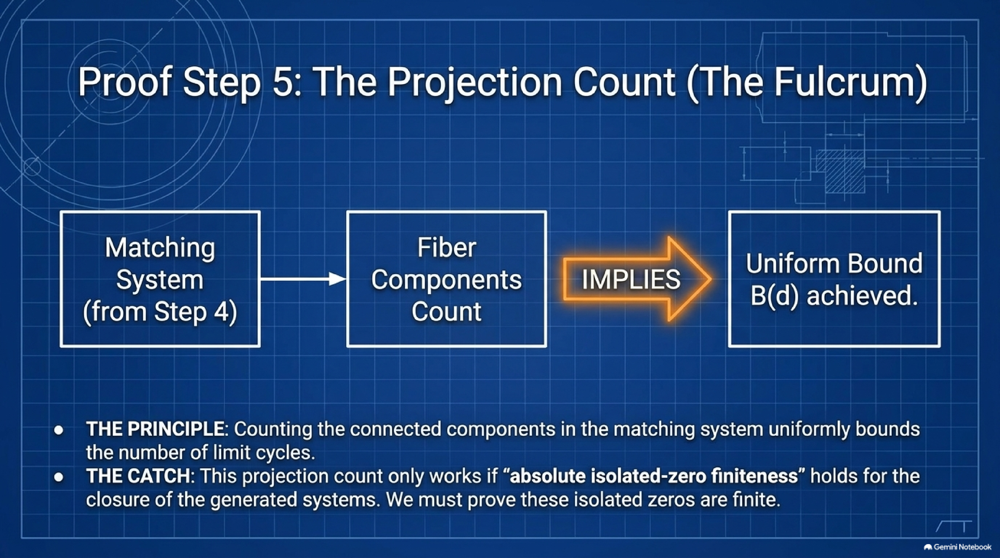

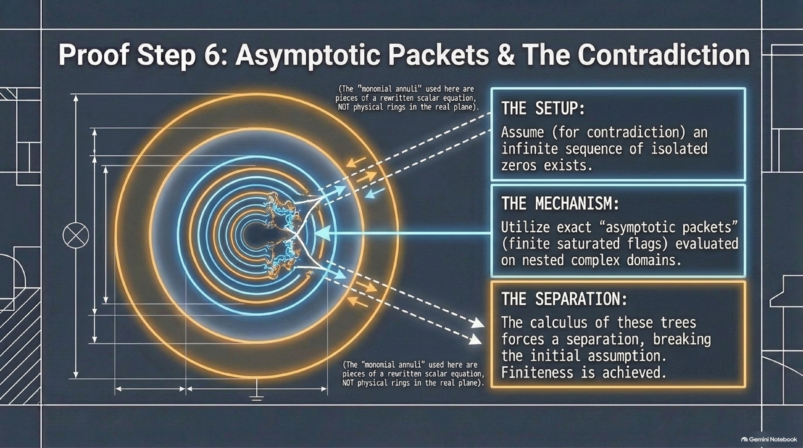

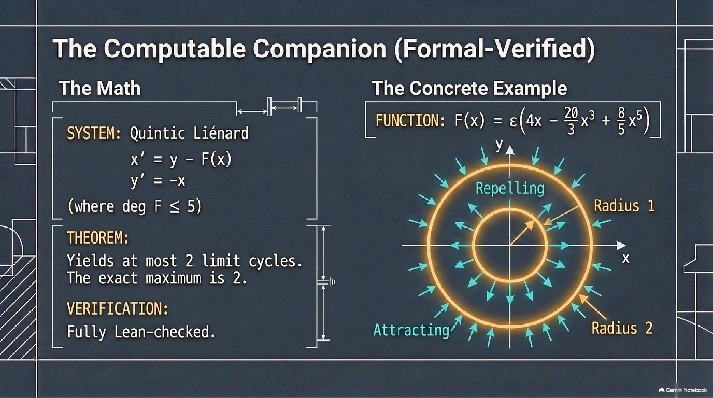

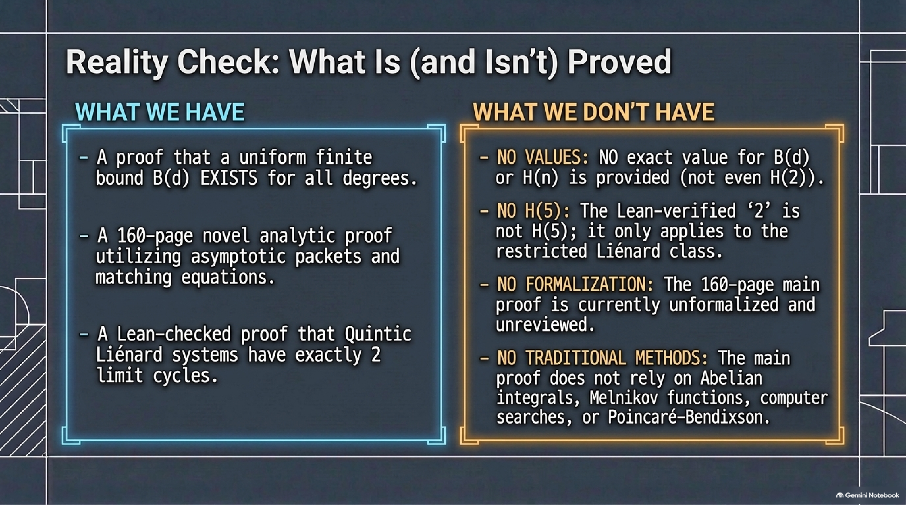

</details>

---

## How this explainer was made

1. The paper, its companion and their TeX sources were downloaded from [openai/math](https://github.com/openai/math/tree/main/preprints), together with the Lean scope document and `lean/formalization.yaml`.
2. They were loaded into a NotebookLM notebook through the [`notebooklm-mcp-cli`](https://github.com/jacob-bd/gemini-notebook-mcp-cli) CLI, along with the Wikipedia article on Hilbert's sixteenth problem for background. NotebookLM generated the slides, infographics, report, mind map and audio in [`assets/notebooklm/`](assets/notebooklm/). Every slide, both infographics, the report and the mind map were then checked against the papers; the audio was not reviewed, and the deck was not revised.
3. The text on this page was written by hand (with AI assistance) directly from the papers: the principal paper's introduction and Section 11, the statements of its main theorems in Sections 3–10, and the companion's introduction and Sections 2, 6 and 7. NotebookLM's outputs contain mistakes, listed in the [errata](assets/README.md#errata), so they were used as visual and structural aids rather than as the source of truth. The two figures were made by hand. The phase portrait and displacement curve come from a short numerical integration (fourth-order Runge–Kutta) of the companion's example.

See [`PIPELINE.md`](../../PIPELINE.md) for the exact, repeatable steps.

*Citations for the underlying papers:*

```bibtex
@misc{OAI:uniform-bounds-for-planar-polynomial-limit-cycles-September-24-2026,
  author = {{OpenAI}},
  title = {{Uniform bounds for planar polynomial limit cycles}},
  howpublished = {OpenAI Math Release preprint},
  year = {2026}
}

@misc{OAI:two-limit-cycles-for-quintic-lienard-systems-September-24-2026,
  author = {{OpenAI}},
  title = {{Two limit cycles for quintic Li{\'e}nard systems}},
  howpublished = {OpenAI Math Release preprint},
  year = {2026}
}
```
